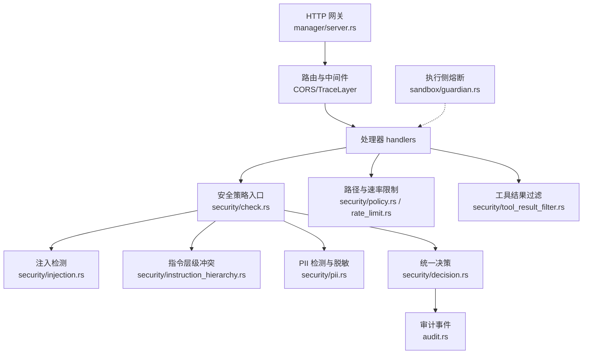
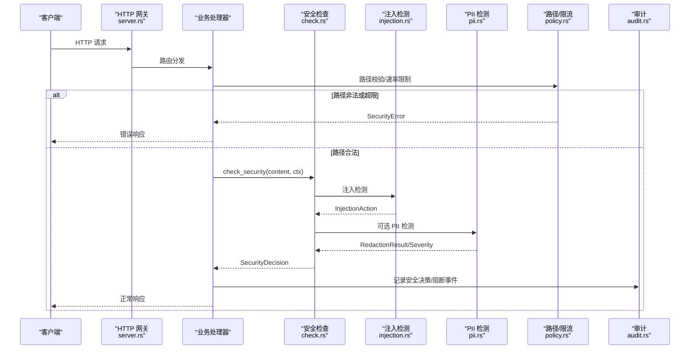
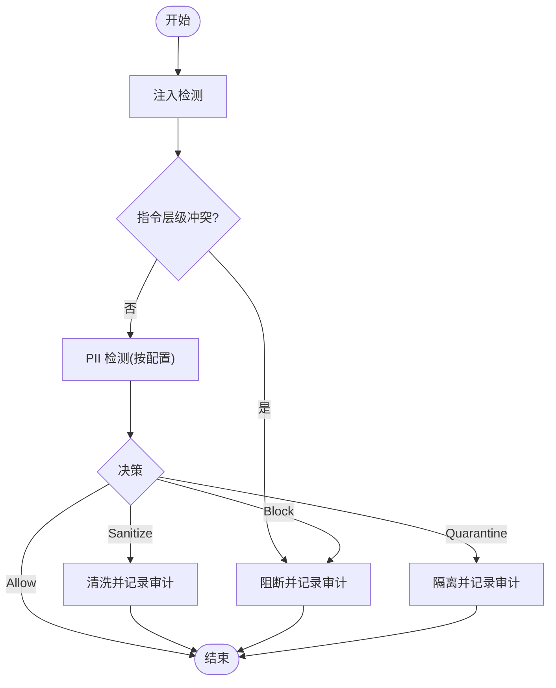
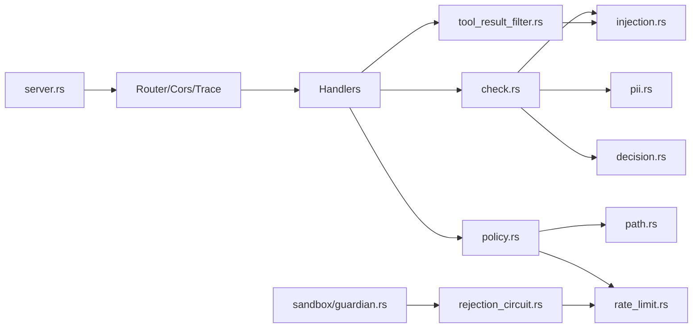

# 认证与安全

<cite>
**本文引用的文件**
- [agent-diva-manager/src/server.rs](file://agent-diva-manager/src/server.rs)
- [agent-diva-core/src/security/mod.rs](file://agent-diva-core/src/security/mod.rs)
- [agent-diva-core/src/security/config.rs](file://agent-diva-core/src/security/config.rs)
- [agent-diva-core/src/security/policy.rs](file://agent-diva-core/src/security/policy.rs)
- [agent-diva-core/src/security/path.rs](file://agent-diva-core/src/security/path.rs)
- [agent-diva-core/src/security/rate_limit.rs](file://agent-diva-core/src/security/rate_limit.rs)
- [agent-diva-core/src/security/injection.rs](file://agent-diva-core/src/security/injection.rs)
- [agent-diva-core/src/security/tool_result_filter.rs](file://agent-diva-core/src/security/tool_result_filter.rs)
- [agent-diva-core/src/security/decision.rs](file://agent-diva-core/src/security/decision.rs)
- [agent-diva-core/src/security/check.rs](file://agent-diva-core/src/security/check.rs)
- [agent-diva-core/src/security/pii.rs](file://agent-diva-core/src/security/pii.rs)
- [agent-diva-core/src/security/rejection_circuit.rs](file://agent-diva-core/src/security/rejection_circuit.rs)
- [agent-diva-sandbox/src/guardian.rs](file://agent-diva-sandbox/src/guardian.rs)
- [agent-diva-core/src/audit.rs](file://agent-diva-core/src/audit.rs)
- [agent-diva-core/tests/security_integration.rs](file://agent-diva-core/tests/security_integration.rs)
</cite>

## 目录
1. [简介](#简介)
2. [项目结构](#项目结构)
3. [核心组件](#核心组件)
4. [架构总览](#架构总览)
5. [详细组件分析](#详细组件分析)
6. [依赖关系分析](#依赖关系分析)
7. [性能考量](#性能考量)
8. [故障排查指南](#故障排查指南)
9. [结论](#结论)
10. [附录：安全配置示例与最佳实践](#附录：安全配置示例与最佳实践)

## 简介
本文件聚焦 Agent-Diva 的认证与安全机制，覆盖 API 层、运行时安全策略、输入验证与输出清理、敏感数据处理、日志脱敏与审计跟踪、以及常见威胁防护与漏洞预防。重点说明：
- HTTP 网关的 CORS 与请求体限制
- 统一的安全决策模型（允许/清洗/阻断/隔离）
- 注入检测、指令层级冲突、路径校验、速率限制与熔断
- PII 检测与可配置严重级别
- 工具结果过滤（不可信包装、注入标记、截断）
- 审计事件与可观测性
- 安全配置加载与合并规则

## 项目结构
Agent-Diva 的安全能力主要分布在 core 模块的 security 子模块中，并通过 manager 的 HTTP 服务暴露对外接口；sandbox 提供执行侧的拒绝熔断保护；audit 提供统一的审计事件通道。

图表来源
- [agent-diva-manager/src/server.rs:94-113](file://agent-diva-manager/src/server.rs#L94-L113)
- [agent-diva-core/src/security/check.rs:32-117](file://agent-diva-core/src/security/check.rs#L32-L117)
- [agent-diva-core/src/security/injection.rs:74-111](file://agent-diva-core/src/security/injection.rs#L74-L111)
- [agent-diva-core/src/security/pii.rs:302-627](file://agent-diva-core/src/security/pii.rs#L302-L627)
- [agent-diva-core/src/security/decision.rs:15-42](file://agent-diva-core/src/security/decision.rs#L15-L42)
- [agent-diva-core/src/audit.rs:224-253](file://agent-diva-core/src/audit.rs#L224-L253)
- [agent-diva-core/src/security/policy.rs:84-201](file://agent-diva-core/src/security/policy.rs#L84-L201)
- [agent-diva-core/src/security/rate_limit.rs:32-83](file://agent-diva-core/src/security/rate_limit.rs#L32-L83)
- [agent-diva-core/src/security/tool_result_filter.rs:48-132](file://agent-diva-core/src/security/tool_result_filter.rs#L48-L132)
- [agent-diva-sandbox/src/guardian.rs:502-571](file://agent-diva-sandbox/src/guardian.rs#L502-L571)

章节来源
- [agent-diva-manager/src/server.rs:94-113](file://agent-diva-manager/src/server.rs#L94-L113)
- [agent-diva-core/src/security/mod.rs:26-68](file://agent-diva-core/src/security/mod.rs#L26-L68)

## 核心组件
- 统一安全决策：SecurityDecision 将检测结果抽象为 Allow/Sanitize/Block/Quarantine，便于上层一致处理。
- 安全检查编排：check_security 串联注入检测、指令层级冲突等，输出统一决策并触发审计。
- 注入检测：基于正则集的模式匹配，区分用户消息与工具输出场景，支持角色覆盖、越狱等模式识别。
- 指令层级冲突：对低层级指令尝试覆盖高层级指令进行拦截或降级。
- PII 检测与脱敏：多类别敏感信息检测，支持按类别设置严重级别（Warning/Error），默认关闭运行时替换但保留检测与审计。
- 路径与速率限制：多层路径校验（空字节、遍历、URL编码遍历、波浪号展开、绝对路径、禁止前缀/扩展名），结合滑动窗口 ActionTracker 实现限流。
- 工具结果过滤：不可信包装、注入标记、长度截断，防止上下文耗尽与指令注入。
- 拒绝熔断：针对 provider 连续拒绝的滑动窗口熔断，避免死循环。
- 审计：结构化事件通过 tracing target "audit" 输出，供 GUI/CLI 消费。

章节来源
- [agent-diva-core/src/security/decision.rs:15-42](file://agent-diva-core/src/security/decision.rs#L15-L42)
- [agent-diva-core/src/security/check.rs:32-117](file://agent-diva-core/src/security/check.rs#L32-L117)
- [agent-diva-core/src/security/injection.rs:74-111](file://agent-diva-core/src/security/injection.rs#L74-L111)
- [agent-diva-core/src/security/pii.rs:302-627](file://agent-diva-core/src/security/pii.rs#L302-L627)
- [agent-diva-core/src/security/policy.rs:84-201](file://agent-diva-core/src/security/policy.rs#L84-L201)
- [agent-diva-core/src/security/rate_limit.rs:32-83](file://agent-diva-core/src/security/rate_limit.rs#L32-L83)
- [agent-diva-core/src/security/tool_result_filter.rs:48-132](file://agent-diva-core/src/security/tool_result_filter.rs#L48-L132)
- [agent-diva-core/src/security/rejection_circuit.rs:22-56](file://agent-diva-core/src/security/rejection_circuit.rs#L22-L56)
- [agent-diva-core/src/audit.rs:224-253](file://agent-diva-core/src/audit.rs#L224-L253)

## 架构总览
下图展示一次典型请求从进入 HTTP 网关到安全决策与审计的完整流程。

图表来源
- [agent-diva-manager/src/server.rs:94-113](file://agent-diva-manager/src/server.rs#L94-L113)
- [agent-diva-core/src/security/check.rs:32-117](file://agent-diva-core/src/security/check.rs#L32-L117)
- [agent-diva-core/src/security/injection.rs:74-111](file://agent-diva-core/src/security/injection.rs#L74-L111)
- [agent-diva-core/src/security/pii.rs:302-627](file://agent-diva-core/src/security/pii.rs#L302-L627)
- [agent-diva-core/src/security/policy.rs:84-201](file://agent-diva-core/src/security/policy.rs#L84-L201)
- [agent-diva-core/src/audit.rs:224-253](file://agent-diva-core/src/audit.rs#L224-L253)

## 详细组件分析

### HTTP 网关与跨域控制
- 监听地址：默认绑定 127.0.0.1，仅本地访问。
- CORS：使用 permissive 策略，允许跨域请求。生产部署建议根据实际域名收紧。
- 追踪：启用 TraceLayer 用于 HTTP 请求追踪。
- 请求体限制：上传接口设置了最大请求体大小限制（例如 50MB）。

章节来源
- [agent-diva-manager/src/server.rs:45-59](file://agent-diva-manager/src/server.rs#L45-L59)
- [agent-diva-manager/src/server.rs:94-113](file://agent-diva-manager/src/server.rs#L94-L113)
- [agent-diva-manager/src/server.rs:287-289](file://agent-diva-manager/src/server.rs#L287-L289)

### 统一安全决策与检查编排
- 决策类型：Allow（放行）、Sanitize（清洗并记录发现）、Block（阻断）、Quarantine（隔离审查）。
- 编排逻辑：先进行注入检测，再处理指令层级冲突，最后生成统一决策并写入审计。
- 审计事件：对 Block/Sanitize/Quarantine 分别记录相应事件，包含来源类型、原因与严重级别。

图表来源
- [agent-diva-core/src/security/check.rs:32-117](file://agent-diva-core/src/security/check.rs#L32-L117)
- [agent-diva-core/src/security/decision.rs:15-42](file://agent-diva-core/src/security/decision.rs#L15-L42)
- [agent-diva-core/src/audit.rs:118-182](file://agent-diva-core/src/audit.rs#L118-L182)

章节来源
- [agent-diva-core/src/security/check.rs:32-117](file://agent-diva-core/src/security/check.rs#L32-L117)
- [agent-diva-core/src/security/decision.rs:15-42](file://agent-diva-core/src/security/decision.rs#L15-L42)
- [agent-diva-core/src/audit.rs:118-182](file://agent-diva-core/src/audit.rs#L118-L182)

### 注入检测与指令层级
- 注入检测：基于预编译的正则集，区分 UserMessage 与 ToolOutput 两种上下文，识别角色覆盖、工具输出注入、越狱等模式。
- 指令层级：当检测到低层级指令试图覆盖高层级指令时，进行冲突判定与处置（通常为阻断或降级）。

章节来源
- [agent-diva-core/src/security/injection.rs:74-111](file://agent-diva-core/src/security/injection.rs#L74-L111)

### PII 检测与脱敏
- 支持类别：邮箱、电话、中国身份证、信用卡、API Key、IP、护照、银行卡、自定义规则。
- 严重级别：Warning（替换为占位符并继续处理）、Error（直接拒绝，不替换原文）。
- 默认行为：当前默认关闭运行时的 PII 隐藏（enabled=false），但仍保留检测与审计能力；可通过配置开启。
- 审计：按类别统计并记录 PiiRedacted 事件。

章节来源
- [agent-diva-core/src/security/pii.rs:302-627](file://agent-diva-core/src/security/pii.rs#L302-L627)
- [agent-diva-core/src/audit.rs:61-65](file://agent-diva-core/src/audit.rs#L61-L65)

### 路径校验与速率限制
- 路径校验：多层防御，包括空字节、路径遍历、URL 编码遍历、波浪号展开、绝对路径限制、禁止前缀/扩展名、解析后工作区边界检查、符号链接限制。
- 速率限制：滑动窗口 ActionTracker，按小时计数，超过阈值返回 RateLimitExceeded。
- 只读模式：Paranoid 级别或显式 read_only=true 时禁止写操作。

章节来源
- [agent-diva-core/src/security/policy.rs:84-201](file://agent-diva-core/src/security/policy.rs#L84-L201)
- [agent-diva-core/src/security/path.rs:8-42](file://agent-diva-core/src/security/path.rs#L8-L42)
- [agent-diva-core/src/security/rate_limit.rs:32-83](file://agent-diva-core/src/security/rate_limit.rs#L32-L83)

### 工具结果过滤
- 不可信包装：所有工具输出以 <untrusted>...</untrusted> 包裹，提示 LLM 外部来源。
- 注入标记：检测工具输出中的注入模式并标注 [SUSPICIOUS]。
- 截断：限制工具结果最大字符数，防止上下文耗尽攻击。

章节来源
- [agent-diva-core/src/security/tool_result_filter.rs:48-132](file://agent-diva-core/src/security/tool_result_filter.rs#L48-L132)

### 拒绝熔断（Provider 拒绝风暴）
- 目的：在 provider 连续拒绝（如限速、上下文过长、鉴权失败）时，阻止新一轮模型迭代，避免死循环。
- 机制：滑动窗口内累计拒绝次数，达到阈值即触发熔断；窗口滑过或人工 reset 后恢复。
- 沙箱侧：GuardianRejectionCircuitBreaker 将自动批准决策转为拒绝，或将延迟决策转为需审批。

章节来源
- [agent-diva-core/src/security/rejection_circuit.rs:22-56](file://agent-diva-core/src/security/rejection_circuit.rs#L22-L56)
- [agent-diva-sandbox/src/guardian.rs:502-571](file://agent-diva-sandbox/src/guardian.rs#L502-L571)

### 审计与可观测性
- 统一入口：audit::emit 将事件以 JSON 行写入 tracing target "audit"。
- 关键事件：InjectionDetected、PiiRedacted、MessageBlocked、ToolOutputSanitized、SkillLoaded/Rejected/Quarantined、ChannelAuthFailed/MessageBlocked、SecurityPolicyDecision 等。
- 下游消费：GUI/CLI 订阅 audit 目标，重建事件流。

章节来源
- [agent-diva-core/src/audit.rs:224-253](file://agent-diva-core/src/audit.rs#L224-L253)
- [agent-diva-core/src/audit.rs:39-222](file://agent-diva-core/src/audit.rs#L39-L222)

## 依赖关系分析
- server.rs 构建 Router 并挂载 CORS 与 TraceLayer，随后合并各功能路由。
- 安全模块通过 mod.rs 统一导出常用类型与函数，供上层调用。
- policy.rs 组合 path、rate_limit、config 完成路径与限流策略。
- check.rs 协调 injection、instruction_hierarchy、pii 形成统一决策。
- tool_result_filter 依赖 injection 检测工具输出注入。
- rejection_circuit 复用 rate_limit 的 ActionTracker 实现滑动窗口计数。
- sandbox guardian 与 core 的 rejection circuit 共同构成执行侧与调度侧的双重保护。

图表来源
- [agent-diva-manager/src/server.rs:94-113](file://agent-diva-manager/src/server.rs#L94-L113)
- [agent-diva-core/src/security/mod.rs:26-68](file://agent-diva-core/src/security/mod.rs#L26-L68)
- [agent-diva-core/src/security/policy.rs:84-201](file://agent-diva-core/src/security/policy.rs#L84-L201)
- [agent-diva-core/src/security/check.rs:32-117](file://agent-diva-core/src/security/check.rs#L32-L117)
- [agent-diva-core/src/security/tool_result_filter.rs:48-132](file://agent-diva-core/src/security/tool_result_filter.rs#L48-L132)
- [agent-diva-core/src/security/rejection_circuit.rs:22-56](file://agent-diva-core/src/security/rejection_circuit.rs#L22-L56)
- [agent-diva-sandbox/src/guardian.rs:502-571](file://agent-diva-sandbox/src/guardian.rs#L502-L571)

## 性能考量
- 注入检测使用预编译正则集，减少重复开销。
- PII 检测采用多阶段候选收集与右向左替换，避免索引偏移问题；默认关闭运行时替换以降低影响。
- 工具结果截断限制上下文占用，防止大输出导致性能退化。
- 滑动窗口限流与熔断避免雪崩与死循环，提升系统稳定性。
- 审计事件通过 tracing 低开销输出，不影响主流程。

## 故障排查指南
- 路径相关错误：检查 forbidden_paths、forbidden_extensions、workspace_only 与 allow_symlinks 配置；确认路径未包含空字节或遍历组件。
- 速率限制：查看 ActionTracker 窗口与 max_actions_per_hour；必要时调整窗口或阈值。
- 注入阻断：检查 injection_block_threshold 与注入模式库；关注审计事件 InjectionDetected 与 MessageBlocked。
- PII 误报/漏报：调整 PiiConfig 的 category_severity 与 enabled；确认 memory record id 等受保护片段未被误伤。
- 熔断触发：观察 rejection_circuit_window_secs 与 threshold；若频繁触发，检查 provider 错误与重试策略。
- 审计缺失：确认 audit sink 已注册且 tracing target "audit" 被正确消费。

章节来源
- [agent-diva-core/src/security/policy.rs:84-201](file://agent-diva-core/src/security/policy.rs#L84-L201)
- [agent-diva-core/src/security/rate_limit.rs:32-83](file://agent-diva-core/src/security/rate_limit.rs#L32-L83)
- [agent-diva-core/src/security/check.rs:32-117](file://agent-diva-core/src/security/check.rs#L32-L117)
- [agent-diva-core/src/security/pii.rs:302-627](file://agent-diva-core/src/security/pii.rs#L302-L627)
- [agent-diva-core/src/security/rejection_circuit.rs:22-56](file://agent-diva-core/src/security/rejection_circuit.rs#L22-L56)
- [agent-diva-core/src/audit.rs:224-253](file://agent-diva-core/src/audit.rs#L224-L253)

## 结论
Agent-Diva 构建了从 HTTP 网关到运行时执行的纵深安全体系：通过统一决策模型、注入检测、指令层级保护、路径与速率限制、PII 检测与审计、以及拒绝熔断，有效应对常见威胁。建议在部署时根据环境收紧 CORS、调整阈值与策略，并结合审计事件持续优化。

## 附录：安全配置示例与最佳实践
- 配置加载顺序与合并
  - 优先读取工作区 .agent-diva/security.json
  - 其次读取家目录 .agent-diva/security.json
  - 最后回退到家目录 config.json 的 security 嵌套段
  - 非默认值会覆盖基础配置

- 关键配置项
  - level：Permissive/Standard/Strict/Paranoid
  - workspace_only：是否限制在工作区内
  - max_actions_per_hour：每小时动作上限
  - forbidden_paths/forbidden_extensions：禁止路径前缀与扩展名
  - allowed_roots：额外允许的根路径
  - read_only：是否只读
  - max_file_size：最大文件大小
  - allow_symlinks：是否允许符号链接
  - pii_enabled/pii_severity：PII 开关与严重级别
  - injection_enabled/injection_block_threshold：注入检测开关与阻断阈值
  - global_tool_timeout_secs：工具全局超时
  - token_budget_limit/per_task_token_budget：会话/任务级 Token 预算
  - rejection_circuit_window_secs/rejection_circuit_threshold：拒绝熔断窗口与阈值

- 最佳实践
  - 生产环境将 CORS 改为严格白名单，仅允许可信前端域名
  - 启用 workspace_only 与禁止危险扩展，限制符号链接
  - 合理设置 max_actions_per_hour 与 global_tool_timeout_secs，避免资源滥用
  - 根据业务敏感度调整 PII 严重级别与阈值
  - 监控审计事件，建立告警规则（如 MessageBlocked、InjectionDetected、RateLimitExceeded）
  - 定期评估注入模式库与 PII 规则，降低误报与漏报
  - 对 provider 不稳定场景调优拒绝熔断参数，避免误触发

章节来源
- [agent-diva-core/src/security/config.rs:181-325](file://agent-diva-core/src/security/config.rs#L181-L325)
- [agent-diva-manager/src/server.rs:94-113](file://agent-diva-manager/src/server.rs#L94-L113)
- [agent-diva-core/tests/security_integration.rs:17-39](file://agent-diva-core/tests/security_integration.rs#L17-L39)