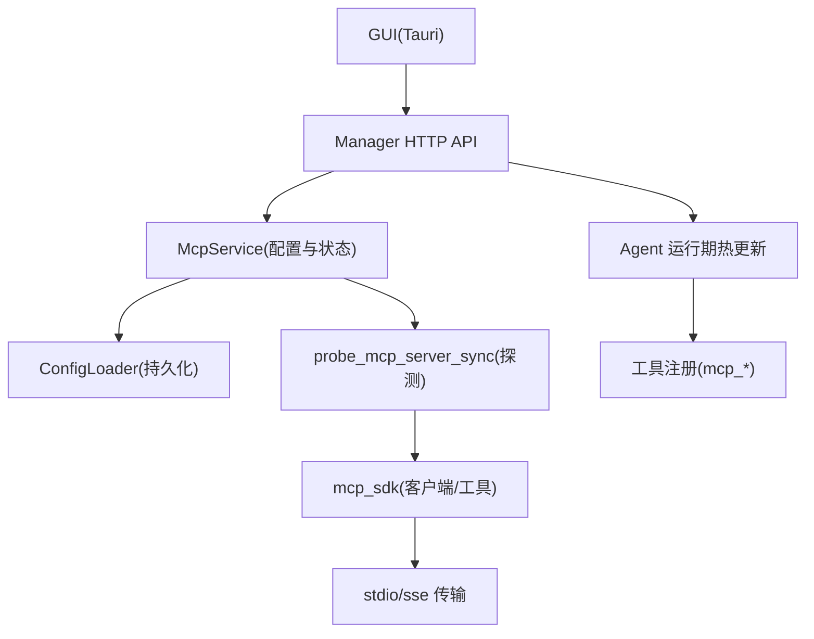
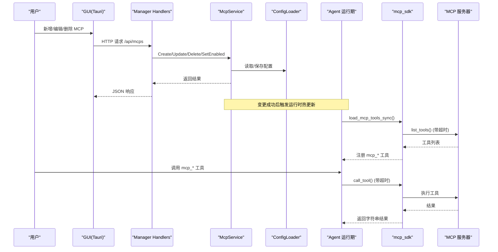
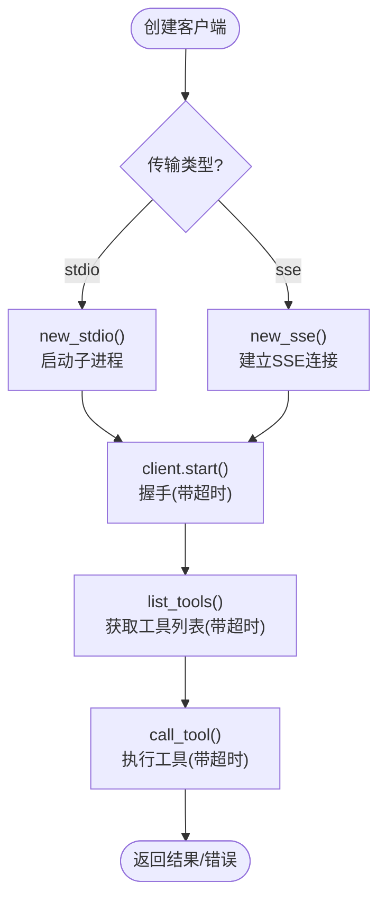
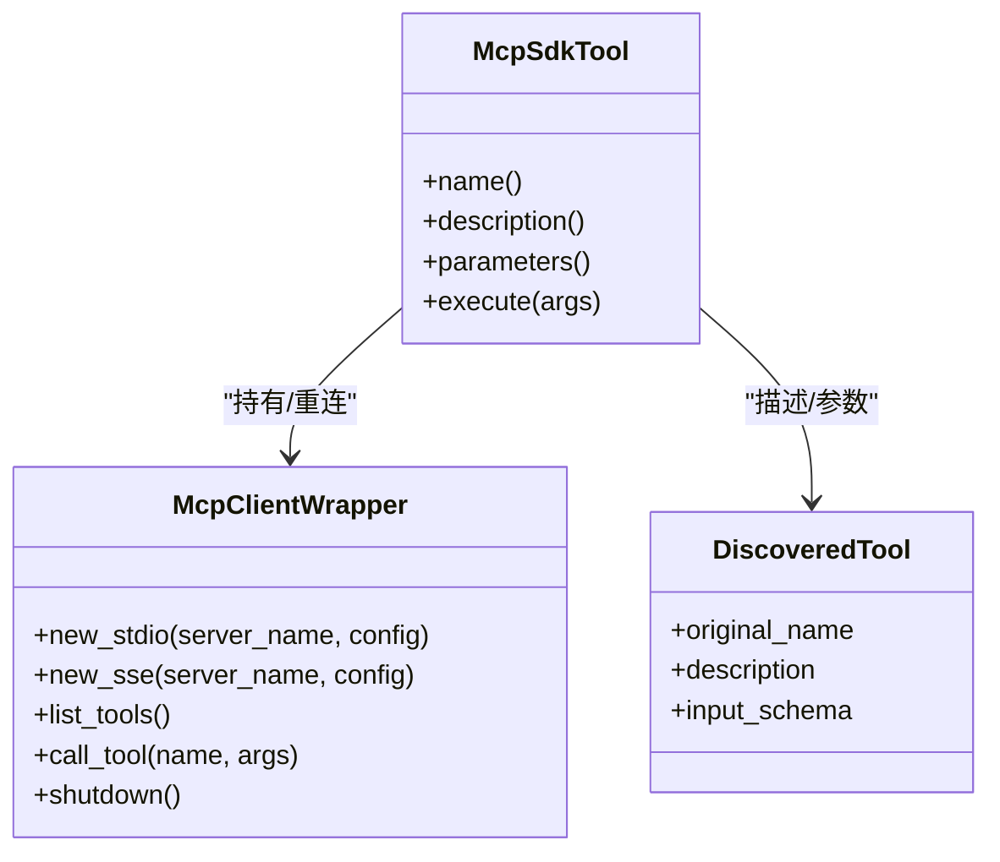
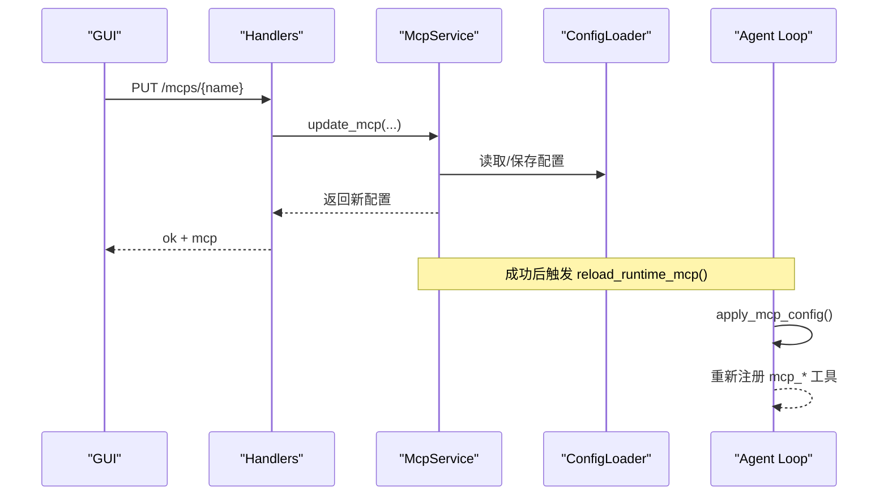
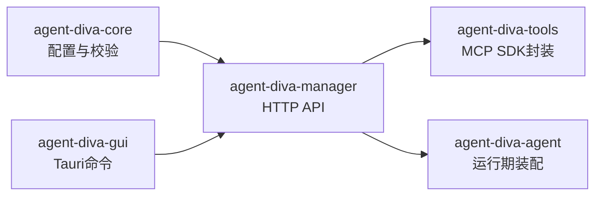

# MCP 协议集成

<cite>
**本文引用的文件**
- [agent-diva-tools/src/mcp_sdk.rs](file://agent-diva-tools/src/mcp_sdk.rs)
- [agent-diva-manager/src/mcp_service.rs](file://agent-diva-manager/src/mcp_service.rs)
- [agent-diva-agent/src/agent_loop/loop_tools.rs](file://agent-diva-agent/src/agent_loop/loop_tools.rs)
- [agent-diva-manager/src/handlers.rs](file://agent-diva-manager/src/handlers.rs)
- [agent-diva-gui/src-tauri/src/commands.rs](file://agent-diva-gui/src-tauri/src/commands.rs)
- [agent-diva-core/src/config/schema.rs](file://agent-diva-core/src/config/schema.rs)
- [agent-diva-core/src/config/validate.rs](file://agent-diva-core/src/config/validate.rs)
</cite>

## 目录
1. [简介](#简介)
2. [项目结构](#项目结构)
3. [核心组件](#核心组件)
4. [架构总览](#架构总览)
5. [详细组件分析](#详细组件分析)
6. [依赖关系分析](#依赖关系分析)
7. [性能与可靠性](#性能与可靠性)
8. [故障排查指南](#故障排查指南)
9. [结论](#结论)
10. [附录：配置与使用示例](#附录配置与使用示例)

## 简介
本文件面向需要在 Agent Diva 中集成 Model Context Protocol（MCP）的开发者，系统性说明 MCP 协议在本工程中的实现方式、服务器发现与连接机制、工具动态加载与调用流程、错误处理与重试策略、安全控制与权限管理，以及性能监控与调试方法。文档基于仓库内实际代码进行分析，提供可追溯的文件来源与图示，帮助读者快速理解并正确集成 MCP。

## 项目结构
Agent Diva 对 MCP 的支持由多个模块协作完成：
- agent-diva-tools：封装 rust-mcp-sdk，提供 MCP 客户端、工具发现与调用、超时保护、结果清洗等能力。
- agent-diva-manager：提供 MCP 服务器的配置管理 API（创建、更新、删除、启用/禁用），并在变更后触发运行时热更新。
- agent-diva-agent：在 Agent 运行期应用 MCP 配置，动态注册/注销 mcp_* 工具，并传递给子代理管理器。
- agent-diva-gui：通过 Tauri 命令调用后端 API，提供 MCP 设置界面。
- agent-diva-core：定义配置结构与校验规则，包括 MCP 服务器配置字段与约束。

图表来源
- [agent-diva-manager/src/handlers.rs:806-859](file://agent-diva-manager/src/handlers.rs#L806-L859)
- [agent-diva-manager/src/mcp_service.rs:62-234](file://agent-diva-manager/src/mcp_service.rs#L62-L234)
- [agent-diva-tools/src/mcp_sdk.rs:101-267](file://agent-diva-tools/src/mcp_sdk.rs#L101-L267)
- [agent-diva-agent/src/agent_loop/loop_tools.rs:48-69](file://agent-diva-agent/src/agent_loop/loop_tools.rs#L48-L69)

章节来源
- [agent-diva-manager/src/handlers.rs:806-859](file://agent-diva-manager/src/handlers.rs#L806-L859)
- [agent-diva-manager/src/mcp_service.rs:62-234](file://agent-diva-manager/src/mcp_service.rs#L62-L234)
- [agent-diva-tools/src/mcp_sdk.rs:101-267](file://agent-diva-tools/src/mcp_sdk.rs#L101-L267)
- [agent-diva-agent/src/agent_loop/loop_tools.rs:48-69](file://agent-diva-agent/src/agent_loop/loop_tools.rs#L48-L69)

## 核心组件
- MCP 客户端封装（McpClientWrapper）：负责启动 stdio/SSE 传输、握手、列出工具、调用工具、关闭会话，并提供超时保护。
- MCP 工具包装（McpSdkTool）：将远程 MCP 工具暴露为本地 Tool 接口，支持自动重连与指数退避。
- MCP 服务（McpService）：提供 MCP 配置的 CRUD 与状态查询，并在变更后触发运行时刷新。
- 运行期工具装配（AgentLoop.apply_mcp_config）：根据当前 MCP 配置动态注册/注销 mcp_* 工具。
- GUI/Tauri 命令：提供 MCP 管理的用户操作入口。

章节来源
- [agent-diva-tools/src/mcp_sdk.rs:85-267](file://agent-diva-tools/src/mcp_sdk.rs#L85-L267)
- [agent-diva-tools/src/mcp_sdk.rs:323-441](file://agent-diva-tools/src/mcp_sdk.rs#L323-L441)
- [agent-diva-manager/src/mcp_service.rs:52-234](file://agent-diva-manager/src/mcp_service.rs#L52-L234)
- [agent-diva-agent/src/agent_loop/loop_tools.rs:48-69](file://agent-diva-agent/src/agent_loop/loop_tools.rs#L48-L69)
- [agent-diva-gui/src-tauri/src/commands.rs:3937-3995](file://agent-diva-gui/src-tauri/src/commands.rs#L3937-L3995)

## 架构总览
下图展示了从 GUI 到 MCP 工具调用的端到端流程，包括配置管理、运行时热更新、工具发现与调用。

图表来源
- [agent-diva-manager/src/handlers.rs:806-859](file://agent-diva-manager/src/handlers.rs#L806-L859)
- [agent-diva-manager/src/mcp_service.rs:62-234](file://agent-diva-manager/src/mcp_service.rs#L62-L234)
- [agent-diva-tools/src/mcp_sdk.rs:209-267](file://agent-diva-tools/src/mcp_sdk.rs#L209-L267)
- [agent-diva-agent/src/agent_loop/loop_tools.rs:48-69](file://agent-diva-agent/src/agent_loop/loop_tools.rs#L48-L69)

## 详细组件分析

### MCP 客户端与传输层（stdio/SSE）
- 支持两种传输：
  - stdio：通过外部命令启动 MCP 服务器进程，传入参数与环境变量。
  - SSE：通过 HTTP URL 建立 SSE 传输。
- 握手阶段会发送初始化信息（包含客户端名称、版本、协议版本）。
- 所有关键操作（启动、list_tools、call_tool）均包裹超时，防止阻塞。
- 输出内容会进行 JSON 字符串清洗，去除控制字符。

图表来源
- [agent-diva-tools/src/mcp_sdk.rs:101-267](file://agent-diva-tools/src/mcp_sdk.rs#L101-L267)

章节来源
- [agent-diva-tools/src/mcp_sdk.rs:101-267](file://agent-diva-tools/src/mcp_sdk.rs#L101-L267)

### 工具动态加载与调用
- 加载流程：
  - 遍历已启用的 MCP 服务器配置，逐个创建客户端并调用 list_tools。
  - 将发现的工具包装为 McpSdkTool，统一以 mcp_<server>_<tool> 命名注册到工具集。
- 调用流程：
  - 首次调用时若客户端不存在或失效，则尝试自动重连（最多 5 次，指数退避）。
  - 调用 call_tool 并渲染结果为字符串，同时检查 is_error 标志。

图表来源
- [agent-diva-tools/src/mcp_sdk.rs:77-90](file://agent-diva-tools/src/mcp_sdk.rs#L77-L90)
- [agent-diva-tools/src/mcp_sdk.rs:323-441](file://agent-diva-tools/src/mcp_sdk.rs#L323-L441)

章节来源
- [agent-diva-tools/src/mcp_sdk.rs:464-522](file://agent-diva-tools/src/mcp_sdk.rs#L464-L522)
- [agent-diva-tools/src/mcp_sdk.rs:560-611](file://agent-diva-tools/src/mcp_sdk.rs#L560-L611)
- [agent-diva-agent/src/agent_loop/loop_tools.rs:48-69](file://agent-diva-agent/src/agent_loop/loop_tools.rs#L48-L69)

### 服务器发现与连接管理
- 发现：通过 list_tools 获取可用工具集合；失败时记录警告并跳过该服务器。
- 连接管理：
  - 启动握手阶段有超时限制（clamp 到 10~120 秒）。
  - 工具调用具备超时保护（默认 30 秒，可配置）。
  - 客户端生命周期由工具包装器管理，必要时自动重连。

章节来源
- [agent-diva-tools/src/mcp_sdk.rs:190-267](file://agent-diva-tools/src/mcp_sdk.rs#L190-L267)
- [agent-diva-tools/src/mcp_sdk.rs:377-441](file://agent-diva-tools/src/mcp_sdk.rs#L377-L441)

### 配置管理与运行时热更新
- 配置模型：
  - MCPServerConfig 包含 command/url、args、env、tool_timeout 等字段。
  - 校验规则要求至少提供 command 或 url，且不能同时提供两者。
- 管理 API：
  - 提供 get/create/update/delete/set_enabled 等接口。
  - 变更后立即触发运行时热更新，无需重启应用。
- 运行期应用：
  - 卸载现有 mcp_* 工具，重新加载并注册新的工具集合。
  - 同步更新子代理管理器的 MCP 服务器上下文。

图表来源
- [agent-diva-manager/src/handlers.rs:839-859](file://agent-diva-manager/src/handlers.rs#L839-L859)
- [agent-diva-manager/src/mcp_service.rs:92-125](file://agent-diva-manager/src/mcp_service.rs#L92-L125)
- [agent-diva-agent/src/agent_loop/loop_tools.rs:48-69](file://agent-diva-agent/src/agent_loop/loop_tools.rs#L48-L69)

章节来源
- [agent-diva-manager/src/mcp_service.rs:62-234](file://agent-diva-manager/src/mcp_service.rs#L62-L234)
- [agent-diva-core/src/config/validate.rs:30-32](file://agent-diva-core/src/config/validate.rs#L30-L32)
- [agent-diva-agent/src/agent_loop/loop_tools.rs:48-69](file://agent-diva-agent/src/agent_loop/loop_tools.rs#L48-L69)

### 错误处理与重试机制
- 错误分类：
  - 进程启动失败、连接失败、超时、SDK 错误、服务端错误、配置错误。
- 重试策略：
  - 工具调用前若客户端缺失或失效，自动尝试重连最多 5 次，采用指数退避（最大延迟 60 秒）。
- 结果处理：
  - 检查 is_error 标志，将服务端错误转换为结构化错误。
  - 输出清洗避免控制字符污染。

章节来源
- [agent-diva-tools/src/mcp_sdk.rs:51-71](file://agent-diva-tools/src/mcp_sdk.rs#L51-L71)
- [agent-diva-tools/src/mcp_sdk.rs:377-441](file://agent-diva-tools/src/mcp_sdk.rs#L377-L441)
- [agent-diva-tools/src/mcp_sdk.rs:297-317](file://agent-diva-tools/src/mcp_sdk.rs#L297-L317)

### 安全控制与权限管理
- 环境变量透传：
  - 当前实现会将配置中的 env 整体透传给 MCP 子进程，存在敏感信息泄露风险。
  - 建议后续引入白名单或黑名单过滤机制，仅传递必要的环境变量。
- 请求大小限制：
  - 当前未发现对请求/响应大小的限制，存在被恶意 MCP 服务器耗尽内存的风险。
  - 建议在 call_tool 处增加响应大小检查与截断策略。
- 工具访问控制：
  - 可通过 mask 的工具限制策略对 mcp 工具进行允许/拒绝控制。

章节来源
- [agent-diva-tools/src/mcp_sdk.rs:120-132](file://agent-diva-tools/src/mcp_sdk.rs#L120-L132)
- [agent-diva-core/src/config/schema.rs:97-161](file://agent-diva-core/src/config/schema.rs#L97-L161)

### 性能监控与调试
- 日志与观测：
  - 使用 tracing 记录 stderr 输出与错误信息，便于定位问题。
  - 工具结果渲染时会清理控制字符，有助于调试输出。
- 超时与短路：
  - 多层超时保护确保不会因 MCP 服务器挂起导致主流程阻塞。
- 状态查询：
  - 通过 McpService.to_dto 返回连接状态（connected/degraded/invalid）、工具数量与错误信息，便于前端展示与监控。

章节来源
- [agent-diva-tools/src/mcp_sdk.rs:275-295](file://agent-diva-tools/src/mcp_sdk.rs#L275-L295)
- [agent-diva-manager/src/mcp_service.rs:167-221](file://agent-diva-manager/src/mcp_service.rs#L167-L221)

## 依赖关系分析
- agent-diva-tools 依赖 rust-mcp-sdk 提供的传输与消息协议。
- agent-diva-manager 依赖 agent-diva-core 的配置结构与加载器，并通过 handlers 暴露 HTTP API。
- agent-diva-agent 在运行期消费 MCP 配置，动态装配工具集。
- GUI 通过 Tauri 命令调用后端 API，形成前后端闭环。

图表来源
- [agent-diva-core/src/config/schema.rs:1-200](file://agent-diva-core/src/config/schema.rs#L1-L200)
- [agent-diva-manager/src/handlers.rs:806-859](file://agent-diva-manager/src/handlers.rs#L806-L859)
- [agent-diva-tools/src/mcp_sdk.rs:101-267](file://agent-diva-tools/src/mcp_sdk.rs#L101-L267)
- [agent-diva-agent/src/agent_loop/loop_tools.rs:48-69](file://agent-diva-agent/src/agent_loop/loop_tools.rs#L48-L69)

章节来源
- [agent-diva-core/src/config/schema.rs:1-200](file://agent-diva-core/src/config/schema.rs#L1-L200)
- [agent-diva-manager/src/handlers.rs:806-859](file://agent-diva-manager/src/handlers.rs#L806-L859)
- [agent-diva-tools/src/mcp_sdk.rs:101-267](file://agent-diva-tools/src/mcp_sdk.rs#L101-L267)
- [agent-diva-agent/src/agent_loop/loop_tools.rs:48-69](file://agent-diva-agent/src/agent_loop/loop_tools.rs#L48-L69)

## 性能与可靠性
- 超时保护：
  - 启动握手、list_tools、call_tool 均设置超时，避免长时间阻塞。
- 自动重连：
  - 工具调用前检测客户端有效性，必要时自动重连，提升鲁棒性。
- 资源清理：
  - 客户端支持显式 shutdown，减少资源泄漏。
- 建议优化：
  - 增加请求/响应大小限制，防止内存滥用。
  - 引入环境变量白名单，降低敏感信息泄露风险。

[本节为通用指导，不直接分析具体文件]

## 故障排查指南
- 常见问题：
  - 无法启动 MCP 进程：检查 command 路径与权限，查看 stderr 日志。
  - 连接失败：确认 URL 可达性与 SSE 端点是否正确。
  - 工具调用超时：调整 tool_timeout 配置，检查 MCP 服务器性能。
  - 配置错误：确保只设置 command 或 url 之一，且必填字段完整。
- 诊断步骤：
  - 使用 GUI 查看 MCP 状态徽标与错误信息。
  - 通过 API 获取连接状态与工具数量。
  - 检查 tracing 日志中的 stderr 输出与错误堆栈。

章节来源
- [agent-diva-manager/src/mcp_service.rs:167-221](file://agent-diva-manager/src/mcp_service.rs#L167-L221)
- [agent-diva-tools/src/mcp_sdk.rs:275-295](file://agent-diva-tools/src/mcp_sdk.rs#L275-L295)

## 结论
Agent Diva 对 MCP 的集成提供了完整的客户端封装、配置管理、运行时热更新与工具动态加载能力。通过多层超时保护与自动重连机制，系统在可靠性方面表现良好。未来可在环境变量过滤与请求大小限制方面进一步增强安全性与稳定性。结合 GUI 与 API，用户可以便捷地管理 MCP 服务器并实时监控其状态。

[本节为总结，不直接分析具体文件]

## 附录：配置与使用示例
- 配置项说明：
  - command：stdio 模式下用于启动 MCP 服务器的命令。
  - url：SSE 模式下 MCP 服务器的 HTTP 地址。
  - args：传递给 MCP 服务器的命令行参数。
  - env：环境变量映射，注意当前为全量透传。
  - tool_timeout：工具调用超时时间（秒）。
- 使用步骤：
  - 通过 GUI 或 API 新增 MCP 服务器配置。
  - 等待运行时热更新完成，确认 mcp_* 工具已注册。
  - 调用 mcp_* 工具，观察结果与日志。

章节来源
- [agent-diva-core/src/config/schema.rs:1-200](file://agent-diva-core/src/config/schema.rs#L1-L200)
- [agent-diva-manager/src/mcp_service.rs:223-234](file://agent-diva-manager/src/mcp_service.rs#L223-L234)
- [agent-diva-agent/src/agent_loop/loop_tools.rs:48-69](file://agent-diva-agent/src/agent_loop/loop_tools.rs#L48-L69)