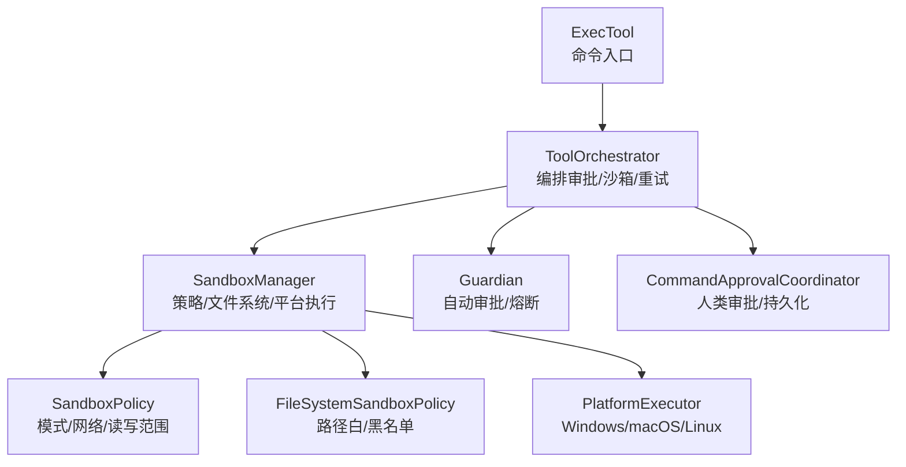
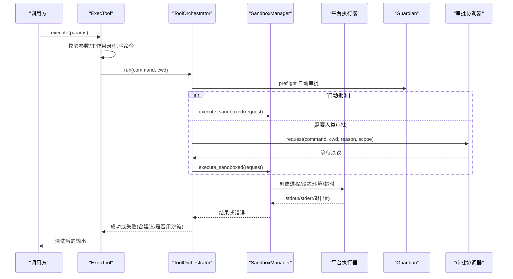
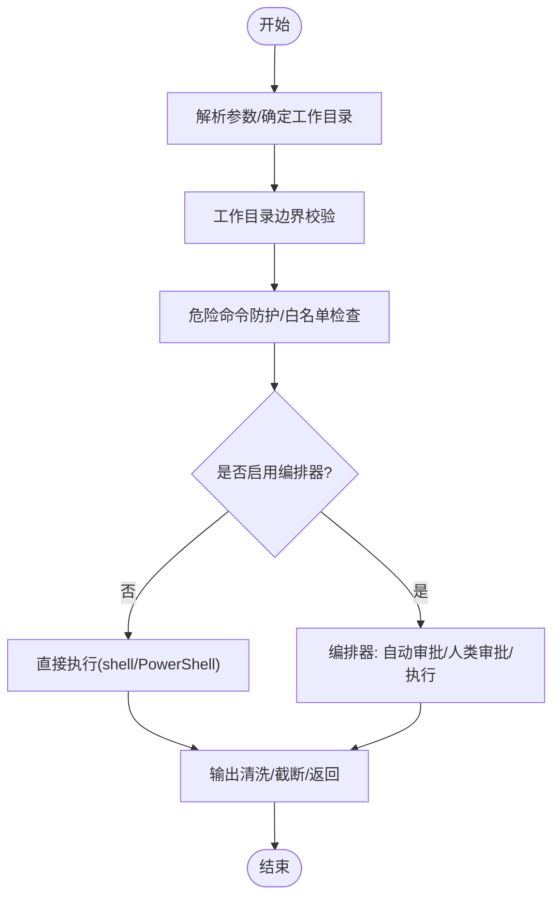
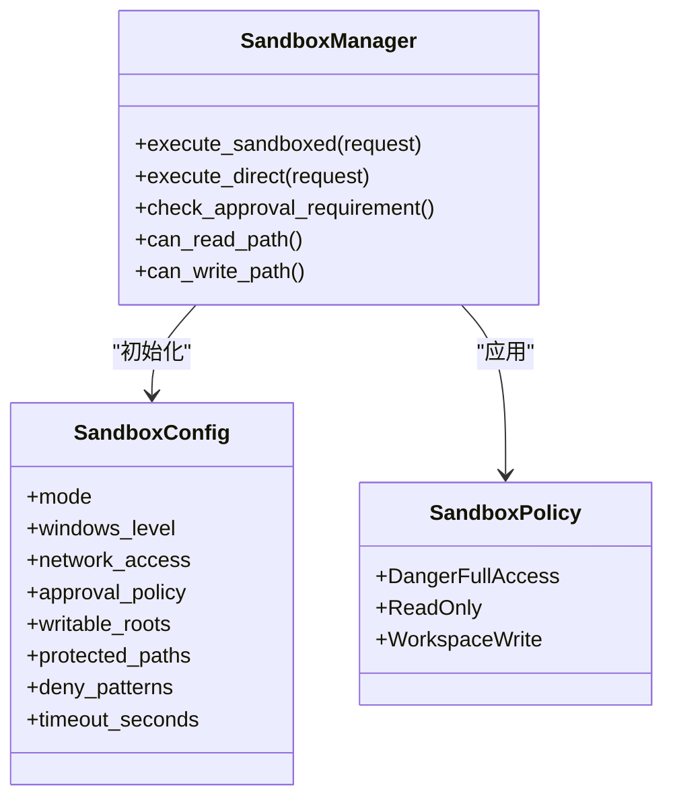
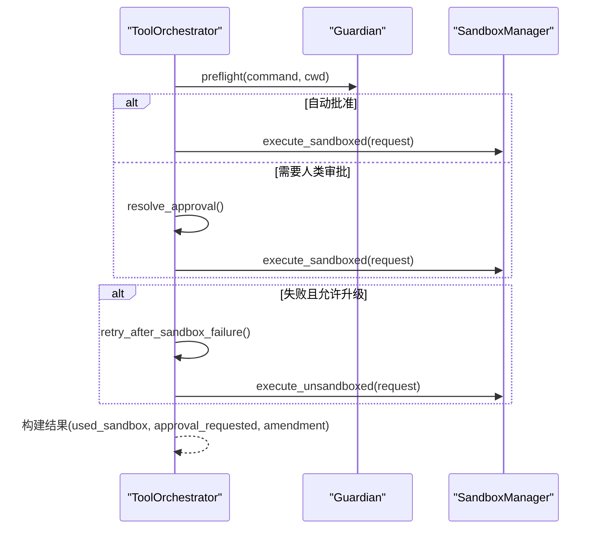
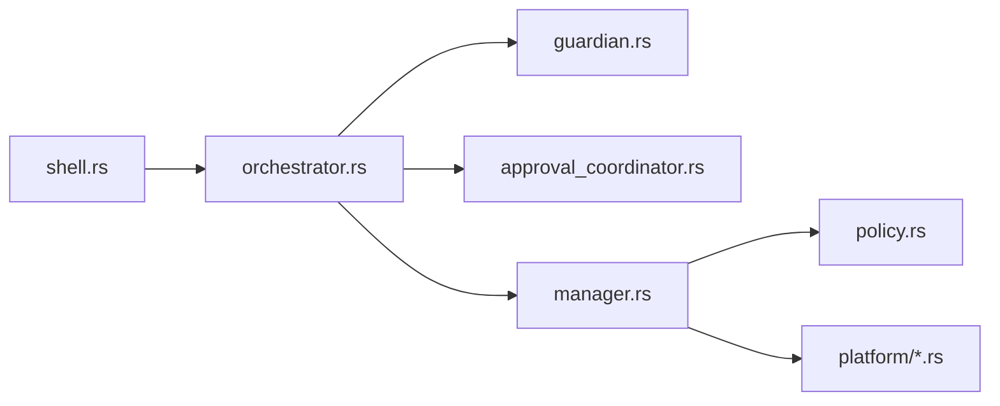

# Shell 命令执行工具

<cite>
**本文引用的文件**
- [agent-diva-tools/src/shell.rs](file://agent-diva-tools/src/shell.rs)
- [agent-diva-sandbox/src/lib.rs](file://agent-diva-sandbox/src/lib.rs)
- [agent-diva-sandbox/src/manager.rs](file://agent-diva-sandbox/src/manager.rs)
- [agent-diva-sandbox/src/policy.rs](file://agent-diva-sandbox/src/policy.rs)
- [agent-diva-sandbox/src/orchestrator.rs](file://agent-diva-sandbox/src/orchestrator.rs)
- [agent-diva-sandbox/src/guardian.rs](file://agent-diva-sandbox/src/guardian.rs)
- [agent-diva-sandbox/src/approval_coordinator.rs](file://agent-diva-sandbox/src/approval_coordinator.rs)
- [agent-diva-sandbox/src/platform/windows.rs](file://agent-diva-sandbox/src/platform/windows.rs)
- [agent-diva-sandbox/src/platform/macos.rs](file://agent-diva-sandbox/src/platform/macos.rs)
</cite>

## 目录
1. [简介](#简介)
2. [项目结构](#项目结构)
3. [核心组件](#核心组件)
4. [架构总览](#架构总览)
5. [详细组件分析](#详细组件分析)
6. [依赖关系分析](#依赖关系分析)
7. [性能考虑](#性能考虑)
8. [故障排查指南](#故障排查指南)
9. [结论](#结论)
10. [附录](#附录)

## 简介
本文件面向“Shell 命令执行工具”的完整技术文档，覆盖命令执行、管道输出处理、环境变量注入、超时控制、资源限制、安全沙箱、权限控制、白名单与参数校验、错误恢复、日志与审计追踪等主题。该工具通过工具层（ExecTool）暴露 exec 能力，并借助沙箱子系统（SandboxManager、ToolOrchestrator、Guardian、ApprovalCoordinator）实现可配置的安全边界与审批流程，支持跨平台（Windows/macOS/Linux）的隔离策略与环境构建。

## 项目结构
围绕 Shell 命令执行的关键代码分布在以下模块：
- 工具层：agent-diva-tools/src/shell.rs
- 沙箱核心：agent-diva-sandbox/src/*（lib、manager、policy、orchestrator、guardian、approval_coordinator、platform）
- 平台适配：Windows Restricted Token、macOS Seatbelt、Linux 预留接口

**图示来源**
- [agent-diva-tools/src/shell.rs:55-149](file://agent-diva-tools/src/shell.rs#L55-L149)
- [agent-diva-sandbox/src/orchestrator.rs:269-430](file://agent-diva-sandbox/src/orchestrator.rs#L269-L430)
- [agent-diva-sandbox/src/manager.rs:236-433](file://agent-diva-sandbox/src/manager.rs#L236-L433)
- [agent-diva-sandbox/src/policy.rs:9-143](file://agent-diva-sandbox/src/policy.rs#L9-L143)
- [agent-diva-sandbox/src/guardian.rs:618-736](file://agent-diva-sandbox/src/guardian.rs#L618-L736)
- [agent-diva-sandbox/src/approval_coordinator.rs:118-381](file://agent-diva-sandbox/src/approval_coordinator.rs#L118-L381)

**章节来源**
- [agent-diva-tools/src/shell.rs:1-149](file://agent-diva-tools/src/shell.rs#L1-L149)
- [agent-diva-sandbox/src/lib.rs:1-116](file://agent-diva-sandbox/src/lib.rs#L1-L116)

## 核心组件
- ExecTool：对外暴露 exec 工具，负责参数解析、工作目录约束、危险命令防护、输出清理、超时控制；可选择接入沙箱编排器或直连执行。
- SandboxManager：统一调度策略、文件系统访问控制、平台执行器选择、直接执行与沙箱执行分支。
- ToolOrchestrator：编排审批前置（Guardian）、首次尝试、失败重试/升级（无沙箱）、结果聚合。
- Guardian：基于规则与风险预测的自动审批，支持严格/智能/宽松模式与熔断保护。
- CommandApprovalCoordinator：异步人类审批协调器，支持会话级/全局级批准、超时、治理持久化与审计。
- 平台执行器：Windows Restricted Token、macOS Seatbelt、Linux 预留接口，负责进程隔离与环境块构造。

**章节来源**
- [agent-diva-tools/src/shell.rs:55-149](file://agent-diva-tools/src/shell.rs#L55-L149)
- [agent-diva-sandbox/src/manager.rs:236-433](file://agent-diva-sandbox/src/manager.rs#L236-L433)
- [agent-diva-sandbox/src/orchestrator.rs:269-430](file://agent-diva-sandbox/src/orchestrator.rs#L269-L430)
- [agent-diva-sandbox/src/guardian.rs:618-736](file://agent-diva-sandbox/src/guardian.rs#L618-L736)
- [agent-diva-sandbox/src/approval_coordinator.rs:118-381](file://agent-diva-sandbox/src/approval_coordinator.rs#L118-L381)

## 架构总览
命令执行从工具层进入，经编排器进行审批决策与沙箱选择，最终由管理器调用平台执行器完成进程创建、环境注入、I/O 捕获与超时控制。

**图示来源**
- [agent-diva-tools/src/shell.rs:333-403](file://agent-diva-tools/src/shell.rs#L333-L403)
- [agent-diva-sandbox/src/orchestrator.rs:400-430](file://agent-diva-sandbox/src/orchestrator.rs#L400-L430)
- [agent-diva-sandbox/src/manager.rs:400-433](file://agent-diva-sandbox/src/manager.rs#L400-L433)
- [agent-diva-sandbox/src/approval_coordinator.rs:221-381](file://agent-diva-sandbox/src/approval_coordinator.rs#L221-L381)

## 详细组件分析

### ExecTool：命令入口与安全边界
- 参数与上下文
  - 必需参数 command；可选 working_dir。
  - 支持通过 with_approval_backend 接入生产审批与守护策略。
- 工作目录约束
  - 强制工作目录位于配置的 workspace 范围内，拒绝 .. 穿越与越界绝对路径。
- 危险命令防护
  - 内置 deny patterns（如 rm -rf、del /f、shutdown 等），可按需扩展 allowlist。
- 输出处理
  - Windows 下优先 UTF-8，回退 GB18030；去除 ANSI 控制序列与控制字符，避免污染下游 JSON。
- 超时控制
  - 默认超时秒数，可通过 orchestrator 延长外层超时以容纳审批交互。
- 执行路径
  - 若未启用 orchestrator，则直接 spawn shell 子进程；否则走编排器流程。

**图示来源**
- [agent-diva-tools/src/shell.rs:333-403](file://agent-diva-tools/src/shell.rs#L333-L403)
- [agent-diva-tools/src/shell.rs:443-537](file://agent-diva-tools/src/shell.rs#L443-L537)

**章节来源**
- [agent-diva-tools/src/shell.rs:55-149](file://agent-diva-tools/src/shell.rs#L55-L149)
- [agent-diva-tools/src/shell.rs:170-237](file://agent-diva-tools/src/shell.rs#L170-L237)
- [agent-diva-tools/src/shell.rs:246-298](file://agent-diva-tools/src/shell.rs#L246-L298)
- [agent-diva-tools/src/shell.rs:333-403](file://agent-diva-tools/src/shell.rs#L333-L403)
- [agent-diva-tools/src/shell.rs:443-537](file://agent-diva-tools/src/shell.rs#L443-L537)

### SandboxManager：策略、文件系统与平台执行
- 配置与模式
  - 支持 DangerFullAccess、ReadOnly、WorkspaceWrite 三种模式；可配置网络访问、可写根、受保护路径、超时。
- 审批需求判定
  - 根据策略与缓存决定跳过、需要审批或直接禁止。
- 执行分支
  - 禁用时直接执行；否则先尝试沙箱执行，必要时退回直接执行（在允许的策略下）。
- 平台执行
  - Windows 使用 Restricted Token；macOS 使用 Seatbelt；Linux 预留接口。
- 环境变量
  - 支持向子进程注入额外环境变量；Windows 下构建环境块。

**图示来源**
- [agent-diva-sandbox/src/manager.rs:127-234](file://agent-diva-sandbox/src/manager.rs#L127-L234)
- [agent-diva-sandbox/src/manager.rs:236-433](file://agent-diva-sandbox/src/manager.rs#L236-L433)
- [agent-diva-sandbox/src/policy.rs:9-143](file://agent-diva-sandbox/src/policy.rs#L9-L143)

**章节来源**
- [agent-diva-sandbox/src/manager.rs:127-234](file://agent-diva-sandbox/src/manager.rs#L127-L234)
- [agent-diva-sandbox/src/manager.rs:236-433](file://agent-diva-sandbox/src/manager.rs#L236-L433)
- [agent-diva-sandbox/src/platform/windows.rs:524-548](file://agent-diva-sandbox/src/platform/windows.rs#L524-L548)

### ToolOrchestrator：审批、沙箱选择与重试
- 前置自动审批（Guardian）
  - 对已知安全或只读命令快速放行；对潜在危险命令要求人类审批。
- 审批决议
  - 结合 ExecPolicy 与 AskForApproval 策略生成首次尝试是否需要人类审批。
- 执行与重试
  - 首次按策略执行；失败后依据策略决定是否升级到无沙箱执行（Escalation）。
- 结果封装
  - 返回是否使用了沙箱、是否请求了审批、以及可能的命令修正建议。

**图示来源**
- [agent-diva-sandbox/src/orchestrator.rs:400-430](file://agent-diva-sandbox/src/orchestrator.rs#L400-L430)
- [agent-diva-sandbox/src/orchestrator.rs:579-730](file://agent-diva-sandbox/src/orchestrator.rs#L579-L730)

**章节来源**
- [agent-diva-sandbox/src/orchestrator.rs:269-430](file://agent-diva-sandbox/src/orchestrator.rs#L269-L430)
- [agent-diva-sandbox/src/orchestrator.rs:579-730](file://agent-diva-sandbox/src/orchestrator.rs#L579-L730)

### Guardian：自动审批与熔断
- 模式映射
  - OnRequest → strict；OnFailure → smart；UnlessTrusted → liberal；Never → default。
- 决策逻辑
  - 已知安全/只读命令可自动批准；潜在危险命令要求人类审批；过多拒绝触发熔断。
- 学习机制
  - 可配置为自动学习 Allow 规则，减少后续审批。

**章节来源**
- [agent-diva-sandbox/src/guardian.rs:25-110](file://agent-diva-sandbox/src/guardian.rs#L25-L110)
- [agent-diva-sandbox/src/guardian.rs:375-472](file://agent-diva-sandbox/src/guardian.rs#L375-L472)
- [agent-diva-sandbox/src/guardian.rs:474-589](file://agent-diva-sandbox/src/guardian.rs#L474-L589)

### CommandApprovalCoordinator：人类审批与审计
- 生命周期
  - request → pending → resolve/cancel/expired → audit emit。
- 作用域与持久化
  - 支持 channel/chat/session 作用域；可与治理系统对接，记录不可变收据。
- 全局规则复用
  - 当命令匹配已存在规则时可跳过审批，提升效率。

**章节来源**
- [agent-diva-sandbox/src/approval_coordinator.rs:118-381](file://agent-diva-sandbox/src/approval_coordinator.rs#L118-L381)
- [agent-diva-sandbox/src/approval_coordinator.rs:383-594](file://agent-diva-sandbox/src/approval_coordinator.rs#L383-L594)

### 平台执行器：环境与隔离
- Windows
  - 使用 Restricted Token 降低权限；构建环境块时合并进程现有环境变量与额外变量。
- macOS
  - 使用 Seatbelt 策略，按策略类型生成最小化许可集；可隔离网络。
- Linux
  - 预留接口，待 Bubblewrap/Landlock/Seccomp 集成。

**章节来源**
- [agent-diva-sandbox/src/platform/windows.rs:524-548](file://agent-diva-sandbox/src/platform/windows.rs#L524-L548)
- [agent-diva-sandbox/src/platform/macos.rs:72-83](file://agent-diva-sandbox/src/platform/macos.rs#L72-L83)

## 依赖关系分析
- 工具层依赖沙箱编排器与协调器，形成“工具→编排→策略/平台”的分层解耦。
- 编排器依赖 Guardian 与审批协调器，提供自动化与人工干预双通道。
- 管理器聚合策略与文件系统策略，并委派到平台执行器。
- 策略层定义模式、网络与读写范围，向上游提供统一抽象。

**图示来源**
- [agent-diva-tools/src/shell.rs:55-149](file://agent-diva-tools/src/shell.rs#L55-L149)
- [agent-diva-sandbox/src/orchestrator.rs:269-430](file://agent-diva-sandbox/src/orchestrator.rs#L269-L430)
- [agent-diva-sandbox/src/manager.rs:236-433](file://agent-diva-sandbox/src/manager.rs#L236-L433)
- [agent-diva-sandbox/src/policy.rs:9-143](file://agent-diva-sandbox/src/policy.rs#L9-L143)

**章节来源**
- [agent-diva-tools/src/shell.rs:55-149](file://agent-diva-tools/src/shell.rs#L55-L149)
- [agent-diva-sandbox/src/orchestrator.rs:269-430](file://agent-diva-sandbox/src/orchestrator.rs#L269-L430)
- [agent-diva-sandbox/src/manager.rs:236-433](file://agent-diva-sandbox/src/manager.rs#L236-L433)

## 性能考虑
- 输出截断：超长输出会被截断以避免内存膨胀与下游解析压力。
- 编码优化：Windows 下优先 UTF-8，回退 GB18030，减少替换字符数量，提高吞吐与正确性。
- 审批缓存：会话级/全局级审批缓存减少重复审批开销。
- 自动审批：Guardian 对只读/已知安全命令快速放行，降低审批延迟。
- 超时控制：合理设置超时，避免长时间阻塞；编排器可在审批场景延长外层超时。

[本节为通用指导，不直接分析具体文件]

## 故障排查指南
- 常见错误
  - 命令被安全守卫阻止：检查 deny patterns 与工作目录边界。
  - 审批超时：确认审批协调器超时配置与外部审批服务可用性。
  - 平台不可用：Windows Restricted Token 或 macOS Seatbelt 不可用时，降级为直接执行或提示配置。
  - 非零退出码：查看 stderr 与退出码定位命令失败原因。
- 调试建议
  - 开启 tracing/debug 日志，关注“Executing sandboxed command”“Circuit breaker triggered”等关键日志。
  - 检查工作目录是否越界、是否存在 .. 穿越。
  - 验证环境变量是否正确注入（尤其是 Windows 环境块）。
  - 使用沙箱禁用开关进行回归对比（仅用于诊断）。

**章节来源**
- [agent-diva-tools/src/shell.rs:387-403](file://agent-diva-tools/src/shell.rs#L387-L403)
- [agent-diva-sandbox/src/manager.rs:435-496](file://agent-diva-sandbox/src/manager.rs#L435-L496)
- [agent-diva-sandbox/src/guardian.rs:474-589](file://agent-diva-sandbox/src/guardian.rs#L474-L589)

## 结论
该 Shell 命令执行工具通过分层设计实现了灵活而强大的安全边界与执行保障：工具层负责输入校验与输出净化；编排层串联自动审批与人类审批；管理层统一策略与平台执行；平台层提供进程隔离与环境控制。配合超时控制、资源限制、白名单与审计追踪，能够在保证安全的前提下提供高效的命令执行能力。

[本节为总结性内容，不直接分析具体文件]

## 附录

### 安全最佳实践
- 始终启用 WorkspaceWrite 模式并将工作目录限定在项目根内。
- 使用 Guardian 的 smart/strict 模式，避免未知命令自动执行。
- 配置合理的超时与输出截断阈值，防止资源耗尽。
- 定期审查命令规则与审批历史，收敛高风险操作。
- 在生产环境启用治理持久化与审计事件，确保可追溯。

[本节为通用指导，不直接分析具体文件]

### 常见问题解决方案
- 工作目录越界：确保 working_dir 解析后位于 workspace 范围内，避免 .. 穿越。
- 命令被误拦：将必要命令加入白名单或调整 deny patterns。
- 审批频繁：利用全局规则与自动学习减少重复审批。
- 平台限制：在受限环境中回退到直接执行或升级权限策略。

**章节来源**
- [agent-diva-tools/src/shell.rs:246-298](file://agent-diva-tools/src/shell.rs#L246-L298)
- [agent-diva-sandbox/src/guardian.rs:375-472](file://agent-diva-sandbox/src/guardian.rs#L375-L472)
- [agent-diva-sandbox/src/approval_coordinator.rs:221-381](file://agent-diva-sandbox/src/approval_coordinator.rs#L221-L381)