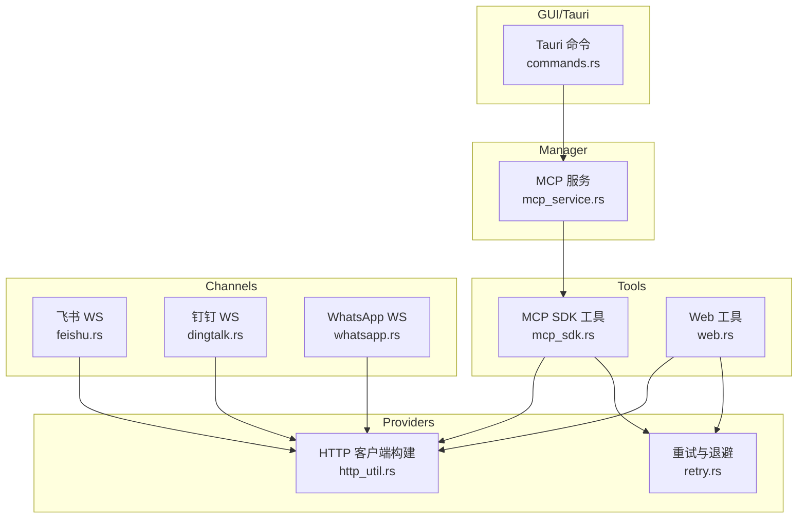
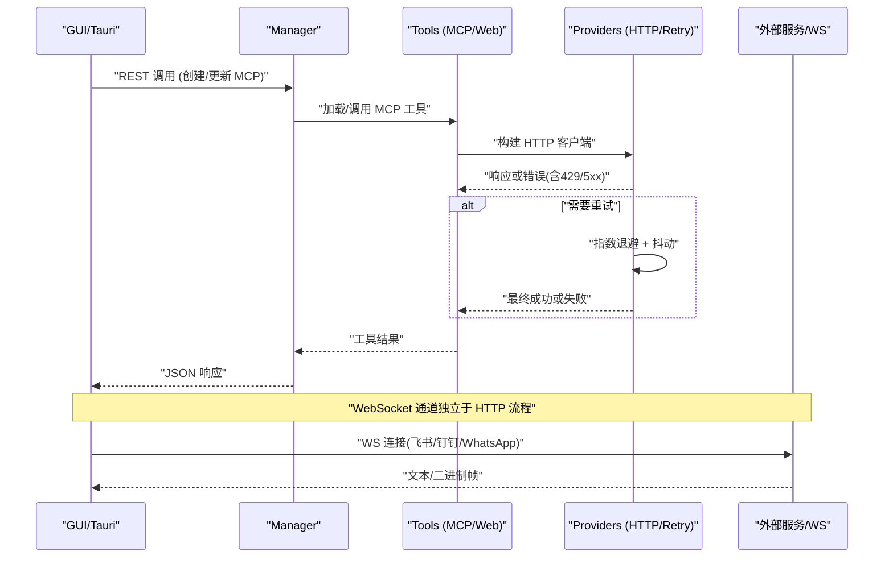
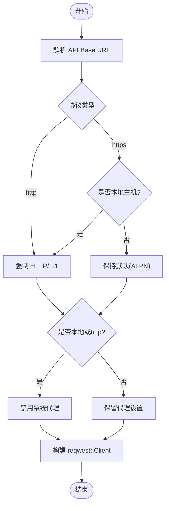
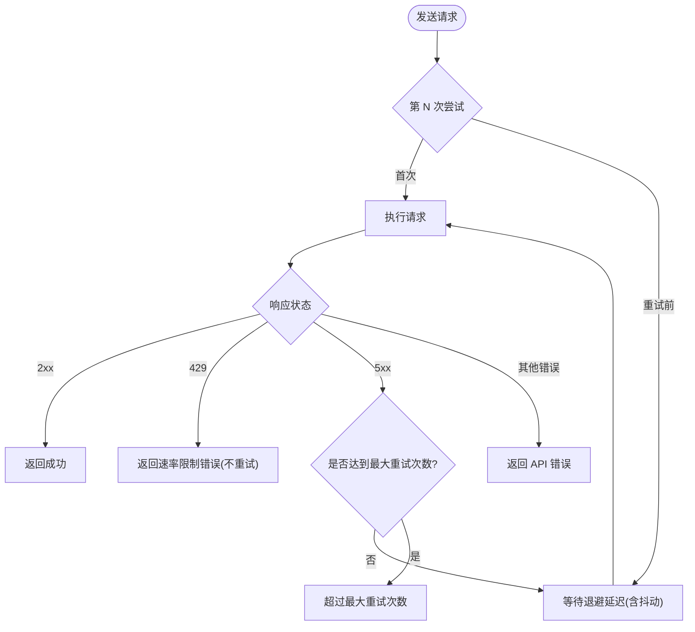
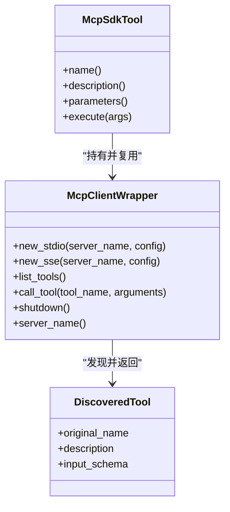
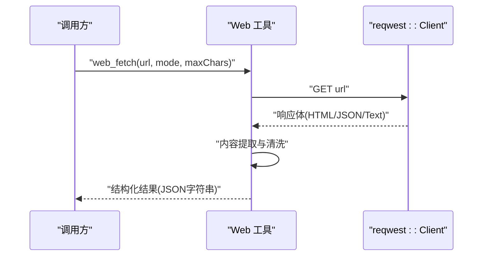
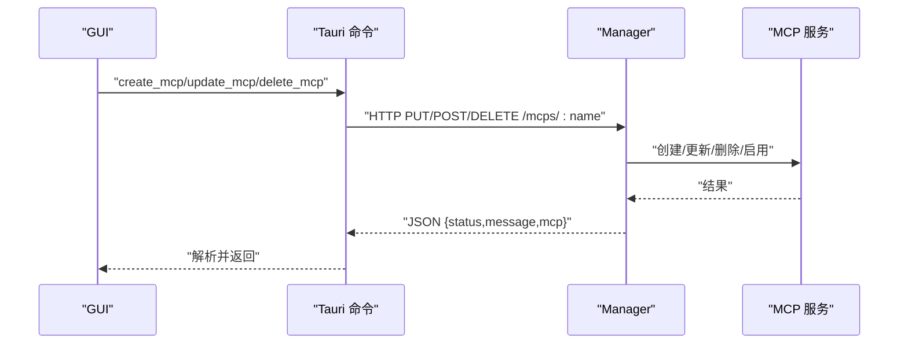
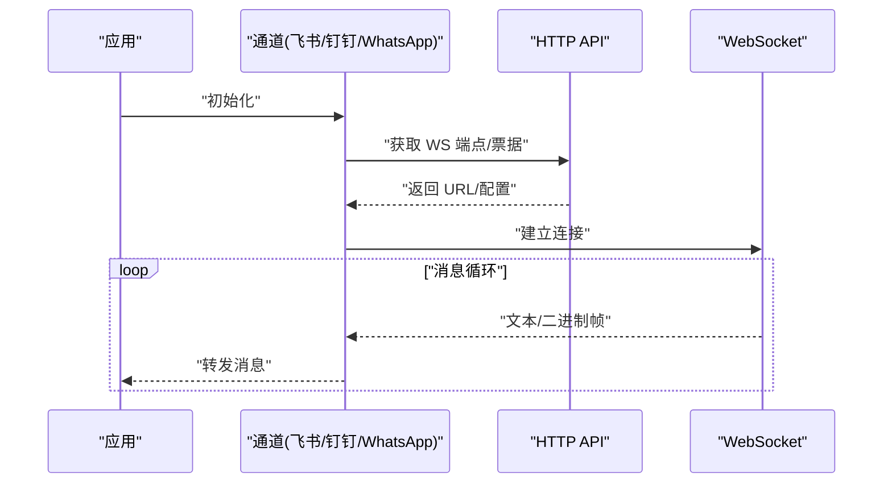
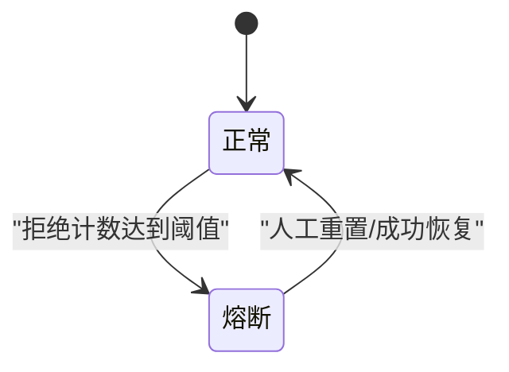
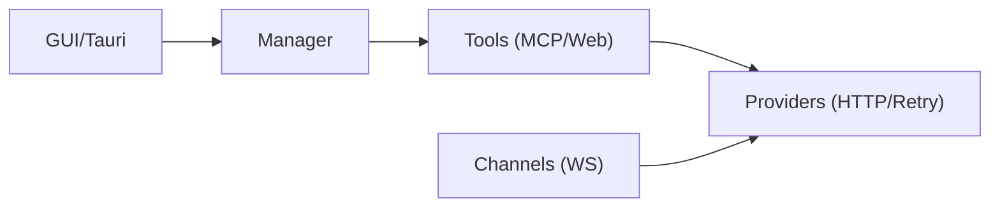

# Web 请求工具

<cite>
**本文引用的文件**
- [agent-diva-providers/src/http_util.rs](file://agent-diva-providers/src/http_util.rs)
- [agent-diva-providers/src/retry.rs](file://agent-diva-providers/src/retry.rs)
- [agent-diva-tools/src/mcp_sdk.rs](file://agent-diva-tools/src/mcp_sdk.rs)
- [agent-diva-tools/src/web.rs](file://agent-diva-tools/src/web.rs)
- [agent-diva-manager/src/mcp_service.rs](file://agent-diva-manager/src/mcp_service.rs)
- [agent-diva-gui/src-tauri/src/commands.rs](file://agent-diva-gui/src-tauri/src/commands.rs)
- [agent-diva-core/src/config/mod.rs](file://agent-diva-core/src/config/mod.rs)
- [agent-diva-sandbox/src/guardian.rs](file://agent-diva-sandbox/src/guardian.rs)
- [agent-diva-core/src/security/rejection_circuit.rs](file://agent-diva-core/src/security/rejection_circuit.rs)
- [agent-diva-channels/src/feishu.rs](file://agent-diva-channels/src/feishu.rs)
- [agent-diva-channels/src/dingtalk.rs](file://agent-diva-channels/src/dingtalk.rs)
- [agent-diva-channels/src/whatsapp.rs](file://agent-diva-channels/src/whatsapp.rs)
</cite>

## 目录
1. [简介](#简介)
2. [项目结构](#项目结构)
3. [核心组件](#核心组件)
4. [架构总览](#架构总览)
5. [详细组件分析](#详细组件分析)
6. [依赖关系分析](#依赖关系分析)
7. [性能考量](#性能考量)
8. [故障排查指南](#故障排查指南)
9. [结论](#结论)
10. [附录](#附录)

## 简介
本文件面向“Web 请求工具”的完整使用与实现说明，覆盖 HTTP 请求、API 调用、MCP SDK 集成、RESTful API、GraphQL（通过通用 HTTP 客户端）、WebSocket 连接等场景。重点解释请求构建、响应处理、错误重试、连接池管理、认证授权、请求拦截、响应缓存、网络异常处理、性能监控与安全防护的最佳实践。内容基于仓库中已实现的代码路径进行归纳与可视化，便于读者快速定位源码并落地到实际工程。

## 项目结构
围绕 Web 请求能力，仓库在多个子模块中提供了可复用的能力：
- 提供者层（providers）：统一的 HTTP 客户端构建、HTTP/1.1 强制策略、代理禁用策略、指数退避重试与速率限制识别。
- 工具层（tools）：Web 搜索与抓取工具、MCP SDK 集成（stdio/SSE 两种传输），封装了超时、重连、结果清洗等。
- 管理器层（manager）：MCP 服务的增删改查与状态查询，提供 REST 接口供 GUI/Tauri 调用。
- GUI/Tauri 层：通过 Tauri 命令调用后端 API，支持 SSE 流式事件消费。
- 通道层（channels）：多种即时通讯通道的 WebSocket 长连接实现，包含鉴权、心跳、断线重连等。
- 安全与治理（core/sandbox）：熔断器、拒绝计数窗口、策略控制，用于保护下游服务。

图表来源
- [agent-diva-gui/src-tauri/src/commands.rs](file://agent-diva-gui/src-tauri/src/commands.rs)
- [agent-diva-manager/src/mcp_service.rs](file://agent-diva-manager/src/mcp_service.rs)
- [agent-diva-tools/src/mcp_sdk.rs](file://agent-diva-tools/src/mcp_sdk.rs)
- [agent-diva-tools/src/web.rs](file://agent-diva-tools/src/web.rs)
- [agent-diva-providers/src/http_util.rs](file://agent-diva-providers/src/http_util.rs)
- [agent-diva-providers/src/retry.rs](file://agent-diva-providers/src/retry.rs)
- [agent-diva-channels/src/feishu.rs](file://agent-diva-channels/src/feishu.rs)
- [agent-diva-channels/src/dingtalk.rs](file://agent-diva-channels/src/dingtalk.rs)
- [agent-diva-channels/src/whatsapp.rs](file://agent-diva-channels/src/whatsapp.rs)

章节来源
- [agent-diva-core/src/config/mod.rs:1-12](file://agent-diva-core/src/config/mod.rs#L1-L12)

## 核心组件
- HTTP 客户端构建与策略
  - 根据 API Base 自动选择是否强制 HTTP/1.1 与是否禁用系统代理，避免本地网关或内网环境兼容性问题。
  - 设置连接超时与请求超时，保证资源释放与整体稳定性。
- 重试与退避
  - 对 5xx 与网络错误进行指数退避重试，支持抖动；对 429 直接返回速率限制错误，不重试。
  - 提供重试监听回调，便于上层展示进度或埋点。
- MCP SDK 集成
  - 支持 stdio 与 SSE 两种传输方式，统一初始化握手、工具发现与调用。
  - 工具执行带超时控制，失败时按指数退避自动重连，最多若干次尝试。
- Web 工具
  - web_search：多搜索引擎（Brave、Bocha、Zhipu）的统一封装，支持参数化查询与结果格式化。
  - web_fetch：URL 抓取与 HTML→Markdown/Text 转换，支持 JSON 美化输出与截断。
- 通道 WebSocket
  - 飞书、钉钉、WhatsApp 等通道均实现了获取 WS 端点、建立连接、心跳保活、断线重连与消息收发。
- 安全与治理
  - 熔断器与拒绝计数窗口，防止雪崩；结合策略层对高风险操作进行阻断。

章节来源
- [agent-diva-providers/src/http_util.rs:1-92](file://agent-diva-providers/src/http_util.rs#L1-L92)
- [agent-diva-providers/src/retry.rs:1-316](file://agent-diva-providers/src/retry.rs#L1-L316)
- [agent-diva-tools/src/mcp_sdk.rs:1-611](file://agent-diva-tools/src/mcp_sdk.rs#L1-L611)
- [agent-diva-tools/src/web.rs:1-848](file://agent-diva-tools/src/web.rs#L1-L848)
- [agent-diva-channels/src/feishu.rs:341-380](file://agent-diva-channels/src/feishu.rs#L341-L380)
- [agent-diva-channels/src/dingtalk.rs:491-536](file://agent-diva-channels/src/dingtalk.rs#L491-L536)
- [agent-diva-channels/src/whatsapp.rs:396-423](file://agent-diva-channels/src/whatsapp.rs#L396-L423)
- [agent-diva-sandbox/src/guardian.rs:497-574](file://agent-diva-sandbox/src/guardian.rs#L497-L574)
- [agent-diva-core/src/security/rejection_circuit.rs:33-81](file://agent-diva-core/src/security/rejection_circuit.rs#L33-L81)

## 架构总览
下图展示了从 GUI/Tauri 到后端 Manager，再到 Tools/Providers 与 Channels 的请求链路，以及重试、超时、认证、WS 等关键节点。

图表来源
- [agent-diva-gui/src-tauri/src/commands.rs](file://agent-diva-gui/src-tauri/src/commands.rs)
- [agent-diva-manager/src/mcp_service.rs](file://agent-diva-manager/src/mcp_service.rs)
- [agent-diva-tools/src/mcp_sdk.rs](file://agent-diva-tools/src/mcp_sdk.rs)
- [agent-diva-tools/src/web.rs](file://agent-diva-tools/src/web.rs)
- [agent-diva-providers/src/http_util.rs](file://agent-diva-providers/src/http_util.rs)
- [agent-diva-providers/src/retry.rs](file://agent-diva-providers/src/retry.rs)
- [agent-diva-channels/src/feishu.rs](file://agent-diva-channels/src/feishu.rs)
- [agent-diva-channels/src/dingtalk.rs](file://agent-diva-channels/src/dingtalk.rs)
- [agent-diva-channels/src/whatsapp.rs](file://agent-diva-channels/src/whatsapp.rs)

## 详细组件分析

### HTTP 客户端构建与策略（http_util.rs）
- 功能要点
  - 针对 http:// 或本地 https（localhost/127.0.0.1/.local）强制 HTTP/1.1，避免 ALPN 协商问题。
  - 对本地地址与 http:// 禁用系统代理，减少中间层干扰。
  - 设置连接超时与请求超时，确保资源及时回收。
- 使用建议
  - 所有 Provider 调用应通过此工厂函数创建 Client，以获得一致的网络行为。
  - 若对接第三方 HTTPS 公网 API，默认启用 ALPN（不强制 HTTP/1.1）。

图表来源
- [agent-diva-providers/src/http_util.rs:6-56](file://agent-diva-providers/src/http_util.rs#L6-L56)

章节来源
- [agent-diva-providers/src/http_util.rs:1-92](file://agent-diva-providers/src/http_util.rs#L1-L92)

### 重试与退避（retry.rs）
- 功能要点
  - 指数退避：基础延迟 1s，每次翻倍，加入 ±20% 抖动，避免惊群效应。
  - 状态码分类：429 立即返回速率限制错误；5xx 触发重试；其他非成功直接报错。
  - 支持可选的重试监听回调，便于前端或日志系统感知重试过程。
- 使用建议
  - 所有 Provider HTTP 调用应包裹在 send_with_retry 中，以获得一致的容错体验。
  - 对于幂等 GET/HEAD 请求更适用；非幂等写操作需谨慎评估重试语义。

图表来源
- [agent-diva-providers/src/retry.rs:39-181](file://agent-diva-providers/src/retry.rs#L39-L181)

章节来源
- [agent-diva-providers/src/retry.rs:1-316](file://agent-diva-providers/src/retry.rs#L1-L316)

### MCP SDK 集成（mcp_sdk.rs）
- 功能要点
  - 传输方式：stdio（进程启动）与 SSE（HTTP 流式）。
  - 初始化握手：携带客户端信息与协议版本，设置启动超时。
  - 工具发现与调用：list_tools 与 call_tool，均受工具超时保护。
  - 自动重连：当会话关闭或崩溃时，按指数退避尝试重建连接（最多若干次）。
- 使用建议
  - 为每个 MCP 服务器配置 tool_timeout，避免长时间阻塞。
  - 对 stderr 输出采用 warn 级别记录，避免误报错误。

图表来源
- [agent-diva-tools/src/mcp_sdk.rs:85-273](file://agent-diva-tools/src/mcp_sdk.rs#L85-L273)
- [agent-diva-tools/src/mcp_sdk.rs:323-442](file://agent-diva-tools/src/mcp_sdk.rs#L323-L442)

章节来源
- [agent-diva-tools/src/mcp_sdk.rs:1-611](file://agent-diva-tools/src/mcp_sdk.rs#L1-L611)

### Web 工具（web.rs）
- 功能要点
  - web_search：支持 Brave、Bocha、Zhipu 三种搜索引擎，统一参数与结果格式。
  - web_fetch：抓取 URL，HTML→Markdown/Text 转换，JSON 美化输出，支持截断与内容清洗。
  - 安全校验：仅允许 http/https 协议，限制重定向次数，设置 User-Agent。
- 使用建议
  - 合理设置 max_results 与 max_chars，避免过大响应影响性能。
  - 对敏感信息做脱敏后再输出（内部已做控制字符清理）。

图表来源
- [agent-diva-tools/src/web.rs:524-792](file://agent-diva-tools/src/web.rs#L524-L792)

章节来源
- [agent-diva-tools/src/web.rs:1-848](file://agent-diva-tools/src/web.rs#L1-L848)

### Manager 与 Tauri 命令（mcp_service.rs / commands.rs）
- 功能要点
  - Manager 暴露 MCP 服务的增删改查与启用/禁用接口，返回统一 JSON 结构。
  - Tauri 命令封装 HTTP 调用，解析 status/message/mcp 字段，错误时抛出友好提示。
- 使用建议
  - 前端调用需处理 status != "ok" 的情况，并显示 message。
  - 对 name 进行 URL 编码，避免特殊字符导致路由解析失败。

图表来源
- [agent-diva-manager/src/mcp_service.rs:1-52](file://agent-diva-manager/src/mcp_service.rs#L1-L52)
- [agent-diva-gui/src-tauri/src/commands.rs:3937-4028](file://agent-diva-gui/src-tauri/src/commands.rs#L3937-L4028)

章节来源
- [agent-diva-manager/src/mcp_service.rs:1-52](file://agent-diva-manager/src/mcp_service.rs#L1-L52)
- [agent-diva-gui/src-tauri/src/commands.rs:3937-4028](file://agent-diva-gui/src-tauri/src/commands.rs#L3937-L4028)

### WebSocket 通道（feishu.rs / dingtalk.rs / whatsapp.rs）
- 功能要点
  - 飞书：通过 HTTP 获取 WS 端点与客户端配置，再建立 WS 连接，处理心跳与消息。
  - 钉钉：上传媒体后发送消息，WS 连接维护与票据传递。
  - WhatsApp：消息循环处理，关闭与错误分支处理。
- 使用建议
  - 合理设置心跳间隔与重连退避，避免频繁重连造成压力。
  - 对 WS 错误进行分类处理，区分网络错误与服务端关闭。

图表来源
- [agent-diva-channels/src/feishu.rs:341-380](file://agent-diva-channels/src/feishu.rs#L341-L380)
- [agent-diva-channels/src/dingtalk.rs:491-536](file://agent-diva-channels/src/dingtalk.rs#L491-L536)
- [agent-diva-channels/src/whatsapp.rs:396-423](file://agent-diva-channels/src/whatsapp.rs#L396-L423)

章节来源
- [agent-diva-channels/src/feishu.rs:341-380](file://agent-diva-channels/src/feishu.rs#L341-L380)
- [agent-diva-channels/src/dingtalk.rs:491-536](file://agent-diva-channels/src/dingtalk.rs#L491-L536)
- [agent-diva-channels/src/whatsapp.rs:396-423](file://agent-diva-channels/src/whatsapp.rs#L396-L423)

### 安全与熔断（guardian.rs / rejection_circuit.rs）
- 功能要点
  - 滑动窗口记录拒绝次数，达到阈值触发熔断，阻止自动批准等高风险操作。
  - 支持手动重置与查询当前拒绝计数，便于运维干预。
- 使用建议
  - 将熔断器与关键网络调用结合，避免级联故障。
  - 定期审计拒绝计数趋势，优化上游稳定性。

图表来源
- [agent-diva-sandbox/src/guardian.rs:497-574](file://agent-diva-sandbox/src/guardian.rs#L497-L574)
- [agent-diva-core/src/security/rejection_circuit.rs:33-81](file://agent-diva-core/src/security/rejection_circuit.rs#L33-L81)

章节来源
- [agent-diva-sandbox/src/guardian.rs:497-574](file://agent-diva-sandbox/src/guardian.rs#L497-L574)
- [agent-diva-core/src/security/rejection_circuit.rs:33-81](file://agent-diva-core/src/security/rejection_circuit.rs#L33-L81)

## 依赖关系分析
- 组件耦合
  - Manager 依赖 Tools 的 MCP 能力；Tools 依赖 Providers 的 HTTP 客户端与重试逻辑。
  - GUI/Tauri 通过 Manager 的 REST API 间接调用 Tools，解耦前后端。
  - Channels 独立于 HTTP 流程，但同样受益于 Providers 的客户端策略。
- 外部依赖
  - reqwest：HTTP 客户端，负责连接池、超时、代理等。
  - rust-mcp-sdk：MCP 协议客户端，支持 stdio/SSE 传输。
  - tokio：异步运行时，支撑超时、重连与并发。
- 潜在循环依赖
  - 当前分层清晰，未见循环依赖迹象。

图表来源
- [agent-diva-gui/src-tauri/src/commands.rs](file://agent-diva-gui/src-tauri/src/commands.rs)
- [agent-diva-manager/src/mcp_service.rs](file://agent-diva-manager/src/mcp_service.rs)
- [agent-diva-tools/src/mcp_sdk.rs](file://agent-diva-tools/src/mcp_sdk.rs)
- [agent-diva-tools/src/web.rs](file://agent-diva-tools/src/web.rs)
- [agent-diva-providers/src/http_util.rs](file://agent-diva-providers/src/http_util.rs)
- [agent-diva-providers/src/retry.rs](file://agent-diva-providers/src/retry.rs)
- [agent-diva-channels/src/feishu.rs](file://agent-diva-channels/src/feishu.rs)

章节来源
- [agent-diva-core/src/config/mod.rs:1-12](file://agent-diva-core/src/config/mod.rs#L1-L12)

## 性能考量
- 连接池与超时
  - 使用 reqwest 默认连接池，合理设置 connect_timeout 与 timeout，避免连接泄漏。
  - 对本地或 http:// 强制 HTTP/1.1，减少协商开销与兼容性问题。
- 重试与退避
  - 指数退避+抖动降低瞬时流量峰值，提高成功率。
  - 对 429 不做重试，避免加剧服务端压力。
- 流式与长连接
  - SSE/WS 适合大响应或实时通信，注意心跳与断线重连策略。
- 资源限制
  - web_fetch 支持截断，避免超大响应占用内存。
  - MCP 工具调用设置超时，防止卡死。

[本节为通用指导，无需特定文件引用]

## 故障排查指南
- 常见问题
  - 连接失败：检查 API Base 是否为 http:// 或本地 https，确认是否被代理拦截。
  - 超时：调整 tool_timeout 或请求超时，检查服务端响应时间。
  - 429 速率限制：降低请求频率或等待 Retry-After。
  - WS 断线：检查心跳配置与重连退避，查看服务端关闭原因。
- 诊断步骤
  - 启用重试监听，记录每次重试的延迟与原因。
  - 查看熔断器拒绝计数，判断是否触发保护机制。
  - 对 WS 通道打印错误与关闭帧，定位断点。

章节来源
- [agent-diva-providers/src/retry.rs:94-181](file://agent-diva-providers/src/retry.rs#L94-L181)
- [agent-diva-sandbox/src/guardian.rs:502-574](file://agent-diva-sandbox/src/guardian.rs#L502-L574)
- [agent-diva-channels/src/feishu.rs:341-380](file://agent-diva-channels/src/feishu.rs#L341-L380)

## 结论
本仓库在多个层次提供了健壮的 Web 请求能力：统一的 HTTP 客户端构建、智能重试与退避、MCP SDK 集成、Web 工具封装、多通道 WebSocket 支持，以及熔断与策略保护。通过这些组件的组合，可实现高可用、高性能且安全的网络交互。建议在实际使用中遵循本文的配置与最佳实践，并结合业务场景调优超时、重试与连接池参数。

[本节为总结性内容，无需特定文件引用]

## 附录
- 实用示例参考路径
  - RESTful API 调用：[Tauri 命令调用 Manager API:3937-4028](file://agent-diva-gui/src-tauri/src/commands.rs#L3937-L4028)
  - GraphQL 查询：可通过通用 HTTP 客户端构造 POST 请求，参考 [Web 工具中的 HTTP 调用模式:117-169](file://agent-diva-tools/src/web.rs#L117-L169)
  - WebSocket 连接：参考 [飞书/钉钉/WhatsApp 的 WS 实现:341-380](file://agent-diva-channels/src/feishu.rs#L341-L380)
- 配置项参考
  - MCP 工具超时：[默认值与 DTO:19-52](file://agent-diva-manager/src/mcp_service.rs#L19-L52)
  - HTTP 客户端策略：[强制 HTTP/1.1 与代理禁用:6-56](file://agent-diva-providers/src/http_util.rs#L6-L56)
  - 重试策略：[指数退避与状态码分类:39-181](file://agent-diva-providers/src/retry.rs#L39-L181)

[本节为补充信息，无需特定文件引用]