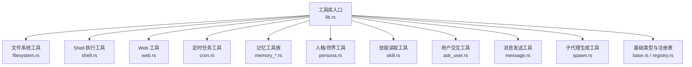
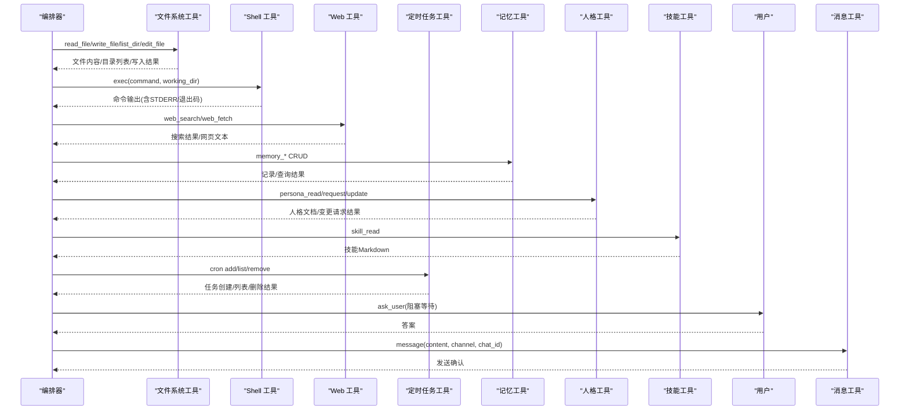
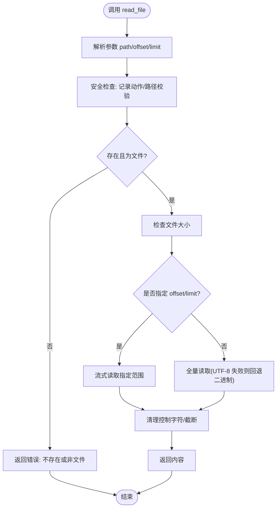
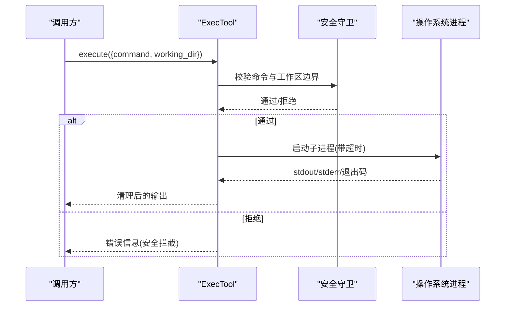
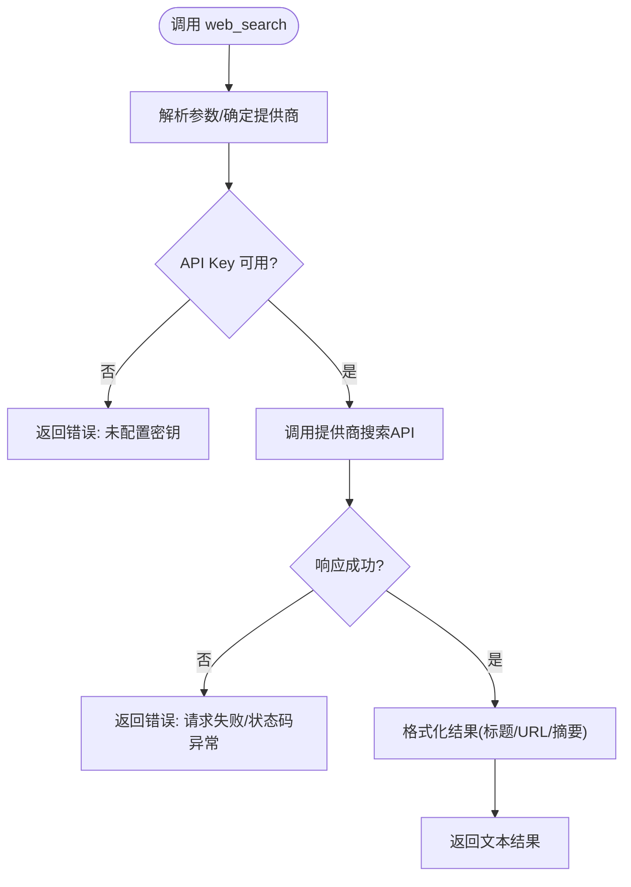
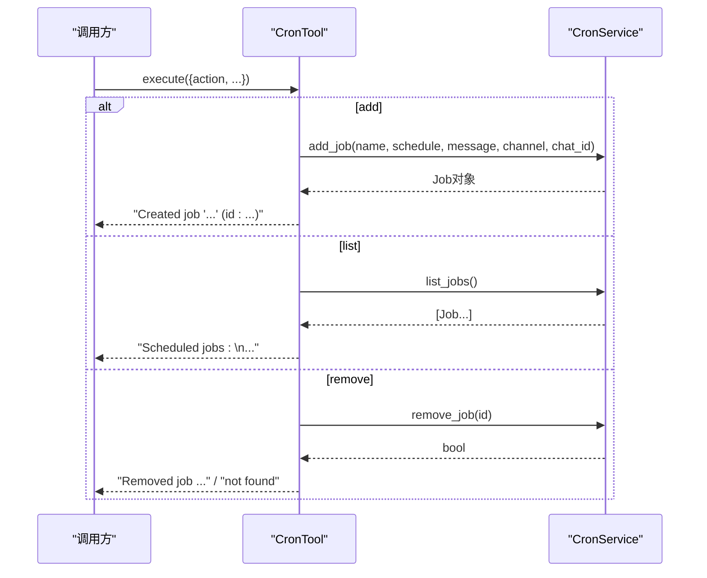
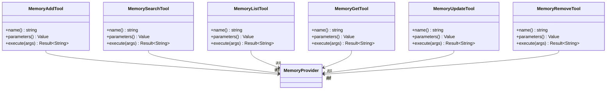
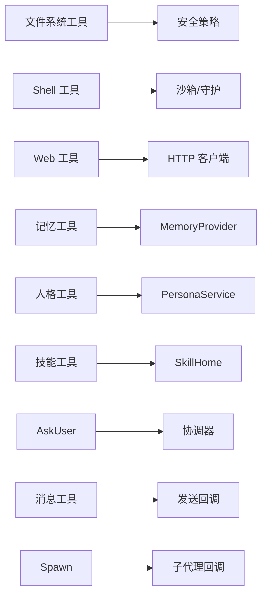

# 内置工具集

<cite>
**本文引用的文件**
- [agent-diva-tools/src/lib.rs](file://agent-diva-tools/src/lib.rs)
- [agent-diva-tools/src/registry.rs](file://agent-diva-tools/src/registry.rs)
- [agent-diva-tools/src/base.rs](file://agent-diva-tools/src/base.rs)
- [agent-diva-tools/src/filesystem.rs](file://agent-diva-tools/src/filesystem.rs)
- [agent-diva-tools/src/shell.rs](file://agent-diva-tools/src/shell.rs)
- [agent-diva-tools/src/web.rs](file://agent-diva-tools/src/web.rs)
- [agent-diva-tools/src/cron.rs](file://agent-diva-tools/src/cron.rs)
- [agent-diva-tools/src/memory_add.rs](file://agent-diva-tools/src/memory_add.rs)
- [agent-diva-tools/src/memory_search.rs](file://agent-diva-tools/src/memory_search.rs)
- [agent-diva-tools/src/memory_list.rs](file://agent-diva-tools/src/memory_list.rs)
- [agent-diva-tools/src/memory_get.rs](file://agent-diva-tools/src/memory_get.rs)
- [agent-diva-tools/src/memory_update.rs](file://agent-diva-tools/src/memory_update.rs)
- [agent-diva-tools/src/memory_remove.rs](file://agent-diva-tools/src/memory_remove.rs)
- [agent-diva-tools/src/persona.rs](file://agent-diva-tools/src/persona.rs)
- [agent-diva-tools/src/skill.rs](file://agent-diva-tools/src/skill.rs)
- [agent-diva-tools/src/ask_user.rs](file://agent-diva-tools/src/ask_user.rs)
- [agent-diva-tools/src/spawn.rs](file://agent-diva-tools/src/spawn.rs)
- [agent-diva-tools/src/message.rs](file://agent-diva-tools/src/message.rs)
</cite>

## 目录
1. [简介](#简介)
2. [项目结构](#项目结构)
3. [核心组件](#核心组件)
4. [架构总览](#架构总览)
5. [详细组件分析](#详细组件分析)
6. [依赖关系分析](#依赖关系分析)
7. [性能考虑](#性能考虑)
8. [故障排查指南](#故障排查指南)
9. [结论](#结论)
10. [附录：参数与返回值速查](#附录参数与返回值速查)

## 简介
本文件系统化梳理 agent-diva 的“内置工具集”，覆盖文件系统操作、Shell 命令执行、Web 请求与搜索、记忆系统（增删改查）、定时任务管理、用户交互、消息发送、子代理生成、技能读取等能力。每个工具均说明其职责、参数、返回值、错误处理、安全策略、使用示例与最佳实践，并给出工具间协作关系与数据流转图，帮助读者快速上手与安全高效地使用。

## 项目结构
内置工具集中在 agent-diva-tools 包中，通过统一的 Tool 接口暴露，并由共享的工具注册表进行装配。各工具模块按功能划分，便于独立演进与维护。

图表来源
- [agent-diva-tools/src/lib.rs:1-74](file://agent-diva-tools/src/lib.rs#L1-L74)
- [agent-diva-tools/src/base.rs:1-4](file://agent-diva-tools/src/base.rs#L1-L4)
- [agent-diva-tools/src/registry.rs:1-4](file://agent-diva-tools/src/registry.rs#L1-L4)

章节来源
- [agent-diva-tools/src/lib.rs:1-74](file://agent-diva-tools/src/lib.rs#L1-L74)
- [agent-diva-tools/src/base.rs:1-4](file://agent-diva-tools/src/base.rs#L1-L4)
- [agent-diva-tools/src/registry.rs:1-4](file://agent-diva-tools/src/registry.rs#L1-L4)

## 核心组件
- 统一工具抽象：所有工具实现同一 Tool trait，提供 name、description、parameters、execute 以及可选的超时配置。
- 安全与沙箱：文件系统工具集成安全策略；Shell 工具支持沙箱、命令白/黑名单与工作区边界限制。
- 外部服务集成：Web 工具对接 Brave/Bocha/Zhipu 搜索与网页抓取；Cron 工具对接调度服务；记忆工具对接 MemoryProvider；Persona/Skill 工具对接各自的服务。
- 交互与编排：AskUser 阻塞等待用户输入；Message 向外发送消息；Spawn 启动子代理异步执行任务。

章节来源
- [agent-diva-tools/src/base.rs:1-4](file://agent-diva-tools/src/base.rs#L1-L4)
- [agent-diva-tools/src/filesystem.rs:1-707](file://agent-diva-tools/src/filesystem.rs#L1-L707)
- [agent-diva-tools/src/shell.rs:1-850](file://agent-diva-tools/src/shell.rs#L1-L850)
- [agent-diva-tools/src/web.rs:1-848](file://agent-diva-tools/src/web.rs#L1-L848)
- [agent-diva-tools/src/cron.rs:1-452](file://agent-diva-tools/src/cron.rs#L1-L452)
- [agent-diva-tools/src/memory_add.rs:1-114](file://agent-diva-tools/src/memory_add.rs#L1-L114)
- [agent-diva-tools/src/memory_search.rs:1-105](file://agent-diva-tools/src/memory_search.rs#L1-L105)
- [agent-diva-tools/src/memory_list.rs:1-105](file://agent-diva-tools/src/memory_list.rs#L1-L105)
- [agent-diva-tools/src/memory_get.rs:1-74](file://agent-diva-tools/src/memory_get.rs#L1-L74)
- [agent-diva-tools/src/memory_update.rs:1-105](file://agent-diva-tools/src/memory_update.rs#L1-L105)
- [agent-diva-tools/src/memory_remove.rs:1-105](file://agent-diva-tools/src/memory_remove.rs#L1-L105)
- [agent-diva-tools/src/persona.rs:1-354](file://agent-diva-tools/src/persona.rs#L1-L354)
- [agent-diva-tools/src/skill.rs:1-142](file://agent-diva-tools/src/skill.rs#L1-L142)
- [agent-diva-tools/src/ask_user.rs:1-223](file://agent-diva-tools/src/ask_user.rs#L1-L223)
- [agent-diva-tools/src/message.rs:1-205](file://agent-diva-tools/src/message.rs#L1-L205)
- [agent-diva-tools/src/spawn.rs:1-209](file://agent-diva-tools/src/spawn.rs#L1-L209)

## 架构总览
下图展示典型调用链：上层编排器根据意图选择工具，工具内部可能调用安全策略、沙箱、外部 API 或持久化存储，最终返回结构化结果。

图表来源
- [agent-diva-tools/src/filesystem.rs:14-488](file://agent-diva-tools/src/filesystem.rs#L14-L488)
- [agent-diva-tools/src/shell.rs:300-537](file://agent-diva-tools/src/shell.rs#L300-L537)
- [agent-diva-tools/src/web.rs:409-791](file://agent-diva-tools/src/web.rs#L409-L791)
- [agent-diva-tools/src/cron.rs:154-248](file://agent-diva-tools/src/cron.rs#L154-L248)
- [agent-diva-tools/src/memory_add.rs:41-88](file://agent-diva-tools/src/memory_add.rs#L41-L88)
- [agent-diva-tools/src/memory_search.rs:41-79](file://agent-diva-tools/src/memory_search.rs#L41-L79)
- [agent-diva-tools/src/memory_list.rs:41-79](file://agent-diva-tools/src/memory_list.rs#L41-L79)
- [agent-diva-tools/src/memory_get.rs:37-72](file://agent-diva-tools/src/memory_get.rs#L37-L72)
- [agent-diva-tools/src/memory_update.rs:41-79](file://agent-diva-tools/src/memory_update.rs#L41-L79)
- [agent-diva-tools/src/memory_remove.rs:41-79](file://agent-diva-tools/src/memory_remove.rs#L41-L79)
- [agent-diva-tools/src/persona.rs:54-281](file://agent-diva-tools/src/persona.rs#L54-L281)
- [agent-diva-tools/src/skill.rs:51-87](file://agent-diva-tools/src/skill.rs#L51-L87)
- [agent-diva-tools/src/ask_user.rs:39-132](file://agent-diva-tools/src/ask_user.rs#L39-L132)
- [agent-diva-tools/src/message.rs:68-160](file://agent-diva-tools/src/message.rs#L68-L160)

## 详细组件分析

### 文件系统工具（read_file / write_file / edit_file / list_dir）
- 职责：在工作区内安全地读取、写入、编辑文件和列出目录。
- 关键参数
  - read_file: path（必填），offset（行号从1开始），limit（最大行数）
  - write_file: path（必填），content（必填）
  - edit_file: path（必填），old_text（必填），new_text（必填）
  - list_dir: path（必填）
- 返回值：字符串形式的结果（如文件内容、目录列表、写入成功提示等）。
- 错误处理：路径校验失败、非文件/目录、大小限制、速率限制、只读模式、符号链接禁止等，均以错误字符串返回。
- 安全策略：工作区边界校验、父目录验证、TOCTOU 安全、文件大小检查、动作计数限流。
- 性能优化：大文件采用流式读取并按 offset/limit 分页；超长内容截断；JSON 转义清理。
- 使用示例
  - 读取前 100 行：read_file(path="src/main.rs", offset=1, limit=100)
  - 替换精确片段：edit_file(path="config.yaml", old_text="key: old", new_text="key: new")
  - 列出目录：list_dir(path=".")
- 最佳实践
  - 优先使用 edit_file 做最小改动；write_file 用于整文件覆盖。
  - 对大文件务必使用 offset/limit 避免内存峰值。
  - 在只读模式下仅使用 read_file/list_dir。

图表来源
- [agent-diva-tools/src/filesystem.rs:14-145](file://agent-diva-tools/src/filesystem.rs#L14-L145)
- [agent-diva-tools/src/filesystem.rs:490-528](file://agent-diva-tools/src/filesystem.rs#L490-L528)

章节来源
- [agent-diva-tools/src/filesystem.rs:14-488](file://agent-diva-tools/src/filesystem.rs#L14-L488)

### Shell 执行工具（exec）
- 职责：在受限环境中执行 shell 命令，返回标准输出、错误输出和退出码。
- 关键参数
  - command（必填）：要执行的命令
  - working_dir（可选）：工作目录，受工作区边界约束
- 返回值：拼接后的输出字符串（包含 STDERR 与退出码信息），过长会被截断。
- 错误处理：危险命令模式拦截、路径穿越检测、工作区越界拒绝、超时、进程启动失败等。
- 安全策略：默认拒绝危险命令（如 rm -rf、格式化磁盘、关机等），可配置允许/拒绝白名单；支持沙箱与审批流（Guardian/ToolOrchestrator）。
- 性能优化：超时保护；Windows PowerShell UTF-8 输出前缀；管道输出解码优化。
- 使用示例
  - 简单命令：exec(command="ls -la")
  - 限定工作目录：exec(command="cargo build", working_dir="./project")
- 最佳实践
  - 始终设置 working_dir 以限制命令作用域。
  - 在生产环境启用沙箱与审批策略，避免误操作。

图表来源
- [agent-diva-tools/src/shell.rs:170-237](file://agent-diva-tools/src/shell.rs#L170-L237)
- [agent-diva-tools/src/shell.rs:300-537](file://agent-diva-tools/src/shell.rs#L300-L537)

章节来源
- [agent-diva-tools/src/shell.rs:170-537](file://agent-diva-tools/src/shell.rs#L170-L537)

### Web 工具（web_search / web_fetch）
- 职责：网络搜索与网页内容提取。
- 关键参数
  - web_search: query（必填），count（可选，受提供商上限限制），freshness/summary/include/exclude（bocha），search_engine/search_intent/search_domain_filter/search_recency_filter/content_size/request_id/user_id（zhipu）
  - web_fetch: url（必填），extractMode（markdown/text），maxChars（可选）
- 返回值：搜索结果为标题+URL+摘要的文本；网页抓取返回 JSON（url/finalUrl/status/extractor/truncated/length/text）。
- 错误处理：URL 协议限制（仅 http/https）、提供商未配置 API Key、请求失败、响应解析失败等。
- 性能优化：HTTP 客户端超时与重定向限制；HTML 到 Markdown 的轻量转换；内容截断。
- 使用示例
  - 搜索：web_search(query="Rust async best practices", count=5)
  - 抓取：web_fetch(url="https://example.com", extractMode="markdown", maxChars=50000)
- 最佳实践
  - 合理设置 count 与 maxChars，避免过大响应。
  - 为不同提供商配置对应环境变量密钥。

图表来源
- [agent-diva-tools/src/web.rs:54-115](file://agent-diva-tools/src/web.rs#L54-L115)
- [agent-diva-tools/src/web.rs:409-521](file://agent-diva-tools/src/web.rs#L409-L521)

章节来源
- [agent-diva-tools/src/web.rs:54-521](file://agent-diva-tools/src/web.rs#L54-L521)

### 定时任务工具（cron）
- 职责：添加、列出、删除定时任务，支持一次性、周期性与 cron 表达式。
- 关键参数
  - action（必填）：add/list/remove
  - add: message（必填），every_seconds/cron_expr/at（三选一），timezone（可选）
  - remove: job_id（必填）
- 返回值：任务创建/列表/删除的结果字符串。
- 错误处理：缺少上下文（channel/chat_id）、非法时间格式、重复上下文限制、不在当前会话上下文的删除被拒绝。
- 使用示例
  - 添加提醒：cron(action="add", message="备份数据库", every_seconds=3600)
  - 列出任务：cron(action="list")
  - 删除任务：cron(action="remove", job_id="...")
- 最佳实践
  - 确保设置 session context（context_channel/context_chat_id）。
  - 避免在 cron 执行回调中再次添加新任务。

图表来源
- [agent-diva-tools/src/cron.rs:34-151](file://agent-diva-tools/src/cron.rs#L34-L151)
- [agent-diva-tools/src/cron.rs:154-248](file://agent-diva-tools/src/cron.rs#L154-L248)

章节来源
- [agent-diva-tools/src/cron.rs:34-248](file://agent-diva-tools/src/cron.rs#L34-L248)

### 记忆系统工具（memory_add / memory_search / memory_list / memory_get / memory_update / memory_remove）
- 职责：对长期记忆（BML）进行低风险的直接写入、检索、列举、获取、更新与软删除。
- 关键参数
  - memory_add: content（必填）
  - memory_search: query（必填）
  - memory_list: limit（可选）
  - memory_get: record_id（必填）
  - memory_update: record_id（必填），content（必填），base_revision（必填），evidence_refs（可选）
  - memory_remove: record_id（必填），reason（必填），base_revision（必填）
- 返回值：JSON 字符串（成功时包含状态与数据，失败时包含 status/reason）。
- 错误处理：未配置 MemoryProvider 或 workspace 时返回 unavailable；参数解析失败返回 InvalidArguments；底层执行失败包装为 ExecutionFailed。
- 使用示例
  - 新增事实：memory_add(content="用户偏好简洁回答")
  - 检索：memory_search(query="用户偏好")
  - 更新：memory_update(record_id="r1", content="新内容", base_revision=2)
  - 删除：memory_remove(record_id="r1", reason="过时", base_revision=2)
- 最佳实践
  - 先 search/list 再 update/remove，确保 base_revision 最新。
  - 在不确定是否存在时先 search，避免重复写入。

图表来源
- [agent-diva-tools/src/memory_add.rs:41-88](file://agent-diva-tools/src/memory_add.rs#L41-L88)
- [agent-diva-tools/src/memory_search.rs:41-79](file://agent-diva-tools/src/memory_search.rs#L41-L79)
- [agent-diva-tools/src/memory_list.rs:41-79](file://agent-diva-tools/src/memory_list.rs#L41-L79)
- [agent-diva-tools/src/memory_get.rs:37-72](file://agent-diva-tools/src/memory_get.rs#L37-L72)
- [agent-diva-tools/src/memory_update.rs:41-79](file://agent-diva-tools/src/memory_update.rs#L41-L79)
- [agent-diva-tools/src/memory_remove.rs:41-79](file://agent-diva-tools/src/memory_remove.rs#L41-L79)

章节来源
- [agent-diva-tools/src/memory_add.rs:41-88](file://agent-diva-tools/src/memory_add.rs#L41-L88)
- [agent-diva-tools/src/memory_search.rs:41-79](file://agent-diva-tools/src/memory_search.rs#L41-L79)
- [agent-diva-tools/src/memory_list.rs:41-79](file://agent-diva-tools/src/memory_list.rs#L41-L79)
- [agent-diva-tools/src/memory_get.rs:37-72](file://agent-diva-tools/src/memory_get.rs#L37-L72)
- [agent-diva-tools/src/memory_update.rs:41-79](file://agent-diva-tools/src/memory_update.rs#L41-L79)
- [agent-diva-tools/src/memory_remove.rs:41-79](file://agent-diva-tools/src/memory_remove.rs#L41-L79)

### 人格/世界工具（world_read / persona_read / persona_request / persona_update）
- 职责：读取与提交受治理的人格文档变更，支持用户拥有的 WORLD 与多种 Persona 类型。
- 关键参数
  - world_read: 无参
  - persona_read: kind（identity/relationship/redline/user/world/dream/dark）
  - persona_request: kind（identity/relationship/redline/user/world），base_revision，base_hash，proposed_markdown，reason
  - persona_update: kind（dream/dark/user），content，reason
- 返回值：JSON 字符串（文档内容、变更请求结果等）。
- 错误处理：未配置配置根时报 unavailable；非法 kind 报 invalid arguments；受治理的 kind 写操作需走 request。
- 使用示例
  - 读取世界：world_read()
  - 读取人格：persona_read(kind="user")
  - 提交变更：persona_request(kind="user", base_revision=1, base_hash="...", proposed_markdown="...", reason="更新偏好")
  - 直接更新受限范围：persona_update(kind="dream", content="...", reason="实验性内容")
- 最佳实践
  - 任何受治理的修改都应通过 persona_request，由人工审核。
  - 仅对 agent 自有范围（P16）使用 persona_update。

章节来源
- [agent-diva-tools/src/persona.rs:31-281](file://agent-diva-tools/src/persona.rs#L31-L281)

### 技能读取工具（skill_read）
- 职责：按 slug 读取已启用的技能 Markdown，不暴露磁盘路径。
- 关键参数：slug（必填）
- 返回值：JSON（slug/description/content_hash/markdown）。
- 错误处理：未配置机器级配置根或技能未启用时报错。
- 使用示例：skill_read(slug="demo")
- 最佳实践：仅读取已启用技能，避免泄露路径。

章节来源
- [agent-diva-tools/src/skill.rs:51-87](file://agent-diva-tools/src/skill.rs#L51-L87)

### 用户交互工具（ask_user）
- 职责：向用户发起结构化问题并阻塞等待答案，支持自由文本与最多 4 个选项。
- 关键参数：question（必填），choices（可选，最多 4），allow_other（可选，默认 true），context（可选）
- 返回值：JSON（status/selected/selected_index/other_text 等）。
- 错误处理：未配置协调器返回 unavailable；缺少 question 报 invalid params；过多 choices 报错；过期返回 expired。
- 使用示例：ask_user(question="选择方案?", choices=["A","B"], allow_other=true)
- 最佳实践：在需要歧义消解或偏好研究时使用；注意超时设置。

章节来源
- [agent-diva-tools/src/ask_user.rs:39-132](file://agent-diva-tools/src/ask_user.rs#L39-L132)

### 消息发送工具（message）
- 职责：向用户发送消息，支持通道与聊天 ID 及媒体附件。
- 关键参数：content（必填），channel/chat_id（可选，若未设置将使用默认上下文），media（可选，文件路径数组）
- 返回值：发送确认或错误信息。
- 错误处理：未配置发送回调或目标为空时报错。
- 使用示例：message(content="构建完成", channel="telegram", chat_id="123", media=["build.log"])
- 最佳实践：始终设置默认上下文以减少重复参数。

章节来源
- [agent-diva-tools/src/message.rs:68-160](file://agent-diva-tools/src/message.rs#L68-L160)

### 子代理生成工具（spawn）
- 职责：在主代理之外异步启动子代理执行任务，完成后回报结果。
- 关键参数：task（必填），label（可选）
- 返回值：由回调决定的结果字符串。
- 错误处理：缺少 task 报 invalid arguments；回调执行失败返回错误。
- 使用示例：spawn(task="批量处理日志", label="log_batch")
- 最佳实践：适合耗时或可并行任务；结合 message 通知结果。

章节来源
- [agent-diva-tools/src/spawn.rs:54-99](file://agent-diva-tools/src/spawn.rs#L54-L99)

## 依赖关系分析
- 工具层依赖
  - 文件系统工具依赖安全策略（SecurityPolicy）与工作区路径。
  - Shell 工具依赖沙箱管理器、守护策略与命令规则存储。
  - Web 工具依赖 HTTP 客户端与第三方搜索 API。
  - 记忆工具依赖 MemoryProvider 抽象与 Workspace 上下文。
  - 人格/技能工具依赖各自的服务与配置根。
  - AskUser/Message/Spawn 依赖运行时协调器与回调。
- 耦合与内聚
  - 工具之间松耦合，通过统一 Tool 接口与编排器组合。
  - 安全与沙箱作为横切关注点，降低业务工具复杂度。
- 外部依赖
  - reqwest 用于 HTTP；tokio 用于异步 IO；regex 用于文本处理；chrono 用于时间解析。

图表来源
- [agent-diva-tools/src/filesystem.rs:1-145](file://agent-diva-tools/src/filesystem.rs#L1-L145)
- [agent-diva-tools/src/shell.rs:1-149](file://agent-diva-tools/src/shell.rs#L1-L149)
- [agent-diva-tools/src/web.rs:1-115](file://agent-diva-tools/src/web.rs#L1-L115)
- [agent-diva-tools/src/memory_add.rs:1-33](file://agent-diva-tools/src/memory_add.rs#L1-L33)
- [agent-diva-tools/src/persona.rs:1-24](file://agent-diva-tools/src/persona.rs#L1-L24)
- [agent-diva-tools/src/skill.rs:1-21](file://agent-diva-tools/src/skill.rs#L1-L21)
- [agent-diva-tools/src/ask_user.rs:1-31](file://agent-diva-tools/src/ask_user.rs#L1-L31)
- [agent-diva-tools/src/message.rs:1-59](file://agent-diva-tools/src/message.rs#L1-L59)
- [agent-diva-tools/src/spawn.rs:1-45](file://agent-diva-tools/src/spawn.rs#L1-L45)

章节来源
- [agent-diva-tools/src/filesystem.rs:1-145](file://agent-diva-tools/src/filesystem.rs#L1-L145)
- [agent-diva-tools/src/shell.rs:1-149](file://agent-diva-tools/src/shell.rs#L1-L149)
- [agent-diva-tools/src/web.rs:1-115](file://agent-diva-tools/src/web.rs#L1-L115)
- [agent-diva-tools/src/memory_add.rs:1-33](file://agent-diva-tools/src/memory_add.rs#L1-L33)
- [agent-diva-tools/src/persona.rs:1-24](file://agent-diva-tools/src/persona.rs#L1-L24)
- [agent-diva-tools/src/skill.rs:1-21](file://agent-diva-tools/src/skill.rs#L1-L21)
- [agent-diva-tools/src/ask_user.rs:1-31](file://agent-diva-tools/src/ask_user.rs#L1-L31)
- [agent-diva-tools/src/message.rs:1-59](file://agent-diva-tools/src/message.rs#L1-L59)
- [agent-diva-tools/src/spawn.rs:1-45](file://agent-diva-tools/src/spawn.rs#L1-L45)

## 性能考虑
- 文件系统
  - 大文件使用 offset/limit 流式读取，避免内存峰值。
  - 内容超过阈值时自动截断并清理控制字符。
- Shell
  - 设置合理超时，防止长时间挂起。
  - Windows 下使用 UTF-8 输出前缀减少乱码。
  - 输出过长时截断，保留尾部省略提示。
- Web
  - 限制重定向次数与请求超时。
  - 合理设置 count/maxChars，避免过大响应。
- 记忆
  - 先 search/list 再 update/remove，减少无效写入。
  - 使用 base_revision 进行并发安全的比较交换。
- 定时任务
  - 避免在 cron 回调中嵌套添加任务，防止递归增长。
- 通用
  - 使用 JSON 清理函数 sanitize_for_json 保证下游解析稳定。

[本节为通用指导，无需具体文件引用]

## 故障排查指南
- 文件系统
  - 路径越界/非文件/非目录：检查路径与工作区边界。
  - 只读模式：确认安全级别与权限。
  - 速率限制：降低调用频率或调整策略配置。
- Shell
  - 命令被拦截：检查危险模式匹配与工作区边界。
  - 超时：增加 timeout_secs 或优化命令。
  - 编码问题：确认平台输出编码与解码逻辑。
- Web
  - 未配置 API Key：设置对应环境变量（BRAVE_API_KEY/BOCHA_API_KEY/ZHIPU_API_KEY 或 BIGMODEL_API_KEY）。
  - URL 非法：仅支持 http/https。
  - 响应解析失败：检查服务端返回格式。
- 记忆
  - provider/workspace 不可用：检查注入与初始化。
  - 参数解析失败：核对字段类型与必填项。
- 定时任务
  - 缺少上下文：确保设置 context_channel/context_chat_id。
  - 删除失败：确认 job_id 属于当前会话上下文。
- 人格/技能
  - 配置根缺失：检查配置目录注入。
  - 受治理写入：改用 persona_request。
- 用户交互/消息/子代理
  - 协调器未配置：返回 unavailable。
  - 目标为空：设置默认上下文或显式传入 channel/chat_id。
  - 回调未设置：配置发送回调或子代理回调。

章节来源
- [agent-diva-tools/src/filesystem.rs:84-145](file://agent-diva-tools/src/filesystem.rs#L84-L145)
- [agent-diva-tools/src/shell.rs:170-237](file://agent-diva-tools/src/shell.rs#L170-L237)
- [agent-diva-tools/src/web.rs:44-52](file://agent-diva-tools/src/web.rs#L44-L52)
- [agent-diva-tools/src/web.rs:505-513](file://agent-diva-tools/src/web.rs#L505-L513)
- [agent-diva-tools/src/memory_add.rs:67-76](file://agent-diva-tools/src/memory_add.rs#L67-L76)
- [agent-diva-tools/src/cron.rs:47-56](file://agent-diva-tools/src/cron.rs#L47-L56)
- [agent-diva-tools/src/persona.rs:12-24](file://agent-diva-tools/src/persona.rs#L12-L24)
- [agent-diva-tools/src/ask_user.rs:84-132](file://agent-diva-tools/src/ask_user.rs#L84-L132)
- [agent-diva-tools/src/message.rs:131-139](file://agent-diva-tools/src/message.rs#L131-L139)
- [agent-diva-tools/src/spawn.rs:83-99](file://agent-diva-tools/src/spawn.rs#L83-L99)

## 结论
内置工具集围绕安全、可控与可扩展的原则设计，覆盖了 Agent 运行所需的核心能力。通过统一接口、安全策略与沙箱机制，工具既易于组合又具备生产级可靠性。建议在实际使用中遵循最佳实践：严格配置工作区与权限、合理使用分页与截断、优先使用受治理的变更流程，并结合监控与日志进行排障。

[本节为总结，无需具体文件引用]

## 附录：参数与返回值速查
- read_file
  - 参数：path（必填），offset（可选），limit（可选）
  - 返回：文件内容字符串（可能截断）
- write_file
  - 参数：path（必填），content（必填）
  - 返回：写入成功提示
- edit_file
  - 参数：path（必填），old_text（必填），new_text（必填）
  - 返回：编辑成功提示
- list_dir
  - 参数：path（必填）
  - 返回：目录条目列表
- exec
  - 参数：command（必填），working_dir（可选）
  - 返回：输出字符串（含 STDERR 与退出码）
- web_search
  - 参数：query（必填），count（可选），freshness/summary/include/exclude（bocha），search_engine/search_intent/search_domain_filter/search_recency_filter/content_size/request_id/user_id（zhipu）
  - 返回：搜索结果文本
- web_fetch
  - 参数：url（必填），extractMode（可选），maxChars（可选）
  - 返回：JSON（url/finalUrl/status/extractor/truncated/length/text）
- cron
  - 参数：action（必填），message/every_seconds/cron_expr/at/timezone/job_id（按 action 要求）
  - 返回：任务操作结果字符串
- memory_add/search/list/get/update/remove
  - 参数：见各工具定义
  - 返回：JSON 字符串（成功/失败）
- world_read/persona_read/persona_request/persona_update
  - 参数：见各工具定义
  - 返回：JSON 字符串（文档/请求结果）
- skill_read
  - 参数：slug（必填）
  - 返回：JSON（slug/description/content_hash/markdown）
- ask_user
  - 参数：question（必填），choices（可选），allow_other（可选），context（可选）
  - 返回：JSON（status/selected/selected_index/other_text）
- message
  - 参数：content（必填），channel/chat_id（可选），media（可选）
  - 返回：发送确认或错误信息
- spawn
  - 参数：task（必填），label（可选）
  - 返回：由回调决定的结果字符串

[本节为速查，无需具体文件引用]