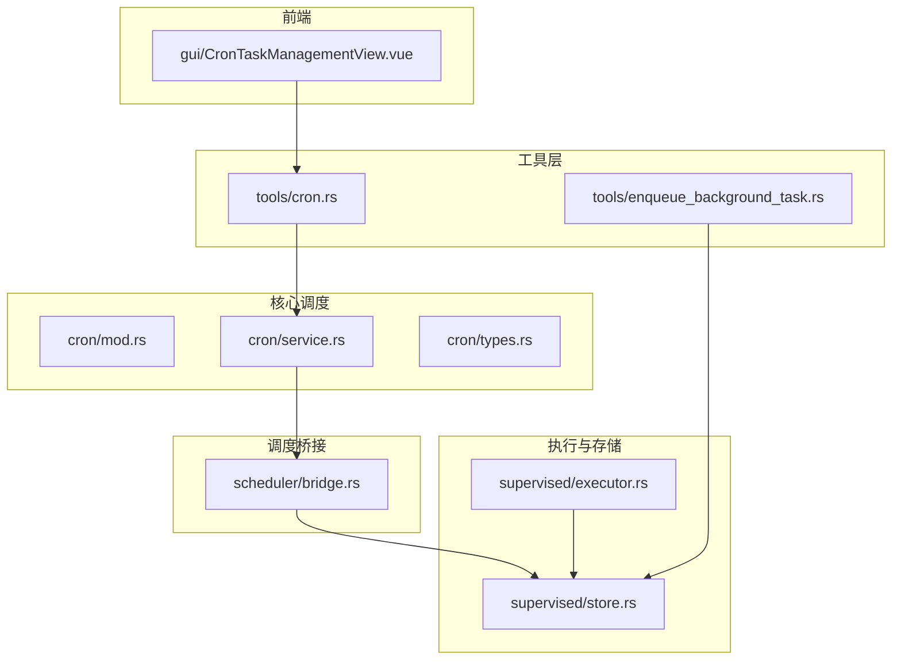
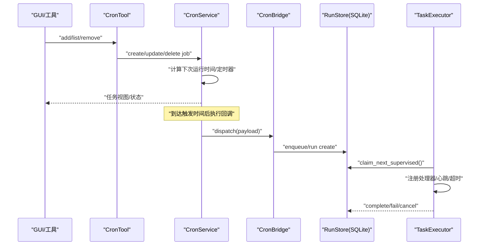
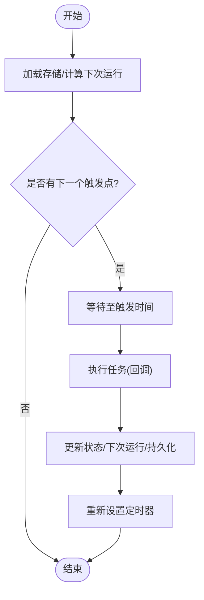
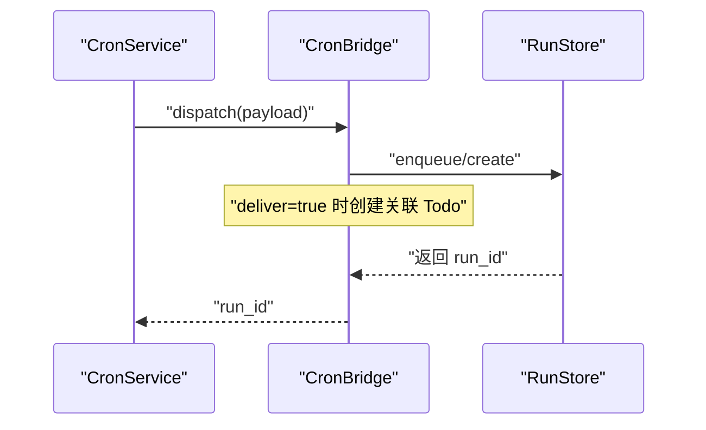
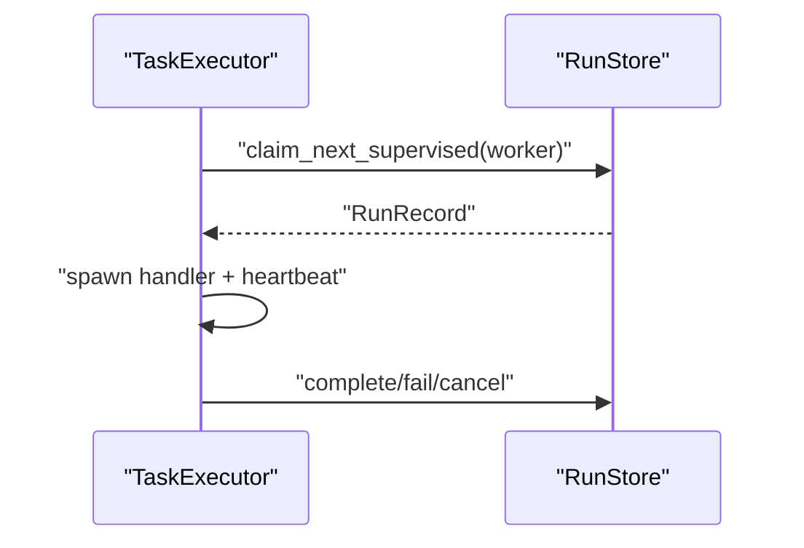
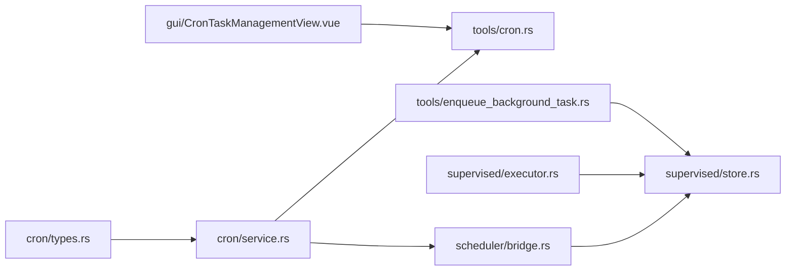

# 定时任务工具

<cite>
**本文引用的文件**
- [agent-diva-core/src/cron/mod.rs](file://agent-diva-core/src/cron/mod.rs)
- [agent-diva-core/src/cron/service.rs](file://agent-diva-core/src/cron/service.rs)
- [agent-diva-core/src/cron/types.rs](file://agent-diva-core/src/cron/types.rs)
- [agent-diva-tools/src/cron.rs](file://agent-diva-tools/src/cron.rs)
- [agent-diva-core/src/scheduler/bridge.rs](file://agent-diva-core/src/scheduler/bridge.rs)
- [agent-diva-core/src/supervised/executor.rs](file://agent-diva-core/src/supervised/executor.rs)
- [agent-diva-core/src/supervised/store.rs](file://agent-diva-core/src/supervised/store.rs)
- [agent-diva-tools/src/enqueue_background_task.rs](file://agent-diva-tools/src/enqueue_background_task.rs)
- [agent-diva-gui/src/components/CronTaskManagementView.vue](file://agent-diva-gui/src/components/CronTaskManagementView.vue)
</cite>

## 目录
1. [简介](#简介)
2. [项目结构](#项目结构)
3. [核心组件](#核心组件)
4. [架构总览](#架构总览)
5. [详细组件分析](#详细组件分析)
6. [依赖关系分析](#依赖关系分析)
7. [性能考虑](#性能考虑)
8. [故障排查指南](#故障排查指南)
9. [结论](#结论)
10. [附录](#附录)

## 简介
本文件面向“定时任务工具”的完整使用与实现说明，覆盖 Cron 表达式配置、任务调度、后台任务队列、任务创建与执行监控、失败重试、日志与审计、并发控制、资源管理、优先级与依赖处理、分布式调度支持、性能优化、监控告警与故障排查等主题。该工具以本地持久化存储为基础，提供 GUI 管理与 CLI 工具调用能力，并通过桥接器将定时触发转换为可执行的后台任务，由工作进程消费执行。

## 项目结构
定时任务相关代码主要分布在以下模块：
- 核心调度与类型定义：core/cron（服务、类型）
- 工具层：tools/cron（通过工具暴露给 Agent/CLI）
- 调度桥接：core/scheduler/bridge（Cron → 后台任务队列）
- 执行与存储：core/supervised（执行器、SQLite 存储）
- 后台任务入队工具：tools/enqueue_background_task
- 前端管理界面：gui/CronTaskManagementView.vue

**图表来源**
- [agent-diva-core/src/cron/mod.rs:1-11](file://agent-diva-core/src/cron/mod.rs#L1-L11)
- [agent-diva-core/src/cron/service.rs:1-120](file://agent-diva-core/src/cron/service.rs#L1-L120)
- [agent-diva-core/src/cron/types.rs:1-120](file://agent-diva-core/src/cron/types.rs#L1-L120)
- [agent-diva-tools/src/cron.rs:1-120](file://agent-diva-tools/src/cron.rs#L1-L120)
- [agent-diva-core/src/scheduler/bridge.rs:1-120](file://agent-diva-core/src/scheduler/bridge.rs#L1-L120)
- [agent-diva-core/src/supervised/executor.rs:1-120](file://agent-diva-core/src/supervised/executor.rs#L1-L120)
- [agent-diva-core/src/supervised/store.rs:1-120](file://agent-diva-core/src/supervised/store.rs#L1-L120)
- [agent-diva-tools/src/enqueue_background_task.rs:1-120](file://agent-diva-tools/src/enqueue_background_task.rs#L1-L120)
- [agent-diva-gui/src/components/CronTaskManagementView.vue:1-120](file://agent-diva-gui/src/components/CronTaskManagementView.vue#L1-L120)

**章节来源**
- [agent-diva-core/src/cron/mod.rs:1-11](file://agent-diva-core/src/cron/mod.rs#L1-L11)
- [agent-diva-core/src/cron/service.rs:1-120](file://agent-diva-core/src/cron/service.rs#L1-L120)
- [agent-diva-core/src/cron/types.rs:1-120](file://agent-diva-core/src/cron/types.rs#L1-L120)
- [agent-diva-tools/src/cron.rs:1-120](file://agent-diva-tools/src/cron.rs#L1-L120)
- [agent-diva-core/src/scheduler/bridge.rs:1-120](file://agent-diva-core/src/scheduler/bridge.rs#L1-L120)
- [agent-diva-core/src/supervised/executor.rs:1-120](file://agent-diva-core/src/supervised/executor.rs#L1-L120)
- [agent-diva-core/src/supervised/store.rs:1-120](file://agent-diva-core/src/supervised/store.rs#L1-L120)
- [agent-diva-tools/src/enqueue_background_task.rs:1-120](file://agent-diva-tools/src/enqueue_background_task.rs#L1-L120)
- [agent-diva-gui/src/components/CronTaskManagementView.vue:1-120](file://agent-diva-gui/src/components/CronTaskManagementView.vue#L1-L120)

## 核心组件
- CronService：负责加载/保存任务清单、计算下次运行时间、定时器唤醒、执行回调、活跃运行跟踪、状态导出。
- CronSchedule：支持 at（一次性）、every（间隔）、cron（表达式+时区）三种调度方式。
- CronTool：对外暴露 add/list/remove 操作，封装上下文（channel/chat_id），防止在任务内嵌套创建新任务。
- CronBridge：将 CronPayload 分发到 SupervisedRunStore，并实现失败重试与死信队列。
- TaskExecutor：从 RunStore 取任务、注册处理器、心跳保活、超时/取消/丢失处理、完成/失败标记。
- RunStore：SQLite 持久化，提供 enqueue/claim/complete/fail/cancel/requeue/mark_lost 等操作，含去重索引与优先级排序。
- EnqueueBackgroundTaskTool：Agent 侧将任务入队到 supervised_runs，支持优先级、标签、元数据、预算限制等。
- GUI CronTaskManagementView：可视化创建/编辑/启停/删除任务，轮询展示运行状态与错误信息。

**章节来源**
- [agent-diva-core/src/cron/service.rs:98-120](file://agent-diva-core/src/cron/service.rs#L98-L120)
- [agent-diva-core/src/cron/types.rs:6-120](file://agent-diva-core/src/cron/types.rs#L6-L120)
- [agent-diva-tools/src/cron.rs:10-120](file://agent-diva-tools/src/cron.rs#L10-L120)
- [agent-diva-core/src/scheduler/bridge.rs:40-98](file://agent-diva-core/src/scheduler/bridge.rs#L40-L98)
- [agent-diva-core/src/supervised/executor.rs:58-120](file://agent-diva-core/src/supervised/executor.rs#L58-L120)
- [agent-diva-core/src/supervised/store.rs:11-95](file://agent-diva-core/src/supervised/store.rs#L11-L95)
- [agent-diva-tools/src/enqueue_background_task.rs:23-120](file://agent-diva-tools/src/enqueue_background_task.rs#L23-L120)
- [agent-diva-gui/src/components/CronTaskManagementView.vue:24-120](file://agent-diva-gui/src/components/CronTaskManagementView.vue#L24-L120)

## 架构总览
下图展示了从 GUI/工具到调度、桥接、执行与存储的端到端流程。

**图表来源**
- [agent-diva-gui/src/components/CronTaskManagementView.vue:260-340](file://agent-diva-gui/src/components/CronTaskManagementView.vue#L260-L340)
- [agent-diva-tools/src/cron.rs:205-248](file://agent-diva-tools/src/cron.rs#L205-L248)
- [agent-diva-core/src/cron/service.rs:176-274](file://agent-diva-core/src/cron/service.rs#L176-L274)
- [agent-diva-core/src/scheduler/bridge.rs:69-98](file://agent-diva-core/src/scheduler/bridge.rs#L69-L98)
- [agent-diva-core/src/supervised/store.rs:355-410](file://agent-diva-core/src/supervised/store.rs#L355-L410)
- [agent-diva-core/src/supervised/executor.rs:90-220](file://agent-diva-core/src/supervised/executor.rs#L90-L220)

## 详细组件分析

### CronService（调度服务）
- 启动/停止：加载持久化存储，重新计算下次运行时间，设置定时器；停止时中止定时器并取消所有活跃运行。
- 调度计算：支持 at/every/cron；cron 表达式会归一化为 6 字段并解析，支持可选时区。
- 执行流程：注册活跃运行快照，记录审计事件，调用 on_job 回调，更新状态与下次运行时间，必要时删除一次性任务。
- 并发控制：同一 job_id 不允许重复运行；通过 CancellationToken 支持取消。
- 持久化：JSON 文件存储任务清单，变更时落盘。

**图表来源**
- [agent-diva-core/src/cron/service.rs:176-274](file://agent-diva-core/src/cron/service.rs#L176-L274)
- [agent-diva-core/src/cron/service.rs:342-458](file://agent-diva-core/src/cron/service.rs#L342-L458)

**章节来源**
- [agent-diva-core/src/cron/service.rs:176-274](file://agent-diva-core/src/cron/service.rs#L176-L274)
- [agent-diva-core/src/cron/service.rs:342-458](file://agent-diva-core/src/cron/service.rs#L342-L458)
- [agent-diva-core/src/cron/types.rs:6-120](file://agent-diva-core/src/cron/types.rs#L6-L120)

### CronTool（工具接口）
- 参数校验与上下文绑定：要求 channel/chat_id，禁止在任务执行中再创建新任务。
- 调度构建：支持 every_seconds、cron_expr、at（ISO 8601）。
- 列表/删除：支持按会话上下文过滤删除，避免跨会话误删。

**章节来源**
- [agent-diva-tools/src/cron.rs:34-152](file://agent-diva-tools/src/cron.rs#L34-L152)
- [agent-diva-tools/src/cron.rs:205-248](file://agent-diva-tools/src/cron.rs#L205-L248)

### CronBridge（调度桥接）
- 分发：将 CronPayload 转为 RunItem 或 SupervisedRunSpec 入队，可选创建 Todo 项用于交付追踪。
- 重试：对失败任务进行指数退避重试，消息前缀记录重试次数，超过最大次数进入死信队列。
- 死信：记录原始消息、重试次数、时间戳，并将原任务标记为已取消。

**图表来源**
- [agent-diva-core/src/scheduler/bridge.rs:69-98](file://agent-diva-core/src/scheduler/bridge.rs#L69-L98)

**章节来源**
- [agent-diva-core/src/scheduler/bridge.rs:15-232](file://agent-diva-core/src/scheduler/bridge.rs#L15-L232)

### TaskExecutor（执行器）
- 循环拉取：claim_next_supervised 按优先级 DESC、创建时间 ASC 选择任务。
- 心跳：每 10 秒发送心跳，防止被判定为丢失。
- 超时/取消/丢失：支持外部取消、任务超时、任务丢失检测。
- 结果上报：完成/失败/取消均写入 Store，并记录审计事件。

**图表来源**
- [agent-diva-core/src/supervised/executor.rs:90-220](file://agent-diva-core/src/supervised/executor.rs#L90-L220)
- [agent-diva-core/src/supervised/store.rs:355-410](file://agent-diva-core/src/supervised/store.rs#L355-L410)

**章节来源**
- [agent-diva-core/src/supervised/executor.rs:90-220](file://agent-diva-core/src/supervised/executor.rs#L90-L220)
- [agent-diva-core/src/supervised/store.rs:355-410](file://agent-diva-core/src/supervised/store.rs#L355-L410)

### RunStore（SQLite 存储）
- 表结构：runs（旧式简单队列）、supervised_runs（增强版，含 kind/priority/attempt/max_attempts/timeout/metadata/tags 等）。
- 关键特性：
  - 原子 claim：使用 RETURNING 保证唯一领取。
  - 去重：基于 message/channel/cron_job_id 的去重索引（仅 queued 状态）。
  - 优先级：priority 越高越先执行。
  - 心跳/丢失：支持心跳更新与过期标记为 lost。
  - 审计：创建/认领/完成/失败/取消/丢失/重入队均记录审计事件。

**章节来源**
- [agent-diva-core/src/supervised/store.rs:11-95](file://agent-diva-core/src/supervised/store.rs#L11-L95)
- [agent-diva-core/src/supervised/store.rs:355-410](file://agent-diva-core/src/supervised/store.rs#L355-L410)
- [agent-diva-core/src/supervised/store.rs:627-729](file://agent-diva-core/src/supervised/store.rs#L627-L729)

### EnqueueBackgroundTaskTool（后台任务入队）
- 支持优先级、标签、通道、会话键、追踪 ID、父任务 ID、令牌预算限制等元数据。
- 将参数映射为 SupervisedRunSpec，创建记录并返回 run_id。

**章节来源**
- [agent-diva-tools/src/enqueue_background_task.rs:23-171](file://agent-diva-tools/src/enqueue_background_task.rs#L23-L171)

### GUI CronTaskManagementView（任务管理界面）
- 功能：创建/编辑/启用/暂停/立即运行/停止/删除任务；搜索与筛选（活动/计划/全部）。
- 数据流：通过 invoke 调用后端命令获取任务列表，轮询刷新状态。
- 展示：显示下次运行时间、上次运行时间、频道/收件人、运行时长、错误信息等。

**章节来源**
- [agent-diva-gui/src/components/CronTaskManagementView.vue:260-340](file://agent-diva-gui/src/components/CronTaskManagementView.vue#L260-L340)
- [agent-diva-gui/src/components/CronTaskManagementView.vue:338-351](file://agent-diva-gui/src/components/CronTaskManagementView.vue#L338-L351)
- [agent-diva-gui/src/components/CronTaskManagementView.vue:528-654](file://agent-diva-gui/src/components/CronTaskManagementView.vue#L528-L654)

## 依赖关系分析
- CronService 依赖 types（调度与任务模型）与持久化 JSON 文件。
- CronTool 依赖 CronService，并维护会话上下文。
- CronBridge 依赖 RunStore 与 TodoStore，实现重试与死信。
- TaskExecutor 依赖 RunStore，按 RunKind 路由到具体处理器。
- GUI 通过 Tauri invoke 与后端交互，读取任务视图。

**图表来源**
- [agent-diva-core/src/cron/types.rs:1-120](file://agent-diva-core/src/cron/types.rs#L1-L120)
- [agent-diva-core/src/cron/service.rs:1-120](file://agent-diva-core/src/cron/service.rs#L1-L120)
- [agent-diva-tools/src/cron.rs:1-120](file://agent-diva-tools/src/cron.rs#L1-L120)
- [agent-diva-core/src/scheduler/bridge.rs:1-120](file://agent-diva-core/src/scheduler/bridge.rs#L1-L120)
- [agent-diva-core/src/supervised/store.rs:1-120](file://agent-diva-core/src/supervised/store.rs#L1-L120)
- [agent-diva-core/src/supervised/executor.rs:1-120](file://agent-diva-core/src/supervised/executor.rs#L1-L120)
- [agent-diva-tools/src/enqueue_background_task.rs:1-120](file://agent-diva-tools/src/enqueue_background_task.rs#L1-L120)
- [agent-diva-gui/src/components/CronTaskManagementView.vue:1-120](file://agent-diva-gui/src/components/CronTaskManagementView.vue#L1-L120)

**章节来源**
- [agent-diva-core/src/cron/types.rs:1-120](file://agent-diva-core/src/cron/types.rs#L1-L120)
- [agent-diva-core/src/cron/service.rs:1-120](file://agent-diva-core/src/cron/service.rs#L1-L120)
- [agent-diva-tools/src/cron.rs:1-120](file://agent-diva-tools/src/cron.rs#L1-L120)
- [agent-diva-core/src/scheduler/bridge.rs:1-120](file://agent-diva-core/src/scheduler/bridge.rs#L1-L120)
- [agent-diva-core/src/supervised/store.rs:1-120](file://agent-diva-core/src/supervised/store.rs#L1-L120)
- [agent-diva-core/src/supervised/executor.rs:1-120](file://agent-diva-core/src/supervised/executor.rs#L1-L120)
- [agent-diva-tools/src/enqueue_background_task.rs:1-120](file://agent-diva-tools/src/enqueue_background_task.rs#L1-L120)
- [agent-diva-gui/src/components/CronTaskManagementView.vue:1-120](file://agent-diva-gui/src/components/CronTaskManagementView.vue#L1-L120)

## 性能考虑
- 调度精度与开销：Cron 表达式解析与下次运行时间计算在每次任务完成后重算，避免频繁扫描。
- 任务去重：supervised_runs 表对相同 message/channel/cron_job_id 的去重索引可减少重复入队。
- 优先级与公平性：高优先级优先执行，同时按创建时间排序保障公平性。
- 心跳与丢失检测：10 秒心跳降低假死风险；长时间无心跳的任务会被标记为丢失。
- 存储性能：SQLite WAL 模式提升并发读写能力；busy_timeout 缓解锁争用。
- 批量与节流：GUI 每 5 秒轮询一次，避免高频请求。

[本节为通用指导，不直接分析具体文件]

## 故障排查指南
- 任务未触发：检查 CronService 是否 start、next_run_at_ms 是否计算正确、定时器是否 arm。
- 任务重复执行：确认 active_runs 中是否存在同 job_id 的活跃运行；检查回调是否提前返回导致状态未更新。
- 任务失败重试：查看 CronBridge 的重试计数与死信队列；确认 RunStore 中任务状态是否为 Failed。
- 执行器未消费：检查 TaskExecutor 是否注册了对应 RunKind 的处理器；查看 claim_next_supervised 是否能取到任务。
- 心跳异常：确认心跳路径与 worker_id 匹配；若心跳失败，任务可能被标记为 Lost。
- GUI 无法刷新：检查 invoke 调用是否成功；确认后端服务是否正常运行。

**章节来源**
- [agent-diva-core/src/cron/service.rs:176-274](file://agent-diva-core/src/cron/service.rs#L176-L274)
- [agent-diva-core/src/scheduler/bridge.rs:100-232](file://agent-diva-core/src/scheduler/bridge.rs#L100-L232)
- [agent-diva-core/src/supervised/executor.rs:123-220](file://agent-diva-core/src/supervised/executor.rs#L123-L220)
- [agent-diva-core/src/supervised/store.rs:412-460](file://agent-diva-core/src/supervised/store.rs#L412-L460)
- [agent-diva-gui/src/components/CronTaskManagementView.vue:260-340](file://agent-diva-gui/src/components/CronTaskManagementView.vue#L260-L340)

## 结论
该定时任务工具提供了从配置、调度、执行到监控的完整闭环。通过 CronService 的灵活调度、CronBridge 的可靠重试与死信机制、TaskExecutor 的心跳与超时保护、以及 RunStore 的高并发与优先级支持，能够满足大多数单机场景下的定时任务需求。GUI 提供了直观的管理界面，便于日常运维与问题定位。对于更高可用性与分布式需求，可在现有架构基础上扩展多实例协调与共享存储。

[本节为总结性内容，不直接分析具体文件]

## 附录

### Cron 表达式与调度模式
- at：一次性任务，指定毫秒时间戳。
- every：周期性任务，指定毫秒间隔。
- cron：标准 Cron 表达式，支持可选时区；内部归一化为 6 字段并解析。

**章节来源**
- [agent-diva-core/src/cron/types.rs:6-45](file://agent-diva-core/src/cron/types.rs#L6-L45)
- [agent-diva-core/src/cron/service.rs:25-81](file://agent-diva-core/src/cron/service.rs#L25-L81)

### 任务生命周期与状态
- 生命周期：Scheduled → Running → Completed/Failed/Cancelled/Lost
- 状态来源：CronService 计算 computed_status；RunStore 记录实际状态。

**章节来源**
- [agent-diva-core/src/cron/service.rs:276-295](file://agent-diva-core/src/cron/service.rs#L276-L295)
- [agent-diva-core/src/supervised/store.rs:355-410](file://agent-diva-core/src/supervised/store.rs#L355-L410)

### 失败重试与死信队列
- 重试策略：指数退避，消息前缀记录重试次数。
- 死信：超过最大重试次数后记录到 dead_letters.jsonl，并将原任务标记为 Cancelled。

**章节来源**
- [agent-diva-core/src/scheduler/bridge.rs:100-232](file://agent-diva-core/src/scheduler/bridge.rs#L100-L232)

### 并发控制与资源管理
- 单任务并发：active_runs 确保同一 job_id 仅一个运行实例。
- 取消机制：CancellationToken 支持优雅取消。
- 心跳与丢失：10 秒心跳，长时间无心跳标记为 Lost。

**章节来源**
- [agent-diva-core/src/cron/service.rs:302-340](file://agent-diva-core/src/cron/service.rs#L302-L340)
- [agent-diva-core/src/supervised/executor.rs:142-166](file://agent-diva-core/src/supervised/executor.rs#L142-L166)
- [agent-diva-core/src/supervised/store.rs:627-679](file://agent-diva-core/src/supervised/store.rs#L627-L679)

### 优先级与依赖处理
- 优先级：supervised_runs.priority 越高越先执行。
- 依赖：可通过 metadata/parent_id 表达依赖关系；执行器需根据业务逻辑实现依赖检查。

**章节来源**
- [agent-diva-core/src/supervised/store.rs:355-410](file://agent-diva-core/src/supervised/store.rs#L355-L410)
- [agent-diva-tools/src/enqueue_background_task.rs:126-162](file://agent-diva-tools/src/enqueue_background_task.rs#L126-L162)

### 分布式调度支持
- 当前实现为单机 SQLite 存储；如需分布式，可替换为共享数据库或引入协调服务（如 Redis/ZK）以实现任务抢占与全局状态同步。
- 建议：保持 claim 操作的原子性，确保多实例下任务不被重复执行。

[本节为概念性扩展，不直接分析具体文件]

### 监控与告警
- 审计事件：任务创建、认领、完成、失败、取消、丢失、重入队均有审计记录。
- GUI 展示：运行时长、错误信息、下次运行时间等便于快速定位问题。

**章节来源**
- [agent-diva-core/src/supervised/store.rs:510-523](file://agent-diva-core/src/supervised/store.rs#L510-L523)
- [agent-diva-core/src/supervised/store.rs:573-579](file://agent-diva-core/src/supervised/store.rs#L573-L579)
- [agent-diva-core/src/supervised/store.rs:619-625](file://agent-diva-core/src/supervised/store.rs#L619-L625)
- [agent-diva-gui/src/components/CronTaskManagementView.vue:624-654](file://agent-diva-gui/src/components/CronTaskManagementView.vue#L624-L654)

### 最佳实践
- 合理设置 Cron 表达式与时区，避免无效触发。
- 为长耗时任务设置 timeout_secs，防止资源占用。
- 使用 deliver 与 channel/to 实现定向交付与追踪。
- 利用 priority 区分紧急任务，结合 GUI 监控及时干预。
- 定期清理已完成/失败任务，避免存储膨胀。

[本节为通用指导，不直接分析具体文件]