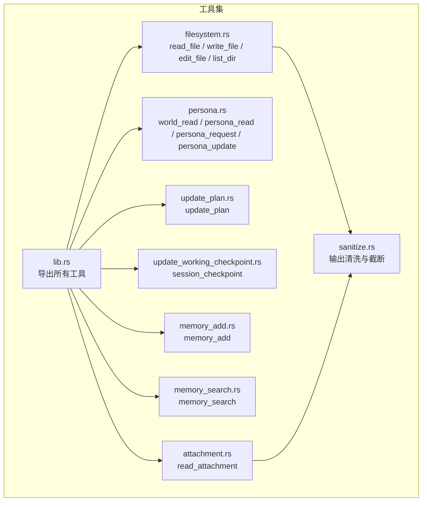
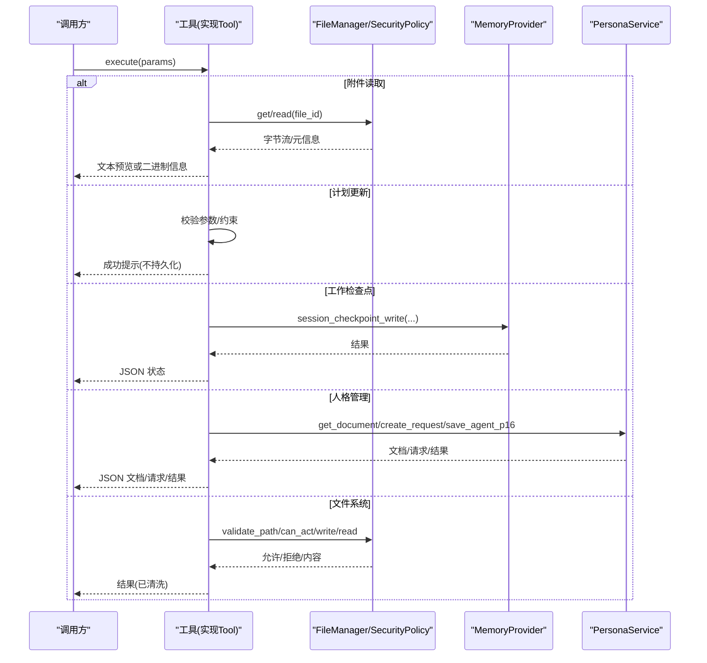
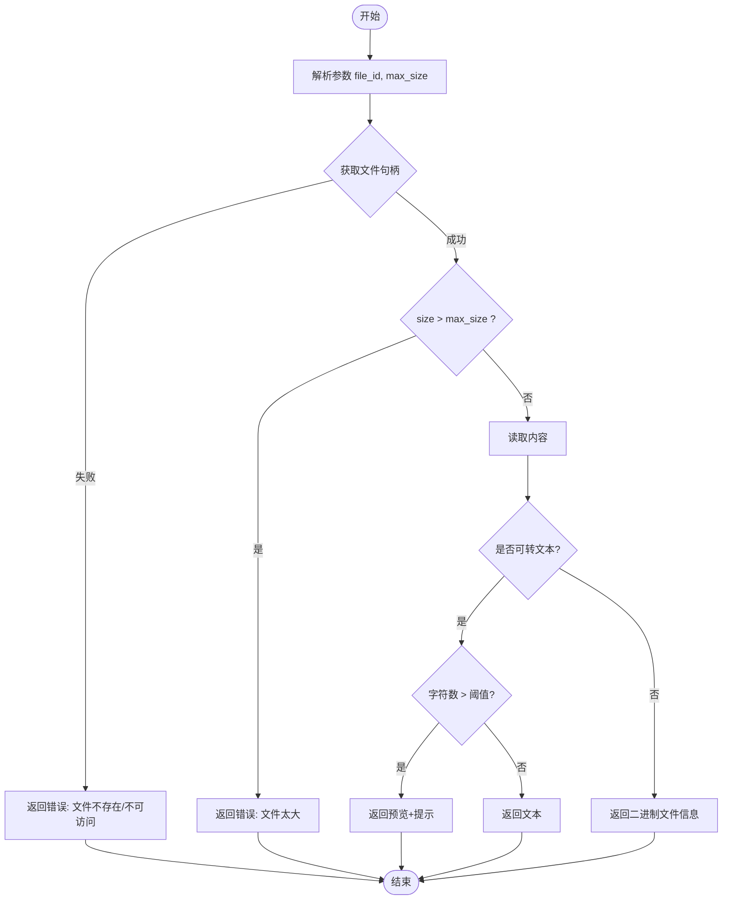
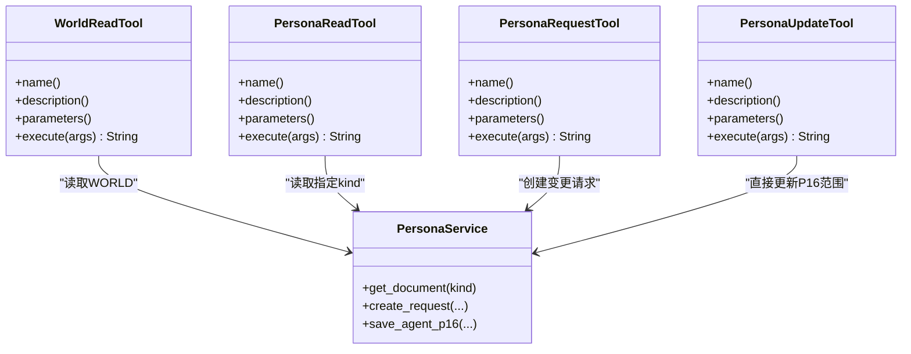
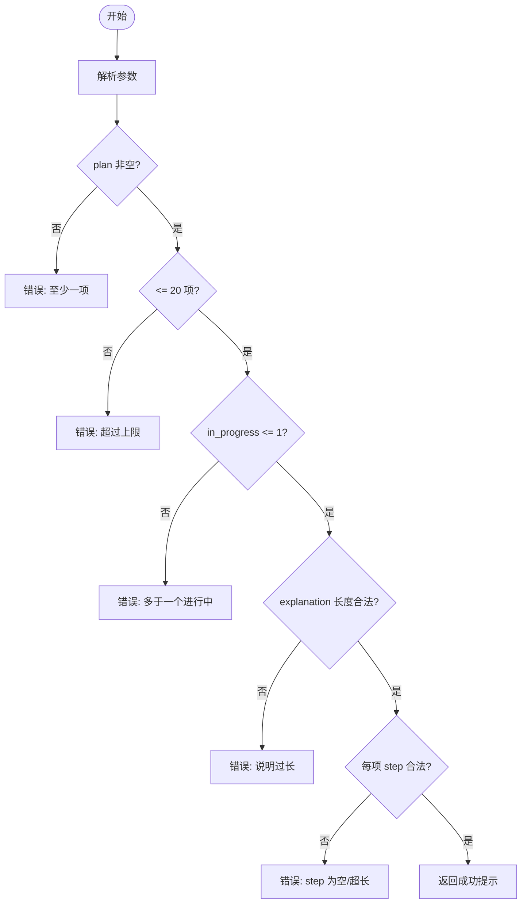
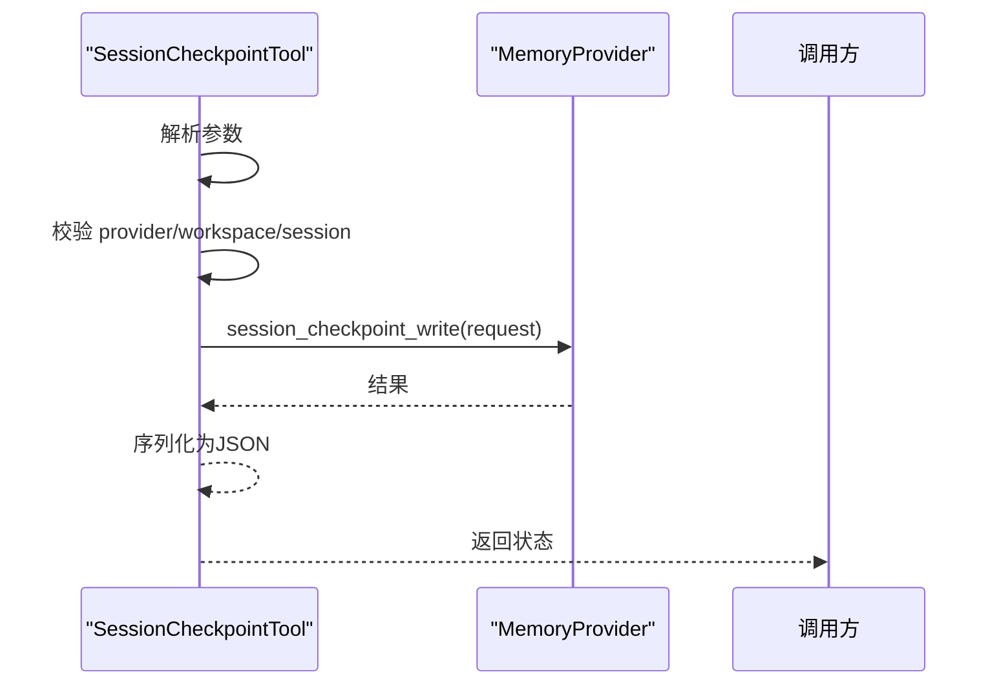
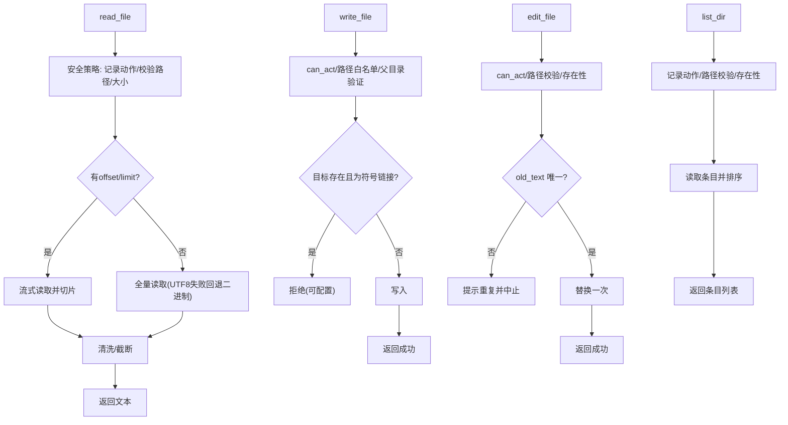
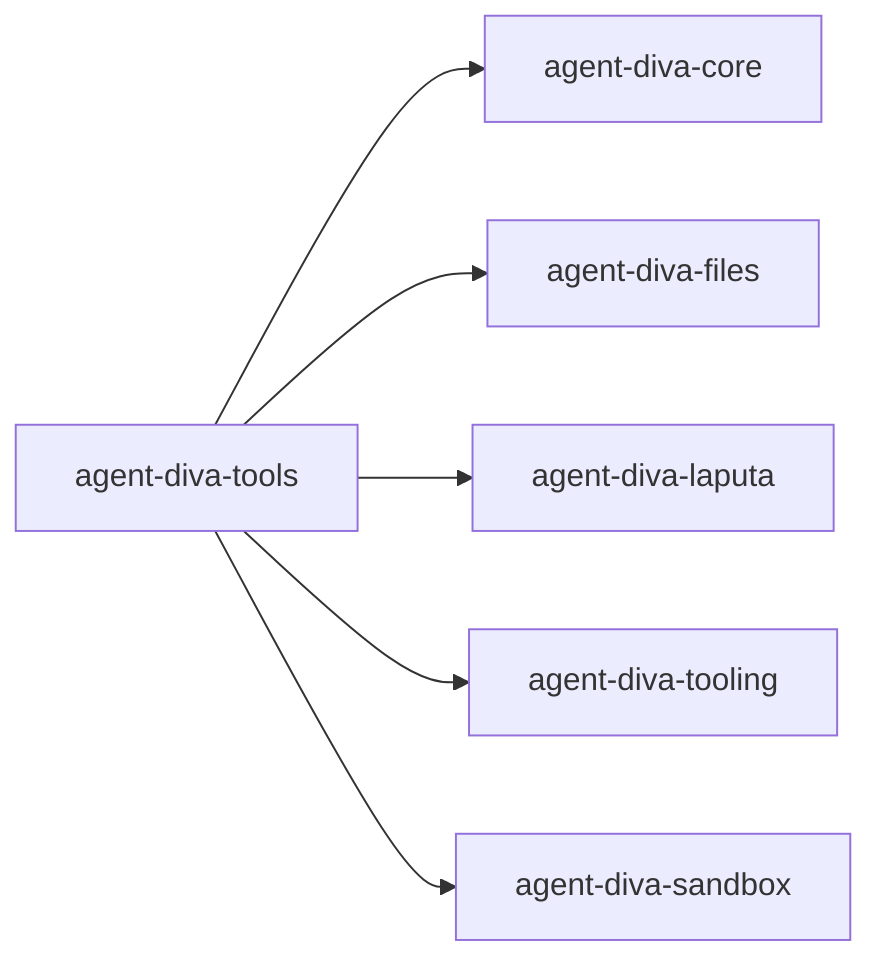

# 实用工具集

<cite>
**本文引用的文件**
- [lib.rs](file://agent-diva-tools/src/lib.rs)
- [attachment.rs](file://agent-diva-tools/src/attachment.rs)
- [persona.rs](file://agent-diva-tools/src/persona.rs)
- [update_plan.rs](file://agent-diva-tools/src/update_plan.rs)
- [update_working_checkpoint.rs](file://agent-diva-tools/src/update_working_checkpoint.rs)
- [memory_add.rs](file://agent-diva-tools/src/memory_add.rs)
- [memory_search.rs](file://agent-diva-tools/src/memory_search.rs)
- [filesystem.rs](file://agent-diva-tools/src/filesystem.rs)
- [sanitize.rs](file://agent-diva-tools/src/sanitize.rs)
- [Cargo.toml](file://agent-diva-tools/Cargo.toml)
</cite>

## 目录
1. [简介](#简介)
2. [项目结构](#项目结构)
3. [核心组件](#核心组件)
4. [架构总览](#架构总览)
5. [详细组件分析](#详细组件分析)
6. [依赖关系分析](#依赖关系分析)
7. [性能考虑](#性能考虑)
8. [故障排查指南](#故障排查指南)
9. [结论](#结论)
10. [附录](#附录)

## 简介
本文件面向 Agent-Diva 的“实用工具集”，聚焦以下辅助能力：附件处理、人格管理、计划更新、工作检查点，以及与之配套的内存读写、文件系统操作与结果清洗等。文档将说明每个工具的使用场景、参数配置、返回值格式、组合使用最佳实践、性能优化建议、协作关系与数据流转机制，并提供常见问题解决方案与扩展开发指引。

## 项目结构
工具集位于 agent-diva-tools 包中，采用模块化组织：每个工具一个模块，统一实现 Tool trait，并通过 lib.rs 集中导出。关键文件包括：
- 工具注册与导出：lib.rs
- 附件读取：attachment.rs
- 人格权限读写：persona.rs
- 轻量计划更新：update_plan.rs
- 会话级工作检查点：update_working_checkpoint.rs
- 长期记忆写入与检索：memory_add.rs、memory_search.rs
- 安全文件操作：filesystem.rs
- 输出清洗与截断：sanitize.rs
- 依赖声明：Cargo.toml

图表来源
- [lib.rs:1-74](file://agent-diva-tools/src/lib.rs#L1-L74)
- [attachment.rs:1-206](file://agent-diva-tools/src/attachment.rs#L1-L206)
- [persona.rs:1-354](file://agent-diva-tools/src/persona.rs#L1-L354)
- [update_plan.rs:1-280](file://agent-diva-tools/src/update_plan.rs#L1-L280)
- [update_working_checkpoint.rs:1-205](file://agent-diva-tools/src/update_working_checkpoint.rs#L1-L205)
- [memory_add.rs:1-114](file://agent-diva-tools/src/memory_add.rs#L1-L114)
- [memory_search.rs:1-105](file://agent-diva-tools/src/memory_search.rs#L1-L105)
- [filesystem.rs:1-707](file://agent-diva-tools/src/filesystem.rs#L1-L707)
- [sanitize.rs:1-233](file://agent-diva-tools/src/sanitize.rs#L1-L233)

章节来源
- [lib.rs:1-74](file://agent-diva-tools/src/lib.rs#L1-L74)
- [Cargo.toml:1-60](file://agent-diva-tools/Cargo.toml#L1-L60)

## 核心组件
- 附件处理：ReadAttachmentTool（read_attachment）用于通过 file_id 读取内容地址存储中的文件，支持大小限制与文本/二进制分流展示。
- 人格管理：WorldReadTool、PersonaReadTool、PersonaRequestTool、PersonaUpdateTool 提供对 Persona 权威文档的只读、受控变更请求与受限直接更新。
- 计划更新：UpdatePlanTool（update_plan）在普通聊天模式下维护轻量 TODO 清单，不持久化到计划注册表。
- 工作检查点：SessionCheckpointTool（session_checkpoint）记录会话内临时检查点，随会话结束清理。
- 长期记忆：MemoryAddTool（memory_add）、MemorySearchTool（memory_search）提供低风险的即时写入与检索。
- 文件系统：ReadFileTool、WriteFileTool、EditFileTool、ListDirTool 提供带安全策略的文件操作。
- 输出清洗：sanitize_for_json、truncate_file_content、truncate_tool_result 确保返回结果可安全序列化并控制体积。

章节来源
- [attachment.rs:1-206](file://agent-diva-tools/src/attachment.rs#L1-L206)
- [persona.rs:1-354](file://agent-diva-tools/src/persona.rs#L1-L354)
- [update_plan.rs:1-280](file://agent-diva-tools/src/update_plan.rs#L1-L280)
- [update_working_checkpoint.rs:1-205](file://agent-diva-tools/src/update_working_checkpoint.rs#L1-L205)
- [memory_add.rs:1-114](file://agent-diva-tools/src/memory_add.rs#L1-L114)
- [memory_search.rs:1-105](file://agent-diva-tools/src/memory_search.rs#L1-L105)
- [filesystem.rs:1-707](file://agent-diva-tools/src/filesystem.rs#L1-L707)
- [sanitize.rs:1-233](file://agent-diva-tools/src/sanitize.rs#L1-L233)

## 架构总览
工具集围绕统一的 Tool trait 构建，各工具通过依赖注入获取外部能力（如 FileManager、MemoryProvider、SecurityPolicy、PersonaService），执行后返回字符串或 JSON 字符串。上层编排器负责调用工具、解析结果、触发事件或持久化。

图表来源
- [attachment.rs:66-143](file://agent-diva-tools/src/attachment.rs#L66-L143)
- [update_plan.rs:75-130](file://agent-diva-tools/src/update_plan.rs#L75-L130)
- [update_working_checkpoint.rs:97-125](file://agent-diva-tools/src/update_working_checkpoint.rs#L97-L125)
- [persona.rs:68-79, 133-141, 203-218, 273-281:68-79](file://agent-diva-tools/src/persona.rs#L68-L79)
- [filesystem.rs:69-144, 198-260, 318-385, 435-487:69-144](file://agent-diva-tools/src/filesystem.rs#L69-L144)

## 详细组件分析

### 附件处理：read_attachment
- 使用场景：通过 file_id（SHA256）读取已上传附件；当无法作为文本显示时返回文件元信息。
- 参数
  - file_id（必填）：要读取的附件标识
  - max_size（可选，默认 1MB）：最大读取大小，超过则报错
- 返回值：文本内容（超长会截断并提示）或二进制文件信息（名称、大小、MIME 类型等）
- 错误处理：缺少参数、文件不存在/不可访问、超出大小限制、读取失败
- 性能要点：先检查文件大小再读取；文本超长时仅截取前 N 字符展示

图表来源
- [attachment.rs:66-143](file://agent-diva-tools/src/attachment.rs#L66-L143)

章节来源
- [attachment.rs:1-206](file://agent-diva-tools/src/attachment.rs#L1-L206)

### 人格管理：world_read / persona_read / persona_request / persona_update
- 使用场景
  - world_read：读取用户拥有的 WORLD 权威文档及其修订与哈希
  - persona_read：按 kind 读取任意注册的 Persona Markdown 文档及 CAS 元数据
  - persona_request：为需用户审阅的权威文档提交受控变更请求（P5）
  - persona_update：直接更新仅限代理可写的窄范围（P16：DREAM、DARK、USER 的观察区）
- 参数
  - world_read：无
  - persona_read：kind（identity/relationship/redline/user/world/dream/dark）
  - persona_request：kind、base_revision、base_hash、proposed_markdown、reason
  - persona_update：kind（dream/dark/user）、content、reason
- 返回值：JSON 序列化的文档/请求/结果对象
- 错误处理：未配置配置根、非法 kind、越权写入、序列化失败
- 协作关系：依赖 PersonaService；严格区分“请求”与“直接更新”的权限边界

图表来源
- [persona.rs:31-80, 82-142, 144-219, 221-282:31-80](file://agent-diva-tools/src/persona.rs#L31-L80)

章节来源
- [persona.rs:1-354](file://agent-diva-tools/src/persona.rs#L1-L354)

### 计划更新：update_plan
- 使用场景：在普通聊天中发布当前任务的轻量 TODO/进度清单，供对话历史展示；不执行步骤，也不持久化到计划注册表。
- 参数
  - explanation（可选，最长 1000 字符）：更新说明
  - plan（必填，最多 20 项）：每项包含 step（最长 500 字符）与 status（pending/in_progress/completed），且至多一项 in_progress
- 返回值：成功提示（包含条目数量）
- 错误处理：空计划、超项数、多个 in_progress、step 为空或超长、explanation 超长
- 设计要点：纯校验与格式化，由上层编排器负责发出对应事件

图表来源
- [update_plan.rs:75-130](file://agent-diva-tools/src/update_plan.rs#L75-L130)

章节来源
- [update_plan.rs:1-280](file://agent-diva-tools/src/update_plan.rs#L1-L280)

### 工作检查点：session_checkpoint
- 使用场景：在当前会话中记录任务状态的易失性检查点，可见于本轮上下文，会话结束时清除；如需长期知识请使用 memory_distill。
- 参数
  - key_info（必填）：结构化关键事实
  - related_sops（可选）：相关技能/SOP 名称列表
  - content（可选）：自由文本内容
- 返回值：JSON 状态对象（成功/失败原因）
- 错误处理：未配置 MemoryProvider、未配置 workspace、无活跃会话、参数解析失败
- 协作关系：通过 MemoryProvider.session_checkpoint_write 写入，绑定 workspace 与 session_id

图表来源
- [update_working_checkpoint.rs:97-125](file://agent-diva-tools/src/update_working_checkpoint.rs#L97-L125)

章节来源
- [update_working_checkpoint.rs:1-205](file://agent-diva-tools/src/update_working_checkpoint.rs#L1-L205)

### 长期记忆：memory_add / memory_search
- memory_add
  - 用途：低风险即时写入用户确认的事实或偏好到长期 BML；证据引用为建议性质
  - 参数：content（必填）
  - 返回值：JSON 结果对象
  - 错误处理：provider/workspace 不可用、参数解析失败、执行异常
- memory_search
  - 用途：搜索已应用的记忆权威，回答“是否记住了某事”或在对话中召回
  - 参数：query（必填）
  - 返回值：JSON 搜索结果
  - 错误处理：同上

章节来源
- [memory_add.rs:1-114](file://agent-diva-tools/src/memory_add.rs#L1-L114)
- [memory_search.rs:1-105](file://agent-diva-tools/src/memory_search.rs#L1-L105)

### 文件系统：read_file / write_file / edit_file / list_dir
- read_file
  - 参数：path（必填）、offset（可选行号）、limit（可选行数）
  - 行为：安全策略校验路径与大小；支持偏移/限流的流式读取；超大内容自动截断并清洗
  - 返回：文本内容（已清洗）
- write_file
  - 参数：path、content
  - 行为：权限检查、父目录验证、防符号链接（可配置）、写入
  - 返回：成功消息
- edit_file
  - 参数：path、old_text、new_text
  - 行为：精确匹配替换，重复出现时给出警告
  - 返回：成功消息
- list_dir
  - 参数：path
  - 行为：列出目录条目，标记文件/目录图标
  - 返回：排序后的条目列表
- 安全策略：路径合法性、速率限制、读写模式（只读/受限）、TOCTOU 防护

图表来源
- [filesystem.rs:69-144, 198-260, 318-385, 435-487:69-144](file://agent-diva-tools/src/filesystem.rs#L69-L144)

章节来源
- [filesystem.rs:1-707](file://agent-diva-tools/src/filesystem.rs#L1-L707)

### 输出清洗：sanitize_for_json / truncate_*
- sanitize_for_json：移除 ANSI 转义与控制字符，保留正常空白与 Unicode
- truncate_file_content：文件内容超长时返回前 N 字符预览与提示
- truncate_tool_result：工具结果整体截断，避免向 LLM 发送过大响应
- 适用场景：所有可能产生大量或含控制字符输出的工具（如 read_file、read_attachment）

章节来源
- [sanitize.rs:1-233](file://agent-diva-tools/src/sanitize.rs#L1-L233)

## 依赖关系分析
- 内部依赖
  - agent_diva_core：安全策略、内存接口、计划常量等
  - agent_diva_files：内容地址存储的文件管理器
  - agent_diva_laputa：人格服务
  - agent_diva_tooling：Tool trait、错误类型、注册表
  - agent_diva_sandbox：沙箱（工具包依赖声明）
- 外部依赖
  - tokio、async-trait：异步运行时
  - serde/serde_json：序列化
  - reqwest：HTTP（网络工具）
  - regex：正则清洗
  - chrono：时间
  - encoding_rs：Windows 控制台编码兼容
  - rust-mcp-sdk：MCP 工具发现与调用

图表来源
- [Cargo.toml:12-17](file://agent-diva-tools/Cargo.toml#L12-L17)

章节来源
- [Cargo.toml:1-60](file://agent-diva-tools/Cargo.toml#L1-L60)

## 性能考虑
- 大文件读取
  - 使用 offset/limit 进行流式读取，避免一次性加载大文件
  - 文本超长时仅截取前 N 字符展示，减少传输与渲染开销
- 附件读取
  - 先检查文件大小再读取，避免不必要 I/O
  - 二进制文件仅返回元信息，不尝试转换
- 输出清洗
  - 使用正则预编译缓存（OnceLock）提升性能
  - 统一截断策略防止响应过大导致 LLM 端 400 错误
- 安全策略
  - 路径校验与速率限制前置，尽早失败
  - 写操作前进行 TOCTOU 安全的父目录验证

[本节为通用指导，无需特定文件来源]

## 故障排查指南
- 附件读取失败
  - 现象：返回“文件不存在或无法访问”或“文件太大”
  - 排查：确认 file_id 正确；调整 max_size；确认文件已上传且未被删除
  - 参考：[attachment.rs:66-96](file://agent-diva-tools/src/attachment.rs#L66-L96)
- 人格管理不可用
  - 现象：返回“persona_unavailable”
  - 排查：确保已配置 Persona 配置根；初始化服务后再调用
  - 参考：[persona.rs:12-24](file://agent-diva-tools/src/persona.rs#L12-L24)
- 计划更新参数错误
  - 现象：返回“plan must contain at least one item”、“more than one in_progress”等
  - 排查：检查 plan 非空、项数不超过 20、至多一个 in_progress、step 非空且不超长
  - 参考：[update_plan.rs:75-130](file://agent-diva-tools/src/update_plan.rs#L75-L130)
- 工作检查点失败
  - 现象：返回“memory provider unavailable”、“no active session”
  - 排查：确保注入 MemoryProvider、workspace 与 session_id；检查会话生命周期
  - 参考：[update_working_checkpoint.rs:97-125](file://agent-diva-tools/src/update_working_checkpoint.rs#L97-L125)
- 文件系统权限/路径问题
  - 现象：返回“read-only”、“路径不允许”、“Rate limit”等
  - 排查：检查 SecurityPolicy 级别与配置；确认路径在工作区内；注意速率限制
  - 参考：[filesystem.rs:84-108, 209-249, 652-705:84-108](file://agent-diva-tools/src/filesystem.rs#L84-L108)

章节来源
- [attachment.rs:66-96](file://agent-diva-tools/src/attachment.rs#L66-L96)
- [persona.rs:12-24](file://agent-diva-tools/src/persona.rs#L12-L24)
- [update_plan.rs:75-130](file://agent-diva-tools/src/update_plan.rs#L75-L130)
- [update_working_checkpoint.rs:97-125](file://agent-diva-tools/src/update_working_checkpoint.rs#L97-L125)
- [filesystem.rs:84-108, 209-249, 652-705:84-108](file://agent-diva-tools/src/filesystem.rs#L84-L108)

## 结论
Agent-Diva 的工具集以统一接口暴露了附件处理、人格管理、计划更新与工作检查点等关键能力，并通过安全策略与输出清洗保障稳定性与安全性。结合长期记忆的读写，可在会话内高效推进任务并保持上下文一致性。遵循本文的最佳实践与故障排查建议，可实现稳定、可控、可扩展的工具链集成。

[本节为总结，无需特定文件来源]

## 附录

### 工具组合使用最佳实践
- 典型流程
  - 先 memory_search 查询是否已有相关信息，再决定 memory_add 写入
  - 使用 update_plan 维护当前任务的轻量计划，配合 session_checkpoint 保存中间状态
  - 需要读取用户上传材料时，使用 read_attachment；若为代码/文档，可用 read_file 配合 offset/limit 分段阅读
  - 修改人格文档时优先使用 persona_request 走审批流程；仅在 P16 范围内才使用 persona_update
- 数据流转
  - 工具返回字符串或 JSON 字符串，上层编排器负责解析与分发
  - 大输出一律经 sanitize 清洗与截断，避免下游解析失败
- 性能优化
  - 批量操作前先估算数据量，必要时分片
  - 利用流式读取与分页参数减少内存占用
  - 合理设置 max_size 与 MAX_FILE_CONTENT_CHARS，平衡可读性与性能

[本节为通用指导，无需特定文件来源]

### 扩展开发指南
- 新增工具步骤
  - 在 agent-diva-tools/src 下新建模块，实现 Tool trait（name/description/parameters/execute）
  - 在 lib.rs 中导出新工具
  - 在 Cargo.toml 中添加必要依赖
- 依赖注入
  - 通过构造函数注入共享资源（如 Arc<FileManager>、Arc<dyn MemoryProvider>、SharedSecurityPolicy）
  - 保持工具无状态或最小状态，便于并发与测试
- 错误处理
  - 使用 ToolError 表达参数错误与执行失败
  - 对用户友好的错误消息，同时保留调试信息
- 测试
  - 为每个工具编写单元测试，覆盖正常路径与边界条件
  - 使用临时目录与模拟 Provider 隔离外部依赖

[本节为通用指导，无需特定文件来源]