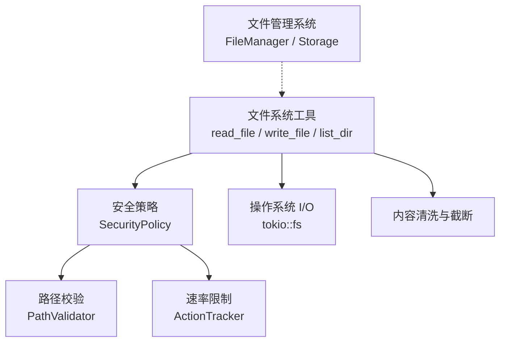
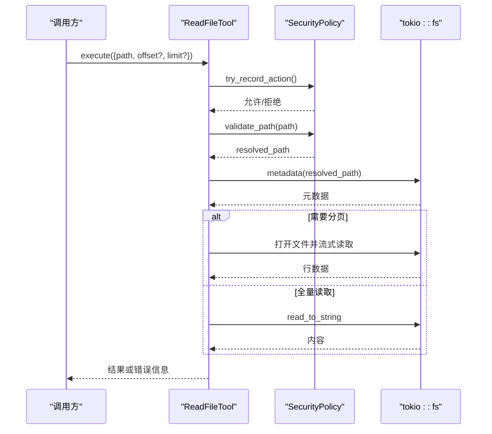
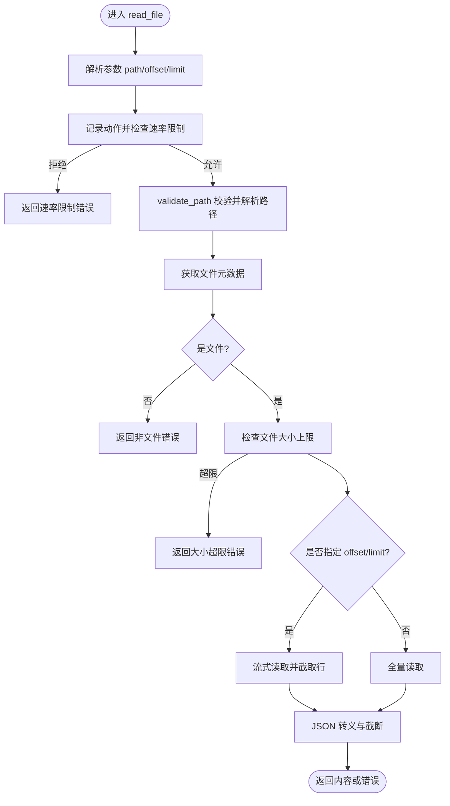
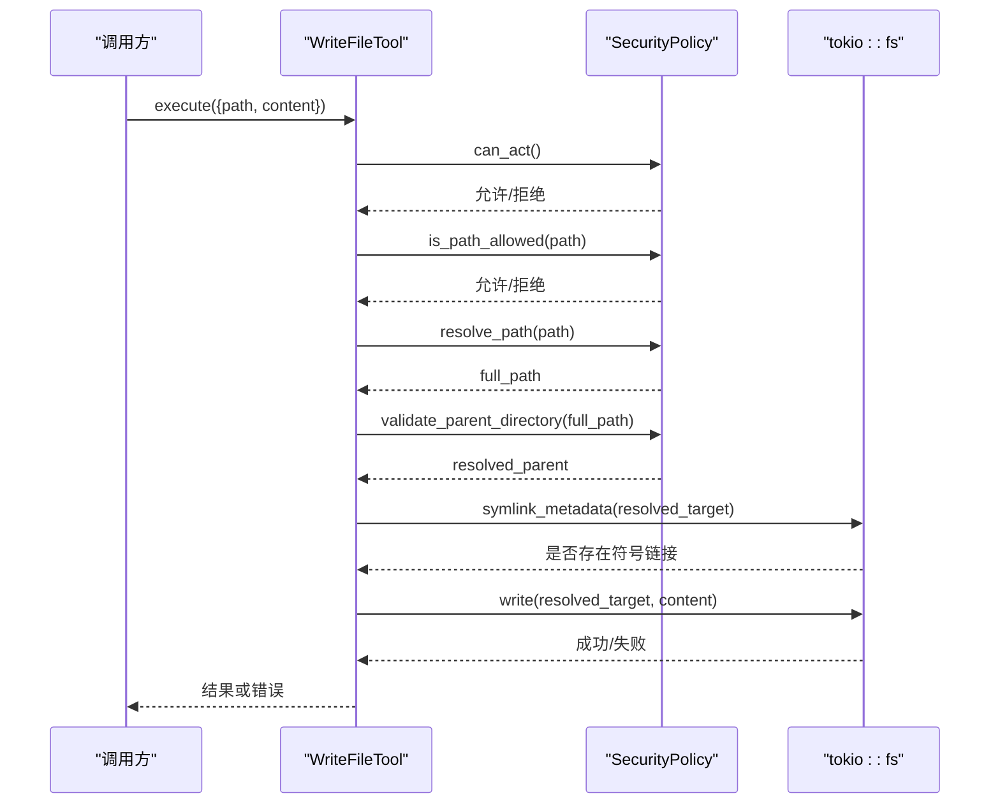
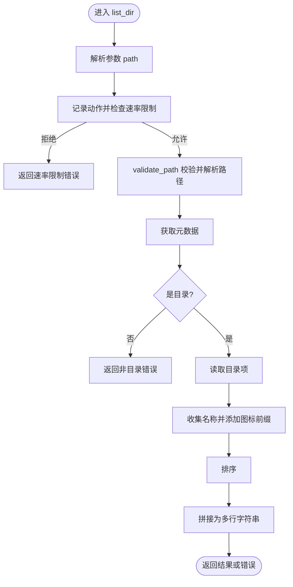
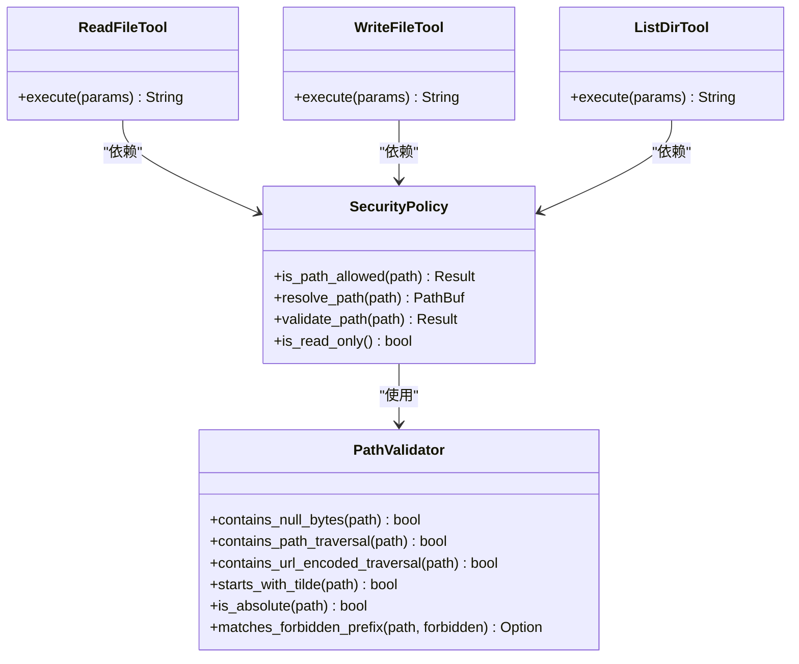

# 文件系统工具

<cite>
**本文引用的文件**
- [agent-diva-tools/src/filesystem.rs](file://agent-diva-tools/src/filesystem.rs)
- [agent-diva-core/src/security/policy.rs](file://agent-diva-core/src/security/policy.rs)
- [agent-diva-core/src/security/path.rs](file://agent-diva-core/src/security/path.rs)
- [agent-diva-files/src/lib.rs](file://agent-diva-files/src/lib.rs)
- [agent-diva-files/src/manager.rs](file://agent-diva-files/src/manager.rs)
</cite>

## 目录
1. [简介](#简介)
2. [项目结构](#项目结构)
3. [核心组件](#核心组件)
4. [架构总览](#架构总览)
5. [详细组件分析](#详细组件分析)
6. [依赖关系分析](#依赖关系分析)
7. [性能考虑](#性能考虑)
8. [故障排查指南](#故障排查指南)
9. [结论](#结论)
10. [附录：API 与使用示例](#附录api-与使用示例)

## 简介
本文件面向 Agent Diva 中的“文件系统工具”，聚焦以下能力：
- 文件读取（read_file）
- 文件写入（write_file）
- 目录浏览（list_dir）
- 路径管理与安全策略（工作区隔离、路径校验、速率限制、只读模式等）
- 编码处理与大文件优化
- 错误处理与故障排查
- 性能优化建议与最佳实践

该工具集通过统一的安全策略对文件操作进行前置校验与约束，确保在受控的工作区内安全地执行读写与遍历。

## 项目结构
围绕文件系统工具的代码主要分布在两个模块：
- agent-diva-tools：提供对外暴露的工具实现（read_file、write_file、edit_file、list_dir），并集成安全策略。
- agent-diva-core：提供统一的安全策略（SecurityPolicy）、路径校验、速率限制等。
- agent-diva-files：提供内容寻址的文件存储系统（可选扩展能力，如钩子、索引、统计等）。

图表来源
- [agent-diva-tools/src/filesystem.rs:1-15](file://agent-diva-tools/src/filesystem.rs#L1-L15)
- [agent-diva-core/src/security/policy.rs:14-23](file://agent-diva-core/src/security/policy.rs#L14-L23)
- [agent-diva-core/src/security/path.rs:1-42](file://agent-diva-core/src/security/path.rs#L1-L42)

章节来源
- [agent-diva-tools/src/filesystem.rs:1-15](file://agent-diva-tools/src/filesystem.rs#L1-L15)
- [agent-diva-files/src/lib.rs:1-16](file://agent-diva-files/src/lib.rs#L1-L16)

## 核心组件
- ReadFileTool：读取文件内容，支持 offset/limit 分页读取大文件，自动进行 JSON 转义与长度截断。
- WriteFileTool：将字符串内容写入目标路径，自动创建父目录，并进行严格的安全检查（路径、符号链接、只读模式等）。
- EditFileTool：精确替换文件中指定文本，具备存在性校验与重复匹配警告。
- ListDirTool：列出目录条目，返回带图标前缀的排序列表。
- SecurityPolicy：统一的安全策略，包含路径校验、工作区边界、速率限制、只读模式、符号链接控制等。
- FileManager（可选扩展）：提供内容寻址存储、引用计数、钩子系统等高级能力。

章节来源
- [agent-diva-tools/src/filesystem.rs:14-145](file://agent-diva-tools/src/filesystem.rs#L14-L145)
- [agent-diva-tools/src/filesystem.rs:147-261](file://agent-diva-tools/src/filesystem.rs#L147-L261)
- [agent-diva-tools/src/filesystem.rs:263-386](file://agent-diva-tools/src/filesystem.rs#L263-L386)
- [agent-diva-tools/src/filesystem.rs:388-488](file://agent-diva-tools/src/filesystem.rs#L388-L488)
- [agent-diva-core/src/security/policy.rs:14-23](file://agent-diva-core/src/security/policy.rs#L14-L23)
- [agent-diva-files/src/lib.rs:30-63](file://agent-diva-files/src/lib.rs#L30-L63)

## 架构总览
文件系统工具以“工具 + 安全策略”为核心架构：
- 工具层：定义参数 schema、执行流程、错误返回格式。
- 安全层：在执行前进行多层路径校验、速率限制、权限控制。
- I/O 层：基于 tokio 异步 I/O 进行文件读写；必要时采用流式读取避免内存峰值。
- 可选扩展：通过 FileManager 接入内容寻址存储、钩子链（加密/解密、权限检查等）。

图表来源
- [agent-diva-tools/src/filesystem.rs:69-144](file://agent-diva-tools/src/filesystem.rs#L69-L144)
- [agent-diva-core/src/security/policy.rs:172-200](file://agent-diva-core/src/security/policy.rs#L172-L200)

## 详细组件分析

### 文件读取（read_file）
- 功能：读取指定路径文件内容，支持 offset（起始行号，从1开始）和 limit（最大行数）进行分页读取。
- 参数：
  - path：必填，相对工作区的路径
  - offset：可选，起始行号
  - limit：可选，最多读取的行数
- 返回值：成功时返回文件内容（已做 JSON 转义与长度截断）；失败时返回错误消息字符串。
- 安全与校验：
  - 记录动作并受速率限制控制
  - 路径合法性校验（空字节、穿越、URL 编码穿越、波浪号展开、绝对路径限制、禁止前缀/扩展名）
  - 解析为工作区内的绝对路径，并校验是否在允许范围内
  - 文件大小上限检查
- 编码处理：
  - 优先按 UTF-8 读取；若失败则回退到二进制并以 lossy 方式转为字符串
- 大文件优化：
  - 当指定 offset/limit 时，采用流式读取，避免一次性加载整个文件
  - 输出附带行范围摘要（例如“[Lines X-Y of N]”）

图表来源
- [agent-diva-tools/src/filesystem.rs:69-144](file://agent-diva-tools/src/filesystem.rs#L69-L144)
- [agent-diva-tools/src/filesystem.rs:490-528](file://agent-diva-tools/src/filesystem.rs#L490-L528)

章节来源
- [agent-diva-tools/src/filesystem.rs:14-145](file://agent-diva-tools/src/filesystem.rs#L14-L145)
- [agent-diva-tools/src/filesystem.rs:490-528](file://agent-diva-tools/src/filesystem.rs#L490-L528)

### 文件写入（write_file）
- 功能：将字符串内容写入目标路径，自动创建父目录。
- 参数：
  - path：必填，相对工作区的路径
  - content：必填，要写入的内容
- 返回值：成功时返回写入字节数与路径；失败时返回错误消息字符串。
- 安全与校验：
  - 写操作需通过 can_act 检查（只读模式会拒绝）
  - 基础路径校验（is_path_allowed）
  - 解析完整路径并验证父目录（TOCTOU 安全）
  - 若配置禁止符号链接，且目标为符号链接则拒绝
- 写入过程：直接写入目标路径，返回结果或错误信息。

图表来源
- [agent-diva-tools/src/filesystem.rs:198-260](file://agent-diva-tools/src/filesystem.rs#L198-L260)
- [agent-diva-core/src/security/policy.rs:139-200](file://agent-diva-core/src/security/policy.rs#L139-L200)

章节来源
- [agent-diva-tools/src/filesystem.rs:147-261](file://agent-diva-tools/src/filesystem.rs#L147-L261)

### 目录浏览（list_dir）
- 功能：列出目录内容，返回带图标前缀的排序条目列表。
- 参数：
  - path：必填，相对工作区的目录路径
- 返回值：成功时返回目录条目（每行一个，带 📁/📄 前缀）；失败时返回错误消息字符串。
- 安全与校验：
  - 记录动作并受速率限制控制
  - 路径校验与解析
  - 确认目标为目录
- 遍历过程：异步读取目录项，收集名称并排序后拼接输出。

图表来源
- [agent-diva-tools/src/filesystem.rs:435-487](file://agent-diva-tools/src/filesystem.rs#L435-L487)

章节来源
- [agent-diva-tools/src/filesystem.rs:388-488](file://agent-diva-tools/src/filesystem.rs#L388-L488)

### 编辑文件（edit_file）
- 功能：精确替换文件中 old_text 为 new_text，要求完全匹配。
- 参数：
  - path：必填
  - old_text：必填，待替换的精确文本
  - new_text：必填，新文本
- 行为：
  - 安全检查与路径解析
  - 校验文件存在性与类型
  - 读取内容并校验 old_text 是否存在
  - 若出现多次匹配，发出警告并要求更具体的上下文
  - 仅替换一次并写回

章节来源
- [agent-diva-tools/src/filesystem.rs:263-386](file://agent-diva-tools/src/filesystem.rs#L263-L386)

### 安全策略（SecurityPolicy）
- 职责：统一协调路径校验、工作区边界、速率限制、只读模式、符号链接控制等。
- 关键方法：
  - is_path_allowed：多层路径安全检查（空字节、穿越、URL 编码穿越、波浪号、绝对路径限制、禁止前缀/扩展名）
  - resolve_path：解析为工作区内的绝对路径
  - validate_path：完整路径校验（含解析、规范化、工作区边界、符号链接检查）
  - is_resolved_path_allowed：判断解析后的路径是否在允许根目录下
  - is_read_only：只读模式开关
  - has_shell_access：是否允许 shell 访问（由安全级别决定）
- 速率限制：通过 ActionTracker 限制每小时可执行的动作数量。

章节来源
- [agent-diva-core/src/security/policy.rs:14-23](file://agent-diva-core/src/security/policy.rs#L14-L23)
- [agent-diva-core/src/security/policy.rs:74-200](file://agent-diva-core/src/security/policy.rs#L74-L200)
- [agent-diva-core/src/security/path.rs:1-42](file://agent-diva-core/src/security/path.rs#L1-L42)

### 文件管理系统（FileManager，可选扩展）
- 提供内容寻址存储（SHA256）、去重、引用计数、SQLite 索引、生命周期钩子（读取前后钩子用于权限检查、加解密等）。
- 典型流程：
  - 读取：before_read 钩子 → 读取数据 → after_read 钩子（可转换数据）
  - 错误类型：IO、序列化、未找到、无效句柄、存储错误、过大、哈希不匹配、数据库错误等

章节来源
- [agent-diva-files/src/lib.rs:30-63](file://agent-diva-files/src/lib.rs#L30-L63)
- [agent-diva-files/src/lib.rs:67-113](file://agent-diva-files/src/lib.rs#L67-L113)
- [agent-diva-files/src/manager.rs:463-492](file://agent-diva-files/src/manager.rs#L463-L492)

## 依赖关系分析
- 工具层依赖安全策略进行前置校验与约束。
- 安全策略依赖路径校验器与速率限制器。
- 工具层依赖 tokio 异步 I/O 进行文件操作。
- 可选的文件管理系统通过钩子机制扩展读取/写入流程。

图表来源
- [agent-diva-tools/src/filesystem.rs:14-145](file://agent-diva-tools/src/filesystem.rs#L14-L145)
- [agent-diva-core/src/security/policy.rs:14-23](file://agent-diva-core/src/security/policy.rs#L14-L23)
- [agent-diva-core/src/security/path.rs:1-42](file://agent-diva-core/src/security/path.rs#L1-L42)

章节来源
- [agent-diva-tools/src/filesystem.rs:14-145](file://agent-diva-tools/src/filesystem.rs#L14-L145)
- [agent-diva-core/src/security/policy.rs:14-23](file://agent-diva-core/src/security/policy.rs#L14-L23)
- [agent-diva-core/src/security/path.rs:1-42](file://agent-diva-core/src/security/path.rs#L1-L42)

## 性能考虑
- 大文件读取：
  - 使用 offset/limit 触发流式读取，避免一次性加载整个文件到内存
  - 输出附带行范围摘要，便于定位与展示
- 编码回退：
  - 非 UTF-8 文件自动回退为二进制并以 lossy 方式转换为字符串，提高兼容性
- 写入优化：
  - 写入前进行父目录校验与符号链接检查，减少无效 I/O
- 速率限制：
  - 通过 ActionTracker 限制单位时间内的动作次数，防止滥用与资源耗尽
- 可选扩展：
  - 使用 FileManager 的内容寻址存储可减少重复写入与提升去重效率

章节来源
- [agent-diva-tools/src/filesystem.rs:110-144](file://agent-diva-tools/src/filesystem.rs#L110-L144)
- [agent-diva-tools/src/filesystem.rs:490-528](file://agent-diva-tools/src/filesystem.rs#L490-L528)
- [agent-diva-core/src/security/policy.rs:172-200](file://agent-diva-core/src/security/policy.rs#L172-L200)

## 故障排查指南
- 常见错误与原因：
  - 路径不存在：读取/写入/列举时路径错误或权限不足
  - 非文件/非目录：传入路径类型不符合预期
  - 大小超限：读取的文件超过安全策略配置的上限
  - 速率限制：单位时间内动作过多被拒绝
  - 符号链接不允许：目标为符号链接且配置禁止
  - 只读模式：写操作在只读模式下被拒绝
  - 编码问题：非 UTF-8 文件回退为 lossy 字符串，可能导致显示异常
- 排查步骤：
  - 检查路径是否在工作区内且合法（无穿越、无禁止前缀/扩展名）
  - 查看安全策略配置（是否只读、是否允许符号链接、速率限制阈值）
  - 对于大文件，尝试使用 offset/limit 分页读取
  - 检查文件编码与内容长度，必要时调整截断策略
  - 若使用 FileManager，检查钩子是否阻止了读取/写入

章节来源
- [agent-diva-tools/src/filesystem.rs:69-144](file://agent-diva-tools/src/filesystem.rs#L69-L144)
- [agent-diva-tools/src/filesystem.rs:198-260](file://agent-diva-tools/src/filesystem.rs#L198-L260)
- [agent-diva-tools/src/filesystem.rs:435-487](file://agent-diva-tools/src/filesystem.rs#L435-L487)
- [agent-diva-core/src/security/policy.rs:74-200](file://agent-diva-core/src/security/policy.rs#L74-L200)

## 结论
Agent Diva 的文件系统工具以“工具 + 安全策略”为核心，提供了安全的文件读取、写入、编辑与目录浏览能力。通过多层路径校验、速率限制、只读模式与符号链接控制，确保在受控工作区内执行文件操作。针对大文件与编码问题，实现了流式读取与回退策略。可选的文件管理系统进一步增强了去重、引用计数与钩子扩展能力。建议在开发中遵循参数校验、错误处理与性能优化的最佳实践，以获得稳定可靠的文件操作体验。

## 附录：API 与使用示例

### read_file
- 参数：
  - path：必填，相对工作区的路径
  - offset：可选，起始行号（从1开始）
  - limit：可选，最多读取的行数
- 返回值：
  - 成功：文件内容（已转义与截断）
  - 失败：错误消息字符串
- 示例场景：
  - 读取小文件：直接传入 path
  - 读取大文件：使用 offset/limit 分页读取，避免内存峰值
  - 编码兼容：非 UTF-8 文件自动回退为 lossy 字符串

章节来源
- [agent-diva-tools/src/filesystem.rs:48-67](file://agent-diva-tools/src/filesystem.rs#L48-L67)
- [agent-diva-tools/src/filesystem.rs:69-144](file://agent-diva-tools/src/filesystem.rs#L69-L144)

### write_file
- 参数：
  - path：必填，相对工作区的路径
  - content：必填，要写入的内容
- 返回值：
  - 成功：写入字节数与路径
  - 失败：错误消息字符串
- 示例场景：
  - 创建新文件：传入新路径与内容
  - 覆盖已有文件：传入相同路径与新内容
  - 安全写入：确保路径在工作区内且不被符号链接绕过

章节来源
- [agent-diva-tools/src/filesystem.rs:181-196](file://agent-diva-tools/src/filesystem.rs#L181-L196)
- [agent-diva-tools/src/filesystem.rs:198-260](file://agent-diva-tools/src/filesystem.rs#L198-L260)

### list_dir
- 参数：
  - path：必填，相对工作区的目录路径
- 返回值：
  - 成功：目录条目列表（每行一个，带图标前缀）
  - 失败：错误消息字符串
- 示例场景：
  - 列出当前目录：传入 "."
  - 列出子目录：传入子目录路径
  - 空目录：返回空目录提示

章节来源
- [agent-diva-tools/src/filesystem.rs:422-433](file://agent-diva-tools/src/filesystem.rs#L422-L433)
- [agent-diva-tools/src/filesystem.rs:435-487](file://agent-diva-tools/src/filesystem.rs#L435-L487)

### 安全策略配置要点
- 工作区隔离：确保所有路径解析到工作区内
- 速率限制：合理设置 max_actions_per_hour，避免滥用
- 只读模式：在审计或演示场景启用只读，防止写操作
- 符号链接：根据安全需求决定是否允许符号链接

章节来源
- [agent-diva-core/src/security/policy.rs:139-200](file://agent-diva-core/src/security/policy.rs#L139-L200)