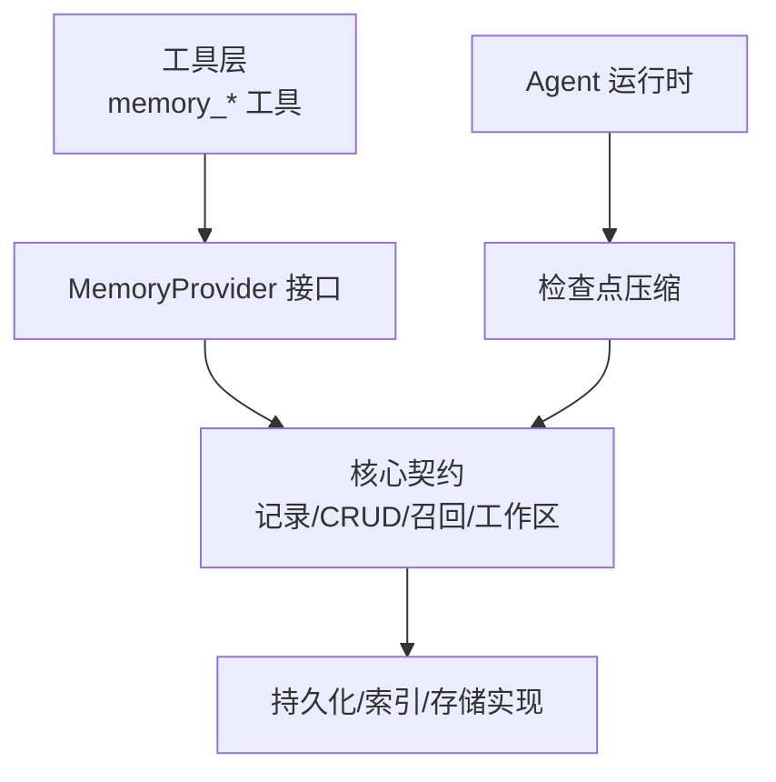
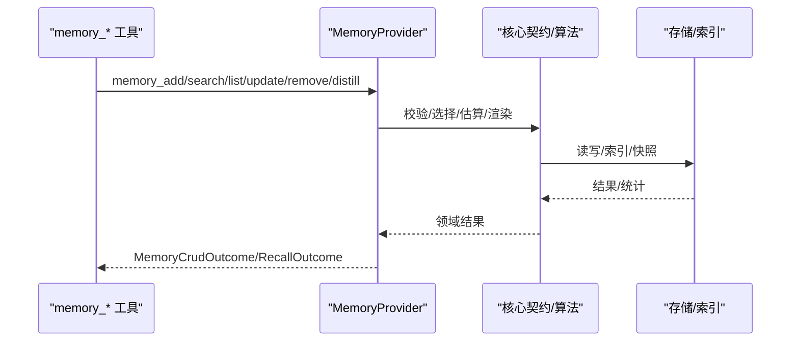
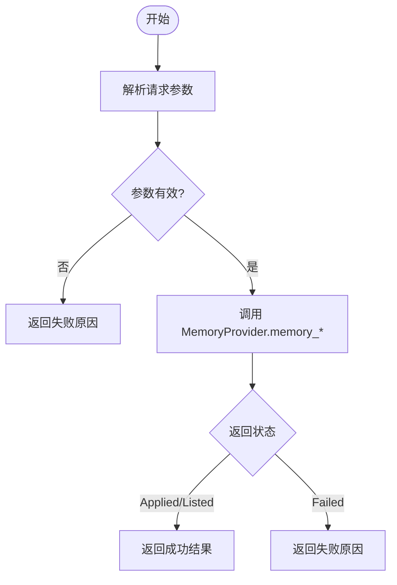
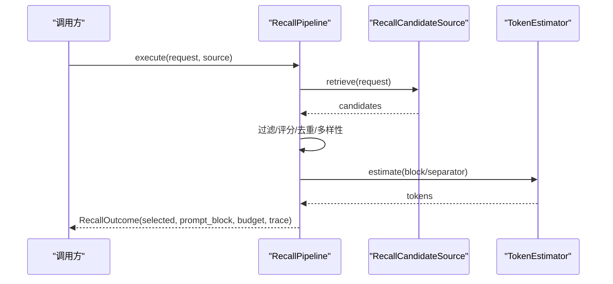
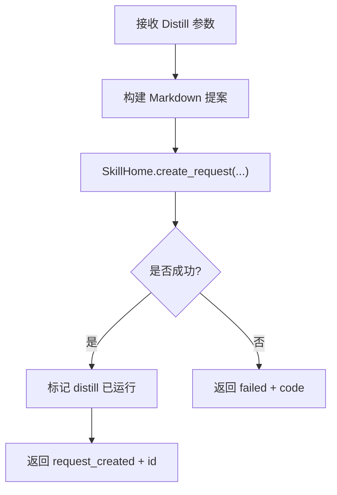
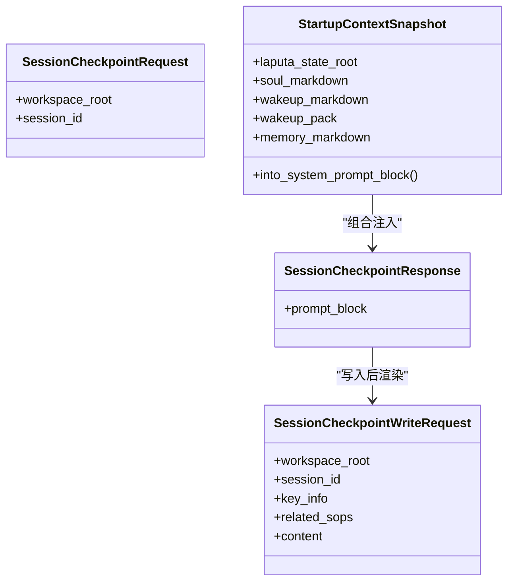
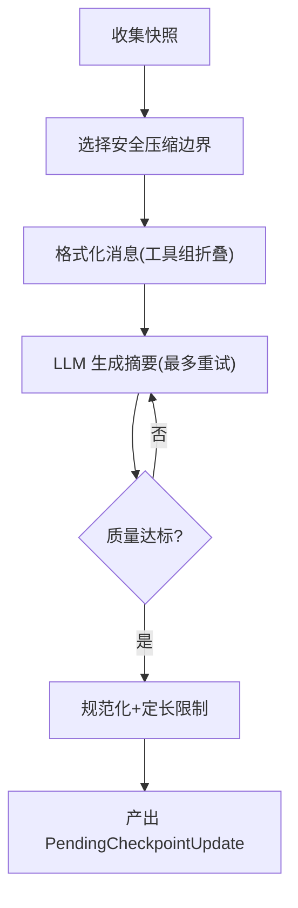
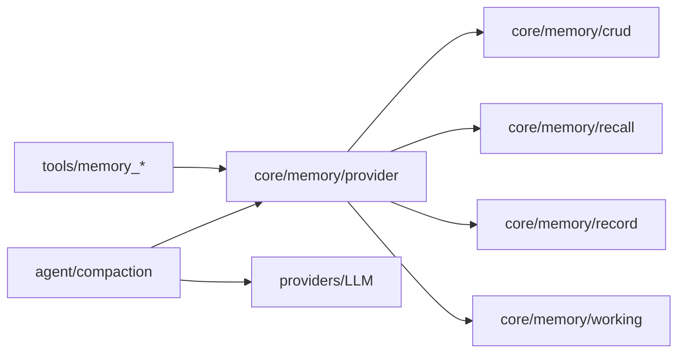

# 记忆系统工具

<cite>
**本文引用的文件**
- [agent-diva-core/src/memory/mod.rs](file://agent-diva-core/src/memory/mod.rs)
- [agent-diva-core/src/memory/crud.rs](file://agent-diva-core/src/memory/crud.rs)
- [agent-diva-core/src/memory/provider.rs](file://agent-diva-core/src/memory/provider.rs)
- [agent-diva-core/src/memory/recall.rs](file://agent-diva-core/src/memory/recall.rs)
- [agent-diva-core/src/memory/record.rs](file://agent-diva-core/src/memory/record.rs)
- [agent-diva-core/src/memory/working.rs](file://agent-diva-core/src/memory/working.rs)
- [agent-diva-tools/src/memory_add.rs](file://agent-diva-tools/src/memory_add.rs)
- [agent-diva-tools/src/memory_search.rs](file://agent-diva-tools/src/memory_search.rs)
- [agent-diva-tools/src/memory_list.rs](file://agent-diva-tools/src/memory_list.rs)
- [agent-diva-tools/src/memory_update.rs](file://agent-diva-tools/src/memory_update.rs)
- [agent-diva-tools/src/memory_remove.rs](file://agent-diva-tools/src/memory_remove.rs)
- [agent-diva-tools/src/memory_distill.rs](file://agent-diva-tools/src/memory_distill.rs)
- [agent-diva-agent/src/compaction/mod.rs](file://agent-diva-agent/src/compaction/mod.rs)
- [agent-diva-agent/src/compaction/compaction_exec.rs](file://agent-diva-agent/src/compaction/compaction_exec.rs)
</cite>

## 目录
1. [简介](#简介)
2. [项目结构](#项目结构)
3. [核心组件](#核心组件)
4. [架构总览](#架构总览)
5. [详细组件分析](#详细组件分析)
6. [依赖关系分析](#依赖关系分析)
7. [性能考量](#性能考量)
8. [故障排查指南](#故障排查指南)
9. [结论](#结论)
10. [附录：API与数据模型速查](#附录api与数据模型速查)

## 简介
本文件面向“记忆系统工具”的使用者与实现者，系统性说明记忆的增删改查、搜索检索、蒸馏压缩等核心能力；给出参数配置、数据格式与返回结果约定；提供存储、语义搜索、批量操作与性能优化实践；解释生命周期管理、版本控制与一致性保证；并给出质量评估、存储优化与故障恢复建议。

## 项目结构
记忆系统由三层构成：
- 工具层（agent-diva-tools）：对外暴露 memory_add / memory_search / memory_list / memory_update / memory_remove / memory_distill 等工具，负责参数校验、调用 MemoryProvider。
- 核心契约层（agent-diva-core/memory）：定义记录模型、CRUD 请求/响应、提供者接口、召回管线、工作区检查点等稳定契约。
- 会话上下文与压缩（agent-diva-agent/compaction）：在长会话中通过检查点压缩维持上下文窗口，配合记忆系统做长期知识沉淀。

图表来源
- [agent-diva-tools/src/memory_add.rs:1-114](file://agent-diva-tools/src/memory_add.rs#L1-L114)
- [agent-diva-core/src/memory/provider.rs:414-617](file://agent-diva-core/src/memory/provider.rs#L414-L617)
- [agent-diva-core/src/memory/mod.rs:1-47](file://agent-diva-core/src/memory/mod.rs#L1-L47)
- [agent-diva-agent/src/compaction/mod.rs:1-33](file://agent-diva-agent/src/compaction/mod.rs#L1-L33)

章节来源
- [agent-diva-core/src/memory/mod.rs:1-47](file://agent-diva-core/src/memory/mod.rs#L1-L47)
- [agent-diva-core/src/memory/provider.rs:414-617](file://agent-diva-core/src/memory/provider.rs#L414-L617)
- [agent-diva-tools/src/memory_add.rs:1-114](file://agent-diva-tools/src/memory_add.rs#L1-L114)

## 核心组件
- 记录模型与完整性：MemoryRecord、MemoryScope、MemoryProvenance、信任/敏感度/类型、时间有效性、摘要哈希、墓碑标记等，提供严格校验与渲染。
- CRUD 契约：MemoryAdd/Get/List/Search/Update/Remove/Distill 请求与统一返回 MemoryCrudOutcome。
- 提供者接口：MemoryProvider 抽象启动注入、意图预取、回合同步、会话结束钩子及所有 memory_* 方法。
- 召回管线：RecallPipeline 基于策略、预算、去重、多样性与评分选择候选，输出 prompt block 与审计追踪。
- 工作区检查点：SessionCheckpoint 用于会话内短期状态，支持渲染与写入。
- 检查点压缩：CheckpointCompactor 将历史消息折叠为结构化检查点，保障上下文窗口与可回溯性。

章节来源
- [agent-diva-core/src/memory/record.rs:103-120](file://agent-diva-core/src/memory/record.rs#L103-L120)
- [agent-diva-core/src/memory/crud.rs:11-81](file://agent-diva-core/src/memory/crud.rs#L11-L81)
- [agent-diva-core/src/memory/provider.rs:414-617](file://agent-diva-core/src/memory/provider.rs#L414-L617)
- [agent-diva-core/src/memory/recall.rs:214-359](file://agent-diva-core/src/memory/recall.rs#L214-L359)
- [agent-diva-core/src/memory/working.rs:20-52](file://agent-diva-core/src/memory/working.rs#L20-L52)
- [agent-diva-agent/src/compaction/compaction_exec.rs:94-247](file://agent-diva-agent/src/compaction/compaction_exec.rs#L94-L247)

## 架构总览
记忆系统以“提供者边界”为核心，工具仅负责参数解析与转发；核心层提供稳定的领域模型与算法；Agent 侧通过检查点压缩保持对话上下文可控。

图表来源
- [agent-diva-tools/src/memory_add.rs:64-88](file://agent-diva-tools/src/memory_add.rs#L64-L88)
- [agent-diva-core/src/memory/provider.rs:471-584](file://agent-diva-core/src/memory/provider.rs#L471-L584)
- [agent-diva-core/src/memory/recall.rs:214-359](file://agent-diva-core/src/memory/recall.rs#L214-L359)

## 详细组件分析

### 记忆增删改查（CRUD）
- 新增（memory_add）
  - 输入：content、可选 evidence_refs
  - 行为：低风险即时写入，证据引用为辅助信息
  - 返回：Applied/Listed/Failed 之一，可能附带证据提示
- 查询（memory_get）
  - 输入：record_id
  - 返回：单条可见记录的完整内容、信任等级、修订号、时间戳等
- 列表（memory_list）
  - 输入：limit
  - 返回：可见条目集合，便于更新/删除前获取 base_revision
- 搜索（memory_search）
  - 输入：query、limit
  - 返回：匹配条目集合（应用态权威视图）
- 更新（memory_update）
  - 输入：record_id、content、base_revision、可选 evidence_refs
  - 行为：比较交换式更新，旧版被拒绝
- 删除（memory_remove）
  - 输入：record_id、reason、base_revision
  - 行为：软删除（墓碑），立即隐藏，旧版被拒绝

图表来源
- [agent-diva-core/src/memory/crud.rs:11-81](file://agent-diva-core/src/memory/crud.rs#L11-L81)
- [agent-diva-core/src/memory/crud.rs:105-143](file://agent-diva-core/src/memory/crud.rs#L105-L143)
- [agent-diva-tools/src/memory_add.rs:64-88](file://agent-diva-tools/src/memory_add.rs#L64-L88)
- [agent-diva-tools/src/memory_update.rs:55-79](file://agent-diva-tools/src/memory_update.rs#L55-L79)
- [agent-diva-tools/src/memory_remove.rs:55-79](file://agent-diva-tools/src/memory_remove.rs#L55-L79)

章节来源
- [agent-diva-core/src/memory/crud.rs:11-143](file://agent-diva-core/src/memory/crud.rs#L11-L143)
- [agent-diva-tools/src/memory_add.rs:41-88](file://agent-diva-tools/src/memory_add.rs#L41-L88)
- [agent-diva-tools/src/memory_search.rs:41-79](file://agent-diva-tools/src/memory_search.rs#L41-L79)
- [agent-diva-tools/src/memory_list.rs:41-79](file://agent-diva-tools/src/memory_list.rs#L41-L79)
- [agent-diva-tools/src/memory_update.rs:41-79](file://agent-diva-tools/src/memory_update.rs#L41-L79)
- [agent-diva-tools/src/memory_remove.rs:41-79](file://agent-diva-tools/src/memory_remove.rs#L41-L79)

### 搜索与语义召回（Recall v2）
- 目标：在 token 预算内，从候选集中选择最相关的记忆片段注入提示。
- 关键要素：
  - RecallRequest：query、scope、correlation、now、token_budget、max_candidates、policy
  - 策略：allowed_trust、allowed_sensitivity
  - 选择流程：初步过滤（范围/过期/墓碑/信任/敏感度）→ 评分排序 → 去重 → 多样性 → 预算裁剪
  - 输出：selected_records、prompt_block、budget、trace（含每个候选的决策与原因）
- 估算器：保守 Unicode 估算，避免过度占用预算
- 影子对比：compare_recall_shadow 可用于新旧方案对比而不暴露内容

图表来源
- [agent-diva-core/src/memory/recall.rs:58-68](file://agent-diva-core/src/memory/recall.rs#L58-L68)
- [agent-diva-core/src/memory/recall.rs:214-359](file://agent-diva-core/src/memory/recall.rs#L214-L359)
- [agent-diva-core/src/memory/recall.rs:394-398](file://agent-diva-core/src/memory/recall.rs#L394-L398)
- [agent-diva-core/src/memory/recall.rs:362-392](file://agent-diva-core/src/memory/recall.rs#L362-L392)

章节来源
- [agent-diva-core/src/memory/recall.rs:18-188](file://agent-diva-core/src/memory/recall.rs#L18-L188)
- [agent-diva-core/src/memory/recall.rs:214-359](file://agent-diva-core/src/memory/recall.rs#L214-L359)
- [agent-diva-core/src/memory/recall.rs:394-398](file://agent-diva-core/src/memory/recall.rs#L394-L398)

### 蒸馏与经验沉淀（memory_distill）
- 目标：将经过动作验证的经验提炼为可复用的 Skill 提案，供人工审核启用。
- 输入：slug/title/description/content/reason，可选 actmem_pointer/artifact
- 行为：创建待审提案，不直接写入或启用 Skill；绑定 session_key 作为证据
- 返回：request_created/failed（带错误码）

图表来源
- [agent-diva-tools/src/memory_distill.rs:91-131](file://agent-diva-tools/src/memory_distill.rs#L91-L131)
- [agent-diva-tools/src/memory_distill.rs:135-145](file://agent-diva-tools/src/memory_distill.rs#L135-L145)

章节来源
- [agent-diva-tools/src/memory_distill.rs:52-131](file://agent-diva-tools/src/memory_distill.rs#L52-L131)

### 会话检查点与工作区记忆
- L0 策略：行动验证写入、不在长期记忆中存放易失状态、最小指针原则（启动只注入索引，详情按需检索）。
- SessionCheckpoint：会话级短期状态，支持渲染与写入，会话结束时清理。
- 启动注入：StartupContextSnapshot 可组合 memory/soul/wakeup 等投影，生成紧凑 Markdown 注入系统提示。

图表来源
- [agent-diva-core/src/memory/working.rs:20-52](file://agent-diva-core/src/memory/working.rs#L20-L52)
- [agent-diva-core/src/memory/working.rs:54-76](file://agent-diva-core/src/memory/working.rs#L54-L76)
- [agent-diva-core/src/memory/provider.rs:127-180](file://agent-diva-core/src/memory/provider.rs#L127-L180)

章节来源
- [agent-diva-core/src/memory/working.rs:10-76](file://agent-diva-core/src/memory/working.rs#L10-L76)
- [agent-diva-core/src/memory/provider.rs:127-180](file://agent-diva-core/src/memory/provider.rs#L127-L180)

### 检查点压缩（上下文窗口管理）
- 目标：将历史消息折叠为结构化检查点，确保长会话不超出上下文窗口。
- 过程：选择安全边界 → 格式化消息 → 调用 LLM 生成摘要 → 质量门控 → 规范化 → 产出 PendingCheckpointUpdate
- 特性：保留工具组摘要、artifact 引用；多轮重试；质量阈值；固定结构与长度上限

图表来源
- [agent-diva-agent/src/compaction/compaction_exec.rs:94-247](file://agent-diva-agent/src/compaction/compaction_exec.rs#L94-L247)
- [agent-diva-agent/src/compaction/compaction_exec.rs:249-328](file://agent-diva-agent/src/compaction/compaction_exec.rs#L249-L328)
- [agent-diva-agent/src/compaction/compaction_exec.rs:399-430](file://agent-diva-agent/src/compaction/compaction_exec.rs#L399-L430)

章节来源
- [agent-diva-agent/src/compaction/compaction_exec.rs:94-247](file://agent-diva-agent/src/compaction/compaction_exec.rs#L94-L247)
- [agent-diva-agent/src/compaction/compaction_exec.rs:249-328](file://agent-diva-agent/src/compaction/compaction_exec.rs#L249-L328)
- [agent-diva-agent/src/compaction/compaction_exec.rs:399-430](file://agent-diva-agent/src/compaction/compaction_exec.rs#L399-L430)

## 依赖关系分析
- 工具对核心的依赖：各 memory_* 工具依赖 agent-diva-core 的 MemoryProvider 与 CRUD 请求/响应类型。
- 核心内部依赖：
  - recall 依赖 record 的序列化、转义与摘要计算
  - provider 聚合 CRUD、ACTMEM、工作区检查点、启动注入等契约
  - compaction 依赖 session 与 providers 的聊天能力
- 外部依赖：文件存储哈希、LLM 提供者、时间库等

图表来源
- [agent-diva-tools/src/memory_add.rs:1-114](file://agent-diva-tools/src/memory_add.rs#L1-L114)
- [agent-diva-core/src/memory/provider.rs:414-617](file://agent-diva-core/src/memory/provider.rs#L414-L617)
- [agent-diva-core/src/memory/recall.rs:1-188](file://agent-diva-core/src/memory/recall.rs#L1-L188)
- [agent-diva-core/src/memory/record.rs:1-120](file://agent-diva-core/src/memory/record.rs#L1-L120)
- [agent-diva-agent/src/compaction/compaction_exec.rs:1-30](file://agent-diva-agent/src/compaction/compaction_exec.rs#L1-L30)

章节来源
- [agent-diva-core/src/memory/mod.rs:1-47](file://agent-diva-core/src/memory/mod.rs#L1-L47)
- [agent-diva-core/src/memory/provider.rs:414-617](file://agent-diva-core/src/memory/provider.rs#L414-L617)

## 性能考量
- 预算控制
  - 使用 RecallPipeline 的 token_budget 与 max_candidates 限制候选数量与注入大小
  - 使用 ConservativeRecallTokenEstimator 进行保守估算，避免超支
- 索引与最小指针
  - 启动时仅注入 L1 索引块（默认行数限制），详情通过 memory_search/list 按需获取
- 去重与多样性
  - 按内容摘要去重，按记录类型多样化，减少冗余与重复
- 压缩与检查点
  - 使用 CheckpointCompactor 将历史消息折叠为固定结构的检查点，限制长度并保留关键标识符与 artifact 引用
- 批处理建议
  - 列表/搜索时设置合理 limit，避免一次性拉取过多条目
  - 更新/删除前先 list 获取最新 revision，再进行 CAS 操作，降低冲突

[本节为通用指导，无需具体文件引用]

## 故障排查指南
- 常见失败分类
  - 提供者不可用：工具在未配置 provider/workspace 时返回 failed
  - 参数无效：JSON 解析失败或缺少必填字段
  - 召回失败：RetrievalUnavailable/InvalidRequest，降级为空结果
  - 记录校验失败：内容摘要不匹配、时间越界、未知枚举值、自覆盖、墓碑不一致等
- 定位步骤
  - 检查工具参数与 provider 初始化
  - 查看 RecallOutcome.trace 中的 decision/reason 与 estimated_tokens
  - 核对 MemoryRecord.validate_at 的错误码，修正时间/摘要/信任/敏感度
  - 对于更新/删除，确认 base_revision 与当前一致
- 恢复策略
  - 召回失败不影响主流程，继续执行
  - 二次尝试：调整 token_budget、扩大 scope 或放宽 policy
  - 检查点压缩失败会中止本轮压缩，需重试或回退到上一检查点

章节来源
- [agent-diva-tools/src/memory_add.rs:64-88](file://agent-diva-tools/src/memory_add.rs#L64-L88)
- [agent-diva-core/src/memory/recall.rs:171-188](file://agent-diva-core/src/memory/recall.rs#L171-L188)
- [agent-diva-core/src/memory/record.rs:153-191](file://agent-diva-core/src/memory/record.rs#L153-L191)
- [agent-diva-core/src/memory/record.rs:193-288](file://agent-diva-core/src/memory/record.rs#L193-L288)

## 结论
该记忆系统通过清晰的提供者边界、严格的记录模型与召回管线、以及会话检查点压缩，实现了高可靠、可审计、可扩展的记忆能力。工具层简化了调用，核心层保证了数据一致性与性能，Agent 侧保障了长会话的可维护性。遵循最小指针、预算控制与质量门控，可在生产环境中获得稳定且高效的记忆体验。

[本节为总结，无需具体文件引用]

## 附录：API与数据模型速查

### 工具与参数
- memory_add
  - 参数：content、evidence_refs（可选）
  - 返回：MemoryCrudOutcome（applied/listed/failed）
- memory_search
  - 参数：query、limit（可选）
  - 返回：MemoryCrudOutcome（list）
- memory_list
  - 参数：limit（可选）
  - 返回：MemoryCrudOutcome（list）
- memory_update
  - 参数：record_id、content、base_revision、evidence_refs（可选）
  - 返回：MemoryCrudOutcome（applied/failed）
- memory_remove
  - 参数：record_id、reason、base_revision
  - 返回：MemoryCrudOutcome（applied/failed）
- memory_distill
  - 参数：slug、title、description、content、reason、actmem_pointer（可选）、artifact（可选）
  - 返回：request_created/failed（带错误码）

章节来源
- [agent-diva-tools/src/memory_add.rs:51-62](file://agent-diva-tools/src/memory_add.rs#L51-L62)
- [agent-diva-tools/src/memory_search.rs:51-53](file://agent-diva-tools/src/memory_search.rs#L51-L53)
- [agent-diva-tools/src/memory_list.rs:51-53](file://agent-diva-tools/src/memory_list.rs#L51-L53)
- [agent-diva-tools/src/memory_update.rs:51-53](file://agent-diva-tools/src/memory_update.rs#L51-L53)
- [agent-diva-tools/src/memory_remove.rs:51-53](file://agent-diva-tools/src/memory_remove.rs#L51-L53)
- [agent-diva-tools/src/memory_distill.rs:75-88](file://agent-diva-tools/src/memory_distill.rs#L75-L88)

### 核心数据结构要点
- MemoryEntry：id、content、trust、provenance、evidence_refs、revision、created_at、updated_at
- MemoryRecord：id、kind、content、provenance、evidence_refs、confidence_bps、sensitivity、trust、scope、时间戳、supersedes、tombstone
- RecallRequest：query、scope、correlation、now、token_budget、max_candidates、policy
- RecallOutcome：status、failure、selected_records、prompt_block、budget、trace
- SessionCheckpointWriteRequest：workspace_root、session_id、key_info、related_sops、content

章节来源
- [agent-diva-core/src/memory/crud.rs:83-103](file://agent-diva-core/src/memory/crud.rs#L83-L103)
- [agent-diva-core/src/memory/record.rs:103-120](file://agent-diva-core/src/memory/record.rs#L103-L120)
- [agent-diva-core/src/memory/recall.rs:58-68](file://agent-diva-core/src/memory/recall.rs#L58-L68)
- [agent-diva-core/src/memory/recall.rs:147-156](file://agent-diva-core/src/memory/recall.rs#L147-L156)
- [agent-diva-core/src/memory/working.rs:36-52](file://agent-diva-core/src/memory/working.rs#L36-L52)