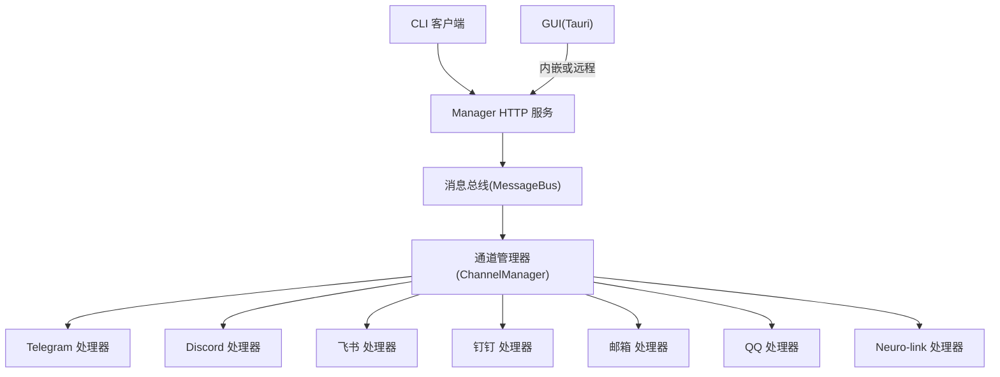
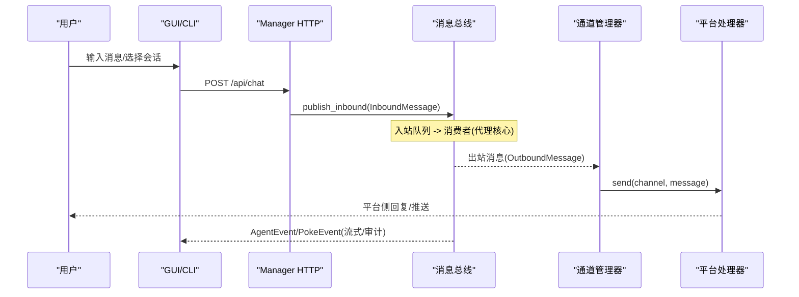
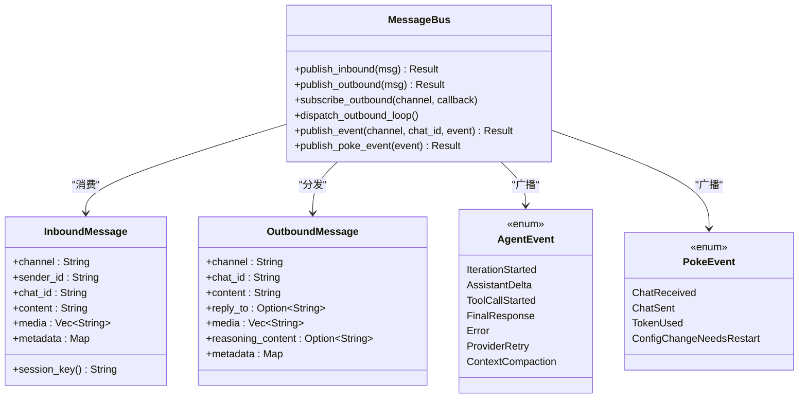
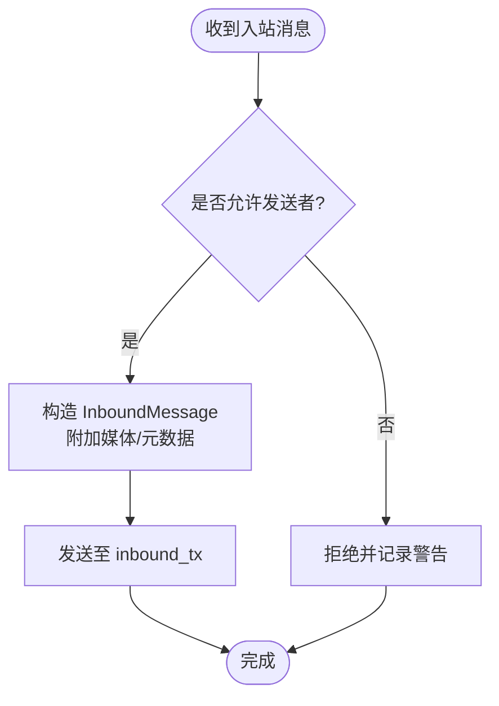
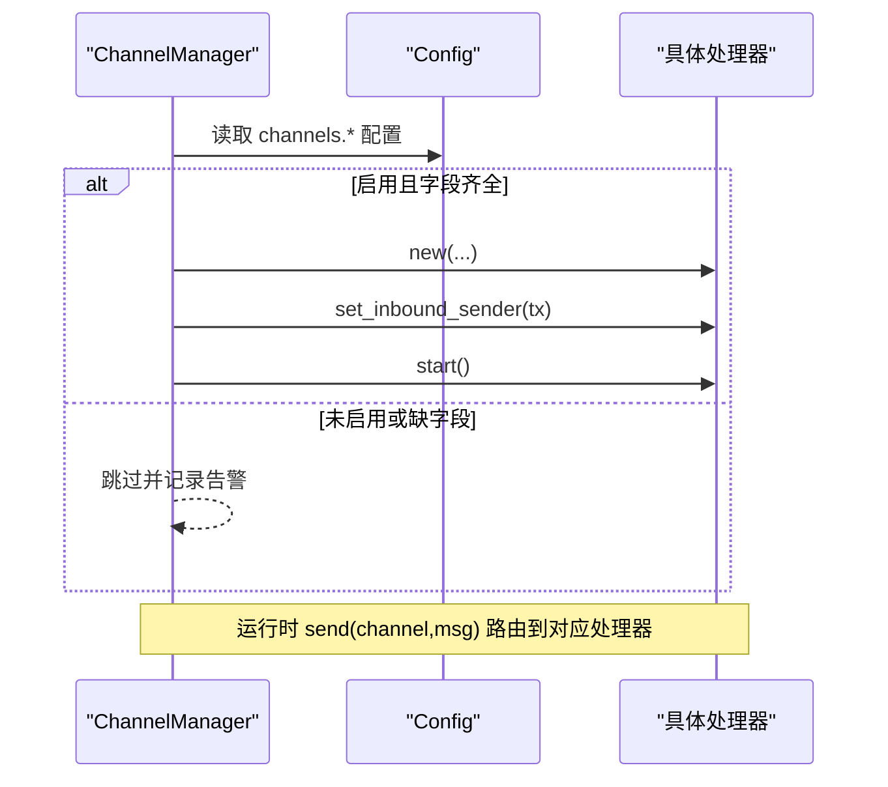
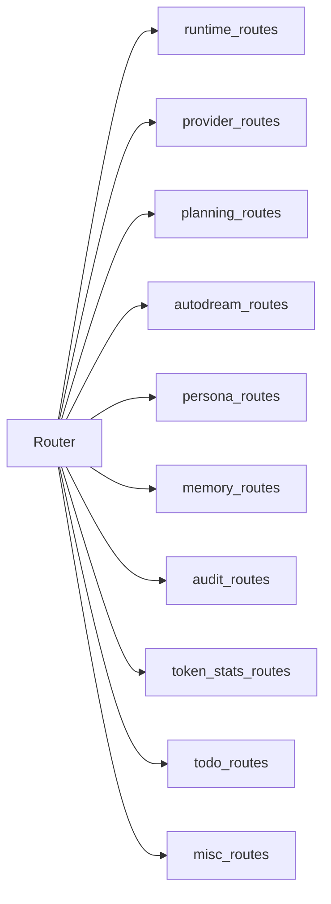
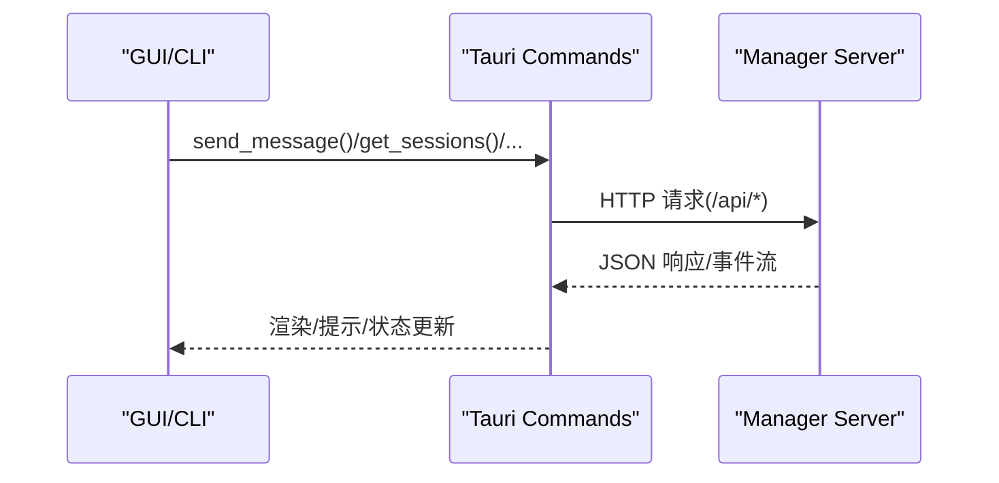
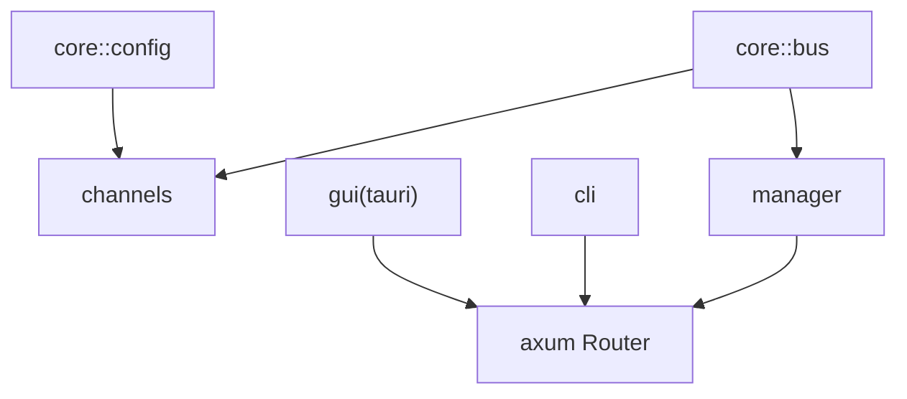

# 通信工具

<cite>
**本文引用的文件**
- [agent-diva-channels/src/lib.rs](file://agent-diva-channels/src/lib.rs)
- [agent-diva-channels/src/base.rs](file://agent-diva-channels/src/base.rs)
- [agent-diva-channels/src/manager.rs](file://agent-diva-channels/src/manager.rs)
- [agent-diva-core/src/bus/mod.rs](file://agent-diva-core/src/bus/mod.rs)
- [agent-diva-core/src/bus/queue.rs](file://agent-diva-core/src/bus/queue.rs)
- [agent-diva-core/src/bus/events.rs](file://agent-diva-core/src/bus/events.rs)
- [agent-diva-manager/src/server.rs](file://agent-diva-manager/src/server.rs)
- [agent-diva-cli/src/main.rs](file://agent-diva-cli/src/main.rs)
- [agent-diva-gui/src-tauri/src/lib.rs](file://agent-diva-gui/src-tauri/src/lib.rs)
- [agent-diva-gui/src-tauri/src/commands.rs](file://agent-diva-gui/src-tauri/src/commands.rs)
</cite>

## 目录
1. [简介](#简介)
2. [项目结构](#项目结构)
3. [核心组件](#核心组件)
4. [架构总览](#架构总览)
5. [详细组件分析](#详细组件分析)
6. [依赖关系分析](#依赖关系分析)
7. [性能考虑](#性能考虑)
8. [故障排查指南](#故障排查指南)
9. [结论](#结论)
10. [附录](#附录)

## 简介
本文件面向“通信工具”能力，围绕消息发送、用户交互与进程管理三大主题，系统化说明：
- 消息格式定义：入站/出站消息、事件类型、会话键与元数据。
- 路由机制：通道管理器按名称分发到具体平台处理器；HTTP 网关将请求路由至业务处理器。
- 协议适配：统一 ChannelHandler 抽象屏蔽各平台差异（Telegram/Discord/飞书/钉钉/邮箱/QQ/Neuro-link 等）。
- 实时通信与异步处理：基于 tokio 的 mpsc/broadcast 通道与后台派发循环，支持流式事件与审计 poke 事件。
- 会话管理与状态同步：以 channel:chat_id 为维度的会话键，结合计划/审批/上下文压缩等事件进行状态同步。
- 错误恢复与健壮性：通道级错误分类、启动失败隔离、配置热更新与优雅关闭。
- 性能优化与安全传输：无界通道背压控制、订阅者并发执行、本地回环监听、安全校验与访问控制。
- 调试技巧：结构化日志、健康检查、心跳、审计事件与 SSE/WS 事件流。

## 项目结构
通信子系统由以下模块协作完成：
- agent-diva-core::bus：消息总线与事件模型（InboundMessage/OutboundMessage/AgentEvent/PokeEvent），提供双队列与广播通道。
- agent-diva-channels：通道抽象与多平台实现，ChannelManager 负责生命周期与路由。
- agent-diva-manager：HTTP API 服务，暴露聊天、会话、计划、凭据、技能等接口，并桥接内部总线。
- agent-diva-cli：命令行入口，支持本地或远程调用 Manager 进行对话、渠道管理与配置。
- agent-diva-gui（Tauri）：桌面端 GUI，内嵌或连接外部 Gateway，通过 Tauri 命令调用后端能力。

图表来源
- [agent-diva-manager/src/server.rs:94-113](file://agent-diva-manager/src/server.rs#L94-L113)
- [agent-diva-core/src/bus/queue.rs:23-39](file://agent-diva-core/src/bus/queue.rs#L23-L39)
- [agent-diva-channels/src/manager.rs:377-642](file://agent-diva-channels/src/manager.rs#L377-L642)

章节来源
- [agent-diva-core/src/bus/mod.rs:1-14](file://agent-diva-core/src/bus/mod.rs#L1-L14)
- [agent-diva-channels/src/lib.rs:1-53](file://agent-diva-channels/src/lib.rs#L1-L53)
- [agent-diva-manager/src/server.rs:94-113](file://agent-diva-manager/src/server.rs#L94-L113)

## 核心组件
- 消息总线 MessageBus：封装入站/出站队列、事件广播与 poke 事件广播，提供 subscribe_outbound 回调分发与 dispatch_outbound_loop 后台派发。
- 通道基类 BaseChannel：统一的权限策略（allow_from/deny_by_default）、入站消息封装与发送。
- 通道管理器 ChannelManager：根据配置初始化/启停各平台处理器，维护 handler 映射，提供 send/get_handler/list_channels 等能力。
- 事件模型 AgentEvent/PokeEvent：描述流式输出、工具调用、计划状态、上下文压缩、token 使用、配置变更等系统事件。
- HTTP 网关 server：构建 axum Router，挂载 /api/chat、/api/sessions、/api/events 等路由，承载跨进程通信。
- CLI/GUI 入口：CLI 提供 agent/chat/status/channels 等子命令；GUI 通过 Tauri 命令桥接 Manager 能力。

章节来源
- [agent-diva-core/src/bus/queue.rs:23-184](file://agent-diva-core/src/bus/queue.rs#L23-L184)
- [agent-diva-core/src/bus/events.rs:155-436](file://agent-diva-core/src/bus/events.rs#L155-L436)
- [agent-diva-channels/src/base.rs:9-87](file://agent-diva-channels/src/base.rs#L9-L87)
- [agent-diva-channels/src/manager.rs:42-56](file://agent-diva-channels/src/manager.rs#L42-L56)
- [agent-diva-manager/src/server.rs:94-113](file://agent-diva-manager/src/server.rs#L94-L113)
- [agent-diva-cli/src/main.rs:441-773](file://agent-diva-cli/src/main.rs#L441-L773)
- [agent-diva-gui/src-tauri/src/lib.rs:264-565](file://agent-diva-gui/src-tauri/src/lib.rs#L264-L565)

## 架构总览
下图展示一次从 GUI/CLI 发起的聊天请求，经 Manager HTTP 路由进入，通过消息总线到达通道管理器，最终发送到目标平台的过程，以及响应与事件的返回路径。

图表来源
- [agent-diva-manager/src/server.rs:204-237](file://agent-diva-manager/src/server.rs#L204-L237)
- [agent-diva-core/src/bus/queue.rs:105-184](file://agent-diva-core/src/bus/queue.rs#L105-L184)
- [agent-diva-channels/src/manager.rs:688-697](file://agent-diva-channels/src/manager.rs#L688-L697)

## 详细组件分析

### 消息总线与事件模型
- InboundMessage：包含 channel、sender_id、chat_id、content、media、metadata，并提供 session_key() 用于会话路由。
- OutboundMessage：包含 channel、chat_id、content、reply_to、media、reasoning_content、metadata。
- AgentEvent：覆盖迭代开始、助手增量、推理增量、工具调用、计划/待办状态、最终响应、错误、重试、停滞、上下文压缩等。
- PokeEvent：覆盖发送/接收、成功发送、推理接收、会话结束、历史追加、token 使用、配置变更需重启等。
- MessageBus：提供 publish_inbound/publish_outbound、subscribe_events/subscribe_poke_events、subscribe_outbound + dispatch_outbound_loop。

图表来源
- [agent-diva-core/src/bus/queue.rs:23-184](file://agent-diva-core/src/bus/queue.rs#L23-L184)
- [agent-diva-core/src/bus/events.rs:155-436](file://agent-diva-core/src/bus/events.rs#L155-L436)

章节来源
- [agent-diva-core/src/bus/queue.rs:23-184](file://agent-diva-core/src/bus/queue.rs#L23-L184)
- [agent-diva-core/src/bus/events.rs:155-436](file://agent-diva-core/src/bus/events.rs#L155-L436)

### 通道抽象与权限控制
- ChannelHandler trait：name/is_running/start/stop/send/set_inbound_sender/is_allowed。
- BaseChannel：实现 allow_from 白名单与 deny_by_default 默认策略，支持通配符匹配与复合 ID（如 user|id）。
- handle_message：校验权限后构造 InboundMessage 并通过 inbound_tx 推送到总线。

图表来源
- [agent-diva-channels/src/base.rs:121-229](file://agent-diva-channels/src/base.rs#L121-L229)

章节来源
- [agent-diva-channels/src/base.rs:9-87](file://agent-diva-channels/src/base.rs#L9-L87)
- [agent-diva-channels/src/base.rs:121-229](file://agent-diva-channels/src/base.rs#L121-L229)

### 通道管理器与路由
- ChannelManager：根据配置初始化各平台处理器，注入 inbound_tx，支持动态 update_channel（停止旧实例→重建→启动）。
- configured_channel_names：过滤出已启用且字段齐全的平台。
- send：按 channel 名称路由到对应处理器。

图表来源
- [agent-diva-channels/src/manager.rs:58-163](file://agent-diva-channels/src/manager.rs#L58-L163)
- [agent-diva-channels/src/manager.rs:377-642](file://agent-diva-channels/src/manager.rs#L377-L642)
- [agent-diva-channels/src/manager.rs:688-697](file://agent-diva-channels/src/manager.rs#L688-L697)

章节来源
- [agent-diva-channels/src/manager.rs:42-56](file://agent-diva-channels/src/manager.rs#L42-L56)
- [agent-diva-channels/src/manager.rs:377-642](file://agent-diva-channels/src/manager.rs#L377-L642)

### HTTP 网关与事件流
- build_router：聚合 runtime_routes/planning/autodream/persona/memory/audit/token_stats/todo/misc 等路由。
- runtime_routes：/api/chat、/api/events、/api/sessions/*、/api/config、/api/channels 等。
- 健康与心跳：/api/health、/api/heartbeat。

图表来源
- [agent-diva-manager/src/server.rs:94-113](file://agent-diva-manager/src/server.rs#L94-L113)
- [agent-diva-manager/src/server.rs:204-382](file://agent-diva-manager/src/server.rs#L204-L382)

章节来源
- [agent-diva-manager/src/server.rs:94-113](file://agent-diva-manager/src/server.rs#L94-L113)
- [agent-diva-manager/src/server.rs:204-382](file://agent-diva-manager/src/server.rs#L204-L382)

### CLI/GUI 集成与进程管理
- CLI：解析命令，支持本地运行或远程调用 Manager；提供 agent/chat/status/channels/provider/config/service/cron 等子命令。
- GUI（Tauri）：可内嵌 Gateway 或连接外部 Gateway；注册大量 tauri::command 桥接 Manager API；管理窗口、托盘、日志与工作区切换。

图表来源
- [agent-diva-cli/src/main.rs:441-773](file://agent-diva-cli/src/main.rs#L441-L773)
- [agent-diva-gui/src-tauri/src/lib.rs:264-565](file://agent-diva-gui/src-tauri/src/lib.rs#L264-L565)
- [agent-diva-gui/src-tauri/src/commands.rs:488-800](file://agent-diva-gui/src-tauri/src/commands.rs#L488-L800)

章节来源
- [agent-diva-cli/src/main.rs:441-773](file://agent-diva-cli/src/main.rs#L441-L773)
- [agent-diva-gui/src-tauri/src/lib.rs:264-565](file://agent-diva-gui/src-tauri/src/lib.rs#L264-L565)
- [agent-diva-gui/src-tauri/src/commands.rs:488-800](file://agent-diva-gui/src-tauri/src/commands.rs#L488-L800)

## 依赖关系分析
- core::bus 被 channels 与 manager 共同依赖，作为解耦层。
- channels 依赖 core::config 与 core::bus，实现多平台适配器。
- manager 暴露 HTTP 接口，内部可能桥接到 bus 与 channels。
- cli/gui 通过 HTTP 或内嵌方式与 manager 交互。

图表来源
- [agent-diva-core/src/bus/mod.rs:1-14](file://agent-diva-core/src/bus/mod.rs#L1-L14)
- [agent-diva-channels/src/manager.rs:24-28](file://agent-diva-channels/src/manager.rs#L24-L28)
- [agent-diva-manager/src/server.rs:1-10](file://agent-diva-manager/src/server.rs#L1-L10)

章节来源
- [agent-diva-core/src/bus/mod.rs:1-14](file://agent-diva-core/src/bus/mod.rs#L1-L14)
- [agent-diva-channels/src/manager.rs:24-28](file://agent-diva-channels/src/manager.rs#L24-L28)
- [agent-diva-manager/src/server.rs:1-10](file://agent-diva-manager/src/server.rs#L1-L10)

## 性能考虑
- 无界通道与后台派发：MessageBus 使用 unbounded mpsc 降低阻塞，dispatch_outbound_loop 将每个订阅回调在独立任务中执行，避免阻塞主循环。
- 批量与节流：可通过上层应用对 OutboundMessage 进行合并与限流；PokeEvent 容量为 1024，适合监控与审计。
- 通道启动隔离：ChannelManager 启动失败不影响其他通道继续运行。
- 本地回环：Manager 默认绑定 127.0.0.1，减少网络暴露面。
- 建议：在高吞吐场景下，可对 OutboundMessage 做批处理；对敏感通道启用 deny_by_default 与严格 allow_from；合理设置 Provider 重试与超时。

[本节为通用指导，不直接分析具体文件]

## 故障排查指南
- 通道未启动：检查 ChannelManager 初始化日志与 configured_channel_names 过滤结果，确认 enabled 与必填字段。
- 访问被拒：BaseChannel.is_allowed 会拒绝不在 allow_from 列表中的 sender；必要时调整策略或添加通配符。
- 出站无响应：确认 dispatch_outbound_loop 已运行且存在对应 channel 的订阅回调；检查 outbound_rx 是否已被取走。
- 事件丢失：PokeEvent/AgentEvent 使用 broadcast，若消费者未及时订阅可能错过早期事件；确保在关键阶段前建立订阅。
- 配置热更新：update_channel 会停止旧处理器并重建新实例；若失败，查看日志中缺失字段与错误信息。
- 健康检查：通过 /api/health 与 /api/heartbeat 验证服务可用性；结合审计日志定位问题。

章节来源
- [agent-diva-channels/src/manager.rs:58-163](file://agent-diva-channels/src/manager.rs#L58-L163)
- [agent-diva-channels/src/base.rs:121-229](file://agent-diva-channels/src/base.rs#L121-L229)
- [agent-diva-core/src/bus/queue.rs:132-184](file://agent-diva-core/src/bus/queue.rs#L132-L184)
- [agent-diva-manager/src/server.rs:378-382](file://agent-diva-manager/src/server.rs#L378-L382)

## 结论
该通信工具以“消息总线 + 通道抽象 + HTTP 网关”为核心，实现了多平台接入、会话路由、事件驱动与进程间通信的统一框架。通过严格的权限控制、健壮的启动流程与丰富的审计事件，既满足实时交互需求，又便于扩展与维护。建议在部署时结合 deny_by_default、本地回环与合理的重试策略，以获得更高的安全性与稳定性。

[本节为总结，不直接分析具体文件]

## 附录
- 会话键约定：InboundMessage.session_key() 返回 “channel:chat_id”，可用于会话级路由与状态管理。
- 事件优先级：AgentEvent 用于业务流式反馈，PokeEvent 用于系统级审计与监控，二者并行独立。
- 安全传输：Manager 默认仅监听本地地址；通道侧支持访问白名单与通配符匹配；Neuro-link 主机限制为本地回环。
- 调试技巧：启用结构化日志；使用 /api/events 获取 AgentEvent；使用 PokeEvent 追踪发送/接收/Token 使用；通过 /api/health 与 /api/heartbeat 快速定位服务状态。

[本节为补充说明，不直接分析具体文件]