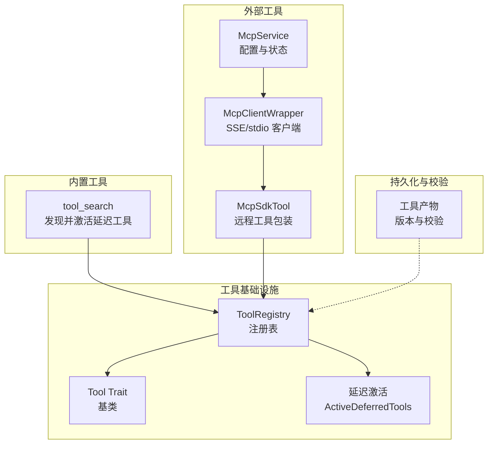
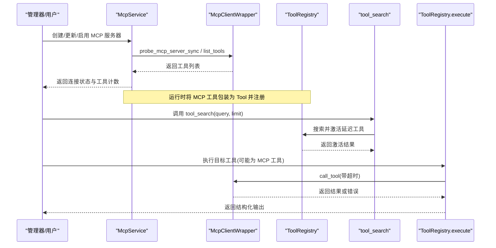
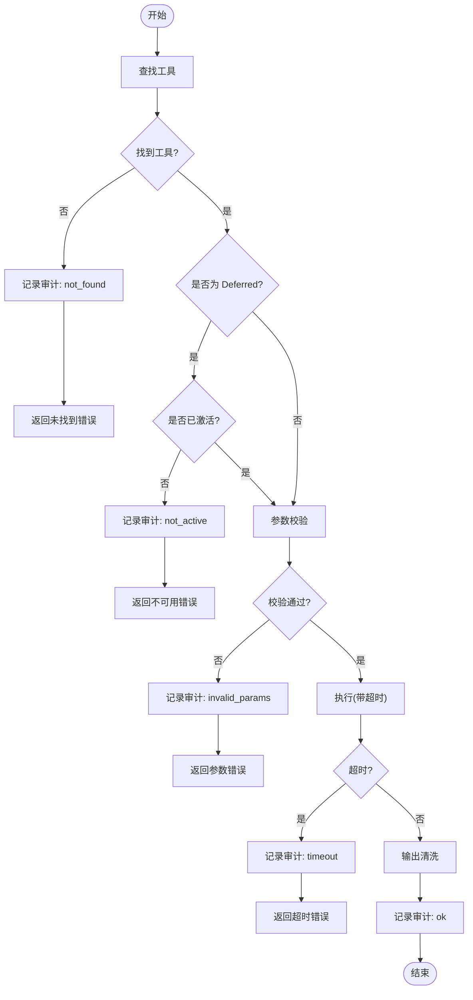
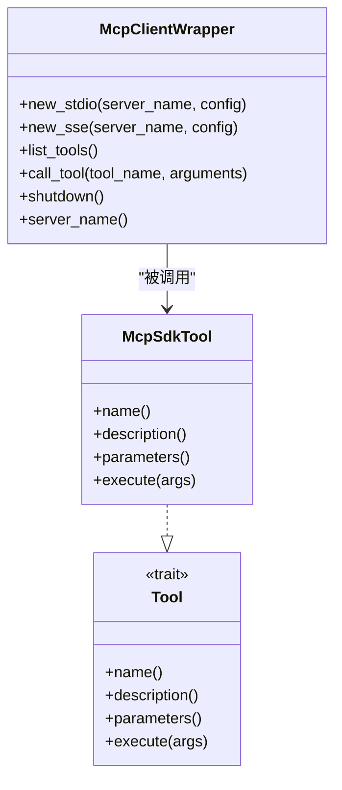
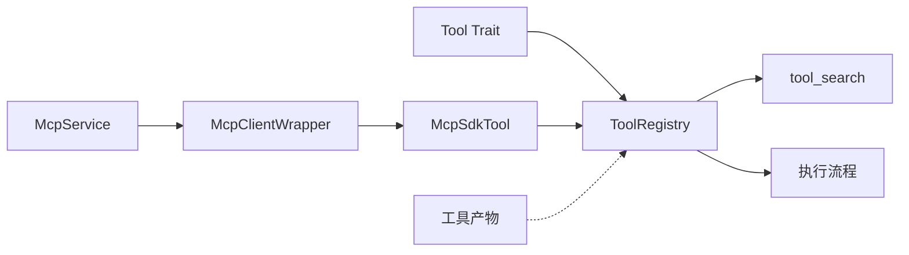

# 工具注册与发现

<cite>
**本文引用的文件**
- [agent-diva-tooling/src/registry.rs](file://agent-diva-tooling/src/registry.rs)
- [agent-diva-tooling/src/base.rs](file://agent-diva-tooling/src/base.rs)
- [agent-diva-tools/src/tool_discovery.rs](file://agent-diva-tools/src/tool_discovery.rs)
- [agent-diva-tools/src/mcp_sdk.rs](file://agent-diva-tools/src/mcp_sdk.rs)
- [agent-diva-manager/src/mcp_service.rs](file://agent-diva-manager/src/mcp_service.rs)
- [agent-diva-core/src/tool_artifact/mod.rs](file://agent-diva-core/src/tool_artifact/mod.rs)
</cite>

## 目录
1. [简介](#简介)
2. [项目结构](#项目结构)
3. [核心组件](#核心组件)
4. [架构总览](#架构总览)
5. [详细组件分析](#详细组件分析)
6. [依赖关系分析](#依赖关系分析)
7. [性能考量](#性能考量)
8. [故障排查指南](#故障排查指南)
9. [结论](#结论)
10. [附录：API 与使用示例](#附录api-与使用示例)

## 简介
本文件系统性阐述 Agent Diva 中的“工具注册与发现机制”，覆盖以下主题：
- 工具注册表的工作原理：动态注册、版本与元数据、延迟激活（Deferred）与核心工具（Core）分区。
- 工具发现流程：内置工具的自动发现、外部 MCP 工具的动态加载与热更新。
- 生命周期管理：从注册到卸载的完整过程，包括并发安全与超时控制。
- API 接口与用法：同步/异步注册、搜索与执行、MCP 配置与状态查询。
- 元数据定义与验证：参数 Schema、关键字索引、冲突处理策略。
- 错误处理模式：统一错误分类、审计事件、可观测性。

## 项目结构
围绕工具注册与发现的关键模块分布如下：
- agent-diva-tooling：提供统一的 Tool trait、ToolRegistry、延迟激活与搜索目录等基础能力。
- agent-diva-tools：实现具体工具（如 tool_search），以及 MCP 工具桥接（mcp_sdk）。
- agent-diva-manager：提供 MCP 服务器配置的增删改查与连接状态探测，驱动运行时热更新。
- agent-diva-core：提供工具产物（artifact）的版本化与校验，保障工具产物的完整性与兼容性。

图表来源
- [agent-diva-tooling/src/registry.rs:362-532](file://agent-diva-tooling/src/registry.rs#L362-L532)
- [agent-diva-tools/src/tool_discovery.rs:9-59](file://agent-diva-tools/src/tool_discovery.rs#L9-L59)
- [agent-diva-tools/src/mcp_sdk.rs:86-273](file://agent-diva-tools/src/mcp_sdk.rs#L86-L273)
- [agent-diva-manager/src/mcp_service.rs:52-221](file://agent-diva-manager/src/mcp_service.rs#L52-L221)
- [agent-diva-core/src/tool_artifact/mod.rs:443-480](file://agent-diva-core/src/tool_artifact/mod.rs#L443-L480)

章节来源
- [agent-diva-tooling/src/registry.rs:362-532](file://agent-diva-tooling/src/registry.rs#L362-L532)
- [agent-diva-tools/src/tool_discovery.rs:9-59](file://agent-diva-tools/src/tool_discovery.rs#L9-L59)
- [agent-diva-tools/src/mcp_sdk.rs:86-273](file://agent-diva-tools/src/mcp_sdk.rs#L86-L273)
- [agent-diva-manager/src/mcp_service.rs:52-221](file://agent-diva-manager/src/mcp_service.rs#L52-L221)
- [agent-diva-core/src/tool_artifact/mod.rs:443-480](file://agent-diva-core/src/tool_artifact/mod.rs#L443-L480)

## 核心组件
- Tool 基类与错误模型：定义工具的统一接口（名称、描述、参数 Schema、执行、可选超时）、参数校验默认实现、OpenAI 函数式 Schema 转换，以及统一的错误类型与分类。
- ToolRegistry 注册表：维护工具集合、支持 Core/Deferred 分区、延迟激活目录、搜索与执行、超时控制、审计日志、结构化输出。
- 延迟激活与搜索：通过 tool_search 工具对已授权但尚未激活的工具进行关键词检索，按评分排序并激活有限数量的工具供下一轮调用。
- MCP 集成：通过 mcp_sdk 连接外部 MCP 服务（stdio/SSE），列举工具并封装为本地 Tool；支持重连、超时、结果清洗。
- MCP 管理服务：提供 MCP 服务器的配置 CRUD、启用/禁用、连接状态探测，并在变更后触发运行时热更新。
- 工具产物版本化：对工具产物进行版本校验与原子写入，确保兼容性与一致性。

章节来源
- [agent-diva-tooling/src/base.rs:7-123](file://agent-diva-tooling/src/base.rs#L7-L123)
- [agent-diva-tooling/src/registry.rs:362-717](file://agent-diva-tooling/src/registry.rs#L362-L717)
- [agent-diva-tools/src/tool_discovery.rs:9-59](file://agent-diva-tools/src/tool_discovery.rs#L9-L59)
- [agent-diva-tools/src/mcp_sdk.rs:86-273](file://agent-diva-tools/src/mcp_sdk.rs#L86-L273)
- [agent-diva-manager/src/mcp_service.rs:52-221](file://agent-diva-manager/src/mcp_service.rs#L52-L221)
- [agent-diva-core/src/tool_artifact/mod.rs:443-480](file://agent-diva-core/src/tool_artifact/mod.rs#L443-L480)

## 架构总览
下图展示了从配置到运行时工具发现的端到端流程：
- 配置层：McpService 读取/保存 MCP 服务器配置，并探测连接状态。
- 发现层：mcp_sdk 根据配置建立连接，列举工具，生成 DiscoveredTool。
- 注册层：将 MCP 工具包装为 McpSdkTool，并通过 ToolRegistry.register/register_in_partition 注册。
- 激活层：tool_search 基于关键词对 Deferred 工具进行搜索与激活，限制激活数量。
- 执行层：ToolRegistry.execute 负责参数校验、超时控制、审计与结果清洗。

图表来源
- [agent-diva-manager/src/mcp_service.rs:62-221](file://agent-diva-manager/src/mcp_service.rs#L62-L221)
- [agent-diva-tools/src/mcp_sdk.rs:210-262](file://agent-diva-tools/src/mcp_sdk.rs#L210-L262)
- [agent-diva-tools/src/tool_discovery.rs:40-59](file://agent-diva-tools/src/tool_discovery.rs#L40-L59)
- [agent-diva-tooling/src/registry.rs:534-699](file://agent-diva-tooling/src/registry.rs#L534-L699)

## 详细组件分析

### 工具注册表（ToolRegistry）
- 分区与延迟激活：
  - Core 分区：始终可见，用于稳定缓存的前缀。
  - Deferred 分区：按需激活，受 ActiveDeferredTools 限制（默认最多 8 个）。
- 搜索目录：
  - 基于工具名、描述、Schema 关键字构建索引，按评分排序，支持 query 过滤与 limit。
- 注册/注销：
  - register/register_in_partition：插入工具并更新目录。
  - unregister：移除工具并从目录与激活集中清理。
- 执行流程：
  - 查找工具 -> 检查是否处于激活状态（Deferred）-> 参数校验 -> 超时控制 -> 审计记录 -> 输出清洗。
- 并发与稳定性：
  - 使用 Arc/RwLock 保护共享状态，保证多线程安全。
  - 全局超时与工具级超时覆盖。

图表来源
- [agent-diva-tooling/src/registry.rs:534-699](file://agent-diva-tooling/src/registry.rs#L534-L699)

章节来源
- [agent-diva-tooling/src/registry.rs:362-717](file://agent-diva-tooling/src/registry.rs#L362-L717)

### 工具发现（tool_search）
- 功能：在已授权的延迟工具目录中搜索，按名称、描述、Schema 关键字评分排序，激活前 N 个工具。
- 输入：query（必填）、limit（1-20，默认 8）。
- 输出：包含查询、结果列表与当前激活名称。
- 作用：避免一次性暴露全部工具，降低上下文开销，提高模型选择效率。

章节来源
- [agent-diva-tools/src/tool_discovery.rs:9-59](file://agent-diva-tools/src/tool_discovery.rs#L9-L59)
- [agent-diva-tooling/src/registry.rs:154-197](file://agent-diva-tooling/src/registry.rs#L154-L197)

### MCP 工具集成（mcp_sdk）
- 连接方式：
  - stdio：启动子进程并建立通信通道。
  - SSE：通过 HTTP 流式传输。
- 工具列举：list_tools 获取工具名、描述、输入 Schema，并进行字符串清洗。
- 工具调用：call_tool 带超时，支持 is_error 标志判断，渲染结果为文本或资源链接。
- 重连机制：首次调用时若客户端不存在，尝试指数退避重连（最多 5 次）。
- 同步/异步：提供 probe_mcp_server_sync 与 load_mcp_tools_sync，兼容非异步场景。

图表来源
- [agent-diva-tools/src/mcp_sdk.rs:86-273](file://agent-diva-tools/src/mcp_sdk.rs#L86-L273)
- [agent-diva-tools/src/mcp_sdk.rs:324-442](file://agent-diva-tools/src/mcp_sdk.rs#L324-L442)
- [agent-diva-tooling/src/base.rs:7-61](file://agent-diva-tooling/src/base.rs#L7-L61)

章节来源
- [agent-diva-tools/src/mcp_sdk.rs:86-273](file://agent-diva-tools/src/mcp_sdk.rs#L86-L273)
- [agent-diva-tools/src/mcp_sdk.rs:324-442](file://agent-diva-tools/src/mcp_sdk.rs#L324-L442)
- [agent-diva-tools/src/mcp_sdk.rs:464-611](file://agent-diva-tools/src/mcp_sdk.rs#L464-L611)

### MCP 管理服务（mcp_service）
- 配置管理：
  - create/update/delete/set_enabled：对 MCP 服务器进行增删改查与启用/禁用。
  - 名称唯一性校验、transport 合法性校验（仅允许 stdio 或 http 之一）。
- 状态探测：
  - to_dto：根据配置计算 transport 与连接状态（connected/degraded/invalid/disabled）。
  - active_servers：返回启用的 MCP 服务器配置映射。
- 运行时联动：
  - 配置变更后，上层运行时会替换现有 mcp_* 工具集合，无需重启。

章节来源
- [agent-diva-manager/src/mcp_service.rs:52-221](file://agent-diva-manager/src/mcp_service.rs#L52-L221)
- [agent-diva-manager/src/mcp_service.rs:223-273](file://agent-diva-manager/src/mcp_service.rs#L223-L273)

### 工具产物与版本管理（tool_artifact）
- 版本校验：读取 metadata 时校验版本字段，不匹配则视为损坏。
- ID 校验：强制特定前缀与长度，防止非法 ID。
- 原子写入：临时文件 + rename，确保一致性。
- 清理：删除 metadata 与对应 content 文件。

章节来源
- [agent-diva-core/src/tool_artifact/mod.rs:443-480](file://agent-diva-core/src/tool_artifact/mod.rs#L443-L480)
- [agent-diva-core/src/tool_artifact/mod.rs:520-544](file://agent-diva-core/src/tool_artifact/mod.rs#L520-L544)

## 依赖关系分析
- ToolRegistry 依赖 Tool trait 与 ActiveDeferredToolsHandle，提供注册、搜索、执行能力。
- tool_search 依赖 ToolRegistry 的延迟激活句柄，实现搜索与激活。
- MCP 集成依赖 rust-mcp-sdk，通过 McpClientWrapper 管理连接与工具调用。
- McpService 依赖 ConfigLoader 与 MCP 探测能力，提供配置管理与状态查询。
- 工具产物模块提供版本化与校验，间接影响工具注册与执行的安全性。

图表来源
- [agent-diva-tooling/src/base.rs:7-61](file://agent-diva-tooling/src/base.rs#L7-L61)
- [agent-diva-tooling/src/registry.rs:362-532](file://agent-diva-tooling/src/registry.rs#L362-L532)
- [agent-diva-tools/src/tool_discovery.rs:9-59](file://agent-diva-tools/src/tool_discovery.rs#L9-L59)
- [agent-diva-tools/src/mcp_sdk.rs:86-273](file://agent-diva-tools/src/mcp_sdk.rs#L86-L273)
- [agent-diva-manager/src/mcp_service.rs:52-221](file://agent-diva-manager/src/mcp_service.rs#L52-L221)
- [agent-diva-core/src/tool_artifact/mod.rs:443-480](file://agent-diva-core/src/tool_artifact/mod.rs#L443-L480)

章节来源
- [agent-diva-tooling/src/registry.rs:362-532](file://agent-diva-tooling/src/registry.rs#L362-L532)
- [agent-diva-tools/src/mcp_sdk.rs:86-273](file://agent-diva-tools/src/mcp_sdk.rs#L86-L273)
- [agent-diva-manager/src/mcp_service.rs:52-221](file://agent-diva-manager/src/mcp_service.rs#L52-L221)
- [agent-diva-core/src/tool_artifact/mod.rs:443-480](file://agent-diva-core/src/tool_artifact/mod.rs#L443-L480)

## 性能考量
- 延迟激活：通过 Core/Deferred 分区与 ActiveDeferredTools 限制，减少模型上下文大小，提升响应速度。
- 搜索优化：关键词分词与评分排序，限制返回数量，避免过度激活。
- 超时控制：全局与工具级超时，防止长时间阻塞。
- 并发安全：Arc/RwLock 保护共享状态，避免竞争条件。
- 输出清洗：去除控制字符与 ANSI 序列，减少无效信息。

[本节为通用性能讨论，不直接分析具体文件]

## 故障排查指南
- 工具未找到：
  - 检查工具是否已注册且未被卸载。
  - 对于 Deferred 工具，确认已通过 tool_search 激活。
- 参数校验失败：
  - 检查参数是否符合 Schema 的 required 与类型约束。
  - 查看审计日志中的 invalid_params 详情。
- 执行超时：
  - 调整工具级超时或全局超时。
  - 检查 MCP 服务端是否响应缓慢或挂起。
- MCP 连接失败：
  - 确认 command/url 配置正确且互斥。
  - 查看连接状态（connected/degraded/invalid/disabled）与错误信息。
  - 重试重连机制（指数退避）。
- 工具产物损坏：
  - 检查 metadata 版本与 ID 格式。
  - 重新生成或修复产物文件。

章节来源
- [agent-diva-tooling/src/registry.rs:534-699](file://agent-diva-tooling/src/registry.rs#L534-L699)
- [agent-diva-manager/src/mcp_service.rs:167-221](file://agent-diva-manager/src/mcp_service.rs#L167-L221)
- [agent-diva-core/src/tool_artifact/mod.rs:443-480](file://agent-diva-core/src/tool_artifact/mod.rs#L443-L480)

## 结论
Agent Diva 的工具注册与发现机制以 ToolRegistry 为核心，结合延迟激活与搜索目录，实现了高效、可控的工具暴露与执行。MCP 集成提供了强大的外部工具扩展能力，配合管理服务实现配置热更新与状态可视化工具产物版本化确保了安全性与兼容性。整体设计兼顾了性能、可扩展性与可观测性。

[本节为总结性内容，不直接分析具体文件]

## 附录：API 与使用示例

### 工具注册 API
- 同步注册：
  - 使用 ToolRegistry::register 或 register_in_partition 将工具加入注册表。
  - 适用于静态工具或编译期已知工具。
- 异步注册：
  - 通过 load_mcp_tools_async 或 probe_mcp_server_async 获取外部工具并注册。
  - 适用于运行时动态加载的外部 MCP 工具。

章节来源
- [agent-diva-tooling/src/registry.rs:452-476](file://agent-diva-tooling/src/registry.rs#L452-L476)
- [agent-diva-tools/src/mcp_sdk.rs:484-502](file://agent-diva-tools/src/mcp_sdk.rs#L484-L502)

### 工具搜索与激活
- 调用 tool_search(query, limit) 搜索并激活延迟工具。
- 返回结果包含查询、匹配工具与当前激活列表。

章节来源
- [agent-diva-tools/src/tool_discovery.rs:40-59](file://agent-diva-tools/src/tool_discovery.rs#L40-L59)

### MCP 配置与管理
- 创建/更新/删除 MCP 服务器：
  - 使用 McpService 的 create/update/delete 方法。
  - 配置需满足 command/url 互斥与必填校验。
- 启用/禁用：
  - set_enabled 方法更新启用状态，影响运行时工具可用性。
- 状态查询：
  - get_mcp/list_mcps 返回连接状态与工具计数。

章节来源
- [agent-diva-manager/src/mcp_service.rs:74-165](file://agent-diva-manager/src/mcp_service.rs#L74-L165)
- [agent-diva-manager/src/mcp_service.rs:167-221](file://agent-diva-manager/src/mcp_service.rs#L167-L221)

### 工具执行与错误处理
- 执行：
  - ToolRegistry::execute 或 execute_structured 执行工具。
  - 支持结构化输出与审计记录。
- 错误处理：
  - 统一错误类型 ToolError，包含超时、参数错误、执行失败等。
  - 通过审计事件记录执行状态与耗时。

章节来源
- [agent-diva-tooling/src/registry.rs:534-699](file://agent-diva-tooling/src/registry.rs#L534-L699)
- [agent-diva-tooling/src/base.rs:63-123](file://agent-diva-tooling/src/base.rs#L63-L123)