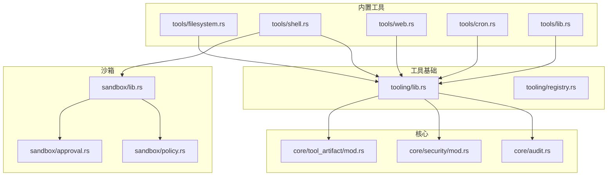
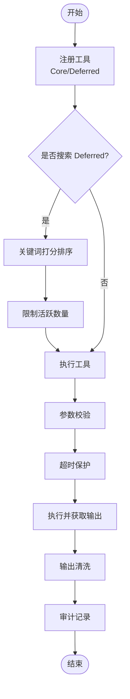
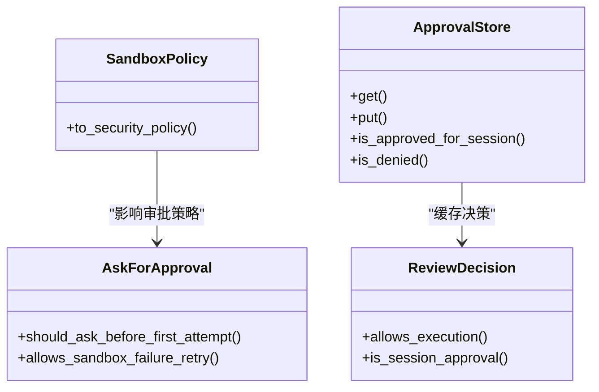
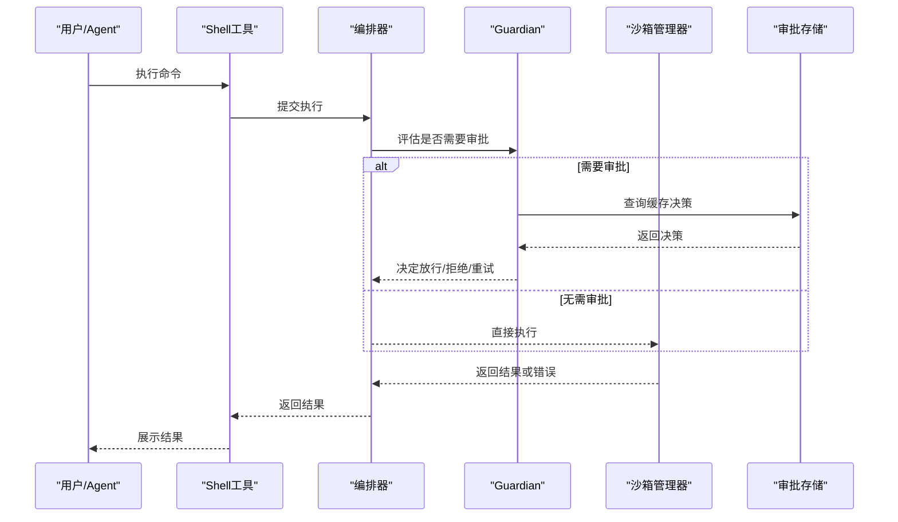
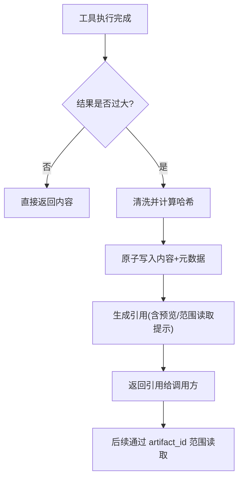

# 工具系统

<cite>
**本文引用的文件**
- [agent-diva-tooling/src/lib.rs](file://agent-diva-tooling/src/lib.rs)
- [agent-diva-tooling/src/registry.rs](file://agent-diva-tooling/src/registry.rs)
- [agent-diva-tools/src/lib.rs](file://agent-diva-tools/src/lib.rs)
- [agent-diva-tools/src/base.rs](file://agent-diva-tools/src/base.rs)
- [agent-diva-tools/src/registry.rs](file://agent-diva-tools/src/registry.rs)
- [agent-diva-tools/src/filesystem.rs](file://agent-diva-tools/src/filesystem.rs)
- [agent-diva-tools/src/shell.rs](file://agent-diva-tools/src/shell.rs)
- [agent-diva-tools/src/web.rs](file://agent-diva-tools/src/web.rs)
- [agent-diva-tools/src/cron.rs](file://agent-diva-tools/src/cron.rs)
- [agent-diva-sandbox/src/lib.rs](file://agent-diva-sandbox/src/lib.rs)
- [agent-diva-sandbox/src/policy.rs](file://agent-diva-sandbox/src/policy.rs)
- [agent-diva-sandbox/src/approval.rs](file://agent-diva-sandbox/src/approval.rs)
- [agent-diva-core/src/tool_artifact/mod.rs](file://agent-diva-core/src/tool_artifact/mod.rs)
- [agent-diva-core/src/security/mod.rs](file://agent-diva-core/src/security/mod.rs)
- [agent-diva-core/src/audit.rs](file://agent-diva-core/src/audit.rs)
</cite>

## 目录
1. [简介](#简介)
2. [项目结构](#项目结构)
3. [核心组件](#核心组件)
4. [架构总览](#架构总览)
5. [详细组件分析](#详细组件分析)
6. [依赖关系分析](#依赖关系分析)
7. [性能考虑](#性能考虑)
8. [故障排查指南](#故障排查指南)
9. [结论](#结论)
10. [附录](#附录)

## 简介
本文件面向“工具系统”的完整说明，覆盖以下目标：
- 工具注册机制与发现流程（含内置工具与自定义工具的集成）
- 沙箱环境的安全控制与权限管理
- 内置工具能力清单：文件系统、Shell 执行、Web 请求、定时任务等
- 自定义工具开发指南：接口实现、参数校验、错误处理
- 工具调用的审批流程与审计机制
- 使用示例与安全最佳实践

## 项目结构
工具系统由多个协作模块组成：
- agent-diva-tooling：定义通用工具基元、注册表与延迟激活机制
- agent-diva-tools：内置工具实现集合（文件、Shell、Web、Cron 等）
- agent-diva-sandbox：命令执行的隔离与策略控制（安全边界）
- agent-diva-core：结果持久化、安全过滤、审计事件等基础设施



图表来源
- [agent-diva-tooling/src/lib.rs:1-14](file://agent-diva-tooling/src/lib.rs#L1-L14)
- [agent-diva-tooling/src/registry.rs:1-120](file://agent-diva-tooling/src/registry.rs#L1-L120)
- [agent-diva-tools/src/lib.rs:1-74](file://agent-diva-tools/src/lib.rs#L1-L74)
- [agent-diva-sandbox/src/lib.rs:1-116](file://agent-diva-sandbox/src/lib.rs#L1-L116)
- [agent-diva-core/src/tool_artifact/mod.rs:1-60](file://agent-diva-core/src/tool_artifact/mod.rs#L1-L60)
- [agent-diva-core/src/security/mod.rs:1-69](file://agent-diva-core/src/security/mod.rs#L1-L69)
- [agent-diva-core/src/audit.rs:1-60](file://agent-diva-core/src/audit.rs#L1-L60)

章节来源
- [agent-diva-tooling/src/lib.rs:1-14](file://agent-diva-tooling/src/lib.rs#L1-L14)
- [agent-diva-tools/src/lib.rs:1-74](file://agent-diva-tools/src/lib.rs#L1-L74)
- [agent-diva-sandbox/src/lib.rs:1-116](file://agent-diva-sandbox/src/lib.rs#L1-L116)
- [agent-diva-core/src/tool_artifact/mod.rs:1-60](file://agent-diva-core/src/tool_artifact/mod.rs#L1-L60)
- [agent-diva-core/src/security/mod.rs:1-69](file://agent-diva-core/src/security/mod.rs#L1-L69)
- [agent-diva-core/src/audit.rs:1-60](file://agent-diva-core/src/audit.rs#L1-L60)

## 核心组件
- 工具基元与注册表（tooling）
  - 统一抽象 Tool、ToolError、Result
  - ToolRegistry：注册、查询、执行、延迟激活、审计与输出清洗
- 内置工具（tools）
  - 文件系统：read_file、write_file、list_dir、edit_file
  - Shell：exec 命令执行（通过沙箱编排器）
  - Web：web_search、web_fetch（多供应商、限流与清理）
  - Cron：定时任务调度与消息投递
- 沙箱（sandbox）
  - 策略：DangerFullAccess / ReadOnly / WorkspaceWrite / ExternalSandbox
  - 审批：一次性/会话级批准、拒绝、缓存
  - 编排：ToolOrchestrator、Guardian、ExecPolicyManager
- 核心（core）
  - 工具结果持久化：大结果落盘、引用返回、范围读取、TTL/GC
  - 安全过滤：输出清洗、PII 脱敏、注入检测
  - 审计：结构化事件（调用、拒绝、执行结果等）

章节来源
- [agent-diva-tooling/src/lib.rs:1-14](file://agent-diva-tooling/src/lib.rs#L1-L14)
- [agent-diva-tooling/src/registry.rs:15-120](file://agent-diva-tooling/src/registry.rs#L15-L120)
- [agent-diva-tools/src/lib.rs:1-74](file://agent-diva-tools/src/lib.rs#L1-L74)
- [agent-diva-sandbox/src/policy.rs:1-110](file://agent-diva-sandbox/src/policy.rs#L1-L110)
- [agent-diva-sandbox/src/approval.rs:1-120](file://agent-diva-sandbox/src/approval.rs#L1-L120)
- [agent-diva-core/src/tool_artifact/mod.rs:1-60](file://agent-diva-core/src/tool_artifact/mod.rs#L1-L60)
- [agent-diva-core/src/security/mod.rs:1-69](file://agent-diva-core/src/security/mod.rs#L1-L69)
- [agent-diva-core/src/audit.rs:1-60](file://agent-diva-core/src/audit.rs#L1-L60)

## 架构总览
工具调用从注册到执行的关键路径如下：
- 注册阶段：将 Tool 实例加入 ToolRegistry；可标记为 Core 或 Deferred（延迟激活）
- 发现阶段：通过 tool_search 对 Deferred 工具进行关键词匹配，限制活跃数量
- 执行阶段：参数校验 → 超时保护 → 执行 → 输出清洗 → 审计记录 → 结果持久化（可选）
- 沙箱阶段：Shell 工具通过 SandboxManager/ToolOrchestrator 在受限环境中运行，必要时触发审批

```mermaid
sequenceDiagram
participant Caller as "调用方"
participant Reg as "ToolRegistry"
participant Tool as "具体工具"
participant San as "沙箱编排器"
participant Aud as "审计"
participant Art as "结果存储"
Caller->>Reg : 执行(name, params)
Reg->>Reg : 参数校验/超时保护
alt 需要沙箱(如 shell)
Reg->>San : 提交执行请求
San-->>Reg : 返回结果或需审批
opt 审批通过
San-->>Reg : 最终结果
else 审批拒绝
San-->>Reg : 拒绝原因
end
else 直接执行
Reg->>Tool : execute(params)
Tool-->>Reg : 原始输出
end
Reg->>Aud : 记录执行事件
Reg->>Art : 大结果持久化并返回引用
Reg-->>Caller : 标准化结果/引用
```

图表来源
- [agent-diva-tooling/src/registry.rs:534-700](file://agent-diva-tooling/src/registry.rs#L534-L700)
- [agent-diva-tools/src/shell.rs:1-150](file://agent-diva-tools/src/shell.rs#L1-L150)
- [agent-diva-core/src/tool_artifact/mod.rs:229-329](file://agent-diva-core/src/tool_artifact/mod.rs#L229-L329)
- [agent-diva-core/src/audit.rs:210-222](file://agent-diva-core/src/audit.rs#L210-L222)

## 详细组件分析

### 工具注册与发现（ToolRegistry）
- 注册
  - register/register_in_partition：支持 Core（始终可见）与 Deferred（延迟激活）两类
  - Deferred 工具进入授权目录，供搜索激活
- 发现
  - search/search_deferred：基于名称、描述、Schema 关键词打分，限制最大活跃数
  - active_deferred_tool_names：仅暴露当前轮次仍被授权的 Deferred 工具
- 执行
  - execute/execute_structured：参数校验、超时保护、输出清洗、审计记录
  - 未找到或未激活的工具会返回不可用/未找到错误，并记录审计事件



图表来源
- [agent-diva-tooling/src/registry.rs:155-232](file://agent-diva-tooling/src/registry.rs#L155-L232)
- [agent-diva-tooling/src/registry.rs:452-532](file://agent-diva-tooling/src/registry.rs#L452-L532)
- [agent-diva-tooling/src/registry.rs:534-700](file://agent-diva-tooling/src/registry.rs#L534-L700)

章节来源
- [agent-diva-tooling/src/registry.rs:15-120](file://agent-diva-tooling/src/registry.rs#L15-L120)
- [agent-diva-tooling/src/registry.rs:452-700](file://agent-diva-tooling/src/registry.rs#L452-L700)

### 沙箱安全与权限管理
- 策略模型
  - SandboxPolicy：危险全量访问/只读/工作区写入/外部沙箱
  - 与核心 SecurityPolicy 的双向转换，确保一致的安全语义
- 审批机制
  - ReviewDecision：拒绝/单次批准/会话级批准
  - ApprovalStore：按命令+工作目录缓存决策，避免重复提示
  - AskForApproval：何时发起审批（失败后/按需/除非可信/从不）
- 执行编排
  - SandboxManager + ToolOrchestrator：封装进程隔离、规则评估、Guardian 智能审查、ExecPolicy 规则引擎



图表来源
- [agent-diva-sandbox/src/policy.rs:10-110](file://agent-diva-sandbox/src/policy.rs#L10-L110)
- [agent-diva-sandbox/src/policy.rs:194-228](file://agent-diva-sandbox/src/policy.rs#L194-L228)
- [agent-diva-sandbox/src/approval.rs:13-120](file://agent-diva-sandbox/src/approval.rs#L13-L120)
- [agent-diva-sandbox/src/approval.rs:155-248](file://agent-diva-sandbox/src/approval.rs#L155-L248)

章节来源
- [agent-diva-sandbox/src/lib.rs:1-116](file://agent-diva-sandbox/src/lib.rs#L1-L116)
- [agent-diva-sandbox/src/policy.rs:10-110](file://agent-diva-sandbox/src/policy.rs#L10-L110)
- [agent-diva-sandbox/src/policy.rs:194-228](file://agent-diva-sandbox/src/policy.rs#L194-L228)
- [agent-diva-sandbox/src/approval.rs:13-120](file://agent-diva-sandbox/src/approval.rs#L13-L120)
- [agent-diva-sandbox/src/approval.rs:155-248](file://agent-diva-sandbox/src/approval.rs#L155-L248)

### 内置工具概览
- 文件系统
  - read_file/write_file/list_dir/edit_file：结合 SecurityPolicy 做路径校验、大小限制、读写控制
- Shell 执行
  - exec：通过沙箱编排器执行命令，支持 deny/allow 模式、默认危险模式拦截、编码兼容
- Web 请求
  - web_search/web_fetch：多供应商、URL 白名单、HTML 清理、结果截断
- 定时任务
  - cron：支持 at/every/cron 表达式，限制在 Cron 上下文内再次创建任务，支持会话投递

章节来源
- [agent-diva-tools/src/filesystem.rs:14-145](file://agent-diva-tools/src/filesystem.rs#L14-L145)
- [agent-diva-tools/src/shell.rs:54-150](file://agent-diva-tools/src/shell.rs#L54-L150)
- [agent-diva-tools/src/web.rs:1-200](file://agent-diva-tools/src/web.rs#L1-L200)
- [agent-diva-tools/src/cron.rs:9-152](file://agent-diva-tools/src/cron.rs#L9-L152)

### 工具调用审批流程（以 Shell 为例）


图表来源
- [agent-diva-tools/src/shell.rs:96-150](file://agent-diva-tools/src/shell.rs#L96-L150)
- [agent-diva-sandbox/src/approval.rs:155-248](file://agent-diva-sandbox/src/approval.rs#L155-L248)
- [agent-diva-sandbox/src/policy.rs:194-228](file://agent-diva-sandbox/src/policy.rs#L194-L228)

章节来源
- [agent-diva-tools/src/shell.rs:96-150](file://agent-diva-tools/src/shell.rs#L96-L150)
- [agent-diva-sandbox/src/approval.rs:155-248](file://agent-diva-sandbox/src/approval.rs#L155-L248)
- [agent-diva-sandbox/src/policy.rs:194-228](file://agent-diva-sandbox/src/policy.rs#L194-L228)

### 工具结果持久化与引用
- 大结果不直接回传，而是写入工作区下的 .agent-diva/tool-artifacts
- 返回轻量引用（包含摘要、哈希、预览），支持按字符范围安全读取
- 自动 TTL 清理与容量控制，防止磁盘膨胀



图表来源
- [agent-diva-core/src/tool_artifact/mod.rs:229-329](file://agent-diva-core/src/tool_artifact/mod.rs#L229-L329)
- [agent-diva-core/src/tool_artifact/mod.rs:426-449](file://agent-diva-core/src/tool_artifact/mod.rs#L426-L449)

章节来源
- [agent-diva-core/src/tool_artifact/mod.rs:229-329](file://agent-diva-core/src/tool_artifact/mod.rs#L229-L329)
- [agent-diva-core/src/tool_artifact/mod.rs:426-449](file://agent-diva-core/src/tool_artifact/mod.rs#L426-L449)

### 自定义工具开发指南
- 实现 Tool 接口
  - name/description/parameters：声明工具标识、用途与参数 Schema
  - execute：异步执行，返回字符串结果
- 注册工具
  - 使用 ToolRegistry.register/register_in_partition 注册为 Core 或 Deferred
- 参数验证
  - 在 execute 中解析并校验参数；注册表会在执行前调用 validate_params
- 错误处理
  - 返回 ToolError 或普通错误字符串（会被包装为工具错误）
- 安全与审计
  - 涉及文件系统/网络/命令时，优先使用 core 安全策略与 sandbox 编排
  - 所有执行均会被审计记录

章节来源
- [agent-diva-tooling/src/lib.rs:1-14](file://agent-diva-tooling/src/lib.rs#L1-L14)
- [agent-diva-tooling/src/registry.rs:534-700](file://agent-diva-tooling/src/registry.rs#L534-L700)
- [agent-diva-tools/src/base.rs:1-4](file://agent-diva-tools/src/base.rs#L1-L4)

## 依赖关系分析
- tooling 提供公共抽象与注册表，被 tools 与上层编排层依赖
- tools 中的 shell 强依赖 sandbox；filesystem/web/cron 依赖 core 的安全与审计
- core 提供安全策略、结果持久化、审计事件，被 tooling 与 tools 共同使用


图表来源
- [agent-diva-tooling/src/lib.rs:1-14](file://agent-diva-tooling/src/lib.rs#L1-L14)
- [agent-diva-tools/src/lib.rs:1-74](file://agent-diva-tools/src/lib.rs#L1-L74)
- [agent-diva-sandbox/src/lib.rs:1-116](file://agent-diva-sandbox/src/lib.rs#L1-L116)
- [agent-diva-core/src/security/mod.rs:1-69](file://agent-diva-core/src/security/mod.rs#L1-L69)
- [agent-diva-core/src/audit.rs:1-60](file://agent-diva-core/src/audit.rs#L1-L60)

章节来源
- [agent-diva-tooling/src/lib.rs:1-14](file://agent-diva-tooling/src/lib.rs#L1-L14)
- [agent-diva-tools/src/lib.rs:1-74](file://agent-diva-tools/src/lib.rs#L1-L74)
- [agent-diva-sandbox/src/lib.rs:1-116](file://agent-diva-sandbox/src/lib.rs#L1-L116)
- [agent-diva-core/src/security/mod.rs:1-69](file://agent-diva-core/src/security/mod.rs#L1-L69)
- [agent-diva-core/src/audit.rs:1-60](file://agent-diva-core/src/audit.rs#L1-L60)

## 性能考虑
- 工具执行超时：注册表层面统一超时保护，避免长耗时阻塞
- 输出清洗与截断：减少不必要的大对象传输，降低模型输入压力
- 结果持久化：大结果落盘并按范围读取，避免内存与带宽浪费
- 延迟激活：Deferred 工具按需激活，减少 schema 体积与查找成本
- 沙箱执行：最小权限与规则评估，降低误操作风险与资源消耗

[本节为通用指导，不直接分析具体文件]

## 故障排查指南
- 工具未找到/不可用
  - 检查是否已注册、是否为 Deferred 且未被激活
  - 查看审计日志中的 ToolExecuted 状态
- 参数校验失败
  - 检查 parameters Schema 与实际传入参数
  - 关注注册表记录的 invalid_params 审计事件
- 执行超时
  - 调整工具或全局超时配置
  - 检查是否存在阻塞 I/O 或网络请求
- 沙箱拒绝/审批失败
  - 检查 SandboxPolicy 与 AskForApproval 设置
  - 查看审批缓存与 Guardian 规则
- 结果无法读取
  - 确认 artifact_id 有效、会话/工作区绑定正确
  - 检查 TTL 与容量限制导致的过期/删除

章节来源
- [agent-diva-tooling/src/registry.rs:534-700](file://agent-diva-tooling/src/registry.rs#L534-L700)
- [agent-diva-core/src/audit.rs:210-222](file://agent-diva-core/src/audit.rs#L210-L222)
- [agent-diva-sandbox/src/policy.rs:194-228](file://agent-diva-sandbox/src/policy.rs#L194-L228)
- [agent-diva-core/src/tool_artifact/mod.rs:276-329](file://agent-diva-core/src/tool_artifact/mod.rs#L276-L329)

## 结论
工具系统通过统一的注册与发现机制、严格的沙箱安全策略、完善的审计与结果持久化，提供了可扩展、可控、可观测的工具执行环境。内置工具覆盖了常见场景，同时为自定义工具提供了清晰的扩展点。建议在生产环境中启用沙箱与审批，并结合审计日志持续优化策略与工具实现。

[本节为总结性内容，不直接分析具体文件]

## 附录

### 使用示例（步骤式）
- 注册内置工具
  - 将 filesystem/shell/web/cron 等工具实例注册到 ToolRegistry
- 执行 Shell 命令
  - 通过 ExecTool.with_approval_backend 配置审批策略
  - 调用 execute 并提交到沙箱编排器
- 读取大文件
  - 使用 read_file 获取内容；若过大则返回引用，再通过 read_tool_result 范围读取
- 发起 Web 搜索
  - 选择供应商并设置 API Key，调用 web_search 获取结果
- 创建定时任务
  - 使用 cron add 指定 at/every/cron 表达式，并在会话上下文中投递

[本节为概念性说明，不直接分析具体文件]

### 安全最佳实践
- 默认启用沙箱与最小权限策略（WorkspaceWrite/ReadOnly）
- 谨慎使用 DangerFullAccess，仅在受控环境临时开启
- 合理配置 AskForApproval，生产建议使用 OnRequest 或 UnlessTrusted
- 定期清理工具结果与审计日志，避免磁盘占用
- 对所有外部输入进行校验与清洗，避免注入与越权访问

[本节为通用指导，不直接分析具体文件]