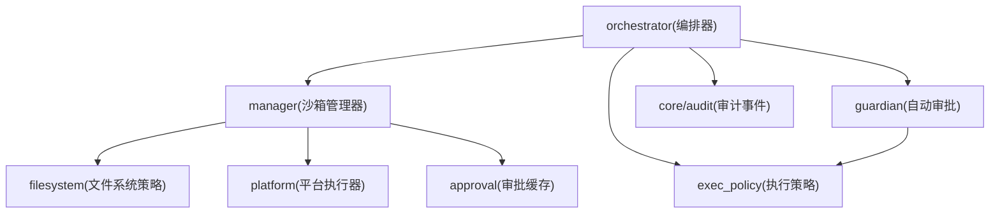
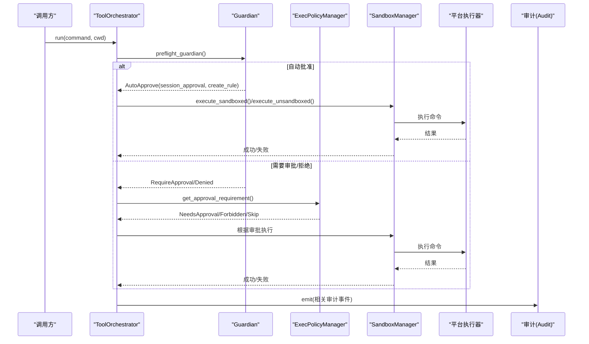
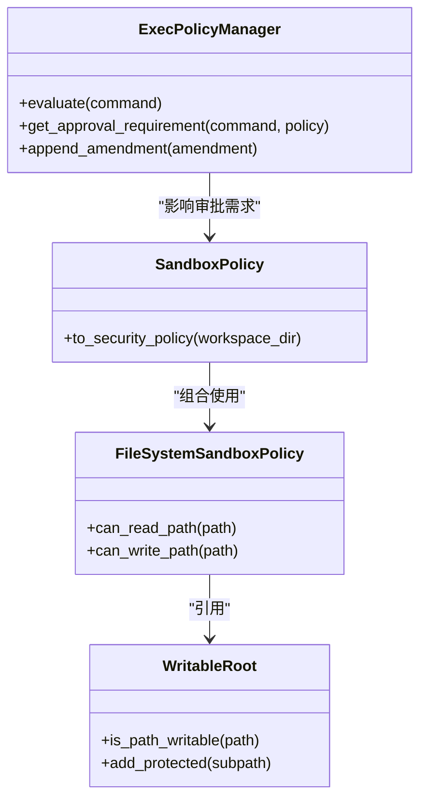
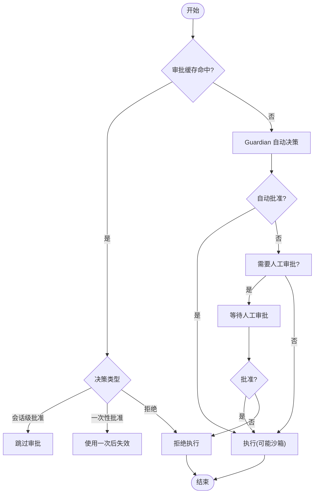
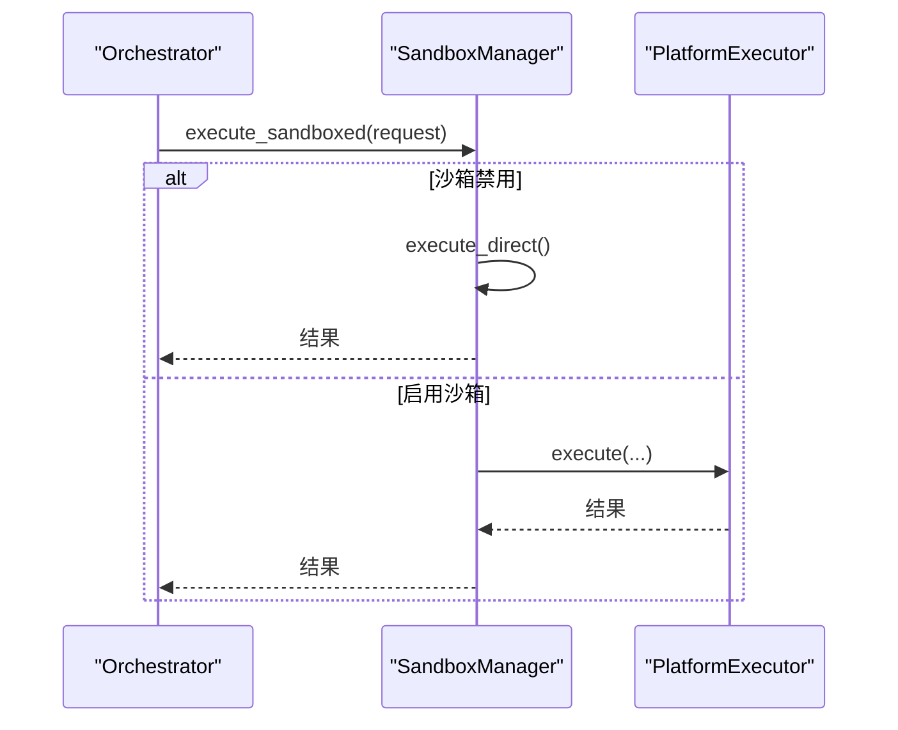
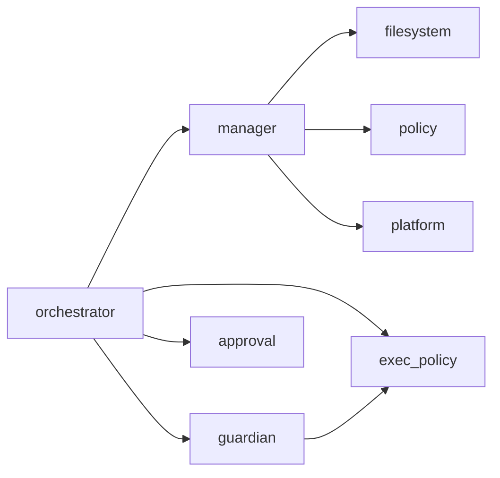

# 沙箱安全控制

<cite>
**本文引用的文件**
- [agent-diva-sandbox/src/lib.rs](file://agent-diva-sandbox/src/lib.rs)
- [agent-diva-sandbox/src/policy.rs](file://agent-diva-sandbox/src/policy.rs)
- [agent-diva-sandbox/src/filesystem.rs](file://agent-diva-sandbox/src/filesystem.rs)
- [agent-diva-sandbox/src/exec_policy.rs](file://agent-diva-sandbox/src/exec_policy.rs)
- [agent-diva-sandbox/src/approval.rs](file://agent-diva-sandbox/src/approval.rs)
- [agent-diva-sandbox/src/guardian.rs](file://agent-diva-sandbox/src/guardian.rs)
- [agent-diva-sandbox/src/manager.rs](file://agent-diva-sandbox/src/manager.rs)
- [agent-diva-sandbox/src/orchestrator.rs](file://agent-diva-sandbox/src/orchestrator.rs)
- [agent-diva-core/src/audit.rs](file://agent-diva-core/src/audit.rs)
</cite>

## 目录
1. [简介](#简介)
2. [项目结构](#项目结构)
3. [核心组件](#核心组件)
4. [架构总览](#架构总览)
5. [详细组件分析](#详细组件分析)
6. [依赖关系分析](#依赖关系分析)
7. [性能与资源限制](#性能与资源限制)
8. [故障排查指南](#故障排查指南)
9. [结论](#结论)
10. [附录](#附录)

## 简介
本文件系统性阐述 Agent Diva 的沙箱安全控制体系，覆盖隔离机制、执行权限控制、安全策略配置与管理（文件系统访问、命令执行、网络请求）、审批流程（人工审批与自动决策）、审计日志记录与分析、最佳实践与常见威胁防护、沙箱逃逸防护与资源限制策略，以及不同执行环境的安全模型与权限边界。目标是帮助读者在不深入源码的情况下理解并正确配置沙箱，确保命令执行在受控环境中进行，同时兼顾可用性与可观测性。

## 项目结构
Agent Diva 将“沙箱”能力集中在 agent-diva-sandbox 模块中，并通过 core 的审计子系统提供统一的可观测性。关键目录与职责：
- sandbox/lib.rs：对外导出公共 API、特性开关与环境变量开关（如禁用沙箱）。
- sandbox/policy.rs：定义沙箱策略模式（只读、工作区写、外部沙箱、危险全开放）及与安全策略的桥接。
- sandbox/filesystem.rs：文件系统访问控制（白名单/黑名单、特殊路径、默认保护模式）。
- sandbox/exec_policy.rs：基于规则的命令执行策略（TOML 规则、禁止前缀、自动学习写入）。
- sandbox/approval.rs：审批缓存与决策类型（一次性批准、会话级批准、拒绝）。
- sandbox/guardian.rs：自动审批器（默认审查器、拒绝对策熔断器、智能/严格/宽松配置）。
- sandbox/manager.rs：沙箱管理器（组装策略、平台执行器选择、超时与直接执行）。
- sandbox/orchestrator.rs：编排器（预检查→审批→执行→失败重试/升级）。
- core/audit.rs：结构化审计事件（工具调用、拒绝、注入检测、技能加载等），通过 tracing target "audit" 输出。

图表来源
- [agent-diva-sandbox/src/orchestrator.rs:400-430](file://agent-diva-sandbox/src/orchestrator.rs#L400-L430)
- [agent-diva-sandbox/src/manager.rs:236-298](file://agent-diva-sandbox/src/manager.rs#L236-L298)
- [agent-diva-sandbox/src/guardian.rs:618-694](file://agent-diva-sandbox/src/guardian.rs#L618-L694)
- [agent-diva-sandbox/src/exec_policy.rs:165-257](file://agent-diva-sandbox/src/exec_policy.rs#L165-L257)
- [agent-diva-sandbox/src/filesystem.rs:9-94](file://agent-diva-sandbox/src/filesystem.rs#L9-L94)
- [agent-diva-core/src/audit.rs:224-253](file://agent-diva-core/src/audit.rs#L224-L253)

章节来源
- [agent-diva-sandbox/src/lib.rs:1-116](file://agent-diva-sandbox/src/lib.rs#L1-L116)
- [agent-diva-sandbox/src/orchestrator.rs:400-430](file://agent-diva-sandbox/src/orchestrator.rs#L400-L430)
- [agent-diva-core/src/audit.rs:224-253](file://agent-diva-core/src/audit.rs#L224-L253)

## 核心组件
- 策略层
  - SandboxPolicy：定义沙箱运行模式（危险全开放、只读、工作区写、外部沙箱），并可映射到 core 的 SecurityPolicy。
  - FileSystemSandboxPolicy：细粒度文件访问控制（按路径/通配符/特殊路径），支持读写分离与保护子路径。
  - ExecPolicyManager：加载 TOML 规则、评估命令、生成审批需求、追加规则（自动学习）并持久化。
- 审批与自动决策
  - ApprovalStore：基于命令+工作目录的缓存，支持一次性/会话级批准与拒绝。
  - Guardian：默认审查器结合 ExecPolicy/CommandRuleStore，实现自动批准、要求人工审批或拒绝；内置熔断器防止频繁拒绝导致雪崩。
- 执行与编排
  - SandboxManager：组合策略与平台执行器，处理超时、直接执行与平台受限执行。
  - ToolOrchestrator：编排全流程（预检查→审批→执行→失败重试/升级），返回是否使用沙箱、是否请求审批、建议的规则修正等。
- 可观测性
  - Audit：统一审计事件发射，供 GUI/CLI 消费以重建事件流。

章节来源
- [agent-diva-sandbox/src/policy.rs:9-108](file://agent-diva-sandbox/src/policy.rs#L9-L108)
- [agent-diva-sandbox/src/filesystem.rs:9-94](file://agent-diva-sandbox/src/filesystem.rs#L9-L94)
- [agent-diva-sandbox/src/exec_policy.rs:165-257](file://agent-diva-sandbox/src/exec_policy.rs#L165-L257)
- [agent-diva-sandbox/src/approval.rs:155-248](file://agent-diva-sandbox/src/approval.rs#L155-L248)
- [agent-diva-sandbox/src/guardian.rs:218-472](file://agent-diva-sandbox/src/guardian.rs#L218-L472)
- [agent-diva-sandbox/src/manager.rs:236-298](file://agent-diva-sandbox/src/manager.rs#L236-L298)
- [agent-diva-sandbox/src/orchestrator.rs:269-430](file://agent-diva-sandbox/src/orchestrator.rs#L269-L430)
- [agent-diva-core/src/audit.rs:224-253](file://agent-diva-core/src/audit.rs#L224-L253)

## 架构总览
下图展示了从编排器到策略、审批、平台执行器的完整调用链，以及审计事件的输出点。

图表来源
- [agent-diva-sandbox/src/orchestrator.rs:400-514](file://agent-diva-sandbox/src/orchestrator.rs#L400-L514)
- [agent-diva-sandbox/src/guardian.rs:618-694](file://agent-diva-sandbox/src/guardian.rs#L618-L694)
- [agent-diva-sandbox/src/exec_policy.rs:254-324](file://agent-diva-sandbox/src/exec_policy.rs#L254-L324)
- [agent-diva-sandbox/src/manager.rs:400-575](file://agent-diva-sandbox/src/manager.rs#L400-L575)
- [agent-diva-core/src/audit.rs:224-253](file://agent-diva-core/src/audit.rs#L224-L253)

## 详细组件分析

### 策略与权限模型
- SandboxPolicy
  - 危险全开放：关闭工作区限制、允许任意读写（谨慎使用）。
  - 只读：仅读取，可限定为工作区或全盘读取。
  - 工作区写：允许对当前工作区及可选额外根目录写入，默认开启工作区隔离。
  - 外部沙箱：进程已在容器等外部沙箱中运行，内部不再重复隔离。
  - 与安全策略桥接：可将 SandboxPolicy 转换为 SecurityPolicy，用于更高层的路径校验与级别控制。
- FileSystemSandboxPolicy
  - 三种模式：受限（Restricted）、无限制（Unrestricted）、外部沙箱（ExternalSandbox）。
  - 条目（Entry）：路径匹配（精确路径、通配 Glob、特殊路径），访问模式（读/写/无）。
  - 默认保护：包含 .git/.diva/.agents/.env 等敏感目录/文件的默认拒绝匹配器。
  - 可写根（WritableRoot）：在工作区根下允许写入，但可声明若干只读子路径（如 .git、.diva）。
- ExecPolicyManager
  - 规则来源：TOML 文件、生产 CommandRuleStore 转换。
  - 评估：Allow/Prompt/Forbidden 三类决策；结合 AskForApproval 策略决定是否需要人工审批。
  - 禁止前缀：拦截解释器内联执行、提权命令等高风险前缀，避免自动学习加入这些规则。
  - 自动学习：用户批准后，可追加 Allow 规则到文件并更新内存策略。

图表来源
- [agent-diva-sandbox/src/policy.rs:9-108](file://agent-diva-sandbox/src/policy.rs#L9-L108)
- [agent-diva-sandbox/src/filesystem.rs:9-94](file://agent-diva-sandbox/src/filesystem.rs#L9-L94)
- [agent-diva-sandbox/src/filesystem.rs:240-337](file://agent-diva-sandbox/src/filesystem.rs#L240-L337)
- [agent-diva-sandbox/src/exec_policy.rs:165-324](file://agent-diva-sandbox/src/exec_policy.rs#L165-L324)

章节来源
- [agent-diva-sandbox/src/policy.rs:9-108](file://agent-diva-sandbox/src/policy.rs#L9-L108)
- [agent-diva-sandbox/src/filesystem.rs:9-94](file://agent-diva-sandbox/src/filesystem.rs#L9-L94)
- [agent-diva-sandbox/src/filesystem.rs:240-337](file://agent-diva-sandbox/src/filesystem.rs#L240-L337)
- [agent-diva-sandbox/src/exec_policy.rs:165-324](file://agent-diva-sandbox/src/exec_policy.rs#L165-L324)

### 审批流程（人工审批与自动决策）
- 审批缓存（ApprovalStore）
  - 键：命令字符串 + 工作目录。
  - 决策：一次性批准、会话级批准、拒绝。
  - 查询：是否已批准、是否会话级、是否拒绝、清空计数等。
- 自动决策（Guardian）
  - 默认审查器：依据 ExecPolicy/CommandRuleStore 判断“已知安全”，识别“看似只读”的命令，检测“潜在危险”命令（提权、删除、解释器内联执行、包管理安装/卸载等）。
  - 配置模式：严格（全部询问）、平衡（低风险自动批准）、宽松（未知命令自动批准并可自动学习）。
  - 熔断器：在时间窗口内连续拒绝达到阈值时，阻止自动批准，强制人工介入。
- 编排器中的审批流
  - 预检查阶段：优先尝试 Guardian 自动批准；若需人工审批则进入正常审批流程。
  - 首次执行：根据审批需求决定是否绕过沙箱（仅在明确授权时）。
  - 失败重试：当沙箱拒绝或平台不可用时，依据策略允许升级到非沙箱执行（需再次审批或已有缓存）。

图表来源
- [agent-diva-sandbox/src/approval.rs:155-248](file://agent-diva-sandbox/src/approval.rs#L155-L248)
- [agent-diva-sandbox/src/guardian.rs:218-472](file://agent-diva-sandbox/src/guardian.rs#L218-L472)
- [agent-diva-sandbox/src/orchestrator.rs:400-514](file://agent-diva-sandbox/src/orchestrator.rs#L400-L514)

章节来源
- [agent-diva-sandbox/src/approval.rs:155-248](file://agent-diva-sandbox/src/approval.rs#L155-L248)
- [agent-diva-sandbox/src/guardian.rs:218-472](file://agent-diva-sandbox/src/guardian.rs#L218-L472)
- [agent-diva-sandbox/src/orchestrator.rs:400-514](file://agent-diva-sandbox/src/orchestrator.rs#L400-L514)

### 执行与平台隔离
- SandboxManager
  - 构建策略：根据配置生成 SandboxPolicy 与 FileSystemSandboxPolicy。
  - 执行路径：禁用沙箱时直接执行；否则选择平台执行器（Windows/Linux/macOS）。
  - 超时控制：对直接执行和平台执行均支持超时。
  - 平台差异：
    - Windows：Restricted Token/Elevated 等级。
    - Linux：预留 Bubblewrap/Landlock/Seccomp 等隔离能力（Phase 2）。
    - macOS：sandbox-exec 可用性检查。
- 命令构造与注入防护
  - 参数转义：POSIX 与 PowerShell 分别采用安全的引号与拼接方式，防止 shell 注入。
  - 环境变量：按需注入，避免泄露敏感信息。

图表来源
- [agent-diva-sandbox/src/manager.rs:400-575](file://agent-diva-sandbox/src/manager.rs#L400-L575)
- [agent-diva-sandbox/src/manager.rs:69-87](file://agent-diva-sandbox/src/manager.rs#L69-L87)

章节来源
- [agent-diva-sandbox/src/manager.rs:236-298](file://agent-diva-sandbox/src/manager.rs#L236-L298)
- [agent-diva-sandbox/src/manager.rs:400-575](file://agent-diva-sandbox/src/manager.rs#L400-L575)
- [agent-diva-sandbox/src/manager.rs:69-87](file://agent-diva-sandbox/src/manager.rs#L69-L87)

### 审计日志与可观测性
- 审计事件（AuditEvent）
  - 覆盖工具调用、拒绝、注入检测、技能加载/拒绝/隔离、通道认证失败、消息阻断、安全策略决策、定时任务执行等。
  - 通过 tracing target "audit" 输出 JSON 行，GUI/CLI 可订阅过滤。
- 与沙箱集成
  - 编排器在执行前后、审批决策、拒绝/批准等关键点可触发审计事件，便于事后分析与合规审计。

章节来源
- [agent-diva-core/src/audit.rs:15-222](file://agent-diva-core/src/audit.rs#L15-L222)
- [agent-diva-core/src/audit.rs:224-253](file://agent-diva-core/src/audit.rs#L224-L253)

## 依赖关系分析
- 模块耦合
  - orchestrator 依赖 manager、guardian、exec_policy 与 approval。
  - guardian 依赖 exec_policy 与 command_rules（生产规则源）。
  - manager 依赖 filesystem、policy、platform 抽象。
  - exec_policy 依赖 rules（TOML 解析）与 decision（评估结果）。
- 外部依赖
  - globset：通配符匹配。
  - tokio/process：异步进程执行。
  - tracing：结构化日志与审计。
- 循环依赖
  - 未见明显循环依赖；各模块职责清晰，通过 trait/枚举解耦。

图表来源
- [agent-diva-sandbox/src/orchestrator.rs:269-430](file://agent-diva-sandbox/src/orchestrator.rs#L269-L430)
- [agent-diva-sandbox/src/manager.rs:236-298](file://agent-diva-sandbox/src/manager.rs#L236-L298)
- [agent-diva-sandbox/src/guardian.rs:618-694](file://agent-diva-sandbox/src/guardian.rs#L618-L694)

章节来源
- [agent-diva-sandbox/src/orchestrator.rs:269-430](file://agent-diva-sandbox/src/orchestrator.rs#L269-L430)
- [agent-diva-sandbox/src/manager.rs:236-298](file://agent-diva-sandbox/src/manager.rs#L236-L298)
- [agent-diva-sandbox/src/guardian.rs:618-694](file://agent-diva-sandbox/src/guardian.rs#L618-L694)

## 性能与资源限制
- 超时控制
  - 所有执行路径支持超时，避免长时间阻塞。
- 规则评估开销
  - ExecPolicy 使用内存策略与 GlobSet 匹配，评估复杂度与规则数量线性相关；建议合理组织规则，避免过多复杂通配符。
- 审批缓存
  - 会话级批准减少重复交互；一次性批准降低误用风险。
- 熔断器
  - 在高频拒绝场景下自动降级，避免自动批准风暴。
- 资源限制策略（建议）
  - 结合平台能力（Linux Landlock/Seccomp、Windows Restricted Token）限制 CPU/内存/IO 配额。
  - 在网络层面，默认关闭出站网络，必要时通过策略显式放开。

[本节为通用指导，不直接分析具体文件]

## 故障排查指南
- 常见问题
  - 平台不可用：macOS 缺少 sandbox-exec、Linux 未启用相应隔离能力。
  - 规则冲突：重复规则被拒绝追加；禁止前缀无法自动学习。
  - 审批卡住：会话级批准未生效或一次性批准已被消耗。
  - 注入风险：命令参数未正确转义导致 shell 注入。
- 定位方法
  - 查看审计日志（target="audit"），筛选 ToolDenied、SecurityPolicyDecision 等事件。
  - 检查 ExecPolicy 规则文件是否存在重复或错误格式。
  - 确认 SandboxConfig 的模式与网络访问设置是否符合预期。
- 修复建议
  - 调整 Guardian 配置（严格/平衡/宽松）以适应场景。
  - 增加或细化文件系统保护路径，避免敏感数据泄露。
  - 对高危命令设置 Prompt 或 Forbidden，避免自动批准。

章节来源
- [agent-diva-sandbox/src/exec_policy.rs:109-131](file://agent-diva-sandbox/src/exec_policy.rs#L109-L131)
- [agent-diva-sandbox/src/guardian.rs:475-589](file://agent-diva-sandbox/src/guardian.rs#L475-L589)
- [agent-diva-core/src/audit.rs:15-222](file://agent-diva-core/src/audit.rs#L15-L222)

## 结论
Agent Diva 的沙箱安全控制通过“策略—审批—执行—审计”的分层设计，实现了命令执行的细粒度隔离与可控性。策略层提供灵活的访问控制与规则引擎；审批层结合人工与自动决策，兼顾安全与效率；执行层屏蔽平台差异并提供超时与直接执行回退；审计层提供统一的可观测性。遵循本文的最佳实践与防护建议，可有效降低沙箱逃逸、注入、越权访问等安全风险，并在多平台上保持一致的安全基线。

[本节为总结，不直接分析具体文件]

## 附录
- 最佳实践
  - 默认启用沙箱，仅在可信开发环境使用危险全开放模式。
  - 使用工作区写模式并声明保护子路径，避免修改版本控制与密钥文件。
  - 将网络访问默认关闭，按需放开。
  - 使用严格或平衡的 Guardian 配置，逐步过渡到宽松模式并配合自动学习。
  - 定期审查 ExecPolicy 规则，清理冗余或过宽规则。
  - 启用审计日志并建立告警规则，监控异常行为。
- 常见威胁与防护
  - 命令注入：使用安全的参数转义与最小特权执行。
  - 提权攻击：禁止 sudo/su/doas 等前缀，拒绝自动学习。
  - 数据泄露：默认保护 .env、证书、密钥等敏感路径。
  - 资源耗尽：设置超时与熔断器，限制并发与执行时长。
  - 逃逸风险：优先使用平台原生隔离能力，避免在宿主环境直接执行。

[本节为通用指导，不直接分析具体文件]