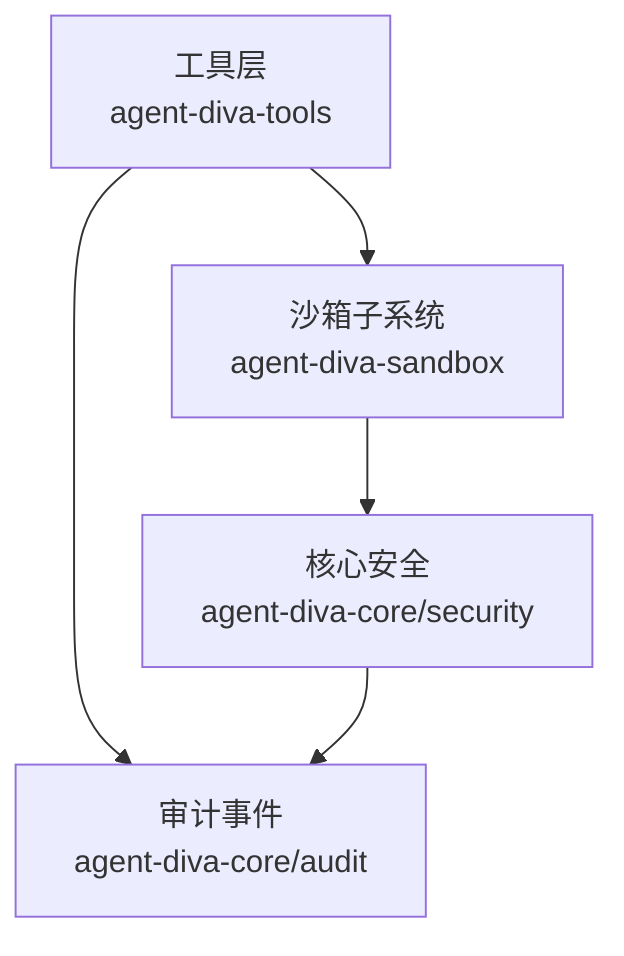
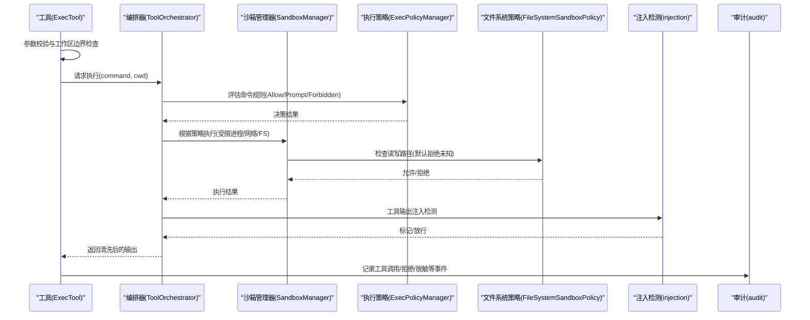
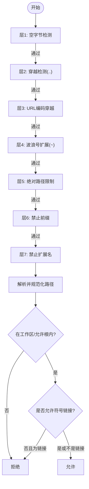
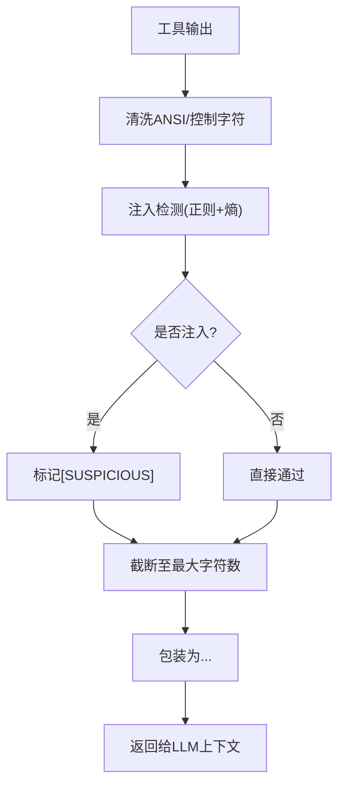
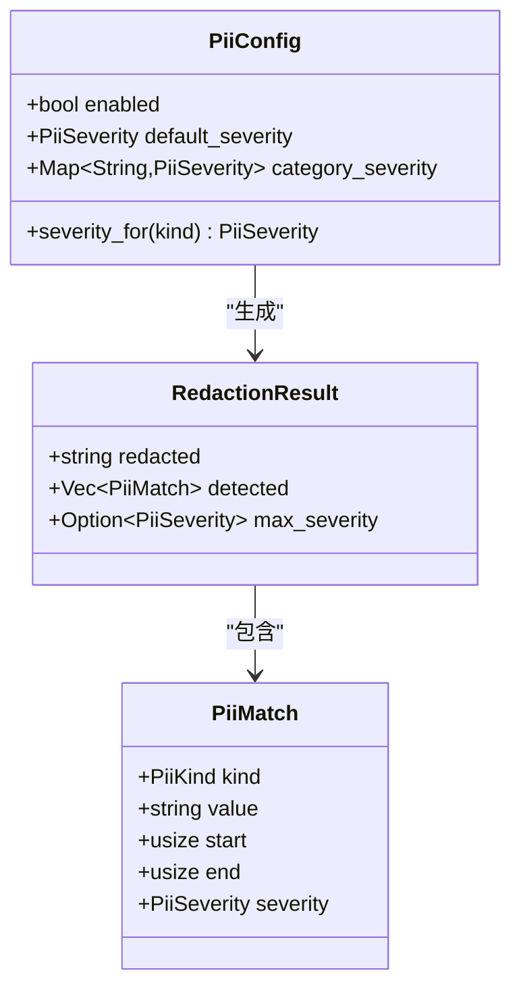
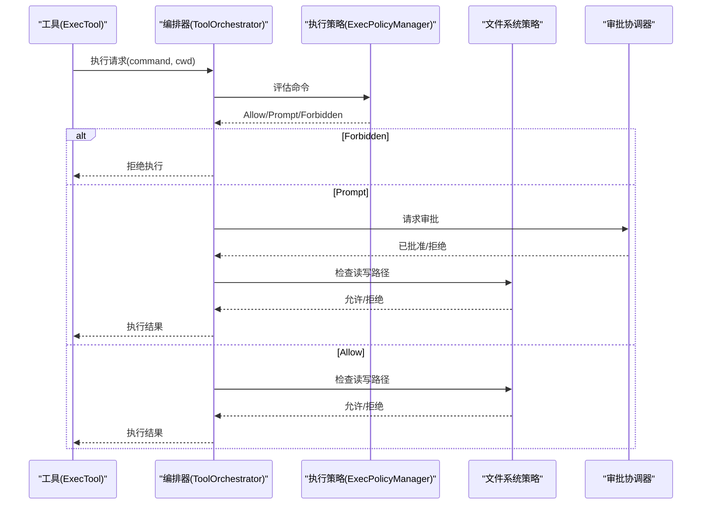
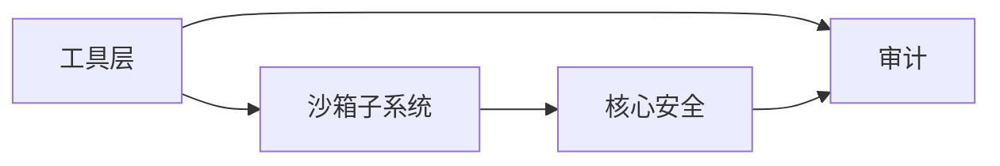

# 工具安全最佳实践

<cite>
**本文引用的文件**
- [agent-diva-core/src/security/mod.rs](file://agent-diva-core/src/security/mod.rs)
- [agent-diva-core/src/security/injection.rs](file://agent-diva-core/src/security/injection.rs)
- [agent-diva-core/src/security/policy.rs](file://agent-diva-core/src/security/policy.rs)
- [agent-diva-core/src/security/path.rs](file://agent-diva-core/src/security/path.rs)
- [agent-diva-core/src/security/tool_result_filter.rs](file://agent-diva-core/src/security/tool_result_filter.rs)
- [agent-diva-core/src/security/pii.rs](file://agent-diva-core/src/security/pii.rs)
- [agent-diva-core/src/audit.rs](file://agent-diva-core/src/audit.rs)
- [agent-diva-sandbox/src/lib.rs](file://agent-diva-sandbox/src/lib.rs)
- [agent-diva-sandbox/src/policy.rs](file://agent-diva-sandbox/src/policy.rs)
- [agent-diva-sandbox/src/exec_policy.rs](file://agent-diva-sandbox/src/exec_policy.rs)
- [agent-diva-sandbox/src/filesystem.rs](file://agent-diva-sandbox/src/filesystem.rs)
- [agent-diva-tools/src/sanitize.rs](file://agent-diva-tools/src/sanitize.rs)
- [agent-diva-tools/src/shell.rs](file://agent-diva-tools/src/shell.rs)
- [docs/decisions/security-and-threat-model-2026-07-29.md](file://docs/decisions/security-and-threat-model-2026-07-29.md)
</cite>

## 目录
1. [简介](#简介)
2. [项目结构](#项目结构)
3. [核心组件](#核心组件)
4. [架构总览](#架构总览)
5. [详细组件分析](#详细组件分析)
6. [依赖关系分析](#依赖关系分析)
7. [性能考量](#性能考量)
8. [故障排查指南](#故障排查指南)
9. [结论](#结论)
10. [附录](#附录)

## 简介
本指南面向Agent-Diva工程中的“工具”（如Shell执行、文件读写、网络调用等）在运行时的安全边界与防护策略，围绕以下目标展开：
- 权限最小化：文件系统访问、网络请求、系统调用的限制与白名单。
- 输入验证与输出过滤：防止注入攻击与数据泄露。
- 沙箱环境：资源限制与执行隔离。
- 安全编码规范：敏感信息处理、错误信息脱敏、审计日志记录。
- 漏洞检测与修复：静态/动态检查、回归测试与安全审查流程。

## 项目结构
Agent-Diva将安全能力分层组织：
- 核心安全模块（core/security）：路径校验、注入检测、PII脱敏、工具结果过滤、速率限制、策略配置。
- 沙箱子系统（sandbox）：命令执行策略、文件系统访问控制、审批协调、守护评估、平台隔离。
- 工具层（tools）：具体工具实现（如shell执行），集成沙箱与输出清洗。
- 审计（audit）：统一事件出口，便于可观测与合规审计。

图表来源
- [agent-diva-tools/src/shell.rs:1-150](file://agent-diva-tools/src/shell.rs#L1-L150)
- [agent-diva-sandbox/src/lib.rs:1-116](file://agent-diva-sandbox/src/lib.rs#L1-L116)
- [agent-diva-core/src/security/mod.rs:1-69](file://agent-diva-core/src/security/mod.rs#L1-L69)
- [agent-diva-core/src/audit.rs:1-60](file://agent-diva-core/src/audit.rs#L1-L60)

章节来源
- [agent-diva-core/src/security/mod.rs:1-69](file://agent-diva-core/src/security/mod.rs#L1-L69)
- [agent-diva-sandbox/src/lib.rs:1-116](file://agent-diva-sandbox/src/lib.rs#L1-L116)
- [agent-diva-tools/src/shell.rs:1-150](file://agent-diva-tools/src/shell.rs#L1-L150)
- [agent-diva-core/src/audit.rs:1-60](file://agent-diva-core/src/audit.rs#L1-L60)

## 核心组件
- 安全策略（SecurityPolicy）：统一的路径校验、速率限制、工作区约束、只读模式开关。
- 注入检测（injection）：三层防御（正则匹配、熵值分析、模型分类预留），对角色覆盖、工具输出注入、越狱尝试进行识别与处置。
- PII脱敏（pii）：多类别敏感信息检测与替换，支持警告/错误级别策略。
- 工具结果过滤（tool_result_filter）：包装为“不可信”内容、注入标记、长度截断，避免上下文耗尽与指令劫持。
- 沙箱策略（SandboxPolicy/FileSystemSandboxPolicy）：读取/写入/网络访问控制，保护路径默认黑名单，工作区写根与受保护子路径。
- 执行策略（ExecPolicyManager）：基于规则的命令批准、自动学习、禁止前缀建议。
- 审计（audit）：结构化事件输出，贯穿工具调用、注入检测、PII脱敏、技能加载等关键路径。

章节来源
- [agent-diva-core/src/security/policy.rs:14-288](file://agent-diva-core/src/security/policy.rs#L14-L288)
- [agent-diva-core/src/security/injection.rs:1-120](file://agent-diva-core/src/security/injection.rs#L1-L120)
- [agent-diva-core/src/security/pii.rs:1-120](file://agent-diva-core/src/security/pii.rs#L1-L120)
- [agent-diva-core/src/security/tool_result_filter.rs:1-133](file://agent-diva-core/src/security/tool_result_filter.rs#L1-L133)
- [agent-diva-sandbox/src/policy.rs:1-110](file://agent-diva-sandbox/src/policy.rs#L1-L110)
- [agent-diva-sandbox/src/filesystem.rs:1-120](file://agent-diva-sandbox/src/filesystem.rs#L1-L120)
- [agent-diva-sandbox/src/exec_policy.rs:1-160](file://agent-diva-sandbox/src/exec_policy.rs#L1-L160)
- [agent-diva-core/src/audit.rs:1-60](file://agent-diva-core/src/audit.rs#L1-L60)

## 架构总览
工具执行的安全链路：
- 工具入口（如exec）进行参数校验与工作区边界强制。
- 通过沙箱编排器（ToolOrchestrator）决定执行策略（是否需审批、是否绕过沙箱）。
- 执行前进行路径与命令规则校验；执行中限制资源与网络；执行后对输出进行清洗与注入检测。
- 所有关键事件通过审计模块输出，供外部消费与审计。

图表来源
- [agent-diva-tools/src/shell.rs:96-149](file://agent-diva-tools/src/shell.rs#L96-L149)
- [agent-diva-sandbox/src/exec_policy.rs:254-324](file://agent-diva-sandbox/src/exec_policy.rs#L254-L324)
- [agent-diva-sandbox/src/filesystem.rs:44-94](file://agent-diva-sandbox/src/filesystem.rs#L44-L94)
- [agent-diva-core/src/security/injection.rs:303-409](file://agent-diva-core/src/security/injection.rs#L303-L409)
- [agent-diva-core/src/audit.rs:224-253](file://agent-diva-core/src/audit.rs#L224-L253)

## 详细组件分析

### 路径与文件系统访问控制
- 路径校验七层防线：空字节、穿越、URL编码穿越、波浪号扩展、绝对路径限制、禁止前缀、禁止扩展名。
- 解析后路径必须在允许的工作区内，支持额外允许根；可选禁用符号链接。
- 沙箱文件系统策略：Restricted模式下默认拒绝未显式允许的读取/写入；Unrestricted/ExternalSandbox放宽；WritableRoot提供工作区写根并内置受保护子路径（如.git、.diva、.env*等）。

图表来源
- [agent-diva-core/src/security/policy.rs:84-201](file://agent-diva-core/src/security/policy.rs#L84-L201)
- [agent-diva-core/src/security/path.rs:8-149](file://agent-diva-core/src/security/path.rs#L8-L149)
- [agent-diva-sandbox/src/filesystem.rs:44-94](file://agent-diva-sandbox/src/filesystem.rs#L44-L94)
- [agent-diva-sandbox/src/filesystem.rs:308-369](file://agent-diva-sandbox/src/filesystem.rs#L308-L369)

章节来源
- [agent-diva-core/src/security/policy.rs:84-201](file://agent-diva-core/src/security/policy.rs#L84-L201)
- [agent-diva-core/src/security/path.rs:8-149](file://agent-diva-core/src/security/path.rs#L8-L149)
- [agent-diva-sandbox/src/filesystem.rs:44-94](file://agent-diva-sandbox/src/filesystem.rs#L44-L94)
- [agent-diva-sandbox/src/filesystem.rs:308-369](file://agent-diva-sandbox/src/filesystem.rs#L308-L369)

### 注入检测与输出过滤
- 注入检测三层：静态正则集（角色覆盖、工具输出注入、越狱）、香农熵分析（高熵可能隐藏载荷）、模型分类预留接口。
- 工具输出过滤：包裹为“不可信”标签、注入标记（[SUSPICIOUS]）、最大字符数截断，防止上下文耗尽与指令劫持。
- 输出清洗：去除ANSI转义与控制字符，保留空白与Unicode，确保JSON序列化安全。

图表来源
- [agent-diva-core/src/security/injection.rs:303-409](file://agent-diva-core/src/security/injection.rs#L303-L409)
- [agent-diva-core/src/security/tool_result_filter.rs:48-133](file://agent-diva-core/src/security/tool_result_filter.rs#L48-L133)
- [agent-diva-tools/src/sanitize.rs:19-95](file://agent-diva-tools/src/sanitize.rs#L19-L95)

章节来源
- [agent-diva-core/src/security/injection.rs:303-409](file://agent-diva-core/src/security/injection.rs#L303-L409)
- [agent-diva-core/src/security/tool_result_filter.rs:48-133](file://agent-diva-core/src/security/tool_result_filter.rs#L48-L133)
- [agent-diva-tools/src/sanitize.rs:19-95](file://agent-diva-tools/src/sanitize.rs#L19-L95)

### 敏感信息脱敏（PII）
- 支持多类别检测：邮箱、电话、中国身份证、信用卡、API密钥、IP地址、护照、银行卡等。
- 严重级别：Warning替换为占位符；Error直接拒绝消息（不脱敏，交由上层处理）。
- 默认关闭以避免误伤业务数据；启用后可按类别设置严重级别。

图表来源
- [agent-diva-core/src/security/pii.rs:88-120](file://agent-diva-core/src/security/pii.rs#L88-L120)
- [agent-diva-core/src/security/pii.rs:70-86](file://agent-diva-core/src/security/pii.rs#L70-L86)

章节来源
- [agent-diva-core/src/security/pii.rs:88-120](file://agent-diva-core/src/security/pii.rs#L88-L120)
- [agent-diva-core/src/security/pii.rs:70-86](file://agent-diva-core/src/security/pii.rs#L70-L86)

### 沙箱执行与审批策略
- 沙箱策略：DangerFullAccess、ReadOnly、WorkspaceWrite、ExternalSandbox；映射到核心SecurityLevel与工作区约束。
- 文件系统策略：Restricted默认拒绝未授权访问；WritableRoot提供工作区写根与默认受保护子路径；ReadDenyMatcher使用glob黑名单保护敏感文件。
- 执行策略：ExecPolicyManager从规则文件加载/合并规则，评估命令为Allow/Prompt/Forbidden；支持自动学习追加规则，禁止危险前缀建议。
- 审批协调：当需要用户审批时，通过CommandApprovalCoordinator发起审批，支持全局/单次批准与缓存。

图表来源
- [agent-diva-sandbox/src/policy.rs:64-110](file://agent-diva-sandbox/src/policy.rs#L64-L110)
- [agent-diva-sandbox/src/exec_policy.rs:254-324](file://agent-diva-sandbox/src/exec_policy.rs#L254-L324)
- [agent-diva-sandbox/src/filesystem.rs:44-94](file://agent-diva-sandbox/src/filesystem.rs#L44-L94)
- [agent-diva-tools/src/shell.rs:96-149](file://agent-diva-tools/src/shell.rs#L96-L149)

章节来源
- [agent-diva-sandbox/src/policy.rs:64-110](file://agent-diva-sandbox/src/policy.rs#L64-L110)
- [agent-diva-sandbox/src/exec_policy.rs:254-324](file://agent-diva-sandbox/src/exec_policy.rs#L254-L324)
- [agent-diva-sandbox/src/filesystem.rs:44-94](file://agent-diva-sandbox/src/filesystem.rs#L44-L94)
- [agent-diva-tools/src/shell.rs:96-149](file://agent-diva-tools/src/shell.rs#L96-L149)

### Shell工具安全边界
- 工作区边界强制：解析working_dir后必须位于配置的workspace范围内，拒绝穿越与越界。
- 危险命令守卫：默认拒绝rm -rf、del /f、格式化磁盘、dd、关机重启、fork炸弹等。
- 输出解码与清洗：Windows下优先UTF-8，回退GB18030以减少乱码；去除ANSI与控制字符，限制输出长度。
- 审批与沙箱：生产环境通过编排器与Guardian/ExecPolicy管理审批与规则；Never模式直接执行。

章节来源
- [agent-diva-tools/src/shell.rs:170-237](file://agent-diva-tools/src/shell.rs#L170-L237)
- [agent-diva-tools/src/shell.rs:246-298](file://agent-diva-tools/src/shell.rs#L246-L298)
- [agent-diva-tools/src/shell.rs:333-403](file://agent-diva-tools/src/shell.rs#L333-L403)
- [agent-diva-tools/src/shell.rs:442-537](file://agent-diva-tools/src/shell.rs#L442-L537)

## 依赖关系分析
- 工具层依赖沙箱编排器与执行策略，沙箱依赖文件系统策略与平台隔离。
- 核心安全模块被沙箱与工具层共同复用：路径校验、注入检测、PII脱敏、工具结果过滤。
- 审计模块作为横切关注点，贯穿工具调用、注入检测、PII脱敏、技能加载等事件。

图表来源
- [agent-diva-tools/src/shell.rs:1-150](file://agent-diva-tools/src/shell.rs#L1-L150)
- [agent-diva-sandbox/src/lib.rs:1-116](file://agent-diva-sandbox/src/lib.rs#L1-L116)
- [agent-diva-core/src/security/mod.rs:1-69](file://agent-diva-core/src/security/mod.rs#L1-L69)
- [agent-diva-core/src/audit.rs:1-60](file://agent-diva-core/src/audit.rs#L1-L60)

章节来源
- [agent-diva-tools/src/shell.rs:1-150](file://agent-diva-tools/src/shell.rs#L1-L150)
- [agent-diva-sandbox/src/lib.rs:1-116](file://agent-diva-sandbox/src/lib.rs#L1-L116)
- [agent-diva-core/src/security/mod.rs:1-69](file://agent-diva-core/src/security/mod.rs#L1-L69)
- [agent-diva-core/src/audit.rs:1-60](file://agent-diva-core/src/audit.rs#L1-L60)

## 性能考量
- 注入检测使用预编译RegexSet与OnceLock缓存，保证低开销；熵值计算线性扫描，适合大文本快速筛查。
- 工具结果过滤的截断与清洗在常量时间内完成，避免上下文溢出导致的LLM调用失败。
- 沙箱文件系统策略使用GlobSet匹配，批量构建后高效判断读写权限。
- 审计事件通过tracing低开销输出，不影响主业务流程。

## 故障排查指南
- 路径访问被拒：检查是否触发穿越、URL编码穿越、禁止前缀/扩展名；确认工作区范围与符号链接策略。
- 命令被禁止：查看ExecPolicy规则是否匹配Prompt/Forbidden；检查危险前缀建议是否命中；必要时追加规则。
- 输出异常：确认清洗函数是否正确去除ANSI与控制字符；检查截断阈值是否过小导致信息丢失。
- PII误报/漏报：调整PII配置类别与严重级别；注意版本字符串与内存ID的保护逻辑。
- 审批卡住：确认CommandApprovalCoordinator可用；检查审批超时与状态；核对会话/渠道上下文参数。

章节来源
- [agent-diva-core/src/security/policy.rs:84-201](file://agent-diva-core/src/security/policy.rs#L84-L201)
- [agent-diva-sandbox/src/exec_policy.rs:254-324](file://agent-diva-sandbox/src/exec_policy.rs#L254-L324)
- [agent-diva-tools/src/sanitize.rs:19-95](file://agent-diva-tools/src/sanitize.rs#L19-L95)
- [agent-diva-core/src/security/pii.rs:88-120](file://agent-diva-core/src/security/pii.rs#L88-L120)
- [agent-diva-tools/src/shell.rs:540-559](file://agent-diva-tools/src/shell.rs#L540-L559)

## 结论
通过“策略+沙箱+过滤+审计”的分层设计，Agent-Diva在工具执行层面实现了权限最小化、输入验证、输出过滤与执行隔离。结合规则化的命令审批与默认拒绝的文件系统访问，有效降低注入攻击与数据泄露风险。建议在部署中启用PII脱敏、严格工作区边界、默认只读或受限写入，并通过审计事件持续监控与优化策略。

## 附录
- 威胁模型基线：强调默认拒绝未知高风险动作、授权绑定能力/资源/内容摘要/策略版本/生命周期、原始敏感payload不进入通用治理账本、失败关闭/过期/撤销/幂等/并发冲突可观察可审计。

章节来源
- [docs/decisions/security-and-threat-model-2026-07-29.md:1-20](file://docs/decisions/security-and-threat-model-2026-07-29.md#L1-L20)