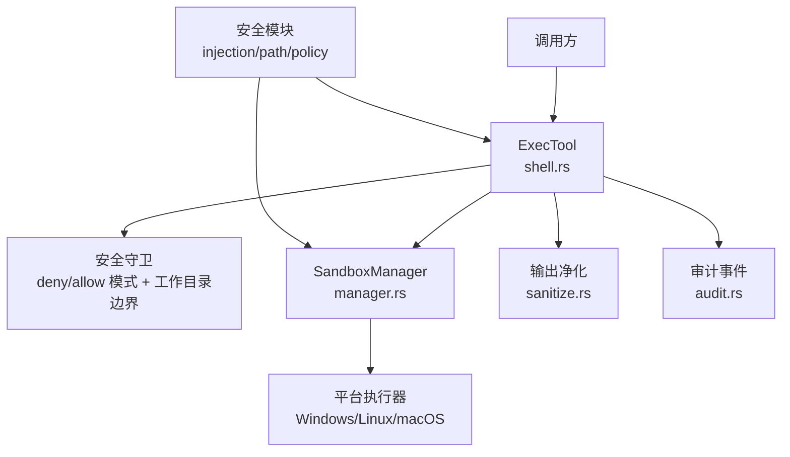
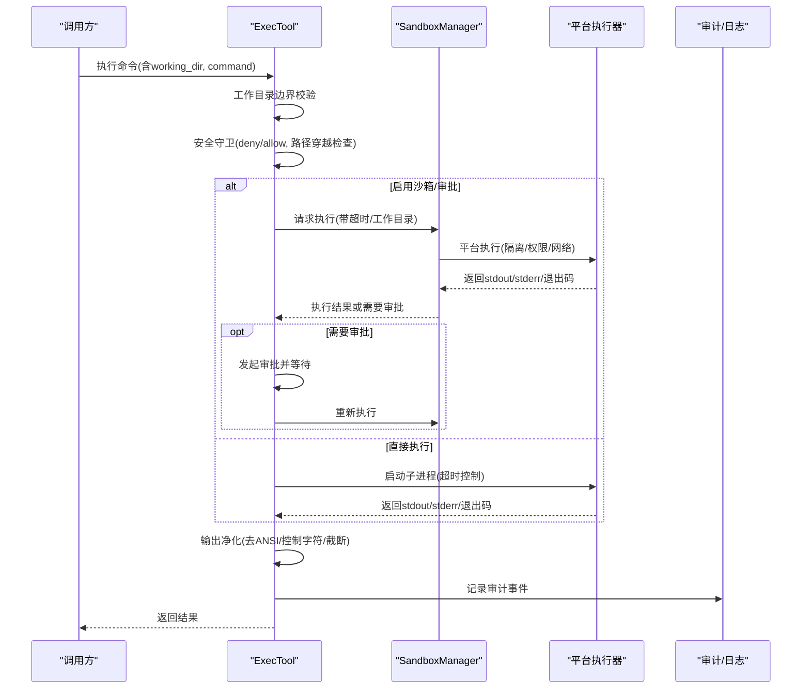
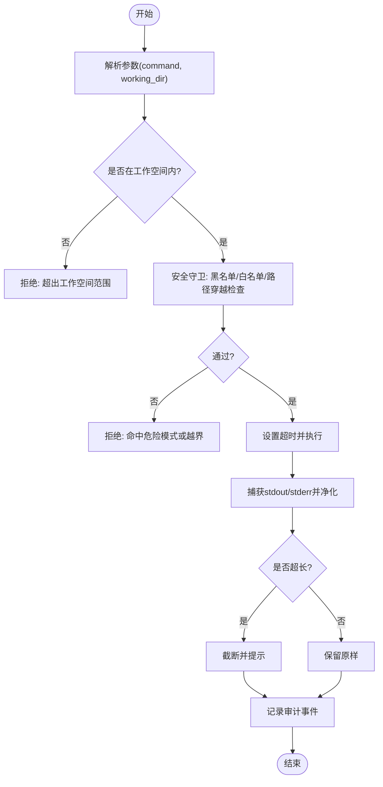
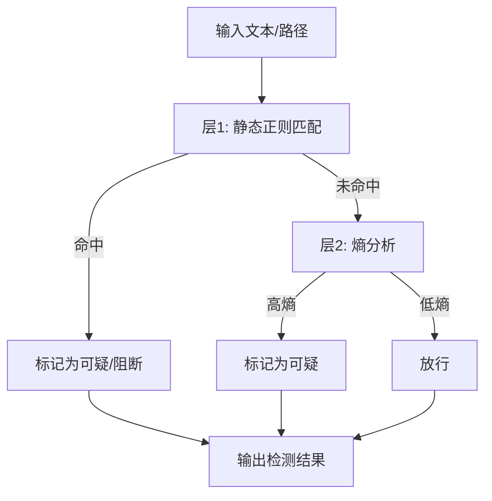
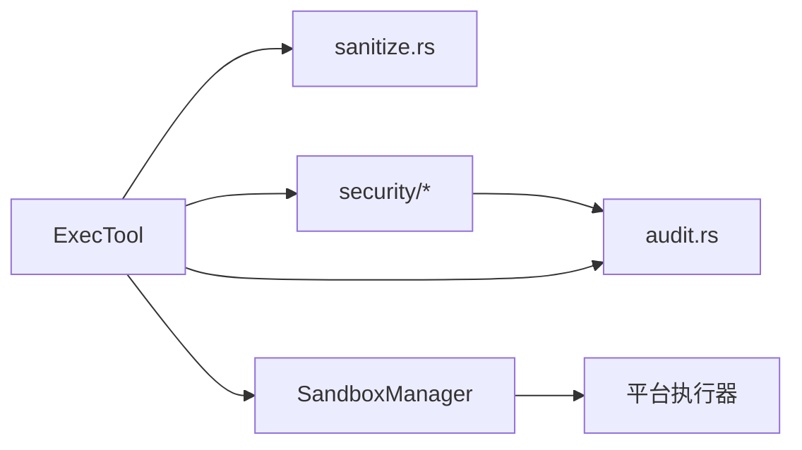

# Shell命令执行工具示例

<cite>
**本文引用的文件**
- [agent-diva-sandbox/src/lib.rs](file://agent-diva-sandbox/src/lib.rs)
- [agent-diva-sandbox/src/manager.rs](file://agent-diva-sandbox/src/manager.rs)
- [agent-diva-tools/src/shell.rs](file://agent-diva-tools/src/shell.rs)
- [agent-diva-core/src/security/mod.rs](file://agent-diva-core/src/security/mod.rs)
- [agent-diva-core/src/security/injection.rs](file://agent-diva-core/src/security/injection.rs)
- [agent-diva-core/src/security/path.rs](file://agent-diva-core/src/security/path.rs)
- [agent-diva-core/src/security/policy.rs](file://agent-diva-core/src/security/policy.rs)
- [agent-diva-core/src/audit.rs](file://agent-diva-core/src/audit.rs)
- [agent-diva-manager/src/handlers/logs.rs](file://agent-diva-manager/src/handlers/logs.rs)
- [agent-diva-manager/src/handlers/audit.rs](file://agent-diva-manager/src/handlers/audit.rs)
- [agent-diva-tools/src/sanitize.rs](file://agent-diva-tools/src/sanitize.rs)
</cite>

## 目录
1. [简介](#简介)
2. [项目结构](#项目结构)
3. [核心组件](#核心组件)
4. [架构总览](#架构总览)
5. [详细组件分析](#详细组件分析)
6. [依赖关系分析](#依赖关系分析)
7. [性能与限制](#性能与限制)
8. [故障排查指南](#故障排查指南)
9. [结论](#结论)
10. [附录：安全最佳实践清单](#附录：安全最佳实践清单)

## 简介
本示例基于仓库中已有的沙箱、工具与安全模块，构建一个“安全的Shell命令执行环境”。重点覆盖：
- 命令白名单与危险模式拦截
- 参数与工作目录校验，防止路径穿越与越权访问
- 标准输出与错误输出捕获、编码处理与结果净化
- 进程生命周期管理、超时控制与资源清理
- 沙箱隔离（平台抽象）、审批策略与审计日志
- 防注入与路径遍历检测
- 错误恢复与可观测性

该文档既适合快速上手，也提供深入代码级参考。

## 项目结构
围绕“命令执行”的关键位置如下：
- 沙箱管理器：负责策略、审批、平台执行编排
- 执行工具：对外暴露 exec 工具，封装命令执行、安全守卫、工作目录约束、超时与输出净化
- 安全模块：注入检测、路径校验、策略配置
- 审计与日志：结构化事件记录、查询接口

图表来源
- [agent-diva-tools/src/shell.rs:300-403](file://agent-diva-tools/src/shell.rs#L300-L403)
- [agent-diva-sandbox/src/manager.rs:126-200](file://agent-diva-sandbox/src/manager.rs#L126-L200)
- [agent-diva-core/src/security/injection.rs:1-120](file://agent-diva-core/src/security/injection.rs#L1-L120)
- [agent-diva-core/src/security/path.rs:1-42](file://agent-diva-core/src/security/path.rs#L1-L42)
- [agent-diva-core/src/security/policy.rs:334-363](file://agent-diva-core/src/security/policy.rs#L334-L363)
- [agent-diva-tools/src/sanitize.rs:49-62](file://agent-diva-tools/src/sanitize.rs#L49-L62)

章节来源
- [agent-diva-tools/src/shell.rs:300-403](file://agent-diva-tools/src/shell.rs#L300-L403)
- [agent-diva-sandbox/src/manager.rs:126-200](file://agent-diva-sandbox/src/manager.rs#L126-L200)
- [agent-diva-core/src/security/mod.rs:1-69](file://agent-diva-core/src/security/mod.rs#L1-L69)

## 核心组件
- ExecTool（exec 工具）
  - 负责解析参数、工作目录约束、安全守卫、超时控制、输出净化、可选的审批流程与沙箱编排。
- SandboxManager（沙箱管理器）
  - 统一入口，协调策略、审批、平台执行；支持禁用开关、模式、网络访问、保护路径、拒绝模式等。
- 安全模块
  - 注入检测（静态正则+熵分析）、路径校验（空字节、穿越、URL编码穿越、波浪号展开、绝对路径、禁止前缀）、策略配置。
- 审计与日志
  - 结构化审计事件、日志查询接口、审计行过滤。

章节来源
- [agent-diva-tools/src/shell.rs:55-149](file://agent-diva-tools/src/shell.rs#L55-L149)
- [agent-diva-sandbox/src/manager.rs:89-147](file://agent-diva-sandbox/src/manager.rs#L89-L147)
- [agent-diva-core/src/security/injection.rs:1-120](file://agent-diva-core/src/security/injection.rs#L1-L120)
- [agent-diva-core/src/security/path.rs:1-42](file://agent-diva-core/src/security/path.rs#L1-L42)
- [agent-diva-core/src/audit.rs:224-253](file://agent-diva-core/src/audit.rs#L224-L253)

## 架构总览
命令执行的端到端流程包括：参数校验 → 安全守卫 → 沙箱编排 → 平台执行 → 输出净化 → 审计记录。

图表来源
- [agent-diva-tools/src/shell.rs:333-403](file://agent-diva-tools/src/shell.rs#L333-L403)
- [agent-diva-tools/src/shell.rs:442-537](file://agent-diva-tools/src/shell.rs#L442-L537)
- [agent-diva-sandbox/src/manager.rs:399-416](file://agent-diva-sandbox/src/manager.rs#L399-L416)
- [agent-diva-core/src/audit.rs:224-253](file://agent-diva-core/src/audit.rs#L224-L253)

## 详细组件分析

### ExecTool：安全的命令执行入口
- 参数与上下文
  - 接收 command 与可选 working_dir；当工具绑定工作空间时，强制工作目录在指定范围内。
- 安全守卫
  - 内置危险模式黑名单（如 rm -rf、del /f、格式化磁盘、dd、关机、fork bomb 等）。
  - 可选白名单模式；若开启，仅允许匹配的模式。
  - 工作目录边界校验：解析真实路径后必须位于工作空间根下，阻止 ../ 穿越与绝对路径逃逸。
- 超时与输出
  - 使用超时机制等待子进程输出；对 stdout/stderr 进行编码解码与净化（去除 ANSI、控制字符），并对过长输出进行截断。
- 审批与沙箱编排
  - 可选择接入审批协调器与守护策略；当需要审批时，暂停执行并等待外部决策，再重试。

图表来源
- [agent-diva-tools/src/shell.rs:170-237](file://agent-diva-tools/src/shell.rs#L170-L237)
- [agent-diva-tools/src/shell.rs:246-298](file://agent-diva-tools/src/shell.rs#L246-L298)
- [agent-diva-tools/src/shell.rs:442-537](file://agent-diva-tools/src/shell.rs#L442-L537)
- [agent-diva-core/src/audit.rs:224-253](file://agent-diva-core/src/audit.rs#L224-L253)

章节来源
- [agent-diva-tools/src/shell.rs:55-149](file://agent-diva-tools/src/shell.rs#L55-L149)
- [agent-diva-tools/src/shell.rs:170-237](file://agent-diva-tools/src/shell.rs#L170-L237)
- [agent-diva-tools/src/shell.rs:246-298](file://agent-diva-tools/src/shell.rs#L246-L298)
- [agent-diva-tools/src/shell.rs:333-403](file://agent-diva-tools/src/shell.rs#L333-L403)
- [agent-diva-tools/src/shell.rs:442-537](file://agent-diva-tools/src/shell.rs#L442-L537)

### SandboxManager：策略、审批与平台执行
- 配置项
  - 模式（危险全开/只读/工作区写入）、Windows 沙箱级别、网络访问、审批策略、可写根目录、受保护路径、拒绝模式、默认超时。
- 执行流程
  - 根据配置决定是否绕过沙箱、是否需要审批、如何调用平台执行器。
- 命令字符串构造
  - 使用 shell 安全转义生成命令串，避免注入。

```mermaid
classDiagram
class SandboxConfig {
+mode
+windows_level
+network_access
+approval_policy
+writable_roots
+protected_paths
+deny_patterns
+timeout_seconds
}
class SandboxCommand {
+program
+args
+cwd
+env
+to_command_string()
}
class SandboxExecRequest {
+command
+cwd
+env
+timeout_secs
+with_timeout()
+with_env()
}
SandboxConfig --> SandboxExecRequest : "用于执行请求"
SandboxCommand --> SandboxExecRequest : "转换为命令串"
```

图表来源
- [agent-diva-sandbox/src/manager.rs:89-147](file://agent-diva-sandbox/src/manager.rs#L89-L147)
- [agent-diva-sandbox/src/manager.rs:30-87](file://agent-diva-sandbox/src/manager.rs#L30-L87)

章节来源
- [agent-diva-sandbox/src/manager.rs:89-147](file://agent-diva-sandbox/src/manager.rs#L89-L147)
- [agent-diva-sandbox/src/manager.rs:30-87](file://agent-diva-sandbox/src/manager.rs#L30-L87)

### 安全模块：注入检测、路径校验与策略
- 注入检测
  - 三层防御：静态正则集、熵分析、模型分类（预留接口）。
  - 分类包括角色覆盖、工具输出注入、越狱尝试。
- 路径校验
  - 多层检查：空字节、../穿越、URL编码穿越、~展开、绝对路径、禁止前缀匹配。
- 策略
  - 不同安全级别（如严格只读）影响读写能力与动作许可。

图表来源
- [agent-diva-core/src/security/injection.rs:1-120](file://agent-diva-core/src/security/injection.rs#L1-L120)
- [agent-diva-core/src/security/path.rs:1-42](file://agent-diva-core/src/security/path.rs#L1-L42)
- [agent-diva-core/src/security/policy.rs:334-363](file://agent-diva-core/src/security/policy.rs#L334-L363)

章节来源
- [agent-diva-core/src/security/injection.rs:1-120](file://agent-diva-core/src/security/injection.rs#L1-L120)
- [agent-diva-core/src/security/path.rs:1-42](file://agent-diva-core/src/security/path.rs#L1-L42)
- [agent-diva-core/src/security/policy.rs:334-363](file://agent-diva-core/src/security/policy.rs#L334-L363)

### 输出净化与编码处理
- 编码处理
  - Windows 上优先 UTF-8，回退到 GB18030，减少替换字符。
- 净化
  - 去除 ANSI 转义与控制字符，保留正常空白与 Unicode。
- 截断
  - 对超长输出进行截断，避免下游 JSON 解析失败。

章节来源
- [agent-diva-tools/src/shell.rs:20-46](file://agent-diva-tools/src/shell.rs#L20-L46)
- [agent-diva-tools/src/shell.rs:492-537](file://agent-diva-tools/src/shell.rs#L492-L537)
- [agent-diva-tools/src/sanitize.rs:49-62](file://agent-diva-tools/src/sanitize.rs#L49-L62)
- [agent-diva-tools/src/sanitize.rs:64-95](file://agent-diva-tools/src/sanitize.rs#L64-L95)

### 审计与日志
- 审计事件
  - 统一的 emit 入口，以 target="audit" 输出结构化 JSON 事件。
- 日志查询
  - 提供 API 查询审计日志，支持时间范围与游标分页。
- 健康检查
  - 基础 liveness 探针，便于服务可用性探测。

章节来源
- [agent-diva-core/src/audit.rs:224-253](file://agent-diva-core/src/audit.rs#L224-L253)
- [agent-diva-manager/src/handlers/logs.rs:63-96](file://agent-diva-manager/src/handlers/logs.rs#L63-L96)
- [agent-diva-manager/src/handlers/logs.rs:115-297](file://agent-diva-manager/src/handlers/logs.rs#L115-L297)
- [agent-diva-manager/src/handlers/audit.rs:110-153](file://agent-diva-manager/src/handlers/audit.rs#L110-L153)

## 依赖关系分析
- ExecTool 依赖
  - 安全守卫与路径校验（本地逻辑）
  - SandboxManager（可选，生产环境推荐启用）
  - 输出净化模块
  - 审计模块
- SandboxManager 依赖
  - 平台执行器（Windows/Linux/macOS）
  - 策略与审批子系统
- 安全模块
  - 注入检测、路径校验、策略配置被上层工具与沙箱复用

图表来源
- [agent-diva-tools/src/shell.rs:300-403](file://agent-diva-tools/src/shell.rs#L300-L403)
- [agent-diva-sandbox/src/manager.rs:126-200](file://agent-diva-sandbox/src/manager.rs#L126-L200)
- [agent-diva-core/src/security/mod.rs:1-69](file://agent-diva-core/src/security/mod.rs#L1-L69)
- [agent-diva-core/src/audit.rs:224-253](file://agent-diva-core/src/audit.rs#L224-L253)

章节来源
- [agent-diva-tools/src/shell.rs:300-403](file://agent-diva-tools/src/shell.rs#L300-L403)
- [agent-diva-sandbox/src/manager.rs:126-200](file://agent-diva-sandbox/src/manager.rs#L126-L200)
- [agent-diva-core/src/security/mod.rs:1-69](file://agent-diva-core/src/security/mod.rs#L1-L69)

## 性能与限制
- 超时控制
  - 工具层设置超时，避免长时间阻塞；超时将终止等待并返回错误。
- 输出大小限制
  - 对输出进行截断，防止超大响应导致内存压力或下游解析失败。
- 编码优化
  - Windows 下优先 UTF-8，回退到 GB18030，降低乱码风险。
- 沙箱模式
  - 可通过配置关闭沙箱（开发调试），但生产建议开启；注意环境变量开关的存在。
- 资源清理
  - 子进程通过 wait_with_output 确保管道释放；超时路径下需确保进程终止（平台侧实现）。

[本节为通用指导，不直接分析具体文件]

## 故障排查指南
- 命令被拒绝
  - 检查是否命中危险模式黑名单或不在白名单；确认工作目录是否在授权范围内。
- 输出为空或乱码
  - 检查编码处理逻辑（Windows 下的 UTF-8/GB18030 选择）；确认终端输出是否包含 ANSI 控制序列。
- 超时错误
  - 调整超时阈值；检查命令是否挂起或无输出。
- 审批流程卡住
  - 确认审批协调器可用且上下文参数完整；查看待决审批列表并尽快决议。
- 审计日志缺失
  - 确认审计 sink 已注册；检查日志查询接口与时间范围。

章节来源
- [agent-diva-tools/src/shell.rs:170-237](file://agent-diva-tools/src/shell.rs#L170-L237)
- [agent-diva-tools/src/shell.rs:442-537](file://agent-diva-tools/src/shell.rs#L442-L537)
- [agent-diva-core/src/audit.rs:224-253](file://agent-diva-core/src/audit.rs#L224-L253)
- [agent-diva-manager/src/handlers/logs.rs:115-297](file://agent-diva-manager/src/handlers/logs.rs#L115-L297)

## 结论
本示例展示了如何在现有仓库基础上构建一个安全的 Shell 命令执行环境：通过 ExecTool 作为统一入口，结合安全守卫、工作目录边界、超时控制与输出净化，配合 SandboxManager 的策略与平台执行能力，形成完整的命令执行闭环。同时，注入检测、路径校验与审计日志提供了纵深防御与可观测性。生产环境中建议始终启用沙箱与审批策略，并根据业务需求调整超时与输出限制。

[本节为总结，不直接分析具体文件]

## 附录：安全最佳实践清单
- 始终对工作目录进行规范化与边界校验，拒绝穿越与越权访问。
- 使用白名单或严格的黑名单模式，最小化可执行命令集合。
- 对所有用户输入进行注入检测与净化，避免控制字符与 ANSI 污染。
- 设置合理的超时与输出大小限制，防止资源耗尽。
- 在生产环境启用沙箱与审批策略，仅在必要时临时关闭。
- 记录结构化审计事件，便于追踪与回溯。
- 定期更新危险模式与注入规则库，应对新威胁。

[本节为通用指导，不直接分析具体文件]