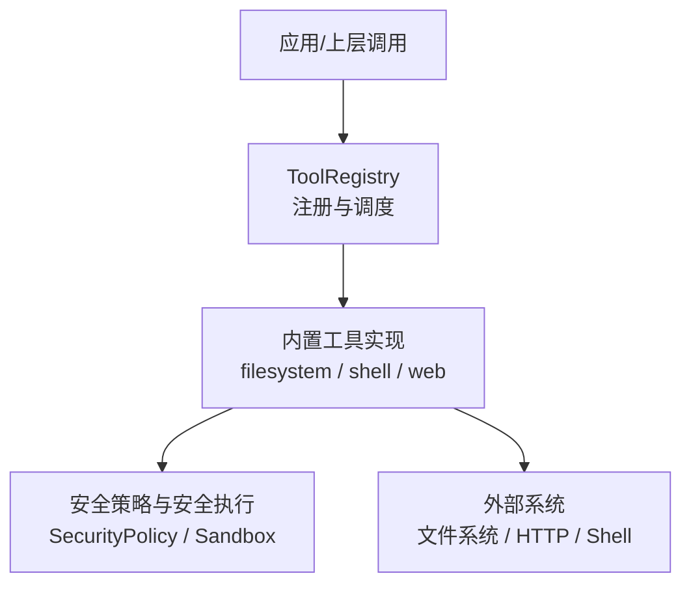
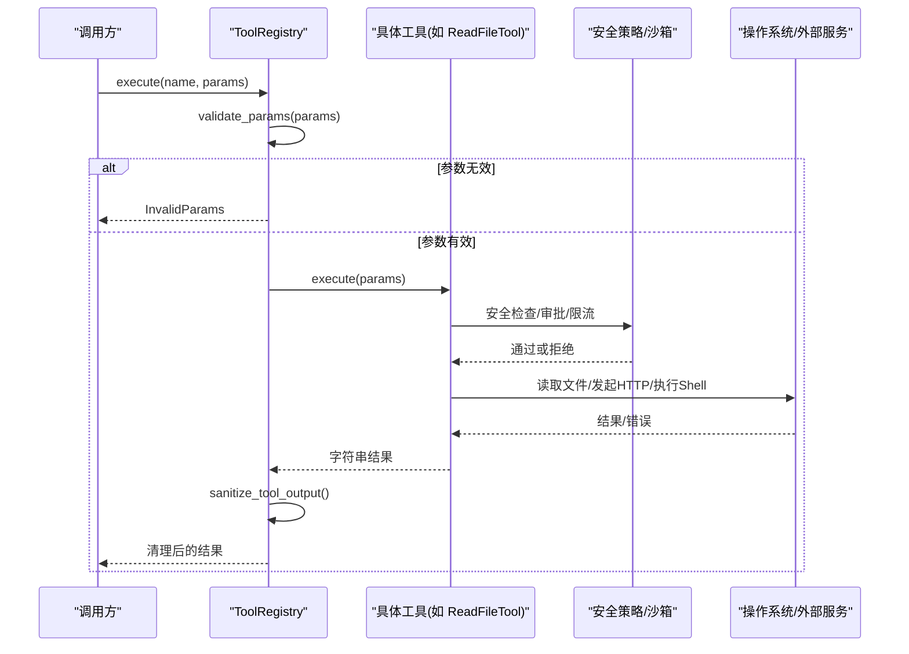
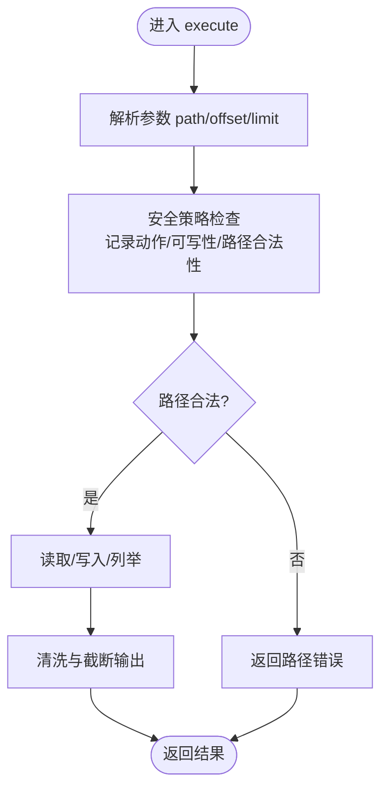
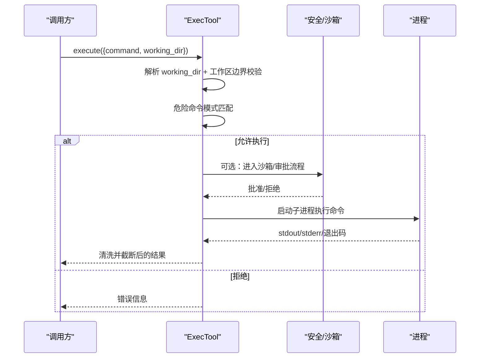
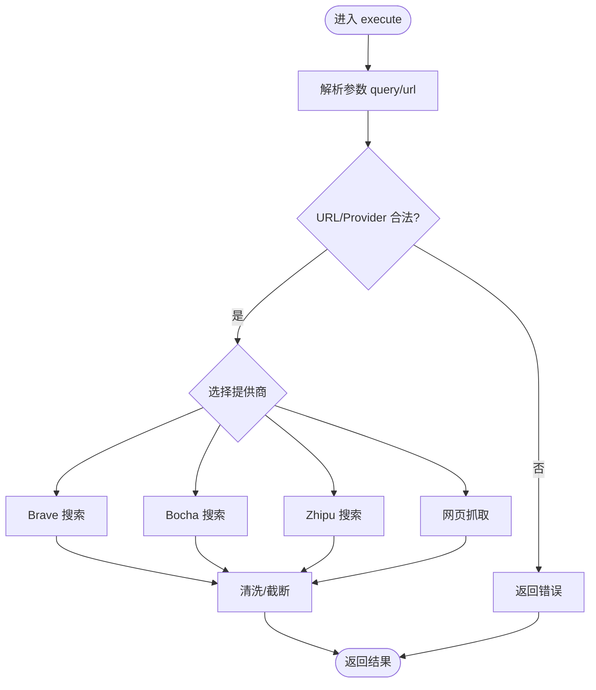
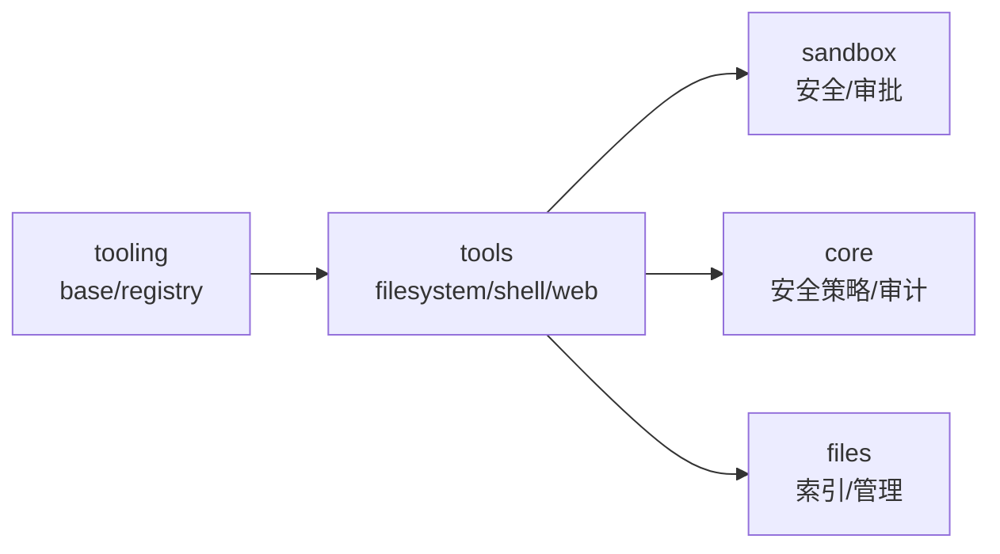

# 工具开发示例

<cite>
**本文引用的文件**
- [agent-diva-tooling/src/base.rs](file://agent-diva-tooling/src/base.rs)
- [agent-diva-tooling/src/registry.rs](file://agent-diva-tooling/src/registry.rs)
- [agent-diva-tools/src/filesystem.rs](file://agent-diva-tools/src/filesystem.rs)
- [agent-diva-tools/src/shell.rs](file://agent-diva-tools/src/shell.rs)
- [agent-diva-tools/src/web.rs](file://agent-diva-tools/src/web.rs)
- [agent-diva-tools/src/lib.rs](file://agent-diva-tools/src/lib.rs)
- [agent-diva-tooling/Cargo.toml](file://agent-diva-tooling/Cargo.toml)
- [agent-diva-tools/Cargo.toml](file://agent-diva-tools/Cargo.toml)
- [README.md](file://README.md)
</cite>

## 目录
1. [简介](#简介)
2. [项目结构](#项目结构)
3. [核心组件](#核心组件)
4. [架构总览](#架构总览)
5. [详细组件分析](#详细组件分析)
6. [依赖关系分析](#依赖关系分析)
7. [性能考虑](#性能考虑)
8. [故障排查指南](#故障排查指南)
9. [结论](#结论)
10. [附录：从零到一创建自定义工具的完整教程](#附录从零到一创建自定义工具的完整教程)

## 简介
本教程基于 Agent Diva 仓库中的工具体系，演示如何从零开始创建一个完整的自定义工具。我们将以“文件系统操作工具”“网络请求工具”“Shell命令执行工具”三类典型场景为例，覆盖需求分析、接口设计、代码实现、测试验证与部署打包全流程，并给出常见问题与调试技巧。读者无需深入 Rust 即可理解整体流程；对开发者则提供精确的文件路径与行号引用，便于对照源码实践。

## 项目结构
Agent Diva 采用多 crate 的模块化组织方式，工具相关能力主要分布在以下位置：
- agent-diva-tooling：定义工具抽象（Tool trait）、错误类型、注册表等基础能力
- agent-diva-tools：内置工具实现集合（文件系统、Shell、Web、MCP 等）
- agent-diva-core/sandbox：安全策略、沙箱执行、审批协调等运行时保障
- README：仓库级说明与快速上手

图表来源
- [agent-diva-tooling/src/registry.rs:362-717](file://agent-diva-tooling/src/registry.rs#L362-L717)
- [agent-diva-tools/src/filesystem.rs:14-145](file://agent-diva-tools/src/filesystem.rs#L14-L145)
- [agent-diva-tools/src/shell.rs:54-404](file://agent-diva-tools/src/shell.rs#L54-L404)
- [agent-diva-tools/src/web.rs:54-522](file://agent-diva-tools/src/web.rs#L54-L522)

章节来源
- [README.md:87-108](file://README.md#L87-L108)

## 核心组件
- Tool trait：统一工具接口，包含 name、description、parameters、execute 等，支持可选超时与参数校验
- ToolError：统一的工具错误类型，涵盖参数错误、执行失败、IO 错误、超时等
- ToolRegistry：工具注册、发现、执行、审计与输出清理，支持“核心/延迟”两类 schema 分区与激活机制

章节来源
- [agent-diva-tooling/src/base.rs:6-61](file://agent-diva-tooling/src/base.rs#L6-L61)
- [agent-diva-tooling/src/base.rs:63-123](file://agent-diva-tooling/src/base.rs#L63-L123)
- [agent-diva-tooling/src/registry.rs:362-717](file://agent-diva-tooling/src/registry.rs#L362-L717)

## 架构总览
下图展示了从调用方到具体工具执行的端到端流程，包括参数校验、执行、审计、输出清理与超时控制。

图表来源
- [agent-diva-tooling/src/registry.rs:534-699](file://agent-diva-tooling/src/registry.rs#L534-L699)
- [agent-diva-tools/src/filesystem.rs:69-145](file://agent-diva-tools/src/filesystem.rs#L69-L145)
- [agent-diva-tools/src/shell.rs:333-404](file://agent-diva-tools/src/shell.rs#L333-L404)
- [agent-diva-tools/src/web.rs:486-522](file://agent-diva-tools/src/web.rs#L486-L522)

## 详细组件分析

### 文件系统工具（Read/Write/Edit/List）
- 目标：在工作区范围内安全地读写文件和列举目录
- 关键特性：
  - 路径解析与越界保护（工作区边界）
  - 大小限制与速率限制
  - 大文件分段读取（offset/limit）
  - JSON 输出清洗与截断
- 使用要点：
  - 参数 path 必填，可选 offset/limit
  - 写操作需具备写入权限，且受安全策略约束
  - 编辑操作要求 old_text 唯一匹配

图表来源
- [agent-diva-tools/src/filesystem.rs:69-145](file://agent-diva-tools/src/filesystem.rs#L69-L145)
- [agent-diva-tools/src/filesystem.rs:198-261](file://agent-diva-tools/src/filesystem.rs#L198-L261)
- [agent-diva-tools/src/filesystem.rs:318-386](file://agent-diva-tools/src/filesystem.rs#L318-L386)
- [agent-diva-tools/src/filesystem.rs:435-488](file://agent-diva-tools/src/filesystem.rs#L435-L488)

章节来源
- [agent-diva-tools/src/filesystem.rs:14-145](file://agent-diva-tools/src/filesystem.rs#L14-L145)
- [agent-diva-tools/src/filesystem.rs:147-261](file://agent-diva-tools/src/filesystem.rs#L147-L261)
- [agent-diva-tools/src/filesystem.rs:263-386](file://agent-diva-tools/src/filesystem.rs#L263-L386)
- [agent-diva-tools/src/filesystem.rs:388-528](file://agent-diva-tools/src/filesystem.rs#L388-L528)

### Shell 命令执行工具（Exec）
- 目标：在受限环境中执行 Shell 命令，并返回标准化输出
- 关键特性：
  - 危险命令白/黑名单（如 rm -rf、格式化磁盘等）
  - 工作区边界强制（禁止跳出工作区根）
  - 超时控制与平台编码处理（Windows PowerShell UTF-8 输出）
  - 可选沙箱编排与审批（Guardian/ApprovalCoordinator）
- 使用要点：
  - 参数 command 必填，working_dir 可选
  - 当配置了工作区范围时，任何 working_dir 必须位于该范围内
  - 输出会被清洗并截断，避免异常字符影响下游 JSON

图表来源
- [agent-diva-tools/src/shell.rs:170-238](file://agent-diva-tools/src/shell.rs#L170-L238)
- [agent-diva-tools/src/shell.rs:333-404](file://agent-diva-tools/src/shell.rs#L333-L404)
- [agent-diva-tools/src/shell.rs:442-538](file://agent-diva-tools/src/shell.rs#L442-L538)

章节来源
- [agent-diva-tools/src/shell.rs:54-149](file://agent-diva-tools/src/shell.rs#L54-L149)
- [agent-diva-tools/src/shell.rs:170-238](file://agent-diva-tools/src/shell.rs#L170-L238)
- [agent-diva-tools/src/shell.rs:333-404](file://agent-diva-tools/src/shell.rs#L333-L404)
- [agent-diva-tools/src/shell.rs:442-538](file://agent-diva-tools/src/shell.rs#L442-L538)

### 网络请求工具（WebSearch/WebFetch）
- 目标：提供 Web 搜索与网页内容抓取能力，支持多种搜索引擎
- 关键特性：
  - 多提供商支持（Brave、Bocha、Zhipu），动态 API Key 解析
  - URL 白名单（仅 http/https）
  - HTML → Markdown/文本提取，JSON 美化
  - 结果清洗与长度限制
- 使用要点：
  - 搜索：query 必填，count 有限制，freshness/include/exclude 等按提供商可用
  - 抓取：url 必填，extractMode 可选（markdown/text），maxChars 可选

图表来源
- [agent-diva-tools/src/web.rs:44-52](file://agent-diva-tools/src/web.rs#L44-L52)
- [agent-diva-tools/src/web.rs:117-169](file://agent-diva-tools/src/web.rs#L117-L169)
- [agent-diva-tools/src/web.rs:171-293](file://agent-diva-tools/src/web.rs#L171-L293)
- [agent-diva-tools/src/web.rs:295-401](file://agent-diva-tools/src/web.rs#L295-L401)
- [agent-diva-tools/src/web.rs:695-792](file://agent-diva-tools/src/web.rs#L695-L792)

章节来源
- [agent-diva-tools/src/web.rs:54-115](file://agent-diva-tools/src/web.rs#L54-L115)
- [agent-diva-tools/src/web.rs:486-522](file://agent-diva-tools/src/web.rs#L486-L522)
- [agent-diva-tools/src/web.rs:695-792](file://agent-diva-tools/src/web.rs#L695-L792)

## 依赖关系分析
- agent-diva-tooling 提供最小公共契约（Tool trait、ToolError、ToolRegistry）
- agent-diva-tools 依赖 tooling 并实现具体工具，同时依赖 core/sandbox/files 等模块提供安全与存储能力
- 构建与运行依赖由 Cargo.toml 声明，确保版本一致性与功能开关

图表来源
- [agent-diva-tooling/Cargo.toml:12-24](file://agent-diva-tooling/Cargo.toml#L12-L24)
- [agent-diva-tools/Cargo.toml:12-60](file://agent-diva-tools/Cargo.toml#L12-L60)

章节来源
- [agent-diva-tooling/Cargo.toml:1-24](file://agent-diva-tooling/Cargo.toml#L1-L24)
- [agent-diva-tools/Cargo.toml:1-60](file://agent-diva-tools/Cargo.toml#L1-L60)

## 性能考虑
- 大文件读取：使用偏移与行数限制进行流式读取，避免一次性加载导致内存峰值
- 输出清洗与截断：防止超长响应影响 LLM 上下文与 JSON 解析
- 超时控制：为长耗时工具设置合理超时，避免阻塞
- 并发与资源：HTTP 客户端复用连接，Shell 子进程及时回收

[本节为通用指导，不直接分析具体文件]

## 故障排查指南
- 参数错误：检查 parameters 定义的 required 字段是否齐全，参考 Tool.validate_params 行为
- 执行失败：查看 ToolError 的错误码与消息，定位是 IO、网络还是业务逻辑问题
- 超时：确认工具 timeout_secs 与全局超时设置，必要时拆分任务
- 安全拒绝：检查路径与工作区边界、危险命令模式、沙箱审批状态
- 日志与审计：利用 registry 的审计事件与错误上下文信息进行定位

章节来源
- [agent-diva-tooling/src/base.rs:63-123](file://agent-diva-tooling/src/base.rs#L63-L123)
- [agent-diva-tooling/src/registry.rs:534-699](file://agent-diva-tooling/src/registry.rs#L534-L699)

## 结论
Agent Diva 的工具体系以清晰的抽象（Tool trait）和强大的注册调度（ToolRegistry）为核心，配合安全策略与沙箱机制，提供了可扩展、可审计、可治理的工具生态。通过本文的三个示例（文件系统、Shell、Web），你可以快速掌握从需求到实现的完整流程，并在生产环境中安全、稳定地扩展更多工具。

[本节为总结性内容，不直接分析具体文件]

## 附录：从零到一创建自定义工具的完整教程

### 1. 需求分析与接口设计
- 明确工具的目标与输入输出
- 设计参数 Schema（required/properties/description），保证 LLM 能正确调用
- 确定是否需要安全策略、沙箱、审批、超时等运行时保障

### 2. 项目初始化
- 新增一个 crate（例如 my_tools），依赖 agent-diva-tooling
- 在 Cargo.toml 中声明必要依赖（serde_json、tokio、tracing 等）

章节来源
- [agent-diva-tooling/Cargo.toml:12-24](file://agent-diva-tooling/Cargo.toml#L12-L24)

### 3. 实现 Tool trait
- 实现 name、description、parameters、execute
- 在 execute 中进行参数校验、安全策略检查、外部调用与结果清洗
- 如需超时，实现 timeout_secs 方法

章节来源
- [agent-diva-tooling/src/base.rs:6-61](file://agent-diva-tooling/src/base.rs#L6-L61)

### 4. 注册与调度
- 将工具实例注册到 ToolRegistry
- 可通过 register 或 register_in_partition 指定核心/延迟分区
- 使用 get_definitions 获取 OpenAI 风格函数描述，供上层模型发现

章节来源
- [agent-diva-tooling/src/registry.rs:452-532](file://agent-diva-tooling/src/registry.rs#L452-L532)

### 5. 测试编写
- 单元测试：构造临时工作区与配置，验证正常路径与边界条件
- 集成测试：模拟外部依赖（文件、网络、Shell），验证端到端行为
- 安全测试：路径穿越、危险命令、越界 working_dir、只读模式等

章节来源
- [agent-diva-tools/src/filesystem.rs:530-707](file://agent-diva-tools/src/filesystem.rs#L530-L707)
- [agent-diva-tools/src/shell.rs:561-800](file://agent-diva-tools/src/shell.rs#L561-L800)

### 6. 部署与打包
- 将工具 crate 加入 workspace，编译并安装 CLI/GUI
- 在运行时装配工具集，暴露给 Agent Loop 与渠道
- 发布前运行 just ci 或 cargo test/cargo clippy 确保质量

章节来源
- [README.md:344-371](file://README.md#L344-L371)

### 7. 常见问题的解决方案与调试技巧
- 路径越界：确保工作区边界校验生效，避免相对路径逃逸
- 命令被拦截：调整 deny/allow 模式，或在沙箱审批中放行可信命令
- 网络请求失败：检查 URL 协议、API Key、超时与重定向策略
- 输出异常：启用清洗与截断，避免控制字符与 ANSI 序列污染 JSON
- 审批卡住：检查 CommandApprovalCoordinator 的状态与规则存储

章节来源
- [agent-diva-tools/src/shell.rs:170-238](file://agent-diva-tools/src/shell.rs#L170-L238)
- [agent-diva-tools/src/web.rs:44-52](file://agent-diva-tools/src/web.rs#L44-L52)
- [agent-diva-tooling/src/registry.rs:534-699](file://agent-diva-tooling/src/registry.rs#L534-L699)