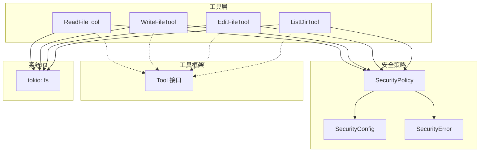
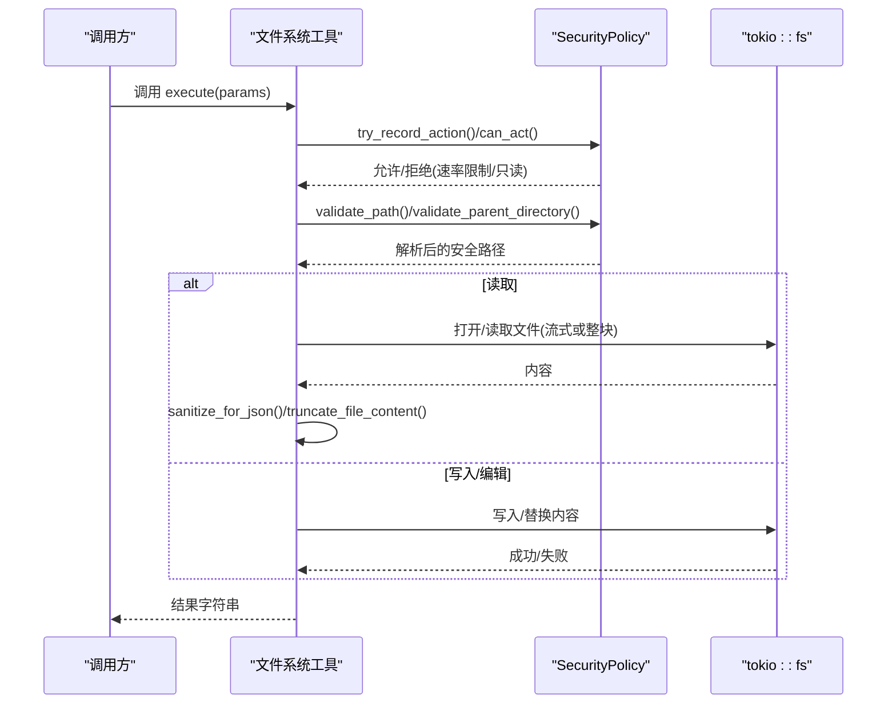
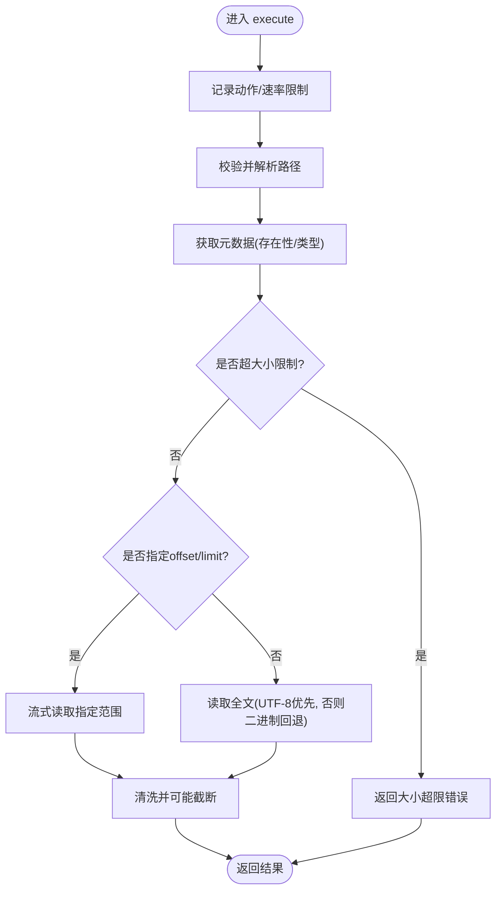
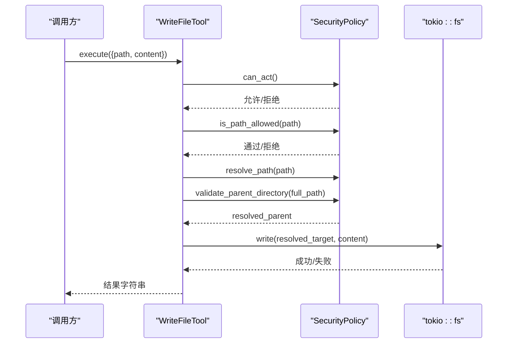
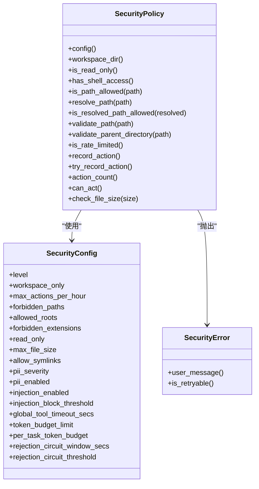
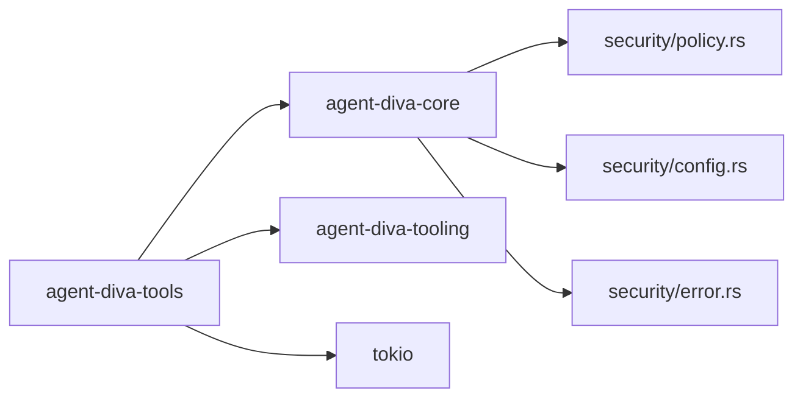

# 文件系统工具示例

<cite>
**本文引用的文件**
- [agent-diva-tools/src/filesystem.rs](file://agent-diva-tools/src/filesystem.rs)
- [agent-diva-tools/src/sanitize.rs](file://agent-diva-tools/src/sanitize.rs)
- [agent-diva-core/src/security/policy.rs](file://agent-diva-core/src/security/policy.rs)
- [agent-diva-core/src/security/config.rs](file://agent-diva-core/src/security/config.rs)
- [agent-diva-core/src/security/error.rs](file://agent-diva-core/src/security/error.rs)
- [agent-diva-tooling/src/base.rs](file://agent-diva-tooling/src/base.rs)
- [agent-diva-tools/src/lib.rs](file://agent-diva-tools/src/lib.rs)
- [agent-diva-tools/Cargo.toml](file://agent-diva-tools/Cargo.toml)
</cite>

## 目录
1. [简介](#简介)
2. [项目结构](#项目结构)
3. [核心组件](#核心组件)
4. [架构总览](#架构总览)
5. [详细组件分析](#详细组件分析)
6. [依赖关系分析](#依赖关系分析)
7. [性能考量](#性能考量)
8. [故障排查指南](#故障排查指南)
9. [结论](#结论)
10. [附录](#附录)

## 简介
本示例基于仓库中的 agent-diva-tools 与 agent-diva-core，演示如何实现一组安全的文件系统工具：ReadFileTool、WriteFileTool、EditFileTool、ListDirTool。这些工具统一集成安全策略（路径校验、速率限制、工作区隔离、符号链接检测等），并提供大文件读取、目录遍历、错误处理与输出清洗等能力。文档同时给出单元测试示例与常见使用场景说明。

## 项目结构
- 工具实现位于 agent-diva-tools/src/filesystem.rs，包含四个工具的实现与安全调用流程。
- 安全策略由 agent-diva-core/src/security 提供，包括配置、策略执行、错误类型等。
- 工具基础接口定义在 agent-diva-tooling/src/base.rs。
- 工具模块通过 agent-diva-tools/src/lib.rs 暴露给上层。
- 依赖声明在 agent-diva-tools/Cargo.toml。

图表来源
- [agent-diva-tools/src/filesystem.rs:14-488](file://agent-diva-tools/src/filesystem.rs#L14-L488)
- [agent-diva-core/src/security/policy.rs:14-287](file://agent-diva-core/src/security/policy.rs#L14-L287)
- [agent-diva-core/src/security/config.rs:51-177](file://agent-diva-core/src/security/config.rs#L51-L177)
- [agent-diva-core/src/security/error.rs:8-61](file://agent-diva-core/src/security/error.rs#L8-L61)
- [agent-diva-tooling/src/base.rs:6-61](file://agent-diva-tooling/src/base.rs#L6-L61)

章节来源
- [agent-diva-tools/src/filesystem.rs:14-488](file://agent-diva-tools/src/filesystem.rs#L14-L488)
- [agent-diva-core/src/security/policy.rs:14-287](file://agent-diva-core/src/security/policy.rs#L14-L287)
- [agent-diva-core/src/security/config.rs:51-177](file://agent-diva-core/src/security/config.rs#L51-L177)
- [agent-diva-core/src/security/error.rs:8-61](file://agent-diva-core/src/security/error.rs#L8-L61)
- [agent-diva-tooling/src/base.rs:6-61](file://agent-diva-tooling/src/base.rs#L6-L61)

## 核心组件
- ReadFileTool：读取文件内容，支持偏移量与行数限制，自动进行安全校验、大小检查、流式读取与大内容截断。
- WriteFileTool：写入文件内容，自动创建父目录，严格校验目标路径与符号链接，遵循只读模式与速率限制。
- EditFileTool：精确替换文件中指定文本，先校验存在性与唯一性，再写回。
- ListDirTool：列出目录内容，按名称排序并标注类型图标。
- SecurityPolicy：统一的安全策略，负责路径校验、工作区隔离、速率限制、文件大小限制、符号链接控制等。
- Sanitize：输出清洗与截断，确保返回内容可安全序列化并避免过大响应。

章节来源
- [agent-diva-tools/src/filesystem.rs:14-488](file://agent-diva-tools/src/filesystem.rs#L14-L488)
- [agent-diva-core/src/security/policy.rs:14-287](file://agent-diva-core/src/security/policy.rs#L14-L287)
- [agent-diva-tools/src/sanitize.rs:12-95](file://agent-diva-tools/src/sanitize.rs#L12-L95)

## 架构总览
下图展示了从工具调用到安全策略再到系统 IO 的完整流程，以及关键的安全检查点。

图表来源
- [agent-diva-tools/src/filesystem.rs:69-144](file://agent-diva-tools/src/filesystem.rs#L69-L144)
- [agent-diva-tools/src/filesystem.rs:198-260](file://agent-diva-tools/src/filesystem.rs#L198-L260)
- [agent-diva-tools/src/filesystem.rs:318-385](file://agent-diva-tools/src/filesystem.rs#L318-L385)
- [agent-diva-core/src/security/policy.rs:172-233](file://agent-diva-core/src/security/policy.rs#L172-L233)

## 详细组件分析

### ReadFileTool 分析
- 参数定义
  - path：必填，相对工作区的文件路径。
  - offset：可选，起始行号（从1开始）。
  - limit：可选，最大读取行数。
- 执行逻辑
  - 记录动作并检查速率限制。
  - 校验并解析路径，确认在工作区内且非符号链接（若禁止）。
  - 检查文件存在性与类型，校验文件大小。
  - 当指定了 offset/limit 时，采用流式逐行读取，避免一次性加载大文件。
  - 未指定时直接读取全文；若非 UTF-8，尝试二进制回退并以 lossy 转换。
  - 对内容进行 JSON 安全清洗，超过阈值则截断并提示预览长度。
- 安全检查机制
  - 速率限制：try_record_action。
  - 路径安全：validate_path（含空字节、穿越、URL编码穿越、波浪号展开、绝对路径与工作区限制、禁止前缀/扩展名）。
  - 文件大小：check_file_size。
  - 符号链接：根据配置决定是否拒绝。
- 大文件处理
  - 使用异步缓冲读取器逐行扫描，仅收集所需范围，并在末尾附加“共N行”的摘要信息。

图表来源
- [agent-diva-tools/src/filesystem.rs:69-144](file://agent-diva-tools/src/filesystem.rs#L69-L144)
- [agent-diva-tools/src/filesystem.rs:490-528](file://agent-diva-tools/src/filesystem.rs#L490-L528)
- [agent-diva-core/src/security/policy.rs:172-200](file://agent-diva-core/src/security/policy.rs#L172-L200)
- [agent-diva-core/src/security/config.rs:76-80](file://agent-diva-core/src/security/config.rs#L76-L80)

章节来源
- [agent-diva-tools/src/filesystem.rs:14-144](file://agent-diva-tools/src/filesystem.rs#L14-L144)
- [agent-diva-tools/src/filesystem.rs:490-528](file://agent-diva-tools/src/filesystem.rs#L490-L528)
- [agent-diva-core/src/security/policy.rs:172-200](file://agent-diva-core/src/security/policy.rs#L172-L200)
- [agent-diva-core/src/security/config.rs:76-80](file://agent-diva-core/src/security/config.rs#L76-L80)

### WriteFileTool 分析
- 参数定义
  - path：必填，目标文件路径。
  - content：必填，要写入的内容。
- 执行逻辑
  - 检查是否允许操作（只读模式拦截）与速率限制。
  - 基本路径校验后解析为全路径。
  - 验证父目录（必要时创建），并对最终目标进行符号链接检测（若禁止）。
  - 写入文件并返回成功消息。
- 安全检查机制
  - can_act：只读模式与速率限制。
  - is_path_allowed + resolve_path + validate_parent_directory：防止越权与 TOCTOU 风险。
  - 符号链接检测：symlink_metadata 判断是否为符号链接。

图表来源
- [agent-diva-tools/src/filesystem.rs:198-260](file://agent-diva-tools/src/filesystem.rs#L198-L260)
- [agent-diva-core/src/security/policy.rs:203-233](file://agent-diva-core/src/security/policy.rs#L203-L233)

章节来源
- [agent-diva-tools/src/filesystem.rs:147-260](file://agent-diva-tools/src/filesystem.rs#L147-L260)
- [agent-diva-core/src/security/policy.rs:203-233](file://agent-diva-core/src/security/policy.rs#L203-L233)

### EditFileTool 分析
- 参数定义
  - path：必填，目标文件路径。
  - old_text：必填，需完全匹配的旧文本。
  - new_text：必填，新文本。
- 执行逻辑
  - 检查操作权限与速率限制。
  - 校验并解析路径，确认文件存在且为普通文件。
  - 读取文件内容，验证 old_text 是否存在且唯一（出现次数>1 会警告）。
  - 执行一次替换并写回。
- 安全检查机制
  - can_act：只读模式与速率限制。
  - validate_path：路径安全与工作区限制。

章节来源
- [agent-diva-tools/src/filesystem.rs:263-385](file://agent-diva-tools/src/filesystem.rs#L263-L385)
- [agent-diva-core/src/security/policy.rs:172-200](file://agent-diva-core/src/security/policy.rs#L172-L200)

### ListDirTool 分析
- 参数定义
  - path：必填，要列出的目录路径。
- 执行逻辑
  - 记录动作并检查速率限制。
  - 校验并解析路径，确认目录存在。
  - 遍历条目，标记目录/文件图标，排序后拼接输出。
- 安全检查机制
  - try_record_action：速率限制。
  - validate_path：路径安全与工作区限制。

章节来源
- [agent-diva-tools/src/filesystem.rs:388-488](file://agent-diva-tools/src/filesystem.rs#L388-L488)
- [agent-diva-core/src/security/policy.rs:172-200](file://agent-diva-core/src/security/policy.rs#L172-L200)

### 安全策略与配置
- SecurityPolicy
  - 提供路径校验、解析、工作区限制、符号链接检查、速率限制、文件大小限制等方法。
  - 支持 from_level 快速构建不同安全级别策略。
- SecurityConfig
  - 定义安全级别、工作区限制、速率上限、禁止路径/扩展名、最大文件大小、符号链接开关、PII/注入检测开关、全局超时等。
  - 支持从工作区或用户目录配置文件合并覆盖。
- SecurityError
  - 统一的错误类型与用户友好消息，支持重试判定。

图表来源
- [agent-diva-core/src/security/policy.rs:14-287](file://agent-diva-core/src/security/policy.rs#L14-L287)
- [agent-diva-core/src/security/config.rs:51-177](file://agent-diva-core/src/security/config.rs#L51-L177)
- [agent-diva-core/src/security/error.rs:8-61](file://agent-diva-core/src/security/error.rs#L8-L61)

章节来源
- [agent-diva-core/src/security/policy.rs:14-287](file://agent-diva-core/src/security/policy.rs#L14-L287)
- [agent-diva-core/src/security/config.rs:51-177](file://agent-diva-core/src/security/config.rs#L51-L177)
- [agent-diva-core/src/security/error.rs:8-61](file://agent-diva-core/src/security/error.rs#L8-L61)

### 工具基础接口
- Tool trait
  - name/description/parameters：描述工具及其参数 Schema。
  - execute：异步执行入口。
  - timeout_secs：可选超时覆盖。
  - validate_params/to_schema：参数校验与 OpenAI 函数 Schema 转换。

章节来源
- [agent-diva-tooling/src/base.rs:6-61](file://agent-diva-tooling/src/base.rs#L6-L61)

## 依赖关系分析
- agent-diva-tools 依赖 agent-diva-core（安全策略）、agent-diva-tooling（工具接口）、tokio（异步 IO）等。
- 工具模块通过 lib.rs 暴露 ReadFileTool、WriteFileTool、EditFileTool、ListDirTool。
- 安全策略内部组合 PathValidator、ActionTracker、配置加载器等。

图表来源
- [agent-diva-tools/Cargo.toml:12-54](file://agent-diva-tools/Cargo.toml#L12-L54)
- [agent-diva-tools/src/lib.rs:5-33](file://agent-diva-tools/src/lib.rs#L5-L33)

章节来源
- [agent-diva-tools/Cargo.toml:12-54](file://agent-diva-tools/Cargo.toml#L12-L54)
- [agent-diva-tools/src/lib.rs:5-33](file://agent-diva-tools/src/lib.rs#L5-L33)

## 性能考量
- 大文件读取
  - 使用异步缓冲读取器逐行扫描，仅在需要时累积结果，避免内存峰值。
  - 通过 offset/limit 精准截取，减少不必要的数据传输。
- 输出清洗与截断
  - 去除 ANSI 控制序列与控制字符，保证 JSON 安全。
  - 超过阈值时截断并附带预览提示，降低 LLM 请求体积。
- 速率限制
  - 通过 ActionTracker 维护滑动窗口计数，防止滥用。
- 只读模式与大小限制
  - 在写入路径提前拦截，避免无效 I/O。
  - 文件大小限制在读取前检查，避免加载超大文件。

[本节为通用指导，不直接分析具体文件]

## 故障排查指南
- 路径被拒绝
  - 检查是否包含穿越组件、URL编码穿越、绝对路径与工作区限制冲突、禁止前缀/扩展名。
  - 参考路径校验流程与错误消息。
- 速率限制触发
  - 查看最近一小时的操作计数，适当降低频率或调整 max_actions_per_hour。
- 只读模式阻止写入
  - 确认当前安全级别或 read_only 配置，必要时切换为非只读。
- 符号链接被拒
  - 若配置禁止符号链接，请移除或绕过符号链接目标。
- 文件过大
  - 使用 offset/limit 分段读取，或调整 max_file_size。

章节来源
- [agent-diva-core/src/security/error.rs:8-61](file://agent-diva-core/src/security/error.rs#L8-L61)
- [agent-diva-core/src/security/policy.rs:74-200](file://agent-diva-core/src/security/policy.rs#L74-L200)
- [agent-diva-core/src/security/config.rs:51-177](file://agent-diva-core/src/security/config.rs#L51-L177)

## 结论
本示例展示了如何在统一安全策略下实现稳健的文件系统工具集。通过路径校验、速率限制、工作区隔离、符号链接检测、大小限制与输出清洗，确保了工具在多种场景下的安全性与可用性。配合流式读取与截断策略，能够高效处理大文件与目录遍历任务。测试覆盖了基本功能、路径穿越防护、速率限制与只读模式等关键用例。

[本节为总结，不直接分析具体文件]

## 附录

### 单元测试示例与常见使用场景
- 单元测试
  - 读取文件与偏移/限制读取：验证内容片段与行号摘要。
  - 写入文件：验证写入内容与成功消息。
  - 编辑文件：验证精确替换与唯一性警告。
  - 列出目录：验证条目类型图标与排序。
  - 路径穿越防护：拒绝工作区外访问。
  - 速率限制：在限定次数后拒绝后续操作。
  - 只读模式：阻止写入操作。
- 常见使用场景
  - 代码审查：读取源文件片段，定位问题行。
  - 批量更新：通过 edit_file 进行小范围替换。
  - 日志分析：使用 offset/limit 分页查看大日志。
  - 目录巡检：列出目录结构，辅助导航与审计。

章节来源
- [agent-diva-tools/src/filesystem.rs:530-707](file://agent-diva-tools/src/filesystem.rs#L530-L707)

### 输出清洗与截断
- 清洗：去除 ANSI 序列与控制字符，保留空白与 Unicode。
- 截断：超过阈值时输出预览与统计信息，避免过大响应。

章节来源
- [agent-diva-tools/src/sanitize.rs:12-95](file://agent-diva-tools/src/sanitize.rs#L12-L95)