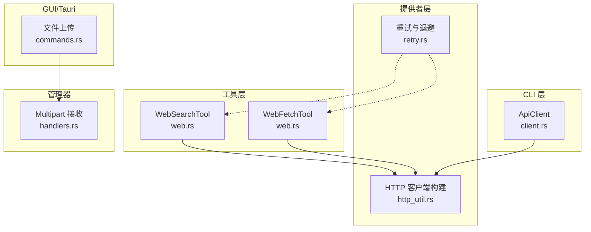
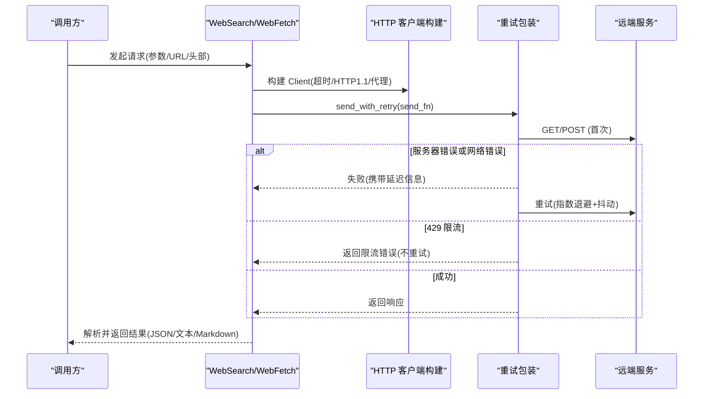
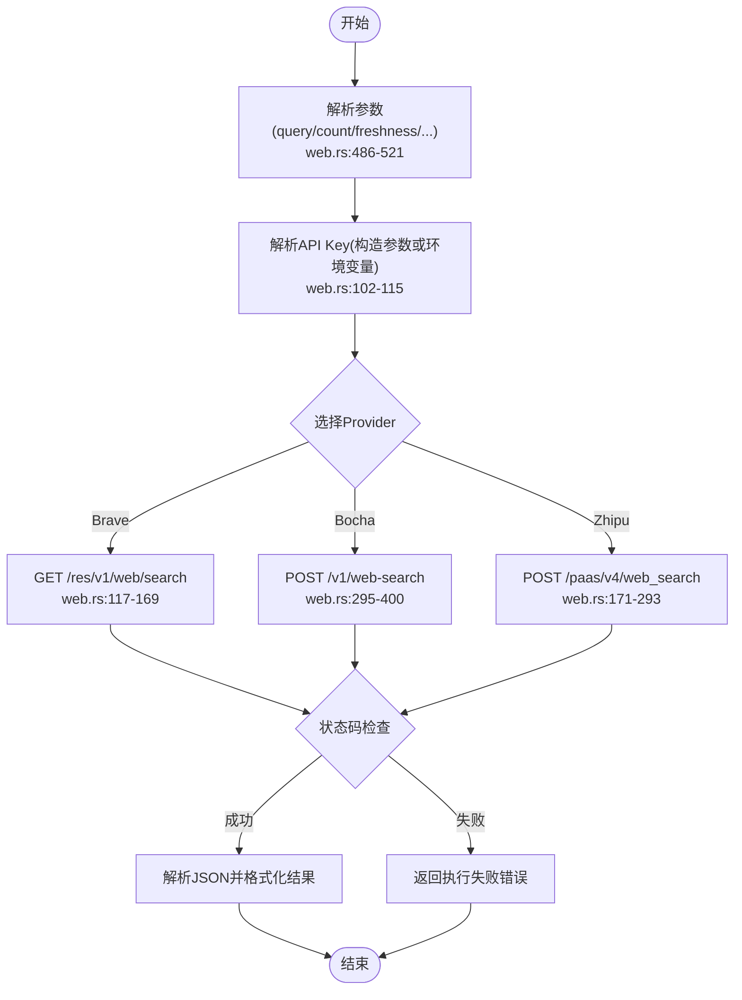
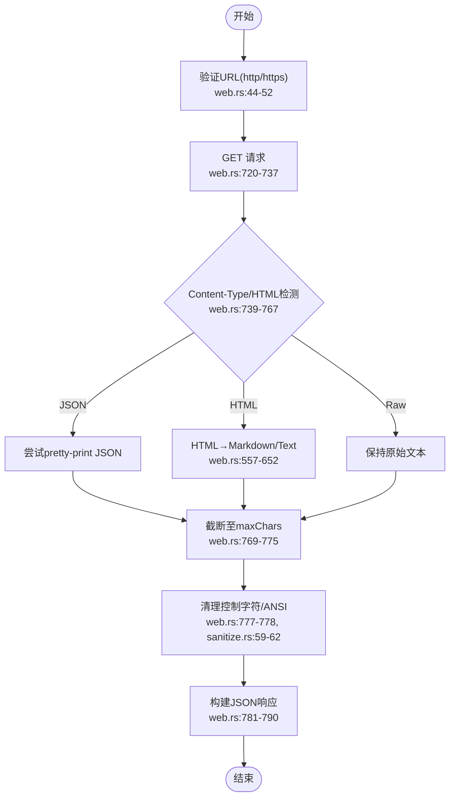
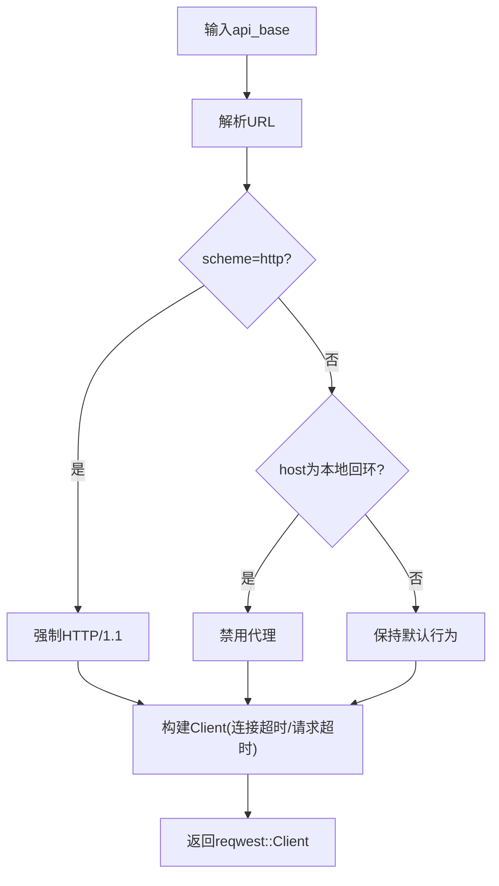
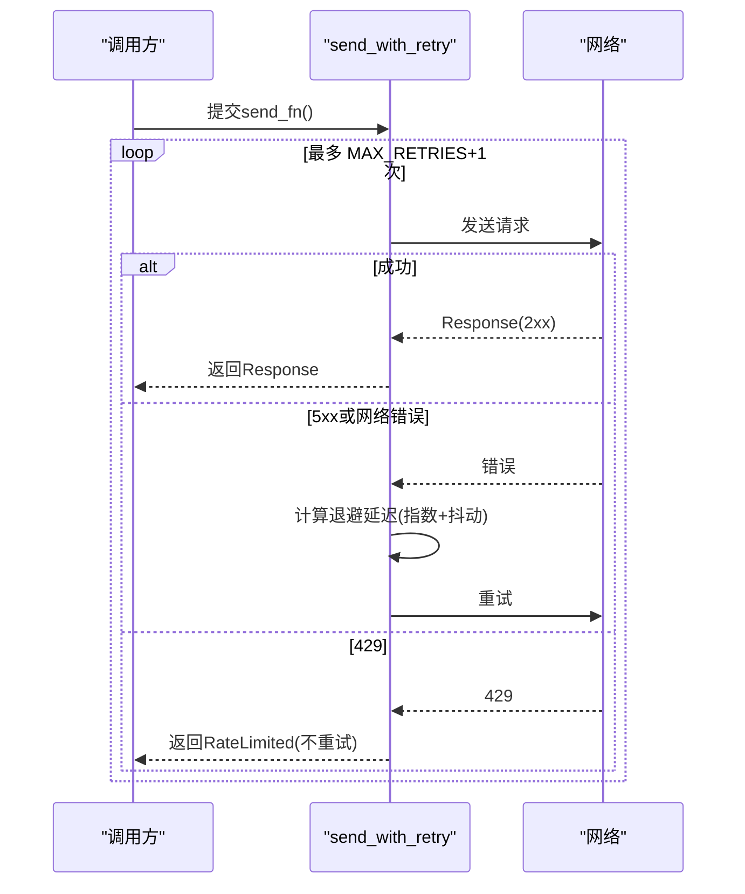
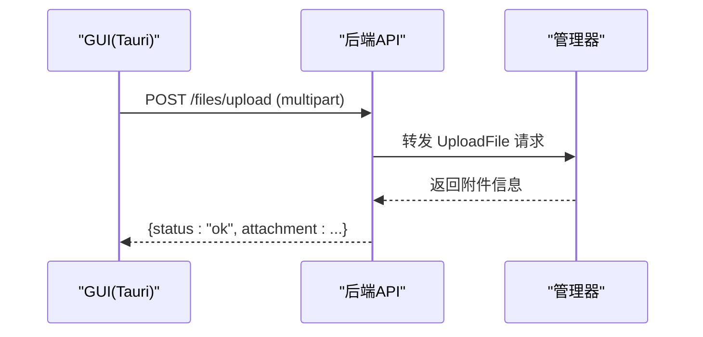
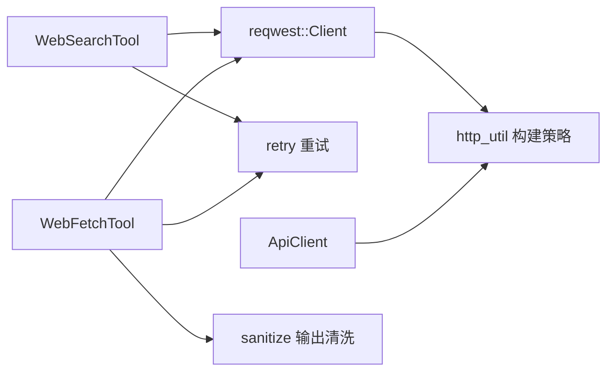

# 网络请求工具示例

<cite>
**本文引用的文件**
- [web.rs](file://agent-diva-tools/src/web.rs)
- [http_util.rs](file://agent-diva-providers/src/http_util.rs)
- [retry.rs](file://agent-diva-providers/src/retry.rs)
- [client.rs](file://agent-diva-cli/src/client.rs)
- [base.rs](file://agent-diva-tooling/src/base.rs)
- [sanitize.rs](file://agent-diva-tools/src/sanitize.rs)
- [commands.rs](file://agent-diva-gui/src-tauri/src/commands.rs)
- [handlers.rs](file://agent-diva-manager/src/handlers.rs)
</cite>

## 目录
1. [简介](#简介)
2. [项目结构](#项目结构)
3. [核心组件](#核心组件)
4. [架构总览](#架构总览)
5. [详细组件分析](#详细组件分析)
6. [依赖关系分析](#依赖关系分析)
7. [性能与连接池](#性能与连接池)
8. [故障排查指南](#故障排查指南)
9. [结论](#结论)
10. [附录：使用示例与最佳实践](#附录使用示例与最佳实践)

## 简介
本示例基于仓库中已有的网络请求实现，系统化地演示如何构建一个健壮的 HTTP 请求工具。内容覆盖 GET/POST、JSON/表单/文件上传、请求头配置、超时与重试、代理控制、错误处理与安全策略（如本地回环禁用代理、HTTP/1.1 强制等）。通过真实代码路径与流程图，帮助读者快速掌握在 Rust 中使用 reqwest 的最佳实践。

## 项目结构
围绕网络请求的相关模块分布在多个 crate 中：
- 工具层：提供 Web 搜索与网页抓取能力，封装了 JSON 请求、HTML 解析与输出清洗。
- 提供者层：提供统一的 HTTP Client 构建策略（超时、HTTP/1.1 强制、代理开关）与指数退避重试机制。
- CLI 层：面向本地网关的 API 客户端，针对 loopback URL 自动禁用系统代理。
- GUI/Tauri 层：演示 multipart/form-data 文件上传。
- 管理层：服务端接收 multipart 并转发到内部任务。

图表来源
- [web.rs:54-88](file://agent-diva-tools/src/web.rs#L54-L88)
- [http_util.rs:25-56](file://agent-diva-providers/src/http_util.rs#L25-L56)
- [retry.rs:86-181](file://agent-diva-providers/src/retry.rs#L86-L181)
- [client.rs:43-54](file://agent-diva-cli/src/client.rs#L43-L54)
- [commands.rs:4153-4188](file://agent-diva-gui/src-tauri/src/commands.rs#L4153-L4188)
- [handlers.rs:919-991](file://agent-diva-manager/src/handlers.rs#L919-L991)

章节来源
- [web.rs:54-88](file://agent-diva-tools/src/web.rs#L54-L88)
- [http_util.rs:25-56](file://agent-diva-providers/src/http_util.rs#L25-L56)
- [retry.rs:86-181](file://agent-diva-providers/src/retry.rs#L86-L181)
- [client.rs:43-54](file://agent-diva-cli/src/client.rs#L43-L54)
- [commands.rs:4153-4188](file://agent-diva-gui/src-tauri/src/commands.rs#L4153-L4188)
- [handlers.rs:919-991](file://agent-diva-manager/src/handlers.rs#L919-L991)

## 核心组件
- WebSearchTool：支持 Brave、Bocha、Zhipu 等多搜索引擎的 JSON 请求与结果格式化。
- WebFetchTool：抓取 URL，智能识别 JSON/HTML/原始文本，提取可读内容并返回结构化结果。
- HTTP 客户端构建器：根据 API Base 决定是否需要强制 HTTP/1.1、是否禁用代理。
- 重试机制：对 5xx 和网络错误进行指数退避重试；对 429 直接返回限流错误。
- ApiClient：面向本地网关的 HTTP 客户端，loopback 地址自动禁用代理。
- 文件上传：Tauri 端构造 multipart/form-data，管理器端解析并转发。

章节来源
- [web.rs:54-88](file://agent-diva-tools/src/web.rs#L54-L88)
- [web.rs:524-555](file://agent-diva-tools/src/web.rs#L524-L555)
- [http_util.rs:25-56](file://agent-diva-providers/src/http_util.rs#L25-L56)
- [retry.rs:86-181](file://agent-diva-providers/src/retry.rs#L86-L181)
- [client.rs:43-54](file://agent-diva-cli/src/client.rs#L43-L54)
- [commands.rs:4153-4188](file://agent-diva-gui/src-tauri/src/commands.rs#L4153-L4188)

## 架构总览
下图展示了从调用方到远端服务的完整链路，包括重试、代理控制、响应分类与错误传播。

图表来源
- [retry.rs:86-181](file://agent-diva-providers/src/retry.rs#L86-L181)
- [http_util.rs:25-56](file://agent-diva-providers/src/http_util.rs#L25-L56)
- [web.rs:117-169](file://agent-diva-tools/src/web.rs#L117-L169)
- [web.rs:236-293](file://agent-diva-tools/src/web.rs#L236-L293)
- [web.rs:334-400](file://agent-diva-tools/src/web.rs#L334-L400)

## 详细组件分析

### WebSearchTool：多搜索引擎 JSON 请求
- 功能要点
  - 支持 Brave、Bocha、Zhipu 三种搜索引擎。
  - 统一通过 reqwest::Client 发送 GET/POST 请求，设置必要 Header（如 Authorization、Content-Type）。
  - 对响应状态码进行检查，非成功时读取响应体并转换为错误。
  - 将搜索结果格式化为易读文本。
- 关键流程
  - 参数校验与 API Key 解析（优先构造时传入，其次环境变量）。
  - 按 provider 路由到对应搜索方法。
  - 解析 JSON 并抽取结果字段。

图表来源
- [web.rs:102-115](file://agent-diva-tools/src/web.rs#L102-L115)
- [web.rs:117-169](file://agent-diva-tools/src/web.rs#L117-L169)
- [web.rs:171-293](file://agent-diva-tools/src/web.rs#L171-L293)
- [web.rs:295-400](file://agent-diva-tools/src/web.rs#L295-L400)
- [web.rs:486-521](file://agent-diva-tools/src/web.rs#L486-L521)

章节来源
- [web.rs:54-88](file://agent-diva-tools/src/web.rs#L54-L88)
- [web.rs:117-169](file://agent-diva-tools/src/web.rs#L117-L169)
- [web.rs:171-293](file://agent-diva-tools/src/web.rs#L171-L293)
- [web.rs:295-400](file://agent-diva-tools/src/web.rs#L295-L400)
- [web.rs:486-521](file://agent-diva-tools/src/web.rs#L486-L521)

### WebFetchTool：网页抓取与内容提取
- 功能要点
  - 支持 markdown/text/raw 三种提取模式。
  - 自动识别 JSON/HTML/原始文本，并进行相应处理。
  - 限制最大字符数，避免过大响应。
  - 清理控制字符和 ANSI 序列，确保输出可安全序列化。
- 关键流程
  - 验证 URL（仅允许 http/https）。
  - 发起 GET 请求，获取最终 URL、状态码与响应头。
  - 根据 Content-Type 或 HTML 特征判断类型并提取内容。
  - 截断与清洗后返回结构化 JSON。

图表来源
- [web.rs:44-52](file://agent-diva-tools/src/web.rs#L44-L52)
- [web.rs:557-652](file://agent-diva-tools/src/web.rs#L557-L652)
- [web.rs:720-790](file://agent-diva-tools/src/web.rs#L720-L790)
- [sanitize.rs:59-62](file://agent-diva-tools/src/sanitize.rs#L59-L62)

章节来源
- [web.rs:524-555](file://agent-diva-tools/src/web.rs#L524-L555)
- [web.rs:557-652](file://agent-diva-tools/src/web.rs#L557-L652)
- [web.rs:695-790](file://agent-diva-tools/src/web.rs#L695-L790)
- [sanitize.rs:59-62](file://agent-diva-tools/src/sanitize.rs#L59-L62)

### HTTP 客户端构建与代理控制
- 功能要点
  - 根据 API Base 决定是否强制 HTTP/1.1（本地或 http 协议更稳定）。
  - 对本地回环地址（localhost/127.0.0.1/[::1]/.local）禁用系统代理。
  - 设置连接超时与请求超时。
- 适用场景
  - 本地开发调试（避免系统代理干扰）。
  - 公共 HTTPS 接口（保留 ALPN 协商，不强制 HTTP/1.1）。

图表来源
- [http_util.rs:25-56](file://agent-diva-providers/src/http_util.rs#L25-L56)

章节来源
- [http_util.rs:25-56](file://agent-diva-providers/src/http_util.rs#L25-L56)

### 重试机制：指数退避与限流处理
- 功能要点
  - 对 5xx 和网络错误进行最多 3 次重试，采用指数退避 + 随机抖动。
  - 对 429 立即返回限流错误，不重试。
  - 可选 on_retry 回调，便于上层展示重试进度。
- 典型用法
  - 包装任意 reqwest 请求闭包，统一处理失败与重试。

图表来源
- [retry.rs:86-181](file://agent-diva-providers/src/retry.rs#L86-L181)

章节来源
- [retry.rs:86-181](file://agent-diva-providers/src/retry.rs#L86-L181)

### CLI ApiClient：本地网关通信与代理规避
- 功能要点
  - 当 base_url 为 loopback（127.0.0.1/localhost/[::1]）时，自动禁用系统代理，避免测试或本地服务被代理拦截。
  - 提供分页拉取、决策、取消、聊天事件流等方法。
- 关键点
  - 使用 reqwest::Client 构建时根据 URL 动态启用 no_proxy。

章节来源
- [client.rs:39-54](file://agent-diva-cli/src/client.rs#L39-L54)
- [client.rs:56-150](file://agent-diva-cli/src/client.rs#L56-L150)
- [client.rs:152-291](file://agent-diva-cli/src/client.rs#L152-L291)

### 文件上传：multipart/form-data
- 客户端（Tauri）
  - 构造 Part::bytes 作为文件字段，附加 channel 与 message_id。
  - 使用 reqwest::multipart::Form 组装并 POST 到 /files/upload。
- 服务端（Manager）
  - 解析 multipart，提取 file、channel、message_id。
  - 将上传请求发送到内部任务队列，等待处理结果。

图表来源
- [commands.rs:4153-4188](file://agent-diva-gui/src-tauri/src/commands.rs#L4153-L4188)
- [handlers.rs:919-991](file://agent-diva-manager/src/handlers.rs#L919-L991)

章节来源
- [commands.rs:4153-4188](file://agent-diva-gui/src-tauri/src/commands.rs#L4153-L4188)
- [handlers.rs:919-991](file://agent-diva-manager/src/handlers.rs#L919-L991)

## 依赖关系分析
- WebSearchTool/WebFetchTool 依赖 reqwest::Client，并通过 http_util 的策略构建（超时、HTTP/1.1、代理）。
- 重试逻辑独立于具体业务，通过闭包包装任意 reqwest 请求。
- CLI ApiClient 复用 reqwest 并针对 loopback 禁用代理。
- 输出清洗依赖 sanitize 模块，保证 JSON 安全。

图表来源
- [web.rs:54-88](file://agent-diva-tools/src/web.rs#L54-L88)
- [http_util.rs:25-56](file://agent-diva-providers/src/http_util.rs#L25-L56)
- [retry.rs:86-181](file://agent-diva-providers/src/retry.rs#L86-L181)
- [client.rs:43-54](file://agent-diva-cli/src/client.rs#L43-L54)
- [sanitize.rs:59-62](file://agent-diva-tools/src/sanitize.rs#L59-L62)

章节来源
- [web.rs:54-88](file://agent-diva-tools/src/web.rs#L54-L88)
- [http_util.rs:25-56](file://agent-diva-providers/src/http_util.rs#L25-L56)
- [retry.rs:86-181](file://agent-diva-providers/src/retry.rs#L86-L181)
- [client.rs:43-54](file://agent-diva-cli/src/client.rs#L43-L54)
- [sanitize.rs:59-62](file://agent-diva-tools/src/sanitize.rs#L59-L62)

## 性能与连接池
- 连接池
  - reqwest::Client 默认维护连接池，适合高并发场景。建议复用 Client 实例而非每次新建。
- 超时配置
  - 连接超时与请求超时分别设置，避免资源长期占用。
- 重试策略
  - 指数退避 + 抖动降低“惊群”效应，提高整体稳定性。
- 代理优化
  - 本地回环禁用代理，减少不必要的跳板开销。
- 响应大小控制
  - WebFetchTool 支持 maxChars 截断，防止超大响应影响性能。

[本节为通用指导，无需特定文件引用]

## 故障排查指南
- 常见问题
  - 429 限流：重试逻辑不会重试，需在上层处理退避或降级。
  - 5xx 服务器错误：会触发重试，若持续失败需检查服务端健康与负载。
  - 本地代理问题：确认 loopback URL 已禁用代理。
  - JSON 解析失败：检查 Content-Type 与响应体格式。
  - 输出包含控制字符：使用 sanitize 清洗后再序列化。
- 定位步骤
  - 查看重试日志与回调信息（on_retry），确认重试次数与延迟。
  - 打印最终 URL、状态码与响应头，辅助定位问题。
  - 对大响应启用截断，避免内存压力。

章节来源
- [retry.rs:86-181](file://agent-diva-providers/src/retry.rs#L86-L181)
- [web.rs:720-790](file://agent-diva-tools/src/web.rs#L720-L790)
- [client.rs:39-54](file://agent-diva-cli/src/client.rs#L39-L54)
- [sanitize.rs:59-62](file://agent-diva-tools/src/sanitize.rs#L59-L62)

## 结论
本示例以仓库中的实际实现为基础，展示了如何在 Rust 中构建可靠的网络请求工具：通过统一的客户端构建策略、健壮的重试机制、严格的代理控制与输出清洗，覆盖了常见场景（JSON、表单、文件上传）与安全考量（本地回环、HTTP/1.1 强制、限流处理）。这些模式可直接复用到新的网络工具或服务中。

[本节为总结性内容，无需特定文件引用]

## 附录：使用示例与最佳实践
- 发起 GET 请求
  - 参考路径：[web.rs:117-169](file://agent-diva-tools/src/web.rs#L117-L169)
- 发起 POST 请求（JSON）
  - 参考路径：[web.rs:236-293](file://agent-diva-tools/src/web.rs#L236-L293)、[web.rs:334-400](file://agent-diva-tools/src/web.rs#L334-L400)
- 设置请求头
  - 参考路径：[web.rs:127-129](file://agent-diva-tools/src/web.rs#L127-L129)、[web.rs:239-241](file://agent-diva-tools/src/web.rs#L239-L241)、[web.rs:337-339](file://agent-diva-tools/src/web.rs#L337-L339)
- 处理响应数据
  - 参考路径：[web.rs:142-145](file://agent-diva-tools/src/web.rs#L142-L145)、[web.rs:255-258](file://agent-diva-tools/src/web.rs#L255-L258)、[web.rs:353-356](file://agent-diva-tools/src/web.rs#L353-L356)
- 管理连接池与超时
  - 参考路径：[web.rs:83-87](file://agent-diva-tools/src/web.rs#L83-L87)、[web.rs:535-540](file://agent-diva-tools/src/web.rs#L535-L540)、[http_util.rs:25-38](file://agent-diva-providers/src/http_util.rs#L25-L38)
- 错误处理与重试
  - 参考路径：[retry.rs:86-181](file://agent-diva-providers/src/retry.rs#L86-L181)
- 代理支持
  - 参考路径：[http_util.rs:41-56](file://agent-diva-providers/src/http_util.rs#L41-L56)、[client.rs:39-54](file://agent-diva-cli/src/client.rs#L39-L54)
- JSON 数据处理
  - 参考路径：[web.rs:142-145](file://agent-diva-tools/src/web.rs#L142-L145)、[web.rs:255-258](file://agent-diva-tools/src/web.rs#L255-L258)、[web.rs:353-356](file://agent-diva-tools/src/web.rs#L353-L356)
- 表单提交与文件上传
  - 客户端：[commands.rs:4153-4188](file://agent-diva-gui/src-tauri/src/commands.rs#L4153-L4188)
  - 服务端：[handlers.rs:919-991](file://agent-diva-manager/src/handlers.rs#L919-L991)
- 安全考虑
  - 本地回环禁用代理：[client.rs:39-54](file://agent-diva-cli/src/client.rs#L39-L54)、[http_util.rs:41-56](file://agent-diva-providers/src/http_util.rs#L41-L56)
  - 输出清洗：[sanitize.rs:59-62](file://agent-diva-tools/src/sanitize.rs#L59-L62)
  - 错误分类与审计：[base.rs:92-107](file://agent-diva-tooling/src/base.rs#L92-L107)

[本节为使用指引，无需额外图示]