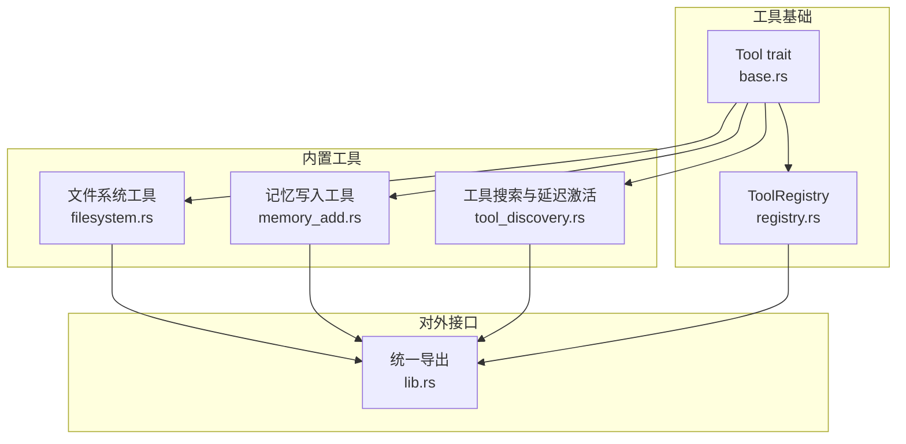
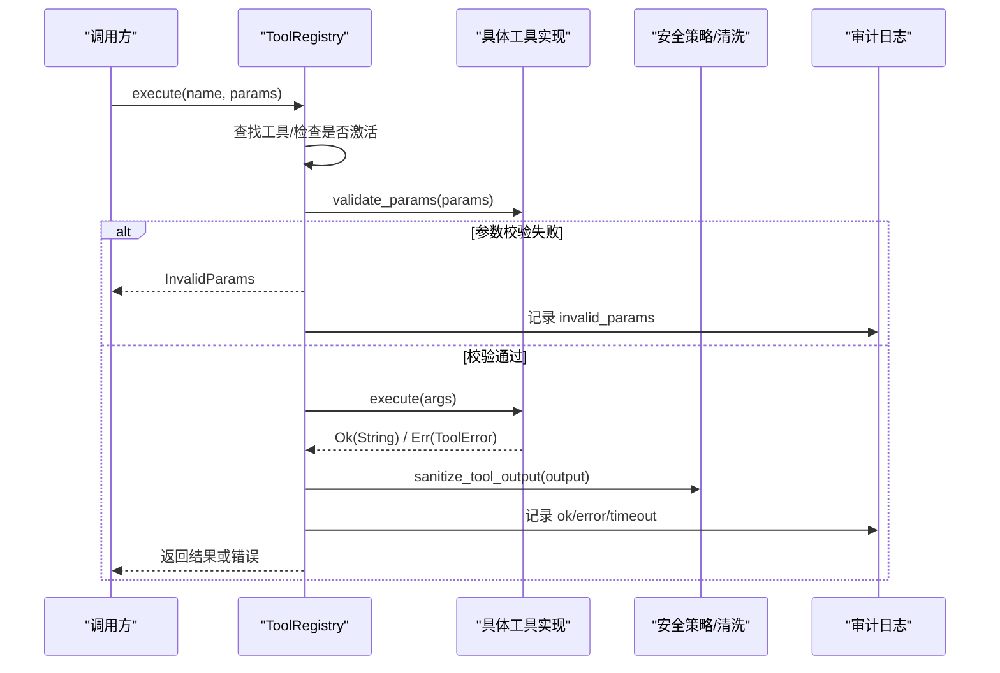
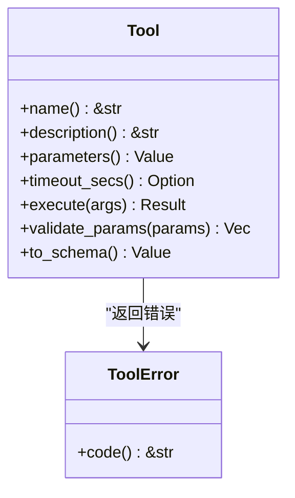
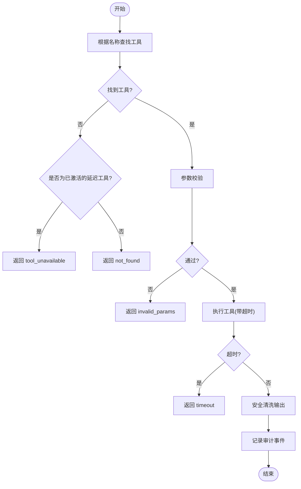
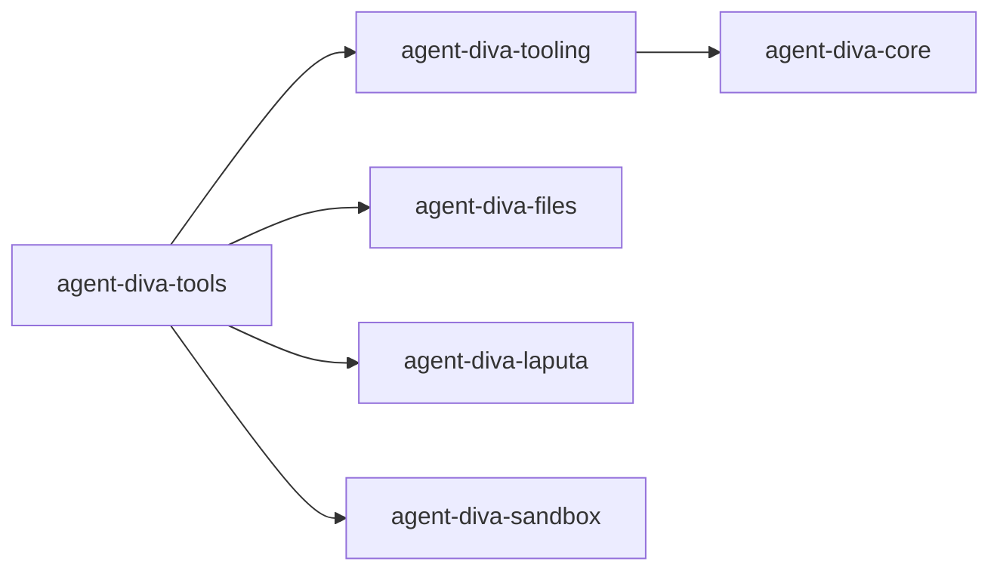

# 自定义工具开发指南

<cite>
**本文引用的文件**
- [agent-diva-tooling/src/base.rs](file://agent-diva-tooling/src/base.rs)
- [agent-diva-tooling/src/registry.rs](file://agent-diva-tooling/src/registry.rs)
- [agent-diva-tools/src/lib.rs](file://agent-diva-tools/src/lib.rs)
- [agent-diva-tools/src/registry.rs](file://agent-diva-tools/src/registry.rs)
- [agent-diva-tools/src/base.rs](file://agent-diva-tools/src/base.rs)
- [agent-diva-tools/Cargo.toml](file://agent-diva-tools/Cargo.toml)
- [agent-diva-tooling/Cargo.toml](file://agent-diva-tooling/Cargo.toml)
- [agent-diva-tools/src/filesystem.rs](file://agent-diva-tools/src/filesystem.rs)
- [agent-diva-tools/src/memory_add.rs](file://agent-diva-tools/src/memory_add.rs)
- [agent-diva-tools/src/tool_discovery.rs](file://agent-diva-tools/src/tool_discovery.rs)
</cite>

## 目录
1. [简介](#简介)
2. [项目结构](#项目结构)
3. [核心组件](#核心组件)
4. [架构总览](#架构总览)
5. [详细组件分析](#详细组件分析)
6. [依赖关系分析](#依赖关系分析)
7. [性能考虑](#性能考虑)
8. [故障排查指南](#故障排查指南)
9. [结论](#结论)
10. [附录：从零到一的完整开发流程](#附录从零到一的完整开发流程)

## 简介
本指南面向希望在 agent-diva 中从零开始创建“自定义工具”的开发者。内容覆盖：
- 项目结构与模块职责
- Tool trait 的实现要求与设计原则（name、description、parameters、execute）
- 在工具注册表中注册新工具，并与现有系统集成
- 依赖管理与测试编写
- 最佳实践、性能优化与常见问题解决方案

## 项目结构
agent-diva 将“工具能力”拆分为两个关键 crate：
- agent-diva-tooling：提供工具的基础抽象（Tool trait）、错误类型、以及工具注册表（ToolRegistry）等基础设施。
- agent-diva-tools：内置工具实现集合，并统一对外暴露；同时包含工具发现与延迟激活机制。

图表来源
- [agent-diva-tooling/src/base.rs:1-123](file://agent-diva-tooling/src/base.rs#L1-L123)
- [agent-diva-tooling/src/registry.rs:362-717](file://agent-diva-tooling/src/registry.rs#L362-L717)
- [agent-diva-tools/src/filesystem.rs:14-145](file://agent-diva-tools/src/filesystem.rs#L14-L145)
- [agent-diva-tools/src/memory_add.rs:11-89](file://agent-diva-tools/src/memory_add.rs#L11-L89)
- [agent-diva-tools/src/tool_discovery.rs:8-59](file://agent-diva-tools/src/tool_discovery.rs#L8-L59)
- [agent-diva-tools/src/lib.rs:1-74](file://agent-diva-tools/src/lib.rs#L1-L74)

章节来源
- [agent-diva-tools/src/lib.rs:1-74](file://agent-diva-tools/src/lib.rs#L1-L74)
- [agent-diva-tooling/src/lib.rs:1-14](file://agent-diva-tooling/src/lib.rs#L1-L14)

## 核心组件
- Tool trait：定义工具的最小契约，包括 name()、description()、parameters()、timeout_secs()、execute() 以及参数校验与 OpenAI 函数 schema 转换。
- ToolRegistry：集中管理工具的注册、查询、执行、超时控制、审计日志、安全输出清洗、以及“延迟工具”的发现与激活。
- 工具发现与延迟激活：通过 tool_search 工具对已授权但默认不暴露的工具进行关键词检索，并在当前任务轮次内激活有限数量的工具，减少模型上下文开销。

章节来源
- [agent-diva-tooling/src/base.rs:6-61](file://agent-diva-tooling/src/base.rs#L6-L61)
- [agent-diva-tooling/src/registry.rs:362-717](file://agent-diva-tooling/src/registry.rs#L362-L717)
- [agent-diva-tools/src/tool_discovery.rs:8-59](file://agent-diva-tools/src/tool_discovery.rs#L8-L59)

## 架构总览
下图展示了从调用方到具体工具执行的端到端流程，包括注册、参数校验、超时控制、审计与安全清洗。

图表来源
- [agent-diva-tooling/src/registry.rs:534-699](file://agent-diva-tooling/src/registry.rs#L534-L699)
- [agent-diva-tooling/src/base.rs:6-61](file://agent-diva-tooling/src/base.rs#L6-L61)

## 详细组件分析

### Tool trait 设计与实现要点
- name()：稳定、唯一、可读的工具标识，用于注册与调用。
- description()：清晰描述工具用途，便于模型理解与搜索排序。
- parameters()：使用 JSON Schema 描述参数结构，支持 required、properties、type 等字段；ToolRegistry 会基于 required 做基础校验。
- timeout_secs()：可选，为长耗时交互工具设置超时上限；未设置则使用全局默认。
- execute()：异步执行主体，返回字符串结果；内部应做好输入解析、业务逻辑、错误处理与资源释放。
- 参数校验与 schema 转换：Tool 提供 validate_params 默认实现与 to_schema 方法，便于统一校验与对外暴露 OpenAI function schema。

图表来源
- [agent-diva-tooling/src/base.rs:6-123](file://agent-diva-tooling/src/base.rs#L6-L123)

章节来源
- [agent-diva-tooling/src/base.rs:6-123](file://agent-diva-tooling/src/base.rs#L6-L123)

### 工具注册表 ToolRegistry
- 注册与分区：register/register_in_partition 支持将工具标记为 Core（始终可见）或 Deferred（需通过搜索激活）。
- 执行流程：get_definition_set 生成稳定的工具列表；execute_structured 负责参数校验、超时控制、安全清洗、审计记录。
- 延迟激活：ActiveDeferredTools 维护当前轮次可激活的工具名集合，限制最大数量，避免上下文膨胀。

图表来源
- [agent-diva-tooling/src/registry.rs:534-699](file://agent-diva-tooling/src/registry.rs#L534-L699)

章节来源
- [agent-diva-tooling/src/registry.rs:362-717](file://agent-diva-tooling/src/registry.rs#L362-L717)

### 示例工具实现

#### 文件系统工具（ReadFileTool/WriteFileTool）
- 安全策略集成：路径校验、文件大小限制、工作区隔离。
- 大文件读取：支持偏移与行数限制，流式读取以降低内存占用。
- 输出清洗：JSON 转义与长度截断，防止污染上下文。

章节来源
- [agent-diva-tools/src/filesystem.rs:14-145](file://agent-diva-tools/src/filesystem.rs#L14-L145)

#### 记忆写入工具（MemoryAddTool）
- 低风险的即时写入：将用户确认的事实或偏好写入长期记忆。
- 依赖注入：通过 MemoryProvider 与 workspace 完成持久化。
- 错误处理：无 provider 时返回失败状态；序列化失败转为执行错误。

章节来源
- [agent-diva-tools/src/memory_add.rs:11-89](file://agent-diva-tools/src/memory_add.rs#L11-L89)

#### 工具搜索与延迟激活（ToolSearchTool）
- 功能：按名称、描述、schema 关键词搜索已授权的延迟工具，并激活前 N 个供下一次模型调用使用。
- 效果：减少默认暴露的工具数量，降低提示词体积与成本。

章节来源
- [agent-diva-tools/src/tool_discovery.rs:8-59](file://agent-diva-tools/src/tool_discovery.rs#L8-L59)

## 依赖关系分析
- agent-diva-tooling 依赖 core、async-trait、serde、tokio、tracing 等，提供最小化的工具基础设施。
- agent-diva-tools 依赖 core、files、laputa、sandbox 等，实现具体工具能力，并通过 lib.rs 统一导出。
- 两者通过 Tool trait 与 ToolRegistry 解耦，便于扩展与替换。

图表来源
- [agent-diva-tooling/Cargo.toml:1-24](file://agent-diva-tooling/Cargo.toml#L1-L24)
- [agent-diva-tools/Cargo.toml:1-60](file://agent-diva-tools/Cargo.toml#L1-L60)

章节来源
- [agent-diva-tooling/Cargo.toml:1-24](file://agent-diva-tooling/Cargo.toml#L1-L24)
- [agent-diva-tools/Cargo.toml:1-60](file://agent-diva-tools/Cargo.toml#L1-L60)

## 性能考虑
- 延迟激活：将非必需工具放入 Deferred 分区，通过 tool_search 按需激活，减少默认工具数量与提示词大小。
- 超时控制：为长耗时工具设置合理的 timeout_secs，避免阻塞任务轮次。
- 大文件读取：使用偏移与行数限制，结合流式读取，降低内存峰值。
- 输出清洗：对工具输出进行安全清洗与长度截断，避免污染上下文。
- 缓存与去重：ToolDefinitionSet 保持 CORE/DEFERRED 边界稳定，利于缓存命中。

[本节为通用指导，不直接分析具体文件]

## 故障排查指南
- 工具未找到：检查名称是否正确、是否属于 Deferred 且未被激活。
- 参数校验失败：核对 parameters 中的 required 与属性类型，确保传入对象键名一致。
- 执行超时：适当提高 timeout_secs 或优化工具内部逻辑。
- 权限/路径问题：确认工作区与安全策略配置，确保路径在允许范围内。
- 输出过大：检查 MAX_FILE_CONTENT_CHARS 与清洗逻辑，必要时分段读取。

章节来源
- [agent-diva-tooling/src/registry.rs:534-699](file://agent-diva-tooling/src/registry.rs#L534-L699)
- [agent-diva-tooling/src/base.rs:63-123](file://agent-diva-tooling/src/base.rs#L63-L123)

## 结论
通过实现 Tool trait 并使用 ToolRegistry 统一管理，可以在 agent-diva 中快速构建可扩展、可审计、安全的自定义工具。借助延迟激活与参数校验、超时控制、输出清洗等机制，既能保证系统稳定性，又能提升模型调用的效率与可控性。

[本节为总结性内容，不直接分析具体文件]

## 附录：从零到一的完整开发流程

### 1. 需求分析与设计
- 明确工具目标、输入输出、安全性与性能要求。
- 决定工具分类：Core（常驻）还是 Deferred（按需激活）。

### 2. 初始化项目与依赖
- 在 agent-diva-tools 下新增模块，或在独立 crate 中实现 Tool trait 后接入。
- 在 Cargo.toml 中添加必要依赖（如 async-trait、serde_json、tracing 等）。

章节来源
- [agent-diva-tools/Cargo.toml:1-60](file://agent-diva-tools/Cargo.toml#L1-L60)
- [agent-diva-tooling/Cargo.toml:1-24](file://agent-diva-tooling/Cargo.toml#L1-L24)

### 3. 实现 Tool trait
- 实现 name()、description()、parameters()、execute()。
- 如需长耗时交互，实现 timeout_secs()。
- 遵循参数校验约定，确保 parameters 的 required 与实际入参一致。

章节来源
- [agent-diva-tooling/src/base.rs:6-61](file://agent-diva-tooling/src/base.rs#L6-L61)

### 4. 注册工具
- 使用 ToolRegistry::register 注册 Core 工具。
- 使用 ToolRegistry::register_in_partition 注册 Deferred 工具。
- 若需要工具搜索能力，配合 tool_discovery 提供的 DeferredToolActivationHandle。

章节来源
- [agent-diva-tooling/src/registry.rs:452-476](file://agent-diva-tooling/src/registry.rs#L452-L476)
- [agent-diva-tools/src/tool_discovery.rs:8-59](file://agent-diva-tools/src/tool_discovery.rs#L8-L59)

### 5. 集成到现有系统
- 在应用启动阶段构建 ToolRegistry，并注册所有工具。
- 将 ToolRegistry 暴露给上层调度器或 API 层，以便模型调用。

章节来源
- [agent-diva-tools/src/lib.rs:1-74](file://agent-diva-tools/src/lib.rs#L1-L74)

### 6. 编写测试
- 单元测试：验证参数校验、执行分支、错误路径。
- 集成测试：验证注册表行为、延迟激活、超时与审计。
- 参考现有工具测试风格，例如 memory_add 与 tool_discovery 的测试用例。

章节来源
- [agent-diva-tools/src/memory_add.rs:91-114](file://agent-diva-tools/src/memory_add.rs#L91-L114)
- [agent-diva-tools/src/tool_discovery.rs:61-118](file://agent-diva-tools/src/tool_discovery.rs#L61-L118)

### 7. 发布与部署
- 更新版本与依赖，运行 lint 与测试。
- 打包并发布至内部仓库或 crates.io（如适用）。
- 在运行时配置中启用新工具，并进行端到端验证。

[本节为通用指导，不直接分析具体文件]