# 工具打包与分发

<cite>
**本文引用的文件**
- [Cargo.toml](file://Cargo.toml)
- [CI 工作流](file://.github/workflows/ci.yml)
- [Linux 打包脚本](file://scripts/package-linux.sh)
- [macOS 打包脚本](file://scripts/package-macos.sh)
- [Windows GUI 打包脚本](file://scripts/package-windows-gui.ps1)
- [Justfile](file://justfile)
- [Tauri 配置](file://agent-diva-gui/src-tauri/tauri.conf.json)
- [GUI 资源预置脚本](file://scripts/ci/prepare_gui_bundle.py)
- [无头包构建脚本](file://scripts/ci/package_headless.py)
- [systemd 服务单元](file://contrib/systemd/agent-diva.service)
- [systemd 安装脚本](file://contrib/systemd/install.sh)
- [launchd plist](file://contrib/launchd/com.agent-diva.gateway.plist)
</cite>

## 目录
1. [简介](#简介)
2. [项目结构](#项目结构)
3. [核心组件](#核心组件)
4. [架构总览](#架构总览)
5. [详细组件分析](#详细组件分析)
6. [依赖关系分析](#依赖关系分析)
7. [性能考虑](#性能考虑)
8. [故障排查指南](#故障排查指南)
9. [结论](#结论)
10. [附录](#附录)

## 简介
本指南面向 Agent Diva 工具的打包与分发，覆盖以下主题：
- 打包格式与结构：包括元数据定义、二进制与资源组织方式。
- 分发机制：本地安装、远程下载与版本管理。
- 签名与验证：完整性校验与安全加固建议。
- 自动化构建与发布流水线：CI/CD 集成与制品归档。
- 更新策略、回滚机制与兼容性管理最佳实践。

## 项目结构
仓库采用多 crate 工作区，CLI、GUI（Tauri）、服务与平台相关脚本共同构成打包与分发体系。关键路径与职责如下：
- 工作区与版本：工作区根 Cargo.toml 统一版本与发布配置。
- CI/CD：GitHub Actions 负责跨平台检查、GUI 构建与 Release 产物上传。
- 平台打包：
  - Linux：脚本生成 tar.gz 并附带 systemd 单元与安装脚本。
  - macOS：构建通用二进制并可选生成 DMG。
  - Windows：通过 Tauri 生成 NSIS/MSI 安装包，并预缓存 NSIS 工具链。
- GUI 资源准备：将 CLI/Service 二进制与系统服务模板复制到 Tauri resources，供打包器嵌入。
- 服务与守护进程：提供 systemd/launchd 模板，便于服务端长期运行。

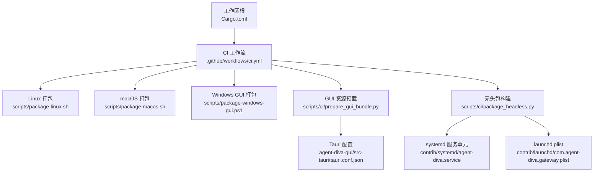

图表来源
- [CI 工作流:1-264](file://.github/workflows/ci.yml#L1-L264)
- [Linux 打包脚本:1-101](file://scripts/package-linux.sh#L1-L101)
- [macOS 打包脚本:1-130](file://scripts/package-macos.sh#L1-L130)
- [Windows GUI 打包脚本:1-204](file://scripts/package-windows-gui.ps1#L1-L204)
- [GUI 资源预置脚本:1-230](file://scripts/ci/prepare_gui_bundle.py#L1-L230)
- [Tauri 配置:1-90](file://agent-diva-gui/src-tauri/tauri.conf.json#L1-L90)
- [无头包构建脚本:1-154](file://scripts/ci/package_headless.py#L1-L154)
- [systemd 服务单元:1-28](file://contrib/systemd/agent-diva.service#L1-L28)
- [launchd plist:1-32](file://contrib/launchd/com.agent-diva.gateway.plist#L1-L32)

章节来源
- [Cargo.toml:1-110](file://Cargo.toml#L1-L110)
- [CI 工作流:1-264](file://.github/workflows/ci.yml#L1-L264)

## 核心组件
- 工作区与版本管理
  - 统一版本号与工作区成员声明，确保所有 crate 版本一致。
  - 发布配置启用 LTO、strip 等优化，减小产物体积。
- CI/CD 流水线
  - 触发条件：push/PR/tag；支持手动触发测试与覆盖率。
  - 任务：Rust 检查、GUI 构建、覆盖率、Release 创建。
  - 产物：各平台安装包（AppImage/Deb/DMG/MSI/Exe）。
- 平台打包脚本
  - Linux：编译 CLI、复制安装脚本与服务单元、生成 tar.gz 与校验和。
  - macOS：交叉编译 x86_64/arm64，合并为通用二进制，生成 tar.gz 与可选 DMG。
  - Windows：构建 CLI/Service，预缓存 NSIS，执行 Tauri 打包生成 NSIS/MSI。
- GUI 资源预置
  - 将 CLI/Service 二进制与系统服务模板复制到 Tauri resources，并写入清单。
  - 清单包含目标 OS、二进制路径、服务模板路径等信息。
- 无头包构建
  - 根据目标 OS 自动加入 systemd/launchd 模板，生成 bundle-manifest.txt。
  - 输出 zip/tar.gz 归档，便于远程分发与安装。
- 服务与守护进程
  - systemd：用户/组隔离、只读文件系统、日志与数据目录权限控制。
  - launchd：开机自启、崩溃重启、标准输出/错误重定向。

章节来源
- [CI 工作流:55-264](file://.github/workflows/ci.yml#L55-L264)
- [Linux 打包脚本:21-101](file://scripts/package-linux.sh#L21-L101)
- [macOS 打包脚本:24-130](file://scripts/package-macos.sh#L24-L130)
- [Windows GUI 打包脚本:142-204](file://scripts/package-windows-gui.ps1#L142-L204)
- [GUI 资源预置脚本:55-230](file://scripts/ci/prepare_gui_bundle.py#L55-L230)
- [无头包构建脚本:24-154](file://scripts/ci/package_headless.py#L24-L154)
- [systemd 服务单元:1-28](file://contrib/systemd/agent-diva.service#L1-L28)
- [launchd plist:1-32](file://contrib/launchd/com.agent-diva.gateway.plist#L1-L32)

## 架构总览
下图展示了从代码提交到最终分发的端到端流程，涵盖检查、构建、打包、归档与发布。

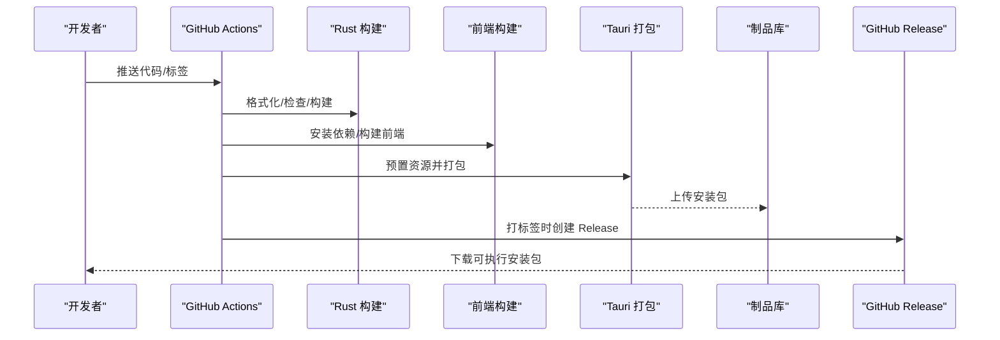

图表来源
- [CI 工作流:55-264](file://.github/workflows/ci.yml#L55-L264)
- [GUI 资源预置脚本:100-230](file://scripts/ci/prepare_gui_bundle.py#L100-L230)
- [Tauri 配置:58-88](file://agent-diva-gui/src-tauri/tauri.conf.json#L58-L88)

## 详细组件分析

### 工作区与版本管理
- 工作区成员与版本：集中声明所有 crate，统一版本号，避免版本漂移。
- 发布配置：启用 LTO、单 codegen unit、strip，提升性能并减小体积。
- 依赖管理：统一 workspace.dependencies，保证一致性。

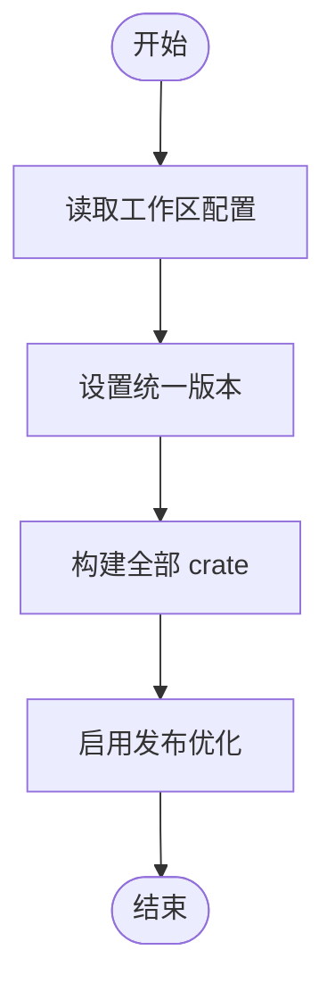

图表来源
- [Cargo.toml:1-110](file://Cargo.toml#L1-L110)

章节来源
- [Cargo.toml:1-110](file://Cargo.toml#L1-L110)

### CI/CD 流水线
- 触发与权限：支持 push/PR/tag 触发，显式声明 actions 读写权限。
- 矩阵构建：在 Ubuntu/Windows/macOS 上并行检查与构建。
- GUI 构建：安装 Node/pnpm，构建前端，调用 Tauri 打包。
- 制品上传：仅上传最终安装包，避免中间产物污染 Release。
- Release 发布：当 tag 以 v*.*.* 开头时创建 GitHub Release。

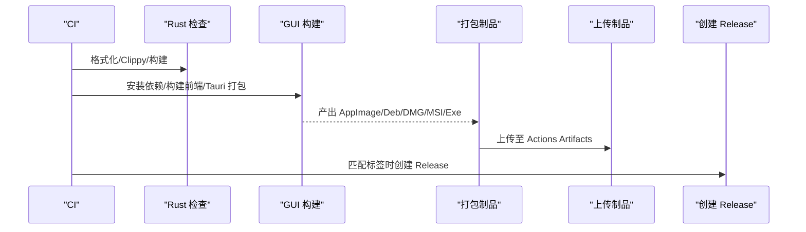

图表来源
- [CI 工作流:55-264](file://.github/workflows/ci.yml#L55-L264)

章节来源
- [CI 工作流:1-264](file://.github/workflows/ci.yml#L1-L264)

### Linux 打包与分发
- 构建与产物：编译 CLI，复制安装脚本与服务单元，生成 tar.gz 与 sha256。
- 服务集成：包含 systemd 单元与安装/卸载脚本，便于服务器部署。
- 校验与签名建议：使用 sha256 校验完整性；生产环境建议对二进制进行签名。

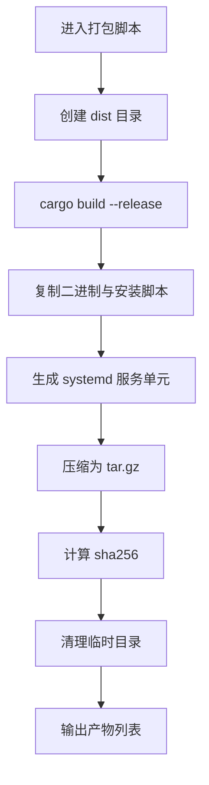

图表来源
- [Linux 打包脚本:21-101](file://scripts/package-linux.sh#L21-L101)
- [systemd 服务单元:1-28](file://contrib/systemd/agent-diva.service#L1-L28)

章节来源
- [Linux 打包脚本:1-101](file://scripts/package-linux.sh#L1-L101)
- [systemd 服务单元:1-28](file://contrib/systemd/agent-diva.service#L1-L28)

### macOS 打包与分发
- 通用二进制：分别构建 x86_64 与 arm64，使用 lipo 合并。
- 压缩包与 DMG：生成 tar.gz；若安装 create-dmg，则生成 DMG 安装包。
- 安装脚本：DMG 内包含 install.sh 与 README，简化安装流程。

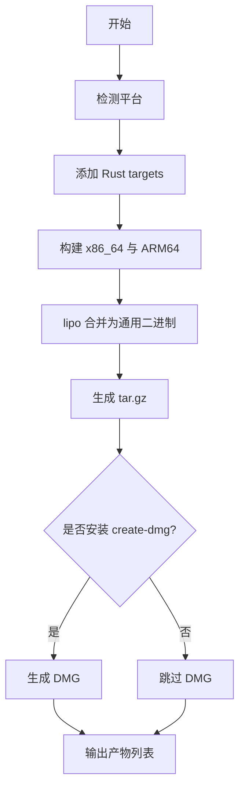

图表来源
- [macOS 打包脚本:24-130](file://scripts/package-macos.sh#L24-L130)

章节来源
- [macOS 打包脚本:1-130](file://scripts/package-macos.sh#L1-L130)

### Windows GUI 打包与分发
- 前置准备：构建 CLI/Service，预缓存 NSIS 工具链（含插件），校验 SHA1。
- 资源预置：调用 bundle:prepare 将二进制与模板复制到 resources。
- Tauri 打包：生成 NSIS/MSI 安装包，列出产物路径。

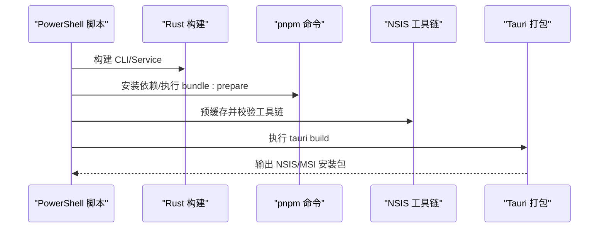

图表来源
- [Windows GUI 打包脚本:74-116](file://scripts/package-windows-gui.ps1#L74-L116)
- [Windows GUI 打包脚本:142-204](file://scripts/package-windows-gui.ps1#L142-L204)

章节来源
- [Windows GUI 打包脚本:1-204](file://scripts/package-windows-gui.ps1#L1-204)

### GUI 资源预置与清单
- 资源拷贝：将 CLI/Service 二进制复制到 src-tauri/resources/bin/<target_os>。
- 服务模板：Linux 拷贝 systemd，macOS 拷贝 launchd。
- 清单生成：写入 gui-bundle-manifest.json，记录目标 OS、二进制路径、服务模板路径。

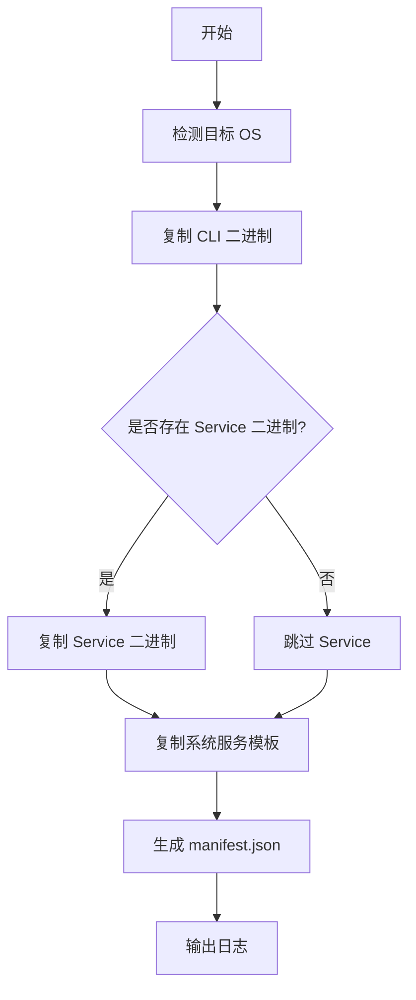

图表来源
- [GUI 资源预置脚本:55-230](file://scripts/ci/prepare_gui_bundle.py#L55-L230)

章节来源
- [GUI 资源预置脚本:1-230](file://scripts/ci/prepare_gui_bundle.py#L1-L230)

### 无头包构建与系统服务
- 无头包：根据目标 OS 加入 systemd/launchd 模板，生成 bundle-manifest.txt。
- 归档：Windows 使用 zip，其他平台使用 tar.gz。
- 服务单元：systemd 提供安全限制与日志路径；launchd 提供自启动与崩溃重启。

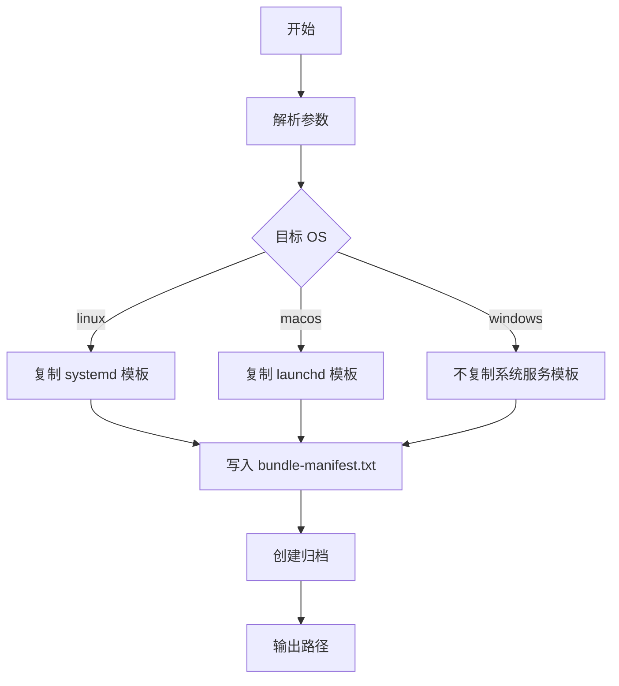

图表来源
- [无头包构建脚本:24-154](file://scripts/ci/package_headless.py#L24-L154)
- [systemd 服务单元:1-28](file://contrib/systemd/agent-diva.service#L1-L28)
- [launchd plist:1-32](file://contrib/launchd/com.agent-diva.gateway.plist#L1-L32)

章节来源
- [无头包构建脚本:1-154](file://scripts/ci/package_headless.py#L1-L154)
- [systemd 服务单元:1-28](file://contrib/systemd/agent-diva.service#L1-L28)
- [launchd plist:1-32](file://contrib/launchd/com.agent-diva.gateway.plist#L1-L32)

### Tauri 打包配置
- 产品名称与标识：productName、identifier。
- 构建前后命令：beforeBuildCommand、devUrl、frontendDist。
- 打包目标：nsis、msi、app、dmg、deb、appimage。
- 资源与图标：resources、icon 多分辨率。
- Windows WebView 安装模式与 NSIS 语言选择。

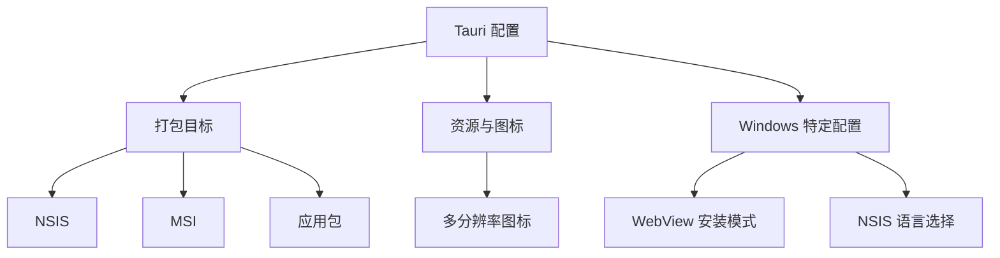

图表来源
- [Tauri 配置:1-90](file://agent-diva-gui/src-tauri/tauri.conf.json#L1-L90)

章节来源
- [Tauri 配置:1-90](file://agent-diva-gui/src-tauri/tauri.conf.json#L1-L90)

## 依赖关系分析
- 构建依赖
  - Rust：clippy、rustfmt、cargo-deb、cross（可选）。
  - Node：pnpm、Tauri CLI。
  - 平台工具：create-dmg（macOS）、NSIS（Windows）。
- 运行时依赖
  - Linux：systemd。
  - macOS：launchd。
  - Windows：WebView 运行时（由 Tauri 处理）。

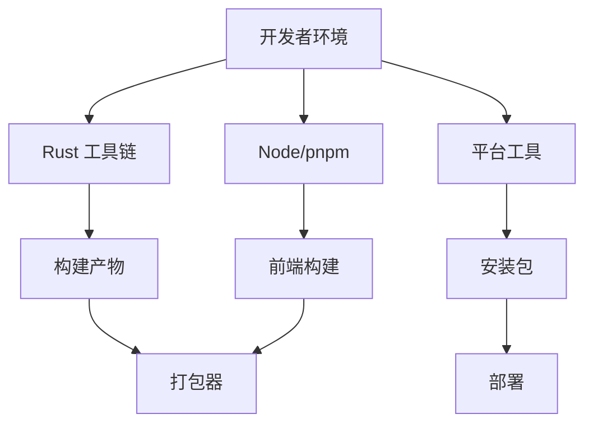

图表来源
- [CI 工作流:63-183](file://.github/workflows/ci.yml#L63-L183)
- [Windows GUI 打包脚本:74-116](file://scripts/package-windows-gui.ps1#L74-L116)
- [macOS 打包脚本:66-122](file://scripts/package-macos.sh#L66-L122)

章节来源
- [CI 工作流:55-204](file://.github/workflows/ci.yml#L55-L204)
- [Windows GUI 打包脚本:1-204](file://scripts/package-windows-gui.ps1#L1-204)
- [macOS 打包脚本:1-130](file://scripts/package-macos.sh#L1-L130)

## 性能考虑
- 发布优化：启用 LTO、单 codegen unit、strip，减少二进制体积与提升启动性能。
- 构建缓存：使用 rust-cache 加速依赖构建。
- 并行构建：CI 中矩阵化构建不同平台，缩短整体耗时。
- 前端构建：使用 pnpm 缓存依赖，减少安装时间。

章节来源
- [Cargo.toml:101-110](file://Cargo.toml#L101-L110)
- [CI 工作流:83-103](file://.github/workflows/ci.yml#L83-L103)
- [CI 工作流:133-183](file://.github/workflows/ci.yml#L133-L183)

## 故障排查指南
- 构建失败
  - 检查 Rust 工具链与 clippy/rustfmt 是否安装。
  - Linux 缺少 GTK/Webkit 依赖时安装对应开发包。
  - Windows NSIS 工具链缺失或校验失败时重新预缓存。
- 打包失败
  - GUI 资源预置失败：确认 CLI/Service 二进制存在且路径正确。
  - Tauri 打包失败：检查 node_modules 是否完整、pnpm 版本是否匹配。
- 服务无法启动
  - systemd：检查用户/组、权限、日志目录与 ExecStart 路径。
  - launchd：检查 plist 中的程序路径与日志路径占位符替换。
- 完整性校验
  - Linux：使用 sha256sum 校验压缩包与二进制。
  - Windows：校验 NSIS/MSI 的哈希值（建议在发布流程中加入签名与校验）。

章节来源
- [CI 工作流:71-112](file://.github/workflows/ci.yml#L71-L112)
- [Linux 打包脚本:87-101](file://scripts/package-linux.sh#L87-L101)
- [Windows GUI 打包脚本:74-116](file://scripts/package-windows-gui.ps1#L74-L116)
- [systemd 服务单元:6-26](file://contrib/systemd/agent-diva.service#L6-L26)
- [launchd plist:8-29](file://contrib/launchd/com.agent-diva.gateway.plist#L8-L29)

## 结论
Agent Diva 的打包与分发体系通过工作区统一管理版本，结合 CI/CD 实现跨平台构建与发布。Linux/macOS/Windows 各有专用脚本与工具链，GUI 通过 Tauri 打包为原生安装包。系统服务模板便于服务端长期运行。建议在发布流程中加入二进制签名与完整性校验，完善更新策略与回滚机制，确保安全性与稳定性。

## 附录

### 打包格式与结构
- Linux
  - 格式：tar.gz
  - 内容：bin/agent-diva、install/uninstall 脚本、README.md、systemd 单元。
  - 校验：sha256sum。
- macOS
  - 格式：tar.gz、可选 DMG
  - 内容：通用二进制、install.sh、README。
- Windows
  - 格式：NSIS/MSI
  - 内容：CLI/Service 二进制、系统服务模板、Tauri 资源。

章节来源
- [Linux 打包脚本:21-101](file://scripts/package-linux.sh#L21-L101)
- [macOS 打包脚本:59-130](file://scripts/package-macos.sh#L59-L130)
- [Windows GUI 打包脚本:189-204](file://scripts/package-windows-gui.ps1#L189-L204)

### 元数据定义与资源组织
- 无头包清单：bundle-manifest.txt，包含 version/os/arch/binary/entrypoint/systemd_files/launchd_files。
- GUI 资源清单：gui-bundle-manifest.json，包含 prepared_at_utc/target_os/resource_root/binaries/service_templates。
- 资源目录：src-tauri/resources/bin/<target_os>、systemd、launchd。

章节来源
- [无头包构建脚本:24-48](file://scripts/ci/package_headless.py#L24-L48)
- [GUI 资源预置脚本:55-90](file://scripts/ci/prepare_gui_bundle.py#L55-L90)

### 分发机制
- 本地安装
  - Linux：执行 install.sh，复制二进制与 service 单元，启用并启动服务。
  - macOS：打开 DMG 执行 install.sh，或将二进制复制到 /usr/local/bin。
  - Windows：运行 NSIS/MSI 安装器，按向导完成安装。
- 远程下载
  - 从 GitHub Release 下载对应平台的安装包。
  - 使用 sha256 校验完整性。
- 版本管理
  - 工作区统一版本号，Tag 触发 Release。
  - 通过 bundle-manifest/gui-bundle-manifest 记录版本信息。

章节来源
- [systemd 安装脚本:1-68](file://contrib/systemd/install.sh#L1-L68)
- [CI 工作流:237-264](file://.github/workflows/ci.yml#L237-L264)
- [无头包构建脚本:24-48](file://scripts/ci/package_headless.py#L24-L48)
- [GUI 资源预置脚本:55-90](file://scripts/ci/prepare_gui_bundle.py#L55-L90)

### 签名与验证机制
- 完整性校验
  - Linux：sha256sum 校验压缩包与二进制。
  - Windows：建议对 NSIS/MSI 进行签名与哈希校验。
- 安全加固建议
  - 二进制签名：使用代码签名证书对可执行文件与安装包签名。
  - 最小权限：systemd 使用 NoNewPrivileges、ProtectSystem、PrivateTmp。
  - 日志与数据隔离：限定读写路径，避免越权访问。

章节来源
- [Linux 打包脚本:87-101](file://scripts/package-linux.sh#L87-L101)
- [systemd 服务单元:16-26](file://contrib/systemd/agent-diva.service#L16-L26)

### 自动化构建与发布流水线
- CI 任务
  - Rust 检查：格式化、Clippy、构建。
  - GUI 构建：安装依赖、构建前端、Tauri 打包。
  - 覆盖率：可选 tarpaulin + Codecov。
  - Release：tag 匹配时创建 Release 并上传制品。
- 制品归档
  - 仅上传最终安装包，避免中间产物污染。
  - 多平台产物：AppImage/Deb/DMG/MSI/Exe。

章节来源
- [CI 工作流:55-264](file://.github/workflows/ci.yml#L55-L264)

### 更新策略、回滚机制与兼容性管理
- 更新策略
  - 小步快跑：每次变更独立提交与验证。
  - 灰度发布：先在内部环境验证，再推送到公共 Release。
  - 版本对齐：工作区统一版本号，避免组件版本漂移。
- 回滚机制
  - 快速回滚：保留上一个稳定版本的安装包与配置文件。
  - 数据兼容：避免破坏性 schema 变更；如有迁移，提供回滚脚本。
- 兼容性管理
  - 向后兼容：保持 API/事件名稳定，GUI 兼容旧状态拼写。
  - 特性开关：通过 feature gate 控制新功能，逐步启用。

章节来源
- [CI 工作流:16-43](file://.github/workflows/ci.yml#L16-L43)
- [CI 工作流:237-264](file://.github/workflows/ci.yml#L237-L264)
- [Justfile:106-112](file://justfile#L106-L112)