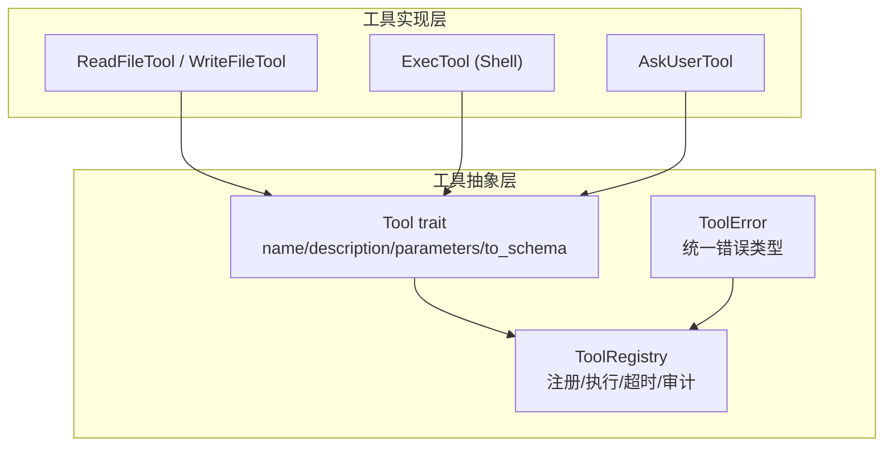
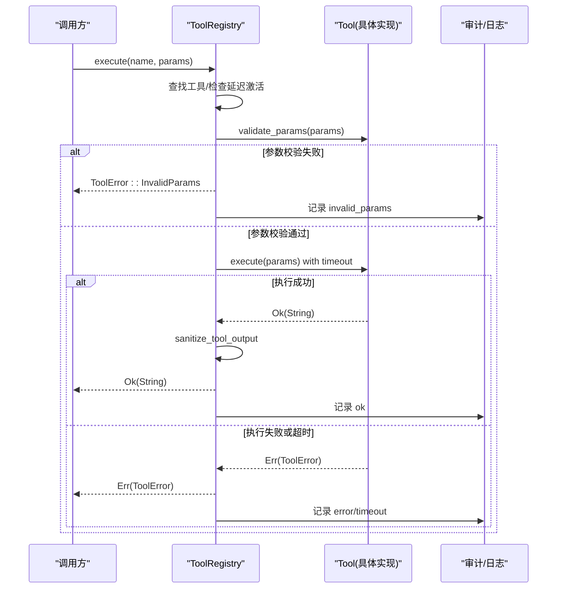
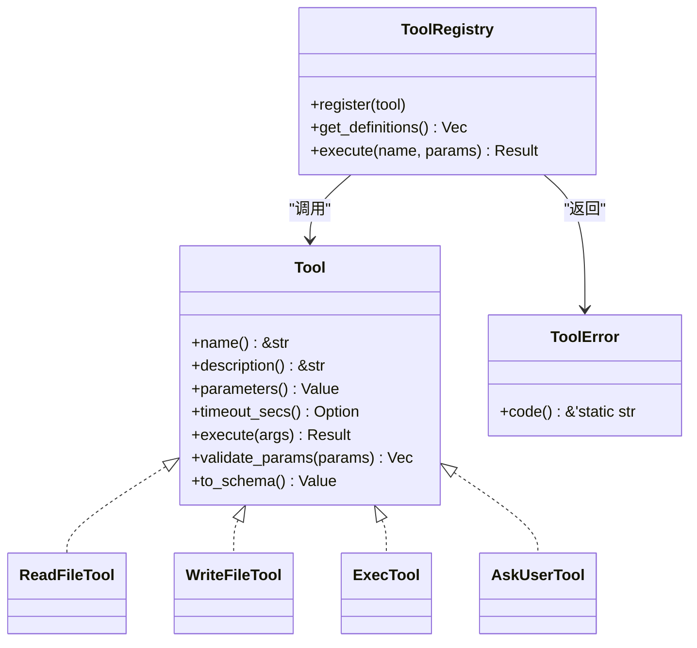
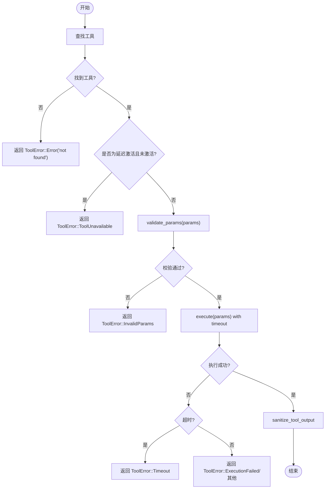

# 工具接口设计

<cite>
**本文引用的文件**
- [agent-diva-tooling/src/base.rs](file://agent-diva-tooling/src/base.rs)
- [agent-diva-tooling/src/registry.rs](file://agent-diva-tooling/src/registry.rs)
- [agent-diva-tools/src/filesystem.rs](file://agent-diva-tools/src/filesystem.rs)
- [agent-diva-tools/src/shell.rs](file://agent-diva-tools/src/shell.rs)
- [agent-diva-tools/src/ask_user.rs](file://agent-diva-tools/src/ask_user.rs)
</cite>

## 目录
1. [简介](#简介)
2. [项目结构](#项目结构)
3. [核心组件](#核心组件)
4. [架构总览](#架构总览)
5. [详细组件分析](#详细组件分析)
6. [依赖关系分析](#依赖关系分析)
7. [性能考量](#性能考量)
8. [故障排查指南](#故障排查指南)
9. [结论](#结论)
10. [附录](#附录)

## 简介
本文件面向“工具接口”的设计与实现，聚焦于 Tool trait 的核心方法、参数 schema 规范、返回值与错误码约定、超时处理、参数校验以及 OpenAI 函数 schema 转换的最佳实践。文档基于仓库中 agent-diva-tooling 的抽象定义与 agent-diva-tools 的具体实现进行说明，帮助读者正确实现一个标准的工具接口。

## 项目结构
围绕工具接口的相关代码主要分布在两个 crate：
- agent-diva-tooling：定义 Tool trait、ToolError、ToolRegistry 等基础设施，提供统一的执行、注册、schema 生成与超时控制能力。
- agent-diva-tools：提供具体工具实现（如文件系统读写、Shell 执行、用户交互提问等），遵循 Tool trait 并集成安全策略与沙箱机制。

图表来源
- [agent-diva-tooling/src/base.rs:7-60](file://agent-diva-tooling/src/base.rs#L7-L60)
- [agent-diva-tooling/src/base.rs:63-122](file://agent-diva-tooling/src/base.rs#L63-L122)
- [agent-diva-tooling/src/registry.rs:362-717](file://agent-diva-tooling/src/registry.rs#L362-L717)
- [agent-diva-tools/src/filesystem.rs:38-145](file://agent-diva-tools/src/filesystem.rs#L38-L145)
- [agent-diva-tools/src/shell.rs:54-200](file://agent-diva-tools/src/shell.rs#L54-L200)
- [agent-diva-tools/src/ask_user.rs:39-133](file://agent-diva-tools/src/ask_user.rs#L39-L133)

章节来源
- [agent-diva-tooling/src/base.rs:7-60](file://agent-diva-tooling/src/base.rs#L7-L60)
- [agent-diva-tooling/src/registry.rs:362-717](file://agent-diva-tooling/src/registry.rs#L362-L717)
- [agent-diva-tools/src/filesystem.rs:38-145](file://agent-diva-tools/src/filesystem.rs#L38-L145)
- [agent-diva-tools/src/shell.rs:54-200](file://agent-diva-tools/src/shell.rs#L54-L200)
- [agent-diva-tools/src/ask_user.rs:39-133](file://agent-diva-tools/src/ask_user.rs#L39-L133)

## 核心组件
- Tool trait：定义工具的统一接口，包括 name()、description()、parameters()、timeout_secs()、execute()、validate_params()、to_schema()。
- ToolError：统一错误枚举，包含无效参数、执行失败、IO 错误、超时、工具不可用等，并提供稳定机器可读的错误码 code()。
- ToolRegistry：工具注册表，负责工具发现、参数校验、超时控制、输出清洗、审计日志、OpenAI schema 集合生成与延迟激活工具的可见性管理。

章节来源
- [agent-diva-tooling/src/base.rs:7-60](file://agent-diva-tooling/src/base.rs#L7-L60)
- [agent-diva-tooling/src/base.rs:63-122](file://agent-diva-tooling/src/base.rs#L63-L122)
- [agent-diva-tooling/src/registry.rs:362-717](file://agent-diva-tooling/src/registry.rs#L362-L717)

## 架构总览
下图展示了从调用方到工具执行的完整流程，包括参数校验、超时控制、输出清洗与审计。

图表来源
- [agent-diva-tooling/src/registry.rs:534-699](file://agent-diva-tooling/src/registry.rs#L534-L699)
- [agent-diva-tooling/src/base.rs:26-60](file://agent-diva-tooling/src/base.rs#L26-L60)

## 详细组件分析

### Tool trait 核心方法
- name()：返回工具的唯一名称，用于注册与调用。
- description()：描述工具用途，参与 OpenAI function schema 的描述字段。
- parameters()：返回 JSON Schema（object），声明参数结构与约束；默认 validate_params() 会校验 required 字段是否存在。
- timeout_secs()：可选覆盖全局超时，适用于长耗时交互式工具（如 ask_user）。
- execute(args)：异步执行工具逻辑，返回字符串结果或 ToolError。
- to_schema()：将工具转换为 OpenAI function schema 格式，便于 LLM 调用。

最佳实践
- parameters() 应严格使用 JSON Schema object，明确 type、properties、required，必要时添加 description 与约束（如 maxItems）。
- 在 execute() 中进行业务级参数二次校验，对缺失或非法参数返回 ToolError::InvalidParams。
- 对于可能长时间阻塞的工具，重写 timeout_secs() 以延长超时（例如 ask_user）。
- 使用 to_schema() 生成的 schema 直接提供给上层 provider，保证 LLM 能正确理解工具签名。

章节来源
- [agent-diva-tooling/src/base.rs:7-60](file://agent-diva-tooling/src/base.rs#L7-L60)

### 参数 schema 定义规范
- 必须为 JSON Schema object，包含 properties 与 required 数组。
- 字段建议提供 description，便于 LLM 理解。
- 复杂类型可使用嵌套对象与数组，限制数组长度时使用 maxItems。
- 示例参考：
  - 读取文件：path 必填，offset/limit 可选整数。
  - 写入文件：path 与 content 必填。
  - 用户提问：question 必填，choices 最多 4 项，allow_other 布尔。

章节来源
- [agent-diva-tools/src/filesystem.rs:48-67](file://agent-diva-tools/src/filesystem.rs#L48-L67)
- [agent-diva-tools/src/filesystem.rs:181-196](file://agent-diva-tools/src/filesystem.rs#L181-L196)
- [agent-diva-tools/src/ask_user.rs:49-74](file://agent-diva-tools/src/ask_user.rs#L49-L74)

### 返回值处理与错误码规范
- 返回值：execute() 返回 String，表示工具执行结果文本。Registry 会对输出进行安全清洗后再返回给调用方。
- 错误码：ToolError 提供稳定的 code() 映射，便于上层分类与告警：
  - tool_unavailable：工具未激活或不再可用。
  - invalid_params：参数校验失败。
  - invalid_arguments：参数类型不匹配或业务校验失败。
  - execution_failed：执行过程中发生错误。
  - io_error：IO 操作失败。
  - timeout：执行超时。
  - error：通用错误。

章节来源
- [agent-diva-tooling/src/base.rs:63-122](file://agent-diva-tooling/src/base.rs#L63-L122)
- [agent-diva-tooling/src/registry.rs:534-699](file://agent-diva-tooling/src/registry.rs#L534-L699)

### 超时处理
- 全局超时：ToolRegistry 维护全局超时（默认 120s），可通过 with_timeout 自定义。
- 工具级超时：工具可重写 timeout_secs() 覆盖全局超时，适合需要更长等待时间的交互型工具。
- 执行包装：Registry 在执行时以 tokio::time::timeout 包裹工具 execute，超时则返回 ToolError::Timeout。

章节来源
- [agent-diva-tooling/src/registry.rs:369-386](file://agent-diva-tooling/src/registry.rs#L369-L386)
- [agent-diva-tooling/src/registry.rs:622-699](file://agent-diva-tooling/src/registry.rs#L622-L699)
- [agent-diva-tools/src/ask_user.rs:76-82](file://agent-diva-tools/src/ask_user.rs#L76-L82)

### OpenAI 函数 schema 转换
- Tool trait 提供 to_schema()，将 name、description、parameters 封装为 OpenAI function schema 对象。
- ToolRegistry 的 get_definitions/get_definition_set 会将所有已注册工具转换为标准 schema 列表，供 provider 使用。
- 延迟激活工具：Deferred 分区工具仅在搜索激活后加入 schema 列表，避免一次性暴露过多工具。

章节来源
- [agent-diva-tooling/src/base.rs:50-60](file://agent-diva-tooling/src/base.rs#L50-L60)
- [agent-diva-tooling/src/registry.rs:497-532](file://agent-diva-tooling/src/registry.rs#L497-L532)
- [agent-diva-tooling/src/registry.rs:23-43](file://agent-diva-tooling/src/registry.rs#L23-L43)

### 典型工具实现示例

#### 文件系统工具（读/写）
- ReadFileTool：
  - 参数：path（必填）、offset/limit（可选）。
  - 执行：路径解析与安全策略校验、文件大小限制、流式读取大文件、内容清洗与截断。
  - 返回：清理后的文件内容字符串。
- WriteFileTool：
  - 参数：path、content（均必填）。
  - 执行：路径校验、权限与安全策略检查、写入文件。
  - 返回：写入结果提示。

章节来源
- [agent-diva-tools/src/filesystem.rs:38-145](file://agent-diva-tools/src/filesystem.rs#L38-L145)
- [agent-diva-tools/src/filesystem.rs:171-200](file://agent-diva-tools/src/filesystem.rs#L171-L200)

#### Shell 执行工具
- ExecTool：
  - 参数：命令字符串与工作目录等（由具体实现决定）。
  - 执行：命令白/黑名单规则、工作区限制、沙箱执行、审批协调器集成、超时控制。
  - 返回：命令输出字符串。
  - 安全：内置危险命令模式检测，支持 Guardian 与执行策略管理。

章节来源
- [agent-diva-tools/src/shell.rs:54-200](file://agent-diva-tools/src/shell.rs#L54-L200)

#### 用户交互工具
- AskUserTool：
  - 参数：question（必填）、choices（最多 4 项）、allow_other（布尔）、context（可选）。
  - 执行：通过 AskUserCoordinator 发起问题并阻塞等待回答，支持过期与不可用状态。
  - 超时：重写 timeout_secs() 以适配交互生命周期。
  - 返回：结构化 JSON 字符串，包含状态与选择信息。

章节来源
- [agent-diva-tools/src/ask_user.rs:39-133](file://agent-diva-tools/src/ask_user.rs#L39-L133)

## 依赖关系分析
- Tool trait 是核心抽象，被各工具实现依赖。
- ToolRegistry 依赖 Tool 与 ToolError，提供执行上下文、超时、审计与 schema 生成。
- 工具实现依赖安全策略（SecurityPolicy）、沙箱（SandboxManager/Guardian）、用户协调器（AskUserCoordinator）等外部能力。

图表来源
- [agent-diva-tooling/src/base.rs:7-60](file://agent-diva-tooling/src/base.rs#L7-L60)
- [agent-diva-tooling/src/base.rs:63-122](file://agent-diva-tooling/src/base.rs#L63-L122)
- [agent-diva-tooling/src/registry.rs:362-717](file://agent-diva-tooling/src/registry.rs#L362-L717)
- [agent-diva-tools/src/filesystem.rs:38-145](file://agent-diva-tools/src/filesystem.rs#L38-L145)
- [agent-diva-tools/src/shell.rs:54-200](file://agent-diva-tools/src/shell.rs#L54-L200)
- [agent-diva-tools/src/ask_user.rs:39-133](file://agent-diva-tools/src/ask_user.rs#L39-L133)

章节来源
- [agent-diva-tooling/src/base.rs:7-60](file://agent-diva-tooling/src/base.rs#L7-L60)
- [agent-diva-tooling/src/registry.rs:362-717](file://agent-diva-tooling/src/registry.rs#L362-L717)
- [agent-diva-tools/src/filesystem.rs:38-145](file://agent-diva-tools/src/filesystem.rs#L38-L145)
- [agent-diva-tools/src/shell.rs:54-200](file://agent-diva-tools/src/shell.rs#L54-L200)
- [agent-diva-tools/src/ask_user.rs:39-133](file://agent-diva-tools/src/ask_user.rs#L39-L133)

## 性能考量
- 参数校验前置：在 Registry 层先做 required 字段校验，减少无效执行。
- 超时控制：全局与工具级超时结合，防止长耗时任务阻塞。
- 输出清洗：Registry 对工具输出进行安全清洗，避免敏感信息泄露。
- 延迟激活：Deferred 工具按需激活，降低 schema 体积与模型负载。
- 大文件读取：按 offset/limit 流式读取，避免内存峰值。

[本节为通用指导，不直接分析具体文件]

## 故障排查指南
- 工具未找到或未激活：
  - 现象：ToolError::ToolUnavailable。
  - 排查：确认工具是否注册为 Deferred 分区且已通过 search_deferred 激活。
- 参数校验失败：
  - 现象：ToolError::InvalidParams。
  - 排查：检查 parameters() 中的 required 与 execute() 中的业务校验。
- 执行失败：
  - 现象：ToolError::ExecutionFailed 或 IO 错误。
  - 排查：查看工具内部错误与审计日志，关注 ErrorContext 中的参数与元数据。
- 超时：
  - 现象：ToolError::Timeout。
  - 排查：调整工具 timeout_secs() 或 Registry 全局超时。

章节来源
- [agent-diva-tooling/src/registry.rs:534-699](file://agent-diva-tooling/src/registry.rs#L534-L699)
- [agent-diva-tooling/src/base.rs:63-122](file://agent-diva-tooling/src/base.rs#L63-L122)

## 结论
Tool trait 提供了统一、可扩展的工具接口，配合 ToolRegistry 的注册、校验、超时与 schema 生成能力，能够支撑多样化的工具实现。通过严格的 JSON Schema 参数定义、稳定的错误码与输出清洗，系统在保证安全性的同时提升了可观测性与可维护性。建议在实现新工具时遵循本文档的最佳实践，确保与现有生态一致。

[本节为总结，不直接分析具体文件]

## 附录

### 工具执行流程图（算法视角）

图表来源
- [agent-diva-tooling/src/registry.rs:534-699](file://agent-diva-tooling/src/registry.rs#L534-L699)
- [agent-diva-tooling/src/base.rs:26-60](file://agent-diva-tooling/src/base.rs#L26-L60)