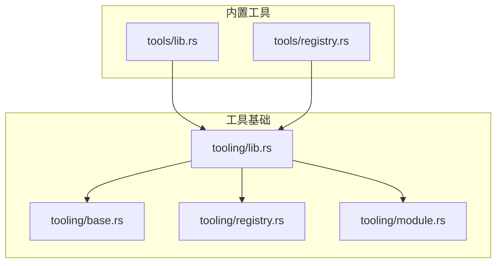
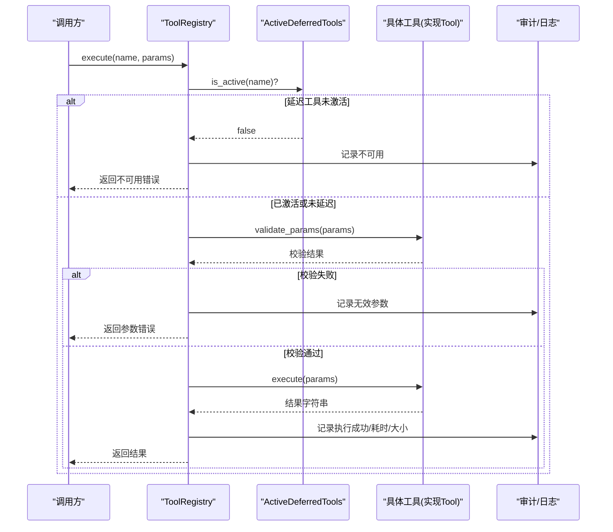
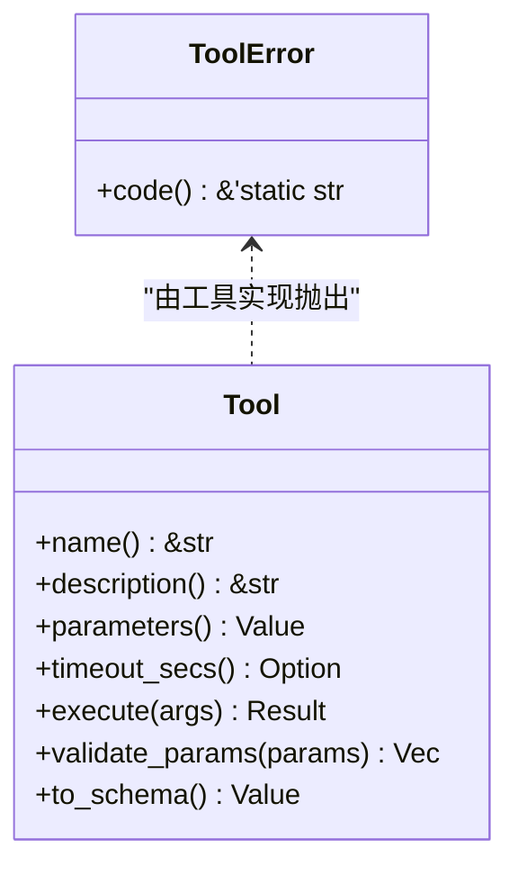
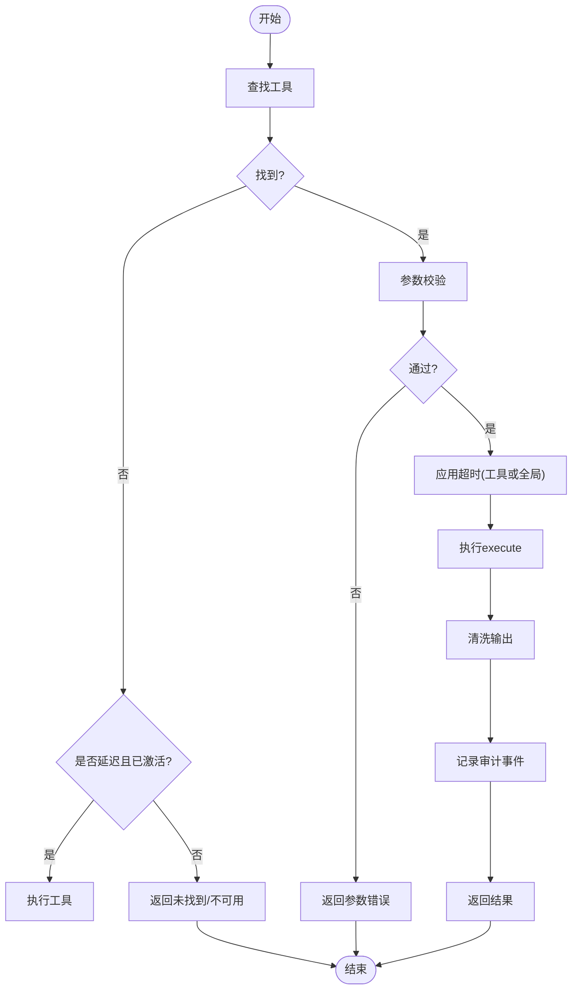
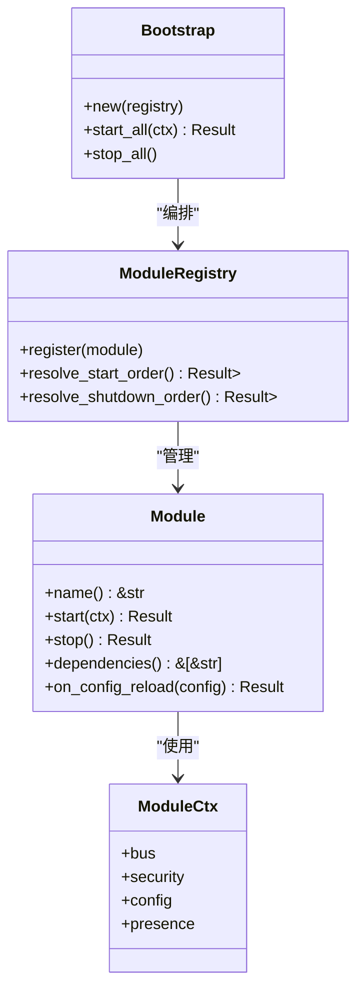
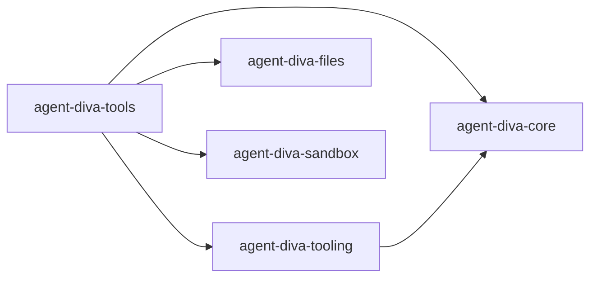

# 工具模块结构

<cite>
**本文引用的文件**
- [agent-diva-tooling/src/lib.rs](file://agent-diva-tooling/src/lib.rs)
- [agent-diva-tooling/src/base.rs](file://agent-diva-tooling/src/base.rs)
- [agent-diva-tooling/src/registry.rs](file://agent-diva-tooling/src/registry.rs)
- [agent-diva-tooling/src/module.rs](file://agent-diva-tooling/src/module.rs)
- [agent-diva-tools/src/lib.rs](file://agent-diva-tools/src/lib.rs)
- [agent-diva-tools/src/registry.rs](file://agent-diva-tools/src/registry.rs)
- [agent-diva-tools/Cargo.toml](file://agent-diva-tools/Cargo.toml)
- [agent-diva-tooling/Cargo.toml](file://agent-diva-tooling/Cargo.toml)
</cite>

## 目录
1. [简介](#简介)
2. [项目结构](#项目结构)
3. [核心组件](#核心组件)
4. [架构总览](#架构总览)
5. [详细组件分析](#详细组件分析)
6. [依赖分析](#依赖分析)
7. [性能考虑](#性能考虑)
8. [故障排查指南](#故障排查指南)
9. [结论](#结论)
10. [附录](#附录)

## 简介
本指南面向希望扩展或集成 Agent-Diva 工具系统的开发者，系统性地说明工具模块的组织方式、注册机制、配置与元数据约定、模块化开发模式以及版本、依赖与生命周期管理最佳实践。文档基于仓库中的 tooling 与 tools 两个核心 crate 进行解读，并提供可操作的流程图与时序图，帮助快速上手并避免常见陷阱。

## 项目结构
Agent-Diva 将“工具能力”与“工具实现”解耦：
- agent-diva-tooling：提供工具抽象、注册表、模块生命周期等基础设施（Trait、Registry、Module/Bootstrap）。
- agent-diva-tools：内置工具的具体实现与统一再导出，便于上层装配。

图表来源
- [agent-diva-tooling/src/lib.rs:1-14](file://agent-diva-tooling/src/lib.rs#L1-L14)
- [agent-diva-tooling/src/base.rs:1-123](file://agent-diva-tooling/src/base.rs#L1-L123)
- [agent-diva-tooling/src/registry.rs:1-800](file://agent-diva-tooling/src/registry.rs#L1-L800)
- [agent-diva-tooling/src/module.rs:1-725](file://agent-diva-tooling/src/module.rs#L1-L725)
- [agent-diva-tools/src/lib.rs:1-74](file://agent-diva-tools/src/lib.rs#L1-L74)
- [agent-diva-tools/src/registry.rs:1-4](file://agent-diva-tools/src/registry.rs#L1-L4)

章节来源
- [agent-diva-tooling/src/lib.rs:1-14](file://agent-diva-tooling/src/lib.rs#L1-L14)
- [agent-diva-tools/src/lib.rs:1-74](file://agent-diva-tools/src/lib.rs#L1-L74)

## 核心组件
- 工具抽象 Tool：定义 name、description、parameters、execute、validate_params、timeout_secs、to_schema 等接口，提供默认参数校验与 OpenAI 函数式 schema 转换。
- 工具注册表 ToolRegistry：集中管理工具实例、分区（Core/Deferred）、搜索激活、定义集生成、执行调度、审计与超时控制。
- 模块体系 Module/ModuleCtx/ModuleRegistry/Bootstrap：为系统服务提供统一的启动顺序解析、依赖注入、热重载钩子与优雅停机。

章节来源
- [agent-diva-tooling/src/base.rs:1-123](file://agent-diva-tooling/src/base.rs#L1-L123)
- [agent-diva-tooling/src/registry.rs:1-800](file://agent-diva-tooling/src/registry.rs#L1-L800)
- [agent-diva-tooling/src/module.rs:1-725](file://agent-diva-tooling/src/module.rs#L1-L725)

## 架构总览
下图展示了从调用方到具体工具执行的完整路径，包括注册、搜索激活、参数校验、执行与审计。

图表来源
- [agent-diva-tooling/src/registry.rs:535-699](file://agent-diva-tooling/src/registry.rs#L535-L699)
- [agent-diva-tooling/src/base.rs:26-60](file://agent-diva-tooling/src/base.rs#L26-L60)

## 详细组件分析

### 工具抽象与基类（Tool）
- 职责
  - 声明工具标识与描述，暴露 JSON Schema 参数定义。
  - 提供默认参数校验（required 字段检查）。
  - 支持可选的超时覆盖，便于交互式长任务。
  - 转换为 OpenAI function schema，便于模型侧发现与调用。
- 错误分类
  - 将工具错误映射到统一错误类别（超时、配置、致命等），便于上层策略处理。

图表来源
- [agent-diva-tooling/src/base.rs:1-123](file://agent-diva-tooling/src/base.rs#L1-L123)

章节来源
- [agent-diva-tooling/src/base.rs:1-123](file://agent-diva-tooling/src/base.rs#L1-L123)

### 工具注册表（ToolRegistry）
- 关键能力
  - 注册/注销工具，支持显式分区（Core/Deferred）。
  - 生成稳定排序的工具定义集（Core 前缀优先，Deferred 后缀受激活限制）。
  - 延迟工具搜索与激活：维护授权目录与活跃集合，限制单次激活数量。
  - 执行流程：查找工具 -> 校验参数 -> 设置超时 -> 执行 -> 清理输出 -> 审计。
  - 查询工具名列表、长度、是否存在等元信息。
- 设计要点
  - Core/Deferred 分区保证缓存友好性与可控暴露面。
  - 执行期审计事件包含工具名、耗时、结果大小与状态。
  - 输出经安全清洗后再返回。

图表来源
- [agent-diva-tooling/src/registry.rs:363-717](file://agent-diva-tooling/src/registry.rs#L363-L717)
- [agent-diva-tooling/src/base.rs:26-60](file://agent-diva-tooling/src/base.rs#L26-L60)

章节来源
- [agent-diva-tooling/src/registry.rs:1-800](file://agent-diva-tooling/src/registry.rs#L1-L800)

### 模块体系（Module/ModuleCtx/ModuleRegistry/Bootstrap）
- 职责
  - Module：统一的生命周期接口（name/start/stop/dependencies/on_config_reload）。
  - ModuleCtx：注入消息总线、安全策略、配置、用户在线状态。
  - ModuleRegistry：注册模块、拓扑排序（Kahn 算法）、检测循环与缺失依赖。
  - Bootstrap：按依赖顺序启动，失败时回滚；按逆序优雅停止。
- 使用建议
  - 每个子系统作为独立 Module 实现，明确 dependencies。
  - 在 on_config_reload 中响应配置热更新。
  - 通过 ModuleCtx 获取共享服务，避免全局变量。

图表来源
- [agent-diva-tooling/src/module.rs:15-82](file://agent-diva-tooling/src/module.rs#L15-L82)
- [agent-diva-tooling/src/module.rs:105-217](file://agent-diva-tooling/src/module.rs#L105-L217)
- [agent-diva-tooling/src/module.rs:219-293](file://agent-diva-tooling/src/module.rs#L219-L293)

章节来源
- [agent-diva-tooling/src/module.rs:1-725](file://agent-diva-tooling/src/module.rs#L1-L725)

### 内置工具与装配（tools crate）
- 组织方式
  - 每个工具一个模块文件，统一在 lib.rs 中再导出，便于上层按需引入。
  - registry.rs 仅做兼容重导出，实际注册逻辑在上层组装。
- 典型工具族
  - 文件系统读写、Shell 执行、Web 抓取/搜索、记忆增删改查、计划更新、MCP 工具桥接等。
- 装配建议
  - 将常用、稳定的工具以 Core 分区注册。
  - 将外部依赖强、可能动态启停的工具（如 MCP）以 Deferred 分区注册，并通过搜索激活。

章节来源
- [agent-diva-tools/src/lib.rs:1-74](file://agent-diva-tools/src/lib.rs#L1-L74)
- [agent-diva-tools/src/registry.rs:1-4](file://agent-diva-tools/src/registry.rs#L1-L4)

## 依赖分析
- 包间依赖
  - agent-diva-tools 依赖 agent-diva-tooling 与 core/files/sandbox 等运行时能力。
  - agent-diva-tooling 依赖 core、async-trait、serde、tokio、tracing 等基础库。
- 内部耦合
  - tools 对 tooling 的 Tool 与 ToolRegistry 存在强依赖。
  - module 体系与 core 的安全策略、配置、消息总线紧密协作。

图表来源
- [agent-diva-tools/Cargo.toml:1-60](file://agent-diva-tools/Cargo.toml#L1-L60)
- [agent-diva-tooling/Cargo.toml:1-24](file://agent-diva-tooling/Cargo.toml#L1-L24)

章节来源
- [agent-diva-tools/Cargo.toml:1-60](file://agent-diva-tools/Cargo.toml#L1-L60)
- [agent-diva-tooling/Cargo.toml:1-24](file://agent-diva-tooling/Cargo.toml#L1-L24)

## 性能考虑
- 工具定义集稳定性
  - Core/Deferred 分区确保缓存友好的前缀稳定，减少模型端 schema 抖动。
  - 定义集生成时对 JSON 对象键进行规范化排序，保证字节级稳定。
- 延迟工具激活上限
  - 单次搜索最多激活固定数量的延迟工具，避免 provider 工具数组膨胀。
- 执行超时与审计
  - 工具级或全局超时保护，防止长时间阻塞。
  - 审计事件记录耗时、结果大小与状态，便于监控与容量规划。
- 输出清洗
  - 执行结果在返回前进行安全清洗，降低敏感信息泄露风险。

章节来源
- [agent-diva-tooling/src/registry.rs:23-43](file://agent-diva-tooling/src/registry.rs#L23-L43)
- [agent-diva-tooling/src/registry.rs:327-355](file://agent-diva-tooling/src/registry.rs#L327-L355)
- [agent-diva-tooling/src/registry.rs:535-699](file://agent-diva-tooling/src/registry.rs#L535-L699)

## 故障排查指南
- 工具未找到
  - 现象：执行时报错“未找到”。
  - 排查：确认工具已注册且名称一致；若为延迟工具，需先搜索激活。
- 参数校验失败
  - 现象：返回“无效参数”。
  - 排查：对照 parameters 定义的 required 与类型约束修正入参。
- 工具不可用（延迟工具）
  - 现象：返回“不可用”。
  - 排查：检查当前会话是否已激活该工具；必要时重新搜索。
- 执行超时
  - 现象：返回“超时”。
  - 排查：调整工具 timeout_secs 或全局超时；优化工具实现。
- 模块启动失败
  - 现象：Bootstrap 报错“启动失败”。
  - 排查：检查依赖声明是否正确；查看已启动模块的回滚日志。

章节来源
- [agent-diva-tooling/src/registry.rs:535-699](file://agent-diva-tooling/src/registry.rs#L535-L699)
- [agent-diva-tooling/src/base.rs:63-123](file://agent-diva-tooling/src/base.rs#L63-L123)
- [agent-diva-tooling/src/module.rs:219-293](file://agent-diva-tooling/src/module.rs#L219-L293)

## 结论
Agent-Diva 的工具体系通过清晰的抽象与注册机制，实现了工具能力的标准化接入与统一管理。Core/Deferred 分区与延迟激活保障了模型端的稳定性与可扩展性；模块体系提供了健壮的生命周期管理与依赖编排。遵循本文的规范与最佳实践，可以快速构建、集成与维护高质量的工具生态。

## 附录

### 如何注册自定义工具
- 步骤
  1) 实现 Tool Trait：提供 name、description、parameters、execute、可选 timeout_secs。
  2) 选择分区：稳定工具使用 register（Core），外部/动态工具使用 register_in_partition（Deferred）。
  3) 装配到 Registry：在应用启动时将工具加入 ToolRegistry。
  4) 如需搜索激活：使用 search_catalog/search_deferred 将工具纳入活跃集合。
- 参考路径
  - 工具抽象与错误：[base.rs:1-123](file://agent-diva-tooling/src/base.rs#L1-L123)
  - 注册与执行：[registry.rs:363-717](file://agent-diva-tooling/src/registry.rs#L363-L717)

章节来源
- [agent-diva-tooling/src/base.rs:1-123](file://agent-diva-tooling/src/base.rs#L1-L123)
- [agent-diva-tooling/src/registry.rs:363-717](file://agent-diva-tooling/src/registry.rs#L363-L717)

### 工具配置文件格式与选项
- 元数据定义
  - 工具描述与名称：由 Tool::name/description 提供。
  - 参数 Schema：JSON Schema 形式，至少包含 type/object、properties、required 等关键字段。
- 依赖声明
  - 工具本身不直接声明外部依赖；依赖通过 Cargo 依赖与运行时能力（如网络、沙箱）体现。
- 超时与执行
  - 可通过 Tool::timeout_secs 覆盖默认全局超时。
- 参考路径
  - 参数校验与 Schema 转换：[base.rs:26-60](file://agent-diva-tooling/src/base.rs#L26-L60)
  - 执行与审计：[registry.rs:535-699](file://agent-diva-tooling/src/registry.rs#L535-L699)

章节来源
- [agent-diva-tooling/src/base.rs:26-60](file://agent-diva-tooling/src/base.rs#L26-L60)
- [agent-diva-tooling/src/registry.rs:535-699](file://agent-diva-tooling/src/registry.rs#L535-L699)

### 模块化开发模式与拆分建议
- 将复杂工具拆分为多个子模块：
  - 按功能域划分（如文件、记忆、计划、MCP）。
  - 每个子模块实现独立的 Tool，并在 tools/lib.rs 中统一再导出。
- 使用 Module 体系组织服务：
  - 每个子系统作为 Module，声明 dependencies，由 Bootstrap 编排启动与停止。
- 参考路径
  - 工具再导出：[tools/lib.rs:1-74](file://agent-diva-tools/src/lib.rs#L1-L74)
  - 模块生命周期：[module.rs:15-82](file://agent-diva-tooling/src/module.rs#L15-L82)

章节来源
- [agent-diva-tools/src/lib.rs:1-74](file://agent-diva-tools/src/lib.rs#L1-L74)
- [agent-diva-tooling/src/module.rs:15-82](file://agent-diva-tooling/src/module.rs#L15-L82)

### 版本、依赖与生命周期管理最佳实践
- 版本管理
  - 保持 tooling 与 tools 的版本对齐，避免 ABI 不一致。
  - 变更 Tool 接口时需评估下游影响，尽量向后兼容。
- 依赖管理
  - 工具的外部依赖通过 Cargo 声明；网络/沙箱能力由 core/sandbox 提供。
  - 谨慎引入重型依赖，优先复用 core 提供的通用能力。
- 生命周期
  - 使用 Module 体系管理启动/停止顺序，避免资源竞争。
  - 在 on_config_reload 中响应配置变化，保持运行态一致性。
- 参考路径
  - 包依赖：[tools Cargo.toml:1-60](file://agent-diva-tools/Cargo.toml#L1-L60)、[tooling Cargo.toml:1-24](file://agent-diva-tooling/Cargo.toml#L1-L24)
  - 生命周期：[module.rs](file://agent-diva-tooling/src/module.rs:219-293)

章节来源
- [agent-diva-tools/Cargo.toml:1-60](file://agent-diva-tools/Cargo.toml#L1-L60)
- [agent-diva-tooling/Cargo.toml:1-24](file://agent-diva-tooling/Cargo.toml#L1-L24)
- [agent-diva-tooling/src/module.rs:219-293](file://agent-diva-tooling/src/module.rs#L219-L293)