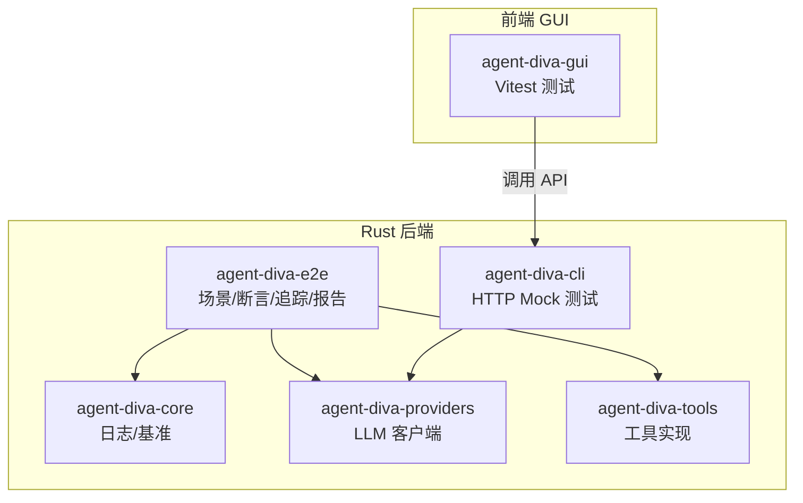
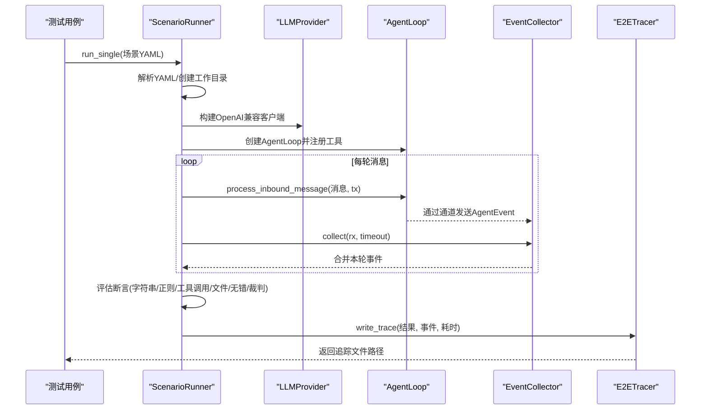
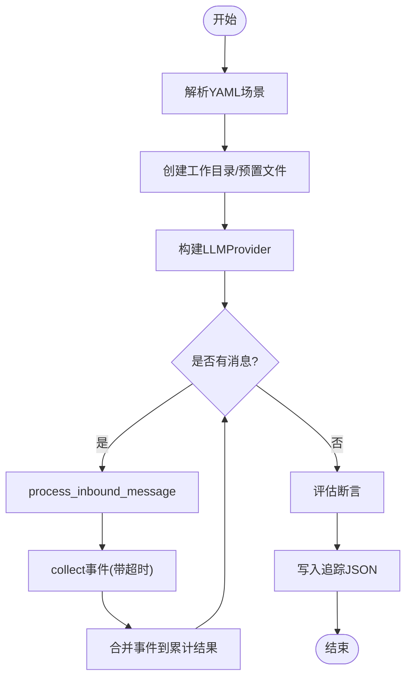
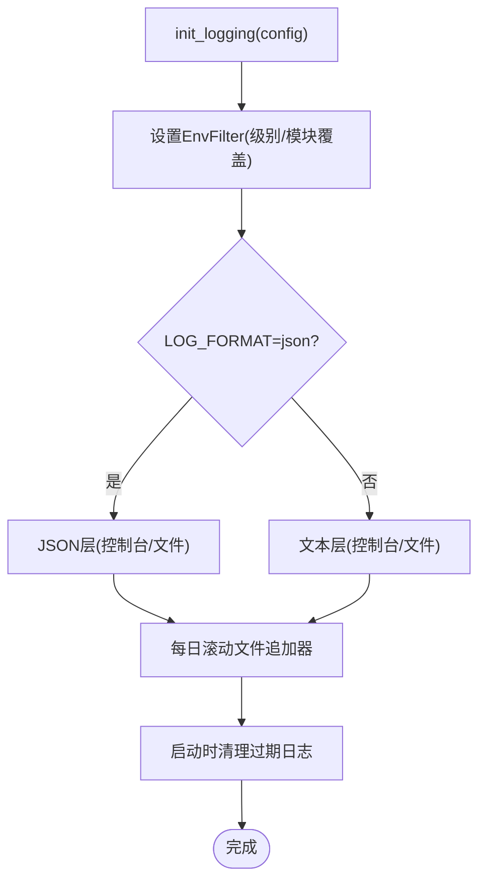
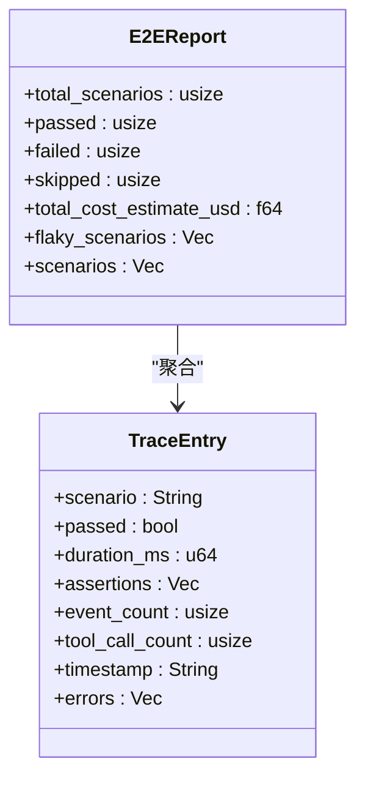
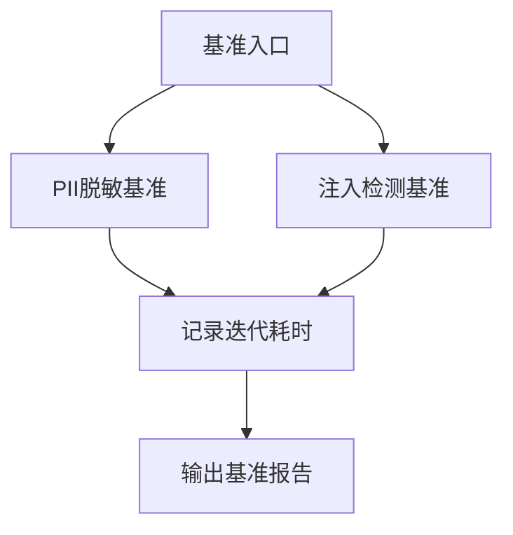
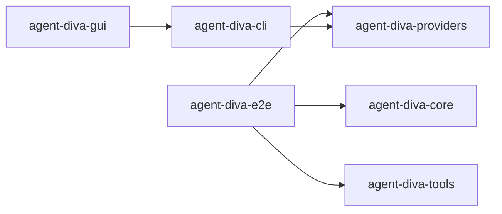

# 工具测试与调试

<cite>
**本文引用的文件**
- [agent-diva-core/Cargo.toml](file://agent-diva-core/Cargo.toml)
- [agent-diva-e2e/Cargo.toml](file://agent-diva-e2e/Cargo.toml)
- [agent-diva-cli/Cargo.toml](file://agent-diva-cli/Cargo.toml)
- [agent-diva-gui/vitest.config.ts](file://agent-diva-gui/vitest.config.ts)
- [agent-diva-core/src/logging.rs](file://agent-diva-core/src/logging.rs)
- [agent-diva-e2e/src/runner.rs](file://agent-diva-e2e/src/runner.rs)
- [agent-diva-e2e/src/types.rs](file://agent-diva-e2e/src/types.rs)
- [agent-diva-e2e/src/tracer.rs](file://agent-diva-e2e/src/tracer.rs)
- [agent-diva-e2e/src/report.rs](file://agent-diva-e2e/src/report.rs)
- [agent-diva-core/benches/performance.rs](file://agent-diva-core/benches/performance.rs)
</cite>

## 目录
1. [简介](#简介)
2. [项目结构](#项目结构)
3. [核心组件](#核心组件)
4. [架构总览](#架构总览)
5. [详细组件分析](#详细组件分析)
6. [依赖关系分析](#依赖关系分析)
7. [性能考量](#性能考量)
8. [故障排查指南](#故障排查指南)
9. [结论](#结论)
10. [附录](#附录)

## 简介
本指南面向 Agent-Diva 项目的“工具测试与调试”，覆盖单元测试、集成测试、端到端（E2E）测试、Mock 策略、异步测试处理、日志与追踪、错误定位、性能基准以及常见问题的诊断与排障。文档基于仓库中实际的测试框架、日志系统、基准脚本和 E2E 运行器进行说明，帮助读者快速建立可复现、可观测、可回归的测试与调试体系。

## 项目结构
Agent-Diva 采用多 crate 模块化组织，测试与调试能力分布在多个子项目中：
- agent-diva-core：提供日志初始化、清理、基准（Criterion）等基础设施
- agent-diva-e2e：端到端场景编排、断言、追踪与报告生成
- agent-diva-cli：命令行应用，使用 wiremock/mockito 进行 HTTP 模拟测试
- agent-diva-gui：前端 GUI，使用 Vitest 进行单元与组件测试
- 其他模块（如 providers、tools、manager 等）各自包含单元测试与集成测试

**图表来源**
- [agent-diva-core/Cargo.toml:1-70](file://agent-diva-core/Cargo.toml#L1-L70)
- [agent-diva-e2e/Cargo.toml:1-31](file://agent-diva-e2e/Cargo.toml#L1-L31)
- [agent-diva-cli/Cargo.toml:1-93](file://agent-diva-cli/Cargo.toml#L1-L93)
- [agent-diva-gui/vitest.config.ts:1-19](file://agent-diva-gui/vitest.config.ts#L1-L19)

**章节来源**
- [agent-diva-core/Cargo.toml:1-70](file://agent-diva-core/Cargo.toml#L1-L70)
- [agent-diva-e2e/Cargo.toml:1-31](file://agent-diva-e2e/Cargo.toml#L1-L31)
- [agent-diva-cli/Cargo.toml:1-93](file://agent-diva-cli/Cargo.toml#L1-L93)
- [agent-diva-gui/vitest.config.ts:1-19](file://agent-diva-gui/vitest.config.ts#L1-L19)

## 核心组件
- E2E 场景运行器：负责发现 YAML 场景、构建 LLM Provider、创建 AgentLoop、逐轮处理消息、收集事件、评估断言、输出追踪与报告
- 日志系统：统一初始化 tracing，支持 JSON/文本格式、按日滚动、保留天数清理
- 基准测试：使用 Criterion 对敏感信息脱敏与注入检测等热点路径进行性能测量
- GUI 测试：Vitest + happy-dom 环境，支持组件与逻辑的单元级验证

**章节来源**
- [agent-diva-e2e/src/runner.rs:1-599](file://agent-diva-e2e/src/runner.rs#L1-L599)
- [agent-diva-core/src/logging.rs:1-250](file://agent-diva-core/src/logging.rs#L1-L250)
- [agent-diva-core/benches/performance.rs:1-50](file://agent-diva-core/benches/performance.rs#L1-L50)
- [agent-diva-gui/vitest.config.ts:1-19](file://agent-diva-gui/vitest.config.ts#L1-L19)

## 架构总览
E2E 测试从 YAML 场景出发，驱动真实或兼容的 LLM 调用，捕获事件流并执行断言；同时生成结构化追踪文件，便于回溯与报告聚合。

**图表来源**
- [agent-diva-e2e/src/runner.rs:137-302](file://agent-diva-e2e/src/runner.rs#L137-L302)
- [agent-diva-e2e/src/tracer.rs:111-217](file://agent-diva-e2e/src/tracer.rs#L111-L217)

## 详细组件分析

### E2E 场景运行器（ScenarioRunner）
- 场景发现：扫描配置目录下的 .yaml/.yml 文件并按字典序执行
- 工作空间：支持临时目录或指定 working_dir，并在 setup 阶段创建文件
- 提供者构建：基于 OpenAiCompatibleClient 构造 LLMProvider
- 消息处理：逐条 InboundMessage 进入 AgentLoop，通过 mpsc 通道收集 AgentEvent
- 断言评估：支持响应包含/匹配、工具调用计数、文件存在性、无错误、裁判模式
- 追踪写入：将场景名、是否通过、断言结果、事件、耗时写入 JSON 追踪文件

**图表来源**
- [agent-diva-e2e/src/runner.rs:137-302](file://agent-diva-e2e/src/runner.rs#L137-L302)

**章节来源**
- [agent-diva-e2e/src/runner.rs:1-599](file://agent-diva-e2e/src/runner.rs#L1-L599)
- [agent-diva-e2e/src/types.rs:1-297](file://agent-diva-e2e/src/types.rs#L1-L297)

### 日志系统与清理
- 初始化：读取环境变量或配置决定日志级别与格式（JSON/文本），附加目标、线程、文件、行号
- 输出：控制台可选输出 + 文件按日滚动（gateway.log.*）
- 清理：根据 retention_days 删除过期日志（gateway/gui 前缀）
- 测试覆盖：默认保留期、自定义值、零保留、不存在目录、阈值计算、仅删除过期 gateway 日志、GUI 日志清理

**图表来源**
- [agent-diva-core/src/logging.rs:10-114](file://agent-diva-core/src/logging.rs#L10-L114)

**章节来源**
- [agent-diva-core/src/logging.rs:1-250](file://agent-diva-core/src/logging.rs#L1-L250)

### 追踪与报告
- 追踪：每个场景运行后写入 JSON 追踪文件，包含场景名、是否通过、断言列表、事件数量、工具调用次数、时间戳等
- 报告：聚合 trace 目录下的所有 JSON，统计通过/失败/跳过、估算成本、识别不稳定场景（≥3次且通过率<80%）

**图表来源**
- [agent-diva-e2e/src/report.rs:1-34](file://agent-diva-e2e/src/report.rs#L1-L34)
- [agent-diva-e2e/src/tracer.rs:111-217](file://agent-diva-e2e/src/tracer.rs#L111-L217)

**章节来源**
- [agent-diva-e2e/src/report.rs:1-34](file://agent-diva-e2e/src/report.rs#L1-L34)
- [agent-diva-e2e/src/tracer.rs:111-217](file://agent-diva-e2e/src/tracer.rs#L111-L217)

### 基准测试（Criterion）
- 热点路径：PII 脱敏、注入检测
- 输入规模：小样本安全输入与大样本含敏感数据输入
- 指标：迭代次数与耗时对比，用于回归监控

**图表来源**
- [agent-diva-core/benches/performance.rs:1-50](file://agent-diva-core/benches/performance.rs#L1-L50)

**章节来源**
- [agent-diva-core/benches/performance.rs:1-50](file://agent-diva-core/benches/performance.rs#L1-L50)

### GUI 测试（Vitest）
- 环境：happy-dom，全局断言可用
- 范围：src/**/*.{test,spec}.ts
- 用途：组件与业务逻辑的单元级验证

**章节来源**
- [agent-diva-gui/vitest.config.ts:1-19](file://agent-diva-gui/vitest.config.ts#L1-L19)

## 依赖关系分析
- E2E 依赖 core、providers、tools 以构建完整 Agent 运行链路
- CLI 依赖 providers 并通过 wiremock/mockito 模拟外部 HTTP 服务
- GUI 通过 Vite/Vitest 进行前端测试，运行时依赖 Tauri/Rust 后端接口

**图表来源**
- [agent-diva-e2e/Cargo.toml:1-31](file://agent-diva-e2e/Cargo.toml#L1-L31)
- [agent-diva-cli/Cargo.toml:1-93](file://agent-diva-cli/Cargo.toml#L1-L93)

**章节来源**
- [agent-diva-e2e/Cargo.toml:1-31](file://agent-diva-e2e/Cargo.toml#L1-L31)
- [agent-diva-cli/Cargo.toml:1-93](file://agent-diva-cli/Cargo.toml#L1-L93)

## 性能考量
- 使用 Criterion 对关键路径进行基准测试，关注大输入与攻击输入的耗时变化
- E2E 场景建议设置合理超时（单场景与最大超时），避免长响应阻塞
- 日志滚动与清理策略可减少磁盘占用，提升长期运行的稳定性

[本节为通用指导，不直接分析具体文件]

## 故障排查指南
- 日志问题
  - 检查日志级别与格式环境变量（RUST_LOG、LOG_FORMAT）
  - 确认日志目录与保留天数配置，必要时手动清理旧日志
  - 若控制台无输出，检查 init_logging_with_terminal_output 的开关
- E2E 失败
  - 查看追踪 JSON 中的断言详情与错误列表
  - 检查场景 YAML 的 messages、assertions、setup 配置是否正确
  - 对于裁判模式，确认 judge_model 配置有效
- CLI 网络问题
  - 本地回环地址请求应绕过系统代理，避免 502
  - 使用 wiremock/mockito 固定外部依赖行为，确保可重复性
- 基准异常
  - 确认输入规模与热点函数一致
  - 多次运行观察方差，排除系统噪声

**章节来源**
- [agent-diva-core/src/logging.rs:10-114](file://agent-diva-core/src/logging.rs#L10-L114)
- [agent-diva-e2e/src/runner.rs:137-302](file://agent-diva-e2e/src/runner.rs#L137-L302)
- [agent-diva-cli/Cargo.toml:62-66](file://agent-diva-cli/Cargo.toml#L62-L66)

## 结论
本项目提供了完善的测试与调试基础设施：E2E 场景化驱动、结构化追踪与报告、统一的日志与清理机制、基准测试与 GUI 单元测试。结合 Mock 与异步通道管理，能够稳定地验证工具链与外部交互。建议在生产与 CI 中持续使用这些能力，保障质量与可观测性。

## 附录

### 单元测试方法（Rust）
- 使用 crate 内 #[cfg(test)] 模块编写单测
- 借助 tempfile 隔离文件系统状态
- 针对异步代码使用 tokio-test 与 tokio::time::timeout 控制等待与超时
- 示例参考：E2E Runner 内部对 merge_collected_events、build_provider、discover_scenarios 的单测

**章节来源**
- [agent-diva-e2e/src/runner.rs:390-599](file://agent-diva-e2e/src/runner.rs#L390-L599)

### Mock 对象的使用
- CLI 层使用 wiremock 与 mockito 模拟 HTTP 服务，避免真实网络依赖
- 在 E2E 中可通过配置 api_base 指向本地或测试服务器，配合固定响应

**章节来源**
- [agent-diva-cli/Cargo.toml:62-66](file://agent-diva-cli/Cargo.toml#L62-L66)

### 异步测试的处理
- 使用 mpsc 通道传递 AgentEvent，并在每轮结束后 drop(tx)，确保 EventCollector 能正常退出
- 为长响应场景设置更长的超时（例如 75s），避免误判超时失败

**章节来源**
- [agent-diva-e2e/src/runner.rs:225-259](file://agent-diva-e2e/src/runner.rs#L225-L259)

### 集成测试策略（与外部系统交互）
- 通过 E2E 场景 YAML 描述多轮对话与工具调用，驱动真实或兼容的 LLM 服务
- 使用裁判断言（judge）进行内容质量评估，适用于难以用正则精确匹配的复杂场景
- 通过追踪文件与报告进行回归分析与不稳定场景识别

**章节来源**
- [agent-diva-e2e/src/types.rs:76-129](file://agent-diva-e2e/src/types.rs#L76-L129)
- [agent-diva-e2e/src/report.rs:1-34](file://agent-diva-e2e/src/report.rs#L1-L34)

### 调试技巧与工具
- 日志：统一初始化，支持 JSON/文本、按日滚动、保留天数清理
- 追踪：E2E 运行后生成 JSON 追踪，便于回放与定位
- 报告：聚合多场景结果，自动标记不稳定场景

**章节来源**
- [agent-diva-core/src/logging.rs:10-114](file://agent-diva-core/src/logging.rs#L10-L114)
- [agent-diva-e2e/src/tracer.rs:111-217](file://agent-diva-e2e/src/tracer.rs#L111-L217)
- [agent-diva-e2e/src/report.rs:1-34](file://agent-diva-e2e/src/report.rs#L1-L34)

### 测试用例设计模式
- 边界条件：空消息、超长响应、多轮对话、工具调用计数最小值
- 异常处理：no_errors 断言、错误列表校验、裁判断言兜底
- 性能基准：PII 脱敏与注入检测在不同输入规模下的耗时对比

**章节来源**
- [agent-diva-e2e/src/types.rs:76-129](file://agent-diva-e2e/src/types.rs#L76-L129)
- [agent-diva-core/benches/performance.rs:1-50](file://agent-diva-core/benches/performance.rs#L1-L50)