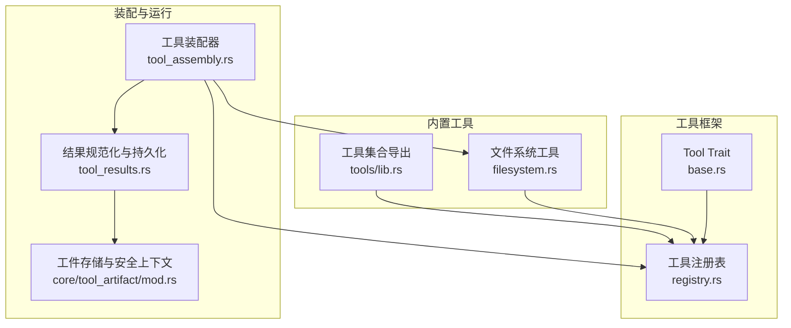
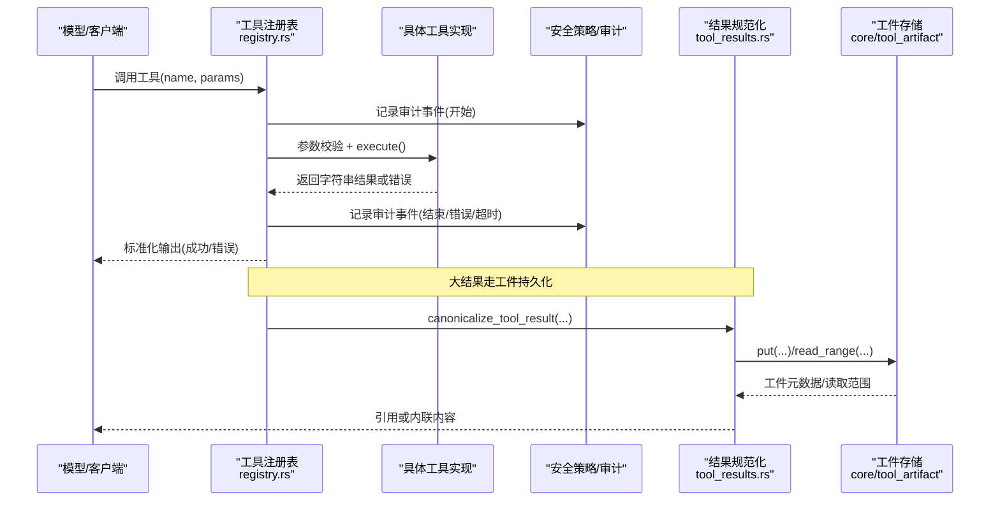
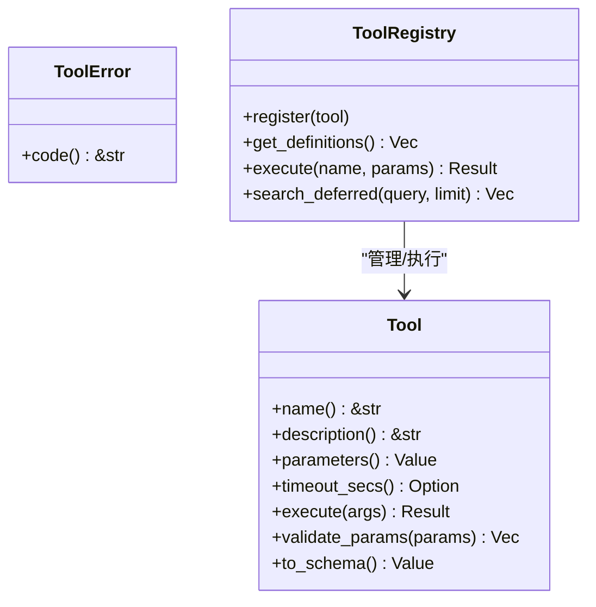
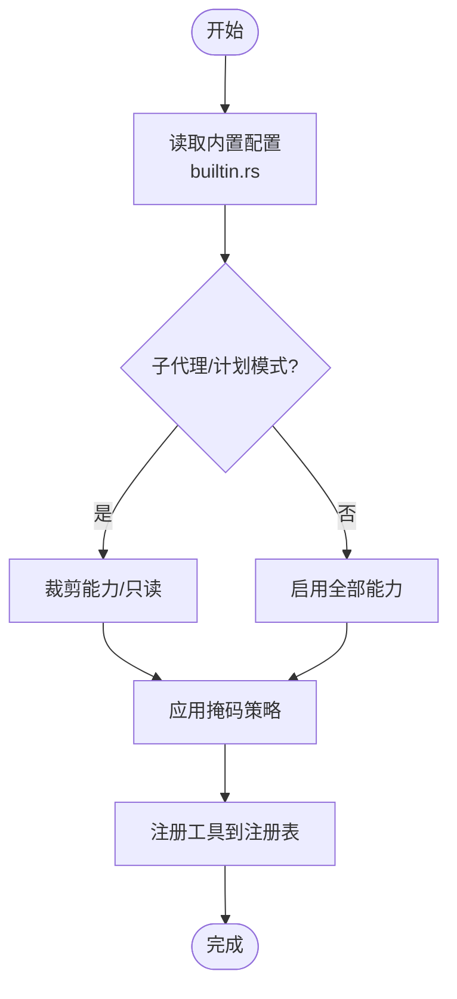
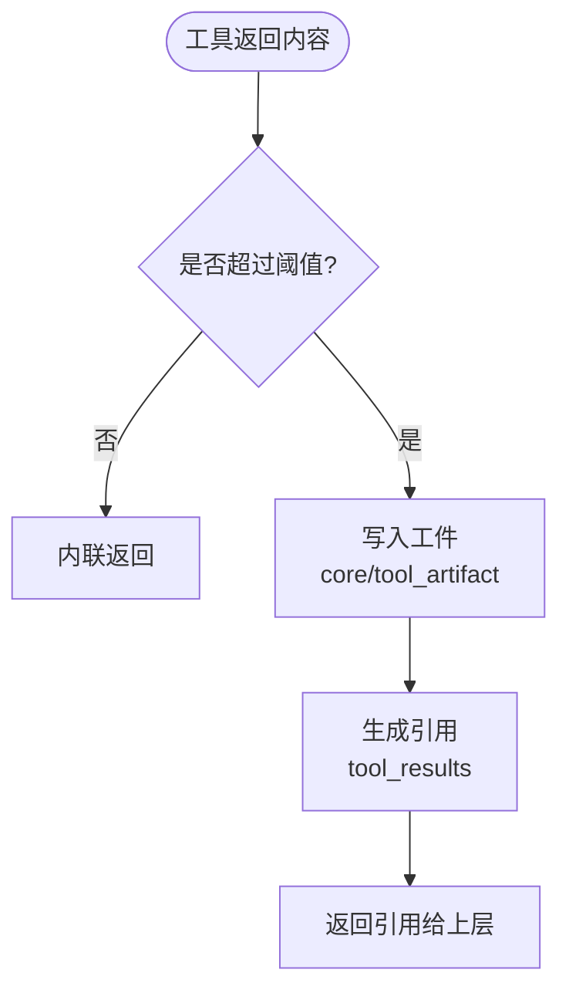
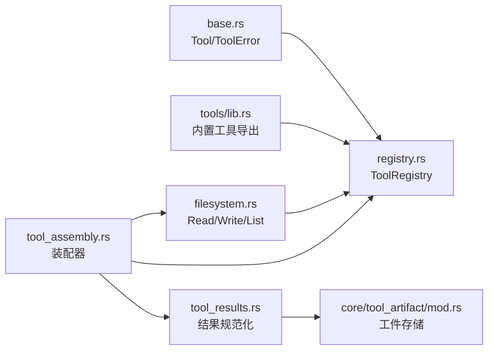

# 自定义工具开发

<cite>
**本文引用的文件**
- [agent-diva-tooling/src/base.rs](file://agent-diva-tooling/src/base.rs)
- [agent-diva-tooling/src/registry.rs](file://agent-diva-tooling/src/registry.rs)
- [agent-diva-tooling/src/lib.rs](file://agent-diva-tooling/src/lib.rs)
- [agent-diva-tools/src/lib.rs](file://agent-diva-tools/src/lib.rs)
- [agent-diva-tools/src/filesystem.rs](file://agent-diva-tools/src/filesystem.rs)
- [agent-diva-agent/src/tool_assembly.rs](file://agent-diva-agent/src/tool_assembly.rs)
- [agent-diva-agent/src/tool_results.rs](file://agent-diva-agent/src/tool_results.rs)
- [agent-diva-core/src/tool_artifact/mod.rs](file://agent-diva-core/src/tool_artifact/mod.rs)
- [agent-diva-agent/src/tool_config/builtin.rs](file://agent-diva-agent/src/tool_config/builtin.rs)
- [scripts/e2e/scenarios/tool_call.yaml](file://scripts/e2e/scenarios/tool_call.yaml)
- [agent-diva-e2e/tests/tool_call_test.rs](file://agent-diva-e2e/tests/tool_call_test.rs)
</cite>

## 目录
1. [简介](#简介)
2. [项目结构](#项目结构)
3. [核心组件](#核心组件)
4. [架构总览](#架构总览)
5. [详细组件分析](#详细组件分析)
6. [依赖关系分析](#依赖关系分析)
7. [性能考虑](#性能考虑)
8. [故障排查指南](#故障排查指南)
9. [结论](#结论)
10. [附录](#附录)

## 简介
本指南面向希望在 Agent-Diva 中开发“自定义工具”的工程师。内容覆盖：
- 工具接口实现要求：参数定义、返回值处理、错误码规范
- 工具模块的组织方式：配置与代码组织
- 从零到一创建自定义工具的完整示例
- 测试方法与调试技巧
- 打包与分发机制
- 安全性与权限最小化原则
- 性能优化与错误处理最佳实践

## 项目结构
Agent-Diva 的工具系统由多个 crate 协作完成：
- agent-diva-tooling：定义工具基础 trait、错误类型、注册表与延迟激活机制
- agent-diva-tools：内置工具实现（文件系统、网络、记忆等）
- agent-diva-agent：工具装配器，按配置与安全策略组装可用工具集
- agent-diva-core：提供安全策略、工件存储、审计等基础设施
- e2e 测试：端到端场景验证工具调用链路

**图示来源**
- [agent-diva-tooling/src/base.rs:1-123](file://agent-diva-tooling/src/base.rs#L1-L123)
- [agent-diva-tooling/src/registry.rs:1-800](file://agent-diva-tooling/src/registry.rs#L1-L800)
- [agent-diva-tools/src/filesystem.rs:1-200](file://agent-diva-tools/src/filesystem.rs#L1-L200)
- [agent-diva-tools/src/lib.rs:1-74](file://agent-diva-tools/src/lib.rs#L1-L74)
- [agent-diva-agent/src/tool_assembly.rs:1-800](file://agent-diva-agent/src/tool_assembly.rs#L1-L800)
- [agent-diva-agent/src/tool_results.rs:1-279](file://agent-diva-agent/src/tool_results.rs#L1-L279)
- [agent-diva-core/src/tool_artifact/mod.rs:1-678](file://agent-diva-core/src/tool_artifact/mod.rs#L1-L678)

**章节来源**
- [agent-diva-tooling/src/lib.rs:1-14](file://agent-diva-tooling/src/lib.rs#L1-L14)
- [agent-diva-tools/src/lib.rs:1-74](file://agent-diva-tools/src/lib.rs#L1-L74)
- [agent-diva-agent/src/tool_assembly.rs:1-800](file://agent-diva-agent/src/tool_assembly.rs#L1-L800)

## 核心组件
- 工具基础接口 Tool：定义 name、description、parameters、execute、可选 timeout_secs、参数校验与 OpenAI 函数 schema 转换
- 工具错误 ToolError：包含无效参数、执行失败、超时、IO 错误、工具不可用等稳定错误码
- 工具注册表 ToolRegistry：管理工具注册、查询、执行、延迟激活、审计与输出标准化
- 工具装配器 ToolAssembly：根据配置与安全策略组装可用工具集，支持子代理模式、计划阶段限制、掩码策略等
- 结果规范化与工件存储：将大结果持久化为工件并返回引用，保证提示词体积可控且可追溯

**章节来源**
- [agent-diva-tooling/src/base.rs:1-123](file://agent-diva-tooling/src/base.rs#L1-L123)
- [agent-diva-tooling/src/registry.rs:1-800](file://agent-diva-tooling/src/registry.rs#L1-L800)
- [agent-diva-agent/src/tool_assembly.rs:1-800](file://agent-diva-agent/src/tool_assembly.rs#L1-L800)
- [agent-diva-agent/src/tool_results.rs:1-279](file://agent-diva-agent/src/tool_results.rs#L1-L279)
- [agent-diva-core/src/tool_artifact/mod.rs:1-678](file://agent-diva-core/src/tool_artifact/mod.rs#L1-L678)

## 架构总览
下图展示了从模型调用到工具执行、结果规范化与工件存储的完整流程。

**图示来源**
- [agent-diva-tooling/src/registry.rs:534-699](file://agent-diva-tooling/src/registry.rs#L534-L699)
- [agent-diva-agent/src/tool_results.rs:20-89](file://agent-diva-agent/src/tool_results.rs#L20-L89)
- [agent-diva-core/src/tool_artifact/mod.rs:229-329](file://agent-diva-core/src/tool_artifact/mod.rs#L229-L329)

## 详细组件分析

### 工具接口与错误规范
- 参数定义：通过 parameters() 返回 JSON Schema；默认实现会校验 required 字段
- 返回值：execute() 返回字符串；注册表会对输出进行安全清洗
- 错误码：ToolError::code() 提供稳定机器可读的错误码，如 invalid_params、execution_failed、timeout、io_error、tool_unavailable
- 超时控制：可通过 timeout_secs() 为特定工具设置更长超时

**图示来源**
- [agent-diva-tooling/src/base.rs:1-123](file://agent-diva-tooling/src/base.rs#L1-L123)
- [agent-diva-tooling/src/registry.rs:362-717](file://agent-diva-tooling/src/registry.rs#L362-L717)

**章节来源**
- [agent-diva-tooling/src/base.rs:1-123](file://agent-diva-tooling/src/base.rs#L1-L123)

### 工具装配与配置
- 使用 ToolAssembly 构建工具集，依据 BuiltInToolsConfig 开关能力（文件系统、shell、web、memory、cron、mcp 等）
- 支持子代理模式（for_subagent）裁剪能力，避免递归与控制平面工具暴露
- 支持计划阶段限制（PlanPhase），在 Plan 模式下仅允许只读工具
- 支持掩码策略（MaskFile/ToolPolicy）进一步过滤工具列表
- 支持 MCP 工具动态加载与延迟激活

**图示来源**
- [agent-diva-agent/src/tool_assembly.rs:255-616](file://agent-diva-agent/src/tool_assembly.rs#L255-L616)
- [agent-diva-agent/src/tool_config/builtin.rs:1-159](file://agent-diva-agent/src/tool_config/builtin.rs#L1-L159)

**章节来源**
- [agent-diva-agent/src/tool_assembly.rs:1-800](file://agent-diva-agent/src/tool_assembly.rs#L1-L800)
- [agent-diva-agent/src/tool_config/builtin.rs:1-159](file://agent-diva-agent/src/tool_config/builtin.rs#L1-L159)

### 结果规范化与工件存储
- 小结果直接内联；超过阈值的结果持久化为工件，返回引用以便按需读取
- 工件存储绑定工作区与会话，具备 TTL、容量上限、完整性校验（SHA256）、范围读取限制
- 失败时不会伪装成成功工件，而是明确错误码

**图示来源**
- [agent-diva-agent/src/tool_results.rs:20-89](file://agent-diva-agent/src/tool_results.rs#L20-L89)
- [agent-diva-core/src/tool_artifact/mod.rs:229-329](file://agent-diva-core/src/tool_artifact/mod.rs#L229-L329)

**章节来源**
- [agent-diva-agent/src/tool_results.rs:1-279](file://agent-diva-agent/src/tool_results.rs#L1-L279)
- [agent-diva-core/src/tool_artifact/mod.rs:1-678](file://agent-diva-core/src/tool_artifact/mod.rs#L1-L678)

### 自定义工具开发示例（从零开始）
步骤概览：
1. 新建模块并实现 Tool trait
   - 定义 name、description、parameters（JSON Schema）
   - 实现 execute()，返回字符串或错误
   - 如需交互等待，可重写 timeout_secs()
2. 注册到工具集
   - 在 ToolAssembly 中添加 with_tool()/with_tools() 或通过配置启用
   - 若希望延迟激活，使用 register_in_partition(Deferred)
3. 配置与权限
   - 通过 BuiltInToolsConfig 控制能力开关
   - 结合 SecurityPolicy 与工作区限制，确保路径与操作受控
4. 测试与调试
   - 使用 e2e 场景脚本验证工具调用
   - 查看注册表工具列表与审计日志定位问题
5. 打包与分发
   - 作为 workspace member 编译进二进制
   - 通过配置启用/禁用，配合掩码策略做白名单/黑名单控制

参考路径：
- 工具接口与错误：[agent-diva-tooling/src/base.rs:1-123](file://agent-diva-tooling/src/base.rs#L1-L123)
- 工具注册与执行：[agent-diva-tooling/src/registry.rs:452-699](file://agent-diva-tooling/src/registry.rs#L452-L699)
- 装配与配置：[agent-diva-agent/src/tool_assembly.rs:162-225](file://agent-diva-agent/src/tool_assembly.rs#L162-L225), [agent-diva-agent/src/tool_config/builtin.rs:1-159](file://agent-diva-agent/src/tool_config/builtin.rs#L1-L159)
- 结果与工件：[agent-diva-agent/src/tool_results.rs:20-89](file://agent-diva-agent/src/tool_results.rs#L20-L89), [agent-diva-core/src/tool_artifact/mod.rs:229-329](file://agent-diva-core/src/tool_artifact/mod.rs#L229-L329)

**章节来源**
- [agent-diva-tooling/src/base.rs:1-123](file://agent-diva-tooling/src/base.rs#L1-L123)
- [agent-diva-tooling/src/registry.rs:452-699](file://agent-diva-tooling/src/registry.rs#L452-L699)
- [agent-diva-agent/src/tool_assembly.rs:162-225](file://agent-diva-agent/src/tool_assembly.rs#L162-L225)
- [agent-diva-agent/src/tool_config/builtin.rs:1-159](file://agent-diva-agent/src/tool_config/builtin.rs#L1-L159)
- [agent-diva-agent/src/tool_results.rs:20-89](file://agent-diva-agent/src/tool_results.rs#L20-L89)
- [agent-diva-core/src/tool_artifact/mod.rs:229-329](file://agent-diva-core/src/tool_artifact/mod.rs#L229-L329)

### 工具测试方法与调试技巧
- 端到端测试：使用 scripts/e2e/scenarios/*.yaml 描述场景，通过 ScenarioRunner 执行断言
- 单元测试：针对工具参数校验、错误分支、超时行为编写用例
- 调试要点：
  - 检查注册表工具列表与延迟激活状态
  - 关注审计事件与错误上下文中的 problematic characters
  - 对大结果使用 read_tool_result 分段读取，避免提示词膨胀

参考路径：
- E2E 场景与测试：[scripts/e2e/scenarios/tool_call.yaml:1-23](file://scripts/e2e/scenarios/tool_call.yaml#L1-L23), [agent-diva-e2e/tests/tool_call_test.rs:1-76](file://agent-diva-e2e/tests/tool_call_test.rs#L1-L76)
- 审计与错误上下文：[agent-diva-tooling/src/registry.rs:592-699](file://agent-diva-tooling/src/registry.rs#L592-L699)

**章节来源**
- [scripts/e2e/scenarios/tool_call.yaml:1-23](file://scripts/e2e/scenarios/tool_call.yaml#L1-L23)
- [agent-diva-e2e/tests/tool_call_test.rs:1-76](file://agent-diva-e2e/tests/tool_call_test.rs#L1-L76)
- [agent-diva-tooling/src/registry.rs:592-699](file://agent-diva-tooling/src/registry.rs#L592-L699)

### 打包与分发机制
- 编译期集成：工具以 Rust crate 形式纳入 workspace，随主程序一起编译
- 运行时启用：通过 BuiltInToolsConfig 与 ToolAssembly 装配启用/禁用
- 动态发现：支持 MCP 工具与服务发现，延迟激活减少初始负载
- 发布建议：
  - 将自定义工具放入独立 crate，便于版本管理与依赖隔离
  - 通过配置与掩码策略控制对外暴露的工具集合

参考路径：
- 工具集合导出：[agent-diva-tools/src/lib.rs:1-74](file://agent-diva-tools/src/lib.rs#L1-L74)
- 装配与启用：[agent-diva-agent/src/tool_assembly.rs:255-616](file://agent-diva-agent/src/tool_assembly.rs#L255-L616)

**章节来源**
- [agent-diva-tools/src/lib.rs:1-74](file://agent-diva-tools/src/lib.rs#L1-L74)
- [agent-diva-agent/src/tool_assembly.rs:255-616](file://agent-diva-agent/src/tool_assembly.rs#L255-L616)

### 安全性与权限最小化
- 路径与工作区限制：SecurityPolicy 支持 workspace_only、read_only、Paranoid 级别
- 掩码策略：MaskFile/ToolPolicy 可对工具进行白名单/黑名单控制
- 工件安全：会话与工作区绑定、TTL、容量上限、完整性校验、范围读取限制
- 最小权限原则：仅在必要时启用 shell、spawn、cron 等高权限工具；子代理模式进一步裁剪

参考路径：
- 安全策略与掩码：[agent-diva-agent/src/tool_assembly.rs:317-347](file://agent-diva-agent/src/tool_assembly.rs#L317-L347), [agent-diva-agent/src/tool_assembly.rs:580-613](file://agent-diva-agent/src/tool_assembly.rs#L580-L613)
- 工件安全上下文与限制：[agent-diva-core/src/tool_artifact/mod.rs:138-171](file://agent-diva-core/src/tool_artifact/mod.rs#L138-L171), [agent-diva-core/src/tool_artifact/mod.rs:229-329](file://agent-diva-core/src/tool_artifact/mod.rs#L229-L329)

**章节来源**
- [agent-diva-agent/src/tool_assembly.rs:317-347](file://agent-diva-agent/src/tool_assembly.rs#L317-L347)
- [agent-diva-agent/src/tool_assembly.rs:580-613](file://agent-diva-agent/src/tool_assembly.rs#L580-L613)
- [agent-diva-core/src/tool_artifact/mod.rs:138-171](file://agent-diva-core/src/tool_artifact/mod.rs#L138-L171)
- [agent-diva-core/src/tool_artifact/mod.rs:229-329](file://agent-diva-core/src/tool_artifact/mod.rs#L229-L329)

### 性能优化与错误处理最佳实践
- 延迟激活：将非核心工具放入 Deferred 分区，按需激活以减少 schema 体积
- 超时控制：为长耗时工具设置 timeout_secs()，避免阻塞整个 turn
- 结果压缩：大结果走工件存储，避免提示词过大；使用 read_tool_result 分段读取
- 错误分类：利用 ToolError::category() 将错误归类为 Timeout/Fatal/Config/Unknown，便于监控与告警
- 审计与上下文：注册表在执行前后记录审计事件，错误时附带参数与 problematic characters 信息

参考路径：
- 延迟激活与分区：[agent-diva-tooling/src/registry.rs:23-43](file://agent-diva-tooling/src/registry.rs#L23-L43), [agent-diva-tooling/src/registry.rs:458-476](file://agent-diva-tooling/src/registry.rs#L458-L476)
- 超时与审计：[agent-diva-tooling/src/registry.rs:622-699](file://agent-diva-tooling/src/registry.rs#L622-L699)
- 结果压缩与分段读取：[agent-diva-agent/src/tool_results.rs:91-148](file://agent-diva-agent/src/tool_results.rs#L91-L148), [agent-diva-core/src/tool_artifact/mod.rs:276-329](file://agent-diva-core/src/tool_artifact/mod.rs#L276-L329)

**章节来源**
- [agent-diva-tooling/src/registry.rs:23-43](file://agent-diva-tooling/src/registry.rs#L23-L43)
- [agent-diva-tooling/src/registry.rs:458-476](file://agent-diva-tooling/src/registry.rs#L458-L476)
- [agent-diva-tooling/src/registry.rs:622-699](file://agent-diva-tooling/src/registry.rs#L622-L699)
- [agent-diva-agent/src/tool_results.rs:91-148](file://agent-diva-agent/src/tool_results.rs#L91-L148)
- [agent-diva-core/src/tool_artifact/mod.rs:276-329](file://agent-diva-core/src/tool_artifact/mod.rs#L276-L329)

## 依赖关系分析
- Tool trait 被所有工具实现依赖
- ToolRegistry 依赖 Tool 与审计、安全清洗
- ToolAssembly 依赖配置、安全策略、MCP 服务、文件管理等外部能力
- tool_results 依赖 core 的工件存储与安全上下文

**图示来源**
- [agent-diva-tooling/src/base.rs:1-123](file://agent-diva-tooling/src/base.rs#L1-L123)
- [agent-diva-tooling/src/registry.rs:1-800](file://agent-diva-tooling/src/registry.rs#L1-L800)
- [agent-diva-tools/src/lib.rs:1-74](file://agent-diva-tools/src/lib.rs#L1-L74)
- [agent-diva-tools/src/filesystem.rs:1-200](file://agent-diva-tools/src/filesystem.rs#L1-L200)
- [agent-diva-agent/src/tool_assembly.rs:1-800](file://agent-diva-agent/src/tool_assembly.rs#L1-L800)
- [agent-diva-agent/src/tool_results.rs:1-279](file://agent-diva-agent/src/tool_results.rs#L1-L279)
- [agent-diva-core/src/tool_artifact/mod.rs:1-678](file://agent-diva-core/src/tool_artifact/mod.rs#L1-L678)

**章节来源**
- [agent-diva-tooling/src/lib.rs:1-14](file://agent-diva-tooling/src/lib.rs#L1-L14)
- [agent-diva-tools/src/lib.rs:1-74](file://agent-diva-tools/src/lib.rs#L1-L74)
- [agent-diva-agent/src/tool_assembly.rs:1-800](file://agent-diva-agent/src/tool_assembly.rs#L1-L800)

## 性能考虑
- 延迟激活减少初始 schema 体积，提升模型响应速度
- 大结果工件化避免提示词爆炸，降低内存与传输成本
- 超时控制防止长耗时任务阻塞 turn
- 审计与错误上下文有助于快速定位瓶颈与异常

[本节为通用指导，不直接分析具体文件]

## 故障排查指南
- 工具未找到或未激活：检查注册表工具列表与延迟激活状态
- 参数校验失败：查看错误上下文中的 problematic characters 与 required 字段
- 执行超时：确认工具 timeout_secs() 与全局超时设置
- 工件访问失败：检查会话与工作区绑定、TTL、容量限制与完整性校验

参考路径：
- 错误上下文与审计：[agent-diva-tooling/src/registry.rs:592-699](file://agent-diva-tooling/src/registry.rs#L592-L699)
- 工件错误码与限制：[agent-diva-core/src/tool_artifact/mod.rs:182-212](file://agent-diva-core/src/tool_artifact/mod.rs#L182-L212), [agent-diva-core/src/tool_artifact/mod.rs:276-329](file://agent-diva-core/src/tool_artifact/mod.rs#L276-L329)

**章节来源**
- [agent-diva-tooling/src/registry.rs:592-699](file://agent-diva-tooling/src/registry.rs#L592-L699)
- [agent-diva-core/src/tool_artifact/mod.rs:182-212](file://agent-diva-core/src/tool_artifact/mod.rs#L182-L212)
- [agent-diva-core/src/tool_artifact/mod.rs:276-329](file://agent-diva-core/src/tool_artifact/mod.rs#L276-L329)

## 结论
通过统一的 Tool trait、注册表与装配器，Agent-Diva 提供了可扩展、安全、高性能的工具体系。开发者只需实现接口、合理配置与测试，即可将自定义工具无缝集成到系统中。遵循权限最小化、结果工件化与延迟激活等最佳实践，可在保障安全的同时获得优异的性能表现。

[本节为总结性内容，不直接分析具体文件]

## 附录
- 常用工具参考：
  - 文件系统：read_file、write_file、edit_file、list_dir
  - 网络：web_search、web_fetch
  - 记忆：memory_add/get/list/update/remove/search
  - 交互：ask_user
  - 计划：update_plan、execution_todo_*
- 配置入口：BuiltInToolsConfig 与 ToolAssembly 方法链
- 测试入口：scripts/e2e/scenarios/*.yaml 与对应测试用例

参考路径：
- 工具集合导出：[agent-diva-tools/src/lib.rs:1-74](file://agent-diva-tools/src/lib.rs#L1-L74)
- 装配器方法链：[agent-diva-agent/src/tool_assembly.rs:101-225](file://agent-diva-agent/src/tool_assembly.rs#L101-L225)
- E2E 场景：[scripts/e2e/scenarios/tool_call.yaml:1-23](file://scripts/e2e/scenarios/tool_call.yaml#L1-L23)

**章节来源**
- [agent-diva-tools/src/lib.rs:1-74](file://agent-diva-tools/src/lib.rs#L1-L74)
- [agent-diva-agent/src/tool_assembly.rs:101-225](file://agent-diva-agent/src/tool_assembly.rs#L101-L225)
- [scripts/e2e/scenarios/tool_call.yaml:1-23](file://scripts/e2e/scenarios/tool_call.yaml#L1-L23)