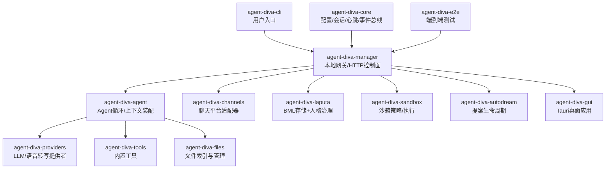
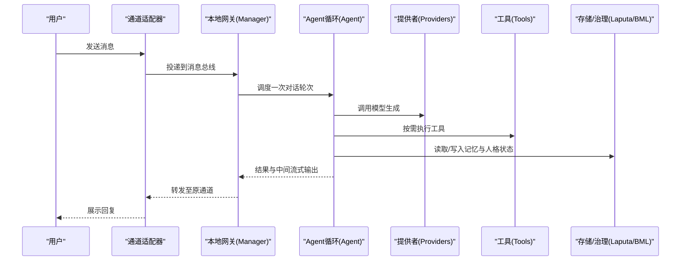
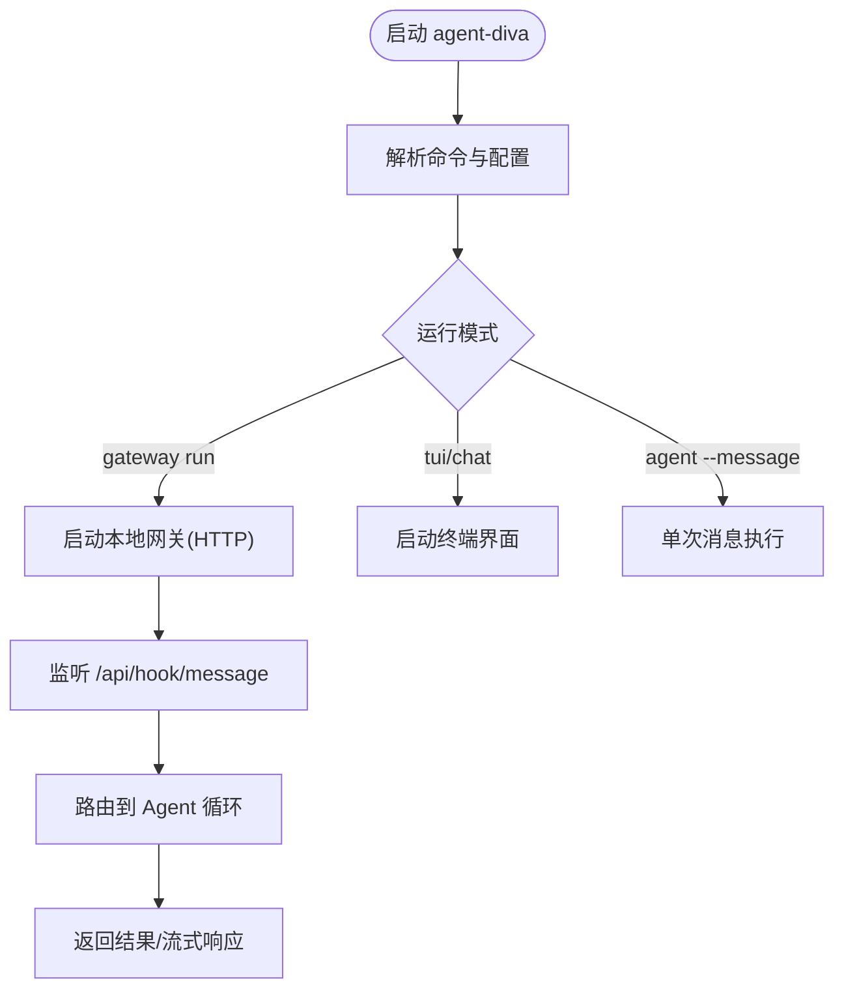
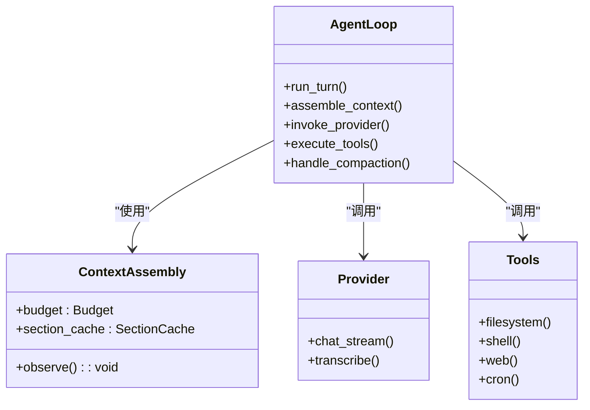
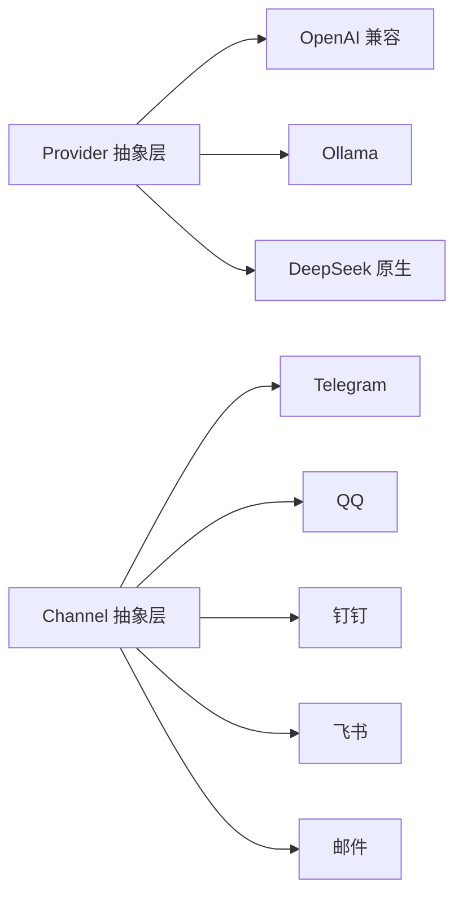
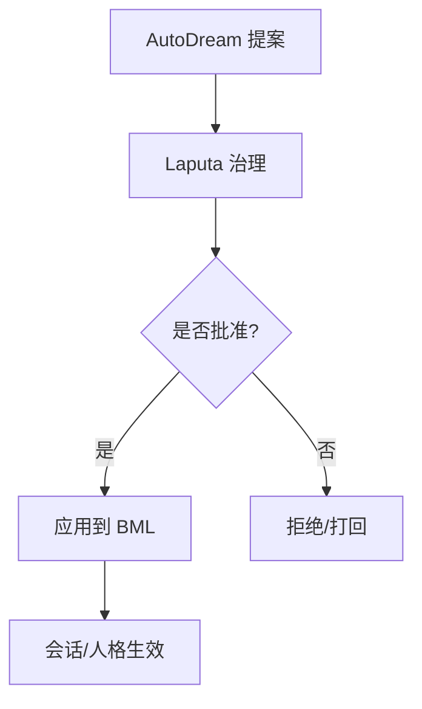
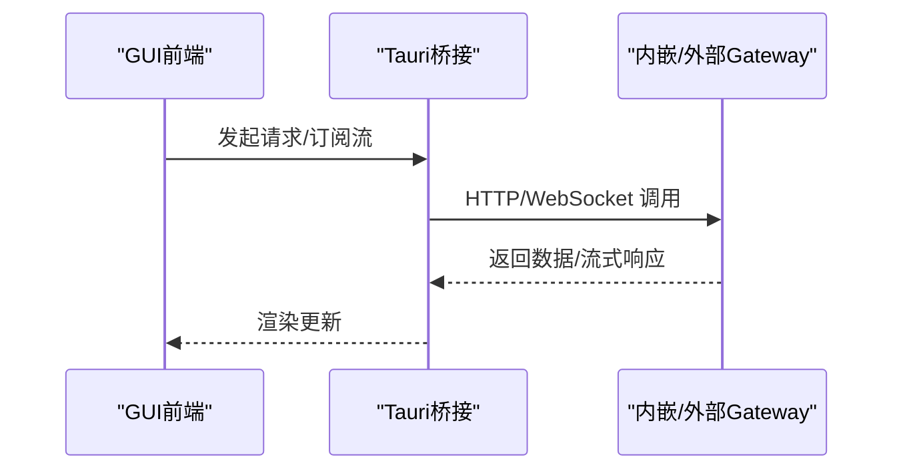
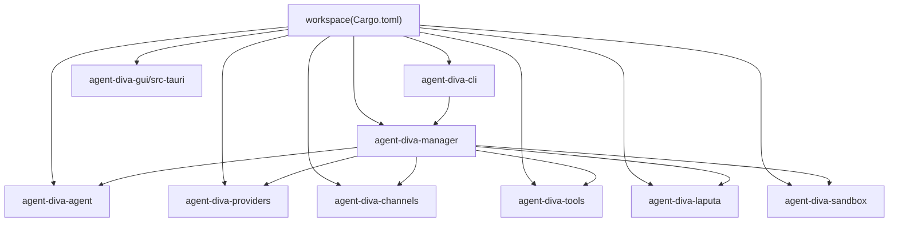
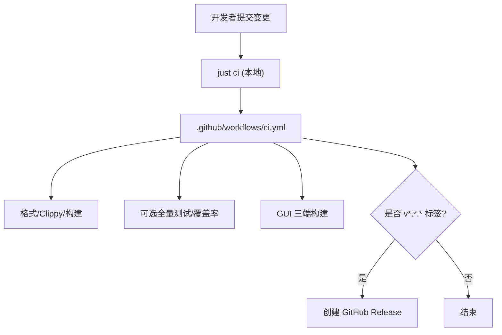

# 开发指南

<cite>
**本文引用的文件**
- [README.md](file://README.md)
- [Cargo.toml](file://Cargo.toml)
- [justfile](file://justfile)
- [CLAUDE.md](file://CLAUDE.md)
- [AGENTS.md](file://AGENTS.md)
- [.github/workflows/ci.yml](file://.github/workflows/ci.yml)
- [agent-diva-cli/Cargo.toml](file://agent-diva-cli/Cargo.toml)
- [agent-diva-gui/package.json](file://agent-diva-gui/package.json)
- [agent-diva-gui/README.md](file://agent-diva-gui/README.md)
- [docs/architecture/README.md](file://docs/architecture/README.md)
- [clippy.toml](file://clippy.toml)
- [rustfmt.toml](file://rustfmt.toml)
- [deny.toml](file://deny.toml)
</cite>

## 目录
1. [简介](#简介)
2. [项目结构](#项目结构)
3. [核心组件](#核心组件)
4. [架构总览](#架构总览)
5. [详细组件分析](#详细组件分析)
6. [依赖关系分析](#依赖关系分析)
7. [性能与基准](#性能与基准)
8. [故障排查与调试](#故障排查与调试)
9. [代码质量与安全](#代码质量与安全)
10. [测试策略与用例编写](#测试策略与用例编写)
11. [发布流程与版本管理](#发布流程与版本管理)
12. [新贡献者入门路径](#新贡献者入门路径)
13. [结论](#结论)

## 简介
Agent Diva 是一个基于 Rust 的多 crate 工作区，提供个人 AI 助手网关、多通道接入、工具系统、记忆与人格治理、沙箱执行、CLI/GUI/TUI 等能力。仓库以 workspace 形式组织，统一构建、测试和发布流程，并通过 just 命令封装常用任务。

## 项目结构
仓库采用按职责划分的 crate 组织方式：核心库、代理循环、提供者、通道、工具、文件索引、本地网关、GUI、迁移工具、端到端测试等。根 Cargo.toml 声明了所有成员 crate，并集中配置 MSRV、发布 profile 与共享依赖。

图表来源
- [Cargo.toml:1-20](file://Cargo.toml#L1-L20)
- [README.md:87-107](file://README.md#L87-L107)

章节来源
- [README.md:87-107](file://README.md#L87-L107)
- [Cargo.toml:1-20](file://Cargo.toml#L1-L20)

## 核心组件
- CLI 入口：agent-diva-cli 暴露 agent-diva 二进制，聚合 core/agent/providers/channels/tools/manager/laputa/sandbox 等能力。
- 本地网关：agent-diva-manager 提供 HTTP 控制面，承载会话路由、通道连接、计划与审批等。
- Agent 循环：agent-diva-agent 负责上下文装配、技能加载、子代理与工具调用编排。
- 提供者：agent-diva-providers 抽象并实现多种 LLM/转录后端。
- 通道：agent-diva-channels 对接 Telegram/Discord/QQ/钉钉/飞书/邮件等平台。
- 工具：agent-diva-tools 提供文件系统、Shell、Web、Cron、Spawn 等工具。
- 文件服务：agent-diva-files 提供文件索引与管理辅助。
- 记忆与治理：agent-diva-laputa 提供 BML 存储与 Laputa 人格治理（提案、审计、回滚）。
- 沙箱：agent-diva-sandbox 提供执行策略、平台适配、审批/守护支持。
- GUI：agent-diva-gui 基于 Tauri + Vue 3 的桌面客户端，内嵌 Gateway 或外部模式。
- 端到端：agent-diva-e2e 提供场景化端到端测试。

章节来源
- [README.md:87-107](file://README.md#L87-L107)
- [agent-diva-cli/Cargo.toml:15-24](file://agent-diva-cli/Cargo.toml#L15-L24)
- [agent-diva-gui/README.md:1-40](file://agent-diva-gui/README.md#L1-L40)

## 架构总览
Gateway 作为会话、路由与通道连接的单一事实源；消息从通道进入消息总线，经 Agent Loop 调用 LLM 与工具后返回对应通道；CLI/GUI 通过 HTTP 或内嵌进程与 Gateway 交互。

图表来源
- [README.md:43-59](file://README.md#L43-L59)
- [agent-diva-cli/Cargo.toml:15-24](file://agent-diva-cli/Cargo.toml#L15-L24)

## 详细组件分析

### CLI 与本地网关
- CLI 是用户入口，负责参数解析、命令分发、日志与交互式界面。
- Manager 提供 HTTP API（默认端口 3000），支持外部 Hook、状态查询、计划与审批等。

图表来源
- [README.md:176-244](file://README.md#L176-L244)
- [agent-diva-cli/Cargo.toml:11-13](file://agent-diva-cli/Cargo.toml#L11-L13)

章节来源
- [README.md:176-244](file://README.md#L176-L244)
- [agent-diva-cli/Cargo.toml:11-24](file://agent-diva-cli/Cargo.toml#L11-L24)

### Agent 循环与上下文装配
- Agent 循环负责组装上下文、选择模型、调用工具、处理合并与压缩、以及子代理协作。
- 上下文装配模块维护预算、缓存与节选策略，确保在有限窗口内维持高质量输入。

图表来源
- [README.md:87-107](file://README.md#L87-L107)
- [agent-diva-cli/Cargo.toml:15-24](file://agent-diva-cli/Cargo.toml#L15-L24)

章节来源
- [README.md:87-107](file://README.md#L87-L107)

### 提供者与通道
- 提供者抽象统一的 LLM/转录接口，支持 OpenAI 兼容、Ollama、DeepSeek 等多种后端。
- 通道适配器将不同聊天平台的消息标准化为内部事件，再交由网关路由。

图表来源
- [README.md:60-86](file://README.md#L60-L86)
- [agent-diva-cli/Cargo.toml:15-24](file://agent-diva-cli/Cargo.toml#L15-L24)

章节来源
- [README.md:60-86](file://README.md#L60-L86)

### 记忆与人格治理（BML/Laputa）
- BML 是生产级内存权威（SQLite + FTS5），Laputa 在其之上提供提案、治理、审计与回滚。
- AutoDream 作为提案生成器，不直接写入人格状态，需经治理路径审查与应用。

图表来源
- [README.md:272-285](file://README.md#L272-L285)
- [AGENTS.md:42-56](file://AGENTS.md#L42-L56)

章节来源
- [README.md:272-285](file://README.md#L272-L285)
- [AGENTS.md:42-56](file://AGENTS.md#L42-L56)

### GUI（Tauri + Vue 3）
- GUI 提供实时对话、工具可视化、审批中心、提供者与通道配置、技能市场、记忆/人格治理视图等。
- 开发模式默认启动内嵌 Gateway；也可设置环境变量走外部 Gateway 兼容模式。

图表来源
- [agent-diva-gui/README.md:13-40](file://agent-diva-gui/README.md#L13-L40)
- [agent-diva-gui/package.json:7-15](file://agent-diva-gui/package.json#L7-L15)

章节来源
- [agent-diva-gui/README.md:13-40](file://agent-diva-gui/README.md#L13-L40)
- [agent-diva-gui/package.json:7-15](file://agent-diva-gui/package.json#L7-L15)

## 依赖关系分析
- 工作区成员由根 Cargo.toml 统一管理，版本与 MSRV 集中在 workspace.package。
- CLI 强依赖 manager，manager 协调 agent、providers、channels、tools、laputa、sandbox。
- GUI 通过 Tauri 与 Rust 侧交互，前端脚本由 package.json 管理。

图表来源
- [Cargo.toml:1-20](file://Cargo.toml#L1-L20)
- [agent-diva-cli/Cargo.toml:15-24](file://agent-diva-cli/Cargo.toml#L15-L24)

章节来源
- [Cargo.toml:1-20](file://Cargo.toml#L1-L20)
- [agent-diva-cli/Cargo.toml:15-24](file://agent-diva-cli/Cargo.toml#L15-L24)

## 性能与基准
- 工作区 release profile 启用 LTO、单 codegen unit 与 strip，优化体积与运行性能。
- 健康基准检查通过特定测试用例验证关键路径预算，避免回归。
- GUI 前端构建与类型检查纳入自动化门禁。

章节来源
- [Cargo.toml:101-110](file://Cargo.toml#L101-L110)
- [justfile:82-84](file://justfile#L82-L84)
- [justfile:61-64](file://justfile#L61-L64)

## 故障排查与调试
- 日志与追踪：使用 tracing 子系统，结合 tracing-subscriber 与环境过滤，便于定位问题。
- 配置诊断：通过 CLI 的 config validate/doctor 命令检查实例配置与路径。
- 外部 Hook：Gateway 默认监听 3000 端口，可通过 HTTP POST 注入消息进行快速验证。
- GUI 调试：开发模式默认内嵌 Gateway；如需独立调试 Gateway，设置环境变量后启动 GUI。

章节来源
- [README.md:150-198](file://README.md#L150-L198)
- [README.md:333-342](file://README.md#L333-L342)
- [agent-diva-gui/README.md:33-40](file://agent-diva-gui/README.md#L33-L40)

## 代码质量与安全
- 格式化：rustfmt 规则在 rustfmt.toml 中定义，统一风格。
- 静态检查：clippy 配置在 clippy.toml，MSRV 设为 1.80.0，复杂度阈值已设定。
- 安全与许可证：cargo-deny 在 deny.toml 中配置许可证白名单、禁止项、漏洞告警级别与来源白名单。
- 提交前建议：just fmt-check && just check && just test。

章节来源
- [rustfmt.toml:1-15](file://rustfmt.toml#L1-L15)
- [clippy.toml:1-11](file://clippy.toml#L1-L11)
- [deny.toml:1-84](file://deny.toml#L1-L84)
- [AGENTS.md:98-106](file://AGENTS.md#L98-L106)

## 测试策略与用例编写
- 单元与集成测试：在各 crate 的 tests/ 目录下编写跨模块行为测试；优先使用确定性测试，避免网络依赖。
- 端到端测试：agent-diva-e2e 提供场景化测试，覆盖基础数学、回声、错误处理、长响应、多轮对话与工具调用。
- 专项门禁：memory-provider-check、bml-boundary-check、gui-automated-check 等 just 任务用于聚焦验证。
- CI 触发：push/PR/tag 触发 Rust 检查、GUI 构建与可选覆盖率收集。

图表来源
- [justfile:110-112](file://justfile#L110-L112)
- [.github/workflows/ci.yml:56-112](file://.github/workflows/ci.yml#L56-L112)
- [.github/workflows/ci.yml:237-264](file://.github/workflows/ci.yml#L237-L264)

章节来源
- [justfile:110-112](file://justfile#L110-L112)
- [.github/workflows/ci.yml:56-112](file://.github/workflows/ci.yml#L56-L112)
- [.github/workflows/ci.yml:237-264](file://.github/workflows/ci.yml#L237-L264)

## 发布流程与版本管理
- 工作区版本：根 Cargo.toml 中 workspace.package.version 为 0.9.9，MSRV 为 1.80.0。
- 打包产物：CLI 支持 deb/rpm/zip；GUI 通过 Tauri 构建 AppImage/DMG/MSI/EXE。
- 自动化发布：推送 v*.*.* 标签时，CI 自动下载各平台 GUI 产物并创建 GitHub Release。
- 本地打包：just 提供 cross 编译、deb 构建、macOS DMG 等 recipe。

章节来源
- [Cargo.toml:22-25](file://Cargo.toml#L22-L25)
- [justfile:147-215](file://justfile#L147-L215)
- [.github/workflows/ci.yml:237-264](file://.github/workflows/ci.yml#L237-L264)

## 新贡献者入门路径
- 环境准备：安装 Rust 稳定版、just；Windows 下可借助 PowerShell 脚本一键初始化。
- 首次构建：just build；运行 just test 确认测试通过。
- 日常开发：just fmt-check && just check && just test；涉及 GUI 时追加 GUI 自动化检查。
- 新增通道/工具/提供者：在对应 crate 中实现接口，注册到管理器，补充配置与测试，更新文档。
- 提交流程：遵循 Conventional Commit，保持 PR 聚焦单一关注点；提交前运行 just ci。

章节来源
- [README.md:110-132](file://README.md#L110-L132)
- [justfile:23-33](file://justfile#L23-L33)
- [AGENTS.md:75-96](file://AGENTS.md#L75-L96)
- [docs/engineering/CONTRIBUTING.md:125-155](file://docs/engineering/CONTRIBUTING.md#L125-L155)

## 结论
本指南覆盖了 Agent Diva 的开发环境搭建、工作区结构与模块职责、新功能开发与贡献规范、测试策略、调试与性能方法、代码质量与安全、发布与版本管理，以及新贡献者的入门路径。建议在每次变更后运行 just ci 保证质量，并在需要时扩展 GUI 与端到端测试以覆盖用户可见行为。