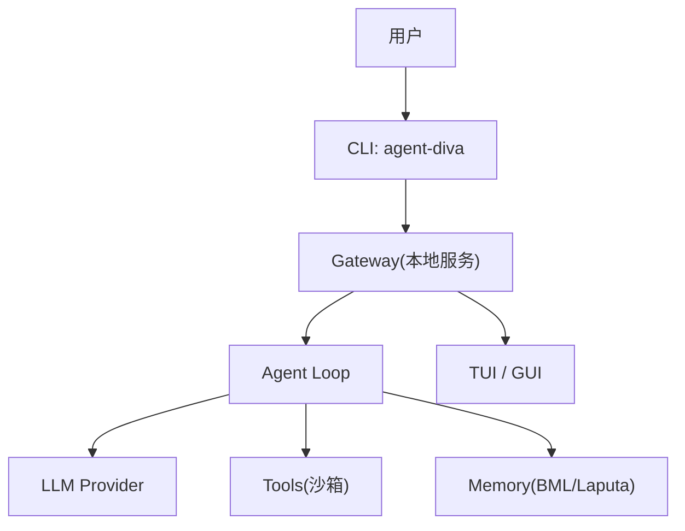
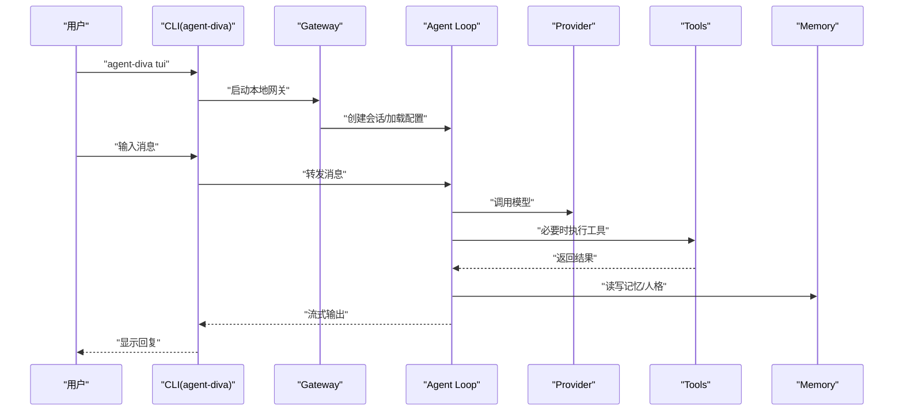
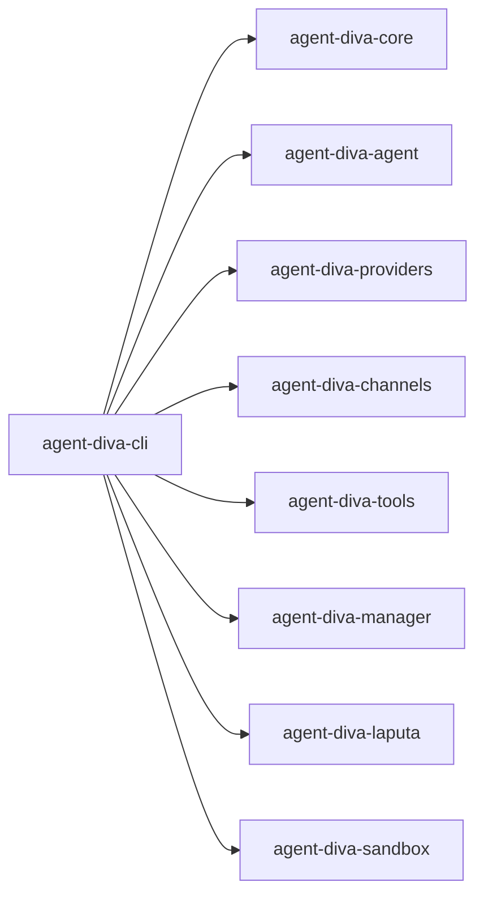

# 快速开始

<cite>
**本文引用的文件**
- [README.md](file://README.md)
- [Cargo.toml](file://Cargo.toml)
- [agent-diva-cli/Cargo.toml](file://agent-diva-cli/Cargo.toml)
- [agent-diva-cli/src/main.rs](file://agent-diva-cli/src/main.rs)
</cite>

## 目录
1. [简介](#简介)
2. [项目结构](#项目结构)
3. [核心组件](#核心组件)
4. [架构总览](#架构总览)
5. [详细组件分析](#详细组件分析)
6. [依赖分析](#依赖分析)
7. [性能注意事项](#性能注意事项)
8. [故障排查指南](#故障排查指南)
9. [结论](#结论)
10. [附录](#附录)

## 简介
Agent Diva 是一个轻量、可扩展的个人 AI 助手框架，提供多通道网关、多种 LLM Provider、工具系统、记忆与人格治理、定时任务以及 CLI/TUI/GUI 三套界面。本快速开始指南帮助你在最短时间内完成环境准备、从源码构建、初始化配置并体验核心功能（启动 TUI、发送消息、查看状态等）。

## 项目结构
仓库采用 Rust workspace 组织，CLI 入口位于 agent-diva-cli，核心能力由多个子 crate 提供（core、agent、providers、channels、tools、manager、laputa、sandbox 等），GUI 基于 Tauri + Vue 3。

图表来源
- [agent-diva-cli/src/main.rs:59-205](file://agent-diva-cli/src/main.rs#L59-L205)
- [README.md:43-58](file://README.md#L43-L58)

章节来源
- [README.md:87-108](file://README.md#L87-L108)
- [Cargo.toml:1-20](file://Cargo.toml#L1-L20)

## 核心组件
- CLI 命令：onboard、gateway run、agent、chat、tui、status、provider、config、cron、workspace、todo、mask 等。
- Gateway：本地网关进程，承载会话、路由、频道连接与定时任务。
- Agent Loop：编排调用 LLM 与工具，维护上下文与记忆。
- Providers：统一抽象与预设，支持 OpenAI 兼容、Ollama、OpenRouter 等。
- Channels：Telegram、Discord、QQ、DingTalk、Feishu、Email 等适配器。
- Tools：文件系统、Shell、Web、Cron、Spawn 等内置工具。
- Memory & Persona：BML 存储 + Laputa 治理；AutoDream 生成提案。
- GUI：Tauri + Vue 3 桌面应用，提供聊天、审批、技能市场、设置等。

章节来源
- [agent-diva-cli/src/main.rs:59-205](file://agent-diva-cli/src/main.rs#L59-L205)
- [README.md:60-85](file://README.md#L60-L85)

## 架构总览
下图展示从 CLI 到 Gateway、Agent Loop、Provider/Tools/Memory 的交互关系。

图表来源
- [agent-diva-cli/src/main.rs:441-448](file://agent-diva-cli/src/main.rs#L441-L448)
- [agent-diva-cli/src/main.rs:636-644](file://agent-diva-cli/src/main.rs#L636-L644)
- [agent-diva-cli/src/main.rs:985-1017](file://agent-diva-cli/src/main.rs#L985-L1017)

## 详细组件分析

### 环境要求
- Rust 1.80+（MSRV）
- 可选：just（工作区便捷命令）
- GUI 开发需要 Node.js v18+ 与 pnpm/npm

章节来源
- [README.md:110-115](file://README.md#L110-L115)
- [Cargo.toml:22-25](file://Cargo.toml#L22-L25)

### 安装与构建
- 克隆仓库后，使用 just 或 cargo 直接构建与安装 CLI：
  - just build && just install
  - 或直接：cargo build --all && cargo install --path agent-diva-cli

章节来源
- [README.md:116-133](file://README.md#L116-L133)
- [agent-diva-cli/Cargo.toml:1-14](file://agent-diva-cli/Cargo.toml#L1-L14)

### 初始化配置（onboard）
- 运行 onboard 向导，交互式选择 Provider、模型、API Key/Base URL、工作区路径，并保存配置、生成模板。
- 也可通过 config init 以非交互方式完成相同流程。

章节来源
- [agent-diva-cli/src/main.rs:775-983](file://agent-diva-cli/src/main.rs#L775-L983)
- [agent-diva-cli/src/main.rs:421-439](file://agent-diva-cli/src/main.rs#L421-L439)

### 最小化配置示例
- 在配置文件（默认 ~/.agent-diva/config.json）中至少配置一个 Provider 并在 agents.defaults 中指定 provider 与 model。
- 参考 README 中的最小配置片段（包含 providers 与 agents.defaults）。

章节来源
- [README.md:150-175](file://README.md#L150-L175)

### 常用 CLI 操作
- 启动 TUI：agent-diva tui
- 发送单条消息：agent-diva agent --message "你好"
- 轻量聊天：agent-diva chat
- 查看状态/频道/Provider：agent-diva status、agent-diva channels status、agent-diva provider list
- 管理网关：agent-diva gateway run
- 配置诊断：agent-diva config validate / doctor / show / refresh / path

章节来源
- [README.md:176-242](file://README.md#L176-L242)
- [agent-diva-cli/src/main.rs:59-205](file://agent-diva-cli/src/main.rs#L59-L205)

### 启动 Gateway（本地服务）
- 运行 gateway run 启动本地网关，加载配置与工作区，暴露 HTTP API（默认端口 3000）。
- 若未配置 Provider，将报错提示缺少可用 Provider。

章节来源
- [agent-diva-cli/src/main.rs:985-1017](file://agent-diva-cli/src/main.rs#L985-L1017)
- [README.md:213-244](file://README.md#L213-L244)

### 外部 Hook 调用
- 可通过 HTTP POST 向网关注入消息（默认 http://localhost:3000/api/hook/message）。

章节来源
- [README.md:333-342](file://README.md#L333-L342)

## 依赖分析
- CLI 依赖 core、agent、providers、channels、tools、manager、laputa、sandbox 等模块。
- 工作区版本与 MSRV 在根 Cargo.toml 中统一声明。

图表来源
- [agent-diva-cli/Cargo.toml:15-24](file://agent-diva-cli/Cargo.toml#L15-L24)
- [Cargo.toml:1-20](file://Cargo.toml#L1-L20)

章节来源
- [agent-diva-cli/Cargo.toml:15-24](file://agent-diva-cli/Cargo.toml#L15-L24)
- [Cargo.toml:1-20](file://Cargo.toml#L1-L20)

## 性能注意事项
- 发布构建启用优化与 LTO，二进制体积更小、运行更快。
- CLI 使用多线程 Tokio 运行时，线程栈大小已调优，适合长时间运行的 TUI/Gateway。
- 建议在生产环境使用 release 构建，并合理配置 Provider 超时与重试策略。

章节来源
- [Cargo.toml:101-110](file://Cargo.toml#L101-L110)
- [agent-diva-cli/src/main.rs:441-448](file://agent-diva-cli/src/main.rs#L441-L448)

## 故障排查指南
- 未配置 Provider：启动 Gateway 时会提示找不到可用 Provider，请先运行 onboard 或手动编辑配置文件添加 apiKey 与默认模型。
- 配置校验：使用 config validate / doctor 检查配置与运行时就绪性。
- 远程模式：CLI 支持 --remote 与 --api-url 连接远端网关，便于无头环境调试。
- 日志：非 TUI/Agent 命令会输出终端日志；可通过环境变量调整日志级别。

章节来源
- [agent-diva-cli/src/main.rs:1001-1017](file://agent-diva-cli/src/main.rs#L1001-L1017)
- [agent-diva-cli/src/main.rs:465-472](file://agent-diva-cli/src/main.rs#L465-L472)
- [README.md:176-198](file://README.md#L176-L198)

## 结论
通过以上步骤，你可以在几分钟内完成环境准备、从源码构建、初始化配置并运行 Agent Diva 的核心功能。推荐先使用 TUI 体验对话，再根据需要开启 Gateway、频道与自动化任务。

## 附录

### 从零到一：快速上手清单
- 安装 Rust 1.80+（可选 just）
- 克隆仓库并构建安装 CLI
- 运行 onboard 配置 Provider 与默认模型
- 启动 TUI 或发送单条消息体验
- 如需长期运行，启动 Gateway 并配置频道/定时任务

章节来源
- [README.md:110-148](file://README.md#L110-L148)
- [agent-diva-cli/src/main.rs:775-983](file://agent-diva-cli/src/main.rs#L775-L983)