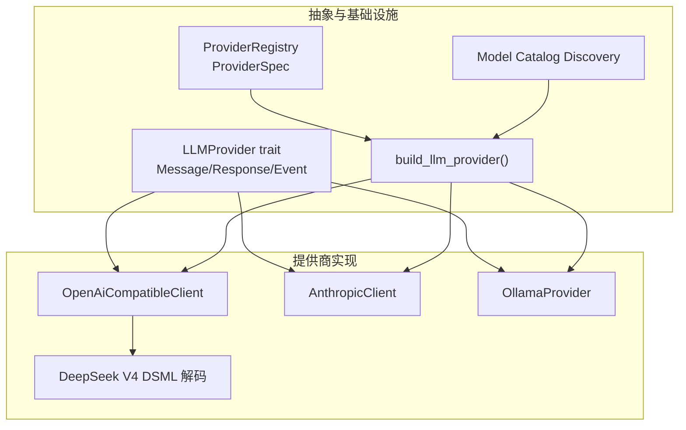
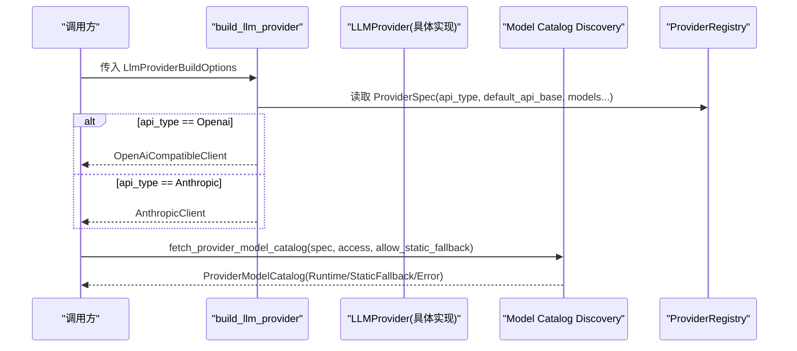
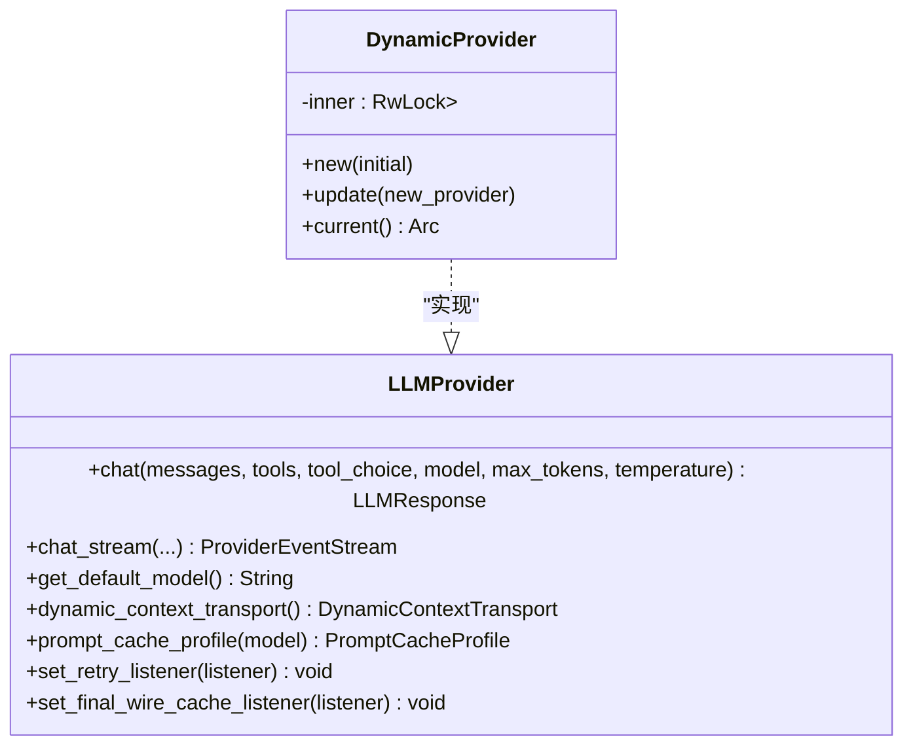
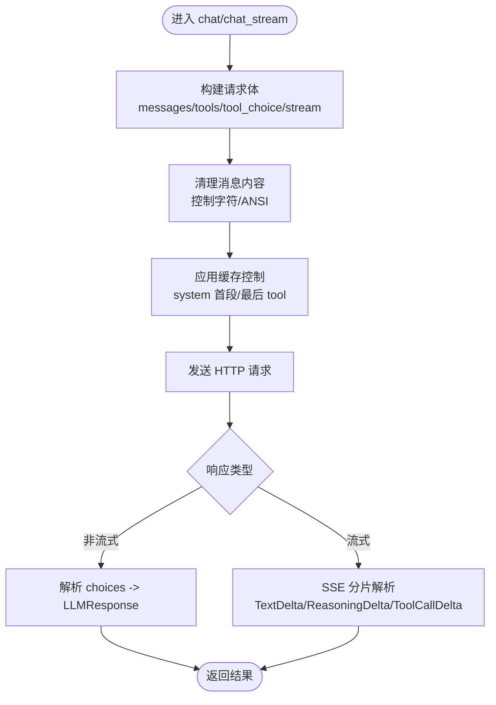
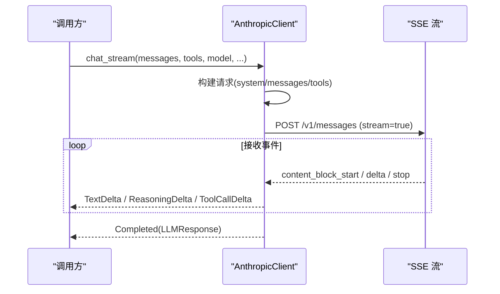
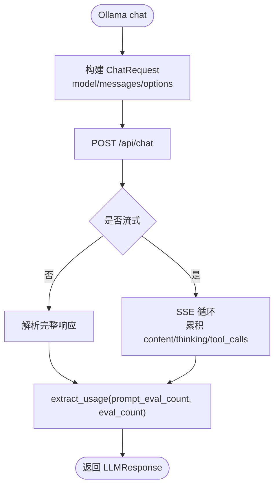
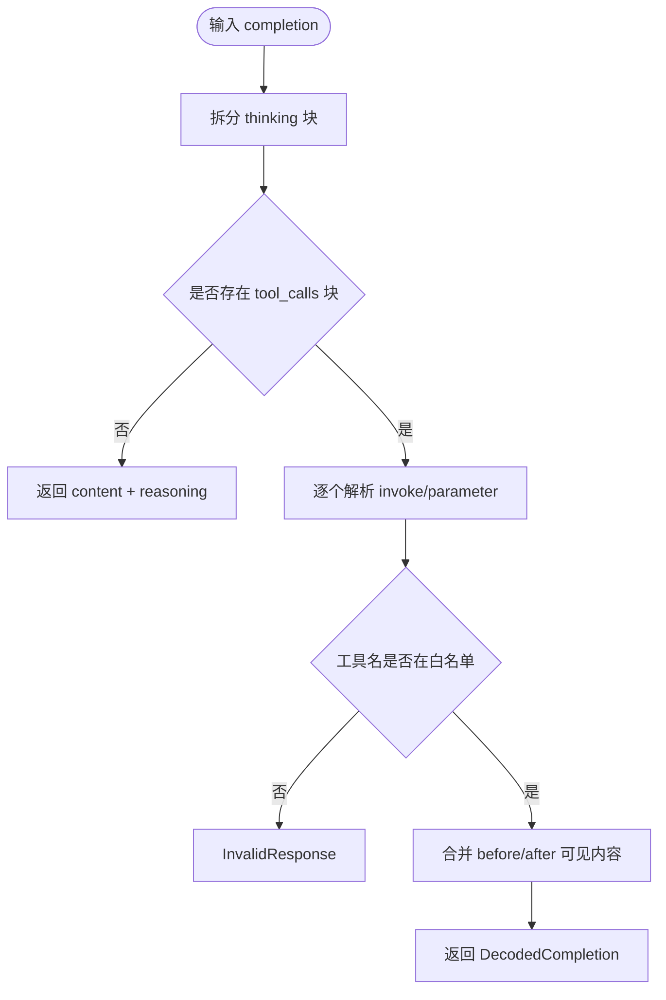
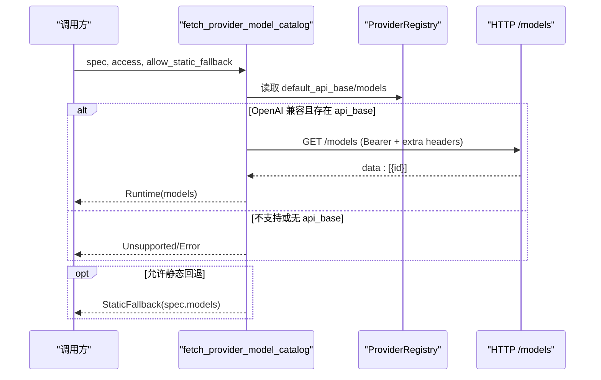
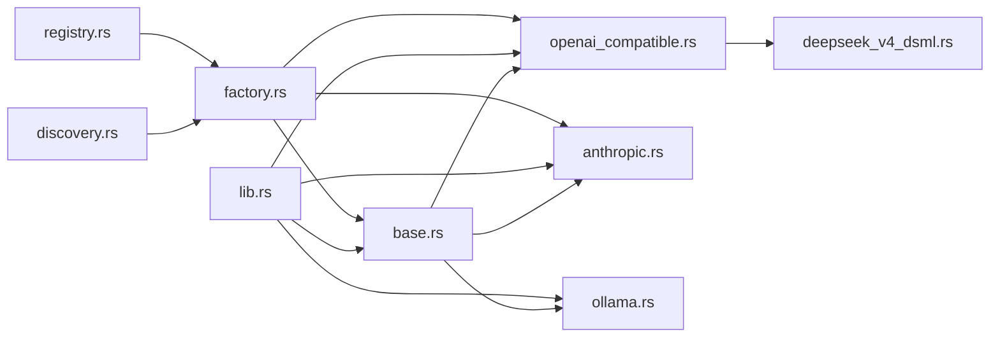

# LLM 提供商集成

<cite>
**本文引用的文件**
- [lib.rs](file://agent-diva-providers/src/lib.rs)
- [base.rs](file://agent-diva-providers/src/base.rs)
- [registry.rs](file://agent-diva-providers/src/registry.rs)
- [factory.rs](file://agent-diva-providers/src/factory.rs)
- [discovery.rs](file://agent-diva-providers/src/discovery.rs)
- [openai_compatible.rs](file://agent-diva-providers/src/openai_compatible.rs)
- [anthropic.rs](file://agent-diva-providers/src/anthropic.rs)
- [ollama.rs](file://agent-diva-providers/src/ollama.rs)
- [deepseek_v4_dsml.rs](file://agent-diva-providers/src/deepseek_v4_dsml.rs)
- [providers.yaml](file://agent-diva-providers/src/providers.yaml)
</cite>

## 目录
1. [简介](#简介)
2. [项目结构](#项目结构)
3. [核心组件](#核心组件)
4. [架构总览](#架构总览)
5. [详细组件分析](#详细组件分析)
6. [依赖关系分析](#依赖关系分析)
7. [性能与可靠性](#性能与可靠性)
8. [故障排查指南](#故障排查指南)
9. [结论](#结论)
10. [附录：自定义 Provider 开发指南](#附录自定义-provider-开发指南)

## 简介
本仓库的 agent-diva-providers 模块为 Agent 系统提供统一的 LLM 提供商抽象与多种实现，包括 OpenAI 兼容客户端、Anthropic Claude 原生客户端、Ollama 本地模型以及 DeepSeek V4 DSML 协议解码等。通过 trait 抽象、注册表与工厂构建机制，上层调用方可以以统一接口发起聊天、流式对话、能力检测、缓存策略与重试监听等操作，并支持运行时模型目录发现与静态回退。

## 项目结构
- 抽象层：定义 LLMProvider trait、消息/响应/事件类型、错误分类、能力探测、提示词缓存策略等。
- 实现层：OpenAI 兼容、Anthropic、Ollama、DeepSeek V4 DSML 解码。
- 配置与发现：ProviderSpec/Registry 描述提供商元数据；Discovery 支持运行时 /models 拉取与静态回退。
- 构建与包装：Factory 根据 api_type 构造具体客户端；DynamicProvider 支持热切换；Tap/Try 等可观测性封装（由 crate 暴露）。

图表来源
- [base.rs:708-780](file://agent-diva-providers/src/base.rs#L708-L780)
- [registry.rs:73-108](file://agent-diva-providers/src/registry.rs#L73-L108)
- [discovery.rs:63-113](file://agent-diva-providers/src/discovery.rs#L63-L113)
- [factory.rs:23-70](file://agent-diva-providers/src/factory.rs#L23-L70)
- [openai_compatible.rs:168-184](file://agent-diva-providers/src/openai_compatible.rs#L168-L184)
- [anthropic.rs:170-205](file://agent-diva-providers/src/anthropic.rs#L170-L205)
- [ollama.rs:22-27](file://agent-diva-providers/src/ollama.rs#L22-L27)
- [deepseek_v4_dsml.rs:21-27](file://agent-diva-providers/src/deepseek_v4_dsml.rs#L21-L27)

章节来源
- [lib.rs:1-41](file://agent-diva-providers/src/lib.rs#L1-L41)
- [base.rs:10-69](file://agent-diva-providers/src/base.rs#L10-L69)
- [registry.rs:1-108](file://agent-diva-providers/src/registry.rs#L1-L108)
- [discovery.rs:1-113](file://agent-diva-providers/src/discovery.rs#L1-L113)
- [factory.rs:1-70](file://agent-diva-providers/src/factory.rs#L1-L70)

## 核心组件
- LLMProvider trait：统一 chat/chat_stream/get_default_model/dynamic_context_transport/prompt_cache_profile/set_retry_listener/set_final_wire_cache_listener 等方法。
- 消息与事件：Message、MessageContent、MessageContentPart、LLMResponse、LLMStreamEvent、ToolCallRequest。
- 错误体系：ProviderError 及其错误分类（可重试/超时/致命/配置等）。
- 能力探测：supports_vision_model、supports_reasoning_model、model_capabilities_for_model_with_config。
- 动态上下文传输：MidConversationSystem/UserContextEnvelope/NativeContextBlock。
- 提示词缓存策略：PromptCacheProfile/PromptCachePolicy。

章节来源
- [base.rs:708-780](file://agent-diva-providers/src/base.rs#L708-L780)
- [base.rs:447-660](file://agent-diva-providers/src/base.rs#L447-L660)
- [base.rs:131-264](file://agent-diva-providers/src/base.rs#L131-L264)
- [base.rs:10-69](file://agent-diva-providers/src/base.rs#L10-L69)

## 架构总览
- 构建路径：上层通过 build_llm_provider(options) 依据 spec.api_type 选择 OpenAI 兼容或 Anthropic 客户端，并可选包装 ProviderTap 用于观测。
- 运行期发现：fetch_provider_model_catalog 对 OpenAI 兼容端点调用 /models 获取模型列表，失败时按 allow_static_fallback 回退到 providers.yaml 中的 models。
- 动态切换：DynamicProvider 持有 Arc<dyn LLMProvider>，可在运行时替换底层实现。
- 协议适配：OpenAI 兼容客户端在 response_protocol=DeepseekV4Dsml 时对 content 进行 DSML 解析，提取 reasoning_content 与 tool_calls。

图表来源
- [factory.rs:23-70](file://agent-diva-providers/src/factory.rs#L23-L70)
- [discovery.rs:63-113](file://agent-diva-providers/src/discovery.rs#L63-L113)
- [registry.rs:73-108](file://agent-diva-providers/src/registry.rs#L73-L108)

章节来源
- [factory.rs:23-70](file://agent-diva-providers/src/factory.rs#L23-L70)
- [discovery.rs:63-113](file://agent-diva-providers/src/discovery.rs#L63-L113)
- [registry.rs:73-108](file://agent-diva-providers/src/registry.rs#L73-L108)

## 详细组件分析

### LLMProvider 抽象与 DynamicProvider
- 核心方法：chat、chat_stream（默认非流式回退）、get_default_model、dynamic_context_transport、prompt_cache_profile、set_retry_listener、set_final_wire_cache_listener。
- DynamicProvider：内部使用 RwLock<Arc<dyn LLMProvider>> 支持热更新，所有方法转发给当前实现。

图表来源
- [base.rs:708-780](file://agent-diva-providers/src/base.rs#L708-L780)
- [lib.rs:46-124](file://agent-diva-providers/src/lib.rs#L46-L124)

章节来源
- [base.rs:708-780](file://agent-diva-providers/src/base.rs#L708-L780)
- [lib.rs:46-124](file://agent-diva-providers/src/lib.rs#L46-L124)

### OpenAI 兼容客户端
- 请求构建：将 Message/Tools/ToolChoice/参数映射为 OpenAI 风格 JSON；支持 stream_options.include_usage。
- 响应解析：非流式与流式均解析 choices/delta，合并 reasoning_content 与 tool_calls；当 response_protocol=DeepseekV4Dsml 时走 DSML 解码。
- 健壮性：消息内容清理控制字符与 ANSI 转义；工具参数双重编码容错；缺失 usage 审计告警。
- 缓存与上下文：对首个 system 文本块标记 cache_control;ephemeral；对最后一个 tool 标记 CORE 锚点。

图表来源
- [openai_compatible.rs:616-660](file://agent-diva-providers/src/openai_compatible.rs#L616-L660)
- [openai_compatible.rs:383-423](file://agent-diva-providers/src/openai_compatible.rs#L383-L423)
- [openai_compatible.rs:544-614](file://agent-diva-providers/src/openai_compatible.rs#L544-L614)
- [openai_compatible.rs:448-542](file://agent-diva-providers/src/openai_compatible.rs#L448-L542)

章节来源
- [openai_compatible.rs:168-184](file://agent-diva-providers/src/openai_compatible.rs#L168-L184)
- [openai_compatible.rs:616-660](file://agent-diva-providers/src/openai_compatible.rs#L616-L660)
- [openai_compatible.rs:383-423](file://agent-diva-providers/src/openai_compatible.rs#L383-L423)
- [openai_compatible.rs:544-614](file://agent-diva-providers/src/openai_compatible.rs#L544-L614)
- [openai_compatible.rs:448-542](file://agent-diva-providers/src/openai_compatible.rs#L448-L542)

### Anthropic Claude 客户端
- 请求构建：将 Message 转换为 Anthropic 的 messages/system/tools 结构；首个 system block 标记 cache_control;ephemeral。
- 流式处理：解析 message_start/content_block_delta/message_stop 等事件，聚合 text/thinking/input_json，最终输出 Completed。
- 工具调用：content_block_start 声明工具，input_json_delta 增量拼装，结束时序列化为 ToolCallRequest。

图表来源
- [anthropic.rs:211-240](file://agent-diva-providers/src/anthropic.rs#L211-L240)
- [anthropic.rs:382-570](file://agent-diva-providers/src/anthropic.rs#L382-L570)

章节来源
- [anthropic.rs:170-205](file://agent-diva-providers/src/anthropic.rs#L170-L205)
- [anthropic.rs:211-240](file://agent-diva-providers/src/anthropic.rs#L211-L240)
- [anthropic.rs:382-570](file://agent-diva-providers/src/anthropic.rs#L382-L570)

### Ollama 本地模型
- 非流式/流式：POST /api/chat，支持 temperature 选项；流式返回 done 标志与 eval_count/prompt_eval_count。
- 工具调用：解析 tool_calls 字段，生成标准 ToolCallRequest。
- 用法归一化：将 prompt_eval_count/eval_count 映射为标准 usage 字段。

图表来源
- [ollama.rs:322-435](file://agent-diva-providers/src/ollama.rs#L322-L435)
- [ollama.rs:437-608](file://agent-diva-providers/src/ollama.rs#L437-L608)
- [ollama.rs:176-199](file://agent-diva-providers/src/ollama.rs#L176-L199)

章节来源
- [ollama.rs:22-27](file://agent-diva-providers/src/ollama.rs#L22-L27)
- [ollama.rs:322-435](file://agent-diva-providers/src/ollama.rs#L322-L435)
- [ollama.rs:437-608](file://agent-diva-providers/src/ollama.rs#L437-L608)
- [ollama.rs:176-199](file://agent-diva-providers/src/ollama.rs#L176-L199)

### DeepSeek V4 DSML 解码
- 严格解析 <think>...</think> 与 <｜DSML｜tool_calls>...</｜DSML｜tool_calls> 区块，校验闭合、嵌套与重复。
- 解析 <｜DSML｜invoke name="..."> 及 <｜DSML｜parameter name="..." string="true/false"> 参数，限制仅允许已声明工具。
- 输出 DecodedCompletion(content, reasoning_content, tool_calls)。

图表来源
- [deepseek_v4_dsml.rs:29-67](file://agent-diva-providers/src/deepseek_v4_dsml.rs#L29-L67)
- [deepseek_v4_dsml.rs:94-169](file://agent-diva-providers/src/deepseek_v4_dsml.rs#L94-L169)

章节来源
- [deepseek_v4_dsml.rs:21-27](file://agent-diva-providers/src/deepseek_v4_dsml.rs#L21-L27)
- [deepseek_v4_dsml.rs:29-67](file://agent-diva-providers/src/deepseek_v4_dsml.rs#L29-L67)
- [deepseek_v4_dsml.rs:94-169](file://agent-diva-providers/src/deepseek_v4_dsml.rs#L94-L169)

### 提供商注册与动态发现
- 注册表：ProviderRegistry 从 providers.yaml 加载 ProviderSpec，支持按 model 关键词匹配与按 name 查找。
- 动态发现：对 OpenAI 兼容端点调用 /models 获取模型列表；失败时按 allow_static_fallback 回退到 spec.models；不支持则返回 Unsupported。
- 访问信息：ProviderAccess 从 ProviderConfig 提取 api_key/api_base/extra_headers。

图表来源
- [discovery.rs:63-113](file://agent-diva-providers/src/discovery.rs#L63-L113)
- [discovery.rs:179-246](file://agent-diva-providers/src/discovery.rs#L179-L246)
- [registry.rs:73-108](file://agent-diva-providers/src/registry.rs#L73-L108)
- [providers.yaml:1-164](file://agent-diva-providers/src/providers.yaml#L1-L164)

章节来源
- [discovery.rs:63-113](file://agent-diva-providers/src/discovery.rs#L63-L113)
- [discovery.rs:179-246](file://agent-diva-providers/src/discovery.rs#L179-L246)
- [registry.rs:73-108](file://agent-diva-providers/src/registry.rs#L73-L108)
- [providers.yaml:1-164](file://agent-diva-providers/src/providers.yaml#L1-L164)

## 依赖关系分析
- 抽象与实现：LLMProvider 被 OpenAiCompatibleClient、AnthropicClient、OllamaProvider 实现；DynamicProvider 也实现该 trait。
- 构建与发现：build_llm_provider 依赖 registry 与 discovery；discovery 依赖 http_util 与 reqwest。
- 协议适配：OpenAI 兼容客户端在特定 response_protocol 下依赖 deepseek_v4_dsml 解码。

图表来源
- [lib.rs:21-41](file://agent-diva-providers/src/lib.rs#L21-L41)
- [factory.rs:23-70](file://agent-diva-providers/src/factory.rs#L23-L70)
- [discovery.rs:63-113](file://agent-diva-providers/src/discovery.rs#L63-L113)
- [registry.rs:73-108](file://agent-diva-providers/src/registry.rs#L73-L108)
- [openai_compatible.rs:168-184](file://agent-diva-providers/src/openai_compatible.rs#L168-L184)
- [anthropic.rs:170-205](file://agent-diva-providers/src/anthropic.rs#L170-L205)
- [ollama.rs:22-27](file://agent-diva-providers/src/ollama.rs#L22-L27)
- [deepseek_v4_dsml.rs:21-27](file://agent-diva-providers/src/deepseek_v4_dsml.rs#L21-L27)

章节来源
- [lib.rs:21-41](file://agent-diva-providers/src/lib.rs#L21-L41)
- [factory.rs:23-70](file://agent-diva-providers/src/factory.rs#L23-L70)
- [discovery.rs:63-113](file://agent-diva-providers/src/discovery.rs#L63-L113)
- [registry.rs:73-108](file://agent-diva-providers/src/registry.rs#L73-L108)

## 性能与可靠性
- 流式 UTF-8 解码：StreamingUtf8Decoder 跨 chunk 安全拼接多字节字符，避免替换为占位符。
- 超时与空闲：Anthropic 流式设置 idle timeout，防止长时间无数据阻塞。
- 用量统计：各实现将 provider 特定的 usage 字段归一化为标准 map，缺失时记录审计事件。
- 重试与监听：LLMProvider::set_retry_listener 允许外部观察重试进度；provider 内部可通过 retry 模块触发回调。
- 缓存策略：PromptCacheProfile 显式声明 provider 默认 TTL；OpenAI 兼容与 Anthropic 对首个稳定 system/tool 标记 ephemeral 以提升命中率。

章节来源
- [base.rs:82-129](file://agent-diva-providers/src/base.rs#L82-L129)
- [anthropic.rs:18-19](file://agent-diva-providers/src/anthropic.rs#L18-L19)
- [openai_compatible.rs:214-249](file://agent-diva-providers/src/openai_compatible.rs#L214-L249)
- [ollama.rs:201-216](file://agent-diva-providers/src/ollama.rs#L201-L216)
- [base.rs:662-706](file://agent-diva-providers/src/base.rs#L662-L706)

## 故障排查指南
- 常见错误分类：
  - 网络/JSON/无效响应/API 错误/配置错误/限流。
  - 超时与 4xx/5xx 会被归类为可重试或超时。
- 诊断要点：
  - 检查 API Key 与 Base URL 是否正确；OpenAI 兼容需确保 /models 可达。
  - 若 response_protocol=DeepseekV4Dsml，必须使用包含 deepseek-v4 的模型。
  - 流式中断时关注 UTF-8 解码错误与 SSE 解析异常。
  - 工具调用参数解析失败会记录问题字符与上下文，便于定位。
- 建议操作：
  - 启用 set_retry_listener 观察重试次数与间隔。
  - 使用 set_final_wire_cache_listener 捕获最终 wire 快照，辅助缓存命中分析。
  - 对未知模型，capabilities 默认保守（无 vision/tools/reasoning），避免发送不兼容负载。

章节来源
- [base.rs:10-69](file://agent-diva-providers/src/base.rs#L10-L69)
- [factory.rs:23-70](file://agent-diva-providers/src/factory.rs#L23-L70)
- [openai_compatible.rs:448-542](file://agent-diva-providers/src/openai_compatible.rs#L448-L542)
- [deepseek_v4_dsml.rs:29-67](file://agent-diva-providers/src/deepseek_v4_dsml.rs#L29-L67)

## 结论
本模块通过清晰的抽象与多实现，提供了跨多家 LLM 提供商的统一接入能力。结合注册表与运行时发现，既保证了开箱即用，又具备扩展性与弹性。配合流式处理、缓存策略与重试监听，能够在复杂网络与多提供商环境下保持高可用与可观测性。

## 附录：自定义 Provider 开发指南
- 实现 LLMProvider trait：
  - 至少实现 chat、get_default_model；推荐实现 chat_stream 以获得更好的用户体验。
  - 按需覆盖 dynamic_context_transport 与 prompt_cache_profile，以适配目标提供商的上下文与缓存语义。
  - 实现 set_retry_listener 与 set_final_wire_cache_listener，以便上层观测重试与最终 wire。
- 错误处理：
  - 将网络/JSON/业务错误映射为 ProviderError，并确保错误分类合理（可重试/超时/致命/配置）。
  - 对工具参数、SSE 分片、UTF-8 解码等边界情况做健壮处理。
- 重试机制：
  - 在内部重试逻辑中调用 RetryListener，使上层能感知每次尝试。
  - 对限流与临时错误采用指数退避或固定间隔重试。
- 能力检测：
  - 使用 supports_vision_model/supports_reasoning_model 判断模型能力，避免发送不兼容负载。
  - 对于新增模型，可在 capabilities 表中补充 context_window 等信息。
- 模型目录管理：
  - 若提供商支持 OpenAI 兼容 /models，可在 discovery 中启用运行时发现；否则在 providers.yaml 中维护 models 列表作为静态回退。
- 流式响应处理：
  - 使用 StreamingUtf8Decoder 安全拼接多字节字符。
  - 将增量文本、推理内容、工具调用增量分别映射为 TextDelta/ReasoningDelta/ToolCallDelta，并在结束处发送 Completed。
- 示例参考：
  - OpenAI 兼容：[openai_compatible.rs](file://agent-diva-providers/src/openai_compatible.rs)
  - Anthropic：[anthropic.rs](file://agent-diva-providers/src/anthropic.rs)
  - Ollama：[ollama.rs](file://agent-diva-providers/src/ollama.rs)
  - DSML 解码：[deepseek_v4_dsml.rs](file://agent-diva-providers/src/deepseek_v4_dsml.rs)

章节来源
- [base.rs:708-780](file://agent-diva-providers/src/base.rs#L708-L780)
- [base.rs:82-129](file://agent-diva-providers/src/base.rs#L82-L129)
- [openai_compatible.rs:616-660](file://agent-diva-providers/src/openai_compatible.rs#L616-L660)
- [anthropic.rs:382-570](file://agent-diva-providers/src/anthropic.rs#L382-L570)
- [ollama.rs:437-608](file://agent-diva-providers/src/ollama.rs#L437-L608)
- [deepseek_v4_dsml.rs:29-67](file://agent-diva-providers/src/deepseek_v4_dsml.rs#L29-L67)