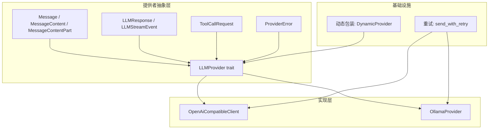
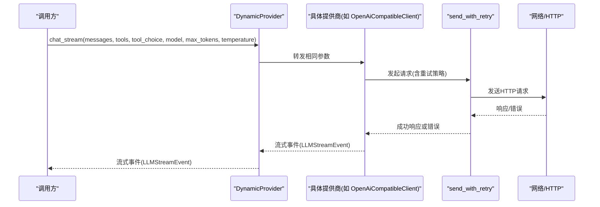
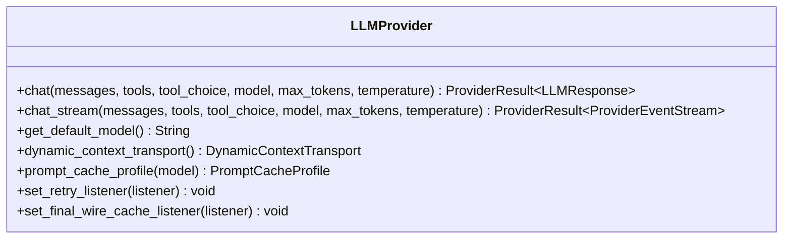
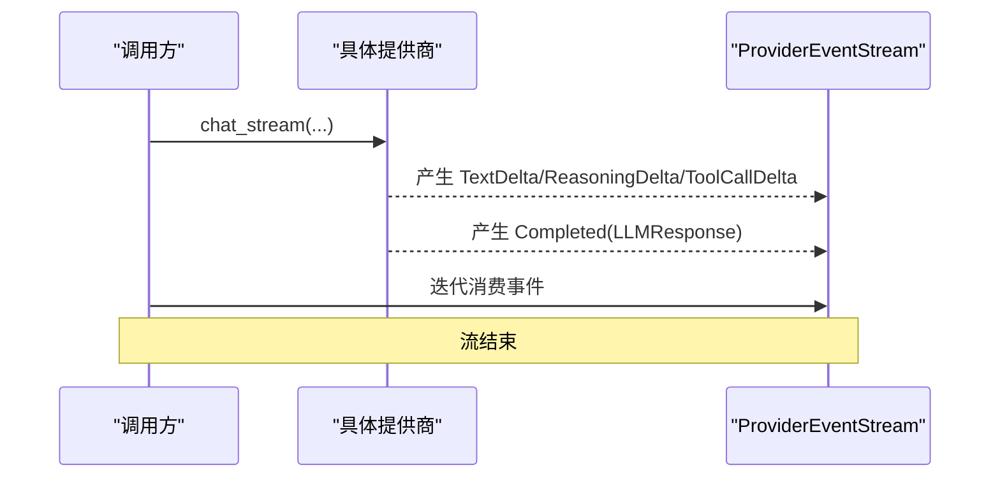
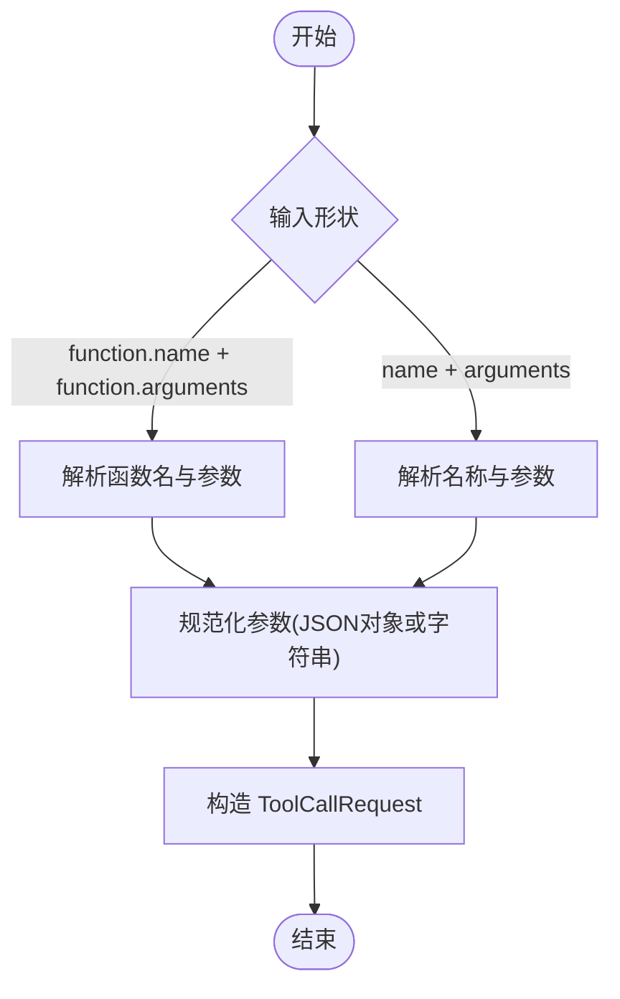
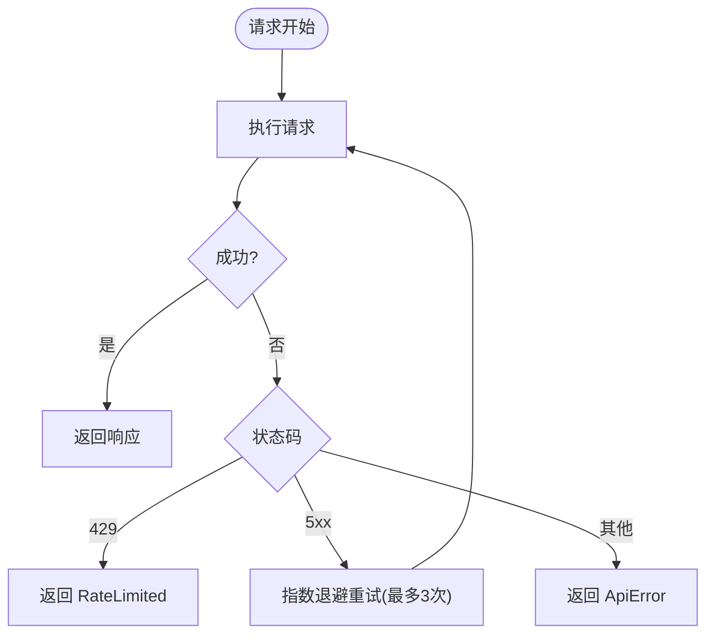
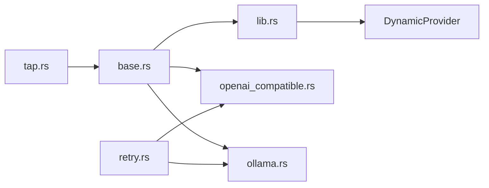

# Provider 基础接口

<cite>
**本文引用的文件**
- [base.rs](file://agent-diva-providers/src/base.rs)
- [lib.rs](file://agent-diva-providers/src/lib.rs)
- [retry.rs](file://agent-diva-providers/src/retry.rs)
- [openai_compatible.rs](file://agent-diva-providers/src/openai_compatible.rs)
- [tap.rs](file://agent-diva-providers/src/tap.rs)
- [siliconflow_chat_completions.rs](file://agent-diva-providers/examples/siliconflow_chat_completions.rs)
</cite>

## 目录
1. [简介](#简介)
2. [项目结构](#项目结构)
3. [核心组件](#核心组件)
4. [架构总览](#架构总览)
5. [详细组件分析](#详细组件分析)
6. [依赖关系分析](#依赖关系分析)
7. [性能考虑](#性能考虑)
8. [故障排查指南](#故障排查指南)
9. [结论](#结论)
10. [附录：使用示例与最佳实践](#附录使用示例与最佳实践)

## 简介
本文件聚焦于 agent-diva 的 Provider 基础接口，系统性阐述 LLMProvider trait 的设计与职责、消息模型（Message/MessageContent/MessageContentPart）的多模态设计、流式响应处理机制（LLMStreamEvent/ProviderEventStream）、工具调用请求（ToolCallRequest）的序列化/反序列化策略、错误处理（ProviderError）与重试机制（指数退避），以及性能优化建议。文档同时提供基于仓库内实现与示例的代码级参考路径，帮助读者正确理解和使用这些接口。

## 项目结构
- 提供者抽象与公共类型定义位于 agent-diva-providers/src/base.rs，包含 LLMProvider trait、消息模型、流事件、错误类型等。
- 具体提供商实现（如 OpenAI 兼容、Ollama 等）位于同 crate 的不同模块中，遵循 base 定义的契约。
- 重试逻辑在 retry.rs 中统一实现，供各提供商复用。
- 示例代码展示了如何以 HTTP 方式调用聊天补全接口，便于理解数据形态与流程。



图表来源
- [base.rs:708-780](file://agent-diva-providers/src/base.rs#L708-L780)
- [lib.rs:46-124](file://agent-diva-providers/src/lib.rs#L46-L124)
- [retry.rs:86-181](file://agent-diva-providers/src/retry.rs#L86-L181)

章节来源
- [base.rs:1-800](file://agent-diva-providers/src/base.rs#L1-L800)
- [lib.rs:1-124](file://agent-diva-providers/src/lib.rs#L1-L124)

## 核心组件
- LLMProvider trait：定义 chat、chat_stream、get_default_model 等核心方法，并支持可选的动态上下文传输、提示缓存配置、重试监听器注入等扩展点。
- 消息模型：Message 承载角色与内容；MessageContent 支持纯文本或结构化多模态片段；MessageContentPart 表示文本、图片 URL、本地文件引用、Base64 数据等。
- 流式事件：LLMStreamEvent 描述增量文本、推理内容、工具调用增量及最终完成事件；ProviderEventStream 是异步流类型。
- 工具调用：ToolCallRequest 表示模型返回的工具调用请求，支持自定义序列化/反序列化以兼容不同厂商格式。
- 错误与重试：ProviderError 分类错误类型；retry.rs 提供带指数退避与抖动的重试封装。

章节来源
- [base.rs:10-32](file://agent-diva-providers/src/base.rs#L10-L32)
- [base.rs:447-660](file://agent-diva-providers/src/base.rs#L447-L660)
- [base.rs:384-425](file://agent-diva-providers/src/base.rs#L384-L425)
- [base.rs:274-382](file://agent-diva-providers/src/base.rs#L274-L382)
- [retry.rs:17-47](file://agent-diva-providers/src/retry.rs#L17-L47)
- [retry.rs:86-181](file://agent-diva-providers/src/retry.rs#L86-L181)

## 架构总览
LLMProvider 作为统一抽象，屏蔽底层提供商差异。上层通过 DynamicProvider 可热切换具体实现；各实现内部复用重试、HTTP 工具等能力。流式与非流式 API 均暴露给调用方，保证一致体验。



图表来源
- [lib.rs:46-124](file://agent-diva-providers/src/lib.rs#L46-L124)
- [retry.rs:86-181](file://agent-diva-providers/src/retry.rs#L86-L181)
- [openai_compatible.rs:1116-1147](file://agent-diva-providers/src/openai_compatible.rs#L1116-L1147)

## 详细组件分析

### LLMProvider trait 与关键方法
- chat：同步聊天补全，返回 LLMResponse，支持传入工具、工具选择模式、模型、最大 token、温度等参数。
- chat_stream：默认实现会回退到非流式 chat，并将结果转换为流事件（先 TextDelta，再 Completed）。具体提供商可覆盖以实现真正的流式。
- get_default_model：返回提供商默认模型标识。
- 扩展点：dynamic_context_transport、prompt_cache_profile、set_retry_listener、set_final_wire_cache_listener。



图表来源
- [base.rs:708-780](file://agent-diva-providers/src/base.rs#L708-L780)

章节来源
- [base.rs:708-780](file://agent-diva-providers/src/base.rs#L708-L780)

### 消息模型与多模态支持
- Message：包含 role、content、name、tool_call_id、tool_calls、reasoning_content、thinking_blocks 等字段，用于构建对话历史。
- MessageContent：支持两种形态：
  - 文本字符串（兼容旧格式）
  - 多模态片段数组（Parts），每个片段为 MessageContentPart
- MessageContentPart：
  - Text：纯文本
  - ImageUrl：远程图片 URL
  - ImageFile：本地文件引用（file_id）
  - ImageData：Base64 数据 URI
- 辅助方法：
  - has_image：检测是否包含图片片段
  - to_text_lossy：将多模态内容降级为纯文本（丢弃非文本片段）
  - sanitize_text：对文本片段进行清洗转换
  - text_any：按谓词判断是否存在匹配文本

```mermaid
classDiagram
class Message {
+role : String
+content : MessageContent
+name : Option~String~
+tool_call_id : Option~String~
+tool_calls : Option~Vec~ToolCallRequest~~
+reasoning_content : Option~String~
+thinking_blocks : Option~Vec~serde_json : : Value~~
+user(content) Message
+system(content) Message
+assistant(content) Message
+tool(content, tool_call_id) Message
+has_image_content() bool
}
class MessageContent {
<<enum>>
+Text(String)
+Parts(Vec~MessageContentPart~)
+as_text() Option~&str~
+to_text_lossy() String
+sanitize_text(sanitize) void
+text_any(predicate) bool
+has_image() bool
}
class MessageContentPart {
<<enum>>
+Text{text}
+ImageUrl{image_url}
+ImageFile{image_file}
+ImageData{image_data}
+is_image() bool
}
Message --> MessageContent
MessageContent --> MessageContentPart
```

图表来源
- [base.rs:447-660](file://agent-diva-providers/src/base.rs#L447-L660)
- [base.rs:568-601](file://agent-diva-providers/src/base.rs#L568-L601)

章节来源
- [base.rs:447-660](file://agent-diva-providers/src/base.rs#L447-L660)
- [base.rs:568-601](file://agent-diva-providers/src/base.rs#L568-L601)

### 流式响应处理机制
- LLMStreamEvent：
  - TextDelta：增量助手文本
  - ReasoningDelta：增量推理内容
  - ToolCallDelta：增量工具调用元数据（索引、ID、名称、参数字符串增量）
  - Completed：最终完成事件，携带 LLMResponse
- ProviderEventStream：Pin<Box<dyn Stream<Item = ProviderResult<LLMStreamEvent>> + Send>>，表示异步流。
- 默认行为：若提供商未实现 chat_stream，则回退为非流式 chat，并生成一个 TextDelta（若有内容）和 Completed 事件。
- 具体实现：例如 OpenAI 兼容客户端在解析流式 chunk 时，持续累积工具调用与用量，并在结束时发送 Completed。



图表来源
- [base.rs:409-425](file://agent-diva-providers/src/base.rs#L409-L425)
- [base.rs:722-747](file://agent-diva-providers/src/base.rs#L722-L747)
- [openai_compatible.rs:1116-1147](file://agent-diva-providers/src/openai_compatible.rs#L1116-L1147)

章节来源
- [base.rs:409-425](file://agent-diva-providers/src/base.rs#L409-L425)
- [base.rs:722-747](file://agent-diva-providers/src/base.rs#L722-L747)
- [openai_compatible.rs:1116-1147](file://agent-diva-providers/src/openai_compatible.rs#L1116-L1147)

### 工具调用请求（ToolCallRequest）序列化与反序列化
- 数据结构：id、call_type、name、arguments（HashMap<String, Value>）。
- 序列化：将 arguments 序列化为 JSON 字符串，并以 function.name + function.arguments 的结构输出，兼容常见工具调用格式。
- 反序列化：支持两种输入形状：
  - 标准 function 对象（name + arguments）
  - 扁平 name + arguments 字段
  - arguments 可为对象或字符串（自动解包二次编码 JSON）
- 兼容性：当无法解析为对象时，保留原始字符串到 "raw" 键，避免丢失信息。



图表来源
- [base.rs:274-382](file://agent-diva-providers/src/base.rs#L274-L382)

章节来源
- [base.rs:274-382](file://agent-diva-providers/src/base.rs#L274-L382)

### 错误处理策略（ProviderError）
- 错误类型：
  - HttpError：HTTP 请求失败
  - JsonError：JSON 解析失败
  - InvalidResponse：无效响应（如 UTF-8 不完整）
  - ApiError：API 错误（包含状态码与消息）
  - ConfigError：配置错误
  - RateLimited：限流（可附带 retry-after）
- 错误分类：ProviderError 实现了 CategorizeError，将错误归类为可重试、配置、致命等类别，便于上层重试与降级策略。
- 重试策略：retry.rs 中的 send_with_retry 对 5xx 和网络错误进行指数退避重试（最多 3 次额外尝试），遇到 429 立即返回 RateLimited，不重试。



图表来源
- [base.rs:10-46](file://agent-diva-providers/src/base.rs#L10-L46)
- [retry.rs:86-181](file://agent-diva-providers/src/retry.rs#L86-L181)

章节来源
- [base.rs:10-46](file://agent-diva-providers/src/base.rs#L10-L46)
- [retry.rs:86-181](file://agent-diva-providers/src/retry.rs#L86-L181)

### 重试机制配置与监听
- 指数退避：延迟 = base × 2^(attempt-1) + 抖动（±20%），避免雪崩。
- 监听器：可通过 set_retry_listener 注入回调，每次重试前通知上层（model、attempt、max_retries、delay_ms、reason）。
- 上限：MAX_RETRIES=3（额外重试次数），BASE_DELAY_MS=1000ms。

章节来源
- [retry.rs:17-47](file://agent-diva-providers/src/retry.rs#L17-L47)
- [retry.rs:86-181](file://agent-diva-providers/src/retry.rs#L86-L181)
- [base.rs:767-773](file://agent-diva-providers/src/base.rs#L767-L773)

### 性能优化建议
- 流式优先：尽量使用 chat_stream 以降低首字节延迟，提升交互体验。
- 合理设置 max_tokens 与 temperature：控制响应长度与创造性，减少不必要开销。
- 多模态内容裁剪：仅传递必要图片片段，避免过大 payload。
- 使用 prompt cache：通过 prompt_cache_profile 启用提供商支持的提示缓存，降低重复请求成本。
- 错误快速失败与重试结合：对 429 快速失败，对 5xx 适度重试，避免无限重试。
- 监控与观测：利用 tap 模块或 final wire listener 记录最终请求体，便于分析与优化。

[本节为通用指导，无需特定文件来源]

## 依赖关系分析
- base.rs 定义了所有核心类型与 trait，被 lib.rs 重新导出，供上层使用。
- openai_compatible.rs 与 ollama 等实现遵循 base 契约，并使用 retry.rs 的重试能力。
- tap.rs 展示了对流事件的观察与统计（如 token 计数）。
- lib.rs 中的 DynamicProvider 提供了运行时替换具体实现的包装。



图表来源
- [lib.rs:1-42](file://agent-diva-providers/src/lib.rs#L1-L42)
- [base.rs:708-780](file://agent-diva-providers/src/base.rs#L708-L780)
- [retry.rs:86-181](file://agent-diva-providers/src/retry.rs#L86-L181)
- [tap.rs:250-274](file://agent-diva-providers/src/tap.rs#L250-L274)

章节来源
- [lib.rs:1-42](file://agent-diva-providers/src/lib.rs#L1-L42)
- [base.rs:708-780](file://agent-diva-providers/src/base.rs#L708-L780)
- [retry.rs:86-181](file://agent-diva-providers/src/retry.rs#L86-L181)
- [tap.rs:250-274](file://agent-diva-providers/src/tap.rs#L250-L274)

## 性能考虑
- 流式处理可降低端到端延迟，适合长回复场景。
- 合理选择模型与参数，避免过度消耗资源。
- 使用提示缓存与工具调用增量，减少冗余计算。
- 监控与日志有助于定位瓶颈与异常。

[本节为通用指导，无需特定文件来源]

## 故障排查指南
- 常见问题：
  - JSON 解析失败：检查响应结构与字段命名，必要时查看 raw 字段。
  - 限流（429）：等待 retry-after 或降低请求频率。
  - 服务器错误（5xx）：触发重试，关注重试次数与延迟。
  - 流中断或 UTF-8 不完整：检查网络与提供商稳定性。
- 诊断手段：
  - 启用 final wire 监听，记录最终请求体。
  - 使用重试监听器，捕获每次重试原因与延迟。
  - 对比不同提供商的实现差异，确认是否为适配问题。

章节来源
- [base.rs:10-46](file://agent-diva-providers/src/base.rs#L10-L46)
- [retry.rs:86-181](file://agent-diva-providers/src/retry.rs#L86-L181)
- [base.rs:120-128](file://agent-diva-providers/src/base.rs#L120-L128)

## 结论
Provider 基础接口通过统一的 LLMProvider trait 与丰富的数据类型，屏蔽了不同 LLM 提供商的差异，提供了稳定、可扩展且高性能的聊天与流式能力。结合错误分类与重试机制，系统具备较强的鲁棒性。建议在业务中优先采用流式接口，并结合提示缓存与工具调用优化性能。

[本节为总结，无需特定文件来源]

## 附录：使用示例与最佳实践
- 非流式聊天示例（参考外部 HTTP 调用）：
  - 参考路径：[siliconflow_chat_completions.rs:78-168](file://agent-diva-providers/examples/siliconflow_chat_completions.rs#L78-L168)
  - 说明：构造 messages 数组，设置 stream=false，解析 choices 获取 assistant content、finish_reason、reasoning_content 等。
- 流式聊天示例（参考提供商实现）：
  - 参考路径：[openai_compatible.rs:1116-1147](file://agent-diva-providers/src/openai_compatible.rs#L1116-L1147)
  - 说明：解析流式 chunk，累积 usage 与 finish_reason，最终发送 Completed 事件。
- 工具调用序列化/反序列化：
  - 参考路径：[base.rs:274-382](file://agent-diva-providers/src/base.rs#L274-L382)
  - 说明：arguments 支持对象或字符串，自动解包二次编码 JSON，兼容多种格式。
- 重试与监听：
  - 参考路径：[retry.rs:86-181](file://agent-diva-providers/src/retry.rs#L86-L181)
  - 说明：指数退避、抖动、429 快速失败、5xx 重试，并通过监听器上报进度。

章节来源
- [siliconflow_chat_completions.rs:78-168](file://agent-diva-providers/examples/siliconflow_chat_completions.rs#L78-L168)
- [openai_compatible.rs:1116-1147](file://agent-diva-providers/src/openai_compatible.rs#L1116-L1147)
- [base.rs:274-382](file://agent-diva-providers/src/base.rs#L274-L382)
- [retry.rs:86-181](file://agent-diva-providers/src/retry.rs#L86-L181)