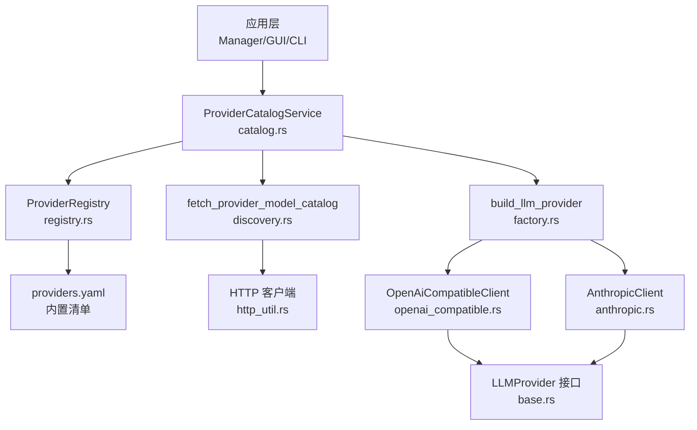
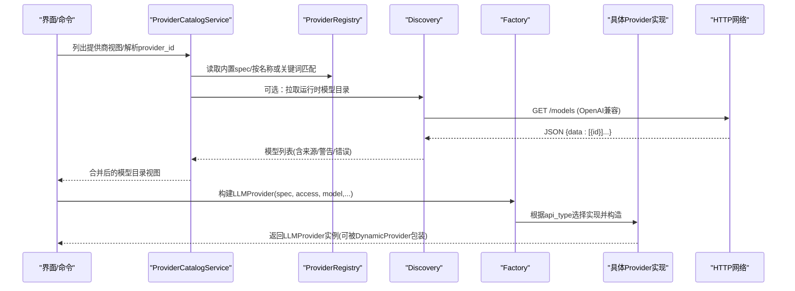
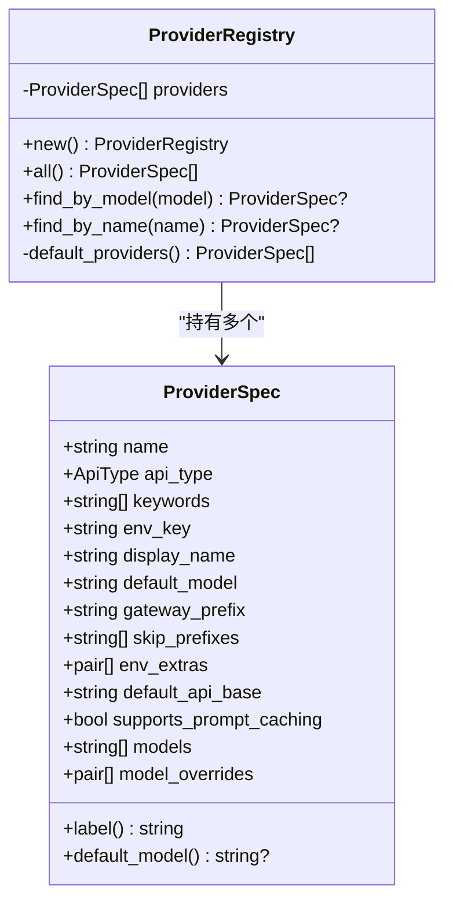
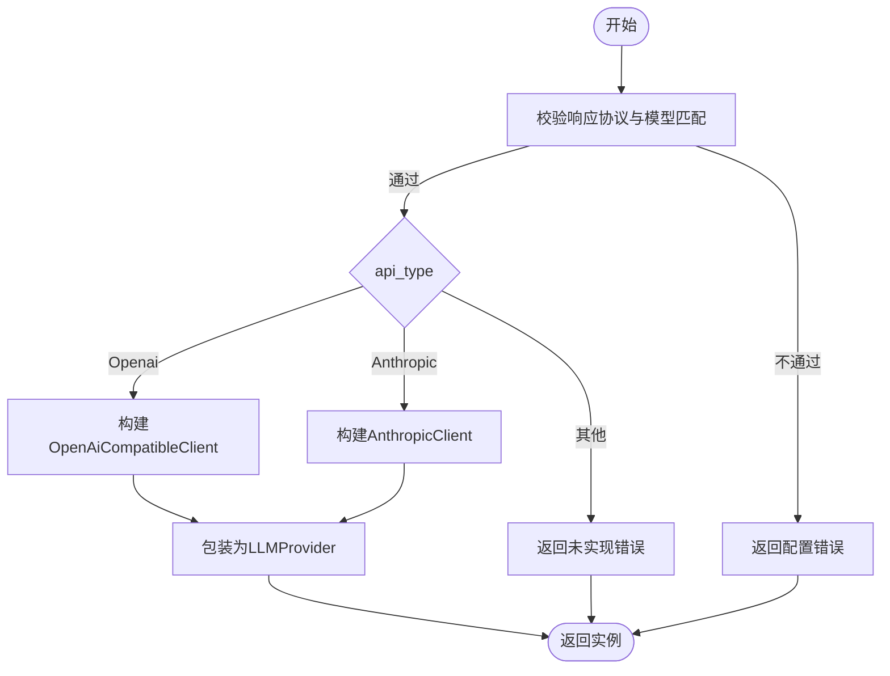
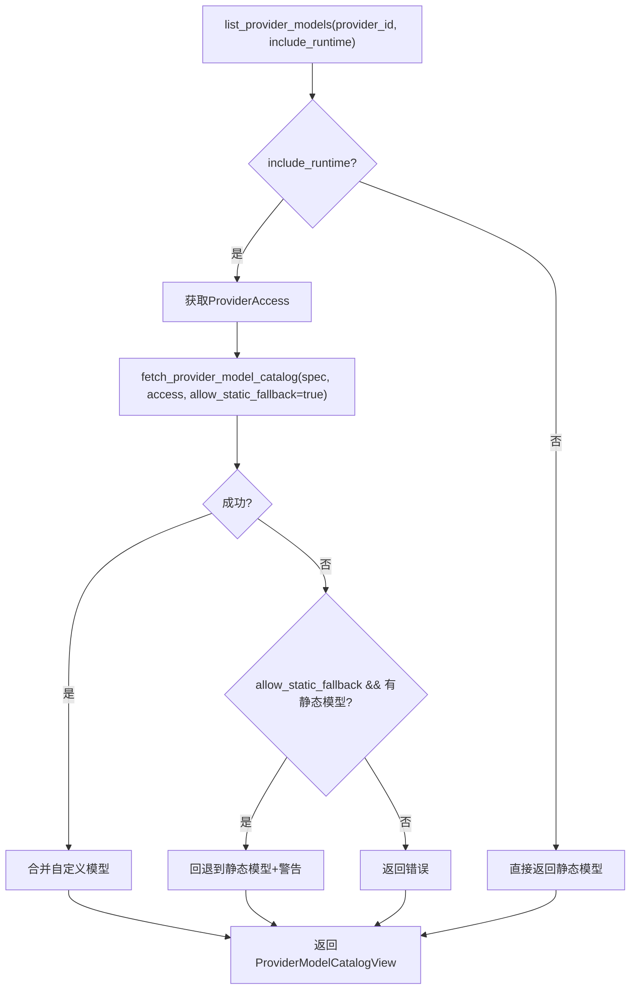
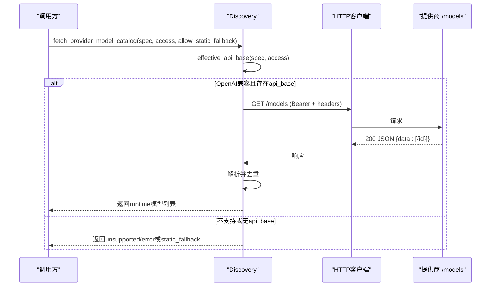
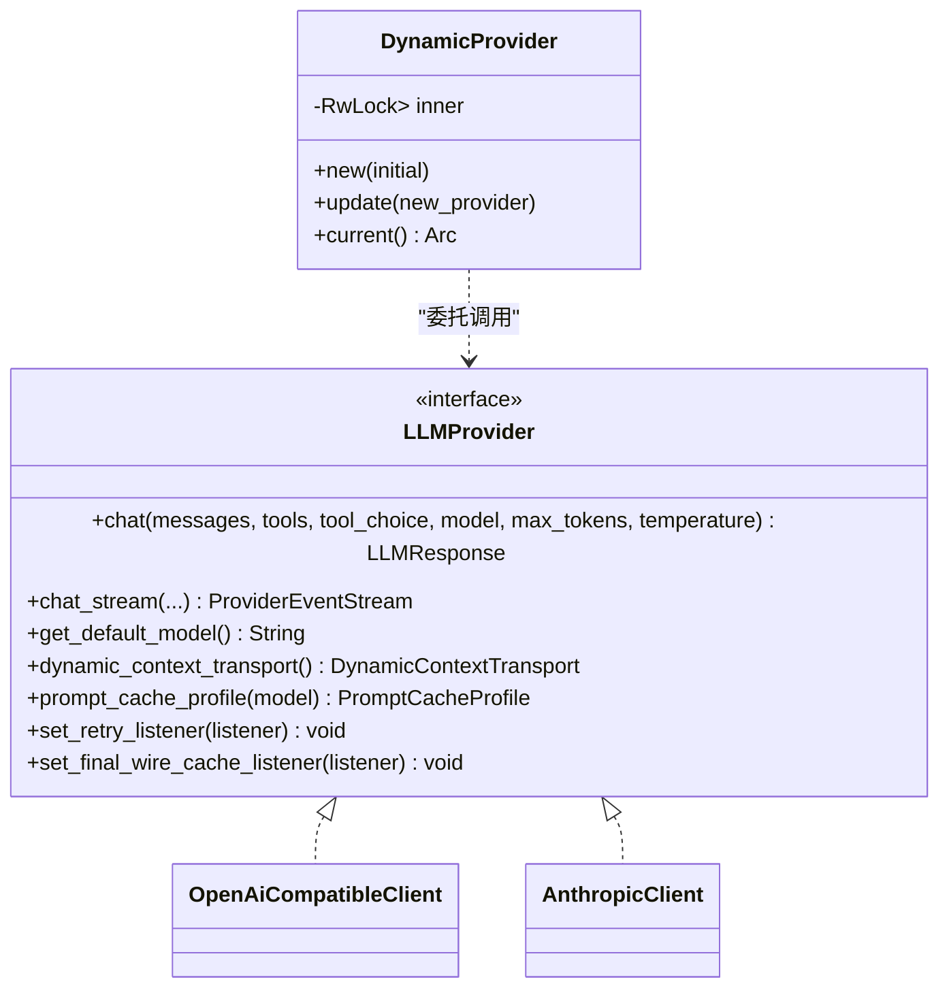
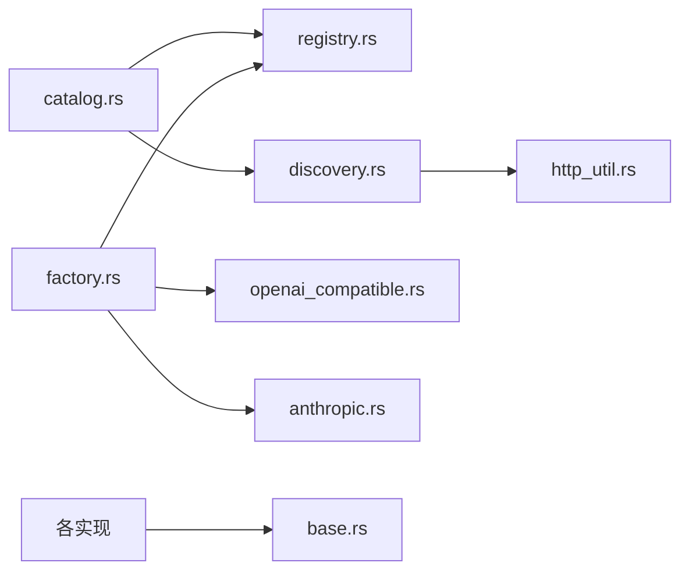

# 提供商注册与发现

<cite>
**本文引用的文件**
- [registry.rs](file://agent-diva-providers/src/registry.rs)
- [factory.rs](file://agent-diva-providers/src/factory.rs)
- [catalog.rs](file://agent-diva-providers/src/catalog.rs)
- [discovery.rs](file://agent-diva-providers/src/discovery.rs)
- [lib.rs](file://agent-diva-providers/src/lib.rs)
- [base.rs](file://agent-diva-providers/src/base.rs)
- [openai_compatible.rs](file://agent-diva-providers/src/openai_compatible.rs)
- [anthropic.rs](file://agent-diva-providers/src/anthropic.rs)
- [providers.yaml](file://agent-diva-providers/src/providers.yaml)
</cite>

## 目录
1. [简介](#简介)
2. [项目结构](#项目结构)
3. [核心组件](#核心组件)
4. [架构总览](#架构总览)
5. [详细组件分析](#详细组件分析)
6. [依赖关系分析](#依赖关系分析)
7. [性能考量](#性能考量)
8. [故障排查指南](#故障排查指南)
9. [结论](#结论)
10. [附录：扩展点与自定义提供商集成指南](#附录：扩展点与自定义提供商集成指南)

## 简介
本文件系统性阐述 Agent-Diva 的“提供商注册与发现”机制，覆盖以下主题：
- ProviderRegistry 的工作原理：提供商元数据管理、按模型关键词匹配、默认值与网关前缀等。
- ProviderFactory 的工厂模式：实例创建、配置校验（如响应协议与模型约束）、错误处理。
- 目录发现机制（catalog.rs）：统一视图、内置与自定义提供商合并、运行时模型目录获取与回退策略。
- 动态发现功能（discovery.rs）：基于 OpenAI 兼容 /models 接口的运行时扫描与热更新能力。
- 扩展点设计：如何新增提供商实现、接入自定义提供商、以及生命周期管理与依赖注入方式。

## 项目结构
围绕提供商子系统的关键文件与职责如下：
- registry.rs：定义 ProviderSpec、ApiType 与 ProviderRegistry，提供默认提供商清单加载与查找能力。
- factory.rs：根据 ProviderSpec 与访问凭据构建具体 LLMProvider 实例，并执行配置校验。
- catalog.rs：对外暴露 ProviderCatalogService，聚合内置与自定义提供商视图，并提供模型目录合并与增删改操作。
- discovery.rs：运行时通过 HTTP 调用 /models 接口拉取可用模型列表，支持静态回退与错误降级。
- base.rs：LLMProvider 抽象、消息/流事件、能力探测、错误分类等基础类型。
- openai_compatible.rs / anthropic.rs：OpenAI 兼容与 Anthropic 原生客户端的具体实现。
- providers.yaml：内置提供商清单（名称、API 类型、默认模型、默认 API Base、模型列表等）。
- lib.rs：导出公共类型与 DynamicProvider（可热替换的提供者包装器）。

图表来源
- [catalog.rs:71-193](file://agent-diva-providers/src/catalog.rs#L71-L193)
- [registry.rs:73-108](file://agent-diva-providers/src/registry.rs#L73-L108)
- [discovery.rs:63-113](file://agent-diva-providers/src/discovery.rs#L63-L113)
- [factory.rs:23-70](file://agent-diva-providers/src/factory.rs#L23-L70)
- [openai_compatible.rs:168-184](file://agent-diva-providers/src/openai_compatible.rs#L168-L184)
- [anthropic.rs:170-200](file://agent-diva-providers/src/anthropic.rs#L170-L200)
- [base.rs:708-780](file://agent-diva-providers/src/base.rs#L708-L780)

章节来源
- [registry.rs:1-108](file://agent-diva-providers/src/registry.rs#L1-L108)
- [catalog.rs:1-193](file://agent-diva-providers/src/catalog.rs#L1-L193)
- [discovery.rs:1-113](file://agent-diva-providers/src/discovery.rs#L1-L113)
- [factory.rs:1-70](file://agent-diva-providers/src/factory.rs#L1-L70)

## 核心组件
- ProviderRegistry：集中维护提供商元数据（名称、API 类型、关键词、默认模型、默认 API Base、模型列表、提示缓存支持等），并提供按模型关键词或名称查找的能力。
- ProviderCatalogService：面向上层的服务层，负责：
  - 列出提供商视图（内置 + 自定义），计算 configured/ready/runtime_supported/supports_model_discovery 等状态。
  - 解析 provider_id，优先使用显式指定、默认配置、模型前缀或关键词匹配。
  - 获取 ProviderAccess（api_key/api_base/extra_headers）用于运行时发现。
  - 合并运行时模型目录与自定义模型，去重、标记来源与可删除性。
  - 保存/删除自定义提供商，限制仅支持 OpenAI 兼容类型。
- Discovery：运行时发现模块，对 OpenAI 兼容提供商发起 GET /models 请求，解析 data[].id 得到模型列表；失败时可按策略回退到静态模型或返回错误。
- Factory：根据 ProviderSpec 与访问信息构建具体 LLMProvider 实例，并进行配置校验（例如 DeepSeek V4 DSML 协议要求特定模型）。
- Base：定义 LLMProvider trait、消息/流事件、能力探测、错误分类等基础契约。
- 具体实现：OpenAiCompatibleClient、AnthropicClient 分别实现 LLMProvider，封装各自协议的请求/响应与流式处理。

章节来源
- [registry.rs:17-108](file://agent-diva-providers/src/registry.rs#L17-L108)
- [catalog.rs:71-436](file://agent-diva-providers/src/catalog.rs#L71-L436)
- [discovery.rs:29-113](file://agent-diva-providers/src/discovery.rs#L29-L113)
- [factory.rs:13-70](file://agent-diva-providers/src/factory.rs#L13-L70)
- [base.rs:708-780](file://agent-diva-providers/src/base.rs#L708-L780)

## 架构总览
下图展示了从“配置/用户输入”到“提供商实例化与调用”的整体流程，包括目录发现与动态热替换能力。

图表来源
- [catalog.rs:82-193](file://agent-diva-providers/src/catalog.rs#L82-L193)
- [discovery.rs:63-113](file://agent-diva-providers/src/discovery.rs#L63-L113)
- [factory.rs:23-70](file://agent-diva-providers/src/factory.rs#L23-L70)
- [openai_compatible.rs:168-184](file://agent-diva-providers/src/openai_compatible.rs#L168-L184)
- [anthropic.rs:170-200](file://agent-diva-providers/src/anthropic.rs#L170-L200)

## 详细组件分析

### ProviderRegistry：提供商元数据与查找
- 数据结构：
  - ApiType：区分 OpenAI、Anthropic、Google、Other。
  - ProviderSpec：包含 identity（name、display_name、keywords、env_key）、gateway 相关（gateway_prefix、skip_prefixes）、默认值（default_model、default_api_base）、能力（supports_prompt_caching）、模型列表与每模型参数覆盖（model_overrides）。
- 行为：
  - new() 加载 providers.yaml 作为默认提供商清单。
  - find_by_model(model)：大小写不敏感，按 keywords 子串匹配。
  - find_by_name(name)：精确匹配 name。
  - label()/default_model()：辅助方法用于显示与默认模型解析。

图表来源
- [registry.rs:17-108](file://agent-diva-providers/src/registry.rs#L17-L108)

章节来源
- [registry.rs:17-108](file://agent-diva-providers/src/registry.rs#L17-L108)
- [providers.yaml:1-164](file://agent-diva-providers/src/providers.yaml#L1-L164)

### ProviderFactory：工厂模式与配置校验
- 输入：LlmProviderBuildOptions（spec、access、model、reasoning_effort/config、response_protocol）。
- 逻辑：
  - 校验 response_protocol=DeepseekV4Dsml 时，模型必须包含 deepseek-v4。
  - 根据 spec.api_type 选择实现：
    - Openai -> OpenAiCompatibleClient::new_with_config(...)
    - Anthropic -> AnthropicClient::new(...)
    - Google/Other -> 返回配置错误。
  - 将额外请求头、provider_name、推理配置等透传给具体实现。
- 输出：Arc<dyn LLMProvider>，可通过 DynamicProvider 进行热替换。

图表来源
- [factory.rs:23-70](file://agent-diva-providers/src/factory.rs#L23-L70)

章节来源
- [factory.rs:13-70](file://agent-diva-providers/src/factory.rs#L13-L70)
- [base.rs:708-780](file://agent-diva-providers/src/base.rs#L708-L780)

### 目录发现机制（catalog.rs）：视图、合并与配置
- 提供商视图（ProviderView）：
  - 标识（id、display_name、source）、能力（runtime_supported、supports_model_discovery）、配置状态（configured、ready）、API Base 等。
- 模型目录视图（ProviderModelCatalogView）：
  - 来源（runtime/static_fallback/custom）、模型条目（selectable/deletable）、自定义模型列表、警告与错误。
- 关键服务方法：
  - list_provider_views：合并内置与自定义提供商，排序展示。
  - resolve_provider_id：优先级：显式 preferred > 默认配置 > 模型前缀 > 关键词匹配。
  - get_provider_access：从固定槽位或自定义提供商提取访问凭据。
  - list_provider_models：按需拉取运行时模型目录，并与自定义模型合并去重。
  - add/remove_provider_model：维护 custom_models/models 列表。
  - save_custom_provider：仅允许 api_type=openai，清理多余斜杠、去重模型。
  - delete_custom_provider：移除自定义提供商。
- 内部规则：
  - supports_runtime_discovery：当前仅 OpenAI 类型支持运行时发现。
  - custom_provider_spec：将自定义提供商映射为 ProviderSpec，便于统一处理。

图表来源
- [catalog.rs:161-193](file://agent-diva-providers/src/catalog.rs#L161-L193)
- [discovery.rs:63-113](file://agent-diva-providers/src/discovery.rs#L63-L113)

章节来源
- [catalog.rs:71-436](file://agent-diva-providers/src/catalog.rs#L71-L436)

### 动态发现功能（discovery.rs）：运行时扫描与热更新
- ProviderAccess：封装 api_key、api_base、extra_headers，可从配置派生。
- fetch_provider_model_catalog：
  - 若 spec.api_type=Openai 且存在 api_base，则尝试 OpenAI 兼容发现。
  - 成功：返回 runtime 来源的模型列表。
  - 失败：若允许静态回退且有静态模型，则返回 static_fallback 并附带警告；否则返回 unsupported/error。
- effective_api_base：优先使用配置的 api_base，否则回退到 spec.default_api_base。
- fetch_openai_compatible_models：
  - 构建 HTTP 客户端，GET /models，携带 Bearer Token 与额外头部。
  - 解析 JSON data[].id，去重后返回。
  - 错误处理：网络错误、非成功状态码、JSON 解析失败均会转换为结构化错误信息。

图表来源
- [discovery.rs:63-113](file://agent-diva-providers/src/discovery.rs#L63-L113)
- [discovery.rs:163-246](file://agent-diva-providers/src/discovery.rs#L163-L246)

章节来源
- [discovery.rs:29-113](file://agent-diva-providers/src/discovery.rs#L29-L113)
- [discovery.rs:163-246](file://agent-diva-providers/src/discovery.rs#L163-L246)

### 提供商实现与生命周期管理
- LLMProvider 接口：
  - chat/chat_stream：同步/流式对话。
  - get_default_model：默认模型。
  - dynamic_context_transport：上下文传输策略。
  - prompt_cache_profile：提示缓存策略。
  - set_retry_listener/set_final_wire_cache_listener：重试与最终报文监听。
- 具体实现：
  - OpenAiCompatibleClient：封装 OpenAI 兼容协议，处理工具调用、流式增量、推理内容等。
  - AnthropicClient：封装 Anthropic Messages API，处理文本/思考/工具调用块与流式事件。
- 动态替换：
  - DynamicProvider：以 RwLock<Arc<dyn LLMProvider>> 包装，支持 update(current/new)，current() 获取当前实例，所有方法转发至底层实现，从而实现运行时热替换。

图表来源
- [base.rs:708-780](file://agent-diva-providers/src/base.rs#L708-L780)
- [openai_compatible.rs:168-184](file://agent-diva-providers/src/openai_compatible.rs#L168-L184)
- [anthropic.rs:170-200](file://agent-diva-providers/src/anthropic.rs#L170-L200)
- [lib.rs:46-124](file://agent-diva-providers/src/lib.rs#L46-L124)

章节来源
- [base.rs:708-780](file://agent-diva-providers/src/base.rs#L708-L780)
- [lib.rs:46-124](file://agent-diva-providers/src/lib.rs#L46-L124)

## 依赖关系分析
- 模块耦合：
  - catalog.rs 依赖 registry.rs（内置 spec）、discovery.rs（运行时模型）、config（ProvidersConfig）。
  - factory.rs 依赖 registry.rs（spec/api_type）、discovery.rs（ProviderAccess）、具体实现（openai_compatible、anthropic）。
  - discovery.rs 依赖 http_util（HTTP 客户端构建）与 registry.rs（spec）。
  - base.rs 被所有实现引用，提供统一契约与错误分类。
- 外部依赖：
  - reqwest：HTTP 请求。
  - serde/serde_json：序列化/反序列化。
  - agent_diva_core：配置、错误分类、推理配置等。

图表来源
- [catalog.rs:1-5](file://agent-diva-providers/src/catalog.rs#L1-L5)
- [factory.rs:1-11](file://agent-diva-providers/src/factory.rs#L1-L11)
- [discovery.rs:1-5](file://agent-diva-providers/src/discovery.rs#L1-L5)

章节来源
- [catalog.rs:1-5](file://agent-diva-providers/src/catalog.rs#L1-L5)
- [factory.rs:1-11](file://agent-diva-providers/src/factory.rs#L1-L11)
- [discovery.rs:1-5](file://agent-diva-providers/src/discovery.rs#L1-L5)

## 性能考量
- 运行时发现：
  - 仅在 OpenAI 兼容且存在 api_base 时启用，避免不必要的网络开销。
  - 超时与错误快速失败，必要时回退到静态模型，保证可用性。
- 模型列表去重：
  - 使用有序集合去重，避免重复项影响 UI 与选择逻辑。
- 流式处理：
  - 流式解码器确保跨分片的 UTF-8 完整性，减少无效重试。
- 缓存策略：
  - 通过 prompt_cache_profile 控制提示缓存策略，不同提供商差异化处理。

[本节为通用指导，无需具体文件引用]

## 故障排查指南
- 常见错误与定位：
  - 配置错误：当 response_protocol 与模型不匹配（如 DeepSeek V4 DSML 要求 deepseek-v4），会返回配置错误。检查 factory.rs 中的校验逻辑。
  - 运行时发现失败：
    - 无 api_base：effective_api_base 为空，导致无法发起请求。
    - HTTP 错误：非成功状态码会生成带状态码与摘要的错误信息。
    - JSON 解析失败：返回 invalid JSON 错误。
  - 静态回退：当运行时发现失败但允许静态回退且存在静态模型时，返回 static_fallback 并附带警告。
- 建议步骤：
  - 确认 ProviderAccess 中 api_key 与 api_base 是否正确。
  - 检查提供商是否支持运行时发现（当前仅限 OpenAI 兼容）。
  - 查看 catalog.rs 合并结果中的 warnings 与 error 字段，定位问题来源。
  - 对于 Anthropic 等原生提供商，使用静态模型列表或通过网关适配。

章节来源
- [factory.rs:23-70](file://agent-diva-providers/src/factory.rs#L23-L70)
- [discovery.rs:115-143](file://agent-diva-providers/src/discovery.rs#L115-L143)
- [discovery.rs:179-246](file://agent-diva-providers/src/discovery.rs#L179-L246)
- [catalog.rs:389-436](file://agent-diva-providers/src/catalog.rs#L389-L436)

## 结论
该子系统通过 ProviderRegistry 集中管理提供商元数据，结合 ProviderCatalogService 提供统一的视图与模型目录管理能力；Discovery 模块实现了 OpenAI 兼容提供商的运行时模型发现与回退策略；Factory 以工厂模式完成实例化与配置校验；Base 定义了统一的 LLMProvider 接口，并由具体实现适配不同协议；DynamicProvider 提供了运行时热替换能力。整体设计清晰、可扩展，便于新增提供商与定制行为。

[本节为总结，无需具体文件引用]

## 附录：扩展点与自定义提供商集成指南
- 新增提供商实现：
  - 在 base.rs 的 LLMProvider 接口基础上实现新客户端（参考 openai_compatible.rs 与 anthropic.rs）。
  - 在 factory.rs 中添加新的 api_type 分支，返回对应实现。
  - 在 providers.yaml 中添加新提供商的元数据（name、api_type、keywords、env_key、display_name、default_model、default_api_base、models 等）。
- 自定义提供商（运行时）：
  - 通过 catalog.rs 的 save_custom_provider 添加自定义提供商，目前仅支持 api_type=openai。
  - 设置 api_base 与 api_key，即可启用运行时模型发现（/models）。
  - 可使用 extra_headers 传递认证或追踪头。
- 生命周期与依赖注入：
  - 使用 DynamicProvider 包装具体实现，可在运行时调用 update(new_provider) 进行热替换。
  - 上层通过 ProviderCatalogService 获取 ProviderAccess 与模型目录，再交由 Factory 构建实例。
- 最佳实践：
  - 合理设置默认模型与模型列表，避免运行时发现失败影响体验。
  - 对错误进行分类与上报，利用 retry 与 final wire cache listener 增强可观测性。
  - 保持 providers.yaml 与自定义配置的一致性，避免冲突。

章节来源
- [base.rs:708-780](file://agent-diva-providers/src/base.rs#L708-L780)
- [openai_compatible.rs:168-184](file://agent-diva-providers/src/openai_compatible.rs#L168-L184)
- [anthropic.rs:170-200](file://agent-diva-providers/src/anthropic.rs#L170-L200)
- [factory.rs:23-70](file://agent-diva-providers/src/factory.rs#L23-L70)
- [catalog.rs:239-276](file://agent-diva-providers/src/catalog.rs#L239-L276)
- [lib.rs:46-124](file://agent-diva-providers/src/lib.rs#L46-L124)