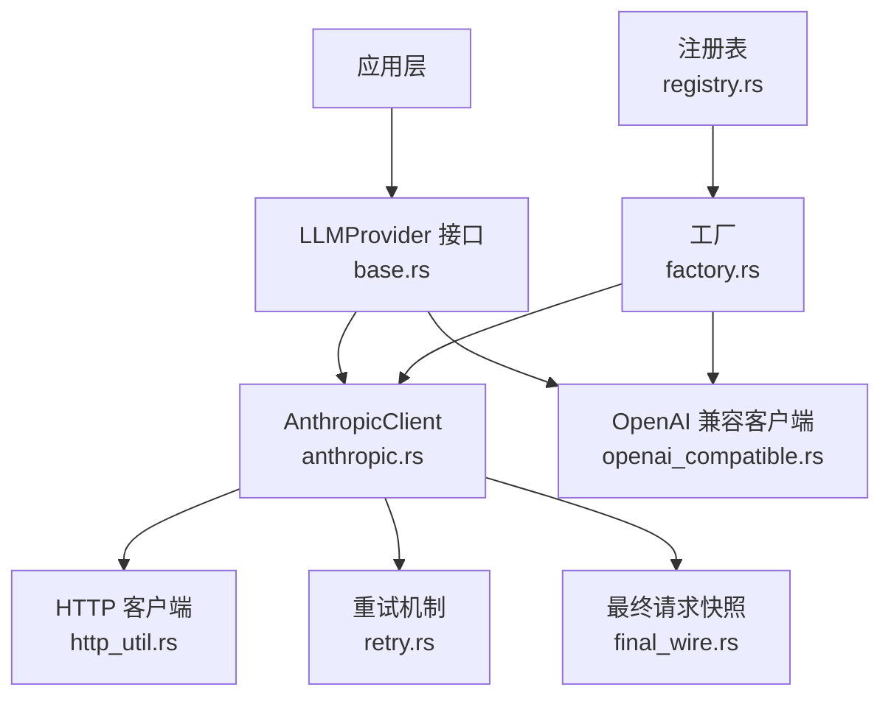
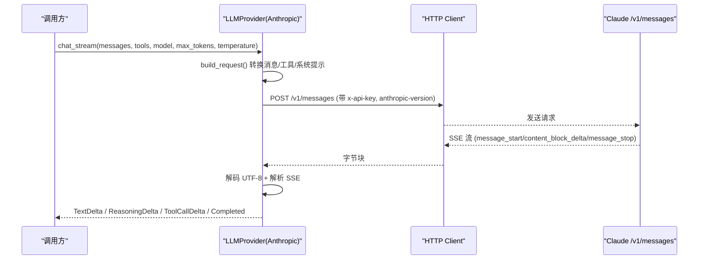
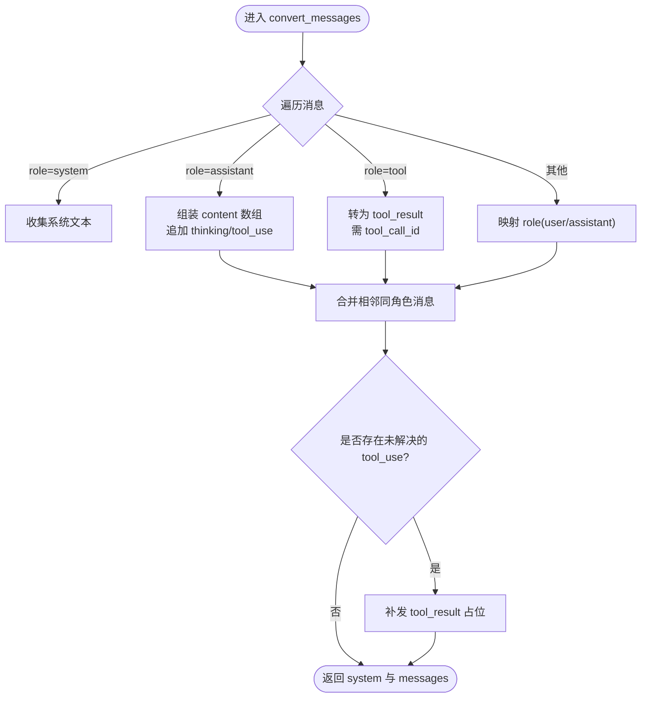
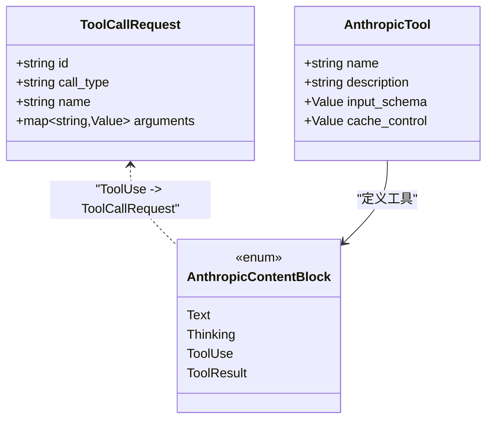
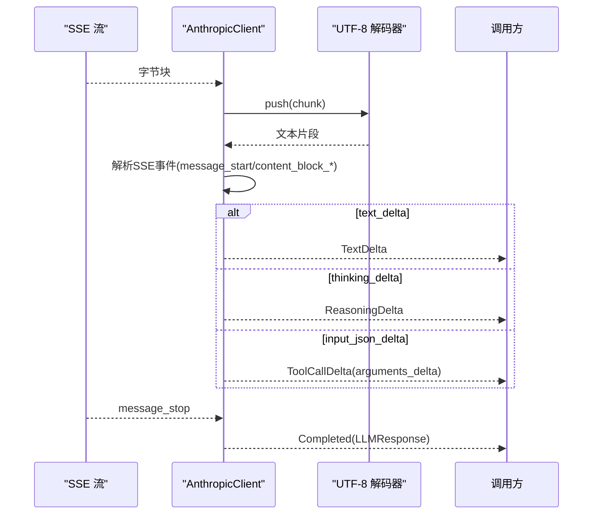
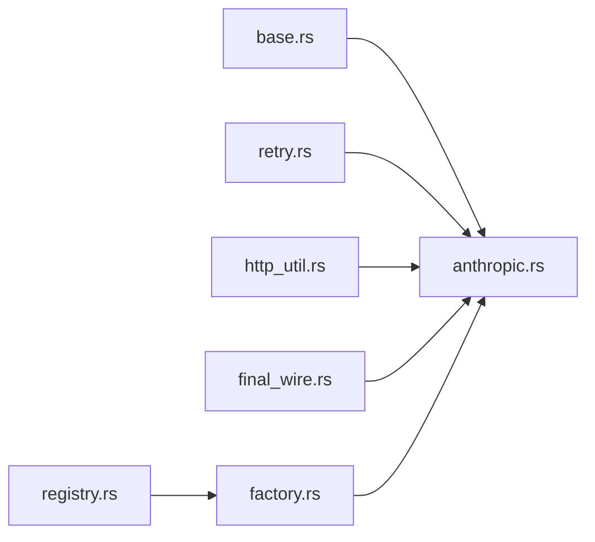

# Anthropic Claude 提供商

<cite>
**本文引用的文件**
- [anthropic.rs](file://agent-diva-providers/src/anthropic.rs)
- [base.rs](file://agent-diva-providers/src/base.rs)
- [factory.rs](file://agent-diva-providers/src/factory.rs)
- [lib.rs](file://agent-diva-providers/src/lib.rs)
- [retry.rs](file://agent-diva-providers/src/retry.rs)
- [http_util.rs](file://agent-diva-providers/src/http_util.rs)
- [final_wire.rs](file://agent-diva-providers/src/final_wire.rs)
- [registry.rs](file://agent-diva-providers/src/registry.rs)
</cite>

## 目录
1. [简介](#简介)
2. [项目结构](#项目结构)
3. [核心组件](#核心组件)
4. [架构总览](#架构总览)
5. [详细组件分析](#详细组件分析)
6. [依赖关系分析](#依赖关系分析)
7. [性能考量](#性能考量)
8. [故障排查指南](#故障排查指南)
9. [结论](#结论)
10. [附录：配置与调试](#附录：配置与调试)

## 简介
本文件面向在 agent-diva 中使用 Anthropic Claude 的开发者，系统性说明 Claude API 的集成实现与使用方式。内容涵盖消息格式转换、工具调用支持、流式响应处理、系统提示词与“思考”内容（thinking）的处理、与 OpenAI 格式的适配逻辑、错误与速率限制处理、以及性能优化建议与调试技巧。

## 项目结构
Claude 提供商位于 providers 子模块中，围绕统一的 LLMProvider 接口实现，并通过工厂与注册表进行构建与发现。关键文件职责如下：
- anthropic.rs：Claude 原生 Messages API 客户端，负责请求构造、SSE 流解析、工具定义转换、系统提示词与 thinking 内容处理等。
- base.rs：LLMProvider 抽象、通用数据结构（Message、ToolCallRequest、LLMResponse、LLMStreamEvent）、能力探测与动态上下文传输策略等。
- factory.rs：根据 ProviderSpec 与访问信息构建具体 provider（含 Anthropic）。
- registry.rs：提供默认 provider 元数据（如 Anthropic 的默认模型与基础地址）。
- retry.rs：指数退避重试、429 速率限制识别与处理。
- http_util.rs：HTTP 客户端构建（超时、HTTP/1.1 强制、代理禁用策略）。
- final_wire.rs：对最终出站请求做快照，用于缓存与可观测性。
- lib.rs：对外暴露统一能力与 DynamicProvider 包装。

图表来源
- [factory.rs:23-70](file://agent-diva-providers/src/factory.rs#L23-L70)
- [anthropic.rs:170-205](file://agent-diva-providers/src/anthropic.rs#L170-L205)
- [base.rs:708-780](file://agent-diva-providers/src/base.rs#L708-L780)
- [registry.rs:104-108](file://agent-diva-providers/src/registry.rs#L104-L108)

章节来源
- [factory.rs:23-70](file://agent-diva-providers/src/factory.rs#L23-L70)
- [registry.rs:104-108](file://agent-diva-providers/src/registry.rs#L104-L108)
- [anthropic.rs:170-205](file://agent-diva-providers/src/anthropic.rs#L170-L205)
- [base.rs:708-780](file://agent-diva-providers/src/base.rs#L708-L780)

## 核心组件
- AnthropicClient：实现 LLMProvider，封装 Claude Messages API 的请求与响应处理。
- Message/ToolCallRequest/LLMResponse/LLMStreamEvent：跨提供商的统一消息与事件模型。
- PromptCacheProfile/DynamicContextTransport：控制提示词缓存策略与运行时上下文投递方式。
- Retry/HTTP 工具：为所有 provider 提供稳定的网络与重试保障。

章节来源
- [anthropic.rs:170-205](file://agent-diva-providers/src/anthropic.rs#L170-L205)
- [base.rs:384-425](file://agent-diva-providers/src/base.rs#L384-L425)
- [base.rs:662-706](file://agent-diva-providers/src/base.rs#L662-L706)
- [retry.rs:86-181](file://agent-diva-providers/src/retry.rs#L86-L181)
- [http_util.rs:25-39](file://agent-diva-providers/src/http_util.rs#L25-L39)

## 架构总览
Claude 提供商通过统一接口对外提供服务，内部将上层传入的消息转换为 Claude 原生 Messages 格式，并处理系统提示词、工具定义、thinking 内容与流式事件。请求经 HTTP 工具构建客户端发送，遇到临时错误时由重试模块进行指数退避重试；流式响应按 SSE 事件逐步解码并转换为 LLMStreamEvent。

图表来源
- [anthropic.rs:382-570](file://agent-diva-providers/src/anthropic.rs#L382-L570)
- [anthropic.rs:211-240](file://agent-diva-providers/src/anthropic.rs#L211-L240)
- [anthropic.rs:251-264](file://agent-diva-providers/src/anthropic.rs#L251-L264)
- [retry.rs:94-181](file://agent-diva-providers/src/retry.rs#L94-L181)

## 详细组件分析

### AnthropicClient 与消息格式转换
- 请求体字段：model、max_tokens、temperature、messages、system（可选）、tools（可选）、stream（可选）。
- 系统提示词：将 system 角色消息拆分为多个 text block，首个 block 附加 cache_control=ephemeral，以利用提示词缓存。
- 消息转换：
  - assistant 消息中的 reasoning_content 会作为 thinking 块追加到 content 数组。
  - tool 角色消息会被转换为 tool_result，要求携带 tool_call_id。
  - 若存在未解决的 tool_use（无对应 tool_result），会补发一条占位 tool_result，避免对话中断。
- 图片输入：当前不支持图像输入，遇到图像内容会返回配置错误。

图表来源
- [anthropic.rs:577-656](file://agent-diva-providers/src/anthropic.rs#L577-L656)
- [anthropic.rs:658-697](file://agent-diva-providers/src/anthropic.rs#L658-L697)

章节来源
- [anthropic.rs:21-33](file://agent-diva-providers/src/anthropic.rs#L21-L33)
- [anthropic.rs:35-78](file://agent-diva-providers/src/anthropic.rs#L35-L78)
- [anthropic.rs:577-656](file://agent-diva-providers/src/anthropic.rs#L577-L656)
- [anthropic.rs:658-697](file://agent-diva-providers/src/anthropic.rs#L658-L697)

### 工具调用支持与 OpenAI 格式适配
- 工具定义转换：
  - 接受 OpenAI 风格的 function 或顶层 name/description/parameters 结构。
  - 将 parameters 映射为 input_schema；若无则使用空对象 schema。
  - 自动为最后一个工具添加 cache_control=ephemeral（若未显式指定），以提升缓存命中。
- 工具调用解析：
  - 非流式：将 tool_use 块转换为 ToolCallRequest，arguments 规范化为键值映射。
  - 流式：维护 StreamingToolUse 累积 partial_json，结束时解析为 arguments。
- 工具选择：
  - 接口参数包含 tool_choice，但 Claude 原生 Messages 不直接使用该字段；实现中忽略该参数，保持与上游一致。

图表来源
- [base.rs:274-382](file://agent-diva-providers/src/base.rs#L274-L382)
- [anthropic.rs:70-78](file://agent-diva-providers/src/anthropic.rs#L70-L78)
- [anthropic.rs:699-737](file://agent-diva-providers/src/anthropic.rs#L699-L737)
- [anthropic.rs:739-744](file://agent-diva-providers/src/anthropic.rs#L739-L744)
- [anthropic.rs:768-782](file://agent-diva-providers/src/anthropic.rs#L768-L782)

章节来源
- [anthropic.rs:699-737](file://agent-diva-providers/src/anthropic.rs#L699-L737)
- [anthropic.rs:739-744](file://agent-diva-providers/src/anthropic.rs#L739-L744)
- [anthropic.rs:768-782](file://agent-diva-providers/src/anthropic.rs#L768-L782)
- [base.rs:274-382](file://agent-diva-providers/src/base.rs#L274-L382)

### 流式响应处理
- 使用 SSE 事件类型：
  - message_start：获取初始 usage 与 stop_reason。
  - content_block_start：识别 tool_use 的开始（id/name）。
  - content_block_delta：
    - text_delta：输出文本增量。
    - thinking_delta：输出推理/思考增量。
    - input_json_delta：累积工具调用参数增量。
  - message_delta：更新 usage/stop_reason。
  - message_stop：完成流，汇总生成最终 LLMResponse。
- 流式工具调用：
  - 按 index 维护 StreamingToolUse，结束时排序并解析为 ToolCallRequest。
- 空闲超时：
  - 设置 STREAM_IDLE_TIMEOUT（60s），超过则上报 ApiError。

图表来源
- [anthropic.rs:426-570](file://agent-diva-providers/src/anthropic.rs#L426-L570)
- [base.rs:82-129](file://agent-diva-providers/src/base.rs#L82-L129)

章节来源
- [anthropic.rs:426-570](file://agent-diva-providers/src/anthropic.rs#L426-L570)
- [base.rs:82-129](file://agent-diva-providers/src/base.rs#L82-L129)

### 系统提示词与“思考”内容
- 系统提示词：
  - 将 system 消息拆分为多段 text block，第一段启用 ephemeral 缓存控制，提升缓存命中率。
- “思考”内容：
  - assistant 的 reasoning_content 会作为 thinking 块加入 content 数组。
  - 流式中 thinking_delta 会触发 ReasoningDelta 事件，便于 UI 展示推理过程。

章节来源
- [anthropic.rs:211-240](file://agent-diva-providers/src/anthropic.rs#L211-L240)
- [anthropic.rs:577-606](file://agent-diva-providers/src/anthropic.rs#L577-L606)
- [anthropic.rs:492-503](file://agent-diva-providers/src/anthropic.rs#L492-L503)

### 安全过滤与模型能力
- 安全过滤：
  - 代码库未内置针对 Claude 的安全过滤器；安全策略应在更上层（如沙箱、治理、工具结果过滤）实施。
- 模型能力：
  - base.rs 提供模型能力探测，包括 vision、reasoning、context_window。
  - Claude 系列模型被标记为支持 reasoning/thinking，且具备不同上下文窗口大小。

章节来源
- [base.rs:131-256](file://agent-diva-providers/src/base.rs#L131-L256)

### 与标准 OpenAI 格式的适配逻辑
- 工具定义：
  - 兼容 OpenAI 的 function 描述（name/description/parameters），并映射为 Claude 的 input_schema。
- 响应格式：
  - 将 Claude 的 tool_use 与 text/thinking 统一映射为 LLMResponse 的 content、tool_calls、reasoning_content 与 finish_reason。
- 工具选择：
  - 接口保留 tool_choice 参数，但 Claude 原生 Messages 不使用该字段，实现中忽略。

章节来源
- [anthropic.rs:699-737](file://agent-diva-providers/src/anthropic.rs#L699-L737)
- [anthropic.rs:266-292](file://agent-diva-providers/src/anthropic.rs#L266-L292)
- [base.rs:708-780](file://agent-diva-providers/src/base.rs#L708-L780)

### 错误处理策略
- 错误分类：
  - ProviderError 包含 HttpError、JsonError、InvalidResponse、ApiError、ConfigError、RateLimited。
  - classify_api_error 将超时、429/408/425/5xx 归类为可重试。
- 重试机制：
  - send_with_retry 对 5xx 与网络错误进行指数退避重试（最多 3 次额外尝试），429 立即返回 RateLimited。
  - 支持 RetryListener 回调，便于上层展示进度。
- 流式错误：
  - UTF-8 解码失败、JSON 解析失败、SSE 空闲超时均会转化为 ProviderError。

章节来源
- [base.rs:10-67](file://agent-diva-providers/src/base.rs#L10-L67)
- [retry.rs:49-181](file://agent-diva-providers/src/retry.rs#L49-L181)
- [anthropic.rs:438-470](file://agent-diva-providers/src/anthropic.rs#L438-L470)

### 速率限制处理
- 429 状态码：
  - 直接返回 ProviderError::RateLimited，并尝试从 Retry-After 头解析等待秒数。
- 上层策略：
  - 建议在调用方根据 retry_after 进行等待或降级策略。

章节来源
- [retry.rs:55-84](file://agent-diva-providers/src/retry.rs#L55-L84)
- [retry.rs:143-147](file://agent-diva-providers/src/retry.rs#L143-L147)

### 性能优化建议
- 提示词缓存：
  - 系统提示词首段启用 ephemeral 缓存；工具定义末尾工具也启用 ephemeral 缓存。
  - final_wire 快照记录稳定系统与核心工具哈希，有助于缓存命中评估。
- HTTP 客户端：
  - 本地或 http:// 强制 HTTP/1.1，避免 ALPN 问题；本地地址禁用代理。
- 流式处理：
  - 使用增量事件减少首字延迟；合理设置空闲超时避免长时间阻塞。
- 上下文窗口：
  - 依据 base.rs 的 context_window_for_model 估算可用上下文，预留输出与缓冲空间。

章节来源
- [anthropic.rs:226-237](file://agent-diva-providers/src/anthropic.rs#L226-L237)
- [anthropic.rs:731-737](file://agent-diva-providers/src/anthropic.rs#L731-L737)
- [final_wire.rs:23-49](file://agent-diva-providers/src/final_wire.rs#L23-L49)
- [http_util.rs:25-39](file://agent-diva-providers/src/http_util.rs#L25-L39)
- [base.rs:209-246](file://agent-diva-providers/src/base.rs#L209-L246)

## 依赖关系分析
- AnthropicClient 依赖：
  - base.rs：LLMProvider 接口与通用数据结构。
  - retry.rs：send_with_retry 重试。
  - http_util.rs：构建 reqwest Client。
  - final_wire.rs：最终请求快照。
- 工厂与注册表：
  - factory.rs 根据 ProviderSpec 的 api_type 选择 AnthropicClient。
  - registry.rs 提供默认 provider 元数据（如 Anthropic 的默认模型与基础地址）。

图表来源
- [anthropic.rs:11-16](file://agent-diva-providers/src/anthropic.rs#L11-L16)
- [factory.rs:23-70](file://agent-diva-providers/src/factory.rs#L23-L70)
- [registry.rs:104-108](file://agent-diva-providers/src/registry.rs#L104-L108)

章节来源
- [anthropic.rs:11-16](file://agent-diva-providers/src/anthropic.rs#L11-L16)
- [factory.rs:23-70](file://agent-diva-providers/src/factory.rs#L23-L70)
- [registry.rs:104-108](file://agent-diva-providers/src/registry.rs#L104-L108)

## 性能考量
- 流式优先：使用 chat_stream 降低首字延迟，配合 ReasoningDelta 与 ToolCallDelta 提升交互体验。
- 缓存策略：合理使用 ephemeral 缓存（系统提示词与工具定义），减少重复计算。
- 超时与重试：合理设置请求超时与空闲超时；利用重试机制应对瞬时错误。
- 上下文管理：基于模型上下文窗口估算有效上下文，避免溢出。

[本节为通用指导，无需特定文件引用]

## 故障排查指南
- 常见错误：
  - 缺少 API Key：require_api_key 校验失败，返回 ConfigError。
  - 图片输入：当前不支持，返回 ConfigError。
  - 工具消息缺失 tool_call_id：返回 ConfigError。
  - JSON 解析失败：返回 JsonError。
  - UTF-8 解码失败：返回 InvalidResponse。
  - 流式空闲超时：返回 ApiError。
- 诊断步骤：
  - 检查 API Key 与基础地址是否正确。
  - 确认工具定义是否包含 name 与 parameters。
  - 查看重试日志与错误分类，判断是否为 429/5xx。
  - 使用 final_wire 快照观察稳定系统与核心工具变化。

章节来源
- [anthropic.rs:242-249](file://agent-diva-providers/src/anthropic.rs#L242-L249)
- [anthropic.rs:658-683](file://agent-diva-providers/src/anthropic.rs#L658-L683)
- [anthropic.rs:455-470](file://agent-diva-providers/src/anthropic.rs#L455-L470)
- [base.rs:10-67](file://agent-diva-providers/src/base.rs#L10-L67)

## 结论
Anthropic Claude 提供商在 agent-diva 中以统一接口实现，完整支持消息转换、工具调用、流式响应、系统提示词与思考内容处理，并提供健壮的重试与错误分类机制。通过提示词缓存与 HTTP 客户端优化，可在保证稳定性的同时提升性能。上层应结合模型能力与上下文窗口进行合理配置，并在需要时实施安全与治理策略。

[本节为总结，无需特定文件引用]

## 附录：配置与调试

### 配置选项
- 必填：
  - model：模型标识（如 claude-sonnet-4-5）。
  - max_tokens：最大输出 token 数。
  - temperature：采样温度。
- 可选：
  - top_p、top_k：当前实现未直接传递至 Claude 请求体；如需支持，需在请求构造处扩展。
  - stream：流式开关（chat_stream 内部固定为 true）。
  - extra_headers：自定义请求头。
  - api_base：默认 https://api.anthropic.com，可覆盖。
- 系统提示词：
  - 通过 system 消息传入，首段启用 ephemeral 缓存。
- 工具定义：
  - 支持 OpenAI 风格 function 描述，自动映射为 input_schema。

章节来源
- [anthropic.rs:21-33](file://agent-diva-providers/src/anthropic.rs#L21-L33)
- [anthropic.rs:211-240](file://agent-diva-providers/src/anthropic.rs#L211-L240)
- [anthropic.rs:699-737](file://agent-diva-providers/src/anthropic.rs#L699-L737)
- [registry.rs:191-198](file://agent-diva-providers/src/registry.rs#L191-L198)

### 调试技巧
- 启用重试监听：
  - 通过 set_retry_listener 接收每次重试的 attempt、delay_ms、reason，便于 UI 展示。
- 观察最终请求快照：
  - 通过 set_final_wire_cache_listener 捕获 stable_system_hash 与 core_tools_hash，辅助定位缓存失效原因。
- 流式事件：
  - 订阅 TextDelta、ReasoningDelta、ToolCallDelta 与 Completed，逐步验证响应结构与内容。
- 错误分类：
  - 根据 ProviderError 类型与 classify_api_error 的分类结果，决定重试或降级策略。

章节来源
- [anthropic.rs:315-324](file://agent-diva-providers/src/anthropic.rs#L315-L324)
- [final_wire.rs:23-49](file://agent-diva-providers/src/final_wire.rs#L23-L49)
- [retry.rs:94-181](file://agent-diva-providers/src/retry.rs#L94-L181)
- [base.rs:34-67](file://agent-diva-providers/src/base.rs#L34-L67)