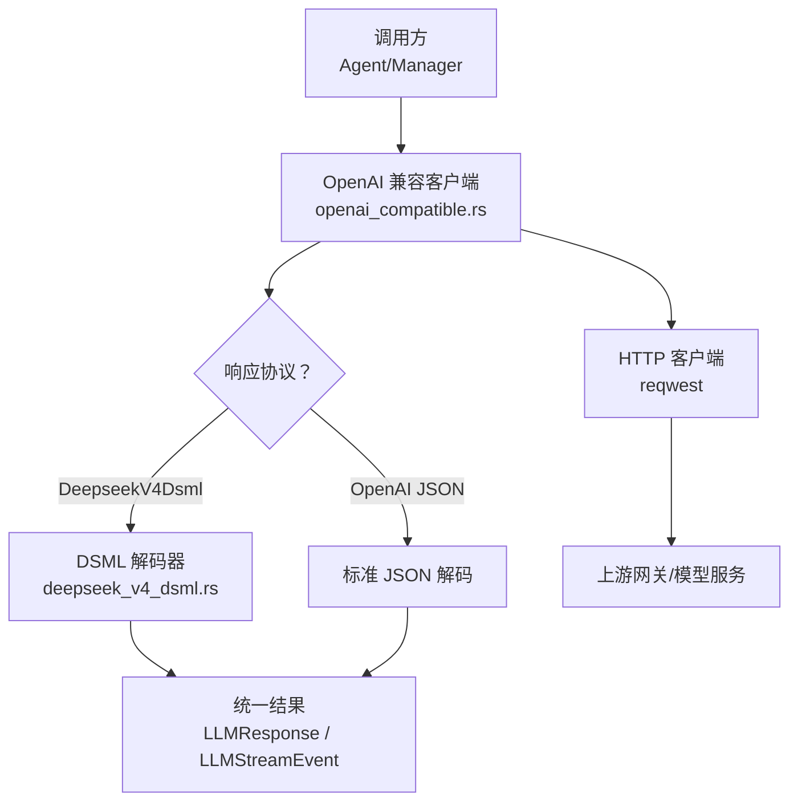
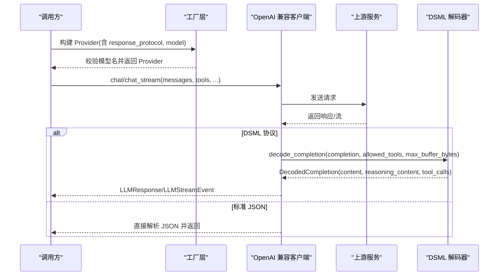
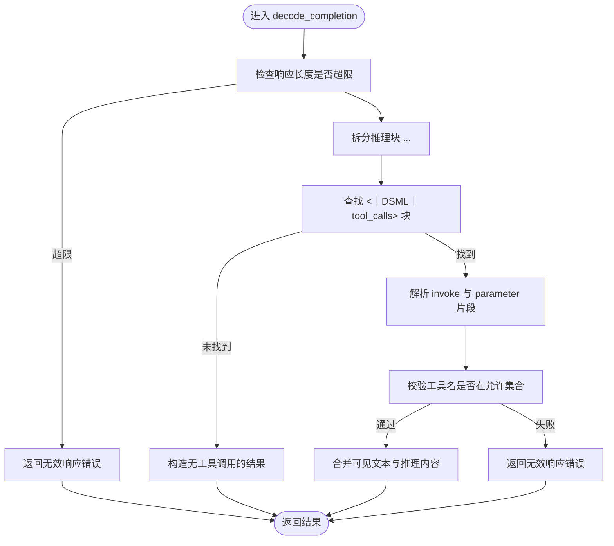
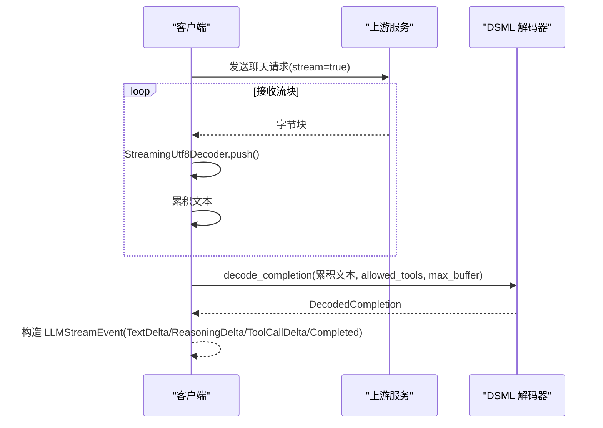
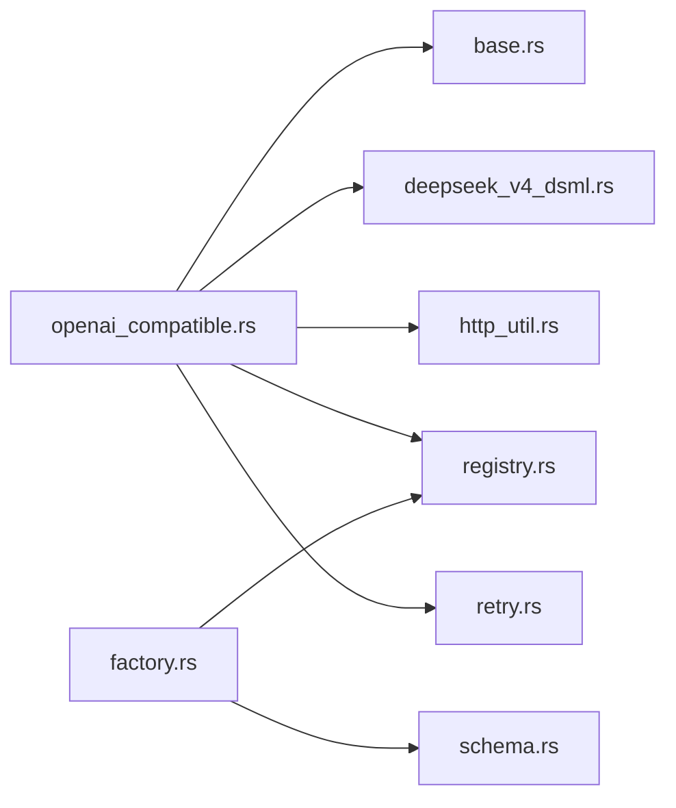

# DeepSeek V4 DSML 提供商

<cite>
**本文引用的文件**
- [deepseek_v4_dsml.rs](file://agent-diva-providers/src/deepseek_v4_dsml.rs)
- [openai_compatible.rs](file://agent-diva-providers/src/openai_compatible.rs)
- [base.rs](file://agent-diva-providers/src/base.rs)
- [factory.rs](file://agent-diva-providers/src/factory.rs)
- [registry.rs](file://agent-diva-providers/src/registry.rs)
- [providers.yaml](file://agent-diva-providers/src/providers.yaml)
- [schema.rs](file://agent-diva-core/src/config/schema.rs)
</cite>

## 目录
1. [简介](#简介)
2. [项目结构](#项目结构)
3. [核心组件](#核心组件)
4. [架构总览](#架构总览)
5. [详细组件分析](#详细组件分析)
6. [依赖关系分析](#依赖关系分析)
7. [性能考虑](#性能考虑)
8. [故障排查指南](#故障排查指南)
9. [结论](#结论)
10. [附录：配置与使用示例](#附录：配置与使用示例)

## 简介
本文件面向 DeepSeek V4 DSML 提供商的专用实现，聚焦以下目标：
- 解释 DSML 协议的特殊要求与响应格式编码。
- 详解 decode_completion 函数的实现逻辑：内容提取、工具调用解析、推理内容处理。
- 说明与标准 OpenAI 兼容接口的区别及适配策略。
- 提供流式响应解析要点、错误处理机制、调试方法与性能优化建议。
- 给出完整的配置示例与典型使用场景。

## 项目结构
DeepSeek V4 DSML 能力由“OpenAI 兼容客户端 + DSML 解码器”组合实现：
- OpenAI 兼容客户端负责 HTTP 请求、流式读取、事件组装，并在需要时切换到 DSML 解码路径。
- DSML 解码器严格解析 DSML 标记（思考块、工具调用块、参数块），输出统一的内部类型。
- 工厂层对 response_protocol=DeepseekV4Dsml 进行模型名校验，确保仅对 DeepSeek V4 模型启用该协议。
- 注册表与提供者清单提供默认模型与元数据。

图表来源
- [openai_compatible.rs:168-184](file://agent-diva-providers/src/openai_compatible.rs#L168-L184)
- [deepseek_v4_dsml.rs:21-67](file://agent-diva-providers/src/deepseek_v4_dsml.rs#L21-L67)
- [factory.rs:23-40](file://agent-diva-providers/src/factory.rs#L23-L40)

章节来源
- [openai_compatible.rs:168-184](file://agent-diva-providers/src/openai_compatible.rs#L168-L184)
- [factory.rs:23-40](file://agent-diva-providers/src/factory.rs#L23-L40)
- [registry.rs:140-163](file://agent-diva-providers/src/registry.rs#L140-L163)
- [providers.yaml:140-163](file://agent-diva-providers/src/providers.yaml#L140-L163)

## 核心组件
- DSML 解码器：将 DSML 文本转换为 provider-neutral 的 DecodedCompletion（包含 content、reasoning_content、tool_calls）。
- OpenAI 兼容客户端：封装请求构建、流式读取、事件发射；在 DSML 模式下调用解码器。
- 基础类型与流式 UTF-8 解码：统一消息、工具调用、流事件等类型，并提供安全的增量 UTF-8 解码。
- 工厂与注册表：按配置选择协议与模型，维护默认模型与提供者元信息。

章节来源
- [deepseek_v4_dsml.rs:21-67](file://agent-diva-providers/src/deepseek_v4_dsml.rs#L21-L67)
- [base.rs:708-780](file://agent-diva-providers/src/base.rs#L708-L780)
- [openai_compatible.rs:168-184](file://agent-diva-providers/src/openai_compatible.rs#L168-L184)
- [factory.rs:23-40](file://agent-diva-providers/src/factory.rs#L23-L40)
- [registry.rs:140-163](file://agent-diva-providers/src/registry.rs#L140-L163)

## 架构总览
DSML 模式下的端到端流程如下：
- 构建选项携带 response_protocol=DeepseekV4Dsml，并指定 deepseek-v4 系列模型。
- 工厂层校验模型名是否包含 “deepseek-v4”，否则返回配置错误。
- OpenAI 兼容客户端发起请求；若为流式响应，逐块累积文本。
- 当检测到 DSML 协议时，将完整响应交由 DSML 解码器解析。
- 解码器严格匹配 DSML 标记，提取推理内容与工具调用，并生成统一结果。
- 上层通过 LLMResponse/LLMStreamEvent 消费结果。

图表来源
- [factory.rs:23-40](file://agent-diva-providers/src/factory.rs#L23-L40)
- [openai_compatible.rs:168-184](file://agent-diva-providers/src/openai_compatible.rs#L168-L184)
- [deepseek_v4_dsml.rs:21-67](file://agent-diva-providers/src/deepseek_v4_dsml.rs#L21-L67)

## 详细组件分析

### DSML 解码器：decode_completion 与协议约束
- 输入限制：拒绝超过配置的缓冲大小，防止恶意或异常响应占用内存。
- 推理内容提取：
  - 查找 <think>...</think> 块，要求必须闭合且只能出现一次。
  - 推理内容位于 think 块内；若无 think 块则推理内容为空。
- 工具调用块解析：
  - 定位 <｜DSML｜tool_calls>...</｜DSML｜tool_calls> 块，要求唯一且闭合。
  - 块内可包含多个 <｜DSML｜invoke name="...">...</｜DSML｜invoke> 片段。
  - 每个 invoke 片段必须包含至少一个 <｜DSML｜parameter name="..." string="true|false">...</｜DSML｜parameter> 列表。
  - 参数 string=true 表示值为原始字符串；string=false 表示值为 JSON 对象。
  - 工具名必须在允许的工具集合中，否则报错。
- 可见内容：
  - 去除 tool_calls 块后，剩余前后拼接部分作为 visible 文本，再 trim 去空后成为 content。
- 错误处理：
  - 未闭合标签、重复标签、未知工具、非法参数值等均返回 InvalidResponse。

图表来源
- [deepseek_v4_dsml.rs:29-67](file://agent-diva-providers/src/deepseek_v4_dsml.rs#L29-L67)
- [deepseek_v4_dsml.rs:69-92](file://agent-diva-providers/src/deepseek_v4_dsml.rs#L69-L92)
- [deepseek_v4_dsml.rs:94-169](file://agent-diva-providers/src/deepseek_v4_dsml.rs#L94-L169)

章节来源
- [deepseek_v4_dsml.rs:29-67](file://agent-diva-providers/src/deepseek_v4_dsml.rs#L29-L67)
- [deepseek_v4_dsml.rs:69-92](file://agent-diva-providers/src/deepseek_v4_dsml.rs#L69-L92)
- [deepseek_v4_dsml.rs:94-169](file://agent-diva-providers/src/deepseek_v4_dsml.rs#L94-L169)

### OpenAI 兼容客户端中的 DSML 适配
- 协议切换：
  - 当 response_protocol=DeepseekV4Dsml 时，客户端在收到响应后将文本交给 DSML 解码器。
  - 非 DSML 模式走标准 JSON 解码路径。
- 流式支持：
  - 使用 StreamingUtf8Decoder 安全地增量解码 UTF-8 字节流。
  - 流事件包括 TextDelta、ReasoningDelta、ToolCallDelta、Completed。
- 工具调用：
  - DSML 模式下，工具调用来自 decode_completion 的结果。
  - 标准 JSON 模式下，工具调用来自流式 delta 的 function.name/arguments 增量。
- 请求构建：
  - 根据模型与能力设置合理参数（如 reasoning_effort、stream_options.include_usage）。

图表来源
- [openai_compatible.rs:168-184](file://agent-diva-providers/src/openai_compatible.rs#L168-L184)
- [openai_compatible.rs:104-149](file://agent-diva-providers/src/openai_compatible.rs#L104-L149)
- [base.rs:82-129](file://agent-diva-providers/src/base.rs#L82-L129)
- [deepseek_v4_dsml.rs:21-67](file://agent-diva-providers/src/deepseek_v4_dsml.rs#L21-L67)

章节来源
- [openai_compatible.rs:168-184](file://agent-diva-providers/src/openai_compatible.rs#L168-L184)
- [base.rs:82-129](file://agent-diva-providers/src/base.rs#L82-L129)

### 基础类型与流式事件
- ToolCallRequest：统一工具调用结构，支持序列化为 OpenAI 兼容格式。
- LLMResponse：包含 content、tool_calls、finish_reason、usage、reasoning_content。
- LLMStreamEvent：TextDelta、ReasoningDelta、ToolCallDelta、Completed。
- StreamingUtf8Decoder：保证跨 chunk 的 UTF-8 完整性，避免替换字符。

章节来源
- [base.rs:274-396](file://agent-diva-providers/src/base.rs#L274-L396)
- [base.rs:409-425](file://agent-diva-providers/src/base.rs#L409-L425)
- [base.rs:82-129](file://agent-diva-providers/src/base.rs#L82-L129)

### 工厂层与配置校验
- 强制要求：response_protocol=DeepseekV4Dsml 时，model 必须包含 “deepseek-v4”。
- 默认模型：DeepSeek 提供者默认模型优先为 deepseek-v4-pro、deepseek-v4-flash。
- 注册表：提供模型列表与元数据，便于自动发现与显示。

章节来源
- [factory.rs:23-40](file://agent-diva-providers/src/factory.rs#L23-L40)
- [registry.rs:140-163](file://agent-diva-providers/src/registry.rs#L140-L163)
- [providers.yaml:140-163](file://agent-diva-providers/src/providers.yaml#L140-L163)

## 依赖关系分析
- openai_compatible.rs 依赖：
  - base.rs：LLMProvider trait、LLMResponse、LLMStreamEvent、StreamingUtf8Decoder、ToolCallRequest。
  - deepseek_v4_dsml.rs：decode_completion。
  - http_util.rs：构建 HTTP 客户端。
  - registry.rs：ProviderSpec 与默认模型。
  - retry.rs：重试监听器。
- factory.rs 依赖：
  - registry.rs：ProviderSpec。
  - schema.rs：ProviderResponseProtocol。
- schema.rs 定义：
  - ProviderResponseProtocol 枚举，包含 OpenaiJson 与 DeepseekV4Dsml。

图表来源
- [openai_compatible.rs:15-22](file://agent-diva-providers/src/openai_compatible.rs#L15-L22)
- [factory.rs:6-11](file://agent-diva-providers/src/factory.rs#L6-L11)
- [schema.rs:1245-1255](file://agent-diva-core/src/config/schema.rs#L1245-L1255)

章节来源
- [openai_compatible.rs:15-22](file://agent-diva-providers/src/openai_compatible.rs#L15-L22)
- [factory.rs:6-11](file://agent-diva-providers/src/factory.rs#L6-L11)
- [schema.rs:1245-1255](file://agent-diva-core/src/config/schema.rs#L1245-L1255)

## 性能考虑
- 缓冲限制：decode_completion 对响应长度进行上限检查，避免大响应导致内存压力。
- 流式解码：StreamingUtf8Decoder 以增量方式处理 UTF-8，减少中间拷贝与错误替换。
- 最小化解析：仅在 DSML 模式下执行严格的标记解析；标准 JSON 模式走轻量路径。
- 工具调用缓存：allowed_tools 集合用于快速校验工具名，降低重复查找开销。
- 建议：
  - 合理设置 max_buffer_bytes，结合模型最大上下文窗口与响应长度预期。
  - 在高频调用场景下复用 HTTP 客户端与解码器实例。
  - 对长响应启用流式传输，避免一次性加载完整响应。

[本节为通用性能指导，不直接分析具体文件]

## 故障排查指南
- 常见错误分类：
  - InvalidResponse：DSML 标记未闭合、重复、非法参数、未知工具、超出缓冲限制。
  - ConfigError：response_protocol=DeepseekV4Dsml 但模型名不包含 “deepseek-v4”。
  - HttpError/RateLimited：网络问题或限流，可通过重试机制处理。
- 调试方法：
  - 启用日志记录，捕获上游响应原始文本，确认 DSML 标记是否正确。
  - 逐步缩小输入范围，验证单个 think/tool_calls/invoke/parameter 片段。
  - 检查 allowed_tools 集合是否包含模型返回的工具名。
  - 对于流式场景，检查 StreamingUtf8Decoder 是否成功完成，避免截断。
- 修复建议：
  - 修正上游 DSML 输出格式，确保标签成对且顺序正确。
  - 调整 max_buffer_bytes 以容纳更长响应。
  - 更新 allowed_tools 白名单，确保与实际工具一致。

章节来源
- [base.rs:11-46](file://agent-diva-providers/src/base.rs#L11-L46)
- [factory.rs:23-40](file://agent-diva-providers/src/factory.rs#L23-L40)
- [deepseek_v4_dsml.rs:29-67](file://agent-diva-providers/src/deepseek_v4_dsml.rs#L29-L67)

## 结论
DeepSeek V4 DSML 提供商通过在 OpenAI 兼容客户端中集成严格 DSML 解码器，实现了：
- 对 DSML 协议的强约束解析，确保推理内容与工具调用的准确提取。
- 与标准 OpenAI JSON 模式的清晰分离与按需切换。
- 安全的流式 UTF-8 解码与统一的内部类型输出。
- 明确的配置校验与错误分类，便于运维与排障。
建议在启用 DSML 模式时，配合合理的缓冲限制、流式传输与日志记录，以获得稳定高效的体验。

[本节为总结性内容，不直接分析具体文件]

## 附录：配置与使用示例
- 配置项：
  - response_protocol：设置为 deepseek_v4_dsml 以启用 DSML 模式。
  - model：必须为 deepseek-v4 系列（例如 deepseek-v4-pro、deepseek-v4-flash）。
  - api_base/api_key：依据上游网关或官方 API 配置。
  - extra_headers：可选，用于附加鉴权或追踪头。
- 使用场景：
  - 对话问答：启用 DSML 模式获取推理内容与工具调用。
  - 工具调用：模型返回 invoke 片段，系统执行工具并将结果回传。
  - 流式交互：实时展示文本与推理内容，提升用户体验。
- 注意事项：
  - 非 deepseek-v4 模型请勿启用 DSML 模式。
  - 确保上游服务输出符合 DSML 规范，否则将触发 InvalidResponse。
  - 在高并发场景下，注意缓冲限制与流式处理的资源占用。

章节来源
- [schema.rs:1245-1255](file://agent-diva-core/src/config/schema.rs#L1245-L1255)
- [factory.rs:23-40](file://agent-diva-providers/src/factory.rs#L23-L40)
- [registry.rs:140-163](file://agent-diva-providers/src/registry.rs#L140-L163)
- [providers.yaml:140-163](file://agent-diva-providers/src/providers.yaml#L140-L163)