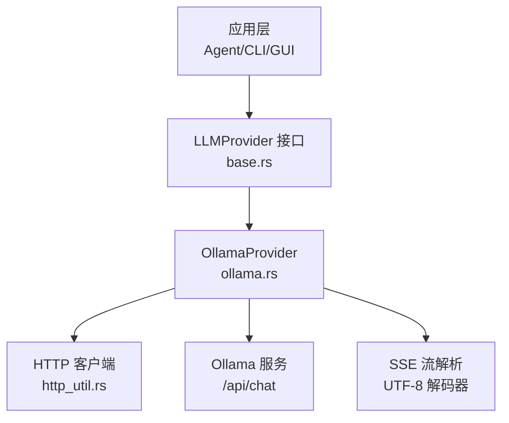
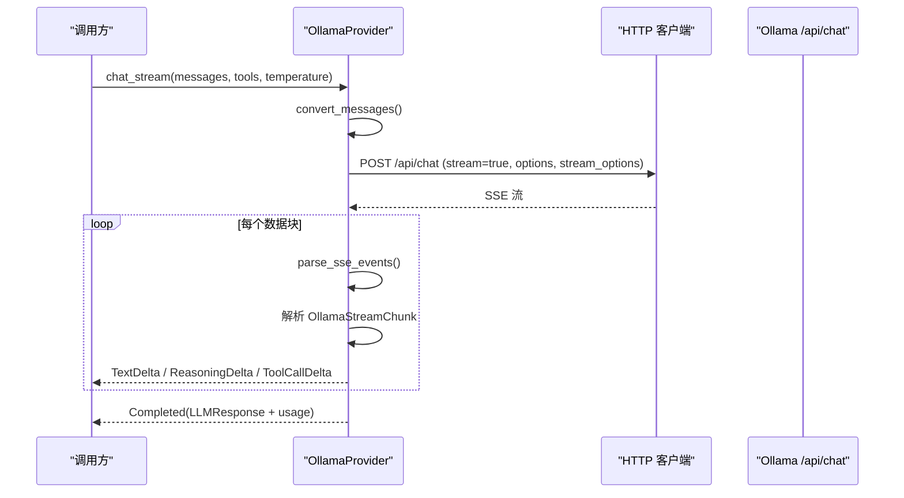
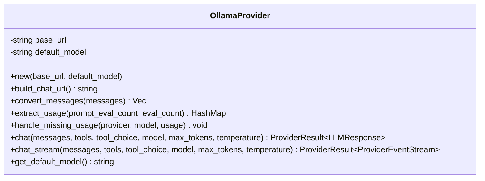
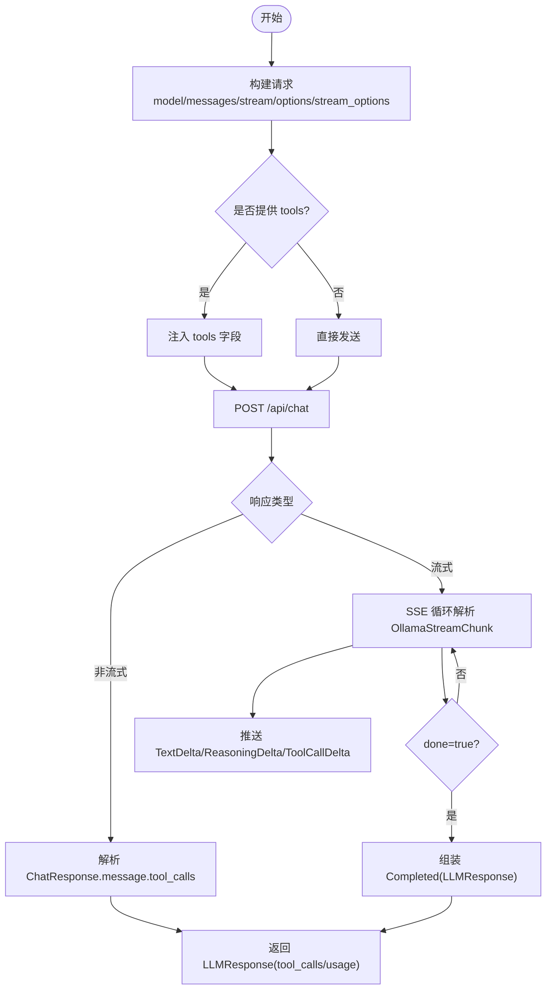
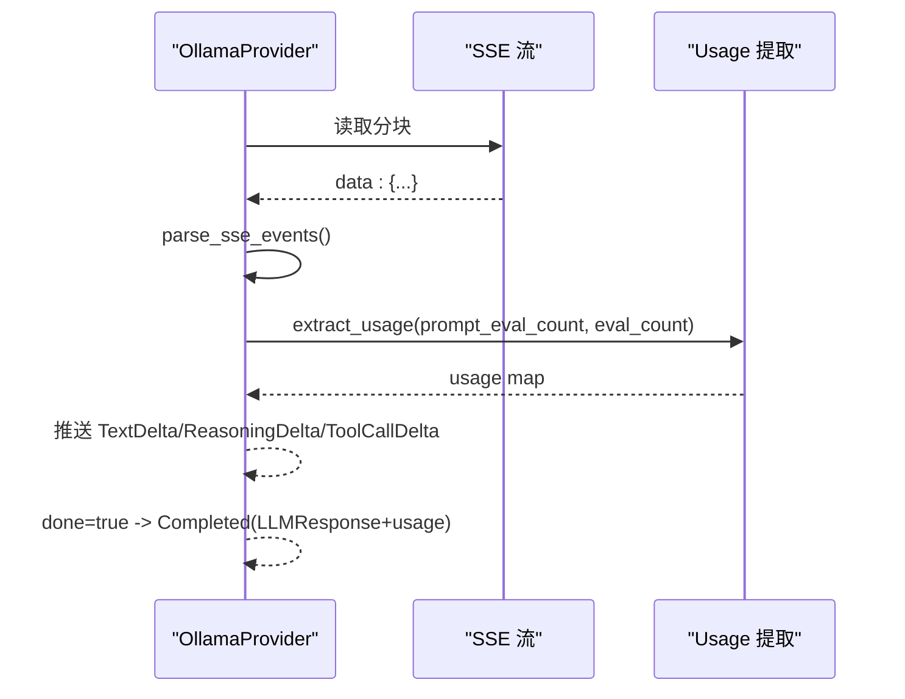
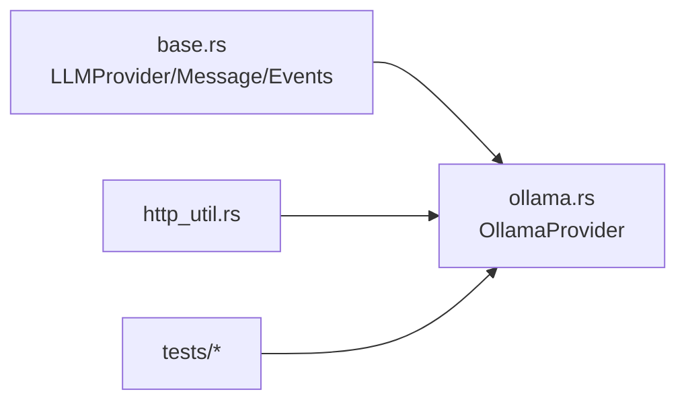

# Ollama 本地模型提供商

<cite>
**本文引用的文件**
- [ollama.rs](file://agent-diva-providers/src/ollama.rs)
- [base.rs](file://agent-diva-providers/src/base.rs)
- [lib.rs](file://agent-diva-providers/src/lib.rs)
- [factory.rs](file://agent-diva-providers/src/factory.rs)
- [providers.yaml](file://agent-diva-providers/src/providers.yaml)
- [ollama_streaming.rs](file://agent-diva-providers/tests/ollama_streaming.rs)
- [ollama_tools.rs](file://agent-diva-providers/tests/ollama_tools.rs)
</cite>

## 目录
1. [简介](#简介)
2. [项目结构](#项目结构)
3. [核心组件](#核心组件)
4. [架构总览](#架构总览)
5. [详细组件分析](#详细组件分析)
6. [依赖关系分析](#依赖关系分析)
7. [性能与内存优化](#性能与内存优化)
8. [部署指南](#部署指南)
9. [配置示例](#配置示例)
10. [故障排查](#故障排查)
11. [结论](#结论)

## 简介
本文件面向在 Agent-Diva 中集成并运行 Ollama 本地模型的开发者与运维人员，系统性说明：
- Ollama API 的集成实现（非流式、流式、工具调用）
- 消息格式转换、推理请求处理、流式输出与使用量统计
- 本地模型加载机制、上下文窗口管理与内存使用优化建议
- 与标准 LLM 接口的适配逻辑（消息、工具、响应）
- 本地部署、性能调优与常见问题排查
- 完整配置示例与最佳实践

## 项目结构
Ollama 提供商位于 agent-diva-providers 模块中，通过统一的 LLMProvider 接口对外暴露能力。关键文件职责如下：
- ollama.rs：OllamaProvider 的具体实现，包含请求构造、SSE 流解析、工具调用、用量统计等
- base.rs：LLMProvider trait、消息模型、流事件、错误类型、UTF-8 流解码器等基础定义
- lib.rs：导出 OllamaProvider 及动态提供者包装
- factory.rs：通用 provider 构建入口（当前未直接创建 OllamaProvider，但提供统一构建模式参考）
- providers.yaml：提供商清单与默认值（用于发现与配置）
- tests/*：针对 Ollama 流式与工具调用的集成测试

图表来源
- [ollama.rs:23-314](file://agent-diva-providers/src/ollama.rs#L23-L314)
- [base.rs:708-780](file://agent-diva-providers/src/base.rs#L708-L780)

章节来源
- [lib.rs:1-40](file://agent-diva-providers/src/lib.rs#L1-L40)
- [ollama.rs:1-744](file://agent-diva-providers/src/ollama.rs#L1-L744)
- [base.rs:1-800](file://agent-diva-providers/src/base.rs#L1-L800)

## 核心组件
- OllamaProvider：封装 Ollama 的 /api/chat 调用，支持非流式与流式两种模式，支持工具调用与 reasoning/thinking 内容
- Message/OllamaMessage：内部消息到 Ollama 消息的转换
- ChatRequest/ChatResponse：请求与响应结构体，包含 model、messages、stream、options、stream_options 等字段
- LLMStreamEvent：流式事件（文本增量、推理增量、工具调用增量、完成）
- StreamingUtf8Decoder：安全地按 HTTP 分块解码 UTF-8 文本，避免截断字符

章节来源
- [ollama.rs:23-127](file://agent-diva-providers/src/ollama.rs#L23-L127)
- [ollama.rs:148-314](file://agent-diva-providers/src/ollama.rs#L148-L314)
- [base.rs:447-462](file://agent-diva-providers/src/base.rs#L447-L462)
- [base.rs:82-129](file://agent-diva-providers/src/base.rs#L82-L129)

## 架构总览
OllamaProvider 实现了 LLMProvider trait，向上提供 chat/chat_stream/get_default_model 等方法；向下通过 HTTP 客户端访问 Ollama 的 /api/chat 端点。流式模式下，使用 SSE 协议逐块读取 JSON，解析为 OllamaStreamChunk，并转换为 LLMStreamEvent 推送给上层。

图表来源
- [ollama.rs:437-608](file://agent-diva-providers/src/ollama.rs#L437-L608)
- [base.rs:708-780](file://agent-diva-providers/src/base.rs#L708-L780)

## 详细组件分析

### OllamaProvider 类与方法
- new(base_url, default_model)：规范化 base_url（去除末尾斜杠与 /api），默认 http://localhost:11434
- build_chat_url()：拼接 /api/chat
- convert_messages()：将内部 Message 转为 OllamaMessage（role/content），处理 assistant/tool/system 角色
- extract_usage()：将 prompt_eval_count/eval_count 映射为标准 usage 字段（prompt_tokens/completion_tokens/total_tokens）
- handle_missing_usage()：当缺少 usage 时记录告警并触发审计事件
- chat()：非流式请求，返回 LLMResponse（content/tool_calls/finish_reason/usage/reasoning_content）
- chat_stream()：流式请求，发送 SSE 流，逐块解析并推送 LLMStreamEvent，最终 Completed 携带完整结果与 usage
- get_default_model()：返回默认模型名

图表来源
- [ollama.rs:23-314](file://agent-diva-providers/src/ollama.rs#L23-L314)
- [ollama.rs:316-613](file://agent-diva-providers/src/ollama.rs#L316-L613)

章节来源
- [ollama.rs:148-314](file://agent-diva-providers/src/ollama.rs#L148-L314)
- [ollama.rs:316-613](file://agent-diva-providers/src/ollama.rs#L316-L613)

### 消息格式转换
- 内部 Message.role 与 content 被映射为 OllamaMessage.role 与 content
- assistant 消息中的 tool_calls 在当前实现中不直接序列化到消息体，工具调用通过请求参数传递并在响应中解析
- tool 角色消息的内容作为字符串放入 content

章节来源
- [ollama.rs:218-249](file://agent-diva-providers/src/ollama.rs#L218-L249)
- [base.rs:447-462](file://agent-diva-providers/src/base.rs#L447-L462)

### 工具调用支持
- 请求侧：若传入 tools，则将其注入到请求体中（OpenAI 兼容的工具定义格式）
- 响应侧：解析 message.tool_calls，转换为 ToolCallRequest（id/name/arguments）
- 流式侧：对每个 chunk 中的 tool_calls 增量推送 ToolCallDelta，并最终汇总到 Completed 的 tool_calls

图表来源
- [ollama.rs:337-379](file://agent-diva-providers/src/ollama.rs#L337-L379)
- [ollama.rs:437-608](file://agent-diva-providers/src/ollama.rs#L437-L608)

章节来源
- [ollama.rs:337-379](file://agent-diva-providers/src/ollama.rs#L337-L379)
- [ollama.rs:437-608](file://agent-diva-providers/src/ollama.rs#L437-L608)

### 流式输出与使用量统计
- 流式模式启用 stream=true，并设置 stream_options.include_usage=true，以便在 done 块中获取 token 用量
- 使用 StreamingUtf8Decoder 安全处理跨分块的 UTF-8 文本
- 将 prompt_eval_count/eval_count 标准化为 usage 的 prompt_tokens/completion_tokens/total_tokens
- 当缺失 usage 时记录警告并触发审计事件

图表来源
- [ollama.rs:437-608](file://agent-diva-providers/src/ollama.rs#L437-L608)
- [base.rs:82-129](file://agent-diva-providers/src/base.rs#L82-L129)

章节来源
- [ollama.rs:437-608](file://agent-diva-providers/src/ollama.rs#L437-L608)
- [base.rs:82-129](file://agent-diva-providers/src/base.rs#L82-L129)

### 与标准 LLM 接口的适配
- 通过实现 LLMProvider trait，统一 chat/chat_stream/get_default_model 方法签名
- 动态上下文传输策略：OllamaProvider 选择 UserContextEnvelope，确保历史后的系统上下文以用户角色包裹发送，提高兼容性
- 错误分类：ProviderError 映射为可重试/配置/致命等类别，便于上层重试与展示

章节来源
- [ollama.rs:316-320](file://agent-diva-providers/src/ollama.rs#L316-L320)
- [base.rs:708-780](file://agent-diva-providers/src/base.rs#L708-L780)
- [base.rs:34-67](file://agent-diva-providers/src/base.rs#L34-L67)

## 依赖关系分析
- OllamaProvider 依赖 base 模块提供的 LLMProvider trait、消息模型、流事件与错误类型
- 通过 http_util 构建 HTTP 客户端，连接 Ollama 的 /api/chat
- 测试用例验证流式与工具调用行为，且可通过环境变量跳过需要真实 Ollama 实例的测试

图表来源
- [ollama.rs:1-21](file://agent-diva-providers/src/ollama.rs#L1-L21)
- [base.rs:1-800](file://agent-diva-providers/src/base.rs#L1-L800)
- [ollama_streaming.rs:1-58](file://agent-diva-providers/tests/ollama_streaming.rs#L1-L58)
- [ollama_tools.rs:1-106](file://agent-diva-providers/tests/ollama_tools.rs#L1-L106)

章节来源
- [lib.rs:1-40](file://agent-diva-providers/src/lib.rs#L1-L40)
- [factory.rs:1-170](file://agent-diva-providers/src/factory.rs#L1-L170)

## 性能与内存优化
- 流式解码：使用 StreamingUtf8Decoder 避免重复分配与字符截断，提升长文本流处理的稳定性
- 超时控制：HTTP 客户端设置合理超时（例如 300 秒），防止长时间阻塞
- 上下文窗口管理：
  - 通过 base 模块的 context_window_for_model 获取已知模型的上下文窗口大小（如 gpt-4o 128K、claude 系列 200K 等）
  - 对于未知模型，调用方应保守使用默认上限，避免超出 Ollama 模型限制导致失败
- 内存使用优化建议：
  - 控制 messages 长度与单条消息大小，必要时进行压缩或摘要
  - 流式消费及时释放中间缓冲区，避免累积大对象
  - 合理设置 temperature 与 max_tokens，减少不必要的生成开销
  - 工具调用仅声明必要字段，降低请求体积

章节来源
- [base.rs:209-246](file://agent-diva-providers/src/base.rs#L209-L246)
- [ollama.rs:437-608](file://agent-diva-providers/src/ollama.rs#L437-L608)

## 部署指南
- 安装 Ollama 并启动服务（默认监听 http://localhost:11434）
- 拉取所需模型（例如 llama3.2、qwen2.5 等）
- 在 Agent-Diva 中配置 Ollama 提供商：
  - 若使用 OpenAI 兼容路径（vLLM 等），可在 providers.yaml 中配置对应条目
  - 对于原生 Ollama 路径，直接使用 OllamaProvider::new 指定 base_url 与默认模型
- 验证连通性：
  - 使用测试用例或简单脚本调用 /api/chat，确认返回正常
  - 流式模式需检查 SSE 事件是否正常推送

章节来源
- [ollama.rs:148-174](file://agent-diva-providers/src/ollama.rs#L148-L174)
- [providers.yaml:311-328](file://agent-diva-providers/src/providers.yaml#L311-L328)

## 配置示例
以下为常见配置要点与示例（以文字描述为主，具体代码片段请参考引用位置）：
- 基本配置
  - base_url：Ollama 服务地址，默认 http://localhost:11434
  - default_model：默认模型名称，如 llama3.2
- 请求参数
  - model：本次请求使用的模型（可选，覆盖默认）
  - messages：消息列表，role 可为 user/system/assistant/tool
  - stream：是否启用流式（true/false）
  - options：温度等选项（temperature）
  - stream_options：流式选项（include_usage）
- 工具调用
  - tools：函数定义数组，type 为 function，包含 name/description/parameters
  - tool_choice：工具选择模式（Auto/Disabled/Unspecified）
- 使用量统计
  - 流式模式需在 stream_options 中开启 include_usage，以便在 done 块中获取 prompt_eval_count/eval_count

章节来源
- [ollama.rs:28-53](file://agent-diva-providers/src/ollama.rs#L28-L53)
- [ollama.rs:322-346](file://agent-diva-providers/src/ollama.rs#L322-L346)
- [ollama.rs:437-461](file://agent-diva-providers/src/ollama.rs#L437-L461)
- [ollama_tools.rs:8-32](file://agent-diva-providers/tests/ollama_tools.rs#L8-L32)

## 故障排查
- 无法连接 Ollama
  - 检查 base_url 是否正确，端口是否开放
  - 查看 HTTP 错误是否为 ProviderError::HttpError
- JSON 解析失败
  - 检查 Ollama 返回结构是否符合预期（message.content/message.thinking/message.tool_calls）
  - 流式模式下注意 SSE 数据块分隔符与 data: 前缀
- 缺少 usage
  - 流式模式需开启 stream_options.include_usage
  - 若仍缺失，会记录警告并触发审计事件
- 工具调用异常
  - 确认 tools 定义正确（function.name/parameters）
  - 检查响应中 tool_calls 是否存在，并正确转换为 ToolCallRequest
- 流式中断或乱码
  - 使用 StreamingUtf8Decoder 处理跨分块 UTF-8
  - 关注 finish() 是否抛出“不完整 UTF-8”的错误

章节来源
- [ollama.rs:381-389](file://agent-diva-providers/src/ollama.rs#L381-L389)
- [ollama.rs:468-471](file://agent-diva-providers/src/ollama.rs#L468-L471)
- [ollama.rs:508-574](file://agent-diva-providers/src/ollama.rs#L508-L574)
- [base.rs:82-129](file://agent-diva-providers/src/base.rs#L82-L129)
- [ollama_streaming.rs:35-57](file://agent-diva-providers/tests/ollama_streaming.rs#L35-L57)

## 结论
OllamaProvider 在 Agent-Diva 中提供了稳定、可扩展的本地模型推理能力，涵盖非流式与流式两种模式、工具调用、推理内容与使用量统计。通过标准化的 LLMProvider 接口，上层应用可以无缝切换不同后端。结合合理的上下文窗口管理与内存优化策略，可以在本地环境中高效运行多种开源模型。建议在部署时充分验证连通性与流式行为，并根据模型特性调整参数以获得最佳性能与体验。