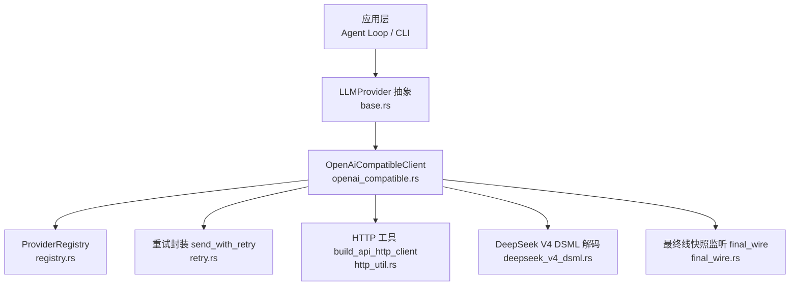
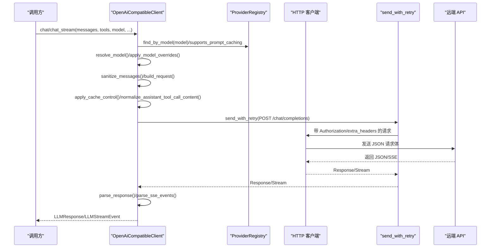
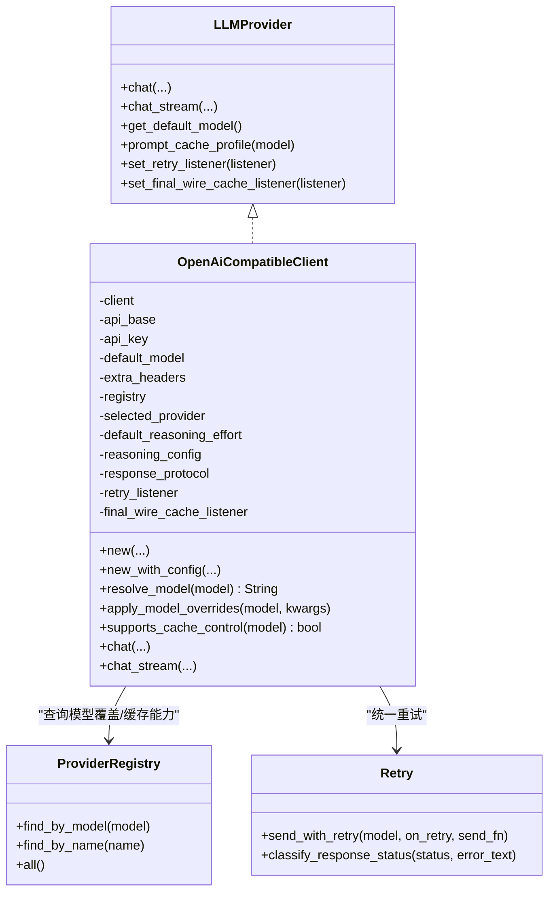

# OpenAI 兼容客户端

<cite>
**本文引用的文件**
- [openai_compatible.rs](file://agent-diva-providers/src/openai_compatible.rs)
- [base.rs](file://agent-diva-providers/src/base.rs)
- [registry.rs](file://agent-diva-providers/src/registry.rs)
- [retry.rs](file://agent-diva-providers/src/retry.rs)
- [lib.rs](file://agent-diva-providers/src/lib.rs)
- [factory.rs](file://agent-diva-providers/src/factory.rs)
</cite>

## 目录
1. [简介](#简介)
2. [项目结构](#项目结构)
3. [核心组件](#核心组件)
4. [架构总览](#架构总览)
5. [详细组件分析](#详细组件分析)
6. [依赖关系分析](#依赖关系分析)
7. [性能考量](#性能考量)
8. [故障排查指南](#故障排查指南)
9. [结论](#结论)
10. [附录：配置示例与常见问题](#附录配置示例与常见问题)

## 简介
本文件面向 OpenAI 兼容客户端（OpenAiCompatibleClient）的实现与使用，覆盖 HTTP 请求构建、响应解析、流式处理、模型名称解析、模型特定参数覆盖、缓存控制支持、消息内容清理、工具调用处理、使用量统计收集、错误处理与重试机制，以及性能优化建议。文档同时提供完整配置项说明与常见问题解决方案，帮助读者快速集成并稳定运行。

## 项目结构
OpenAiCompatibleClient 位于 providers 模块中，围绕统一的 LLMProvider 接口实现，并通过注册表、重试、HTTP 工具等模块协同工作。

图表来源
- [openai_compatible.rs:169-342](file://agent-diva-providers/src/openai_compatible.rs#L169-L342)
- [base.rs:709-780](file://agent-diva-providers/src/base.rs#L709-L780)
- [registry.rs:73-108](file://agent-diva-providers/src/registry.rs#L73-L108)
- [retry.rs:86-181](file://agent-diva-providers/src/retry.rs#L86-L181)

章节来源
- [openai_compatible.rs:169-342](file://agent-diva-providers/src/openai_compatible.rs#L169-L342)
- [lib.rs:21-40](file://agent-diva-providers/src/lib.rs#L21-L40)

## 核心组件
- OpenAiCompatibleClient：实现 LLMProvider 的 OpenAI 兼容客户端，负责请求构建、发送、响应解析、流式事件处理、缓存控制注入、消息清洗、工具调用拼装、用量统计聚合。
- ProviderRegistry：维护提供商元数据（默认 base URL、是否支持提示缓存、按模型名匹配规则、模型级参数覆盖）。
- Retry 封装：指数退避重试、429 限流识别、可插拔重试监听器。
- Base 抽象：统一的消息、响应、流事件、能力探测、动态上下文传输策略等。

章节来源
- [openai_compatible.rs:169-342](file://agent-diva-providers/src/openai_compatible.rs#L169-L342)
- [registry.rs:17-50](file://agent-diva-providers/src/registry.rs#L17-L50)
- [retry.rs:17-47](file://agent-diva-providers/src/retry.rs#L17-L47)
- [base.rs:447-462](file://agent-diva-providers/src/base.rs#L447-L462)

## 架构总览
OpenAiCompatibleClient 通过统一接口暴露 chat 与 chat_stream，内部流程如下：

图表来源
- [openai_compatible.rs:819-925](file://agent-diva-providers/src/openai_compatible.rs#L819-L925)
- [openai_compatible.rs:927-1249](file://agent-diva-providers/src/openai_compatible.rs#L927-L1249)
- [retry.rs:86-181](file://agent-diva-providers/src/retry.rs#L86-L181)

## 详细组件分析

### 1) 模型名称解析（resolve_model）
- 行为：透传模型 ID，不添加或改写前缀，保持模型 ID 为“配置字符串”的语义，避免运行时推断路由或注入 provider 前缀。
- 设计动机：不同网关/代理可能要求不同的命名空间；该实现将模型 ID 视为透明标识，由上层或注册表决定实际路由。

章节来源
- [openai_compatible.rs:344-352](file://agent-diva-providers/src/openai_compatible.rs#L344-L352)

### 2) 模型特定参数覆盖（apply_model_overrides）
- 行为：根据模型名在注册表中查找匹配项，若命中则将其 model_overrides 合并到请求 kwargs（如 temperature、reasoning_effort 等），随后用于构建请求。
- 扩展点：可通过注册表新增/调整 per-model 覆盖规则，无需修改客户端代码。

章节来源
- [openai_compatible.rs:354-368](file://agent-diva-providers/src/openai_compatible.rs#L354-L368)
- [registry.rs:17-50](file://agent-diva-providers/src/registry.rs#L17-L50)

### 3) 缓存控制支持（supports_cache_control 与 apply_cache_control）
- supports_cache_control：基于注册表的 supports_prompt_caching 标志判断当前模型是否启用提示缓存。
- apply_cache_control：对请求体进行安全注入：
  - 仅对首个稳定的 system 消息文本内容标记 cache_control=ephemeral。
  - 若存在 tools 且未显式标注 CORE 锚点，则将最后一个工具标记为 ephemeral，以兼容旧调用方式。
- prompt_cache_profile：对外暴露该模型的缓存策略（enabled/disabled），供上层观察与审计。

章节来源
- [openai_compatible.rs:370-423](file://agent-diva-providers/src/openai_compatible.rs#L370-L423)
- [openai_compatible.rs:811-817](file://agent-diva-providers/src/openai_compatible.rs#L811-L817)
- [registry.rs:17-50](file://agent-diva-providers/src/registry.rs#L17-L50)

### 4) 消息内容清理（sanitize_messages）
- 目的：移除可能导致 JSON 解析失败的控制字符与 ANSI 转义序列，确保请求体合法。
- 行为：
  - 检测并清理 ASCII 控制字符（保留换行、回车、制表符）。
  - 清理 ANSI 转义序列。
  - 对 reasoning_content 同样执行清理。
  - 对结构化多模态内容仅清理文本片段，保留图片等部分不变。

章节来源
- [openai_compatible.rs:544-614](file://agent-diva-providers/src/openai_compatible.rs#L544-L614)

### 5) 工具调用处理
- 非流式：解析 tool_calls，尝试解析 arguments；若失败，尝试解包双层编码字符串；仍失败则回退为 raw 字段。
- 流式：增量拼装 PartialToolCall，并在每个 arguments_delta 处发出 ToolCallDelta 事件；结束时组装为 ToolCallRequest。
- 兼容性：当 assistant 消息包含 tool_calls 且 content 为空串时，规范化为 null，满足严格端点要求。

章节来源
- [openai_compatible.rs:448-542](file://agent-diva-providers/src/openai_compatible.rs#L448-L542)
- [openai_compatible.rs:674-740](file://agent-diva-providers/src/openai_compatible.rs#L674-L740)
- [openai_compatible.rs:1161-1191](file://agent-diva-providers/src/openai_compatible.rs#L1161-L1191)
- [openai_compatible.rs:425-446](file://agent-diva-providers/src/openai_compatible.rs#L425-L446)

### 6) 使用量统计收集（usage）
- 非流式：从 usage 字段提取 prompt_tokens、completion_tokens、total_tokens，以及可选的 cache_creation_input_tokens、cache_read_input_tokens。
- 流式：累积 usage 片段，最终在 Completed 事件中输出。
- 缺失处理：若响应缺少 usage，记录审计事件 UsageMissingFallback 并返回空 map，保证健壮性。

章节来源
- [openai_compatible.rs:214-249](file://agent-diva-providers/src/openai_compatible.rs#L214-L249)
- [openai_compatible.rs:1135-1137](file://agent-diva-providers/src/openai_compatible.rs#L1135-L1137)
- [openai_compatible.rs:1094-1099](file://agent-diva-providers/src/openai_compatible.rs#L1094-L1099)

### 7) HTTP 请求构建与发送
- 请求体：ChatCompletionRequest，包含 model、messages、tools/tool_choice、stream/stream_options、reasoning_effort、max_tokens、temperature。
- 头部：Authorization Bearer + extra_headers。
- 重试：通过 send_with_retry 统一处理网络错误与 5xx 重试，429 直接返回 RateLimited。
- 日志：记录请求大小与消息数量，便于调试大请求。

章节来源
- [openai_compatible.rs:24-47](file://agent-diva-providers/src/openai_compatible.rs#L24-L47)
- [openai_compatible.rs:616-672](file://agent-diva-providers/src/openai_compatible.rs#L616-L672)
- [openai_compatible.rs:889-925](file://agent-diva-providers/src/openai_compatible.rs#L889-L925)
- [retry.rs:86-181](file://agent-diva-providers/src/retry.rs#L86-L181)

### 8) 流式处理（SSE）
- 事件解析：按 data: 行拆分 SSE 事件，遇到 [DONE] 结束。
- 增量事件：TextDelta、ReasoningDelta、ToolCallDelta 实时推送。
- 协议适配：支持 DeepSeek V4 DSML 协议，结束时统一解码并输出。
- UTF-8 安全：StreamingUtf8Decoder 跨 chunk 拼接，保证不完整字节不会丢失。

章节来源
- [openai_compatible.rs:742-760](file://agent-diva-providers/src/openai_compatible.rs#L742-L760)
- [openai_compatible.rs:927-1249](file://agent-diva-providers/src/openai_compatible.rs#L927-L1249)
- [base.rs:82-129](file://agent-diva-providers/src/base.rs#L82-L129)

### 9) 错误处理策略
- 分类：HTTP 错误、JSON 解析错误、无效响应、API 错误、配置错误、速率限制。
- 重试：5xx 与网络错误指数退避重试（最多 3 次），429 立即返回 RateLimited。
- 诊断：对 JSON 解析失败输出详细上下文与可疑字符定位，辅助排障。

章节来源
- [base.rs:10-67](file://agent-diva-providers/src/base.rs#L10-L67)
- [retry.rs:49-84](file://agent-diva-providers/src/retry.rs#L49-L84)
- [openai_compatible.rs:762-783](file://agent-diva-providers/src/openai_compatible.rs#L762-L783)

### 10) 性能优化建议
- 复用 HTTP 连接：客户端使用持久化连接，减少握手开销。
- 流式优先：长回复场景使用 chat_stream，降低首字延迟与内存占用。
- 合理 max_tokens：避免过大导致超时或浪费配额。
- 控制消息体积：清理无用内容、压缩历史，减少请求体大小。
- 合理使用缓存：对稳定 system 与工具定义启用 cache_control=ephemeral，提升重复请求命中率。
- 谨慎开启 reasoning_effort：仅在推理模型上设置，避免无关开销。

[本节为通用性能建议，不直接引用具体文件]

## 依赖关系分析
OpenAiCompatibleClient 依赖以下关键模块：

图表来源
- [openai_compatible.rs:169-342](file://agent-diva-providers/src/openai_compatible.rs#L169-L342)
- [registry.rs:73-108](file://agent-diva-providers/src/registry.rs#L73-L108)
- [retry.rs:86-181](file://agent-diva-providers/src/retry.rs#L86-L181)
- [base.rs:709-780](file://agent-diva-providers/src/base.rs#L709-L780)

章节来源
- [openai_compatible.rs:169-342](file://agent-diva-providers/src/openai_compatible.rs#L169-L342)
- [registry.rs:73-108](file://agent-diva-providers/src/registry.rs#L73-L108)
- [retry.rs:86-181](file://agent-diva-providers/src/retry.rs#L86-L181)

## 性能考量
- 流式传输可降低端到端延迟，适合 UI 实时展示。
- 使用 StreamingUtf8Decoder 避免分片导致的字符截断问题。
- 对大请求体记录长度与消息数，便于容量规划与调优。
- 通过注册表集中管理模型覆盖，减少分支逻辑与运行时判断成本。
- 合理设置 timeout（客户端默认 300s），避免长时间阻塞。

[本节为通用性能讨论，不直接引用具体文件]

## 故障排查指南
- JSON 解析失败：检查消息内容是否包含控制字符或 ANSI 序列；确认工具参数是否为合法 JSON（含双层编码情况）。
- 429 限流：客户端会直接返回 RateLimited，需在上层处理退避或降级。
- 5xx 服务器错误：自动重试最多 3 次，若持续失败请检查服务端状态与网络。
- 无 usage 字段：会触发 UsageMissingFallback 审计事件，可在监控中捕获。
- 工具调用参数异常：查看日志中的 problematic characters 与上下文信息，定位非法字符位置。

章节来源
- [base.rs:10-67](file://agent-diva-providers/src/base.rs#L10-L67)
- [retry.rs:49-84](file://agent-diva-providers/src/retry.rs#L49-L84)
- [openai_compatible.rs:214-249](file://agent-diva-providers/src/openai_compatible.rs#L214-L249)
- [openai_compatible.rs:762-783](file://agent-diva-providers/src/openai_compatible.rs#L762-L783)

## 结论
OpenAiCompatibleClient 提供了稳定、可扩展的 OpenAI 兼容接入能力，涵盖请求构建、响应解析、流式处理、缓存控制、工具调用、用量统计、错误重试等关键环节。通过注册表驱动的模型覆盖与缓存能力声明，结合严格的输入清洗与健壮的错误处理，能够在多种后端环境中保持一致的行为与良好的用户体验。

[本节为总结，不直接引用具体文件]

## 附录：配置示例与常见问题

### 支持的配置选项
- api_base：目标 API 基础地址；为空时使用注册表默认值或本地回退地址。
- api_key：鉴权令牌，自动注入 Authorization: Bearer。
- extra_headers：自定义请求头键值对。
- default_model：默认模型 ID。
- provider_name：提供商名称，用于选择默认 base 与能力开关。
- reasoning_effort：推理努力级别（如 low/medium/high），仅对推理模型生效。
- response_protocol：响应协议类型（例如 OpenaiJson 或 DeepseekV4Dsml）。

章节来源
- [openai_compatible.rs:251-342](file://agent-diva-providers/src/openai_compatible.rs#L251-L342)
- [factory.rs:42-54](file://agent-diva-providers/src/factory.rs#L42-L54)

### 典型配置示例
- 直连 OpenAI 兼容服务：
  - api_base: https://your-endpoint/v1
  - api_key: sk-...
  - default_model: gpt-4o
  - extra_headers: {}
- 通过网关访问第三方模型：
  - provider_name: openrouter
  - api_base: https://openrouter.ai/api/v1
  - default_model: anthropic/claude-3-opus
  - reasoning_effort: medium
- 使用 DeepSeek V4 DSML 协议：
  - response_protocol: DeepseekV4Dsml
  - 模型需为 DeepSeek V4 系列

章节来源
- [factory.rs:42-54](file://agent-diva-providers/src/factory.rs#L42-L54)
- [openai_compatible.rs:272-342](file://agent-diva-providers/src/openai_compatible.rs#L272-L342)

### 常见问题与解决
- 问：为什么模型名没有变化？
  - 答：resolve_model 保持模型 ID 透传，避免隐式改写；如需路由，请在网关层处理。
- 问：如何为特定模型覆盖参数？
  - 答：在注册表中为该模型添加 model_overrides（如 temperature、reasoning_effort），客户端会自动合并。
- 问：如何启用提示缓存？
  - 答：确保模型在注册表中 supports_prompt_caching=true；客户端会自动对首个 stable system 与最后一个工具注入 cache_control=ephemeral。
- 问：工具调用参数解析失败怎么办？
  - 答：客户端会尝试解包双层 JSON；若仍失败，将回退为 raw 字段。请检查上游生成逻辑并确保参数为合法 JSON。
- 问：出现 429 如何处理？
  - 答：客户端返回 RateLimited，上层应实施退避或降级策略。
- 问：为何收到空的 usage？
  - 答：若响应缺失 usage，会触发 UsageMissingFallback 审计事件；可在监控中捕获并告警。

章节来源
- [openai_compatible.rs:344-368](file://agent-diva-providers/src/openai_compatible.rs#L344-L368)
- [openai_compatible.rs:370-423](file://agent-diva-providers/src/openai_compatible.rs#L370-L423)
- [openai_compatible.rs:214-249](file://agent-diva-providers/src/openai_compatible.rs#L214-L249)
- [retry.rs:49-84](file://agent-diva-providers/src/retry.rs#L49-L84)