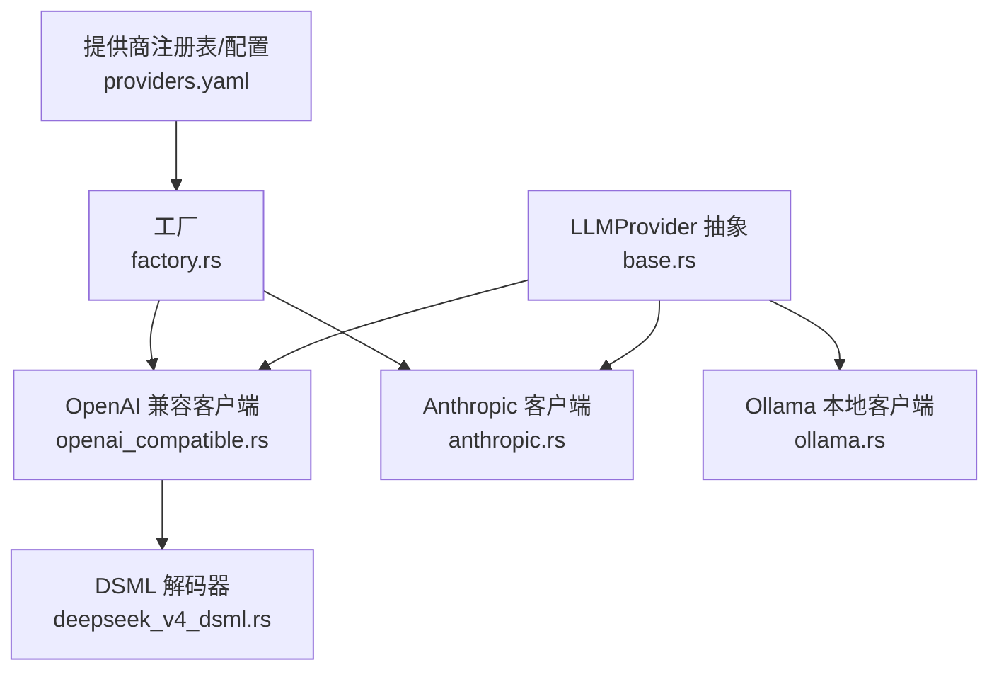
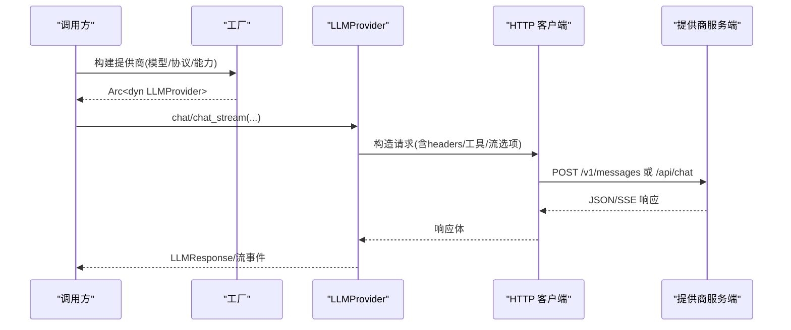
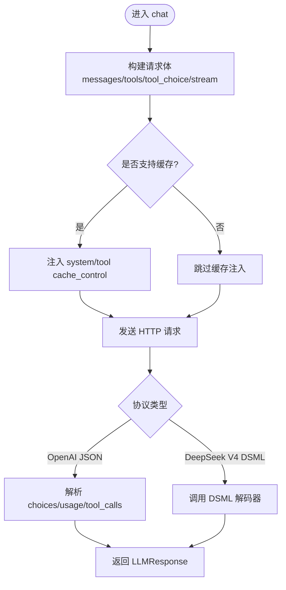
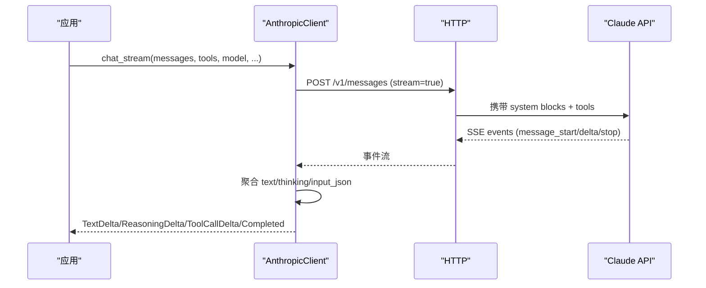
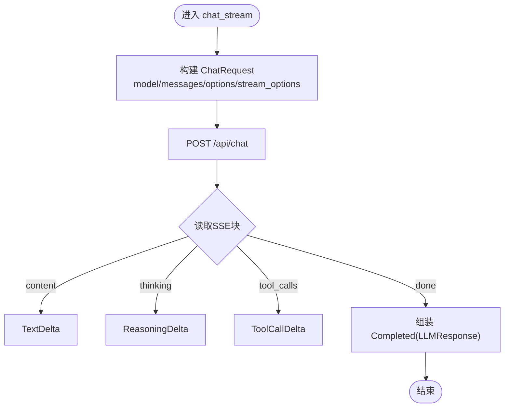
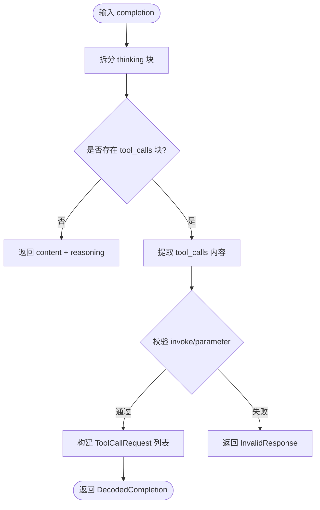
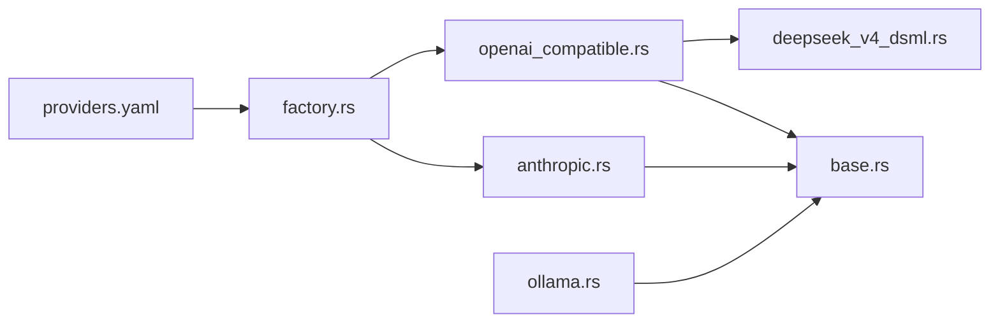

# 现有提供商实现

<cite>
**本文引用的文件**
- [agent-diva-providers/src/base.rs](file://agent-diva-providers/src/base.rs)
- [agent-diva-providers/src/openai_compatible.rs](file://agent-diva-providers/src/openai_compatible.rs)
- [agent-diva-providers/src/anthropic.rs](file://agent-diva-providers/src/anthropic.rs)
- [agent-diva-providers/src/ollama.rs](file://agent-diva-providers/src/ollama.rs)
- [agent-diva-providers/src/deepseek_v4_dsml.rs](file://agent-diva-providers/src/deepseek_v4_dsml.rs)
- [agent-diva-providers/src/factory.rs](file://agent-diva-providers/src/factory.rs)
- [agent-diva-providers/src/providers.yaml](file://agent-diva-providers/src/providers.yaml)
</cite>

## 目录
1. [简介](#简介)
2. [项目结构](#项目结构)
3. [核心组件](#核心组件)
4. [架构总览](#架构总览)
5. [详细组件分析](#详细组件分析)
6. [依赖关系分析](#依赖关系分析)
7. [性能与限制](#性能与限制)
8. [故障排查指南](#故障排查指南)
9. [结论](#结论)
10. [附录：配置示例](#附录：配置示例)

## 简介
本文件聚焦于“现有提供商实现”，对 OpenAI 兼容客户端、Anthropic Claude、Ollama 本地模型、DeepSeek V4 DSML 解码等具体实现进行技术级说明。内容涵盖：
- 各提供商的特殊配置选项、API 适配逻辑与错误处理策略
- 模型能力检测机制（ModelCapabilities）与上下文窗口管理
- 性能特点、限制条件与使用场景对比
- 配置示例与常见问题解决方案

## 项目结构
providers 模块以统一的 LLMProvider 抽象为核心，提供多厂商适配层；通过工厂按配置构建具体客户端；OpenAI 兼容路径覆盖多数第三方网关；Anthropic 走原生 Messages API；Ollama 面向本地推理服务；DeepSeek V4 DSML 提供严格协议解析。

图表来源
- [agent-diva-providers/src/base.rs:709-780](file://agent-diva-providers/src/base.rs#L709-L780)
- [agent-diva-providers/src/openai_compatible.rs:168-342](file://agent-diva-providers/src/openai_compatible.rs#L168-L342)
- [agent-diva-providers/src/anthropic.rs:170-205](file://agent-diva-providers/src/anthropic.rs#L170-L205)
- [agent-diva-providers/src/ollama.rs:22-26](file://agent-diva-providers/src/ollama.rs#L22-L26)
- [agent-diva-providers/src/deepseek_v4_dsml.rs:21-27](file://agent-diva-providers/src/deepseek_v4_dsml.rs#L21-L27)
- [agent-diva-providers/src/factory.rs:23-70](file://agent-diva-providers/src/factory.rs#L23-L70)
- [agent-diva-providers/src/providers.yaml:1-164](file://agent-diva-providers/src/providers.yaml#L1-L164)

章节来源
- [agent-diva-providers/src/base.rs:709-780](file://agent-diva-providers/src/base.rs#L709-L780)
- [agent-diva-providers/src/factory.rs:23-70](file://agent-diva-providers/src/factory.rs#L23-L70)
- [agent-diva-providers/src/providers.yaml:1-164](file://agent-diva-providers/src/providers.yaml#L1-L164)

## 核心组件
- LLMProvider 统一接口：定义 chat/chat_stream、动态上下文传输策略、提示缓存策略、重试监听器等。
- ModelCapabilities：保守的能力标记（vision/tools/reasoning/context_window），用于避免向不支持的模型发送不兼容负载。
- 消息与流式事件：Message、MessageContent、LLMStreamEvent 等统一数据模型。
- 错误分类：ProviderError 及其可重试/超时/致命分类，便于上层统一处理。

章节来源
- [agent-diva-providers/src/base.rs:10-68](file://agent-diva-providers/src/base.rs#L10-L68)
- [agent-diva-providers/src/base.rs:131-186](file://agent-diva-providers/src/base.rs#L131-L186)
- [agent-diva-providers/src/base.rs:384-425](file://agent-diva-providers/src/base.rs#L384-L425)

## 架构总览
- 工厂根据 providers.yaml 中的 api_type 选择具体实现：OpenAI 兼容或 Anthropic。
- OpenAI 兼容客户端支持：
  - 标准 Chat Completions 请求体
  - 工具调用、tool_choice、stream/stream_options
  - 模型参数覆盖、系统消息 cache_control 注入、assistant tool_calls content 规范化
  - 可选 DeepSeek V4 DSML 响应协议解码
- Anthropic 客户端：
  - 原生 Messages API，system blocks、thinking、tool_use/tool_result
  - 流式 SSE 事件解析（text_delta/thinking_delta/input_json_delta）
  - 首条 system block 自动标注 ephemeral 缓存
- Ollama 客户端：
  - 本地 /api/chat 端点，支持非流/流式
  - 将内部 Message 转为 Ollama 格式，工具调用在消息中体现
  - 从 prompt_eval_count/eval_count 归一化 usage
- DeepSeek V4 DSML 解码器：
  - 严格解析 <｜DSML｜tool_calls> 块与 <｜DSML｜invoke ...> 参数
  - 校验 thinking 块位置、闭合、重复、嵌套等约束

图表来源
- [agent-diva-providers/src/factory.rs:23-70](file://agent-diva-providers/src/factory.rs#L23-L70)
- [agent-diva-providers/src/openai_compatible.rs:616-672](file://agent-diva-providers/src/openai_compatible.rs#L616-L672)
- [agent-diva-providers/src/anthropic.rs:211-264](file://agent-diva-providers/src/anthropic.rs#L211-L264)
- [agent-diva-providers/src/ollama.rs:322-384](file://agent-diva-providers/src/ollama.rs#L322-L384)

## 详细组件分析

### OpenAI 兼容客户端
- 请求构建
  - 支持 messages、tools、tool_choice、stream/stream_options、reasoning_effort、max_tokens、temperature
  - 自动为首个稳定 system 文本块添加 cache_control=ephemeral，并对最后一个工具追加 ephemeral 锚点
  - 对 assistant 含 tool_calls 且 content 为空的情况，将 content 置 null 以适配严格网关
- 响应解析
  - 解析 choices、usage、tool_calls、reasoning_content
  - 当 response_protocol=DeepseekV4Dsml 时，调用 DSML 解码器解析 reasoning 与 tool_calls
- 错误与健壮性
  - 清理控制字符与 ANSI 转义序列，防止 JSON 解析失败
  - 缺失 usage 时记录审计事件并回退空 map
  - 工具参数解析失败时尝试解包双层 JSON 字符串，最终保留 raw 字段
- 能力与缓存
  - 通过 registry 查询 supports_prompt_caching
  - 暴露 reasoning_config 以便上层动态启用 reasoning 能力

图表来源
- [agent-diva-providers/src/openai_compatible.rs:370-446](file://agent-diva-providers/src/openai_compatible.rs#L370-L446)
- [agent-diva-providers/src/openai_compatible.rs:448-542](file://agent-diva-providers/src/openai_compatible.rs#L448-L542)
- [agent-diva-providers/src/openai_compatible.rs:544-614](file://agent-diva-providers/src/openai_compatible.rs#L544-L614)
- [agent-diva-providers/src/openai_compatible.rs:616-672](file://agent-diva-providers/src/openai_compatible.rs#L616-L672)

章节来源
- [agent-diva-providers/src/openai_compatible.rs:168-342](file://agent-diva-providers/src/openai_compatible.rs#L168-L342)
- [agent-diva-providers/src/openai_compatible.rs:370-446](file://agent-diva-providers/src/openai_compatible.rs#L370-L446)
- [agent-diva-providers/src/openai_compatible.rs:448-542](file://agent-diva-providers/src/openai_compatible.rs#L448-L542)
- [agent-diva-providers/src/openai_compatible.rs:544-614](file://agent-diva-providers/src/openai_compatible.rs#L544-L614)
- [agent-diva-providers/src/openai_compatible.rs:616-672](file://agent-diva-providers/src/openai_compatible.rs#L616-L672)

### Anthropic Claude
- 请求构建
  - 将 system 拆分为 top-level system blocks，首个 block 自动标注 ephemeral 缓存
  - 将 assistant 的 reasoning_content 映射为 thinking 块
  - 工具定义转换为 AnthropicTool，支持 description 与 input_schema
- 响应解析
  - 非流：合并 text/thinking/tool_use，生成 LLMResponse
  - 流：解析 message_start/content_block_start/content_block_delta/message_delta/message_stop，聚合 text/thinking/input_json 增量
- 错误与健壮性
  - 要求 API Key，否则返回配置错误
  - 流空闲超时保护，避免长时间无数据阻塞
  - 缺失 tool_call_id 的 tool 消息会报错
- 能力与缓存
  - 声明 PromptCacheProfile 为 ephemeral，首 system block 标记缓存
  - dynamic_context_transport 使用 UserContextEnvelope，保证安全

图表来源
- [agent-diva-providers/src/anthropic.rs:211-264](file://agent-diva-providers/src/anthropic.rs#L211-L264)
- [agent-diva-providers/src/anthropic.rs:334-380](file://agent-diva-providers/src/anthropic.rs#L334-L380)
- [agent-diva-providers/src/anthropic.rs:382-570](file://agent-diva-providers/src/anthropic.rs#L382-L570)
- [agent-diva-providers/src/anthropic.rs:577-656](file://agent-diva-providers/src/anthropic.rs#L577-L656)

章节来源
- [agent-diva-providers/src/anthropic.rs:170-205](file://agent-diva-providers/src/anthropic.rs#L170-L205)
- [agent-diva-providers/src/anthropic.rs:211-264](file://agent-diva-providers/src/anthropic.rs#L211-L264)
- [agent-diva-providers/src/anthropic.rs:334-570](file://agent-diva-providers/src/anthropic.rs#L334-L570)
- [agent-diva-providers/src/anthropic.rs:577-782](file://agent-diva-providers/src/anthropic.rs#L577-L782)

### Ollama 本地模型
- 请求构建
  - 默认 base_url http://localhost:11434，标准化去除末尾斜杠与 /api
  - 非流：POST /api/chat，返回 message.content/thinking/tool_calls
  - 流：开启 stream_options.include_usage，逐块解析 SSE
- 响应解析
  - 将 prompt_eval_count/eval_count 归一化为 usage
  - 工具调用 id 若缺失则生成随机短 ID
  - 空 content 且有 thinking 时给出友好提示
- 错误与健壮性
  - HTTP 错误包装为 ProviderError::HttpError
  - JSON 解析失败包装为 InvalidResponse
  - 流结束前完成 UTF-8 解码校验
- 能力与缓存
  - dynamic_context_transport 使用 UserContextEnvelope

图表来源
- [agent-diva-providers/src/ollama.rs:148-174](file://agent-diva-providers/src/ollama.rs#L148-L174)
- [agent-diva-providers/src/ollama.rs:322-435](file://agent-diva-providers/src/ollama.rs#L322-L435)
- [agent-diva-providers/src/ollama.rs:437-608](file://agent-diva-providers/src/ollama.rs#L437-L608)

章节来源
- [agent-diva-providers/src/ollama.rs:22-26](file://agent-diva-providers/src/ollama.rs#L22-L26)
- [agent-diva-providers/src/ollama.rs:148-174](file://agent-diva-providers/src/ollama.rs#L148-L174)
- [agent-diva-providers/src/ollama.rs:322-608](file://agent-diva-providers/src/ollama.rs#L322-L608)

### DeepSeek V4 DSML 解码
- 协议约束
  - 仅允许一个 thinking 块，必须位于内容之前
  - 仅允许一个 tool_calls 块，禁止嵌套 invoke
  - invoke 参数必须成对出现，name/string 必填，string 仅允许 true/false
- 解析流程
  - 分离 reasoning_content 与 body
  - 定位 tool_calls 块，提取 invoke 列表
  - 校验 allowed_tools 白名单，拒绝未知工具
- 错误处理
  - 任何未闭合、重复、嵌套、未知工具都会返回 InvalidResponse

图表来源
- [agent-diva-providers/src/deepseek_v4_dsml.rs:29-67](file://agent-diva-providers/src/deepseek_v4_dsml.rs#L29-L67)
- [agent-diva-providers/src/deepseek_v4_dsml.rs:69-92](file://agent-diva-providers/src/deepseek_v4_dsml.rs#L69-L92)
- [agent-diva-providers/src/deepseek_v4_dsml.rs:94-169](file://agent-diva-providers/src/deepseek_v4_dsml.rs#L94-L169)

章节来源
- [agent-diva-providers/src/deepseek_v4_dsml.rs:21-27](file://agent-diva-providers/src/deepseek_v4_dsml.rs#L21-L27)
- [agent-diva-providers/src/deepseek_v4_dsml.rs:29-169](file://agent-diva-providers/src/deepseek_v4_dsml.rs#L29-L169)

## 依赖关系分析
- 工厂依赖 providers.yaml 中的 api_type 与默认基地址，决定构建 OpenAI 兼容或 Anthropic 客户端。
- OpenAI 兼容客户端依赖：
  - 注册表（ProviderRegistry）进行模型覆盖与缓存能力判断
  - DSML 解码器（可选）
  - HTTP 客户端构建与重试监听器
- Anthropic 客户端依赖：
  - 原生 Messages API 版本头
  - 流式事件解析与空闲超时保护
- Ollama 客户端依赖：
  - 本地 /api/chat 端点
  - 流式 SSE 解析与 UTF-8 解码器

图表来源
- [agent-diva-providers/src/providers.yaml:1-164](file://agent-diva-providers/src/providers.yaml#L1-L164)
- [agent-diva-providers/src/factory.rs:23-70](file://agent-diva-providers/src/factory.rs#L23-L70)
- [agent-diva-providers/src/openai_compatible.rs:168-342](file://agent-diva-providers/src/openai_compatible.rs#L168-L342)
- [agent-diva-providers/src/anthropic.rs:170-205](file://agent-diva-providers/src/anthropic.rs#L170-L205)
- [agent-diva-providers/src/ollama.rs:22-26](file://agent-diva-providers/src/ollama.rs#L22-L26)
- [agent-diva-providers/src/base.rs:709-780](file://agent-diva-providers/src/base.rs#L709-L780)

章节来源
- [agent-diva-providers/src/factory.rs:23-70](file://agent-diva-providers/src/factory.rs#L23-L70)
- [agent-diva-providers/src/providers.yaml:1-164](file://agent-diva-providers/src/providers.yaml#L1-L164)

## 性能与限制
- OpenAI 兼容客户端
  - 优点：通用性强，可对接多家网关；支持 prompt caching 与 reasoning_effort；工具调用与流式输出完善
  - 限制：不同网关对 assistant tool_calls 的 content 字段要求不一致，需做规范化；部分网关可能缺少 usage
- Anthropic Claude
  - 优点：原生 thinking 支持；流式事件丰富；prompt cache 支持良好
  - 限制：需要 API Key；图片输入尚未实现；流空闲超时需合理设置
- Ollama
  - 优点：本地部署、低延迟、可控成本；支持 thinking 与工具调用
  - 限制：usage 来自 eval counts，可能与云端计数口径不同；工具调用在消息中体现，需上层配合
- DeepSeek V4 DSML
  - 优点：严格协议解析，安全性高；支持 reasoning 与工具调用
  - 限制：仅适用于 DeepSeek V4 模型；协议不合规直接报错

章节来源
- [agent-diva-providers/src/openai_compatible.rs:370-446](file://agent-diva-providers/src/openai_compatible.rs#L370-L446)
- [agent-diva-providers/src/anthropic.rs:211-264](file://agent-diva-providers/src/anthropic.rs#L211-L264)
- [agent-diva-providers/src/ollama.rs:176-216](file://agent-diva-providers/src/ollama.rs#L176-L216)
- [agent-diva-providers/src/deepseek_v4_dsml.rs:29-67](file://agent-diva-providers/src/deepseek_v4_dsml.rs#L29-L67)

## 故障排查指南
- 工具参数解析失败
  - 现象：工具调用 arguments 无法解析为对象
  - 处理：尝试解包双层 JSON 字符串，失败则保留 raw 字段；记录问题字符与上下文
  - 参考路径
    - [agent-diva-providers/src/openai_compatible.rs:448-542](file://agent-diva-providers/src/openai_compatible.rs#L448-L542)
- 缺失 usage
  - 现象：响应未包含 usage 字段
  - 处理：记录审计事件并回退空 map；日志中提示 provider/model
  - 参考路径
    - [agent-diva-providers/src/openai_compatible.rs:214-249](file://agent-diva-providers/src/openai_compatible.rs#L214-L249)
    - [agent-diva-providers/src/ollama.rs:201-216](file://agent-diva-providers/src/ollama.rs#L201-L216)
- 流空闲超时
  - 现象：SSE 长时间无数据
  - 处理：抛出 ApiError，提示提供商名称
  - 参考路径
    - [agent-diva-providers/src/anthropic.rs:438-453](file://agent-diva-providers/src/anthropic.rs#L438-L453)
- DSML 协议不合规
  - 现象：thinking 或 tool_calls 未闭合、重复、嵌套、未知工具
  - 处理：返回 InvalidResponse，明确错误原因
  - 参考路径
    - [agent-diva-providers/src/deepseek_v4_dsml.rs:29-67](file://agent-diva-providers/src/deepseek_v4_dsml.rs#L29-L67)
    - [agent-diva-providers/src/deepseek_v4_dsml.rs:94-169](file://agent-diva-providers/src/deepseek_v4_dsml.rs#L94-L169)

章节来源
- [agent-diva-providers/src/openai_compatible.rs:448-542](file://agent-diva-providers/src/openai_compatible.rs#L448-L542)
- [agent-diva-providers/src/openai_compatible.rs:214-249](file://agent-diva-providers/src/openai_compatible.rs#L214-L249)
- [agent-diva-providers/src/anthropic.rs:438-453](file://agent-diva-providers/src/anthropic.rs#L438-L453)
- [agent-diva-providers/src/deepseek_v4_dsml.rs:29-67](file://agent-diva-providers/src/deepseek_v4_dsml.rs#L29-L67)
- [agent-diva-providers/src/deepseek_v4_dsml.rs:94-169](file://agent-diva-providers/src/deepseek_v4_dsml.rs#L94-L169)

## 结论
- OpenAI 兼容客户端提供了最广泛的适配能力，适合多网关场景，并通过 DSML 解码器支持特定协议的严格解析。
- Anthropic Claude 具备原生 thinking 与完善的流式事件，适合高质量对话与推理任务。
- Ollama 适合本地化部署与成本控制，具备基础的工具调用与思考能力。
- DeepSeek V4 DSML 解码器确保协议合规与安全，但仅适用于特定模型。
- ModelCapabilities 与 context_window 表为上层提供保守的能力与窗口估计，避免不兼容负载。

## 附录：配置示例
- OpenAI 兼容
  - 环境变量：OPENAI_API_KEY（或对应网关密钥）
  - 默认基地址：https://api.openai.com/v1
  - 模型：gpt-4o、gpt-4o-mini、o1、o3-mini 等
  - 参考路径
    - [agent-diva-providers/src/providers.yaml:106-138](file://agent-diva-providers/src/providers.yaml#L106-L138)
- Anthropic
  - 环境变量：ANTHROPIC_API_KEY
  - 默认基地址：https://api.anthropic.com
  - 模型：claude-sonnet-4-5、claude-opus-4-6 等
  - 参考路径
    - [agent-diva-providers/src/providers.yaml:77-104](file://agent-diva-providers/src/providers.yaml#L77-L104)
- Ollama
  - 本地基地址：http://localhost:11434
  - 模型：任意已加载的本地模型名
  - 参考路径
    - [agent-diva-providers/src/ollama.rs:163-174](file://agent-diva-providers/src/ollama.rs#L163-L174)
- DeepSeek V4 DSML
  - 需在工厂中设置 response_protocol=DeepseekV4Dsml，且模型名包含 deepseek-v4
  - 参考路径
    - [agent-diva-providers/src/factory.rs:29-40](file://agent-diva-providers/src/factory.rs#L29-L40)

章节来源
- [agent-diva-providers/src/providers.yaml:77-138](file://agent-diva-providers/src/providers.yaml#L77-L138)
- [agent-diva-providers/src/ollama.rs:163-174](file://agent-diva-providers/src/ollama.rs#L163-L174)
- [agent-diva-providers/src/factory.rs:29-40](file://agent-diva-providers/src/factory.rs#L29-L40)