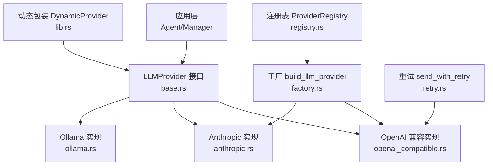
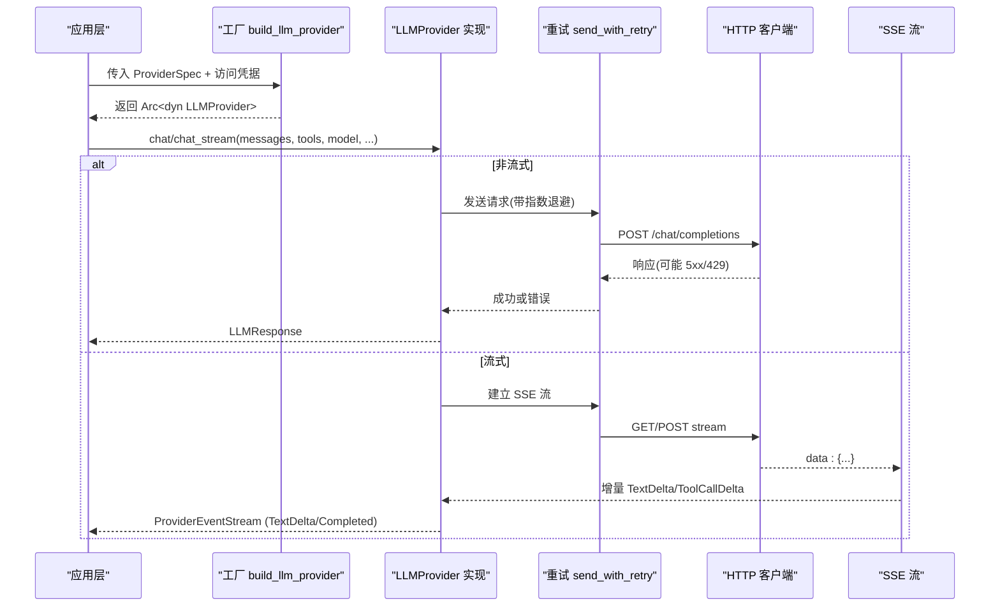
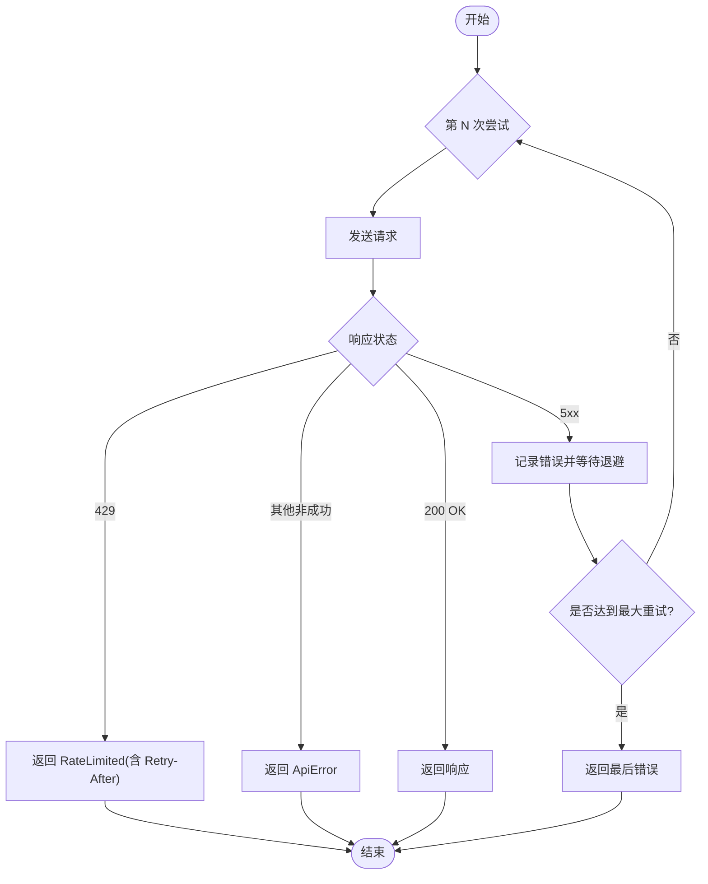
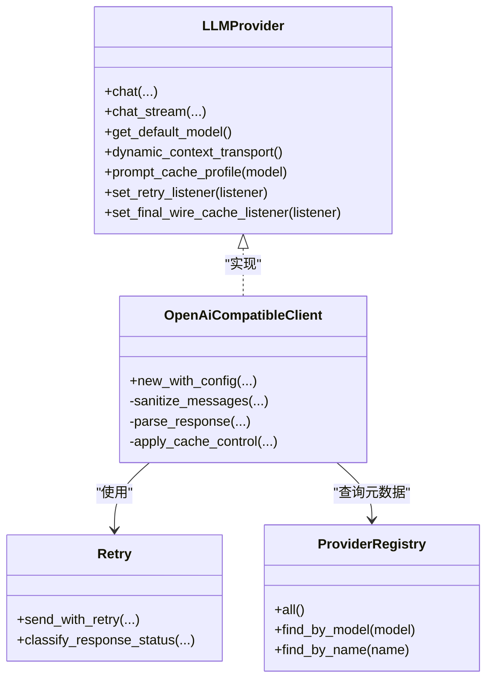

# 自定义提供商开发

<cite>
**本文引用的文件**
- [agent-diva-providers/src/base.rs](file://agent-diva-providers/src/base.rs)
- [agent-diva-providers/src/lib.rs](file://agent-diva-providers/src/lib.rs)
- [agent-diva-providers/src/factory.rs](file://agent-diva-providers/src/factory.rs)
- [agent-diva-providers/src/registry.rs](file://agent-diva-providers/src/registry.rs)
- [agent-diva-providers/src/openai_compatible.rs](file://agent-diva-providers/src/openai_compatible.rs)
- [agent-diva-providers/src/retry.rs](file://agent-diva-providers/src/retry.rs)
- [agent-diva-providers/tests/provider_retry.rs](file://agent-diva-providers/tests/provider_retry.rs)
- [agent-diva-providers/tests/ollama_streaming.rs](file://agent-diva-providers/tests/ollama_streaming.rs)
</cite>

## 目录
1. [简介](#简介)
2. [项目结构](#项目结构)
3. [核心组件](#核心组件)
4. [架构总览](#架构总览)
5. [详细组件分析](#详细组件分析)
6. [依赖关系分析](#依赖关系分析)
7. [性能考虑](#性能考虑)
8. [故障排查指南](#故障排查指南)
9. [结论](#结论)
10. [附录：完整接入流程与示例](#附录完整接入流程与示例)

## 简介
本指南面向希望为 agent-diva 接入新的 LLM 服务的开发者。内容覆盖从实现 LLMProvider trait、处理不同 API 响应格式、错误与重试、流式响应，到将提供商注册并构建到系统的全过程。文档同时提供测试策略与调试技巧，帮助你在保证稳定性的前提下快速集成新服务。

## 项目结构
与自定义提供商开发直接相关的代码集中在 agent-diva-providers 模块中：
- base.rs：定义 LLMProvider trait、消息模型、响应模型、流事件、能力检测等基础类型与默认行为。
- openai_compatible.rs：OpenAI 兼容协议的参考实现，展示如何构造请求、解析响应、处理流式 SSE、工具调用、缓存控制、清理控制字符等。
- registry.rs：提供商元数据注册表（名称、API 类型、默认模型、模型参数覆盖等）。
- factory.rs：根据 ProviderSpec 和访问凭据构建具体提供商实例的工厂方法。
- retry.rs：指数退避重试、速率限制识别、重试监听器回调。
- lib.rs：对外导出 trait、动态包装器 DynamicProvider、以及各子模块。
- tests/*：针对重试、流式等行为的集成测试样例。

图表来源
- [agent-diva-providers/src/base.rs:708-780](file://agent-diva-providers/src/base.rs#L708-L780)
- [agent-diva-providers/src/openai_compatible.rs:168-184](file://agent-diva-providers/src/openai_compatible.rs#L168-L184)
- [agent-diva-providers/src/factory.rs:23-70](file://agent-diva-providers/src/factory.rs#L23-L70)
- [agent-diva-providers/src/registry.rs:73-108](file://agent-diva-providers/src/registry.rs#L73-L108)
- [agent-diva-providers/src/retry.rs:86-181](file://agent-diva-providers/src/retry.rs#L86-L181)
- [agent-diva-providers/src/lib.rs:46-123](file://agent-diva-providers/src/lib.rs#L46-L123)

章节来源
- [agent-diva-providers/src/base.rs:1-130](file://agent-diva-providers/src/base.rs#L1-L130)
- [agent-diva-providers/src/lib.rs:1-42](file://agent-diva-providers/src/lib.rs#L1-L42)

## 核心组件
- LLMProvider trait：统一抽象了 chat、chat_stream、get_default_model 以及可选的动态上下文传输、提示词缓存配置、重试监听器、最终线网监听器等能力。
- 消息与响应模型：Message、MessageContent、MessageContentPart、LLMResponse、LLMStreamEvent 等，用于跨提供商统一表示对话内容与流事件。
- 能力检测：model_capabilities_for_model 系列函数，保守地判断模型是否支持视觉、推理、上下文窗口大小等。
- 重试机制：send_with_retry 提供指数退避与抖动，区分 429 限流与 5xx 可重试错误，并支持 RetryListener 回调。
- 工厂与注册表：build_llm_provider 根据 ProviderSpec 创建具体客户端；ProviderRegistry 管理提供商元数据与默认值。
- 动态包装：DynamicProvider 允许运行时替换底层提供商实现。

章节来源
- [agent-diva-providers/src/base.rs:708-780](file://agent-diva-providers/src/base.rs#L708-L780)
- [agent-diva-providers/src/base.rs:384-425](file://agent-diva-providers/src/base.rs#L384-L425)
- [agent-diva-providers/src/base.rs:155-264](file://agent-diva-providers/src/base.rs#L155-L264)
- [agent-diva-providers/src/retry.rs:86-181](file://agent-diva-providers/src/retry.rs#L86-L181)
- [agent-diva-providers/src/factory.rs:23-70](file://agent-diva-providers/src/factory.rs#L23-L70)
- [agent-diva-providers/src/registry.rs:73-108](file://agent-diva-providers/src/registry.rs#L73-L108)
- [agent-diva-providers/src/lib.rs:46-123](file://agent-diva-providers/src/lib.rs#L46-L123)

## 架构总览
下图展示了从上层调用到具体提供商实现的典型调用链，包括重试、流式事件与最终响应的组装过程。

图表来源
- [agent-diva-providers/src/factory.rs:23-70](file://agent-diva-providers/src/factory.rs#L23-L70)
- [agent-diva-providers/src/retry.rs:86-181](file://agent-diva-providers/src/retry.rs#L86-L181)
- [agent-diva-providers/src/openai_compatible.rs:742-760](file://agent-diva-providers/src/openai_compatible.rs#L742-L760)
- [agent-diva-providers/src/base.rs:722-747](file://agent-diva-providers/src/base.rs#L722-L747)

## 详细组件分析

### LLMProvider trait 与必须实现的方法
- 必须实现
  - chat：同步聊天完成请求，返回 LLMResponse。
  - get_default_model：返回该提供商的默认模型 ID。
- 推荐实现
  - chat_stream：流式聊天完成，返回 ProviderEventStream。若未实现，默认会回退为非流式并生成一个 Completed 事件。
- 可选重写
  - dynamic_context_transport：选择对话历史之后的“运行时上下文”在协议层的传输方式（系统消息、用户包裹、原生块）。
  - prompt_cache_profile：声明对特定模型的提示词缓存策略（禁用或临时缓存）。
  - set_retry_listener：设置重试监听器，以便在内部重试时通知上层。
  - set_final_wire_cache_listener：在请求最终序列化后观察其结构，用于缓存相关观测。

章节来源
- [agent-diva-providers/src/base.rs:708-780](file://agent-diva-providers/src/base.rs#L708-L780)

### 数据模型与能力检测
- Message/MessageContent/MessageContentPart：统一表达文本与多模态内容，支持图片 URL、文件 ID、Data URI 等。
- LLMResponse：包含 content、tool_calls、finish_reason、usage、reasoning_content。
- LLMStreamEvent：TextDelta、ReasoningDelta、ToolCallDelta、Completed。
- ModelCapabilities：保守的能力标志（vision/tools/reasoning/context_window），通过 model_capabilities_for_model 系列函数计算。

章节来源
- [agent-diva-providers/src/base.rs:384-425](file://agent-diva-providers/src/base.rs#L384-L425)
- [agent-diva-providers/src/base.rs:447-601](file://agent-diva-providers/src/base.rs#L447-L601)
- [agent-diva-providers/src/base.rs:155-264](file://agent-diva-providers/src/base.rs#L155-L264)

### OpenAI 兼容实现要点
- 请求构造：ChatCompletionRequest 包含 model、messages、tools/tool_choice、stream/stream_options、reasoning_effort、max_tokens、temperature。
- 响应解析：Choice/ResponseMessage/Usage 映射为标准 LLMResponse；工具调用参数支持字符串与对象两种形式，并提供双编码 JSON 的回退解析。
- 流式处理：SSE 事件按 data: 行分割，增量组装 TextDelta/ToolCallDelta，并在结束时输出 Completed。
- 健壮性：清理控制字符与 ANSI 转义序列，避免 JSON 解析失败；对 strict 端点做 assistant tool_call 的 content 规范化。
- 缓存控制：对首个稳定前缀 system 消息标记 cache_control=ephemeral；对最后一个工具进行 CORE 锚定。

章节来源
- [agent-diva-providers/src/openai_compatible.rs:24-47](file://agent-diva-providers/src/openai_compatible.rs#L24-L47)
- [agent-diva-providers/src/openai_compatible.rs:49-149](file://agent-diva-providers/src/openai_compatible.rs#L49-L149)
- [agent-diva-providers/src/openai_compatible.rs:448-542](file://agent-diva-providers/src/openai_compatible.rs#L448-L542)
- [agent-diva-providers/src/openai_compatible.rs:544-614](file://agent-diva-providers/src/openai_compatible.rs#L544-L614)
- [agent-diva-providers/src/openai_compatible.rs:616-660](file://agent-diva-providers/src/openai_compatible.rs#L616-L660)
- [agent-diva-providers/src/openai_compatible.rs:674-740](file://agent-diva-providers/src/openai_compatible.rs#L674-L740)
- [agent-diva-providers/src/openai_compatible.rs:742-760](file://agent-diva-providers/src/openai_compatible.rs#L742-L760)
- [agent-diva-providers/src/openai_compatible.rs:378-423](file://agent-diva-providers/src/openai_compatible.rs#L378-L423)

### 重试与错误分类
- 指数退避：BASE_DELAY_MS=1000ms，最大重试次数 MAX_RETRIES=3，延迟 = base × 2^(attempt-1) + 抖动。
- 状态码分类：
  - 429 → ProviderError::RateLimited（不重试，携带可选 Retry-After）。
  - 5xx → 可重试（继续下一次尝试）。
  - 其他非成功 → ProviderError::ApiError（立即失败）。
- 监听器：每次重试前调用 RetryListener，便于 UI 或日志上报进度。

图表来源
- [agent-diva-providers/src/retry.rs:17-47](file://agent-diva-providers/src/retry.rs#L17-L47)
- [agent-diva-providers/src/retry.rs:49-75](file://agent-diva-providers/src/retry.rs#L49-L75)
- [agent-diva-providers/src/retry.rs:86-181](file://agent-diva-providers/src/retry.rs#L86-L181)

章节来源
- [agent-diva-providers/src/retry.rs:86-181](file://agent-diva-providers/src/retry.rs#L86-L181)
- [agent-diva-providers/tests/provider_retry.rs:28-82](file://agent-diva-providers/tests/provider_retry.rs#L28-L82)
- [agent-diva-providers/tests/provider_retry.rs:126-192](file://agent-diva-providers/tests/provider_retry.rs#L126-L192)
- [agent-diva-providers/tests/provider_retry.rs:194-255](file://agent-diva-providers/tests/provider_retry.rs#L194-L255)

### 流式响应的正确实现方式
- 使用 SSE 解析 data: 行，累积增量文本与工具调用片段。
- 使用 StreamingUtf8Decoder 安全处理跨分片的 UTF-8 边界。
- 在流结束时输出 Completed(LLMResponse)，并合并 usage、finish_reason、reasoning_content。
- 若提供商不支持流式，可在 chat_stream 中默认回退为一次完成的非流式事件。

章节来源
- [agent-diva-providers/src/base.rs:82-129](file://agent-diva-providers/src/base.rs#L82-L129)
- [agent-diva-providers/src/base.rs:722-747](file://agent-diva-providers/src/base.rs#L722-L747)
- [agent-diva-providers/src/openai_compatible.rs:742-760](file://agent-diva-providers/src/openai_compatible.rs#L742-L760)
- [agent-diva-providers/tests/ollama_streaming.rs:6-33](file://agent-diva-providers/tests/ollama_streaming.rs#L6-L33)

### 动态上下文传输与提示词缓存
- dynamic_context_transport：默认 UserContextEnvelope，某些提供商可改为 MidConversationSystem 或 NativeContextBlock。
- prompt_cache_profile：对已知支持缓存的提供商/模型返回 Ephemeral，否则 Disabled，避免向不支持的端点发送缓存控制字段。

章节来源
- [agent-diva-providers/src/base.rs:427-445](file://agent-diva-providers/src/base.rs#L427-L445)
- [agent-diva-providers/src/base.rs:662-706](file://agent-diva-providers/src/base.rs#L662-L706)
- [agent-diva-providers/src/openai_compatible.rs:378-423](file://agent-diva-providers/src/openai_compatible.rs#L378-L423)

### 工厂与注册表
- ProviderSpec：描述提供商名称、API 类型、关键词、环境变量键、显示名、默认模型、默认 API Base、是否支持提示词缓存、模型列表与每模型参数覆盖。
- ProviderRegistry：加载内置 providers.yaml，支持按模型关键词或名称查找。
- build_llm_provider：根据 spec.api_type 选择 OpenAI 兼容或 Anthropic 客户端，并注入额外头、推理配置、响应协议等。

章节来源
- [agent-diva-providers/src/registry.rs:17-50](file://agent-diva-providers/src/registry.rs#L17-L50)
- [agent-diva-providers/src/registry.rs:73-108](file://agent-diva-providers/src/registry.rs#L73-L108)
- [agent-diva-providers/src/factory.rs:13-21](file://agent-diva-providers/src/factory.rs#L13-L21)
- [agent-diva-providers/src/factory.rs:23-70](file://agent-diva-providers/src/factory.rs#L23-L70)

## 依赖关系分析
- 上层通过工厂获取 Arc<dyn LLMProvider>，屏蔽具体实现差异。
- 具体实现依赖重试模块与 HTTP 客户端，统一错误分类与重试策略。
- 注册表集中管理提供商元数据，避免硬编码路由逻辑。
- 动态包装器允许热切换提供商，便于 A/B 或灰度发布。

图表来源
- [agent-diva-providers/src/base.rs:708-780](file://agent-diva-providers/src/base.rs#L708-L780)
- [agent-diva-providers/src/openai_compatible.rs:168-184](file://agent-diva-providers/src/openai_compatible.rs#L168-L184)
- [agent-diva-providers/src/registry.rs:73-108](file://agent-diva-providers/src/registry.rs#L73-L108)
- [agent-diva-providers/src/retry.rs:86-181](file://agent-diva-providers/src/retry.rs#L86-L181)

章节来源
- [agent-diva-providers/src/lib.rs:46-123](file://agent-diva-providers/src/lib.rs#L46-L123)
- [agent-diva-providers/src/factory.rs:23-70](file://agent-diva-providers/src/factory.rs#L23-L70)

## 性能考虑
- 流式优先：尽量实现 chat_stream，减少首字节延迟，提升用户体验。
- 控制字符清理：在发送前清理控制字符与 ANSI 序列，避免服务端解析失败导致的重传。
- 合理超时与连接池：为 HTTP 客户端设置合适的超时与复用策略，降低握手开销。
- 谨慎使用缓存控制：仅在明确支持的提供商/模型上启用 ephemeral 缓存，避免无效请求。
- 重试退避：遵循指数退避与抖动，避免雪崩；对 429 立即失败，由上层决定退避策略。

[本节为通用指导，无需引用具体文件]

## 故障排查指南
- 常见错误分类
  - 网络错误：ProviderError::HttpError，通常可重试。
  - JSON 解析失败：ProviderError::JsonError，检查消息内容是否包含控制字符。
  - 非法响应：ProviderError::InvalidResponse，核对服务端返回结构。
  - API 错误：ProviderError::ApiError，查看状态码与错误体。
  - 配置错误：ProviderError::ConfigError，检查 API Key/BaseURL/模型名。
  - 速率限制：ProviderError::RateLimited，读取 Retry-After 或采用指数退避。
- 调试建议
  - 开启 tracing 日志，关注请求体与响应体。
  - 使用 mockito 模拟服务端响应，验证重试与错误分支。
  - 通过 set_final_wire_cache_listener 观察最终线网结构，定位缓存相关问题。
  - 使用 set_retry_listener 捕获每次重试细节，便于前端或日志展示。

章节来源
- [agent-diva-providers/src/base.rs:10-46](file://agent-diva-providers/src/base.rs#L10-L46)
- [agent-diva-providers/src/openai_compatible.rs:544-614](file://agent-diva-providers/src/openai_compatible.rs#L544-L614)
- [agent-diva-providers/tests/provider_retry.rs:28-82](file://agent-diva-providers/tests/provider_retry.rs#L28-L82)

## 结论
通过实现 LLMProvider trait，你可以将任意 LLM 服务接入 agent-diva。借助统一的请求/响应模型、流式事件、重试机制与注册表/工厂，新增提供商的开发成本显著降低。建议在实现时优先考虑流式、健壮的错误处理与合理的缓存策略，并通过测试覆盖关键路径。

[本节为总结，无需引用具体文件]

## 附录：完整接入流程与示例

### 步骤一：实现 LLMProvider
- 必须实现
  - chat：构造请求、发送、解析响应为 LLMResponse。
  - get_default_model：返回默认模型 ID。
- 推荐实现
  - chat_stream：实现 SSE 流，输出 TextDelta/ToolCallDelta/Completed。
- 可选重写
  - dynamic_context_transport：根据提供商特性选择传输方式。
  - prompt_cache_profile：声明缓存策略。
  - set_retry_listener/set_final_wire_cache_listener：接入重试与缓存观测。

章节来源
- [agent-diva-providers/src/base.rs:708-780](file://agent-diva-providers/src/base.rs#L708-L780)

### 步骤二：注册提供商元数据
- 在 ProviderRegistry 对应的 providers.yaml 中添加 ProviderSpec，包括 name、api_type、keywords、env_key、display_name、default_model、default_api_base、supports_prompt_caching、models、model_overrides。
- 确保 keywords 能匹配你的模型 ID，以便自动路由。

章节来源
- [agent-diva-providers/src/registry.rs:17-50](file://agent-diva-providers/src/registry.rs#L17-L50)
- [agent-diva-providers/src/registry.rs:73-108](file://agent-diva-providers/src/registry.rs#L73-L108)

### 步骤三：通过工厂构建提供商
- 使用 build_llm_provider，传入 LlmProviderBuildOptions（spec、access、model、reasoning_effort/config、response_protocol）。
- 工厂会根据 api_type 选择具体实现并返回 Arc<dyn LLMProvider>。

章节来源
- [agent-diva-providers/src/factory.rs:13-21](file://agent-diva-providers/src/factory.rs#L13-L21)
- [agent-diva-providers/src/factory.rs:23-70](file://agent-diva-providers/src/factory.rs#L23-L70)

### 步骤四：处理不同类型 API 响应
- 标准 OpenAI 兼容：按 Choice/Message/Usage 解析。
- 特殊协议（如 DeepSeek V4 DSML）：使用专用解码器 decode_completion。
- 工具调用参数：支持字符串与对象，必要时进行双编码 JSON 回退。

章节来源
- [agent-diva-providers/src/openai_compatible.rs:49-149](file://agent-diva-providers/src/openai_compatible.rs#L49-L149)
- [agent-diva-providers/src/openai_compatible.rs:448-542](file://agent-diva-providers/src/openai_compatible.rs#L448-L542)

### 步骤五：错误处理与重试
- 使用 send_with_retry 封装 HTTP 请求，自动处理 5xx 重试与 429 限流。
- 通过 classify_response_status 分类状态码，结合 RetryListener 上报进度。

章节来源
- [agent-diva-providers/src/retry.rs:49-75](file://agent-diva-providers/src/retry.rs#L49-L75)
- [agent-diva-providers/src/retry.rs:86-181](file://agent-diva-providers/src/retry.rs#L86-L181)

### 步骤六：流式响应的实现
- 解析 SSE 的 data: 行，增量输出 TextDelta/ToolCallDelta。
- 使用 StreamingUtf8Decoder 安全处理 UTF-8 边界。
- 结束时输出 Completed(LLMResponse)。

章节来源
- [agent-diva-providers/src/base.rs:82-129](file://agent-diva-providers/src/base.rs#L82-L129)
- [agent-diva-providers/src/openai_compatible.rs:742-760](file://agent-diva-providers/src/openai_compatible.rs#L742-L760)

### 步骤七：测试策略
- 单元测试：验证消息清洗、参数覆盖、能力检测。
- 集成测试：使用 mockito 模拟 5xx/429/200，验证重试与错误分支。
- 流式测试：验证流式事件顺序与 Completed 触发。

章节来源
- [agent-diva-providers/tests/provider_retry.rs:28-82](file://agent-diva-providers/tests/provider_retry.rs#L28-L82)
- [agent-diva-providers/tests/provider_retry.rs:126-192](file://agent-diva-providers/tests/provider_retry.rs#L126-L192)
- [agent-diva-providers/tests/ollama_streaming.rs:6-33](file://agent-diva-providers/tests/ollama_streaming.rs#L6-L33)

### 步骤八：调试技巧
- 启用 tracing 日志，关注请求/响应与异常堆栈。
- 使用 set_retry_listener 捕获重试详情。
- 使用 set_final_wire_cache_listener 观察最终线网结构。
- 通过 Mock 服务隔离外部依赖，快速定位问题。

章节来源
- [agent-diva-providers/src/retry.rs:86-181](file://agent-diva-providers/src/retry.rs#L86-L181)
- [agent-diva-providers/tests/provider_retry.rs:84-124](file://agent-diva-providers/tests/provider_retry.rs#L84-L124)