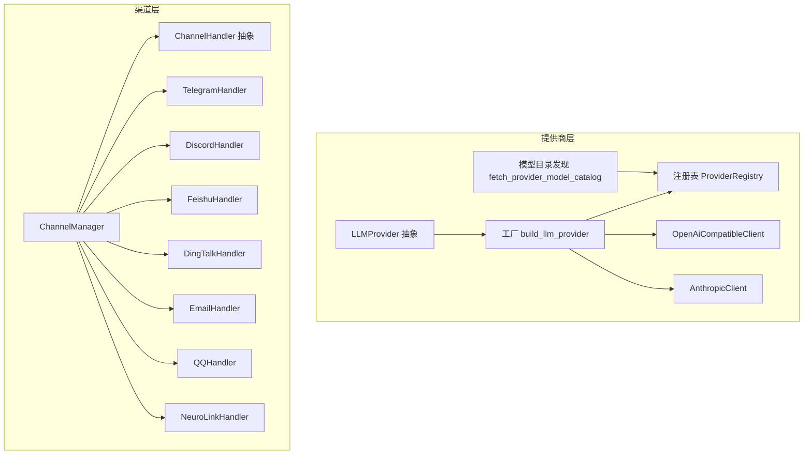
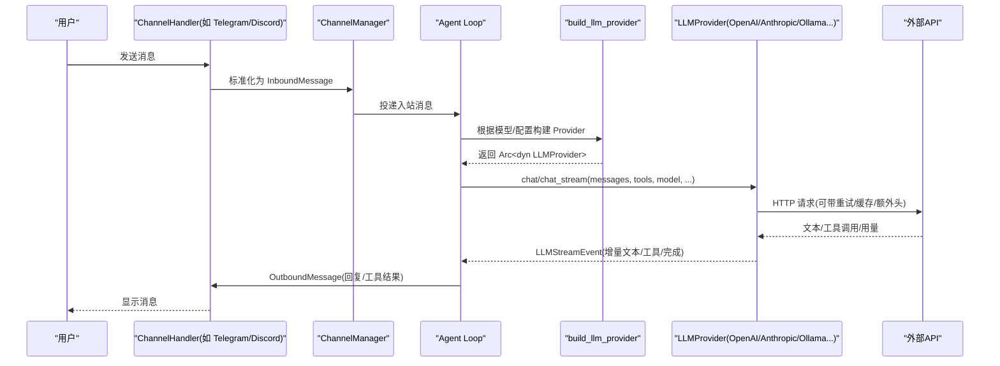
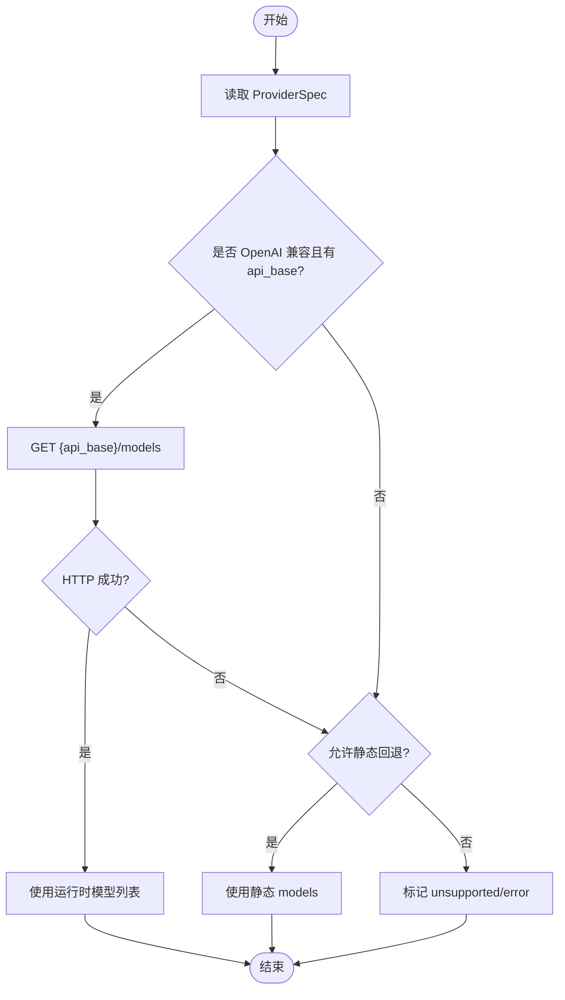
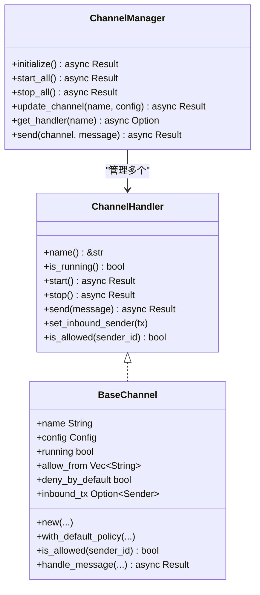
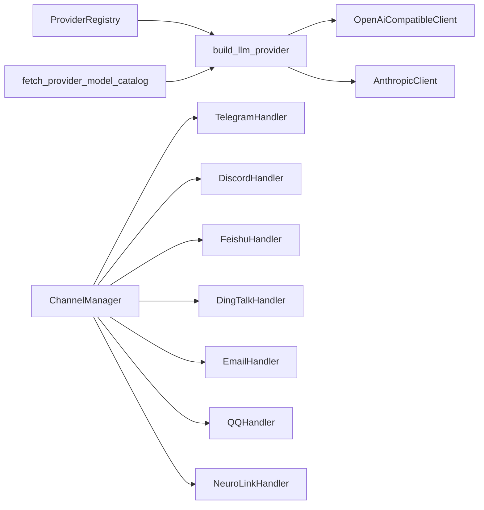

# 提供商与渠道

<cite>
**本文引用的文件**
- [agent-diva-providers/src/lib.rs](file://agent-diva-providers/src/lib.rs)
- [agent-diva-providers/src/base.rs](file://agent-diva-providers/src/base.rs)
- [agent-diva-providers/src/factory.rs](file://agent-diva-providers/src/factory.rs)
- [agent-diva-providers/src/registry.rs](file://agent-diva-providers/src/registry.rs)
- [agent-diva-providers/src/discovery.rs](file://agent-diva-providers/src/discovery.rs)
- [agent-diva-providers/src/providers.yaml](file://agent-diva-providers/src/providers.yaml)
- [agent-diva-providers/src/openai_compatible.rs](file://agent-diva-providers/src/openai_compatible.rs)
- [agent-diva-providers/src/anthropic.rs](file://agent-diva-providers/src/anthropic.rs)
- [agent-diva-channels/src/lib.rs](file://agent-diva-channels/src/lib.rs)
- [agent-diva-channels/src/base.rs](file://agent-diva-channels/src/base.rs)
- [agent-diva-channels/src/manager.rs](file://agent-diva-channels/src/manager.rs)
- [agent-diva-channels/src/telegram.rs](file://agent-diva-channels/src/telegram.rs)
- [agent-diva-channels/src/discord.rs](file://agent-diva-channels/src/discord.rs)
</cite>

## 目录
1. [简介](#简介)
2. [项目结构](#项目结构)
3. [核心组件](#核心组件)
4. [架构总览](#架构总览)
5. [详细组件分析](#详细组件分析)
6. [依赖关系分析](#依赖关系分析)
7. [性能考虑](#性能考虑)
8. [故障排除指南](#故障排除指南)
9. [结论](#结论)
10. [附录：配置示例与自定义开发](#附录：配置示例与自定义开发)

## 简介
本文件面向希望集成或扩展 LLM 提供商与聊天渠道的开发者，系统性说明以下主题：
- Provider 抽象接口与现有实现（OpenAI、Anthropic、Ollama 等 45+ 提供商）
- Channel 适配器设计与平台支持（Telegram、Discord、QQ、钉钉等）
- 自定义 Provider 与 Channel 的开发指南（接口实现与注册流程）
- 提供商发现机制与动态加载能力
- 配置示例与常见问题排查

## 项目结构
本项目将“LLM 提供商”和“聊天渠道”解耦为两个独立 crate：
- agent-diva-providers：提供统一的 LLMProvider 抽象、工厂构建、提供商元数据注册表、运行时模型目录发现、以及 OpenAI 兼容客户端与 Anthropic 原生客户端等实现。
- agent-diva-channels：提供统一的 ChannelHandler 抽象、ChannelManager 生命周期管理，以及 Telegram、Discord、飞书、钉钉、邮箱、QQ、Neuro-link 等具体通道实现。

图表来源
- [agent-diva-providers/src/lib.rs:21-40](file://agent-diva-providers/src/lib.rs#L21-L40)
- [agent-diva-providers/src/factory.rs:23-70](file://agent-diva-providers/src/factory.rs#L23-L70)
- [agent-diva-providers/src/registry.rs:73-108](file://agent-diva-providers/src/registry.rs#L73-L108)
- [agent-diva-providers/src/discovery.rs:63-113](file://agent-diva-providers/src/discovery.rs#L63-L113)
- [agent-diva-channels/src/lib.rs:9-52](file://agent-diva-channels/src/lib.rs#L9-L52)
- [agent-diva-channels/src/manager.rs:42-56](file://agent-diva-channels/src/manager.rs#L42-L56)

章节来源
- [agent-diva-providers/src/lib.rs:1-40](file://agent-diva-providers/src/lib.rs#L1-L40)
- [agent-diva-channels/src/lib.rs:1-52](file://agent-diva-channels/src/lib.rs#L1-L52)

## 核心组件
- LLMProvider 抽象：定义 chat/chat_stream、默认模型、动态上下文传输策略、提示词缓存策略、重试监听器等统一接口。
- 工厂与注册表：根据 ProviderSpec 的 api_type 选择具体实现；通过 providers.yaml 集中声明 45+ 提供商元数据。
- 模型目录发现：对 OpenAI 兼容端点调用 /models 获取运行时可用模型列表，失败时回退到静态列表。
- ChannelHandler 抽象：统一 start/stop/send、入站消息发送、访问控制策略。
- ChannelManager：按配置初始化并启动各通道，支持热更新与启停。

章节来源
- [agent-diva-providers/src/base.rs:708-780](file://agent-diva-providers/src/base.rs#L708-L780)
- [agent-diva-providers/src/factory.rs:23-70](file://agent-diva-providers/src/factory.rs#L23-L70)
- [agent-diva-providers/src/registry.rs:73-108](file://agent-diva-providers/src/registry.rs#L73-L108)
- [agent-diva-providers/src/discovery.rs:63-113](file://agent-diva-providers/src/discovery.rs#L63-L113)
- [agent-diva-channels/src/base.rs:9-32](file://agent-diva-channels/src/base.rs#L9-L32)
- [agent-diva-channels/src/manager.rs:377-642](file://agent-diva-channels/src/manager.rs#L377-L642)

## 架构总览
下图展示从渠道到提供商的端到端请求流，包括消息路由、提供商选择、流式响应与工具调用处理。

图表来源
- [agent-diva-channels/src/manager.rs:377-642](file://agent-diva-channels/src/manager.rs#L377-L642)
- [agent-diva-providers/src/factory.rs:23-70](file://agent-diva-providers/src/factory.rs#L23-L70)
- [agent-diva-providers/src/base.rs:708-780](file://agent-diva-providers/src/base.rs#L708-L780)
- [agent-diva-providers/src/openai_compatible.rs:168-184](file://agent-diva-providers/src/openai_compatible.rs#L168-L184)
- [agent-diva-providers/src/anthropic.rs:170-200](file://agent-diva-providers/src/anthropic.rs#L170-L200)

## 详细组件分析

### 提供商抽象与实现
- LLMProvider 接口：
  - chat/chat_stream：统一同步/流式对话入口，支持工具调用、推理内容、用量统计。
  - get_default_model：返回默认模型。
  - dynamic_context_transport：决定在历史之后如何携带运行时上下文。
  - prompt_cache_profile：声明是否启用提示词缓存及 TTL。
  - set_retry_listener/set_final_wire_cache_listener：用于重试进度与最终报文缓存观察。
- 错误分类：ProviderError 映射到可重试/超时/致命等类别，便于上层统一处理。
- 能力探测：model_capabilities_for_model 系列函数保守地判断模型是否支持视觉、推理、上下文窗口大小。

章节来源
- [agent-diva-providers/src/base.rs:10-67](file://agent-diva-providers/src/base.rs#L10-L67)
- [agent-diva-providers/src/base.rs:131-264](file://agent-diva-providers/src/base.rs#L131-L264)
- [agent-diva-providers/src/base.rs:708-780](file://agent-diva-providers/src/base.rs#L708-L780)

#### OpenAI 兼容客户端
- 负责构造 ChatCompletionRequest、解析非流/流式响应、工具调用增量拼装、reasoning_content 提取、用量统计。
- 支持 extra_headers、重试监听、最终报文缓存监听。
- 通过 registry 与 spec 识别提供商元信息，配合 discovery 进行模型目录发现。

章节来源
- [agent-diva-providers/src/openai_compatible.rs:24-184](file://agent-diva-providers/src/openai_compatible.rs#L24-L184)

#### Anthropic 原生客户端
- 使用 Messages API，支持 text/thinking/tool_use/tool_result 等内容块。
- 流式事件解析 text_delta/thinking_delta/input_json_delta，聚合 tool_use 参数。
- 支持系统消息块与提示词缓存控制。

章节来源
- [agent-diva-providers/src/anthropic.rs:21-180](file://agent-diva-providers/src/anthropic.rs#L21-L180)

#### Ollama 与其他提供商
- 通过 OpenAI 兼容模式接入（如本地 vLLM、Ollama 等），由 factory 基于 api_type=Openai 统一构建。
- 45+ 提供商元数据集中在 providers.yaml，包含默认模型、API Base、关键词匹配、是否网关/本地、提示词缓存支持等。

章节来源
- [agent-diva-providers/src/factory.rs:42-69](file://agent-diva-providers/src/factory.rs#L42-L69)
- [agent-diva-providers/src/providers.yaml:1-800](file://agent-diva-providers/src/providers.yaml#L1-L800)

### 提供商注册与发现
- ProviderRegistry：从内嵌 providers.yaml 加载默认提供商清单，支持按模型名/名称查找。
- Discovery：对 OpenAI 兼容端点发起 GET /models 获取运行时模型列表；若失败且允许回退，则使用静态 models 列表；否则标记 unsupported/error。
- ProviderAccess：从配置中抽取 api_key/api_base/extra_headers，供 discovery 与客户端使用。

图表来源
- [agent-diva-providers/src/discovery.rs:63-113](file://agent-diva-providers/src/discovery.rs#L63-L113)
- [agent-diva-providers/src/discovery.rs:179-246](file://agent-diva-providers/src/discovery.rs#L179-L246)
- [agent-diva-providers/src/registry.rs:73-108](file://agent-diva-providers/src/registry.rs#L73-L108)

章节来源
- [agent-diva-providers/src/registry.rs:73-108](file://agent-diva-providers/src/registry.rs#L73-L108)
- [agent-diva-providers/src/discovery.rs:63-113](file://agent-diva-providers/src/discovery.rs#L63-L113)
- [agent-diva-providers/src/discovery.rs:179-246](file://agent-diva-providers/src/discovery.rs#L179-L246)

### 渠道适配器与管理器
- ChannelHandler：统一 name/start/stop/send、入站消息发送、访问控制 is_allowed。
- BaseChannel：提供 allow_from 白名单、deny_by_default 策略、通配符匹配、复合 ID 匹配、handle_message 封装。
- ChannelManager：按配置初始化各通道（Telegram、Discord、飞书、钉钉、邮箱、QQ、Neuro-link 等），支持 update_channel 热更新、start_all/stop_all 生命周期管理。

图表来源
- [agent-diva-channels/src/base.rs:9-32](file://agent-diva-channels/src/base.rs#L9-L32)
- [agent-diva-channels/src/base.rs:73-230](file://agent-diva-channels/src/base.rs#L73-L230)
- [agent-diva-channels/src/manager.rs:42-56](file://agent-diva-channels/src/manager.rs#L42-L56)
- [agent-diva-channels/src/manager.rs:377-735](file://agent-diva-channels/src/manager.rs#L377-L735)

章节来源
- [agent-diva-channels/src/base.rs:9-230](file://agent-diva-channels/src/base.rs#L9-L230)
- [agent-diva-channels/src/manager.rs:377-735](file://agent-diva-channels/src/manager.rs#L377-L735)

### 典型渠道实现要点
- Telegram：基于 teloxide 的 Bot 与 Dispatcher，支持命令（/start、/reset、/help、/stop）、Markdown→HTML 转换、打字指示器、会话状态。
- Discord：基于 Gateway WebSocket 接收消息，REST 发送消息；维护心跳、重连、会话恢复、附件下载、提及检测、群聊回复白名单。

章节来源
- [agent-diva-channels/src/telegram.rs:17-127](file://agent-diva-channels/src/telegram.rs#L17-L127)
- [agent-diva-channels/src/discord.rs:1-135](file://agent-diva-channels/src/discord.rs#L1-L135)

## 依赖关系分析
- 工厂依赖注册表与发现模块，依据 api_type 选择 OpenAI 兼容或 Anthropic 客户端。
- 渠道管理器依赖各通道实现，并通过 BaseChannel 统一权限与入站消息转发。
- 提供商与渠道之间通过 Agent 编排耦合，彼此保持松耦合。

图表来源
- [agent-diva-providers/src/factory.rs:23-70](file://agent-diva-providers/src/factory.rs#L23-L70)
- [agent-diva-providers/src/registry.rs:73-108](file://agent-diva-providers/src/registry.rs#L73-L108)
- [agent-diva-providers/src/discovery.rs:63-113](file://agent-diva-providers/src/discovery.rs#L63-L113)
- [agent-diva-channels/src/manager.rs:377-642](file://agent-diva-channels/src/manager.rs#L377-L642)

章节来源
- [agent-diva-providers/src/factory.rs:23-70](file://agent-diva-providers/src/factory.rs#L23-L70)
- [agent-diva-channels/src/manager.rs:377-642](file://agent-diva-channels/src/manager.rs#L377-L642)

## 性能考虑
- 流式响应：Provider 层通过 LLMStreamEvent 推送增量文本/工具/完成事件，降低首字延迟。
- UTF-8 流解码：StreamingUtf8Decoder 保证跨分片正确解码，避免乱码。
- 提示词缓存：通过 prompt_cache_profile 声明缓存策略，减少重复请求开销。
- 重试与监听：set_retry_listener 暴露内部重试进度，便于 UI 反馈与监控。
- 模型目录发现：优先运行时 /models 拉取，失败回退静态列表，兼顾可用性与性能。

章节来源
- [agent-diva-providers/src/base.rs:82-129](file://agent-diva-providers/src/base.rs#L82-L129)
- [agent-diva-providers/src/base.rs:759-779](file://agent-diva-providers/src/base.rs#L759-L779)
- [agent-diva-providers/src/discovery.rs:63-113](file://agent-diva-providers/src/discovery.rs#L63-L113)

## 故障排除指南
- 提供商错误分类：
  - 网络/速率限制：归类为可重试，建议指数退避重试。
  - 超时/服务端错误：归类为可重试。
  - 配置错误/无效响应：归类为配置/致命，需检查配置与协议。
- 渠道权限问题：
  - 未在白名单：is_allowed 拒绝并记录警告，需在配置中添加 sender_id 或使用通配符。
  - 复合 ID：支持 “id|username” 形式拆分匹配。
- 通道启动失败：
  - ChannelManager 会记录跳过原因（缺少必填字段或未启用），请检查对应 channels.* 配置。
- 模型目录发现失败：
  - 若 /models 不可达或鉴权失败，将回退到静态 models；如仍不可用，检查 api_base 与密钥。

章节来源
- [agent-diva-providers/src/base.rs:34-67](file://agent-diva-providers/src/base.rs#L34-L67)
- [agent-diva-channels/src/base.rs:121-229](file://agent-diva-channels/src/base.rs#L121-L229)
- [agent-diva-channels/src/manager.rs:59-211](file://agent-diva-channels/src/manager.rs#L59-L211)
- [agent-diva-providers/src/discovery.rs:115-143](file://agent-diva-providers/src/discovery.rs#L115-L143)

## 结论
本系统通过清晰的 Provider 抽象与 Channel 适配器设计，实现了多 LLM 提供商与多渠道的统一接入。借助注册表与发现机制，新增提供商只需在 YAML 中声明元数据并在工厂中适配即可；新增渠道只需实现 ChannelHandler 并通过 ChannelManager 注册。结合流式响应、重试监听、提示词缓存等特性，系统在易用性、可扩展性与性能方面具备良好平衡。

## 附录：配置示例与自定义开发

### 提供商配置要点
- 在 providers.yaml 中新增条目，指定 name、api_type、keywords、env_key、display_name、default_api_base、supports_prompt_caching、models 等。
- 通过 factory 的 api_type 分支选择实现（当前支持 Openai、Anthropic）。
- 如需新 API 类型，请在 factory 中增加分支并实现对应客户端。

章节来源
- [agent-diva-providers/src/providers.yaml:1-800](file://agent-diva-providers/src/providers.yaml#L1-L800)
- [agent-diva-providers/src/factory.rs:42-69](file://agent-diva-providers/src/factory.rs#L42-L69)

### 渠道配置要点
- 在 channels.* 下启用对应通道并填写必填字段（如 token、app_id、secret、base_url 等）。
- 使用 ChannelManager::channel_validation 校验必填字段，缺失将被跳过并记录日志。
- 白名单 allow_from 支持精确匹配与通配符匹配，支持复合 ID。

章节来源
- [agent-diva-channels/src/manager.rs:59-211](file://agent-diva-channels/src/manager.rs#L59-L211)
- [agent-diva-channels/src/base.rs:121-229](file://agent-diva-channels/src/base.rs#L121-L229)

### 自定义 Provider 开发步骤
1. 实现 LLMProvider trait（chat/chat_stream/get_default_model 等）。
2. 在 factory.rs 中为新的 api_type 添加分支，返回你的客户端实例。
3. 在 providers.yaml 中登记元数据（name、keywords、env_key、default_api_base、models 等）。
4. 可选：实现 prompt_cache_profile/dynamic_context_transport 以适配特定行为。
5. 测试：使用 discovery 验证 /models 可达性，使用 retry listener 观察重试行为。

章节来源
- [agent-diva-providers/src/base.rs:708-780](file://agent-diva-providers/src/base.rs#L708-L780)
- [agent-diva-providers/src/factory.rs:23-70](file://agent-diva-providers/src/factory.rs#L23-L70)
- [agent-diva-providers/src/discovery.rs:63-113](file://agent-diva-providers/src/discovery.rs#L63-L113)

### 自定义 Channel 开发步骤
1. 实现 ChannelHandler trait（name/start/stop/send/is_allowed）。
2. 在 manager.rs 的 build_updated_handler 中增加分支，按配置创建并返回 handler。
3. 在 lib.rs 中导出新模块与 handler。
4. 在 manager.rs 的 initialize 中按配置初始化并注入 inbound_tx。
5. 使用 BaseChannel 提供的权限与消息封装简化实现。

章节来源
- [agent-diva-channels/src/base.rs:9-32](file://agent-diva-channels/src/base.rs#L9-L32)
- [agent-diva-channels/src/manager.rs:222-359](file://agent-diva-channels/src/manager.rs#L222-L359)
- [agent-diva-channels/src/lib.rs:9-52](file://agent-diva-channels/src/lib.rs#L9-L52)