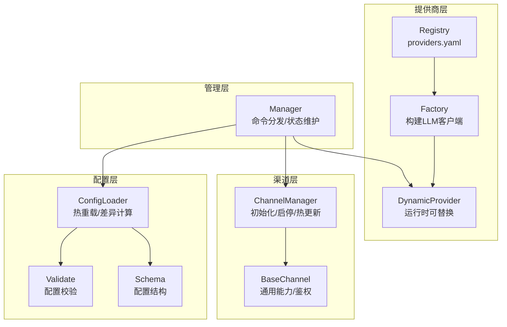
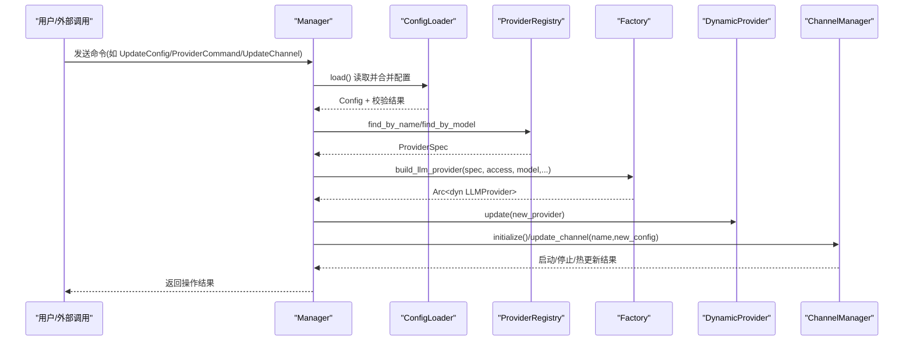
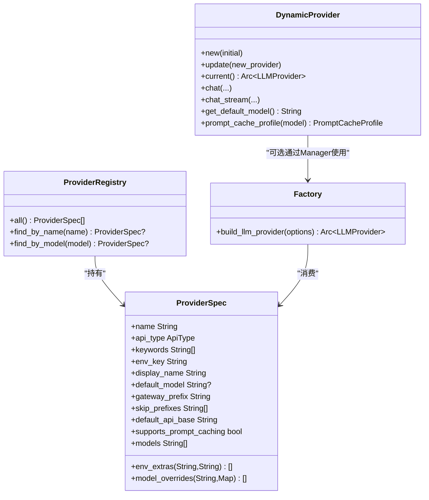
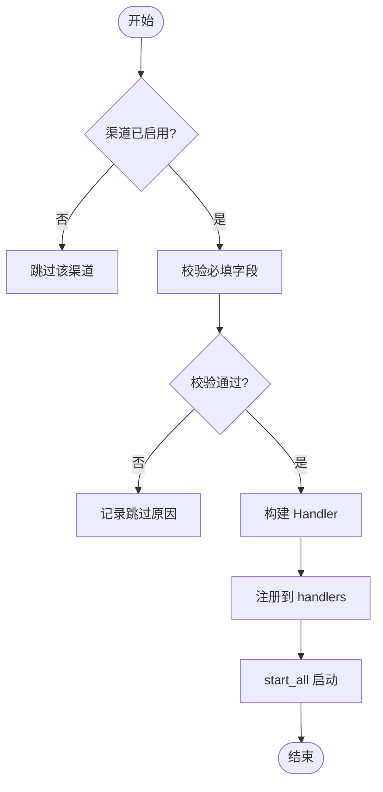
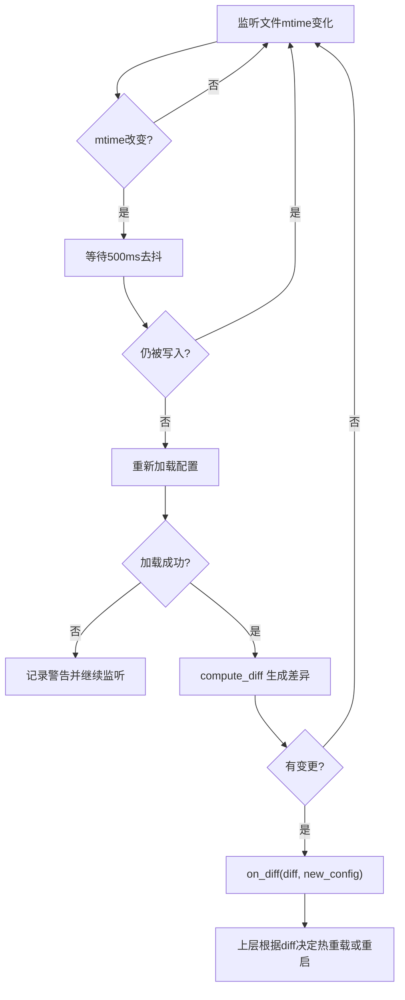
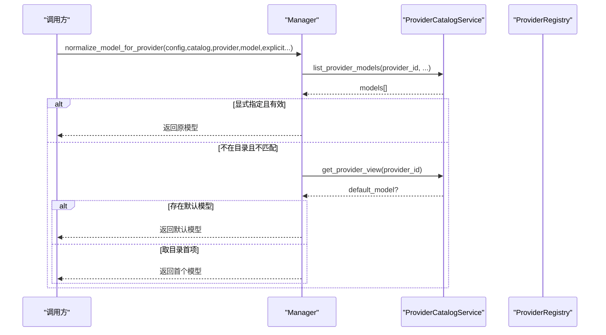
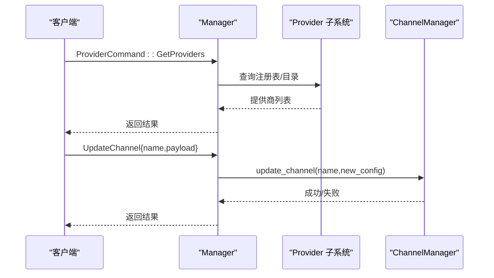
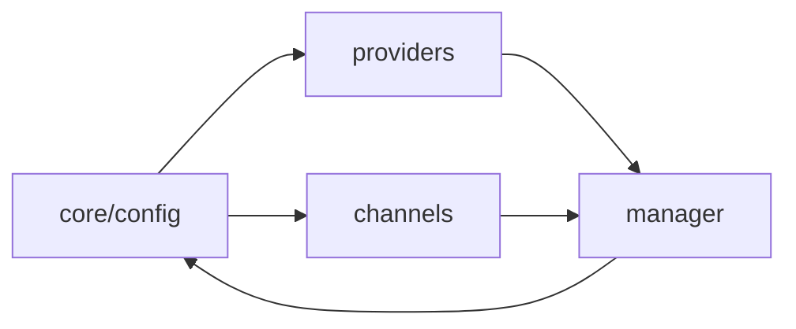

# 提供商与渠道管理

<cite>
**本文引用的文件**
- [agent-diva-providers/src/lib.rs](file://agent-diva-providers/src/lib.rs)
- [agent-diva-providers/src/registry.rs](file://agent-diva-providers/src/registry.rs)
- [agent-diva-providers/src/factory.rs](file://agent-diva-providers/src/factory.rs)
- [agent-diva-providers/src/providers.yaml](file://agent-diva-providers/src/providers.yaml)
- [agent-diva-channels/src/lib.rs](file://agent-diva-channels/src/lib.rs)
- [agent-diva-channels/src/base.rs](file://agent-diva-channels/src/base.rs)
- [agent-diva-channels/src/manager.rs](file://agent-diva-channels/src/manager.rs)
- [agent-diva-core/src/config/mod.rs](file://agent-diva-core/src/config/mod.rs)
- [agent-diva-core/src/config/loader.rs](file://agent-diva-core/src/config/loader.rs)
- [agent-diva-core/src/config/schema.rs](file://agent-diva-core/src/config/schema.rs)
- [agent-diva-core/src/config/validate.rs](file://agent-diva-core/src/config/validate.rs)
- [agent-diva-manager/src/manager.rs](file://agent-diva-manager/src/manager.rs)
</cite>

## 目录
1. [简介](#简介)
2. [项目结构](#项目结构)
3. [核心组件](#核心组件)
4. [架构总览](#架构总览)
5. [详细组件分析](#详细组件分析)
6. [依赖关系分析](#依赖关系分析)
7. [性能考虑](#性能考虑)
8. [故障诊断指南](#故障诊断指南)
9. [结论](#结论)
10. [附录：配置示例与管理 API](#附录配置示例与管理-api)

## 简介
本文件面向“提供商（Provider）”和“渠道（Channel）”的运行时管理与配置体系，覆盖以下主题：
- 配置文件结构与动态加载机制
- 提供商能力检测、模型目录同步与热重载
- 渠道状态监控、启停与热更新
- 配置验证、错误恢复与最佳实践
- 管理 API 使用指南与性能优化建议

## 项目结构
系统由多个 crate 协作完成：
- agent-diva-providers：提供商元数据、注册表、构建器、动态切换封装
- agent-diva-channels：多渠道适配器与统一管理器
- agent-diva-core：配置加载、校验、Schema 定义
- agent-diva-manager：运行时编排，协调 Provider/Channel/MCP/技能等

图表来源
- [agent-diva-core/src/config/loader.rs:107-166](file://agent-diva-core/src/config/loader.rs#L107-L166)
- [agent-diva-core/src/config/schema.rs:279-309](file://agent-diva-core/src/config/schema.rs#L279-L309)
- [agent-diva-core/src/config/validate.rs:6-99](file://agent-diva-core/src/config/validate.rs#L6-L99)
- [agent-diva-providers/src/registry.rs:74-108](file://agent-diva-providers/src/registry.rs#L74-L108)
- [agent-diva-providers/src/factory.rs:23-70](file://agent-diva-providers/src/factory.rs#L23-L70)
- [agent-diva-providers/src/lib.rs:46-123](file://agent-diva-providers/src/lib.rs#L46-L123)
- [agent-diva-channels/src/manager.rs:361-642](file://agent-diva-channels/src/manager.rs#L361-L642)
- [agent-diva-manager/src/manager.rs:263-396](file://agent-diva-manager/src/manager.rs#L263-L396)

章节来源
- [agent-diva-core/src/config/mod.rs:1-12](file://agent-diva-core/src/config/mod.rs#L1-L12)
- [agent-diva-manager/src/manager.rs:27-44](file://agent-diva-manager/src/manager.rs#L27-L44)

## 核心组件
- 配置加载与热重载：ConfigLoader 支持从文件与环境变量合并配置，提供 start_hot_reload 定时轮询并计算差异，区分热重载字段与需重启字段。
- 配置 Schema 与校验：schema.rs 定义全局 Config 及各子模块结构；validate.rs 对必填项、取值范围、工具与语音服务进行约束。
- 提供商注册与构建：registry.rs 内嵌 providers.yaml 作为单一事实源；factory.rs 根据 api_type 构建 OpenAI 兼容或 Anthropic 客户端；lib.rs 提供 DynamicProvider 实现运行时替换。
- 渠道管理器：manager.rs 负责按配置初始化各渠道处理器，支持 update_channel 热更新、start_all/stop_all 生命周期管理；base.rs 提供 ChannelHandler trait 与通用 BaseChannel。
- 管理器编排：manager.rs 集中处理 ManagerCommand，包括 ProviderCommand、UpdateChannel、UpdateTools 等，驱动运行时行为。

章节来源
- [agent-diva-core/src/config/loader.rs:57-82](file://agent-diva-core/src/config/loader.rs#L57-L82)
- [agent-diva-core/src/config/schema.rs:279-309](file://agent-diva-core/src/config/schema.rs#L279-L309)
- [agent-diva-core/src/config/validate.rs:6-99](file://agent-diva-core/src/config/validate.rs#L6-L99)
- [agent-diva-providers/src/registry.rs:74-108](file://agent-diva-providers/src/registry.rs#L74-L108)
- [agent-diva-providers/src/factory.rs:23-70](file://agent-diva-providers/src/factory.rs#L23-L70)
- [agent-diva-providers/src/lib.rs:46-123](file://agent-diva-providers/src/lib.rs#L46-L123)
- [agent-diva-channels/src/manager.rs:361-642](file://agent-diva-channels/src/manager.rs#L361-L642)
- [agent-diva-channels/src/base.rs:9-32](file://agent-diva-channels/src/base.rs#L9-L32)
- [agent-diva-manager/src/manager.rs:263-396](file://agent-diva-manager/src/manager.rs#L263-L396)

## 架构总览
下图展示从配置到运行时的关键流程：配置加载与校验 → 提供商构建与动态切换 → 渠道初始化与热更新 → 管理器命令分发。

图表来源
- [agent-diva-manager/src/manager.rs:263-396](file://agent-diva-manager/src/manager.rs#L263-L396)
- [agent-diva-core/src/config/loader.rs:57-82](file://agent-diva-core/src/config/loader.rs#L57-L82)
- [agent-diva-providers/src/registry.rs:74-108](file://agent-diva-providers/src/registry.rs#L74-L108)
- [agent-diva-providers/src/factory.rs:23-70](file://agent-diva-providers/src/factory.rs#L23-L70)
- [agent-diva-providers/src/lib.rs:46-123](file://agent-diva-providers/src/lib.rs#L46-L123)
- [agent-diva-channels/src/manager.rs:361-642](file://agent-diva-channels/src/manager.rs#L361-L642)

## 详细组件分析

### 提供商配置与动态加载
- 配置来源：providers.yaml 是默认提供商清单，包含名称、API 类型、关键词、环境变量键、默认模型、网关前缀、是否本地、默认 API Base、模型列表与每模型参数覆盖等。
- 注册表：ProviderRegistry 在构造时内嵌加载 providers.yaml，并提供按名称、按模型关键词查找的能力。
- 构建器：build_llm_provider 依据 spec.api_type 选择 OpenAI 兼容或 Anthropic 客户端，并注入模型、推理努力、响应协议等选项；对不支持的 api_type 返回配置错误。
- 动态切换：DynamicProvider 以 RwLock<Arc<dyn LLMProvider>> 包装，支持运行时 update(current/new)，所有 chat/chat_stream 等方法转发至当前实例。

图表来源
- [agent-diva-providers/src/registry.rs:7-50](file://agent-diva-providers/src/registry.rs#L7-L50)
- [agent-diva-providers/src/registry.rs:74-108](file://agent-diva-providers/src/registry.rs#L74-L108)
- [agent-diva-providers/src/factory.rs:13-70](file://agent-diva-providers/src/factory.rs#L13-L70)
- [agent-diva-providers/src/lib.rs:46-123](file://agent-diva-providers/src/lib.rs#L46-L123)

章节来源
- [agent-diva-providers/src/providers.yaml:1-800](file://agent-diva-providers/src/providers.yaml#L1-L800)
- [agent-diva-providers/src/registry.rs:74-108](file://agent-diva-providers/src/registry.rs#L74-L108)
- [agent-diva-providers/src/factory.rs:23-70](file://agent-diva-providers/src/factory.rs#L23-L70)
- [agent-diva-providers/src/lib.rs:46-123](file://agent-diva-providers/src/lib.rs#L46-L123)

### 渠道管理与状态监控
- 通道枚举与编译开关：lib.rs 声明了多种渠道，部分默认不编译，通过 feature channel-* 启用。
- 校验与就绪：ChannelManager::channel_validation 针对每个渠道检查 enabled 与必填字段，返回 ChannelValidation；configured_channel_names 仅返回 ready 的通道名。
- 初始化与启停：initialize 按配置创建并插入 handler，start_all 逐个启动，stop_all 逐个停止并清理。
- 热更新：update_channel 先停止并移除旧 handler，再基于新配置重建并启动，保证无中断切换。
- 基础能力：BaseChannel 提供 is_allowed 白名单匹配（含通配符）、handle_message 入站消息投递、会话密钥与 host 校验等。

图表来源
- [agent-diva-channels/src/manager.rs:59-196](file://agent-diva-channels/src/manager.rs#L59-L196)
- [agent-diva-channels/src/manager.rs:361-642](file://agent-diva-channels/src/manager.rs#L361-L642)
- [agent-diva-channels/src/base.rs:121-184](file://agent-diva-channels/src/base.rs#L121-L184)

章节来源
- [agent-diva-channels/src/lib.rs:1-53](file://agent-diva-channels/src/lib.rs#L1-L53)
- [agent-diva-channels/src/manager.rs:59-196](file://agent-diva-channels/src/manager.rs#L59-L196)
- [agent-diva-channels/src/manager.rs:361-642](file://agent-diva-channels/src/manager.rs#L361-L642)
- [agent-diva-channels/src/base.rs:9-32](file://agent-diva-channels/src/base.rs#L9-L32)
- [agent-diva-channels/src/base.rs:121-184](file://agent-diva-channels/src/base.rs#L121-L184)

### 配置验证、热重载与错误恢复
- 配置加载：ConfigLoader::load 合并默认值、配置文件与环境变量，应用别名覆盖与路径覆盖，最后执行 validate_config。
- 热重载：start_hot_reload 每 5 秒轮询 mtime，检测到变更后等待去抖 500ms 再次确认，重新加载并 compute_diff，将变更分为 hot_reload 与 restart_required 两类回调。
- 分类规则：classify_field 明确允许的热重载字段（如 agents.defaults.model/temperature、tools.web.search.enabled、sandbox.mode、logging.level 等），其余字段需要重启生效。
- 错误恢复：加载失败会记录警告；通道启动失败会记录警告但其他通道继续运行；update_channel 在 stop/start 失败时记录错误并回退。

图表来源
- [agent-diva-core/src/config/loader.rs:107-166](file://agent-diva-core/src/config/loader.rs#L107-L166)
- [agent-diva-core/src/config/loader.rs:214-239](file://agent-diva-core/src/config/loader.rs#L214-L239)
- [agent-diva-core/src/config/loader.rs:248-306](file://agent-diva-core/src/config/loader.rs#L248-L306)
- [agent-diva-core/src/config/validate.rs:6-99](file://agent-diva-core/src/config/validate.rs#L6-L99)

章节来源
- [agent-diva-core/src/config/loader.rs:57-82](file://agent-diva-core/src/config/loader.rs#L57-L82)
- [agent-diva-core/src/config/loader.rs:107-166](file://agent-diva-core/src/config/loader.rs#L107-L166)
- [agent-diva-core/src/config/loader.rs:214-239](file://agent-diva-core/src/config/loader.rs#L214-L239)
- [agent-diva-core/src/config/loader.rs:248-306](file://agent-diva-core/src/config/loader.rs#L248-L306)
- [agent-diva-core/src/config/validate.rs:6-99](file://agent-diva-core/src/config/validate.rs#L6-L99)

### 提供商能力检测与模型目录同步
- 能力检测：ProviderSpec 中的 supports_prompt_caching 标识是否支持提示缓存；ModelCapabilities 相关函数在 base 中暴露（见 lib.rs 导出）。
- 模型目录：ProviderCatalogService 用于列出提供商模型视图与条目；Manager 在 normalize_model_for_provider 中结合 catalog 与 registry 确定最终模型，优先显式指定，其次默认模型，其次目录首项。
- 模型匹配：model_matches_provider 支持通过 provider 前缀或 registry 解析判断模型归属。

图表来源
- [agent-diva-manager/src/manager.rs:193-241](file://agent-diva-manager/src/manager.rs#L193-L241)
- [agent-diva-manager/src/manager.rs:173-191](file://agent-diva-manager/src/manager.rs#L173-L191)
- [agent-diva-providers/src/lib.rs:21-36](file://agent-diva-providers/src/lib.rs#L21-L36)

章节来源
- [agent-diva-manager/src/manager.rs:173-241](file://agent-diva-manager/src/manager.rs#L173-L241)
- [agent-diva-providers/src/lib.rs:21-36](file://agent-diva-providers/src/lib.rs#L21-L36)

### 运行时管理与管理 API
- Manager 主循环接收 ManagerCommand，分派到具体处理器，包括 ProviderCommand（获取提供商、模型、增删改）、UpdateChannel、UpdateTools、GetChannels 等。
- Provider 命令处理：handle_provider_command 路由到对应方法，例如 handle_get_providers、handle_get_provider_models、handle_create_provider 等。
- 渠道更新：handle_update_channel 调用 ChannelManager::update_channel 完成热更新。

图表来源
- [agent-diva-manager/src/manager.rs:263-396](file://agent-diva-manager/src/manager.rs#L263-L396)
- [agent-diva-manager/src/manager.rs:406-433](file://agent-diva-manager/src/manager.rs#L406-L433)
- [agent-diva-channels/src/manager.rs:699-735](file://agent-diva-channels/src/manager.rs#L699-L735)

章节来源
- [agent-diva-manager/src/manager.rs:263-396](file://agent-diva-manager/src/manager.rs#L263-L396)
- [agent-diva-manager/src/manager.rs:406-433](file://agent-diva-manager/src/manager.rs#L406-L433)

## 依赖关系分析
- 配置层依赖 schema 与 validate，loader 负责合并与热重载。
- 提供商层依赖 registry（providers.yaml）与 factory，DynamicProvider 提供运行时替换。
- 渠道层依赖 base trait 与各具体 handler，ChannelManager 统一管理生命周期。
- 管理层依赖以上所有子系统，并通过命令模式解耦。

图表来源
- [agent-diva-core/src/config/mod.rs:1-12](file://agent-diva-core/src/config/mod.rs#L1-L12)
- [agent-diva-providers/src/lib.rs:1-41](file://agent-diva-providers/src/lib.rs#L1-L41)
- [agent-diva-channels/src/lib.rs:1-53](file://agent-diva-channels/src/lib.rs#L1-L53)
- [agent-diva-manager/src/manager.rs:27-44](file://agent-diva-manager/src/manager.rs#L27-L44)

章节来源
- [agent-diva-core/src/config/mod.rs:1-12](file://agent-diva-core/src/config/mod.rs#L1-L12)
- [agent-diva-providers/src/lib.rs:1-41](file://agent-diva-providers/src/lib.rs#L1-L41)
- [agent-diva-channels/src/lib.rs:1-53](file://agent-diva-channels/src/lib.rs#L1-L53)
- [agent-diva-manager/src/manager.rs:27-44](file://agent-diva-manager/src/manager.rs#L27-L44)

## 性能考虑
- 热重载去抖：配置热重载采用 5s 轮询 + 500ms 去抖，避免编辑器自动保存导致的重复加载。
- 通道启动容错：start_all 收集失败通道并记录警告，不影响其他通道运行，提升整体可用性。
- 提供商构建开销：工厂按需构建客户端，DynamicProvider 通过引用计数共享，减少重复创建成本。
- 模型归一化：normalize_model_for_provider 优先使用目录与默认模型，减少无效请求与重试。

[本节为通用指导，无需特定文件来源]

## 故障诊断指南
- 配置加载失败：查看 loader 日志中的警告信息，确认 config.json 路径与权限；检查环境变量映射是否正确。
- 渠道未启动：检查 ChannelManager::channel_validation 返回的 missing_fields；确保 enabled 与必填字段齐全。
- 提供商不可用：确认 providers.yaml 中对应 provider 的 env_key 与 api_base；检查 factory 构建是否返回配置错误。
- 热重载未生效：确认变更字段属于 hot_reload 白名单；否则需重启服务。

章节来源
- [agent-diva-core/src/config/loader.rs:107-166](file://agent-diva-core/src/config/loader.rs#L107-L166)
- [agent-diva-core/src/config/loader.rs:214-239](file://agent-diva-core/src/config/loader.rs#L214-L239)
- [agent-diva-channels/src/manager.rs:59-196](file://agent-diva-channels/src/manager.rs#L59-L196)
- [agent-diva-providers/src/factory.rs:23-70](file://agent-diva-providers/src/factory.rs#L23-L70)

## 结论
本系统通过清晰的配置分层、提供商注册与动态切换、渠道统一管理与热更新，实现了高可用与可扩展的提供商与渠道管理能力。配合配置校验、热重载与错误恢复机制，可在生产环境中稳定运行并快速响应变更。

[本节为总结性内容，无需特定文件来源]

## 附录：配置示例与管理 API

### 配置示例要点
- 提供商配置：在 providers.yaml 中定义 name、api_type、keywords、env_key、default_model、default_api_base、models、model_overrides 等。
- 渠道配置：在 channels.* 下设置 enabled 及必填字段（如 telegram.token、discord.token、feishu.app_id/app_secret、dingtalk.client_id/client_secret、email.imap_* / smtp_*、qq.app_id/secret 等）。
- Agent 默认：agents.defaults.provider/model/max_tokens/temperature 等。
- 工具与安全：tools.web.search.provider/max_results、sandbox.mode/logging.level 等。

章节来源
- [agent-diva-providers/src/providers.yaml:1-800](file://agent-diva-providers/src/providers.yaml#L1-L800)
- [agent-diva-core/src/config/schema.rs:559-603](file://agent-diva-core/src/config/schema.rs#L559-L603)
- [agent-diva-core/src/config/schema.rs:605-642](file://agent-diva-core/src/config/schema.rs#L605-L642)
- [agent-diva-core/src/config/schema.rs:644-800](file://agent-diva-core/src/config/schema.rs#L644-L800)
- [agent-diva-core/src/config/validate.rs:30-64](file://agent-diva-core/src/config/validate.rs#L30-L64)

### 管理 API 使用指南
- 提供商相关命令（ManagerCommand::Provider）：
  - GetProviders：获取所有提供商元数据
  - GetProvider(name)：获取指定提供商详情
  - GetProviderModels(name, runtime)：列出提供商模型
  - ResolveProvider(model, preferred_provider)：解析模型对应的提供商
  - AddProviderModel/DeleteProviderModel：增删自定义模型
  - CreateProvider/UpdateProvider/DeleteProvider：增删改自定义提供商
- 渠道相关命令：
  - GetChannels：列出已配置的渠道
  - UpdateChannel{name,payload}：热更新渠道配置（内部调用 ChannelManager::update_channel）
- 工具与技能：
  - UpdateTools：更新网络搜索/抓取等工具配置
  - GetSkills/UploadSkill/DeleteSkill：技能管理

章节来源
- [agent-diva-manager/src/manager.rs:263-396](file://agent-diva-manager/src/manager.rs#L263-L396)
- [agent-diva-manager/src/manager.rs:406-433](file://agent-diva-manager/src/manager.rs#L406-L433)
- [agent-diva-channels/src/manager.rs:699-735](file://agent-diva-channels/src/manager.rs#L699-L735)