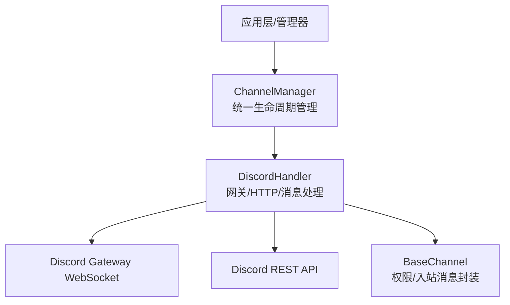
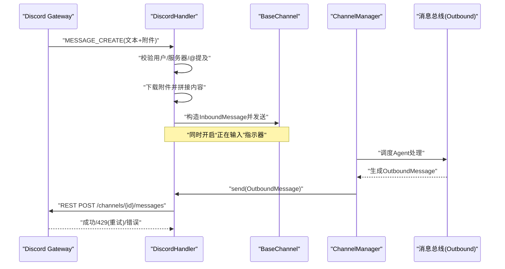
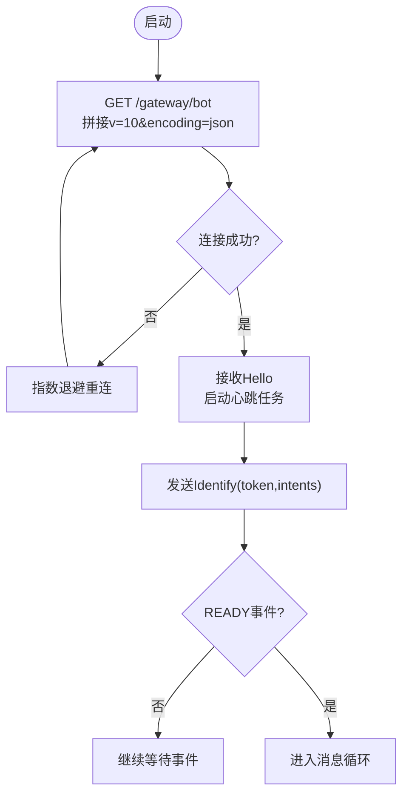
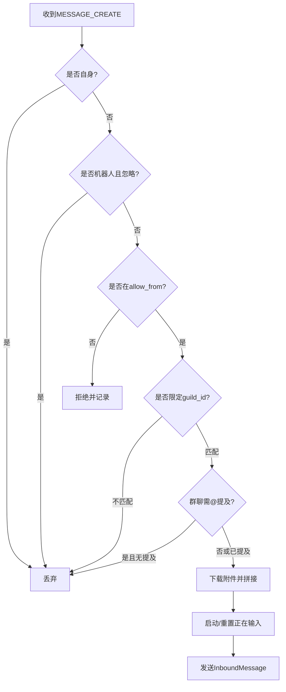
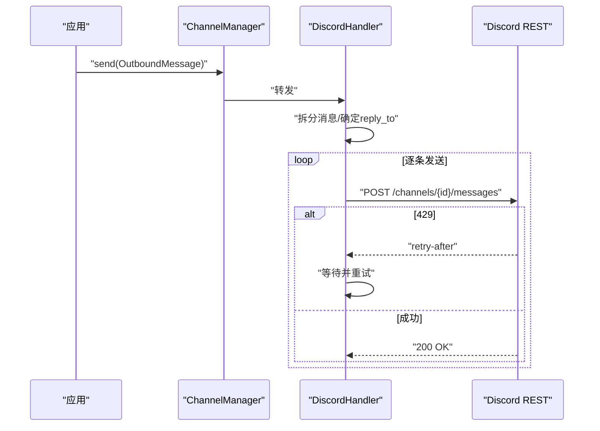
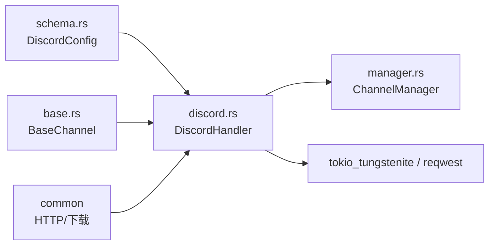

# Discord 平台实现

<cite>
**本文引用的文件**
- [discord.rs](file://agent-diva-channels/src/discord.rs)
- [base.rs](file://agent-diva-channels/src/base.rs)
- [manager.rs](file://agent-diva-channels/src/manager.rs)
- [schema.rs](file://agent-diva-core/src/config/schema.rs)
- [lib.rs](file://agent-diva-channels/src/lib.rs)
</cite>

## 目录
1. [简介](#简介)
2. [项目结构](#项目结构)
3. [核心组件](#核心组件)
4. [架构总览](#架构总览)
5. [详细组件分析](#详细组件分析)
6. [依赖关系分析](#依赖关系分析)
7. [性能与速率限制](#性能与速率限制)
8. [故障排查指南](#故障排查指南)
9. [结论](#结论)
10. [附录：配置参数说明](#附录：配置参数说明)

## 简介
本文件面向需要理解并扩展 agent-diva 的 Discord 通道实现的开发者与运维人员。内容覆盖 DiscordBotHandler（即代码中的 DiscordHandler）的实现架构、客户端初始化、事件监听机制、消息处理流程、认证与权限、消息格式映射、命令系统现状、频道管理、群组聊天支持、配置参数、速率限制与重连机制，以及调试技巧与常见问题解决方案。

## 项目结构
Discord 通道实现位于 channels 子模块中，通过统一的 ChannelManager 进行生命周期管理与路由。核心文件职责如下：
- discord.rs：Discord 网关连接、心跳、消息收发、速率限制与重连等具体实现。
- base.rs：通道抽象接口、通用权限控制与入站消息封装。
- manager.rs：多通道管理器，负责按配置创建、启动、停止各通道处理器。
- schema.rs：全局配置结构定义，包含 DiscordConfig 字段与默认值。
- lib.rs：模块导出，暴露 DiscordHandler 等类型供上层使用。

**图示来源**
- [manager.rs:377-418](file://agent-diva-channels/src/manager.rs#L377-L418)
- [discord.rs:296-318](file://agent-diva-channels/src/discord.rs#L296-L318)
- [base.rs:73-129](file://agent-diva-channels/src/base.rs#L73-L129)

**章节来源**
- [lib.rs:1-53](file://agent-diva-channels/src/lib.rs#L1-L53)
- [manager.rs:377-418](file://agent-diva-channels/src/manager.rs#L377-L418)

## 核心组件
- DiscordHandler：实现 ChannelHandler 接口，负责：
  - 从配置读取 token、intents、gateway_url、allow_from、mention_only、listen_to_bots、guild_id、group_reply_allowed_sender_ids。
  - 建立并维护与 Discord Gateway 的 WebSocket 连接，发送 Identify、Heartbeat，处理 Hello/Dispatch/Reconnect/InvalidSession。
  - 解析 MESSAGE_CREATE 事件，过滤机器人消息、未授权用户、非目标服务器消息，必要时要求 @提及。
  - 下载附件并合并到消息体，触发“正在输入”指示器。
  - 通过 REST API 发送消息，自动拆分超长消息，支持回复引用，处理 429 速率限制并重试。
- BaseChannel：提供跨通道的通用能力：
  - 允许列表 allow_from 与 deny_by_default 策略。
  - 入站消息 InboundMessage 构建与发送。
- ChannelManager：根据配置启用/禁用各通道，注入 inbound_tx，统一 start/stop/send。

**章节来源**
- [discord.rs:113-135](file://agent-diva-channels/src/discord.rs#L113-L135)
- [discord.rs:296-318](file://agent-diva-channels/src/discord.rs#L296-L318)
- [base.rs:73-129](file://agent-diva-channels/src/base.rs#L73-L129)
- [manager.rs:377-418](file://agent-diva-channels/src/manager.rs#L377-L418)

## 架构总览
下图展示从 Discord 事件到内部消息总线，再到出站消息回写的完整链路。

**图示来源**
- [discord.rs:336-442](file://agent-diva-channels/src/discord.rs#L336-L442)
- [discord.rs:606-696](file://agent-diva-channels/src/discord.rs#L606-L696)
- [discord.rs:810-836](file://agent-diva-channels/src/discord.rs#L810-L836)
- [manager.rs:688-697](file://agent-diva-channels/src/manager.rs#L688-L697)

## 详细组件分析

### Discord 客户端初始化与连接
- 初始化：
  - 从 DiscordConfig 读取 token、intents、gateway_url、allow_from 等。
  - 基于 token 前段 base64 解码得到 bot_user_id，用于本地过滤与 @提及清理。
  - 预构建 HTTP 客户端，用于 REST 调用与“正在输入”指示器。
- 连接流程：
  - 通过 GET /gateway/bot 获取 WebSocket URL，追加 v=10&encoding=json。
  - 建立 WebSocket，收到 Hello 后启动定时 Heartbeat 任务，并发送 Identify（携带 token、intents）。
  - 维护 seq/session_id，处理 Reconnect/InvalidSession 以支持恢复或重建会话。

**图示来源**
- [discord.rs:497-524](file://agent-diva-channels/src/discord.rs#L497-L524)
- [discord.rs:527-604](file://agent-diva-channels/src/discord.rs#L527-L604)
- [discord.rs:606-696](file://agent-diva-channels/src/discord.rs#L606-L696)

**章节来源**
- [discord.rs:296-318](file://agent-diva-channels/src/discord.rs#L296-L318)
- [discord.rs:497-604](file://agent-diva-channels/src/discord.rs#L497-L604)
- [discord.rs:606-696](file://agent-diva-channels/src/discord.rs#L606-L696)

### 事件监听与消息处理
- 事件分发：
  - 解析 GatewayPayload.op，区分 Hello/Heartbeat/Dispatch/Reconnect/InvalidSession。
  - Dispatch 下仅处理 MESSAGE_CREATE 与 READY。
- 消息过滤与归一化：
  - 忽略自身消息；可选忽略其他机器人消息。
  - 校验 allow_from；可选限定 guild_id。
  - 群聊模式下可强制 require @提及，或通过 group_reply_allowed_sender_ids 豁免。
  - 清理 @提及标签，去除首尾空白。
- 附件处理：
  - 对每个附件检查大小上限，下载后以路径占位符形式并入消息体。
  - 下载失败记录警告并保留占位信息。
- “正在输入”指示器：
  - 每收到消息即启动周期性 POST /typing，直到停止。

**图示来源**
- [discord.rs:336-442](file://agent-diva-channels/src/discord.rs#L336-L442)
- [discord.rs:444-474](file://agent-diva-channels/src/discord.rs#L444-L474)

**章节来源**
- [discord.rs:336-442](file://agent-diva-channels/src/discord.rs#L336-L442)
- [discord.rs:444-474](file://agent-diva-channels/src/discord.rs#L444-L474)

### 出站消息与分片
- 超长消息拆分：
  - 单条消息超过 2000 字符时，按换行/空格优先切分，保证可读性。
  - 连续发送分片间短暂休眠，避免触发速率限制。
- 回复引用：
  - 优先使用 OutboundMessage.reply_to，否则回退到 metadata 中的 reply_to。
  - 首条分片附带 message_reference 与 allowed_mentions 设置。
- 发送与重试：
  - 使用 REST POST /channels/{id}/messages。
  - 遇到 429 Too Many Requests 时读取 retry-after 头并等待后重试，最多尝试多次。

**图示来源**
- [discord.rs:240-278](file://agent-diva-channels/src/discord.rs#L240-L278)
- [discord.rs:280-294](file://agent-diva-channels/src/discord.rs#L280-L294)
- [discord.rs:698-748](file://agent-diva-channels/src/discord.rs#L698-L748)
- [discord.rs:810-836](file://agent-diva-channels/src/discord.rs#L810-L836)

**章节来源**
- [discord.rs:240-294](file://agent-diva-channels/src/discord.rs#L240-L294)
- [discord.rs:698-748](file://agent-diva-channels/src/discord.rs#L698-L748)
- [discord.rs:810-836](file://agent-diva-channels/src/discord.rs#L810-L836)

### 认证、Token 与权限
- 认证方式：
  - 所有 REST 请求与 Gateway Identify 均使用 Authorization: Bot <token>。
  - Token 前段 base64 解码用于提取 bot_user_id，便于本地过滤与 @提及清理。
- 权限与访问控制：
  - allow_from 白名单控制哪些用户可触发机器人。
  - mention_only 在群聊中强制要求 @提及，除非 sender 在 group_reply_allowed_sender_ids。
  - listen_to_bots 控制是否处理其他机器人消息。
  - guild_id 可选限定仅处理指定服务器的消息。

**章节来源**
- [discord.rs:185-225](file://agent-diva-channels/src/discord.rs#L185-L225)
- [discord.rs:320-379](file://agent-diva-channels/src/discord.rs#L320-L379)
- [schema.rs:657-706](file://agent-diva-core/src/config/schema.rs#L657-L706)

### 消息格式映射（Embed、富文本、附件）
- 当前实现：
  - 出站消息为纯文本 content，超长自动分片。
  - 入站消息将附件下载后以路径占位符形式拼接到文本中。
- Embed 与富文本：
  - 当前代码未实现 Discord Embed 对象构建与富文本渲染逻辑。
  - 如需支持，可在 send() 中扩展 payload，增加 embeds 字段与 allowed_mentions 控制。
- 附件：
  - 入站侧支持下载与大小限制；出站侧未实现文件上传（可通过 Discord REST 附件端点扩展）。

**章节来源**
- [discord.rs:381-419](file://agent-diva-channels/src/discord.rs#L381-L419)
- [discord.rs:810-836](file://agent-diva-channels/src/discord.rs#L810-L836)

### 命令系统现状与扩展点
- 现状：
  - 代码未内置命令解析与注册机制；消息直接作为对话内容进入 Agent 流程。
- 扩展建议：
  - 在 handle_message_create 之后、发送 InboundMessage 之前，插入命令解析器（如前缀匹配、@提及命令）。
  - 将命令结果转换为 OutboundMessage 并通过 ChannelManager.send 回写。
  - 结合 mention_only 与 group_reply_allowed_sender_ids 控制命令触发范围。

**章节来源**
- [discord.rs:336-442](file://agent-diva-channels/src/discord.rs#L336-L442)
- [manager.rs:688-697](file://agent-diva-channels/src/manager.rs#L688-L697)

### 频道管理、用户权限与群组聊天
- 频道管理：
  - 由 ChannelManager 根据配置启用/禁用 Discord 通道，并注入 inbound_tx。
- 用户权限：
  - BaseChannel.is_allowed 支持精确匹配与通配模式，支持复合 ID（如 user|name）。
- 群组聊天：
  - mention_only 与 group_reply_allowed_sender_ids 共同决定群内触发策略。
  - guild_id 可限定仅处理特定服务器。

**章节来源**
- [manager.rs:377-418](file://agent-diva-channels/src/manager.rs#L377-L418)
- [base.rs:121-184](file://agent-diva-channels/src/base.rs#L121-L184)
- [discord.rs:320-379](file://agent-diva-channels/src/discord.rs#L320-L379)

## 依赖关系分析
- 模块依赖：
  - discord.rs 依赖 base.rs（权限与入站消息）、common（HTTP/下载）、core::bus（消息类型）、core::config::schema（DiscordConfig）。
  - manager.rs 聚合多个通道处理器，包括 DiscordHandler。
  - schema.rs 提供 DiscordConfig 及默认 intents/gateway_url。
- 外部依赖：
  - tokio_tungstenite：WebSocket 通信。
  - reqwest：REST API 调用。
  - serde/serde_json：协议序列化。

**图示来源**
- [discord.rs:6-20](file://agent-diva-channels/src/discord.rs#L6-L20)
- [manager.rs:377-418](file://agent-diva-channels/src/manager.rs#L377-L418)
- [schema.rs:657-706](file://agent-diva-core/src/config/schema.rs#L657-L706)

**章节来源**
- [discord.rs:6-20](file://agent-diva-channels/src/discord.rs#L6-L20)
- [manager.rs:377-418](file://agent-diva-channels/src/manager.rs#L377-L418)
- [schema.rs:657-706](file://agent-diva-core/src/config/schema.rs#L657-L706)

## 性能与速率限制
- 速率限制处理：
  - 发送消息时检测 429，读取 retry-after 并等待后重试，避免频繁失败。
  - 分片发送之间加入短延迟，降低瞬时压力。
- 心跳与重连：
  - 基于 Hello 返回的 heartbeat_interval 定时发送心跳。
  - 连接失败或断开采用指数退避重连（最小 5 秒，最大 60 秒）。
- 内存与并发：
  - 使用 mpsc 通道解耦读写，避免阻塞主循环。
  - 打字指示器任务独立运行，按 channel_id 管理生命周期。

**章节来源**
- [discord.rs:527-604](file://agent-diva-channels/src/discord.rs#L527-L604)
- [discord.rs:606-696](file://agent-diva-channels/src/discord.rs#L606-L696)
- [discord.rs:698-748](file://agent-diva-channels/src/discord.rs#L698-L748)
- [discord.rs:810-836](file://agent-diva-channels/src/discord.rs#L810-L836)

## 故障排查指南
- 连接超时/无法连接：
  - 检查 gateway_url 是否正确，或确认网络可达。
  - 查看日志中连接失败与重连间隔，确认指数退避行为。
- 权限不足/被拒绝：
  - 确认 allow_from 包含发送者 ID；若为空则遵循 deny_by_default 策略。
  - 群聊场景下确认 mention_only 与 group_reply_allowed_sender_ids 配置。
  - 若设置了 guild_id，确保消息来自该服务器。
- 消息发送失败：
  - 关注 429 响应与 retry-after，适当降低发送频率。
  - 超长消息会被自动分片，注意分片间的延迟。
- 附件问题：
  - 过大附件将被跳过并提示；下载失败会记录警告。
  - 检查网络与 CDN 可用性。
- 会话无效：
  - InvalidSession 会清空 session_id 并触发重新连接；检查 token 是否有效。

**章节来源**
- [discord.rs:336-442](file://agent-diva-channels/src/discord.rs#L336-L442)
- [discord.rs:527-604](file://agent-diva-channels/src/discord.rs#L527-L604)
- [discord.rs:606-696](file://agent-diva-channels/src/discord.rs#L606-L696)
- [discord.rs:698-748](file://agent-diva-channels/src/discord.rs#L698-L748)

## 结论
Discord 通道实现以 DiscordHandler 为核心，围绕 Gateway WebSocket 与 REST API 构建了稳定的收发消息能力。其具备完善的权限控制、群聊触发策略、附件处理、速率限制与重连机制。当前版本未内置命令系统与 Embed 富文本支持，但提供了清晰的扩展点。通过合理配置 DiscordConfig 与 ChannelManager，即可在生产环境中稳定运行。

## 附录：配置参数说明
以下为 DiscordConfig 的关键字段及其作用：
- enabled：是否启用 Discord 通道。
- token：Discord Bot Token，用于认证。
- allow_from：允许的用户 ID 列表；为空时遵循 deny_by_default 策略。
- gateway_url：Gateway WebSocket 地址；默认指向官方地址。
- intents：意图位掩码；默认包含 GUILDS/GUILD_MESSAGES/DIRECT_MESSAGES/MESSAGE_CONTENT。
- guild_id：可选，限定仅处理指定服务器的消息。
- mention_only：在群聊中是否要求 @提及才能触发。
- listen_to_bots：是否处理其他机器人消息。
- group_reply_allowed_sender_ids：在 mention_only 开启时，允许这些用户无需 @提及即可触发。

**章节来源**
- [schema.rs:657-706](file://agent-diva-core/src/config/schema.rs#L657-L706)
- [manager.rs:59-68](file://agent-diva-channels/src/manager.rs#L59-L68)