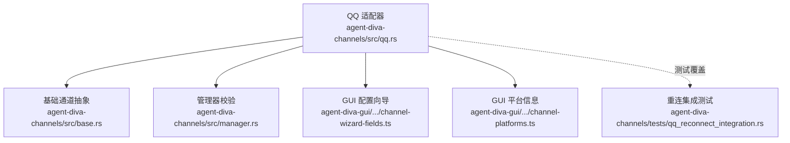
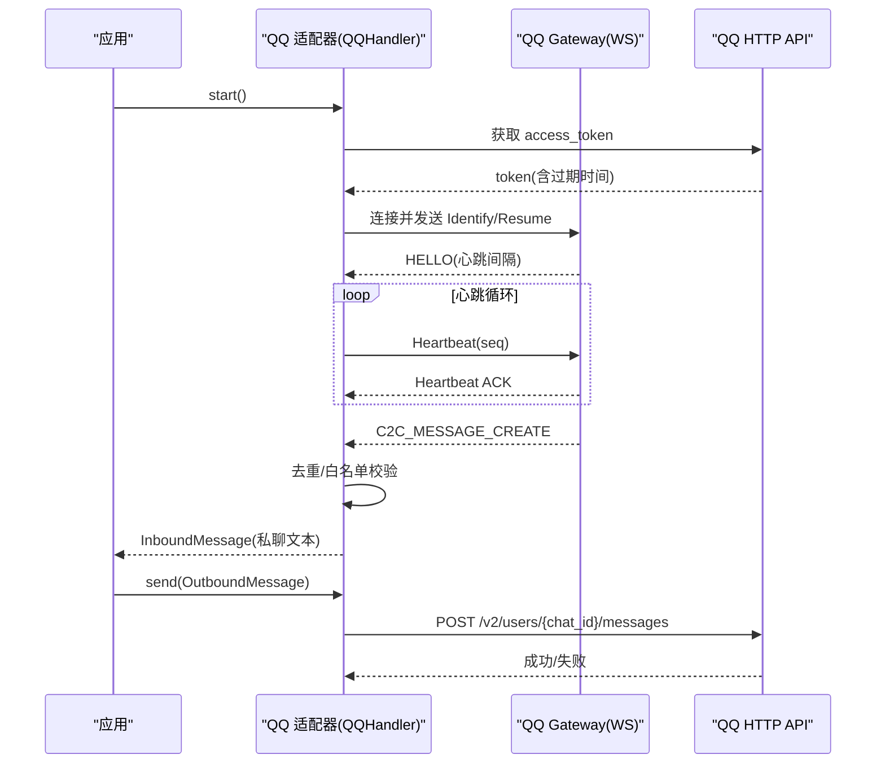
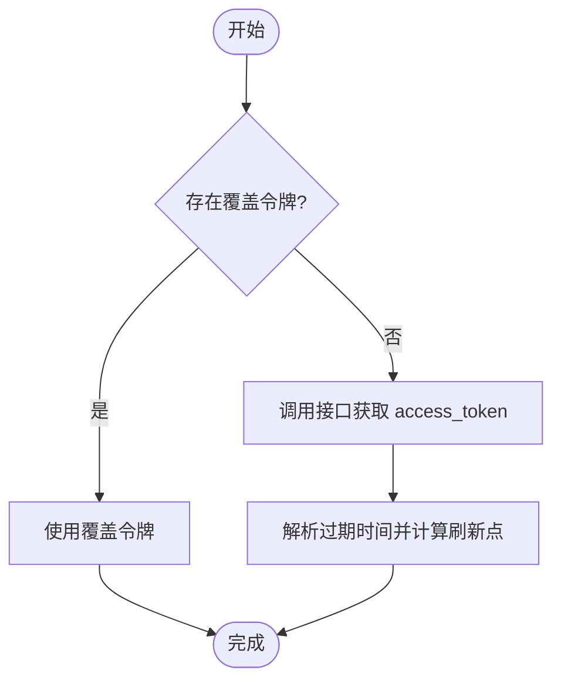
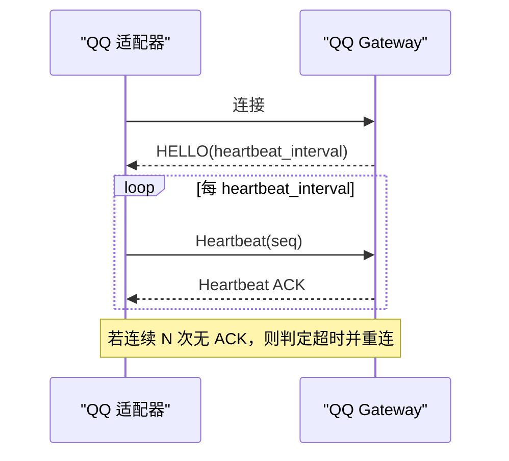
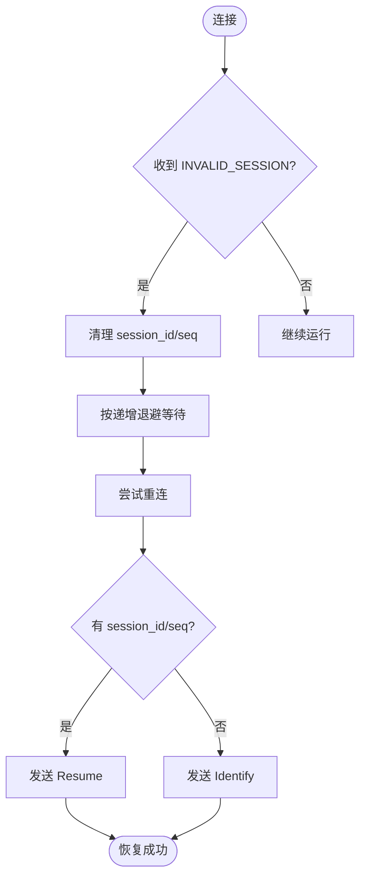
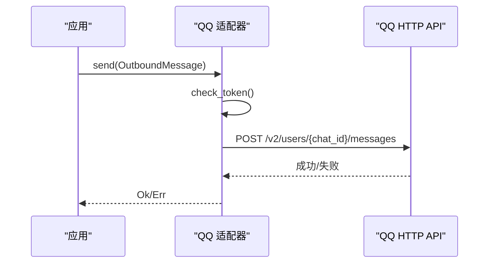
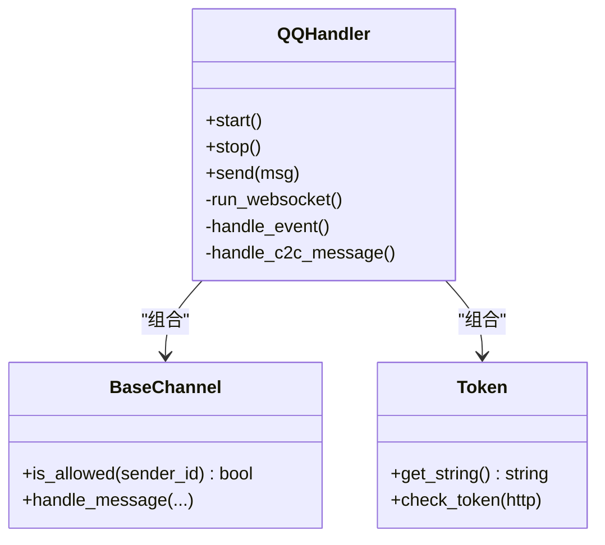

# QQ 平台实现

<cite>
**本文引用的文件**
- [qq.rs](file://agent-diva-channels/src/qq.rs)
- [base.rs](file://agent-diva-channels/src/base.rs)
- [qq_reconnect_integration.rs](file://agent-diva-channels/tests/qq_reconnect_integration.rs)
- [manager.rs](file://agent-diva-channels/src/manager.rs)
- [channel-platforms.ts](file://agent-diva-gui/src/components/settings/channel-platforms.ts)
- [channel-wizard-fields.ts](file://agent-diva-gui/src/components/settings/channel-wizard-fields.ts)
</cite>

## 目录
1. [简介](#简介)
2. [项目结构](#项目结构)
3. [核心组件](#核心组件)
4. [架构总览](#架构总览)
5. [详细组件分析](#详细组件分析)
6. [依赖关系分析](#依赖关系分析)
7. [性能考量](#性能考量)
8. [故障排除指南](#故障排除指南)
9. [结论](#结论)
10. [附录](#附录)

## 简介
本章节面向需要在 QQ 开放平台上接入机器人能力的开发者，系统性说明本项目中 QQ 通道适配器的实现与使用方式。内容覆盖：
- 连接与鉴权：基于 QQ 开放平台 WebSocket Gateway 的长连接、心跳保活、自动重连与会话恢复。
- 消息处理：仅支持 C2C（私聊）文本消息；群聊/@提及消息默认拒绝并丢弃，避免误用。
- 发送能力：通过 HTTP API 向用户私聊发送文本消息，支持回复上下文。
- 配置与安全：应用配置、Token 获取与刷新、允许列表访问控制、环境变量覆盖。
- 可靠性：断线恢复、心跳超时检测、无效会话退避与冷却策略。
- 测试与验证：集成测试覆盖重连、心跳、无效会话风暴等关键路径。

## 项目结构
QQ 通道实现位于 channels 模块，核心逻辑集中在单一适配器文件中，并通过基础通道抽象提供统一的生命周期与权限控制。GUI 侧提供了 QQ 平台的配置向导字段定义与快速引导步骤。



图表来源
- [qq.rs:1-1328](file://agent-diva-channels/src/qq.rs#L1-L1328)
- [base.rs:1-422](file://agent-diva-channels/src/base.rs#L1-L422)
- [manager.rs:113-119](file://agent-diva-channels/src/manager.rs#L113-L119)
- [channel-wizard-fields.ts:361-377](file://agent-diva-gui/src/components/settings/channel-wizard-fields.ts#L361-L377)
- [channel-platforms.ts:118-132](file://agent-diva-gui/src/components/settings/channel-platforms.ts#L118-L132)
- [qq_reconnect_integration.rs:1-809](file://agent-diva-channels/tests/qq_reconnect_integration.rs#L1-L809)

章节来源
- [qq.rs:1-1328](file://agent-diva-channels/src/qq.rs#L1-L1328)
- [base.rs:1-422](file://agent-diva-channels/src/base.rs#L1-L422)
- [manager.rs:113-119](file://agent-diva-channels/src/manager.rs#L113-L119)
- [channel-wizard-fields.ts:361-377](file://agent-diva-gui/src/components/settings/channel-wizard-fields.ts#L361-L377)
- [channel-platforms.ts:118-132](file://agent-diva-gui/src/components/settings/channel-platforms.ts#L118-L132)
- [qq_reconnect_integration.rs:1-809](file://agent-diva-channels/tests/qq_reconnect_integration.rs#L1-L809)

## 核心组件
- QQHandler：QQ 通道适配器主类，负责生命周期管理、WebSocket 连接、心跳、事件分发、消息去重、发送消息。
- Token：封装 QQ Bot 鉴权令牌，支持本地覆盖与环境变量注入，自动刷新过期时间。
- BaseChannel：通用通道基类，提供允许列表、入站消息投递、错误类型与工具方法。
- 集成测试：Mock Gateway 模拟服务端行为，验证重连、心跳、无效会话等场景。

章节来源
- [qq.rs:231-265](file://agent-diva-channels/src/qq.rs#L231-L265)
- [qq.rs:50-133](file://agent-diva-channels/src/qq.rs#L50-L133)
- [base.rs:73-229](file://agent-diva-channels/src/base.rs#L73-L229)
- [qq_reconnect_integration.rs:21-290](file://agent-diva-channels/tests/qq_reconnect_integration.rs#L21-L290)

## 架构总览
QQ 通道采用“WebSocket 接收 + HTTP 发送”的双通道模式：
- 接收：通过 QQ 开放平台 WebSocket Gateway 建立长连接，周期性发送心跳，解析事件流，将 C2C 私聊消息转换为内部 InboundMessage 并投递到总线。
- 发送：通过 HTTP API 向目标用户发送文本消息，携带 Authorization 与 X-Union-Appid 头。
- 鉴权：启动时获取 access_token，并在发送前检查是否过期；支持环境变量覆盖。
- 重连：根据服务端指令或异常退出原因进行指数退避式重连，支持会话恢复（resume）。



图表来源
- [qq.rs:979-1010](file://agent-diva-channels/src/qq.rs#L979-L1010)
- [qq.rs:50-133](file://agent-diva-channels/src/qq.rs#L50-L133)
- [qq.rs:429-750](file://agent-diva-channels/src/qq.rs#L429-L750)
- [qq.rs:1023-1074](file://agent-diva-channels/src/qq.rs#L1023-L1074)

## 详细组件分析

### 鉴权与 Token 管理
- 启动时调用接口获取 access_token，解析 expires_in 并设置过期时间（提前 60 秒刷新）。
- 支持环境变量 QQ_ACCESS_TOKEN_OVERRIDE 直接覆盖令牌，便于测试与调试。
- 所有出站请求均携带 Authorization 与 X-Union-Appid 头。



图表来源
- [qq.rs:50-133](file://agent-diva-channels/src/qq.rs#L50-L133)

章节来源
- [qq.rs:50-133](file://agent-diva-channels/src/qq.rs#L50-L133)

### WebSocket 连接与心跳
- 连接后读取 HELLO 中的 heartbeat_interval，按该间隔定时发送心跳。
- 收到服务端 Ping 立即回复 Pong，保证链路健康。
- 连续多次未收到 Heartbeat ACK 触发超时，进入重连流程。



图表来源
- [qq.rs:429-750](file://agent-diva-channels/src/qq.rs#L429-L750)

章节来源
- [qq.rs:429-750](file://agent-diva-channels/src/qq.rs#L429-L750)

### 重连与会话恢复
- 支持两种握手模式：Identify（首次）与 Resume（断线续传）。
- 当收到 INVALID_SESSION 或 RECONNECT 指令时，清理会话状态并按退避策略重连。
- 连续无效会话达到阈值进入冷却期，防止风暴式重连。



图表来源
- [qq.rs:681-700](file://agent-diva-channels/src/qq.rs#L681-L700)
- [qq.rs:752-846](file://agent-diva-channels/src/qq.rs#L752-L846)

章节来源
- [qq.rs:681-700](file://agent-diva-channels/src/qq.rs#L681-L700)
- [qq.rs:752-846](file://agent-diva-channels/src/qq.rs#L752-L846)

### 消息类型支持与格式转换
- 当前仅支持 C2C 私聊文本消息。
- 群聊/@提及消息（如 group_at_message_create、at_message_create、group_message_create）会被识别并拒绝，不会转发到总线。
- 入站消息会附加 message_id、timestamp 等元数据，便于追踪与去重。

```mermaid
flowchart TD
In(["收到事件"]) --> Type{"事件类型"}
Type --> |C2C_MESSAGE_CREATE| Parse["解析为私聊消息"]
Type --> |群/@事件| Reject["记录并拒绝(不转发)"]
Parse --> Dedup{"是否已处理?"}
Dedup --> |是| Drop["丢弃重复"]
Dedup --> |否| Allow{"是否在允许列表?"}
Allow --> |是| Forward["构造 InboundMessage 并投递"]
Allow --> |否| Block["拒绝访问"]
```

图表来源
- [qq.rs:848-962](file://agent-diva-channels/src/qq.rs#L848-L962)

章节来源
- [qq.rs:848-962](file://agent-diva-channels/src/qq.rs#L848-L962)

### 发送消息
- 通过 HTTP API 向用户私聊发送文本消息，支持 reply_to 上下文。
- 每次发送前检查 token 有效性，必要时刷新。
- 非 2xx 响应会返回具体错误信息。



图表来源
- [qq.rs:1023-1074](file://agent-diva-channels/src/qq.rs#L1023-L1074)

章节来源
- [qq.rs:1023-1074](file://agent-diva-channels/src/qq.rs#L1023-L1074)

### 权限与访问控制
- 基于 allow_from 列表进行白名单控制，空列表表示不限制（可配合 deny_by_default 调整默认策略）。
- 支持通配符匹配与复合 ID（如 user_openid|username）。
- 管理器在启动时会校验 QQ 通道必填字段（app_id、secret）。

章节来源
- [base.rs:121-184](file://agent-diva-channels/src/base.rs#L121-L184)
- [manager.rs:113-119](file://agent-diva-channels/src/manager.rs#L113-L119)

### GUI 配置与快速上手
- GUI 提供 QQ 平台配置向导字段：AppID、Secret、允许的用户 ID。
- 快速引导步骤包括访问 QQ 开放平台、创建机器人应用、获取凭证、配置权限与沙箱环境。

章节来源
- [channel-wizard-fields.ts:361-377](file://agent-diva-gui/src/components/settings/channel-wizard-fields.ts#L361-L377)
- [channel-platforms.ts:118-132](file://agent-diva-gui/src/components/settings/channel-platforms.ts#L118-L132)

## 依赖关系分析
- QQHandler 依赖 BaseChannel 提供统一的通道能力与权限控制。
- QQHandler 通过 HTTP 客户端与 QQ 开放平台交互，用于获取网关信息与发送消息。
- 集成测试通过 Mock Gateway 验证连接、心跳、重连等行为。



图表来源
- [qq.rs:231-265](file://agent-diva-channels/src/qq.rs#L231-L265)
- [base.rs:73-229](file://agent-diva-channels/src/base.rs#L73-L229)
- [qq.rs:50-133](file://agent-diva-channels/src/qq.rs#L50-L133)

章节来源
- [qq.rs:231-265](file://agent-diva-channels/src/qq.rs#L231-L265)
- [base.rs:73-229](file://agent-diva-channels/src/base.rs#L73-L229)
- [qq.rs:50-133](file://agent-diva-channels/src/qq.rs#L50-L133)

## 性能考量
- 心跳间隔来自服务端 HELLO，客户端据此设定定时器，避免频繁或过慢的心跳。
- 消息去重使用固定容量队列（默认 1000），超出时从队首淘汰，平衡内存与去重效果。
- 重连退避采用递增策略，并在连续无效会话达到阈值时进入冷却期，降低服务端压力。
- HTTP 客户端设置超时，避免阻塞。

章节来源
- [qq.rs:429-750](file://agent-diva-channels/src/qq.rs#L429-L750)
- [qq.rs:271-284](file://agent-diva-channels/src/qq.rs#L271-L284)
- [qq.rs:752-846](file://agent-diva-channels/src/qq.rs#L752-L846)

## 故障排除指南
- 网络问题
  - 现象：无法连接 Gateway 或频繁断开。
  - 排查：检查 QQ_GATEWAY_URL_OVERRIDE 与 QQ_API_BASE_OVERRIDE 是否正确；确认网络可达性；查看日志中的连接失败与写失败。
  - 参考：连接失败与写失败的处理路径。
  
- 心跳超时
  - 现象：长时间无 Heartbeat ACK，导致连接关闭。
  - 排查：确认服务端是否正常响应；检查客户端是否被防火墙拦截；观察连续丢失次数是否达到阈值。
  - 参考：心跳超时触发重连的逻辑。

- 无效会话风暴
  - 现象：反复收到 INVALID_SESSION，导致频繁重连。
  - 排查：检查 Token 是否有效；确认 app_id/secret 正确；观察退避与冷却是否生效。
  - 参考：无效会话退避与冷却策略。

- 消息丢失
  - 现象：同一消息重复或丢失。
  - 排查：确认消息去重队列是否正常工作；检查是否被允许列表过滤；核对 message_id 与 timestamp。
  - 参考：消息去重与白名单过滤逻辑。

- API 限流
  - 现象：发送消息失败或返回错误码。
  - 排查：关注 HTTP 响应状态与错误文本；适当降低发送频率；检查 Token 是否过期。
  - 参考：发送失败时的错误处理。

章节来源
- [qq.rs:429-750](file://agent-diva-channels/src/qq.rs#L429-L750)
- [qq.rs:752-846](file://agent-diva-channels/src/qq.rs#L752-L846)
- [qq.rs:1023-1074](file://agent-diva-channels/src/qq.rs#L1023-L1074)
- [qq.rs:271-284](file://agent-diva-channels/src/qq.rs#L271-L284)

## 结论
本实现以简洁可靠的 WebSocket 长连接与 HTTP API 组合，完成了 QQ 开放平台私聊消息的接入。其特点包括：
- 明确的鉴权与 Token 管理机制，支持覆盖与自动刷新。
- 健壮的重连与会话恢复，具备心跳超时检测与无效会话保护。
- 严格的消息类型边界：仅支持 C2C 私聊文本，群聊/@提及消息默认拒绝。
- 完善的测试覆盖，确保关键路径稳定。
在生产环境中，建议结合允许列表、监控日志与告警机制，保障通道稳定性与安全性。

## 附录

### 配置选项与环境变量
- 应用配置
  - enabled：是否启用 QQ 通道。
  - app_id：QQ 机器人应用 ID。
  - secret：QQ 机器人密钥。
  - allow_from：允许的用户 ID 列表（支持通配符与复合 ID）。
- 环境变量
  - QQ_ACCESS_TOKEN_OVERRIDE：覆盖 access_token，便于测试。
  - QQ_GATEWAY_URL_OVERRIDE：覆盖 Gateway 地址，便于本地联调。
  - QQ_API_BASE_OVERRIDE：覆盖 API 基础地址。
  - QQ_WS_TEST_RECONNECT_DELAY_MS：测试用重连延迟。
  - QQ_WS_TEST_INVALID_SESSION_BACKOFF_MS：测试用无效会话退避序列。
  - QQ_WS_TEST_INVALID_SESSION_COOLDOWN_MS：测试用无效会话冷却时长。

章节来源
- [manager.rs:113-119](file://agent-diva-channels/src/manager.rs#L113-L119)
- [qq.rs:79-133](file://agent-diva-channels/src/qq.rs#L79-L133)
- [qq.rs:368-417](file://agent-diva-channels/src/qq.rs#L368-L417)
- [channel-wizard-fields.ts:361-377](file://agent-diva-gui/src/components/settings/channel-wizard-fields.ts#L361-L377)

### 安全设置
- 最小权限原则：仅在 allow_from 中配置必要用户 ID。
- 敏感信息保护：secret 应作为机密配置；避免在日志中输出敏感字段。
- 网络隔离：生产环境建议使用内网或受控网络访问 QQ 开放平台。

章节来源
- [base.rs:121-184](file://agent-diva-channels/src/base.rs#L121-L184)

### 性能优化建议
- 合理设置 allow_from，减少无关消息处理。
- 监控心跳与重连指标，及时发现网络波动。
- 对高频场景考虑消息批处理与节流（由上层业务决定）。

[本节为通用指导，无需特定文件引用]