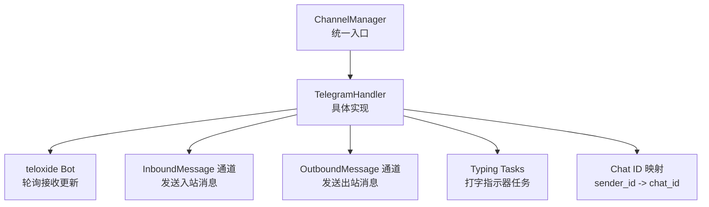
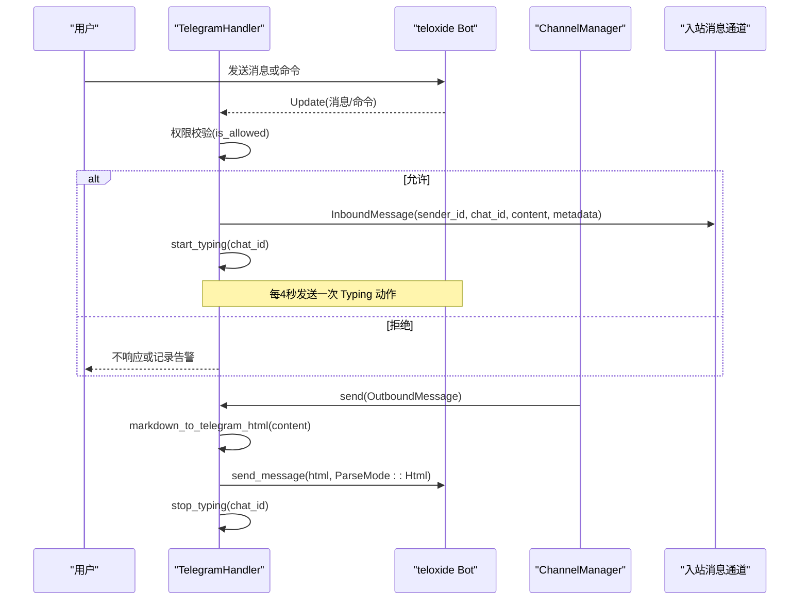
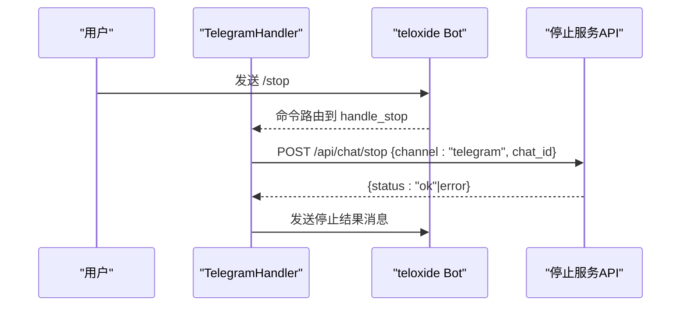
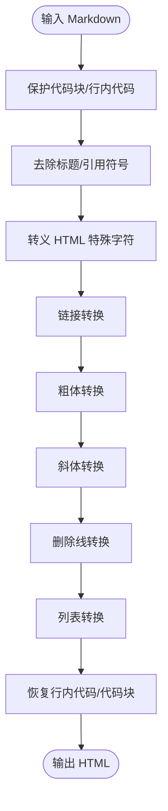
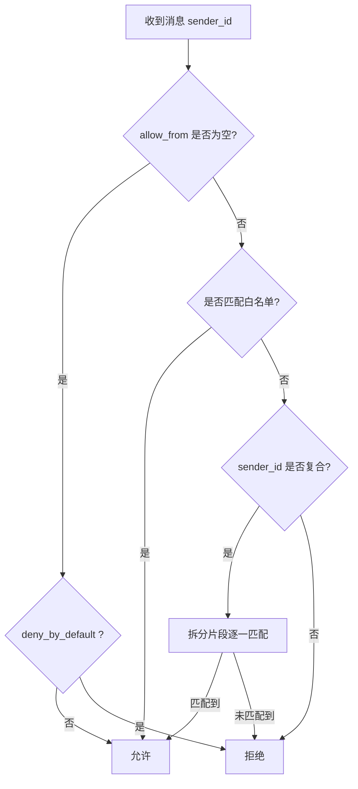
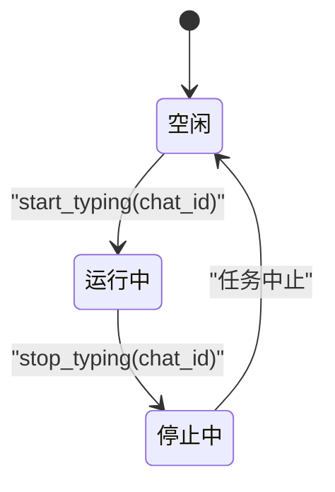
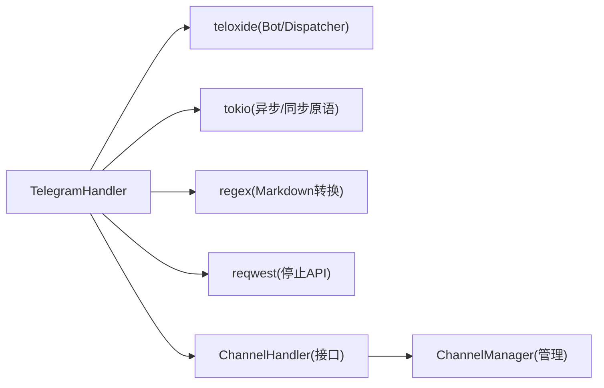

# Telegram 平台实现

<cite>
**本文引用的文件**
- [telegram.rs](file://agent-diva-channels/src/telegram.rs)
- [base.rs](file://agent-diva-channels/src/base.rs)
- [manager.rs](file://agent-diva-channels/src/manager.rs)
- [lib.rs](file://agent-diva-channels/src/lib.rs)
- [schema.rs](file://agent-diva-core/src/config/schema.rs)
</cite>

## 目录
1. [简介](#简介)
2. [项目结构](#项目结构)
3. [核心组件](#核心组件)
4. [架构总览](#架构总览)
5. [详细组件分析](#详细组件分析)
6. [依赖关系分析](#依赖关系分析)
7. [性能考虑](#性能考虑)
8. [故障排查指南](#故障排查指南)
9. [结论](#结论)

## 简介
本文件面向 agent-diva 的 Telegram 通道实现，系统性说明 TelegramHandler 的结构与行为：Bot 初始化、命令处理（/start、/reset、/help、/stop）、消息收发流程、Markdown 到 HTML 的转换逻辑、权限控制（allow_from 白名单）、打字指示器生命周期管理、配置项说明、错误处理策略、性能优化建议与常见问题排查。

## 项目结构
Telegram 通道位于 channels 子模块中，通过统一的 ChannelHandler 接口接入系统，并由 ChannelManager 负责生命周期管理与多通道编排。

图表来源
- [manager.rs:378-398](file://agent-diva-channels/src/manager.rs#L378-L398)
- [telegram.rs:415-682](file://agent-diva-channels/src/telegram.rs#L415-L682)

章节来源
- [lib.rs:9-50](file://agent-diva-channels/src/lib.rs#L9-L50)
- [manager.rs:378-398](file://agent-diva-channels/src/manager.rs#L378-L398)

## 核心组件
- TelegramHandler：实现 ChannelHandler 接口，封装 Telegram Bot 的启动、停止、消息收发、命令分发、权限校验、Markdown->HTML 转换、打字指示器等能力。
- ChannelHandler 基类与错误类型：定义统一接口与错误枚举，便于各通道复用通用逻辑。
- ChannelManager：根据配置初始化并启动各通道，提供 send、update_channel、list_channels 等管理能力。
- 配置结构：TelegramConfig 包含 enabled、token、allow_from、proxy 等字段。

章节来源
- [base.rs:9-71](file://agent-diva-channels/src/base.rs#L9-L71)
- [schema.rs:644-655](file://agent-diva-core/src/config/schema.rs#L644-L655)
- [manager.rs:222-232](file://agent-diva-channels/src/manager.rs#L222-L232)

## 架构总览
Telegram 通道采用“轮询模式”运行 Dispatcher，监听消息与命令；入站消息经权限校验后通过 mpsc 通道发送到上层总线；出站消息由 send 方法将 Markdown 转换为 Telegram HTML 后调用 API 发送。

图表来源
- [telegram.rs:469-675](file://agent-diva-channels/src/telegram.rs#L469-L675)
- [telegram.rs:711-749](file://agent-diva-channels/src/telegram.rs#L711-L749)
- [manager.rs:688-697](file://agent-diva-channels/src/manager.rs#L688-L697)

## 详细组件分析

### TelegramHandler 结构与职责
- 字段
  - name/token/allow_from/proxy：通道标识、认证令牌、访问白名单、可选代理地址。
  - bot：当前 Bot 实例。
  - running：运行状态。
  - inbound_tx：入站消息发送端。
  - dispatcher_handle：Dispatcher 后台任务句柄。
  - chat_ids：sender_id 到 chat_id 的映射表。
  - typing_tasks：每个 chat_id 对应的打字指示器任务集合。
- 关键方法
  - new：从配置构造处理器。
  - set_inbound_sender：注入入站通道。
  - is_allowed：基于 allow_from 的权限判断，支持复合 sender_id（如 user_id|username）。
  - markdown_to_telegram_html：Markdown 到 Telegram HTML 的转换器。
  - handle_text_message/handle_start/handle_reset/handle_help/handle_stop：消息与命令处理。
  - start/stop：启动/停止 Dispatcher 与打字任务。
  - send：出站消息发送，含 Markdown->HTML 转换与失败回退。

章节来源
- [telegram.rs:18-59](file://agent-diva-channels/src/telegram.rs#L18-L59)
- [telegram.rs:108-149](file://agent-diva-channels/src/telegram.rs#L108-L149)
- [telegram.rs:245-331](file://agent-diva-channels/src/telegram.rs#L245-L331)
- [telegram.rs:333-374](file://agent-diva-channels/src/telegram.rs#L333-L374)
- [telegram.rs:376-403](file://agent-diva-channels/src/telegram.rs#L376-L403)
- [telegram.rs:415-709](file://agent-diva-channels/src/telegram.rs#L415-L709)
- [telegram.rs:711-758](file://agent-diva-channels/src/telegram.rs#L711-L758)

### Bot 初始化与命令菜单
- 启动时创建 Bot 实例，设置命令菜单（/start、/reset、/stop、/help），获取机器人信息并记录日志。
- 使用 teloxide 的 Dispatcher 注册分支：
  - 命令分支：按 Command 枚举分发到对应处理方法。
  - 文本消息分支：权限校验、存储 chat_id、内容提取、启动打字指示器、发送入站消息。

章节来源
- [telegram.rs:415-458](file://agent-diva-channels/src/telegram.rs#L415-L458)
- [telegram.rs:469-549](file://agent-diva-channels/src/telegram.rs#L469-L549)
- [telegram.rs:550-675](file://agent-diva-channels/src/telegram.rs#L550-L675)

### 命令处理（/start、/reset、/help、/stop）
- /start：欢迎消息，提示可用命令。
- /reset：提示对话历史已清除。
- /help：返回 HTML 格式的命令帮助。
- /stop：通过本地 HTTP API 请求停止当前生成，并反馈结果。

图表来源
- [telegram.rs:62-106](file://agent-diva-channels/src/telegram.rs#L62-L106)
- [telegram.rs:528-544](file://agent-diva-channels/src/telegram.rs#L528-L544)

章节来源
- [telegram.rs:333-374](file://agent-diva-channels/src/telegram.rs#L333-L374)
- [telegram.rs:62-106](file://agent-diva-channels/src/telegram.rs#L62-L106)

### 消息收发机制
- 入站消息
  - 解析 from/chat，构建 sender_id（支持 user_id|username 复合键）。
  - 权限校验：allow_from 为空则默认放行；否则匹配精确或复合键。
  - 存储 chat_id 映射，启动打字指示器，构造 InboundMessage 并发送。
- 出站消息
  - 解析 chat_id，停止该 chat 的打字指示器。
  - Markdown->HTML 转换，调用 send_message 发送；若 HTML 解析失败，回退为纯文本发送。

章节来源
- [telegram.rs:245-331](file://agent-diva-channels/src/telegram.rs#L245-L331)
- [telegram.rs:550-675](file://agent-diva-channels/src/telegram.rs#L550-L675)
- [telegram.rs:711-749](file://agent-diva-channels/src/telegram.rs#L711-L749)

### Markdown 到 HTML 转换逻辑
- 保护代码块与行内代码，避免后续正则误替换。
- 去除标题与引用符号，仅保留正文。
- 转义 HTML 特殊字符，防止注入。
- 链接、粗体、斜体、删除线、无序列表等格式转换。
- 恢复行内代码与代码块，并对内容进行安全转义。
- 最终输出 Telegram HTML 字符串，供 send_message 使用。

图表来源
- [telegram.rs:151-243](file://agent-diva-channels/src/telegram.rs#L151-L243)

章节来源
- [telegram.rs:151-243](file://agent-diva-channels/src/telegram.rs#L151-L243)

### 权限控制机制（allow_from 与白名单验证）
- TelegramHandler::is_allowed
  - 若 allow_from 为空，默认允许所有发送者。
  - 支持复合 sender_id（user_id|username），任一片段在白名单即放行。
- BaseChannel::is_allowed（通用实现）
  - 支持空列表时的 deny_by_default 策略。
  - 支持通配符匹配（如 *@domain）。
  - 对复合 ID 进行片段拆分与匹配。

图表来源
- [telegram.rs:129-149](file://agent-diva-channels/src/telegram.rs#L129-L149)
- [base.rs:121-184](file://agent-diva-channels/src/base.rs#L121-L184)

章节来源
- [telegram.rs:129-149](file://agent-diva-channels/src/telegram.rs#L129-L149)
- [base.rs:121-184](file://agent-diva-channels/src/base.rs#L121-L184)

### 打字指示器的实现原理与生命周期管理
- 启动：每次收到消息时，先取消同 chat_id 的旧任务，再启动新任务循环，每 4 秒发送一次 ChatAction::Typing。
- 停止：在发送出站消息前或通道停止时，终止对应 chat_id 的任务。
- 并发安全：使用 Mutex<HashMap<i64, JoinHandle>> 管理任务，避免重复与泄漏。

图表来源
- [telegram.rs:376-403](file://agent-diva-channels/src/telegram.rs#L376-L403)
- [telegram.rs:623-643](file://agent-diva-channels/src/telegram.rs#L623-L643)
- [telegram.rs:684-709](file://agent-diva-channels/src/telegram.rs#L684-L709)

章节来源
- [telegram.rs:376-403](file://agent-diva-channels/src/telegram.rs#L376-L403)
- [telegram.rs:623-643](file://agent-diva-channels/src/telegram.rs#L623-L643)
- [telegram.rs:684-709](file://agent-diva-channels/src/telegram.rs#L684-L709)

### 配置选项说明
- TelegramConfig
  - enabled：是否启用 Telegram 通道。
  - token：Bot Token。
  - allow_from：允许的用户/群组白名单，支持复合键与通配符（结合 BaseChannel）。
  - proxy：可选代理地址（预留字段）。

章节来源
- [schema.rs:644-655](file://agent-diva-core/src/config/schema.rs#L644-L655)
- [manager.rs:59-64](file://agent-diva-channels/src/manager.rs#L59-L64)

### 错误处理策略
- 通道错误枚举：NotConfigured、NotRunning、InvalidConfig、ApiError、SendError、ConnectionFailed、ConnectionError、AuthError、SendFailed、AccessDenied。
- 常见场景
  - 未配置 token：启动时报 NotConfigured。
  - 未运行：send 报 NotRunning。
  - API 错误：包装为 ApiError。
  - 发送失败：尝试 HTML 失败后回退为纯文本，仍失败则上报 SendError。
  - 权限拒绝：AccessDenied。

章节来源
- [base.rs:34-71](file://agent-diva-channels/src/base.rs#L34-L71)
- [telegram.rs:415-458](file://agent-diva-channels/src/telegram.rs#L415-L458)
- [telegram.rs:711-749](file://agent-diva-channels/src/telegram.rs#L711-L749)

## 依赖关系分析
- TelegramHandler 依赖 teloxide 的 Bot、Dispatcher、UpdateFilterExt、types、utils/command。
- 通过 ChannelHandler 接口与 ChannelManager 集成。
- 使用 tokio 异步运行时与同步原语（Mutex/RwLock）管理并发状态。
- 使用 regex 进行 Markdown 转换。
- 使用 reqwest 调用本地停止 API。

图表来源
- [telegram.rs:1-17](file://agent-diva-channels/src/telegram.rs#L1-L17)
- [manager.rs:1-28](file://agent-diva-channels/src/manager.rs#L1-L28)

章节来源
- [telegram.rs:1-17](file://agent-diva-channels/src/telegram.rs#L1-L17)
- [manager.rs:1-28](file://agent-diva-channels/src/manager.rs#L1-L28)

## 性能考虑
- 打字指示器
  - 固定 4 秒间隔，避免频繁 API 调用；确保在发送出站消息前及时停止，减少无效任务。
- Markdown 转换
  - 使用正则批量替换，注意代码块与行内代码的保护与恢复，避免二次处理开销。
- 并发与锁
  - 使用 RwLock 管理 chat_ids，Mutex 管理 typing_tasks，降低竞争。
- 网络与代理
  - 预留 proxy 字段，可在未来扩展 teloxide Client 以支持代理，缓解网络限制。
- 错误回退
  - HTML 解析失败自动降级为纯文本，提高鲁棒性。

[本节为通用指导，无需特定文件来源]

## 故障排查指南
- 连接问题
  - 检查 token 是否正确配置；启动时 get_me 失败会返回 ApiError。
  - 确认网络可达 Telegram API；必要时配置代理。
- API 限制
  - 频繁发送消息可能触发速率限制；合理控制频率，利用打字指示器提升体验。
- 权限问题
  - 若 allow_from 非空且未包含 sender_id，消息将被拒绝；检查白名单格式与复合键。
- 停止命令失败
  - /stop 依赖本地 HTTP API；确认服务端口与路径可访问；查看错误日志定位原因。
- Markdown 渲染异常
  - 若 HTML 解析失败，会自动回退为纯文本；检查 Markdown 语法是否符合预期。

章节来源
- [telegram.rs:415-458](file://agent-diva-channels/src/telegram.rs#L415-L458)
- [telegram.rs:62-106](file://agent-diva-channels/src/telegram.rs#L62-L106)
- [telegram.rs:711-749](file://agent-diva-channels/src/telegram.rs#L711-L749)
- [base.rs:121-184](file://agent-diva-channels/src/base.rs#L121-L184)

## 结论
Telegram 通道实现了完整的 Bot 生命周期管理、命令处理、消息收发、Markdown->HTML 转换、权限控制与打字指示器机制。通过 ChannelHandler 接口与 ChannelManager 的统一编排，具备良好的可扩展性与可维护性。建议在部署时严格配置 allow_from，关注 API 限流与网络代理，并结合日志快速定位问题。

[本节为总结，无需特定文件来源]