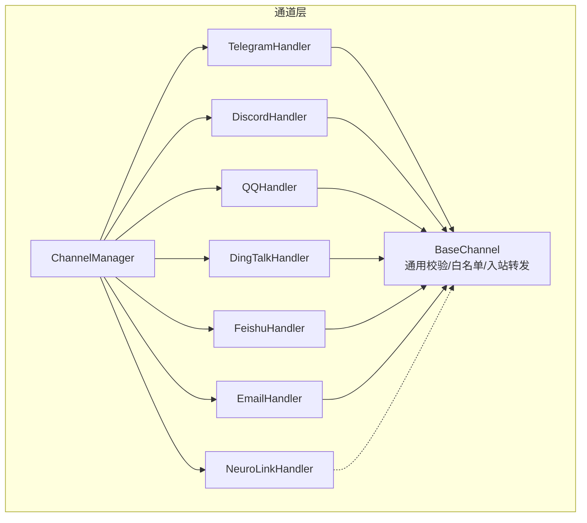
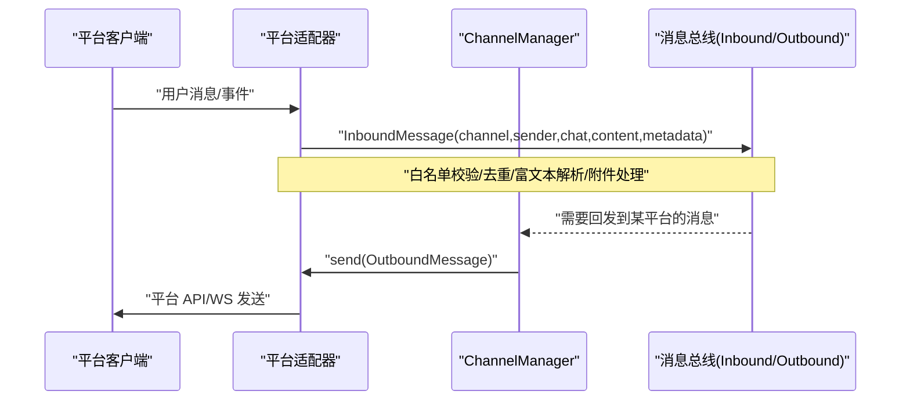
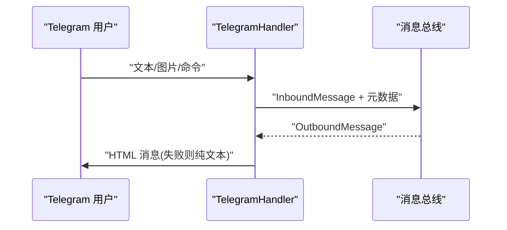
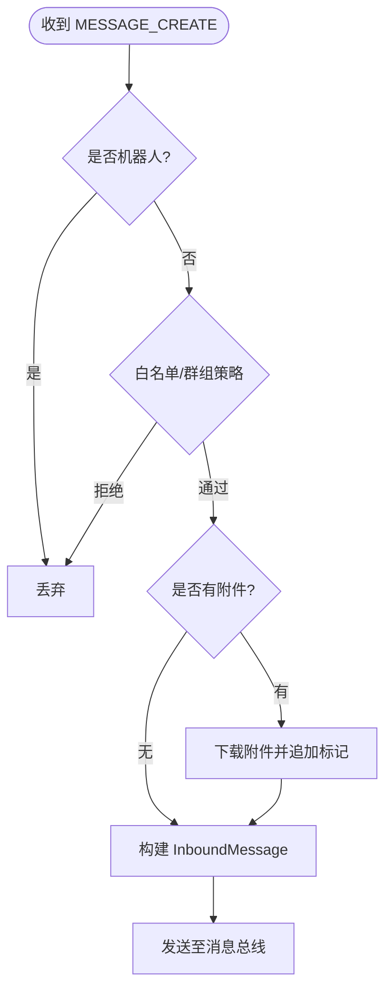
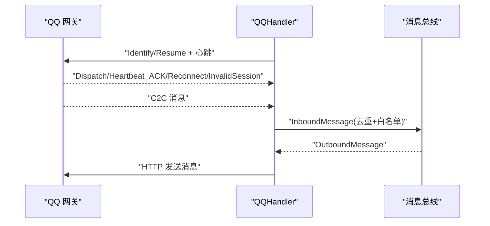
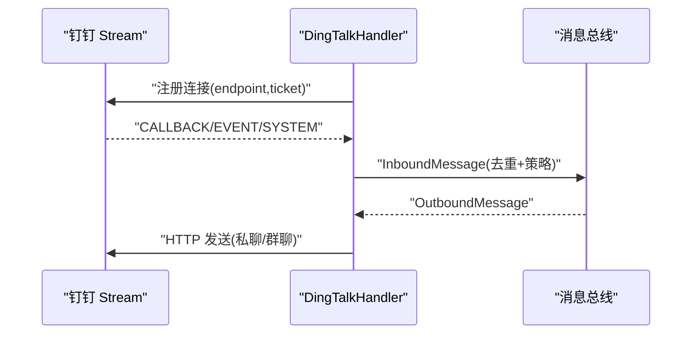
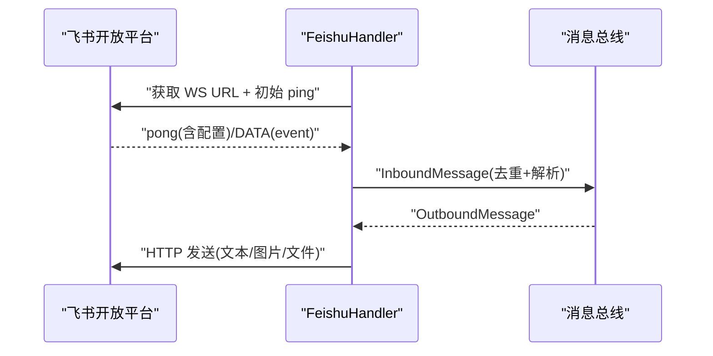
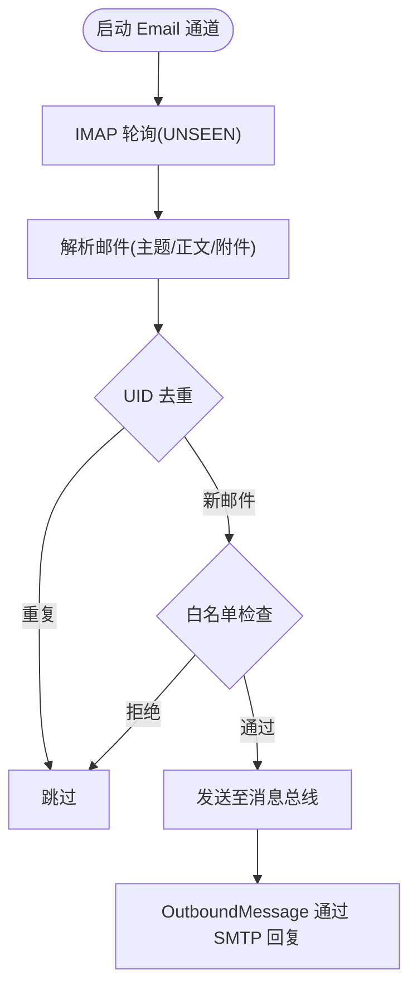
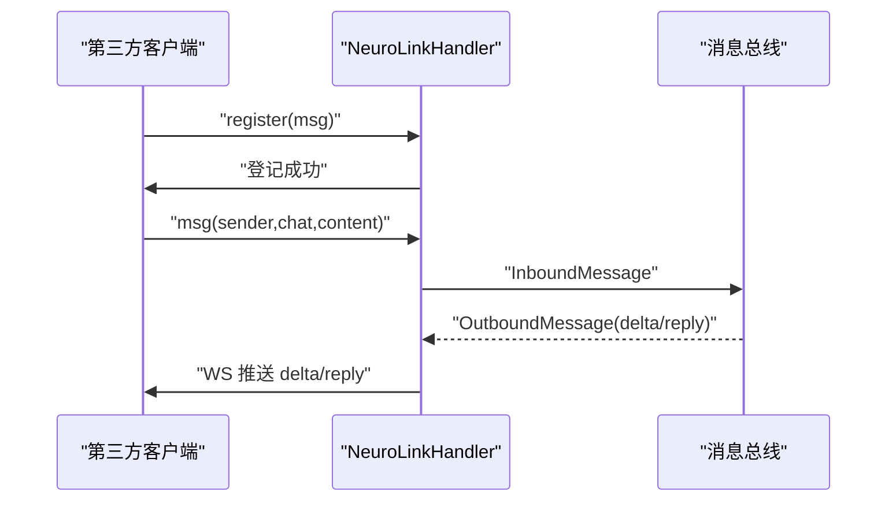
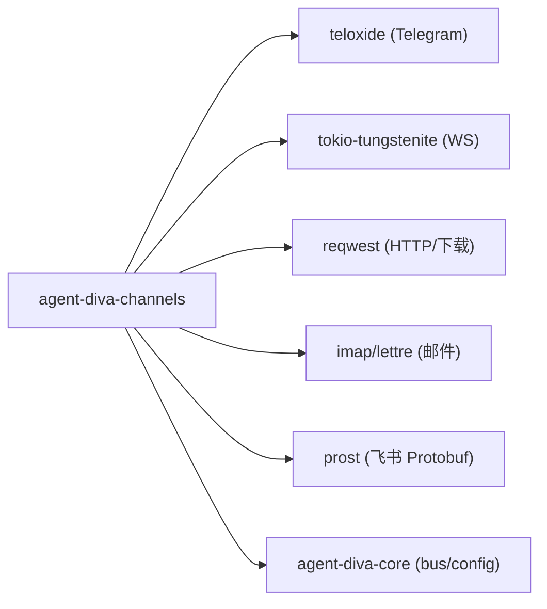

# 平台实现

<cite>
**本文引用的文件**
- [agent-diva-channels/src/lib.rs](file://agent-diva-channels/src/lib.rs)
- [agent-diva-channels/src/base.rs](file://agent-diva-channels/src/base.rs)
- [agent-diva-channels/src/manager.rs](file://agent-diva-channels/src/manager.rs)
- [agent-diva-channels/Cargo.toml](file://agent-diva-channels/Cargo.toml)
- [agent-diva-channels/src/telegram.rs](file://agent-diva-channels/src/telegram.rs)
- [agent-diva-channels/src/discord.rs](file://agent-diva-channels/src/discord.rs)
- [agent-diva-channels/src/qq.rs](file://agent-diva-channels/src/qq.rs)
- [agent-diva-channels/src/dingtalk.rs](file://agent-diva-channels/src/dingtalk.rs)
- [agent-diva-channels/src/feishu.rs](file://agent-diva-channels/src/feishu.rs)
- [agent-diva-channels/src/email.rs](file://agent-diva-channels/src/email.rs)
- [agent-diva-channels/src/neuro_link.rs](file://agent-diva-channels/src/neuro_link.rs)
</cite>

## 目录
1. [简介](#简介)
2. [项目结构](#项目结构)
3. [核心组件](#核心组件)
4. [架构总览](#架构总览)
5. [详细组件分析](#详细组件分析)
6. [依赖关系分析](#依赖关系分析)
7. [性能考量](#性能考量)
8. [故障排查指南](#故障排查指南)
9. [结论](#结论)
10. [附录](#附录)

## 简介
本文件为 agent-diva 的“各聊天平台适配器”综合文档，覆盖 Telegram Bot、Discord Bot、QQ 机器人、钉钉机器人、飞书、邮件、神经链接（Neuro-Link）等通道。内容聚焦：
- 认证方式与连接模式（HTTP/WebSocket/IMAP/SMTP/本地 WS 服务器）
- 消息格式映射（入站/出站、富文本、附件、引用回复）
- 特殊能力（打字指示、速率限制、去重、分片重组、心跳保活）
- 配置项、限制与最佳实践
- 常见问题与排障建议

## 项目结构
channels 子模块提供统一的 ChannelHandler 抽象与 ChannelManager 编排，各平台以独立文件实现具体适配逻辑。默认编译包含 telegram、discord、dingtalk、feishu、email、neuro-link、qq；其余通道通过 feature 开关启用。

图表来源
- [agent-diva-channels/src/manager.rs:361-642](file://agent-diva-channels/src/manager.rs#L361-L642)
- [agent-diva-channels/src/base.rs:73-229](file://agent-diva-channels/src/base.rs#L73-L229)

章节来源
- [agent-diva-channels/src/lib.rs:1-53](file://agent-diva-channels/src/lib.rs#L1-L53)
- [agent-diva-channels/Cargo.toml:11-20](file://agent-diva-channels/Cargo.toml#L11-L20)

## 核心组件
- ChannelHandler 接口：统一 name/start/stop/send/is_allowed/set_inbound_sender 生命周期与消息收发契约。
- BaseChannel：提供 allow_from 白名单策略（支持通配匹配）、入站消息封装与发送、会话键/主机校验工具。
- ChannelManager：按配置初始化并启动各通道，集中管理运行状态、动态更新与路由发送。

关键要点
- 入站消息经 BaseChannel.handle_message 或各通道自行构造 InboundMessage，统一注入 channel/sender/chat/content/metadata。
- 出站消息通过 ChannelManager.send 分发到对应 handler.send。
- 错误类型 ChannelError 覆盖未配置、未运行、API/发送/鉴权/连接等场景。

章节来源
- [agent-diva-channels/src/base.rs:9-71](file://agent-diva-channels/src/base.rs#L9-L71)
- [agent-diva-channels/src/base.rs:73-229](file://agent-diva-channels/src/base.rs#L73-L229)
- [agent-diva-channels/src/manager.rs:30-56](file://agent-diva-channels/src/manager.rs#L30-L56)

## 架构总览
下图展示从平台到总线（bus）的入站流，以及从总线到平台的出站流。

图表来源
- [agent-diva-channels/src/manager.rs:688-697](file://agent-diva-channels/src/manager.rs#L688-L697)
- [agent-diva-channels/src/base.rs:186-229](file://agent-diva-channels/src/base.rs#L186-L229)

## 详细组件分析

### Telegram Bot
- 认证与连接
  - 使用 Bot Token，基于 teloxide 轮询模式启动 Dispatcher。
  - 支持 /start、/reset、/help、/stop 命令；/stop 调用本地停止接口。
- 消息格式映射
  - Markdown → Telegram HTML（粗体、斜体、代码块、链接、列表等）。
  - 入站携带 message_id、user_id、first_name、is_group 等元数据。
- 特殊功能
  - 打字指示器（周期性 ChatAction Typing）。
  - 允许列表 allow_from（支持复合 ID 如 user_id|username）。
- 配置与限制
  - 必填 token；可选 proxy。
  - 群聊/私聊均支持；长文本直接发送，HTML 失败自动降级纯文本。
- 最佳实践
  - 在 allow_from 中限定可访问用户或群组。
  - 合理使用 /stop 控制生成任务。

图表来源
- [agent-diva-channels/src/telegram.rs:415-682](file://agent-diva-channels/src/telegram.rs#L415-L682)
- [agent-diva-channels/src/telegram.rs:711-749](file://agent-diva-channels/src/telegram.rs#L711-L749)

章节来源
- [agent-diva-channels/src/telegram.rs:18-59](file://agent-diva-channels/src/telegram.rs#L18-L59)
- [agent-diva-channels/src/telegram.rs:151-243](file://agent-diva-channels/src/telegram.rs#L151-L243)
- [agent-diva-channels/src/telegram.rs:245-331](file://agent-diva-channels/src/telegram.rs#L245-L331)
- [agent-diva-channels/src/telegram.rs:333-403](file://agent-diva-channels/src/telegram.rs#L333-L403)
- [agent-diva-channels/src/telegram.rs:415-682](file://agent-diva-channels/src/telegram.rs#L415-L682)
- [agent-diva-channels/src/telegram.rs:711-749](file://agent-diva-channels/src/telegram.rs#L711-L749)

### Discord Bot
- 认证与连接
  - 通过 Gateway WebSocket 实时接收消息；REST 发送消息。
  - 支持 intents、mention_only、guild_id 过滤、监听机器人消息开关。
- 消息格式映射
  - 入站：提取 content、attachments（下载后以路径标记附加），reply_to。
  - 出站：超过 2000 字符自动分段；支持 reply_to 与 @提及清理。
- 特殊功能
  - 打字指示（POST typing）。
  - 速率限制重试（读取 retry-after）。
  - 白名单 allow_from（复用 BaseChannel）。
- 配置与限制
  - 必填 token；可选 gateway_url、intents、group_reply_allowed_sender_ids。
  - 附件上限 20MB。
- 最佳实践
  - 在群组中开启 mention_only 减少误触发；合理设置 intents。

图表来源
- [agent-diva-channels/src/discord.rs:335-442](file://agent-diva-channels/src/discord.rs#L335-L442)
- [agent-diva-channels/src/discord.rs:240-278](file://agent-diva-channels/src/discord.rs#L240-L278)

章节来源
- [agent-diva-channels/src/discord.rs:113-135](file://agent-diva-channels/src/discord.rs#L113-L135)
- [agent-diva-channels/src/discord.rs:296-318](file://agent-diva-channels/src/discord.rs#L296-L318)
- [agent-diva-channels/src/discord.rs:497-696](file://agent-diva-channels/src/discord.rs#L497-L696)
- [agent-diva-channels/src/discord.rs:698-749](file://agent-diva-channels/src/discord.rs#L698-L749)

### QQ 机器人
- 认证与连接
  - 通过 OpenAPI 获取 access_token（支持环境变量覆盖）；WebSocket Gateway 长连接。
  - Identify/Resume 双模式；心跳 ACK 超时检测；Invalid Session 退避与冷却。
- 消息格式映射
  - C2C 私聊消息；去重缓存最近 1000 条消息 ID。
  - 入站携带 sender/openid、conversation_id、msg_id 等。
- 特殊功能
  - 断线重连指数退避；无效会话冷却；心跳容差。
- 配置与限制
  - 必填 app_id、secret；可选 QQ_API_BASE_OVERRIDE、QQ_GATEWAY_URL_OVERRIDE。
  - 支持 allow_from 白名单。
- 最佳实践
  - 合理设置心跳间隔与超时；监控 invalid session 次数。

图表来源
- [agent-diva-channels/src/qq.rs:79-132](file://agent-diva-channels/src/qq.rs#L79-L132)
- [agent-diva-channels/src/qq.rs:429-750](file://agent-diva-channels/src/qq.rs#L429-L750)

章节来源
- [agent-diva-channels/src/qq.rs:231-265](file://agent-diva-channels/src/qq.rs#L231-L265)
- [agent-diva-channels/src/qq.rs:271-284](file://agent-diva-channels/src/qq.rs#L271-L284)
- [agent-diva-channels/src/qq.rs:301-366](file://agent-diva-channels/src/qq.rs#L301-L366)
- [agent-diva-channels/src/qq.rs:429-750](file://agent-diva-channels/src/qq.rs#L429-L750)

### 钉钉机器人
- 认证与连接
  - Stream 模式：HTTP 注册连接获取 endpoint/ticket，再建立 WebSocket。
  - 通过 client_id/client_secret 获取 access_token（带过期时间缓存）。
- 消息格式映射
  - 支持私聊与群聊；Markdown 文本；媒体上传（图片/语音/视频/文件）。
  - 入站携带 conversation_id、sender_staff_id/user_id、msg_id 等。
- 特殊功能
  - 消息去重（最近 1000 条）；白名单策略 dm_policy/group_policy。
  - 自动 ACK 防止无限重试。
- 配置与限制
  - 必填 client_id、client_secret；可选 robot_code、dm_policy、group_policy。
  - 媒体上传走 oapi.dingtalk.com/media/upload。
- 最佳实践
  - 群聊建议使用 group_policy=allowlist；私聊 dm_policy=allowlist 提高安全性。

图表来源
- [agent-diva-channels/src/dingtalk.rs:274-323](file://agent-diva-channels/src/dingtalk.rs#L274-L323)
- [agent-diva-channels/src/dingtalk.rs:529-667](file://agent-diva-channels/src/dingtalk.rs#L529-L667)
- [agent-diva-channels/src/dingtalk.rs:669-777](file://agent-diva-channels/src/dingtalk.rs#L669-L777)

章节来源
- [agent-diva-channels/src/dingtalk.rs:154-187](file://agent-diva-channels/src/dingtalk.rs#L154-L187)
- [agent-diva-channels/src/dingtalk.rs:224-272](file://agent-diva-channels/src/dingtalk.rs#L224-L272)
- [agent-diva-channels/src/dingtalk.rs:348-516](file://agent-diva-channels/src/dingtalk.rs#L348-L516)
- [agent-diva-channels/src/dingtalk.rs:529-667](file://agent-diva-channels/src/dingtalk.rs#L529-L667)
- [agent-diva-channels/src/dingtalk.rs:669-777](file://agent-diva-channels/src/dingtalk.rs#L669-L777)

### 飞书（Feishu/Lark）
- 认证与连接
  - 通过 HTTP 获取 tenant_access_token；WebSocket 长连接使用 protobuf 帧（pbbp2.proto）。
  - 服务端下发 ping_interval，客户端定时 ping；心跳超时自动重连。
- 消息格式映射
  - 事件 im.message.receive_v1；支持文本、图片（下载为 data URI 标记）、音视频/文件占位。
  - 支持分片重组（sum/seq）；立即 ACK 保证可靠性。
- 特殊功能
  - 事件去重（event_id/message_id，TTL 清理）。
  - 自动添加点赞反应表示已读。
- 配置与限制
  - 必填 app_id、app_secret；支持 allow_from。
  - 图片资源通过 /im/v1/messages/{id}/resources/{key} 下载。
- 最佳实践
  - 合理设置心跳超时；关注分片完整性；对非文本类型做占位提示。

图表来源
- [agent-diva-channels/src/feishu.rs:277-371](file://agent-diva-channels/src/feishu.rs#L277-L371)
- [agent-diva-channels/src/feishu.rs:373-591](file://agent-diva-channels/src/feishu.rs#L373-L591)
- [agent-diva-channels/src/feishu.rs:593-708](file://agent-diva-channels/src/feishu.rs#L593-L708)

章节来源
- [agent-diva-channels/src/feishu.rs:177-214](file://agent-diva-channels/src/feishu.rs#L177-L214)
- [agent-diva-channels/src/feishu.rs:221-260](file://agent-diva-channels/src/feishu.rs#L221-L260)
- [agent-diva-channels/src/feishu.rs:373-591](file://agent-diva-channels/src/feishu.rs#L373-L591)
- [agent-diva-channels/src/feishu.rs:593-708](file://agent-diva-channels/src/feishu.rs#L593-L708)
- [agent-diva-channels/src/feishu.rs:710-772](file://agent-diva-channels/src/feishu.rs#L710-L772)

### 邮件（Email）
- 认证与连接
  - IMAP 轮询收件箱（阻塞 I/O 包裹于 spawn_blocking）；SMTP 发送回复。
  - 支持 SSL/TLS/StartTLS 多种 SMTP 传输模式。
- 消息格式映射
  - 入站：解析发件人、主题、Message-ID、日期、正文（HTML→纯文本）。
  - 出站：自动 Re: 主题；支持附件与 HTML 格式；自动填充 In-Reply-To/References。
- 特殊功能
  - 去重：记录已处理 UID；可配置标记已读。
  - 安全：需 consent_granted=true 才启用；auto_reply_enabled 控制自动回复。
- 配置与限制
  - 必填 imap_host/username/password、smtp_host/username/password、from_address。
  - 可选 subject_prefix、poll_interval_seconds、max_body_chars、mark_seen。
- 最佳实践
  - 合理设置 poll 间隔；避免频繁轮询；谨慎开启 auto_reply。

图表来源
- [agent-diva-channels/src/email.rs:177-291](file://agent-diva-channels/src/email.rs#L177-L291)
- [agent-diva-channels/src/email.rs:307-410](file://agent-diva-channels/src/email.rs#L307-L410)
- [agent-diva-channels/src/email.rs:428-558](file://agent-diva-channels/src/email.rs#L428-L558)
- [agent-diva-channels/src/email.rs:573-689](file://agent-diva-channels/src/email.rs#L573-L689)

章节来源
- [agent-diva-channels/src/email.rs:30-58](file://agent-diva-channels/src/email.rs#L30-L58)
- [agent-diva-channels/src/email.rs:60-91](file://agent-diva-channels/src/email.rs#L60-L91)
- [agent-diva-channels/src/email.rs:129-175](file://agent-diva-channels/src/email.rs#L129-L175)
- [agent-diva-channels/src/email.rs:177-291](file://agent-diva-channels/src/email.rs#L177-L291)
- [agent-diva-channels/src/email.rs:307-410](file://agent-diva-channels/src/email.rs#L307-L410)
- [agent-diva-channels/src/email.rs:428-558](file://agent-diva-channels/src/email.rs#L428-L558)
- [agent-diva-channels/src/email.rs:573-689](file://agent-diva-channels/src/email.rs#L573-L689)

### 神经链接（Neuro-Link）
- 角色定位
  - 本地 WebSocket 服务器，供第三方管道集成（如虚拟形象 OLV）接入。
  - 仅绑定 localhost（127.0.0.1/localhost），禁止暴露到公网。
- 协议
  - 入站：{"pipe":"msg","id","sender","chat","content","meta"}
  - 出站：{"pipe":"delta|reply","id","reply_to","chat","content","meta"}
- 功能
  - 连接注册（register）绑定 chat；消息白名单 allow_from。
  - 支持 send_delta 推送增量响应。
- 配置与限制
  - host/port/allow_from；必须 localhost 绑定。
- 最佳实践
  - 严格 restrict 到本机；配合 allow_from 精确控制接入方。

图表来源
- [agent-diva-channels/src/neuro_link.rs:82-127](file://agent-diva-channels/src/neuro_link.rs#L82-L127)
- [agent-diva-channels/src/neuro_link.rs:166-290](file://agent-diva-channels/src/neuro_link.rs#L166-L290)
- [agent-diva-channels/src/neuro_link.rs:356-435](file://agent-diva-channels/src/neuro_link.rs#L356-L435)

章节来源
- [agent-diva-channels/src/neuro_link.rs:1-27](file://agent-diva-channels/src/neuro_link.rs#L1-L27)
- [agent-diva-channels/src/neuro_link.rs:95-127](file://agent-diva-channels/src/neuro_link.rs#L95-L127)
- [agent-diva-channels/src/neuro_link.rs:166-290](file://agent-diva-channels/src/neuro_link.rs#L166-L290)
- [agent-diva-channels/src/neuro_link.rs:304-395](file://agent-diva-channels/src/neuro_link.rs#L304-L395)
- [agent-diva-channels/src/neuro_link.rs:409-435](file://agent-diva-channels/src/neuro_link.rs#L409-L435)

## 依赖关系分析
- 通道特性开关：Cargo features 控制是否编译 slack/whatsapp/matrix/irc/mattermost/nextcloud-talk。
- 运行时依赖：teloxide（Telegram）、tokio-tungstenite（多通道 WS）、reqwest（HTTP/下载）、imap/lettre（邮件）。
- 公共基础：base.rs 提供通用校验与入站转发；manager.rs 负责实例化与生命周期管理。

图表来源
- [agent-diva-channels/Cargo.toml:22-76](file://agent-diva-channels/Cargo.toml#L22-L76)

章节来源
- [agent-diva-channels/Cargo.toml:11-20](file://agent-diva-channels/Cargo.toml#L11-L20)
- [agent-diva-channels/Cargo.toml:22-76](file://agent-diva-channels/Cargo.toml#L22-L76)

## 性能考量
- 长连接与心跳
  - Discord/QQ/DingTalk/Feishu 均采用 WS 长连接与心跳机制，降低延迟与重连开销。
  - Feishu 支持服务端动态调整 ping 间隔；注意心跳超时重连。
- 速率限制与重试
  - Discord 针对 429 读取 retry-after 并重试；QQ 具备 Invalid Session 退避与冷却。
- 大消息与分片
  - Discord 自动拆分超长消息；Feishu 支持分片重组（sum/seq）。
- 附件与媒体
  - Discord/钉钉/飞书均支持附件下载或上传；注意大小限制与网络稳定性。
- 轮询成本
  - 邮件 IMAP 轮询间隔应合理设置，避免高频连接；阻塞操作置于后台任务。

[本节为通用指导，不直接分析具体文件]

## 故障排查指南
- 无法启动通道
  - 检查 enabled 与必填字段（token/app_id/client_id 等）；查看 manager 日志中的 missing_fields。
  - 参考：[manager.rs:59-163](file://agent-diva-channels/src/manager.rs#L59-L163)
- 鉴权失败
  - 确认 token/app_key 有效；邮箱需 consent_granted=true；Neuro-Link 仅允许 localhost。
  - 参考：
    - [telegram.rs:415-455](file://agent-diva-channels/src/telegram.rs#L415-L455)
    - [dingtalk.rs:224-272](file://agent-diva-channels/src/dingtalk.rs#L224-L272)
    - [feishu.rs:277-334](file://agent-diva-channels/src/feishu.rs#L277-L334)
    - [email.rs:428-458](file://agent-diva-channels/src/email.rs#L428-L458)
    - [base.rs:255-268](file://agent-diva-channels/src/base.rs#L255-L268)
- 消息未到达/重复
  - 检查白名单 allow_from；确认去重缓存（QQ/DingTalk/Feishu）；查看入站发送是否成功。
  - 参考：
    - [base.rs:121-184](file://agent-diva-channels/src/base.rs#L121-L184)
    - [qq.rs:271-284](file://agent-diva-channels/src/qq.rs#L271-L284)
    - [dingtalk.rs:194-207](file://agent-diva-channels/src/dingtalk.rs#L194-L207)
    - [feishu.rs:221-260](file://agent-diva-channels/src/feishu.rs#L221-L260)
- 速率限制/连接异常
  - Discord 429 重试；QQ Invalid Session 退避；Feishu 心跳超时重连。
  - 参考：
    - [discord.rs:698-749](file://agent-diva-channels/src/discord.rs#L698-L749)
    - [qq.rs:681-700](file://agent-diva-channels/src/qq.rs#L681-L700)
    - [feishu.rs:414-477](file://agent-diva-channels/src/feishu.rs#L414-L477)
- 邮件问题
  - IMAP/SMTP 连接失败、证书问题、主题/附件格式；检查 consent 与 auto_reply。
  - 参考：[email.rs:177-291](file://agent-diva-channels/src/email.rs#L177-L291)、[email.rs:307-410](file://agent-diva-channels/src/email.rs#L307-L410)、[email.rs:573-689](file://agent-diva-channels/src/email.rs#L573-L689)

章节来源
- [agent-diva-channels/src/manager.rs:59-163](file://agent-diva-channels/src/manager.rs#L59-L163)
- [agent-diva-channels/src/base.rs:121-184](file://agent-diva-channels/src/base.rs#L121-L184)
- [agent-diva-channels/src/base.rs:255-268](file://agent-diva-channels/src/base.rs#L255-L268)
- [agent-diva-channels/src/telegram.rs:415-455](file://agent-diva-channels/src/telegram.rs#L415-L455)
- [agent-diva-channels/src/discord.rs:698-749](file://agent-diva-channels/src/discord.rs#L698-L749)
- [agent-diva-channels/src/qq.rs:681-700](file://agent-diva-channels/src/qq.rs#L681-L700)
- [agent-diva-channels/src/dingtalk.rs:194-207](file://agent-diva-channels/src/dingtalk.rs#L194-L207)
- [agent-diva-channels/src/feishu.rs:221-260](file://agent-diva-channels/src/feishu.rs#L221-L260)
- [agent-diva-channels/src/email.rs:177-291](file://agent-diva-channels/src/email.rs#L177-L291)
- [agent-diva-channels/src/email.rs:307-410](file://agent-diva-channels/src/email.rs#L307-L410)
- [agent-diva-channels/src/email.rs:573-689](file://agent-diva-channels/src/email.rs#L573-L689)

## 结论
本仓库通过统一的 ChannelHandler 抽象与 ChannelManager 编排，将多平台差异收敛为一致的入/出站消息模型。各通道在认证、连接、消息映射与特殊能力上各有侧重，但都遵循白名单、去重、心跳与错误分类的最佳实践。部署时请根据平台特性合理配置认证与策略，并结合日志与排障指南快速定位问题。

## 附录
- 常用配置键速查（摘自管理器校验）
  - Telegram：token
  - Discord：token、intents、guild_id、mention_only、group_reply_allowed_sender_ids
  - QQ：app_id、secret
  - DingTalk：client_id、client_secret、robot_code、dm_policy、group_policy
  - Feishu：app_id、app_secret
  - Email：imap_host/username/password、smtp_host/username/password、from_address、subject_prefix、poll_interval_seconds、max_body_chars、mark_seen、consent_granted、auto_reply_enabled
  - Neuro-Link：host、port、allow_from（仅 localhost）

章节来源
- [agent-diva-channels/src/manager.rs:59-163](file://agent-diva-channels/src/manager.rs#L59-L163)