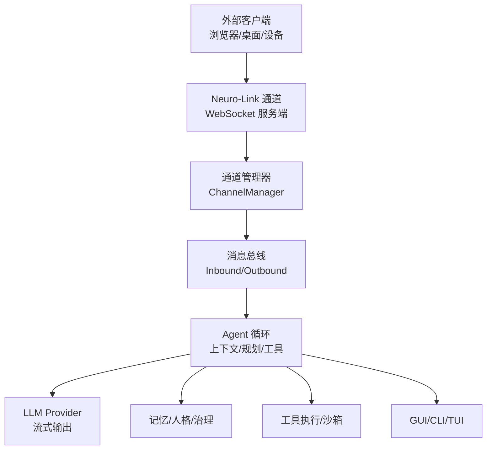
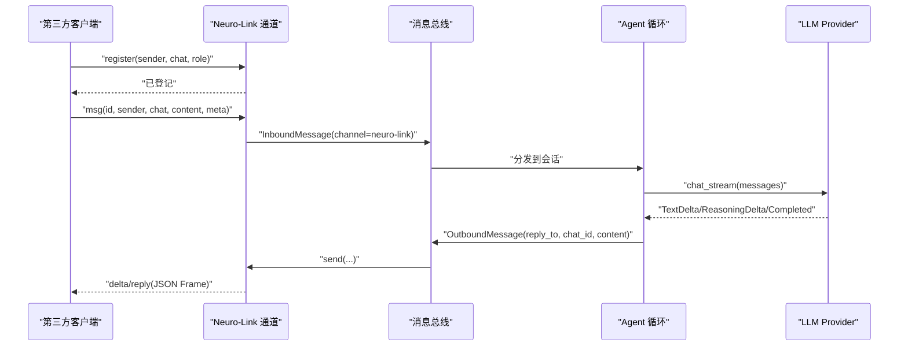
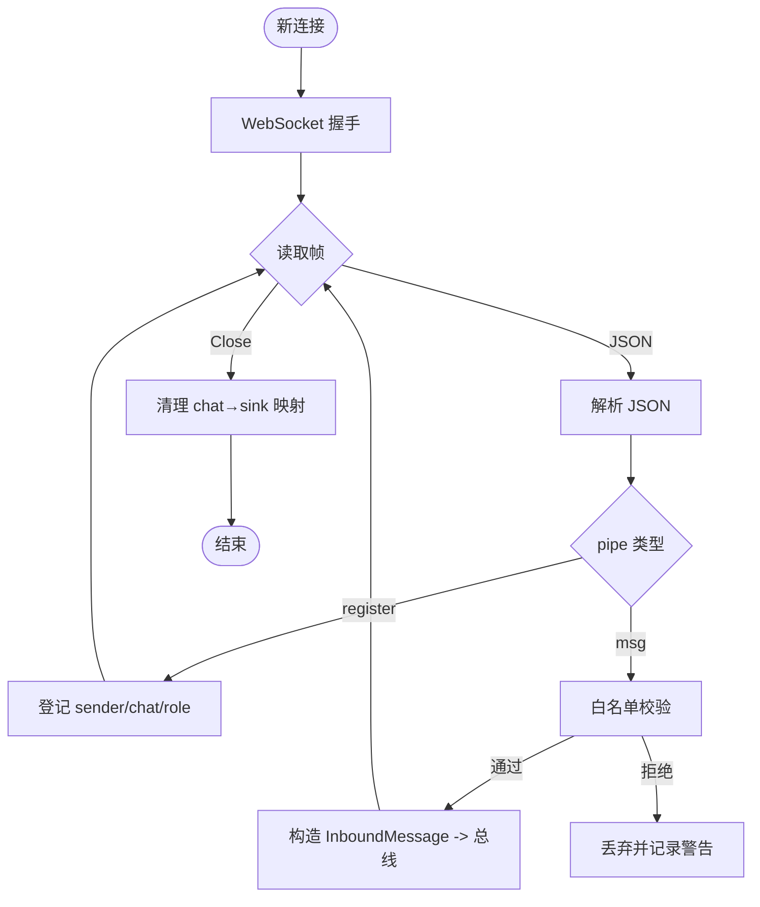
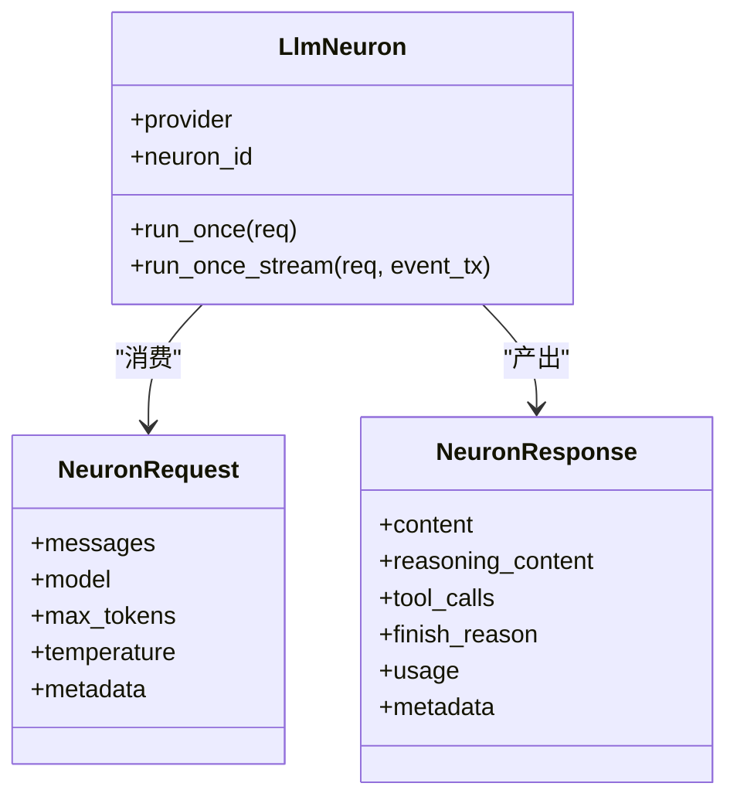
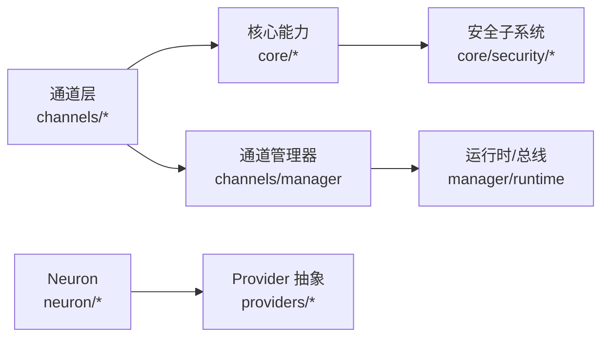

# 神经链接平台实现

<cite>
**本文引用的文件**
- [README.md](file://README.md)
- [neuro_link.rs](file://agent-diva-channels/src/neuro_link.rs)
- [base.rs](file://agent-diva-channels/src/base.rs)
- [manager.rs](file://agent-diva-channels/src/manager.rs)
- [lib.rs](file://agent-diva-neuron/src/lib.rs)
- [types.rs](file://agent-diva-neuron/src/types.rs)
- [executor.rs](file://agent-diva-neuron/src/executor.rs)
- [mod.rs](file://agent-diva-core/src/config/mod.rs)
- [schema.rs](file://agent-diva-core/src/config/schema.rs)
- [loader.rs](file://agent-diva-core/src/config/loader.rs)
- [task_runtime.rs](file://agent-diva-manager/src/runtime/task_runtime.rs)
- [security_mod.rs](file://agent-diva-core/src/security/mod.rs)
- [decision.rs](file://agent-diva-core/src/security/decision.rs)
- [config.rs](file://agent-diva-core/src/security/config.rs)
- [pii.rs](file://agent-diva-core/src/security/pii.rs)
</cite>

## 目录
1. [简介](#简介)
2. [项目结构](#项目结构)
3. [核心组件](#核心组件)
4. [架构总览](#架构总览)
5. [详细组件分析](#详细组件分析)
6. [依赖关系分析](#依赖关系分析)
7. [性能与可靠性](#性能与可靠性)
8. [故障排查指南](#故障排查指南)
9. [结论](#结论)
10. [附录：配置与安全要点](#附录配置与安全要点)

## 简介
本仓库是一个以 Rust 实现的“个人 AI 网关”工程，提供多通道接入、会话路由、记忆与人格治理、工具执行、调度与 GUI/CLI/TUI 等能力。其中“神经链接（Neuro-Link）”作为预留的重型通道，当前实现了本地 WebSocket 服务器，用于第三方管道集成（例如虚拟形象/桌面伴侣前端），并定义了轻量 JSON 协议进行消息收发。它不是传统意义上的脑机接口驱动层，而是面向“前端/设备侧”的统一接入面，为未来更丰富的感知与交互扩展保留空间。

## 项目结构
- agent-diva-channels：通道适配器集合，包含 Telegram、Discord、QQ、钉钉、飞书、邮件以及 Neuro-Link 等。
- agent-diva-neuron：单轮 LLM 执行的最小单元（请求/响应、事件流、节点抽象）。
- agent-diva-core：配置、安全、审计、会话、计划、质量等基础能力。
- agent-diva-manager：本地网关与 HTTP 控制面，负责总线、任务编排、GUI 桥接等。
- agent-diva-gui：Tauri + Vue 桌面应用，提供聊天、设置、审批、技能市场等界面。
- 其他：工具集、沙箱、记忆与人格治理、迁移脚本、端到端测试等。

图表来源
- [neuro_link.rs:1-531](file://agent-diva-channels/src/neuro_link.rs#L1-L531)
- [manager.rs:1-800](file://agent-diva-channels/src/manager.rs#L1-L800)
- [task_runtime.rs:199-239](file://agent-diva-manager/src/runtime/task_runtime.rs#L199-L239)

章节来源
- [README.md:20-108](file://README.md#L20-L108)

## 核心组件
- 神经链接通道（Neuro-Link Handler）：本地 WebSocket 服务，解析管道消息，转发到消息总线；支持注册、白名单、按 chat 路由回复与 delta 推送。
- 通道基类与错误模型：统一的 ChannelHandler trait、BaseChannel 公共逻辑、访问控制与校验工具。
- 通道管理器：根据配置初始化各通道，统一启停、发送与更新。
- Neuron（单轮执行器）：封装一次 LLM 调用，支持流式事件与工具调用透传。
- 配置与安全：配置加载与别名合并、安全策略、PII 检测与脱敏、决策模型。

章节来源
- [neuro_link.rs:82-164](file://agent-diva-channels/src/neuro_link.rs#L82-L164)
- [base.rs:9-71](file://agent-diva-channels/src/base.rs#L9-L71)
- [manager.rs:42-163](file://agent-diva-channels/src/manager.rs#L42-L163)
- [lib.rs:1-17](file://agent-diva-neuron/src/lib.rs#L1-L17)
- [types.rs:7-75](file://agent-diva-neuron/src/types.rs#L7-L75)
- [executor.rs:13-156](file://agent-diva-neuron/src/executor.rs#L13-L156)
- [mod.rs:1-12](file://agent-diva-core/src/config/mod.rs#L1-L12)
- [security_mod.rs:1-69](file://agent-diva-core/src/security/mod.rs#L1-L69)

## 架构总览
神经链接通道通过本地 TCP 监听端口，接受来自第三方客户端的 WebSocket 连接。客户端先发送 register 帧声明 sender/chat/role，随后发送 msg 帧携带内容。通道将入站消息包装为 InboundMessage 推送到消息总线；Agent 循环处理后，通过 OutboundMessage 经通道管理器路由回对应 chat 的客户端，支持 reply/delta 两种帧类型。

图表来源
- [neuro_link.rs:166-289](file://agent-diva-channels/src/neuro_link.rs#L166-L289)
- [neuro_link.rs:356-435](file://agent-diva-channels/src/neuro_link.rs#L356-L435)
- [executor.rs:42-156](file://agent-diva-neuron/src/executor.rs#L42-L156)

## 详细组件分析

### 神经链接通道（Neuro-Link Handler）
- 职责
  - 绑定本地地址（默认 localhost），接受 WebSocket 连接。
  - 解析 register/msg 帧，维护 chat→写句柄映射。
  - 对入站消息做白名单校验，构造 InboundMessage 发送到总线。
  - 对外提供 send/send_delta，向指定 chat 推送 reply/delta。
- 关键流程
  - 连接处理：握手失败/读取错误/关闭均记录日志并清理。
  - 注册阶段：首次收到 register 或 msg 时建立 chat→sink 映射。
  - 出站路由：根据 OutboundMessage.chat_id 查找 sink 并发送 JSON 帧。
- 安全与限制
  - 仅允许 localhost 绑定（validate_neurolink_host），避免暴露到公网。
  - 可选 allow_from 白名单过滤 sender。
- 数据模型
  - 入站：PipeMsg（pipe/id/sender/chat/content/meta）。
  - 出站：PipeFrame（pipe=id|reply/delta, id, reply_to, chat, content, meta）。

图表来源
- [neuro_link.rs:166-289](file://agent-diva-channels/src/neuro_link.rs#L166-L289)
- [base.rs:255-268](file://agent-diva-channels/src/base.rs#L255-L268)

章节来源
- [neuro_link.rs:31-79](file://agent-diva-channels/src/neuro_link.rs#L31-L79)
- [neuro_link.rs:166-289](file://agent-diva-channels/src/neuro_link.rs#L166-L289)
- [neuro_link.rs:356-435](file://agent-diva-channels/src/neuro_link.rs#L356-L435)
- [base.rs:255-268](file://agent-diva-channels/src/base.rs#L255-L268)

### 通道基类与错误模型（BaseChannel）
- 提供统一的 ChannelHandler trait 与 BaseChannel 公共实现。
- 支持 allow_from 白名单与 deny_by_default 策略，含通配符匹配与复合 ID 解析。
- 提供 handle_message 便捷方法，自动注入媒体与元数据并发送到 inbound 通道。
- 错误类型 ChannelError 覆盖未配置、未运行、鉴权失败、发送失败等场景。

章节来源
- [base.rs:9-71](file://agent-diva-channels/src/base.rs#L9-L71)
- [base.rs:73-229](file://agent-diva-channels/src/base.rs#L73-L229)
- [base.rs:239-268](file://agent-diva-channels/src/base.rs#L239-L268)

### 通道管理器（ChannelManager）
- 根据配置动态初始化各通道（包括 neuro-link/generic_pipe）。
- 统一 start_all/stop_all、update_channel、send、list_channels 等能力。
- 对每个通道进行 required_fields 校验，缺失字段则跳过并告警。

章节来源
- [manager.rs:42-163](file://agent-diva-channels/src/manager.rs#L42-L163)
- [manager.rs:361-642](file://agent-diva-channels/src/manager.rs#L361-L642)
- [manager.rs:644-755](file://agent-diva-channels/src/manager.rs#L644-L755)

### Neuron 单轮执行器
- 定义 NeuronRequest/NeuronResponse 标准契约，支持 model 覆盖、max_tokens、temperature、metadata。
- LlmNeuron 基于 LLMProvider 的 chat_stream 实现流式文本/推理片段与完成事件。
- 通过事件通道（mpsc）向外广播 Started/TextDelta/ReasoningDelta/Completed/Failed 等事件。

图表来源
- [types.rs:7-75](file://agent-diva-neuron/src/types.rs#L7-L75)
- [executor.rs:13-156](file://agent-diva-neuron/src/executor.rs#L13-L156)

章节来源
- [lib.rs:1-17](file://agent-diva-neuron/src/lib.rs#L1-L17)
- [types.rs:7-75](file://agent-diva-neuron/src/types.rs#L7-L75)
- [executor.rs:42-156](file://agent-diva-neuron/src/executor.rs#L42-L156)

### 配置与别名
- 配置模块提供加载、校验与差异计算。
- loader 中对 channels.neuro-link 的键名进行别名归一化（neuro_link / generic_pipe → neuro-link）。

章节来源
- [mod.rs:1-12](file://agent-diva-core/src/config/mod.rs#L1-L12)
- [loader.rs:429-465](file://agent-diva-core/src/config/loader.rs#L429-L465)

### GUI/Avatar 桥接
- 管理器的运行时会将最终回复转换为神经链接 Avatar 消息，发布到总线供 GUI/前端消费。

章节来源
- [task_runtime.rs:199-239](file://agent-diva-manager/src/runtime/task_runtime.rs#L199-L239)

## 依赖关系分析
- 通道层依赖 core 的消息总线与配置；通道管理器聚合多个通道实现。
- Neuron 依赖 providers 的 LLMProvider 抽象，屏蔽具体模型差异。
- 安全子系统贯穿全链路：路径校验、注入检测、PII 脱敏、速率限制、拒绝熔断等。

图表来源
- [manager.rs:1-800](file://agent-diva-channels/src/manager.rs#L1-L800)
- [executor.rs:1-156](file://agent-diva-neuron/src/executor.rs#L1-L156)
- [security_mod.rs:1-69](file://agent-diva-core/src/security/mod.rs#L1-L69)

章节来源
- [manager.rs:1-800](file://agent-diva-channels/src/manager.rs#L1-L800)
- [executor.rs:1-156](file://agent-diva-neuron/src/executor.rs#L1-L156)
- [security_mod.rs:1-69](file://agent-diva-core/src/security/mod.rs#L1-L69)

## 性能与可靠性
- 异步 I/O：通道使用 tokio 异步读写，WS 读/写分离，降低阻塞风险。
- 流式输出：Neuron 通过 provider 的 chat_stream 实时推送文本/推理片段，减少首字延迟。
- 资源清理：连接断开时移除 chat→sink 映射，防止内存泄漏。
- 可观测性：大量 tracing 日志便于定位握手失败、JSON 解析错误、发送失败等。
- 限流与隔离：安全子系统提供速率限制、拒绝熔断、沙箱执行等保障。

[本节为通用指导，不直接分析具体文件]

## 故障排查指南
- 无法连接
  - 检查是否绑定 localhost（validate_neurolink_host），非本地地址会被拒绝。
  - 确认端口未被占用，start 成功且 is_running 为真。
- 客户端被拒绝
  - 若配置了 allow_from，需确保 sender 在白名单中。
  - 检查 register 是否先于 msg 到达，否则首次写入可能找不到 sink。
- 无回复或无 delta
  - 确认 Agent 循环已产生 OutboundMessage，并通过通道管理器路由到 neuro-link。
  - 检查 GUI/Avatar 桥接是否将最终回复发布到总线。
- 解析错误
  - 关注 bad JSON/bad frame 日志，核对 pipe/id/sender/chat/content 字段。
- 安全拦截
  - 查看 PII 检测与安全决策结果，必要时调整策略或白名单。

章节来源
- [base.rs:255-268](file://agent-diva-channels/src/base.rs#L255-L268)
- [neuro_link.rs:166-289](file://agent-diva-channels/src/neuro_link.rs#L166-L289)
- [task_runtime.rs:199-239](file://agent-diva-manager/src/runtime/task_runtime.rs#L199-L239)
- [decision.rs:1-42](file://agent-diva-core/src/security/decision.rs#L1-L42)
- [pii.rs:1-47](file://agent-diva-core/src/security/pii.rs#L1-L47)

## 结论
当前神经链接通道提供了稳定可靠的本地 WebSocket 接入面，适合与前端/设备侧集成，实现“思维到文本”的实时交互。其设计保留了未来扩展空间（如 PEN/Mirror/Workbench 等），同时通过严格的安全策略与可观测性保障生产可用性。对于真正的脑机接口信号采集与意图识别，建议在本通道之上构建专用传感器/设备适配层，并将原始信号在本地预处理后，再经由该通道进入 Agent 循环进行语义提取与反馈。

[本节为总结性内容，不直接分析具体文件]

## 附录：配置与安全要点
- 通道配置
  - 启用 channels.neuro_link.enabled，并设置 host/port。
  - 如需限制来源，配置 allow_from 列表。
  - 配置键名兼容：neuro_link / generic_pipe 将被归一化为 neuro-link。
- 安全策略
  - 使用 SecurityLevel 预设（Permissive/Standard/Strict/Paranoid）控制行为边界。
  - 通过 PII 检测与脱敏保护敏感信息。
  - 结合拒绝熔断、速率限制与沙箱策略，提升整体安全性。

章节来源
- [loader.rs:429-465](file://agent-diva-core/src/config/loader.rs#L429-L465)
- [config.rs:11-49](file://agent-diva-core/src/security/config.rs#L11-L49)
- [pii.rs:1-47](file://agent-diva-core/src/security/pii.rs#L1-L47)
- [decision.rs:1-42](file://agent-diva-core/src/security/decision.rs#L1-L42)