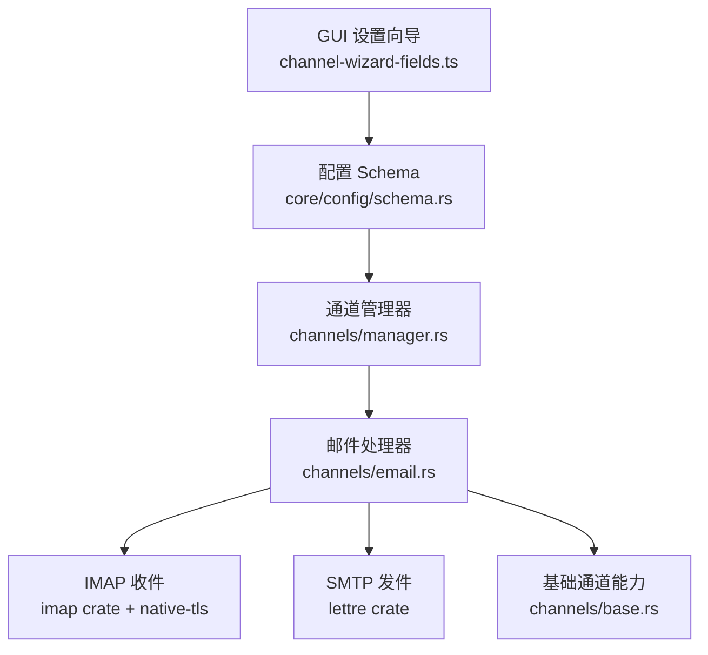
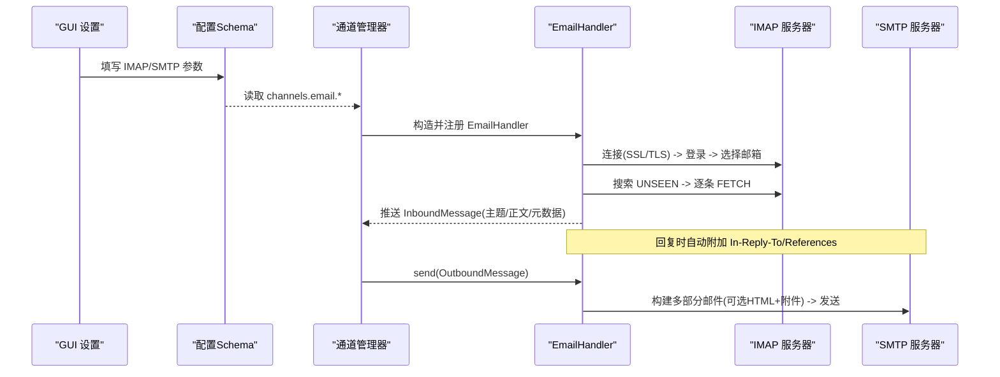
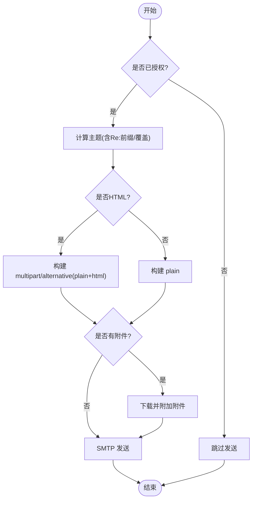
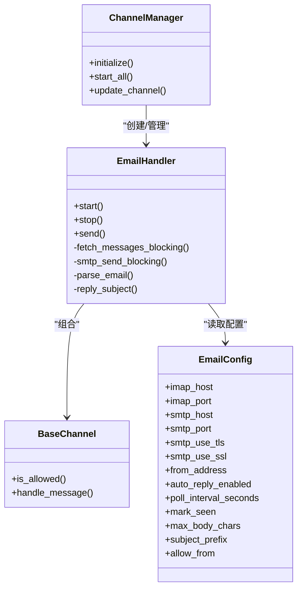

# 邮件平台实现

<cite>
**本文引用的文件**
- [agent-diva-channels/src/email.rs](file://agent-diva-channels/src/email.rs)
- [agent-diva-channels/src/base.rs](file://agent-diva-channels/src/base.rs)
- [agent-diva-channels/src/manager.rs](file://agent-diva-channels/src/manager.rs)
- [agent-diva-core/src/config/schema.rs](file://agent-diva-core/src/config/schema.rs)
- [agent-diva-gui/src/components/settings/channel-wizard-fields.ts](file://agent-diva-gui/src/components/settings/channel-wizard-fields.ts)
</cite>

## 目录
1. [简介](#简介)
2. [项目结构](#项目结构)
3. [核心组件](#核心组件)
4. [架构总览](#架构总览)
5. [详细组件分析](#详细组件分析)
6. [依赖关系分析](#依赖关系分析)
7. [性能考量](#性能考量)
8. [故障诊断指南](#故障诊断指南)
9. [结论](#结论)
10. [附录：配置项说明](#附录配置项说明)

## 简介
本文件面向“邮件通道适配器”的实现与使用，覆盖 SMTP/IMAP 协议支持、收发机制、附件处理、邮件格式解析、模板化主题与正文、签名扩展点、队列与重试策略、安全配置（SSL/TLS、SPF/DKIM 建议）、以及常见问题的排障方法。文档基于仓库中现有代码进行梳理与归纳，确保与实际实现一致。

## 项目结构
邮件功能主要位于 channels 层，由 manager 统一初始化与调度；配置集中在 core 的 schema；GUI 提供可视化配置入口。

图表来源
- [agent-diva-gui/src/components/settings/channel-wizard-fields.ts:213-311](file://agent-diva-gui/src/components/settings/channel-wizard-fields.ts#L213-L311)
- [agent-diva-core/src/config/schema.rs:790-888](file://agent-diva-core/src/config/schema.rs#L790-L888)
- [agent-diva-channels/src/manager.rs:481-499](file://agent-diva-channels/src/manager.rs#L481-L499)
- [agent-diva-channels/src/email.rs:1-18](file://agent-diva-channels/src/email.rs#L1-L18)
- [agent-diva-channels/src/base.rs:1-32](file://agent-diva-channels/src/base.rs#L1-L32)

章节来源
- [agent-diva-channels/src/email.rs:1-18](file://agent-diva-channels/src/email.rs#L1-L18)
- [agent-diva-channels/src/manager.rs:481-499](file://agent-diva-channels/src/manager.rs#L481-L499)
- [agent-diva-core/src/config/schema.rs:790-888](file://agent-diva-core/src/config/schema.rs#L790-L888)
- [agent-diva-gui/src/components/settings/channel-wizard-fields.ts:213-311](file://agent-diva-gui/src/components/settings/channel-wizard-fields.ts#L213-L311)

## 核心组件
- EmailHandler：实现 IMAP 轮询收信与 SMTP 发送，维护已处理 UID、最近主题与 Message-ID，支持 HTML/纯文本与附件。
- BaseChannel：通用通道能力（名称、运行状态、入站消息发送、白名单/通配符匹配）。
- ChannelManager：按配置初始化并启动各通道，包含 email 通道的创建与生命周期管理。
- EmailConfig：集中定义 IMAP/SMTP 服务器、端口、加密、行为开关等配置项。

章节来源
- [agent-diva-channels/src/email.rs:19-40](file://agent-diva-channels/src/email.rs#L19-L40)
- [agent-diva-channels/src/base.rs:73-87](file://agent-diva-channels/src/base.rs#L73-L87)
- [agent-diva-channels/src/manager.rs:42-56](file://agent-diva-channels/src/manager.rs#L42-L56)
- [agent-diva-core/src/config/schema.rs:790-838](file://agent-diva-core/src/config/schema.rs#L790-L838)

## 架构总览
邮件通道采用“阻塞式 IMAP 轮询 + 异步任务封装”的模式：IMAP 连接、登录、搜索、取信在阻塞线程执行，避免阻塞事件循环；SMTP 发送同样在阻塞线程完成。入站消息通过 mpsc 推送到系统总线，出站消息经 manager 路由到 email 通道发送。

图表来源
- [agent-diva-channels/src/email.rs:177-291](file://agent-diva-channels/src/email.rs#L177-L291)
- [agent-diva-channels/src/email.rs:307-410](file://agent-diva-channels/src/email.rs#L307-L410)
- [agent-diva-channels/src/email.rs:428-558](file://agent-diva-channels/src/email.rs#L428-L558)
- [agent-diva-channels/src/email.rs:573-689](file://agent-diva-channels/src/email.rs#L573-L689)
- [agent-diva-channels/src/manager.rs:481-499](file://agent-diva-channels/src/manager.rs#L481-L499)

## 详细组件分析

### EmailHandler：收发与解析
- 收信流程
  - 使用 IMAP 连接并登录，选择邮箱（默认 INBOX），搜索未读消息，按 UID 拉取完整报文。
  - 解析邮件头（发件人、主题、Message-ID、日期）与正文（优先 text/plain，其次 text/html 转 plain，最后回退原始字节）。
  - 将内容截断至 max_body_chars，组装为 InboundMessage 并推送到总线。
  - 记录已处理 UID 集合，防止重复处理；可选标记已读。
- 发信流程
  - 根据是否已有历史消息决定是否为回复，自动添加 In-Reply-To/References。
  - 检测内容是否为 HTML，若为 HTML 则同时生成 plain 与 html 双部分。
  - 从 OutboundMessage.media 列表下载附件，推断文件名与 Content-Type，以 multipart/mixed 附加。
  - 根据 smtp_use_ssl / smtp_use_tls 选择 relay/starttls/危险直连模式，使用凭据发送。
- 主题与签名
  - 主题：基于最近主题自动加前缀（可配置 subject_prefix），或覆盖 metadata.subject。
  - 签名：当前实现未内置签名注入逻辑，可在上层调用 send 前对 content 追加签名后传入。

图表来源
- [agent-diva-channels/src/email.rs:573-689](file://agent-diva-channels/src/email.rs#L573-L689)
- [agent-diva-channels/src/email.rs:307-410](file://agent-diva-channels/src/email.rs#L307-L410)

章节来源
- [agent-diva-channels/src/email.rs:129-175](file://agent-diva-channels/src/email.rs#L129-L175)
- [agent-diva-channels/src/email.rs:177-291](file://agent-diva-channels/src/email.rs#L177-L291)
- [agent-diva-channels/src/email.rs:307-410](file://agent-diva-channels/src/email.rs#L307-L410)
- [agent-diva-channels/src/email.rs:428-558](file://agent-diva-channels/src/email.rs#L428-L558)
- [agent-diva-channels/src/email.rs:573-689](file://agent-diva-channels/src/email.rs#L573-L689)

### BaseChannel：权限与公共能力
- 白名单与通配符匹配：支持精确匹配与 * 通配符，兼容复合 ID（如 user|group）。
- 入站消息转发：统一封装 InboundMessage，携带媒体与元数据。
- 错误类型：NotConfigured/InvalidConfig/ConnectionError/AuthError/SendError 等，便于上层分类处理。

章节来源
- [agent-diva-channels/src/base.rs:9-32](file://agent-diva-channels/src/base.rs#L9-L32)
- [agent-diva-channels/src/base.rs:73-229](file://agent-diva-channels/src/base.rs#L73-L229)

### ChannelManager：通道生命周期
- 校验与初始化：根据 config.channels.email.enabled 及必填字段决定是否创建 EmailHandler。
- 启动/停止：统一管理各通道 start/stop，失败不阻断其他通道。
- 动态更新：支持运行时替换通道配置并重启对应通道。

章节来源
- [agent-diva-channels/src/manager.rs:92-103](file://agent-diva-channels/src/manager.rs#L92-L103)
- [agent-diva-channels/src/manager.rs:481-499](file://agent-diva-channels/src/manager.rs#L481-L499)
- [agent-diva-channels/src/manager.rs:644-680](file://agent-diva-channels/src/manager.rs#L644-L680)
- [agent-diva-channels/src/manager.rs:699-735](file://agent-diva-channels/src/manager.rs#L699-L735)

## 依赖关系分析
- 外部库
  - IMAP：imap crate + native-tls 用于 SSL 连接与认证。
  - SMTP：lettre crate 负责构建邮件与传输。
  - 解析：mail_parser 解析 MIME 报文，regex/html-escape 辅助文本转换。
- 内部模块
  - 依赖 agent_diva_core::bus 进行消息传递。
  - 依赖 agent_diva_core::config::schema::EmailConfig 获取配置。
  - 依赖 base 提供的通用通道能力。

图表来源
- [agent-diva-channels/src/email.rs:19-40](file://agent-diva-channels/src/email.rs#L19-L40)
- [agent-diva-channels/src/base.rs:73-229](file://agent-diva-channels/src/base.rs#L73-L229)
- [agent-diva-channels/src/manager.rs:42-56](file://agent-diva-channels/src/manager.rs#L42-L56)
- [agent-diva-core/src/config/schema.rs:790-838](file://agent-diva-core/src/config/schema.rs#L790-L838)

章节来源
- [agent-diva-channels/src/email.rs:1-18](file://agent-diva-channels/src/email.rs#L1-L18)
- [agent-diva-channels/src/base.rs:1-32](file://agent-diva-channels/src/base.rs#L1-L32)
- [agent-diva-channels/src/manager.rs:1-29](file://agent-diva-channels/src/manager.rs#L1-L29)
- [agent-diva-core/src/config/schema.rs:790-838](file://agent-diva-core/src/config/schema.rs#L790-L838)

## 性能考量
- IMAP 操作阻塞化：通过 tokio::task::spawn_blocking 包裹 IMAP 收发，避免阻塞异步事件循环。
- 轮询间隔：poll_interval_seconds 控制拉取频率，默认 30 秒，可按需调整。
- 内存与去重：processed_uids 限制最大容量并在满时清理，避免无限增长。
- 正文截断：max_body_chars 限制入站正文长度，降低下游处理压力。
- 并发：每个轮询周期串行处理邮件，适合低频通道场景。

[本节为通用性能讨论，无需特定文件引用]

## 故障诊断指南
- 连接问题
  - 现象：无法连接 IMAP/SMTP。
  - 排查：检查 imap_host/smtp_host、端口、ssl/tls 选项；确认防火墙与证书链。
  - 依据：连接与 TLS 构建处抛出 ConnectionError。
- 认证失败
  - 现象：IMAP 登录失败或 SMTP 认证失败。
  - 排查：核对用户名/密码；确认是否需要应用专用密码或 OAuth；查看 AuthError。
- 邮件被标记为垃圾邮件
  - 现象：收件方收到邮件进入垃圾箱。
  - 建议：配置 SPF/DKIM/DMARC（服务端层面）；避免可疑链接与过多附件；合理主题与正文。
- 未收到新邮件
  - 现象：轮询无新消息。
  - 排查：确认 allow_from 白名单；检查 mark_seen 与 UNSEEN 搜索；查看 processed_uids 是否过大导致清理。
- 自动回复未触发
  - 现象：回复未发送。
  - 排查：auto_reply_enabled 是否关闭；consent_granted 是否开启；metadata.force_send 是否可用。
- 附件缺失或类型错误
  - 现象：附件未附带或类型不正确。
  - 排查：检查 media URL 可达性；Content-Type 是否正确；multipart 构建是否成功。

章节来源
- [agent-diva-channels/src/email.rs:177-291](file://agent-diva-channels/src/email.rs#L177-L291)
- [agent-diva-channels/src/email.rs:307-410](file://agent-diva-channels/src/email.rs#L307-L410)
- [agent-diva-channels/src/email.rs:428-558](file://agent-diva-channels/src/email.rs#L428-L558)
- [agent-diva-channels/src/email.rs:573-689](file://agent-diva-channels/src/email.rs#L573-L689)
- [agent-diva-channels/src/base.rs:34-71](file://agent-diva-channels/src/base.rs#L34-L71)

## 结论
该邮件通道实现了稳定的 IMAP 轮询与 SMTP 发送，具备 HTML/纯文本与附件处理能力，并通过配置项灵活控制加密、行为与权限。当前实现未内置队列与重试机制，但可通过上层调度与错误分类进行扩展。建议在服务端侧完善 SPF/DKIM/DMARC 以提升送达率，并根据业务需求调整轮询间隔与正文大小限制。

[本节为总结性内容，无需特定文件引用]

## 附录：配置项说明
- IMAP
  - imap_host：IMAP 服务器地址
  - imap_port：IMAP 端口（默认 993）
  - imap_username / imap_password：IMAP 认证凭据
  - imap_mailbox：邮箱名（默认 INBOX）
  - imap_use_ssl：是否启用 SSL（默认 true）
- SMTP
  - smtp_host：SMTP 服务器地址
  - smtp_port：SMTP 端口（默认 587）
  - smtp_username / smtp_password：SMTP 认证凭据
  - smtp_use_tls：是否使用 STARTTLS（默认 true）
  - smtp_use_ssl：是否使用隐式 SSL（默认 false）
  - from_address：发件人地址
- 行为
  - enabled：是否启用邮件通道
  - consent_granted：是否已获得用户授权
  - auto_reply_enabled：是否允许自动回复
  - poll_interval_seconds：轮询间隔（秒，默认 30）
  - mark_seen：是否标记已读（默认 true）
  - max_body_chars：入站正文最大字符数（默认 12000）
  - subject_prefix：回复主题前缀（默认 Re: ）
  - allow_from：允许的发件人白名单

章节来源
- [agent-diva-core/src/config/schema.rs:790-888](file://agent-diva-core/src/config/schema.rs#L790-L888)
- [agent-diva-gui/src/components/settings/channel-wizard-fields.ts:213-311](file://agent-diva-gui/src/components/settings/channel-wizard-fields.ts#L213-L311)