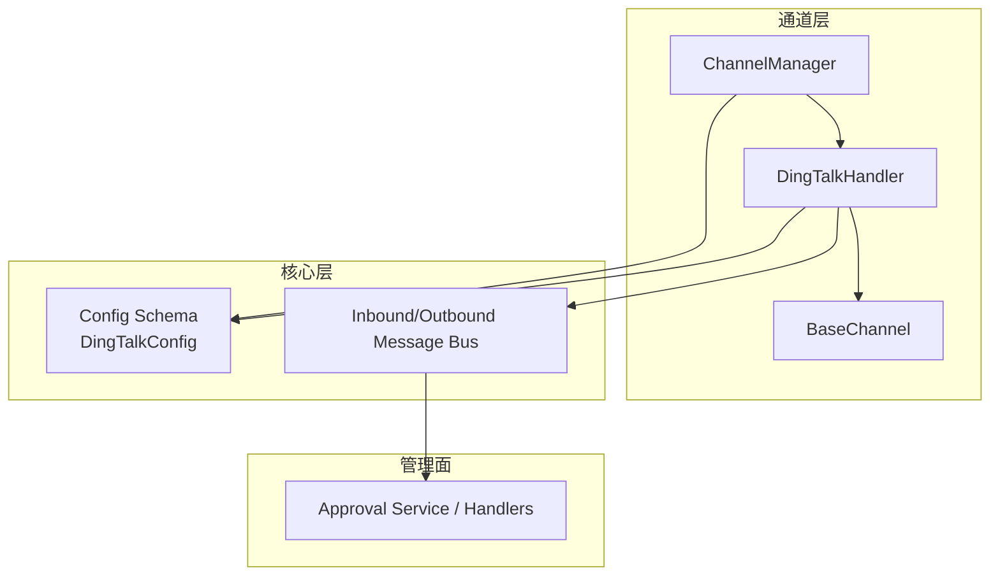
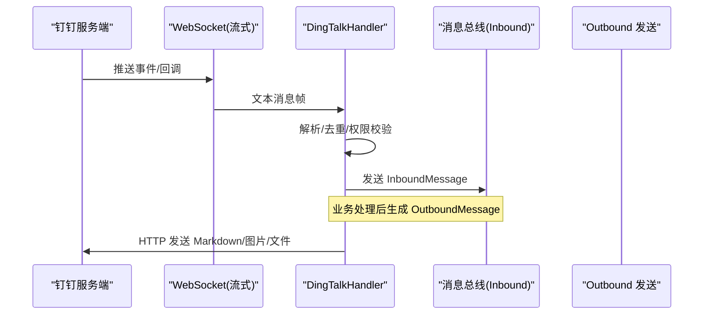
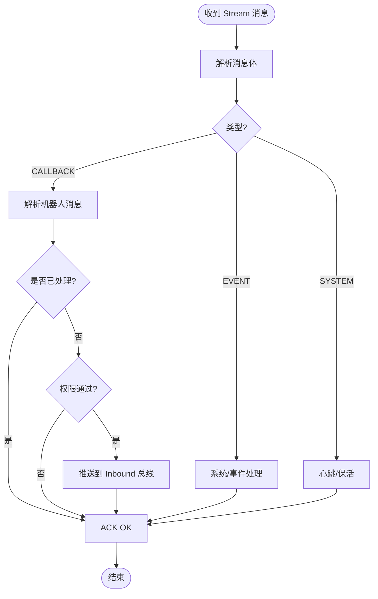
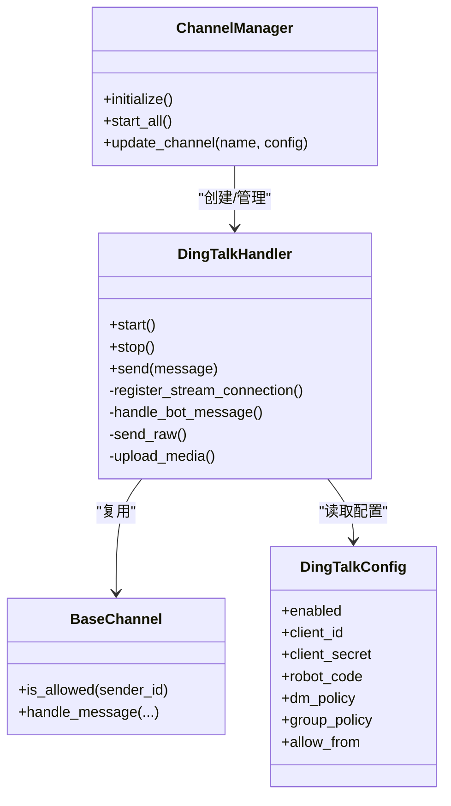

# 钉钉平台实现

<cite>
**本文引用的文件**
- [agent-diva-channels/src/dingtalk.rs](file://agent-diva-channels/src/dingtalk.rs)
- [agent-diva-channels/src/base.rs](file://agent-diva-channels/src/base.rs)
- [agent-diva-channels/src/manager.rs](file://agent-diva-channels/src/manager.rs)
- [agent-diva-core/src/config/schema.rs](file://agent-diva-core/src/config/schema.rs)
- [agent-diva-manager/src/approval_service.rs](file://agent-diva-manager/src/approval_service.rs)
- [agent-diva-manager/src/handlers/approvals.rs](file://agent-diva-manager/src/handlers/approvals.rs)
</cite>

## 目录
1. [简介](#简介)
2. [项目结构](#项目结构)
3. [核心组件](#核心组件)
4. [架构总览](#架构总览)
5. [详细组件分析](#详细组件分析)
6. [依赖关系分析](#依赖关系分析)
7. [性能与可靠性](#性能与可靠性)
8. [故障排查指南](#故障排查指南)
9. [结论](#结论)
10. [附录：部署与运维建议](#附录部署与运维建议)

## 简介
本文件面向在 Agent-Diva 中接入钉钉平台的工程实践，聚焦以下目标：
- 钉钉机器人适配器实现：基于 Stream 模式的 WebSocket 收发消息、HTTP API 发送消息、媒体上传。
- 应用配置：启用开关、凭据（client_id/client_secret）、访问策略（dm_policy/group_policy/allow_from）。
- 消息格式转换：Markdown 富文本回复、图片直发与文件上传、群聊与单聊路由。
- 审批流程对接：通过内部审批服务暴露的 HTTP 接口进行查询与决策，便于后续扩展为钉钉侧通知或回调。
- 安全与合规：访问控制、错误脱敏、日志与监控要点。
- 部署与运维：启动流程、重连机制、日志收集、告警与性能调优建议。

说明：当前仓库未包含企业微信集成代码；钉钉适配器的消息卡片能力以 Markdown 为主，未直接渲染复杂卡片模板。

## 项目结构
钉钉通道相关代码集中在 agent-diva-channels 模块，由 ChannelManager 统一初始化与管理；核心配置定义在 agent-diva-core 的配置 schema 中；审批能力由 agent-diva-manager 提供 HTTP 接口。

图表来源
- [agent-diva-channels/src/manager.rs:459-479](file://agent-diva-channels/src/manager.rs#L459-L479)
- [agent-diva-channels/src/dingtalk.rs:154-187](file://agent-diva-channels/src/dingtalk.rs#L154-L187)
- [agent-diva-core/src/config/schema.rs:756-788](file://agent-diva-core/src/config/schema.rs#L756-L788)

章节来源
- [agent-diva-channels/src/manager.rs:459-479](file://agent-diva-channels/src/manager.rs#L459-L479)
- [agent-diva-channels/src/dingtalk.rs:154-187](file://agent-diva-channels/src/dingtalk.rs#L154-L187)
- [agent-diva-core/src/config/schema.rs:756-788](file://agent-diva-core/src/config/schema.rs#L756-L788)

## 核心组件
- DingTalkHandler：实现钉钉 Stream 模式连接、消息接收、去重、权限校验、消息发送（Markdown、图片、文件）。
- BaseChannel：通用通道基类，提供 allow_from 白名单匹配、默认拒绝策略、入站消息封装与转发。
- ChannelManager：按配置动态初始化各通道，负责生命周期管理与热更新。
- 配置模型：DingTalkConfig 定义启用开关、凭据、机器人标识、策略与白名单。
- 审批服务：提供审批列表、详情、决策等 HTTP 接口，供上层编排或未来扩展至钉钉通知。

章节来源
- [agent-diva-channels/src/dingtalk.rs:154-187](file://agent-diva-channels/src/dingtalk.rs#L154-L187)
- [agent-diva-channels/src/base.rs:73-229](file://agent-diva-channels/src/base.rs#L73-L229)
- [agent-diva-channels/src/manager.rs:459-479](file://agent-diva-channels/src/manager.rs#L459-L479)
- [agent-diva-core/src/config/schema.rs:756-788](file://agent-diva-core/src/config/schema.rs#L756-L788)
- [agent-diva-manager/src/handlers/approvals.rs:47-87](file://agent-diva-manager/src/handlers/approvals.rs#L47-L87)

## 架构总览
钉钉通道采用“Stream 模式”建立长连接，无需公网 IP；通过 HTTP 获取 access_token 并调用 v1.0 机器人消息接口发送消息。入站消息经解析、去重、权限校验后，统一注入 InboundMessage 总线，再由上层处理。

图表来源
- [agent-diva-channels/src/dingtalk.rs:274-323](file://agent-diva-channels/src/dingtalk.rs#L274-L323)
- [agent-diva-channels/src/dingtalk.rs:529-667](file://agent-diva-channels/src/dingtalk.rs#L529-L667)
- [agent-diva-channels/src/dingtalk.rs:831-857](file://agent-diva-channels/src/dingtalk.rs#L831-L857)

## 详细组件分析

### 钉钉适配器（DingTalkHandler）
- 连接与订阅
  - 注册 Stream 连接，订阅 EVENT 与 CALLBACK 主题，获取 endpoint 与 ticket 后建立 WebSocket。
  - 自动重连：连接断开或异常时等待 5 秒重试。
- 消息接收
  - 解析 StreamMessage，区分 CALLBACK/EVENT/SYSTEM。
  - 对机器人消息做去重（维护最近 1000 条 msg_id），避免重复处理。
  - 提取 sender_id/sender_name/conversation_id/conversation_type，判断群聊或单聊。
- 权限控制
  - 根据 dm_policy/group_policy 与 allow_from 白名单决定是否放行。
  - 支持通配符匹配（如 *@domain）。
- 消息发送
  - 获取 access_token（带过期时间缓存，提前 60 秒刷新）。
  - 群聊使用 groupMessages/send，单聊使用 oToMessages/batchSend。
  - 支持 Markdown 文本、图片直发（URL 或 media_id）、文件上传（multipart）。
- 运行控制
  - start() 完成注册与启动 WebSocket；stop() 发送关闭信号并清理资源。

图表来源
- [agent-diva-channels/src/dingtalk.rs:605-667](file://agent-diva-channels/src/dingtalk.rs#L605-L667)
- [agent-diva-channels/src/dingtalk.rs:669-777](file://agent-diva-channels/src/dingtalk.rs#L669-L777)

章节来源
- [agent-diva-channels/src/dingtalk.rs:274-323](file://agent-diva-channels/src/dingtalk.rs#L274-L323)
- [agent-diva-channels/src/dingtalk.rs:529-667](file://agent-diva-channels/src/dingtalk.rs#L529-L667)
- [agent-diva-channels/src/dingtalk.rs:669-777](file://agent-diva-channels/src/dingtalk.rs#L669-L777)
- [agent-diva-channels/src/dingtalk.rs:831-857](file://agent-diva-channels/src/dingtalk.rs#L831-L857)

### 基础通道（BaseChannel）
- 白名单与默认策略
  - 空 allow_from 且 deny_by_default=false 表示允许所有；否则需显式匹配。
  - 支持复合 ID（如 user|staffId）与通配符匹配。
- 入站消息封装
  - 将渠道名、发送者、会话、内容、媒体与元数据封装为 InboundMessage 并投递到 inbound_tx。

章节来源
- [agent-diva-channels/src/base.rs:73-229](file://agent-diva-channels/src/base.rs#L73-L229)

### 通道管理器（ChannelManager）
- 按配置启用通道，校验必填字段（如 client_id/client_secret）。
- 初始化 DingTalkHandler 并注入 inbound_tx，随后启动。
- 支持运行时更新通道配置（停止旧实例、重建新实例并启动）。

章节来源
- [agent-diva-channels/src/manager.rs:85-91](file://agent-diva-channels/src/manager.rs#L85-L91)
- [agent-diva-channels/src/manager.rs:459-479](file://agent-diva-channels/src/manager.rs#L459-L479)
- [agent-diva-channels/src/manager.rs:699-735](file://agent-diva-channels/src/manager.rs#L699-L735)

### 配置模型（DingTalkConfig）
- 关键字段
  - enabled：是否启用
  - client_id/client_secret：应用凭据
  - robot_code：可选，用于指定机器人标识
  - dm_policy/group_policy：私聊/群聊访问策略（open/pairing/allowlist）
  - allow_from：白名单（支持通配符）
- 默认值
  - dm_policy/group_policy 默认为 open；enabled 默认 false。

章节来源
- [agent-diva-core/src/config/schema.rs:756-788](file://agent-diva-core/src/config/schema.rs#L756-L788)

### 审批流程对接
- 当前仓库提供统一的审批服务与 HTTP 处理器，可用于查询审批列表、详情、提交决策等。
- 钉钉侧可结合这些接口，将审批状态变更以消息形式回推至钉钉会话（例如通过 DingTalkHandler.send 发送 Markdown 摘要）。
- 注意：当前钉钉适配器未直接发起钉钉审批流程，仅作为消息通道与内部审批服务联动。

章节来源
- [agent-diva-manager/src/handlers/approvals.rs:47-87](file://agent-diva-manager/src/handlers/approvals.rs#L47-L87)
- [agent-diva-manager/src/approval_service.rs:45-84](file://agent-diva-manager/src/approval_service.rs#L45-L84)

## 依赖关系分析
- DingTalkHandler 依赖：
  - BaseChannel：权限与入站消息封装
  - Config Schema：读取 DingTalkConfig
  - reqwest/tokio-tungstenite：HTTP 与 WebSocket 通信
  - 消息总线：InboundMessage/OutboundMessage
- ChannelManager 依赖：
  - 各通道 Handler（含 DingTalkHandler）
  - 配置中心：channels.dingtalk.*
- 审批服务：
  - 独立 HTTP 服务，供上层编排或 UI 调用

图表来源
- [agent-diva-channels/src/manager.rs:459-479](file://agent-diva-channels/src/manager.rs#L459-L479)
- [agent-diva-channels/src/dingtalk.rs:154-187](file://agent-diva-channels/src/dingtalk.rs#L154-L187)
- [agent-diva-core/src/config/schema.rs:756-788](file://agent-diva-core/src/config/schema.rs#L756-L788)

章节来源
- [agent-diva-channels/src/manager.rs:459-479](file://agent-diva-channels/src/manager.rs#L459-L479)
- [agent-diva-channels/src/dingtalk.rs:154-187](file://agent-diva-channels/src/dingtalk.rs#L154-L187)
- [agent-diva-core/src/config/schema.rs:756-788](file://agent-diva-core/src/config/schema.rs#L756-L788)

## 性能与可靠性
- 连接稳定性
  - WebSocket 断线自动重连（5 秒间隔），保障高可用。
- 令牌缓存
  - access_token 本地缓存并在到期前 60 秒刷新，减少鉴权开销。
- 消息去重
  - 维护最近 1000 条 msg_id，避免重复处理。
- 媒体发送优化
  - 图片 URL 直发，减少上传带宽；本地或远程文件先下载再 multipart 上传。
- 并发与背压
  - 使用 tokio 异步 I/O；消息通过 mpsc 通道解耦收发。
- 建议
  - 合理设置 allow_from 白名单，降低无效请求。
  - 监控 WebSocket 重连次数与失败率，定位网络问题。
  - 对大文件上传增加超时与大小限制，防止阻塞。

[本节为通用指导，不直接引用具体文件]

## 故障排查指南
- 常见错误
  - 未配置或配置缺失：channel_validation 会记录缺失字段并跳过启动。
  - 认证失败：access_token 请求或解析失败，检查 client_id/client_secret。
  - 发送失败：HTTP 非 2xx，查看响应体与错误码。
  - 权限拒绝：dm_policy/group_policy 与 allow_from 不匹配。
- 日志与诊断
  - 关注 WebSocket 连接/断开、重连日志。
  - 关注消息解析失败、ACK 发送失败等警告。
  - 关注 token 获取与过期刷新日志。
- 快速定位
  - 确认 channels.dingtalk.enabled=true 且必填字段齐全。
  - 确认 allow_from 包含 sender_id 或群组 ID。
  - 检查网络连通性与代理设置（HTTP/WSS）。

章节来源
- [agent-diva-channels/src/manager.rs:198-211](file://agent-diva-channels/src/manager.rs#L198-L211)
- [agent-diva-channels/src/dingtalk.rs:224-272](file://agent-diva-channels/src/dingtalk.rs#L224-L272)
- [agent-diva-channels/src/dingtalk.rs:389-443](file://agent-diva-channels/src/dingtalk.rs#L389-L443)
- [agent-diva-channels/src/dingtalk.rs:605-667](file://agent-diva-channels/src/dingtalk.rs#L605-L667)

## 结论
Agent-Diva 的钉钉适配器基于 Stream 模式实现了稳定可靠的实时消息通道，具备完善的权限控制、消息去重与媒体处理能力。配合统一的审批服务，可在业务层灵活扩展钉钉侧的通知与交互。生产环境建议重点关注网络稳定性、令牌缓存策略与白名单配置，并结合日志与监控持续优化。

[本节为总结性内容，不直接引用具体文件]

## 附录：部署与运维建议
- 应用创建与配置
  - 在钉钉开放平台创建应用，获取 client_id 与 client_secret。
  - 在配置中启用 channels.dingtalk.enabled，并填写必填字段。
  - 设置 dm_policy/group_policy 与 allow_from，按需开启白名单。
- 回调地址
  - 使用 Stream 模式无需公网回调地址；如需传统回调，请另行配置（当前实现以 Stream 为主）。
- HTTPS 与安全
  - 所有对外 HTTP 调用均走 HTTPS；确保系统证书链正确。
  - 严格限制 allow_from，避免未授权访问。
- 日志与监控
  - 采集 WebSocket 连接状态、重连次数、消息吞吐、发送成功率。
  - 对 token 获取失败、媒体上传失败、权限拒绝等关键路径设置告警。
- 性能调优
  - 调整消息去重队列大小与媒体上传并发度。
  - 针对大文件场景增加超时与限流。
- 审批联动
  - 通过审批服务 HTTP 接口查询与决策，必要时将结果以 Markdown 消息推送至钉钉会话。

[本节为通用指导，不直接引用具体文件]