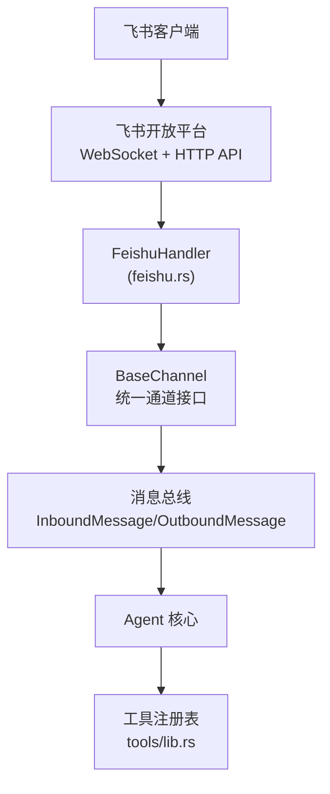
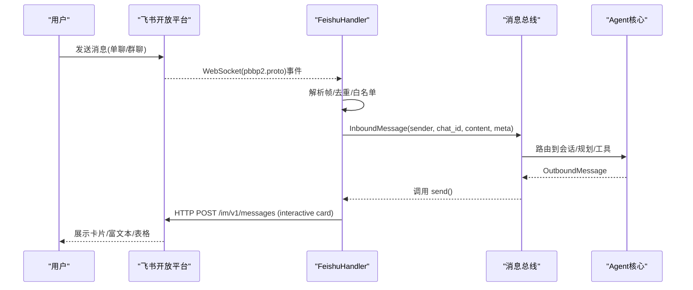
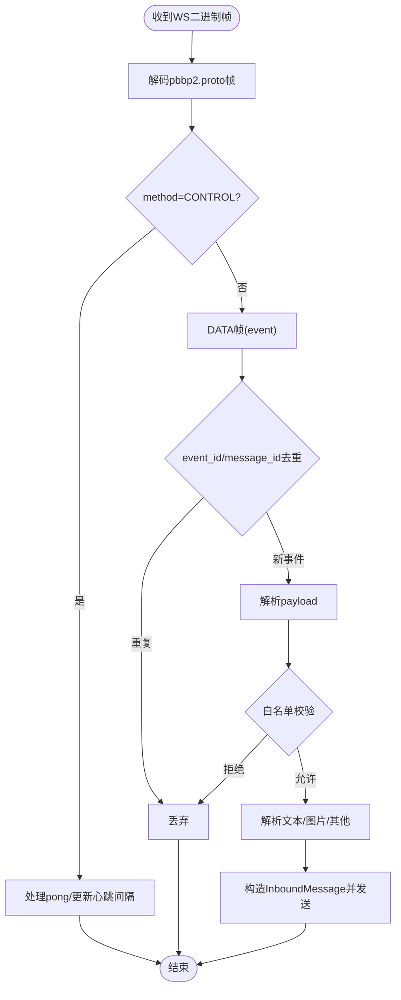
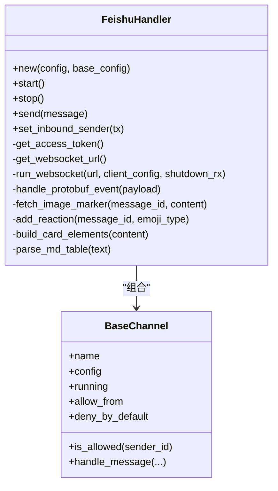

# 飞书平台实现

<cite>
**本文引用的文件**
- [agent-diva-channels/src/feishu.rs](file://agent-diva-channels/src/feishu.rs)
- [agent-diva-channels/src/base.rs](file://agent-diva-channels/src/base.rs)
- [agent-diva-channels/src/lib.rs](file://agent-diva-channels/src/lib.rs)
- [agent-diva-core/src/config/schema.rs](file://agent-diva-core/src/config/schema.rs)
- [agent-diva-gui/src/components/settings/channel-wizard-fields.ts](file://agent-diva-gui/src/components/settings/channel-wizard-fields.ts)
- [agent-diva-tools/src/lib.rs](file://agent-diva-tools/src/lib.rs)
- [agent-diva-core/src/security/policy.rs](file://agent-diva-core/src/security/policy.rs)
- [agent-diva-core/src/security/config.rs](file://agent-diva-core/src/security/config.rs)
</cite>

## 目录
1. [简介](#简介)
2. [项目结构](#项目结构)
3. [核心组件](#核心组件)
4. [架构总览](#架构总览)
5. [详细组件分析](#详细组件分析)
6. [依赖关系分析](#依赖关系分析)
7. [性能与可靠性](#性能与可靠性)
8. [安全与合规](#安全与合规)
9. [部署与运维](#部署与运维)
10. [故障排查](#故障排查)
11. [结论](#结论)

## 简介
本文件面向“飞书平台实现”，聚焦 agent-diva 中的飞书机器人适配器：基于飞书开放平台的 WebSocket 长连接（pbbp2.proto 帧）接收消息，使用 HTTP API 发送消息卡片；支持单聊、群聊、图片等基础消息类型，并具备消息去重、心跳保活、分片重组、访问白名单等能力。文档同时给出应用配置流程、消息类型支持、与飞书生态的集成建议、身份与权限控制、安全配置以及部署运维要点。

## 项目结构
- 通道适配层：位于 agent-diva-channels，提供多平台通道抽象与具体实现，其中 feishu.rs 为飞书适配器。
- 核心配置：位于 agent-diva-core/config/schema.rs，定义 FeishuConfig 等通道配置结构。
- GUI 设置向导：位于 agent-diva-gui，提供飞书通道配置的 UI 字段。
- 工具层：位于 agent-diva-tools，提供通用工具注册与扩展点，便于后续接入飞书日历、文档、审批等生态能力。
- 安全策略：位于 agent-diva-core/security，提供安全级别、路径校验、速率限制等通用安全能力。

图表来源
- [agent-diva-channels/src/feishu.rs:1-1213](file://agent-diva-channels/src/feishu.rs#L1-L1213)
- [agent-diva-channels/src/base.rs:1-422](file://agent-diva-channels/src/base.rs#L1-L422)
- [agent-diva-tools/src/lib.rs:1-74](file://agent-diva-tools/src/lib.rs#L1-L74)

章节来源
- [agent-diva-channels/src/lib.rs:1-53](file://agent-diva-channels/src/lib.rs#L1-L53)
- [agent-diva-core/src/config/schema.rs:733-751](file://agent-diva-core/src/config/schema.rs#L733-L751)

## 核心组件
- FeishuHandler：实现飞书通道的启动、停止、消息收发、鉴权、心跳、去重、图片下载、消息卡片构建等。
- BaseChannel：提供通道通用能力（名称、运行状态、入站发送、访问控制 allow_from、默认拒绝策略）。
- FeishuConfig：包含 enabled、app_id、app_secret、encrypt_key、verification_token、allow_from、port 等配置项。
- GUI 设置字段：提供 app_id、app_secret、verification_token、encrypt_key、allow_from 等可视化配置入口。

章节来源
- [agent-diva-channels/src/feishu.rs:177-214](file://agent-diva-channels/src/feishu.rs#L177-L214)
- [agent-diva-channels/src/base.rs:73-184](file://agent-diva-channels/src/base.rs#L73-L184)
- [agent-diva-core/src/config/schema.rs:733-751](file://agent-diva-core/src/config/schema.rs#L733-L751)
- [agent-diva-gui/src/components/settings/channel-wizard-fields.ts:113-146](file://agent-diva-gui/src/components/settings/channel-wizard-fields.ts#L113-L146)

## 架构总览
飞书适配器通过 WebSocket 长连接接收事件，解析 pbbp2.proto 帧，提取 im.message.receive_v1 事件，进行去重与白名单校验后，转换为 InboundMessage 推送到消息总线；回复时通过 HTTP API 发送交互式消息卡片，自动将 Markdown 表格转为飞书 table 元素。

图表来源
- [agent-diva-channels/src/feishu.rs:373-591](file://agent-diva-channels/src/feishu.rs#L373-L591)
- [agent-diva-channels/src/feishu.rs:977-1036](file://agent-diva-channels/src/feishu.rs#L977-L1036)
- [agent-diva-channels/src/base.rs:186-229](file://agent-diva-channels/src/base.rs#L186-L229)

## 详细组件分析

### 飞书适配器（FeishuHandler）
- 认证与会话
  - 获取租户访问令牌：调用 /auth/v3/tenant_access_token/internal，缓存 token 并在过期前 5 分钟刷新。
  - 获取 WebSocket URL：调用 /callback/ws/endpoint，解析 service_id 与 ping_interval。
- 连接与心跳
  - 使用 tokio_tungstenite 建立 WS 连接，按服务端返回的 ping_interval 定时发送 ping，维护 last_recv 超时检测。
  - 处理 CONTROL 帧（ping/pong），动态调整心跳间隔。
- 事件处理
  - 仅处理 im.message.receive_v1 事件，忽略其他类型。
  - 去重：优先使用 event_id，其次 message_id，TTL 600s，定期清理。
  - 白名单：基于 BaseChannel.is_allowed 检查 sender open_id。
  - 内容解析：text 类型解析 text 字段；image 类型下载并转 data URI 标记；其他类型以占位符显示。
  - 附加反应：收到消息后尝试添加点赞表情作为“已读”反馈。
- 发送消息
  - 根据 chat_id 前缀选择 receive_id_type（oc_ 为 chat_id，否则 open_id）。
  - 构建 interactive 卡片，自动识别 Markdown 表格并转换为 table 元素，其余内容以 markdown 元素呈现。
  - 错误处理：记录状态码与响应体，抛出 SendFailed。

图表来源
- [agent-diva-channels/src/feishu.rs:479-568](file://agent-diva-channels/src/feishu.rs#L479-L568)
- [agent-diva-channels/src/feishu.rs:593-708](file://agent-diva-channels/src/feishu.rs#L593-L708)
- [agent-diva-channels/src/base.rs:121-184](file://agent-diva-channels/src/base.rs#L121-L184)

章节来源
- [agent-diva-channels/src/feishu.rs:277-334](file://agent-diva-channels/src/feishu.rs#L277-L334)
- [agent-diva-channels/src/feishu.rs:336-371](file://agent-diva-channels/src/feishu.rs#L336-L371)
- [agent-diva-channels/src/feishu.rs:373-591](file://agent-diva-channels/src/feishu.rs#L373-L591)
- [agent-diva-channels/src/feishu.rs:593-708](file://agent-diva-channels/src/feishu.rs#L593-L708)
- [agent-diva-channels/src/feishu.rs:710-810](file://agent-diva-channels/src/feishu.rs#L710-L810)
- [agent-diva-channels/src/feishu.rs:812-913](file://agent-diva-channels/src/feishu.rs#L812-L913)
- [agent-diva-channels/src/feishu.rs:977-1036](file://agent-diva-channels/src/feishu.rs#L977-L1036)

### 基础通道（BaseChannel）
- 提供统一的 ChannelHandler 接口（name/is_running/start/stop/send/set_inbound_sender/is_allowed）。
- 访问控制：支持空列表默认放行或默认拒绝策略；支持通配符匹配与复合 ID（如 “id|username”）。
- 入站消息封装：统一包装 sender/chat_id/content/media/metadata 并发送到 inbound channel。

章节来源
- [agent-diva-channels/src/base.rs:9-32](file://agent-diva-channels/src/base.rs#L9-L32)
- [agent-diva-channels/src/base.rs:73-184](file://agent-diva-channels/src/base.rs#L73-L184)
- [agent-diva-channels/src/base.rs:186-229](file://agent-diva-channels/src/base.rs#L186-L229)

### 配置与GUI
- FeishuConfig：包含 enabled、app_id、app_secret、encrypt_key、verification_token、allow_from、port。
- GUI 设置向导：提供上述字段的输入控件，其中 secret 字段标记为敏感信息。

章节来源
- [agent-diva-core/src/config/schema.rs:733-751](file://agent-diva-core/src/config/schema.rs#L733-L751)
- [agent-diva-gui/src/components/settings/channel-wizard-fields.ts:113-146](file://agent-diva-gui/src/components/settings/channel-wizard-fields.ts#L113-L146)

## 依赖关系分析
- 外部依赖
  - WebSocket：tokio_tungstenite
  - Protobuf：prost/prost_derive
  - HTTP：reqwest
  - JSON：serde/serde_json
  - 正则：regex
  - 日志：tracing
- 内部依赖
  - BaseChannel：统一通道接口与访问控制
  - 消息总线：InboundMessage/OutboundMessage
  - 工具注册表：用于未来扩展飞书生态工具（日历、文档、审批等）

图表来源
- [agent-diva-channels/src/feishu.rs:177-214](file://agent-diva-channels/src/feishu.rs#L177-L214)
- [agent-diva-channels/src/base.rs:73-184](file://agent-diva-channels/src/base.rs#L73-L184)

章节来源
- [agent-diva-channels/src/feishu.rs:1-1213](file://agent-diva-channels/src/feishu.rs#L1-L1213)
- [agent-diva-channels/src/base.rs:1-422](file://agent-diva-channels/src/base.rs#L1-L422)

## 性能与可靠性
- 心跳与超时
  - 动态 ping_interval，默认最小 10s；超过 300s 无数据视为超时并重连。
- 分片重组
  - 对大数据量事件采用 seq/sum 分片，按 message_id 聚合，5 分钟内未收齐则丢弃。
- 去重
  - 基于 event_id 优先、message_id 兜底的去重键，TTL 600s，周期性清理。
- 连接恢复
  - WS 断开或读取错误自动重连，指数退避未实现但固定 5s 重试。
- 发送限流
  - 当前未内置速率限制，建议在网关或上游做限流保护。

[本节为通用指导，不直接分析具体文件]

## 安全与合规
- 身份与访问控制
  - 通道级白名单：allow_from 支持精确匹配与通配符，支持复合 ID。
  - 默认策略：可配置 deny_by_default，空列表时默认放行或拒绝。
- 安全级别与策略
  - 提供 SecurityLevel（Permissive/Standard/Strict/Paranoid），不同级别影响读写、Shell 访问、速率限制等。
  - 路径校验：禁止空字节、路径穿越、URL 编码穿越、危险前缀等。
- 密钥与加密
  - 配置中包含 encrypt_key、verification_token 等，GUI 中作为敏感字段隐藏。
  - 建议在生产环境启用传输加密（HTTPS/WSS），并限制回调域名与 IP 白名单。
- 审计与脱敏
  - 日志与控制台输出会打码敏感字段（如 token、authorization），避免泄露。

章节来源
- [agent-diva-channels/src/base.rs:121-184](file://agent-diva-channels/src/base.rs#L121-L184)
- [agent-diva-core/src/security/config.rs:11-49](file://agent-diva-core/src/security/config.rs#L11-L49)
- [agent-diva-core/src/security/policy.rs:74-93](file://agent-diva-core/src/security/policy.rs#L74-L93)
- [agent-diva-core/src/security/policy.rs:293-363](file://agent-diva-core/src/security/policy.rs#L293-L363)
- [agent-diva-gui/src/components/settings/channel-wizard-fields.ts:113-146](file://agent-diva-gui/src/components/settings/channel-wizard-fields.ts#L113-L146)

## 部署与运维
- 应用创建与权限
  - 在飞书开放平台创建企业自建应用，获取 App ID 与 App Secret。
  - 开启“消息接收模式”为“WebSocket 长连接”，无需公网 IP。
  - 按需申请 IM、云文档、日历、审批等能力权限（见“与飞书生态集成”）。
- Webhook/回调设置
  - WebSocket 模式下无需配置回调地址；HTTP API 调用由服务端主动发起。
- 配置项
  - 在 channels.feishu 下配置 enabled、app_id、app_secret、encrypt_key、verification_token、allow_from、port（Webhook 模式保留兼容）。
- 日志与监控
  - 使用 tracing 输出调试/告警信息；建议集中收集日志并设置保留天数。
  - 监控 WS 连接状态、心跳超时、token 刷新失败、API 错误率。
- 性能优化建议
  - 合理设置心跳间隔与超时阈值；对大消息启用分片重组；限制并发请求数；对高频场景增加缓存与节流。

章节来源
- [agent-diva-core/src/config/schema.rs:733-751](file://agent-diva-core/src/config/schema.rs#L733-L751)
- [agent-diva-channels/src/feishu.rs:277-334](file://agent-diva-channels/src/feishu.rs#L277-L334)
- [agent-diva-channels/src/feishu.rs:373-591](file://agent-diva-channels/src/feishu.rs#L373-L591)

## 故障排查
- 无法获取 Token
  - 检查 app_id/app_secret 是否正确；查看 /auth/v3/tenant_access_token/internal 返回码与 msg。
- WebSocket 连接失败
  - 检查网络连通性；确认 /callback/ws/endpoint 返回有效 URL；关注重连日志。
- 事件未处理
  - 确认事件类型为 im.message.receive_v1；检查去重键是否命中；核对 allow_from 白名单。
- 图片无法下载
  - 检查 image_key 是否存在；确认 Authorization 头携带有效 token；查看下载状态码。
- 消息发送失败
  - 检查 receive_id_type 是否与 chat_id 前缀匹配；查看 HTTP 状态码与响应体；确认卡片格式合法。

章节来源
- [agent-diva-channels/src/feishu.rs:277-334](file://agent-diva-channels/src/feishu.rs#L277-L334)
- [agent-diva-channels/src/feishu.rs:336-371](file://agent-diva-channels/src/feishu.rs#L336-L371)
- [agent-diva-channels/src/feishu.rs:593-708](file://agent-diva-channels/src/feishu.rs#L593-L708)
- [agent-diva-channels/src/feishu.rs:710-810](file://agent-diva-channels/src/feishu.rs#L710-L810)
- [agent-diva-channels/src/feishu.rs:977-1036](file://agent-diva-channels/src/feishu.rs#L977-L1036)

## 与飞书生态的集成（建议与扩展）
当前适配器主要覆盖 IM 消息收发与卡片渲染。对于日历、文档、审批、云文档、多维表格等能力，建议通过工具层扩展：
- 工具注册与执行
  - 在 tools/lib.rs 中注册新的飞书生态工具（如 calendar_create、doc_read、approval_submit、bitable_record_list 等），由 Agent 在需要时调用。
- 典型工作流
  - 日历：创建日程、查询日程、更新参会人。
  - 文档：读取云文档内容、写入笔记、生成报告。
  - 审批：提交审批、查询审批状态、回调处理。
  - 多维表格：列出表格、新增/更新行、导出结果。
- 安全与权限
  - 所有工具调用需经过安全策略校验（SecurityPolicy），遵循最小权限原则。
  - 敏感操作引入审批流程（Planning/Approval），结合 GUI 审批卡片。

章节来源
- [agent-diva-tools/src/lib.rs:1-74](file://agent-diva-tools/src/lib.rs#L1-L74)
- [agent-diva-core/src/security/policy.rs:37-93](file://agent-diva-core/src/security/policy.rs#L37-L93)

## 结论
本实现以 WebSocket 长连接为核心，稳定可靠地接入飞书 IM，支持消息去重、心跳保活、分片重组与卡片渲染，满足日常单聊/群聊交互需求。配合 BaseChannel 的访问控制与安全策略，可在企业环境中安全部署。未来可通过工具层扩展飞书日历、文档、审批、多维表格等生态能力，形成更完整的自动化工作流。