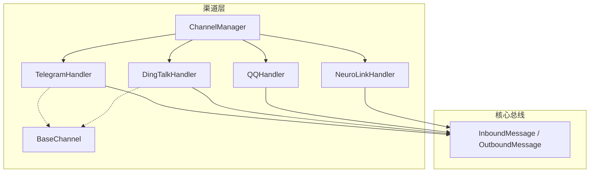
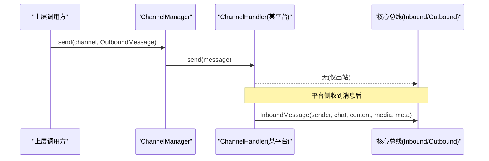
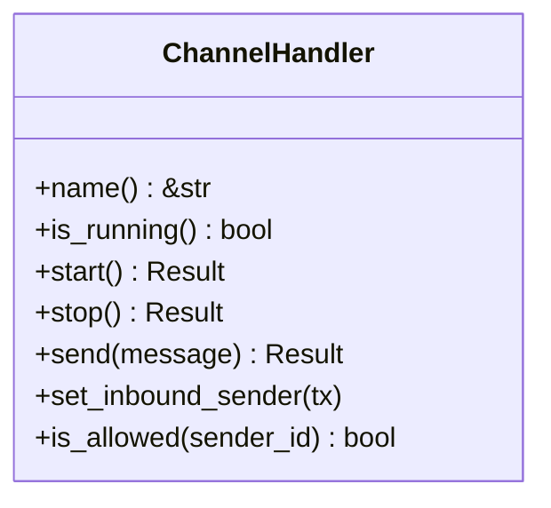
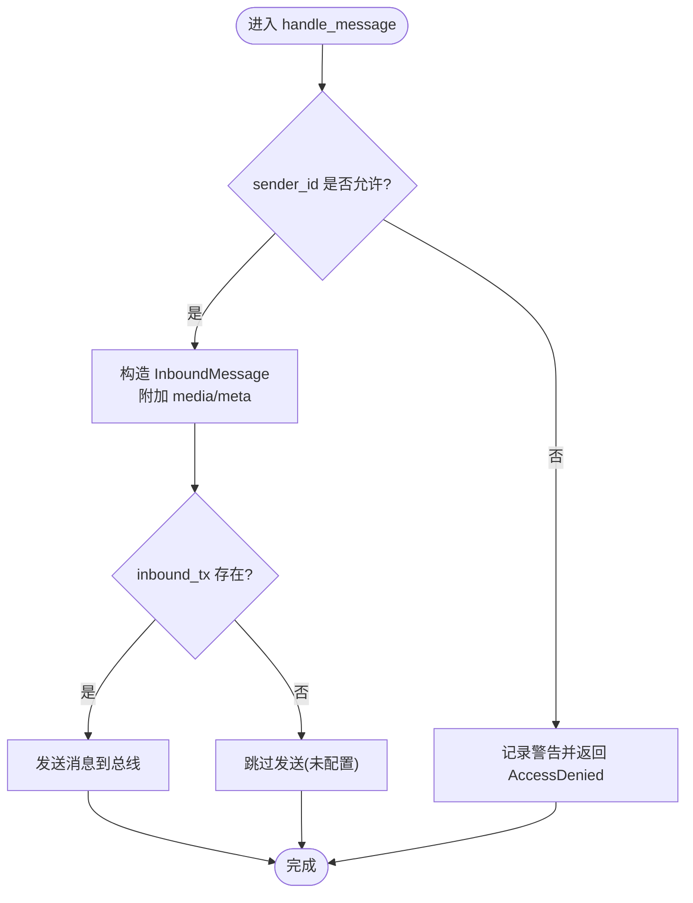
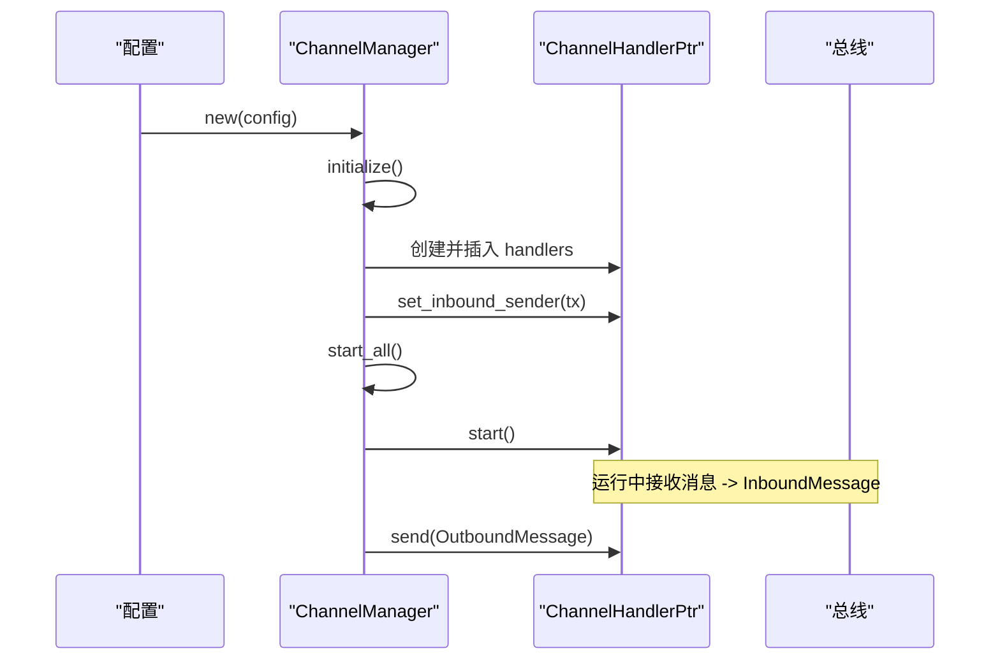
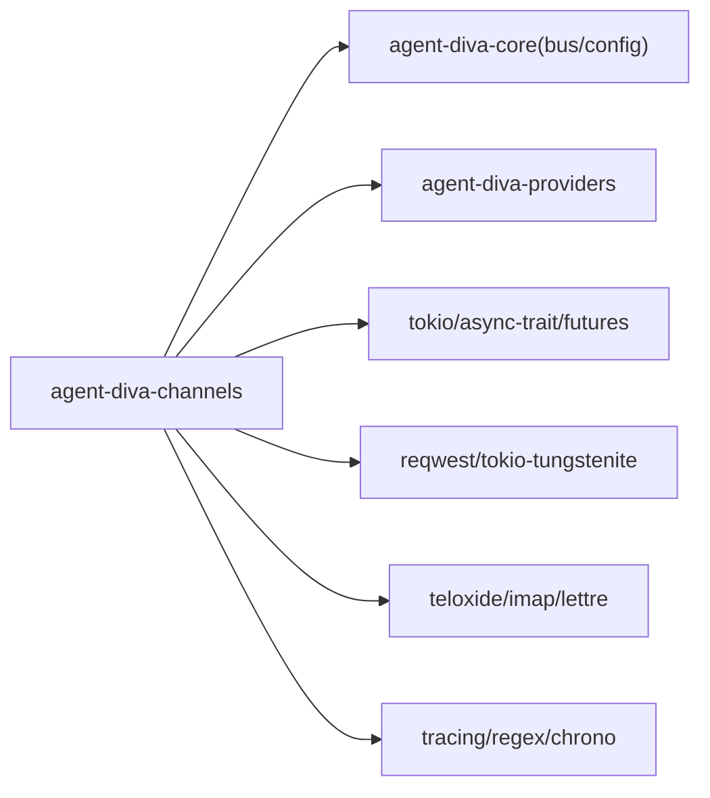

# 渠道核心架构

<cite>
**本文引用的文件**
- [lib.rs](file://agent-diva-channels/src/lib.rs)
- [base.rs](file://agent-diva-channels/src/base.rs)
- [manager.rs](file://agent-diva-channels/src/manager.rs)
- [Cargo.toml](file://agent-diva-channels/Cargo.toml)
- [telegram.rs](file://agent-diva-channels/src/telegram.rs)
- [dingtalk.rs](file://agent-diva-channels/src/dingtalk.rs)
- [qq.rs](file://agent-diva-channels/src/qq.rs)
- [neuro_link.rs](file://agent-diva-channels/src/neuro_link.rs)
- [common/mod.rs](file://agent-diva-channels/src/common/mod.rs)
</cite>

## 目录
1. [简介](#简介)
2. [项目结构](#项目结构)
3. [核心组件](#核心组件)
4. [架构总览](#架构总览)
5. [详细组件分析](#详细组件分析)
6. [依赖关系分析](#依赖关系分析)
7. [性能考量](#性能考量)
8. [故障排查指南](#故障排查指南)
9. [结论](#结论)
10. [附录：Channel 接口 API 参考与使用示例](#附录channel-接口-api-参考与使用示例)

## 简介
本文件面向“渠道核心架构”，聚焦 agent-diva-channels 子模块，系统性阐述 Channel trait 接口设计、BaseChannel 基础实现、ChannelHandler 智能指针管理与生命周期控制，并覆盖消息格式转换、认证机制、重连策略等关键概念。同时提供 Channel 接口的完整 API 参考与使用示例，帮助读者快速理解与扩展新的渠道适配器。

## 项目结构
agent-diva-channels 以“统一抽象 + 多平台适配”的方式组织代码：
- base：定义 ChannelHandler trait、BaseChannel 通用能力、错误类型与校验工具
- manager：集中管理所有渠道的初始化、启动、停止、动态更新与发送路由
- common：HTTP 客户端构建、媒体下载等通用能力
- 各平台实现：如 telegram、dingtalk、qq、neuro_link 等，均实现 ChannelHandler 并复用 BaseChannel 或自身逻辑
- Cargo features：对未验证渠道（slack、whatsapp、matrix、irc、mattermost、nextcloud_talk）默认不编译，需显式启用 feature

图表来源
- [manager.rs:361-642](file://agent-diva-channels/src/manager.rs#L361-L642)
- [base.rs:73-233](file://agent-diva-channels/src/base.rs#L73-L233)
- [telegram.rs:36-127](file://agent-diva-channels/src/telegram.rs#L36-L127)
- [dingtalk.rs:154-187](file://agent-diva-channels/src/dingtalk.rs#L154-L187)
- [qq.rs:153-200](file://agent-diva-channels/src/qq.rs#L153-L200)
- [neuro_link.rs:82-114](file://agent-diva-channels/src/neuro_link.rs#L82-L114)

章节来源
- [lib.rs:1-53](file://agent-diva-channels/src/lib.rs#L1-L53)
- [Cargo.toml:11-20](file://agent-diva-channels/Cargo.toml#L11-L20)

## 核心组件
- ChannelHandler trait：定义渠道的统一行为模型（名称、运行态、启动/停止、发送消息、设置入站通道、访问控制）
- BaseChannel：提供通用的允许列表匹配、消息封装与转发、会话键与主机校验等能力
- ChannelManager：负责按配置发现、创建、启动、停止、更新各渠道实例，并提供统一发送入口
- 具体 Handler：各平台实现 ChannelHandler，处理协议细节（鉴权、心跳、重连、消息编解码等），并通过 BaseChannel 或自有逻辑将入站消息推送到总线

章节来源
- [base.rs:9-71](file://agent-diva-channels/src/base.rs#L9-L71)
- [base.rs:73-233](file://agent-diva-channels/src/base.rs#L73-L233)
- [manager.rs:42-755](file://agent-diva-channels/src/manager.rs#L42-L755)

## 架构总览
渠道层通过 ChannelManager 统一管理多个 ChannelHandler 实例；每个 Handler 负责与外部平台交互，将收到的消息转换为 InboundMessage 推送到核心总线；上层通过 OutboundMessage 经由 Manager 路由到指定渠道进行发送。

图表来源
- [manager.rs:688-697](file://agent-diva-channels/src/manager.rs#L688-L697)
- [base.rs:186-229](file://agent-diva-channels/src/base.rs#L186-L229)

## 详细组件分析

### Channel trait 接口设计与生命周期
- 名称与状态：name() 返回渠道标识；is_running() 表示当前是否处于运行态
- 生命周期：start() 建立连接/监听；stop() 释放资源/关闭连接
- 消息流：send() 用于出站；set_inbound_sender() 注入入站通道；内部收到消息后构造 InboundMessage 并发送
- 访问控制：is_allowed() 基于 allow_from 与 deny_by_default 策略判断 sender_id

图表来源
- [base.rs:9-32](file://agent-diva-channels/src/base.rs#L9-L32)

章节来源
- [base.rs:9-71](file://agent-diva-channels/src/base.rs#L9-L71)

### BaseChannel 基础实现与通用功能
- 允许列表与默认策略：allow_from 为空时，由 deny_by_default 决定“默认拒绝/允许”；支持通配符匹配（含 Matrix ID 特殊处理）与复合 ID（如 “uid|username”）
- 消息封装：handle_message() 完成权限检查、媒体与元数据附加、发送到 inbound_tx
- 校验工具：validate_session_key() 校验会话密钥格式；validate_neurolink_host() 限制 Neuro-Link 仅绑定本地地址

图表来源
- [base.rs:121-184](file://agent-diva-channels/src/base.rs#L121-L184)
- [base.rs:186-229](file://agent-diva-channels/src/base.rs#L186-L229)

章节来源
- [base.rs:73-233](file://agent-diva-channels/src/base.rs#L73-L233)

### ChannelHandler 智能指针管理与生命周期控制
- 统一句柄类型：ChannelHandlerPtr = Arc<RwLock<dyn ChannelHandler>>，保证并发安全与共享引用
- 管理器职责：
  - initialize()：根据配置创建并注册各渠道实例，注入 inbound_tx
  - start_all()/stop_all()：批量启动/停止
  - update_channel()：热更新单个渠道（先停旧再建新）
  - get_handler()/list_channels()/is_channel_running()：查询与状态检查
  - send()：按渠道名路由出站消息

图表来源
- [manager.rs:361-642](file://agent-diva-channels/src/manager.rs#L361-L642)
- [manager.rs:644-697](file://agent-diva-channels/src/manager.rs#L644-L697)

章节来源
- [manager.rs:42-755](file://agent-diva-channels/src/manager.rs#L42-L755)

### 消息格式转换与平台适配
- Telegram：将 Markdown 内容转换为 HTML 以适配 Telegram 解析规则；维护命令分发与打字指示器任务
- DingTalk：基于 Stream WebSocket 接收消息，HTTP API 发送；实现消息去重、Markdown 支持、私聊/群聊兼容
- QQ：WebSocket Gateway 连接，自动重连、心跳 ACK、Token 刷新、会话恢复（identify/resume）
- Neuro-Link：本地 TCP+WS 服务器，接收第三方 pipe 消息，转发为 InboundMessage；限制 localhost 绑定

章节来源
- [telegram.rs:151-200](file://agent-diva-channels/src/telegram.rs#L151-L200)
- [dingtalk.rs:1-166](file://agent-diva-channels/src/dingtalk.rs#L1-L166)
- [qq.rs:1-200](file://agent-diva-channels/src/qq.rs#L1-L200)
- [neuro_link.rs:1-114](file://agent-diva-channels/src/neuro_link.rs#L1-L114)

### 认证机制
- 统一错误类型：ChannelError::AuthError 用于认证失败场景
- 平台认证：
  - QQ：通过 HTTP 获取 access_token，缓存过期时间，支持环境变量覆盖
  - DingTalk：client_id/client_secret 获取访问令牌，管理有效期
  - Neuro-Link：仅允许本地地址绑定，避免暴露风险

章节来源
- [base.rs:34-71](file://agent-diva-channels/src/base.rs#L34-L71)
- [qq.rs:79-132](file://agent-diva-channels/src/qq.rs#L79-L132)
- [dingtalk.rs:40-76](file://agent-diva-channels/src/dingtalk.rs#L40-L76)
- [base.rs:255-268](file://agent-diva-channels/src/base.rs#L255-L268)

### 重连策略与健壮性
- QQ：实现指数退避与冷却期，区分 connect_failed/reconnect/invalid_session/heartbeat_timeout 等退出原因，支持 resume 恢复会话
- DingTalk：Stream 模式长连接，结合心跳与重试逻辑保障稳定性
- 通用：通过 ChannelError 分类错误，便于上层监控与告警

章节来源
- [qq.rs:31-49](file://agent-diva-channels/src/qq.rs#L31-L49)
- [qq.rs:168-200](file://agent-diva-channels/src/qq.rs#L168-L200)
- [dingtalk.rs:154-200](file://agent-diva-channels/src/dingtalk.rs#L154-L200)

## 依赖关系分析
- 运行时与异步：tokio、async-trait、futures
- 序列化：serde、serde_json
- 网络：reqwest、tokio-tungstenite、teloxide（Telegram）、imap/lettre（Email）
- 日志与工具：tracing、regex、chrono、dirs、uuid、mime_guess
- 特性开关：通过 Cargo features 控制未验证渠道编译与注入

图表来源
- [Cargo.toml:22-76](file://agent-diva-channels/Cargo.toml#L22-L76)

章节来源
- [Cargo.toml:11-84](file://agent-diva-channels/Cargo.toml#L11-L84)

## 性能考量
- 并发模型：ChannelHandlerPtr 使用 Arc<RwLock<...>> 保证并发读写安全；Manager 在启动/停止时持有写锁，查询时读锁
- I/O 超时：HTTP 客户端默认 30s 超时，降低阻塞风险
- 内存与去重：DingTalk/QQ 等实现消息去重队列，避免重复处理
- 资源清理：stop_all() 确保所有渠道正确释放资源，避免泄漏

[本节为通用指导，不直接分析具体文件]

## 故障排查指南
- 常见错误类型：NotConfigured、InvalidConfig、ConnectionFailed、ConnectionError、AuthError、SendError、AccessDenied
- 定位步骤：
  - 检查渠道是否已启用且必填字段齐全（ChannelValidation）
  - 查看 is_allowed() 策略是否正确配置 allow_from 与 deny_by_default
  - 关注日志中的连接/认证/发送错误信息
  - 对于 Neuro-Link，确认 host 是否为 localhost/127.0.0.1
- 工具函数：validate_session_key()、validate_neurolink_host()

章节来源
- [base.rs:34-71](file://agent-diva-channels/src/base.rs#L34-L71)
- [manager.rs:59-163](file://agent-diva-channels/src/manager.rs#L59-L163)
- [base.rs:239-268](file://agent-diva-channels/src/base.rs#L239-L268)

## 结论
该渠道核心架构通过统一的 ChannelHandler 抽象与 BaseChannel 通用能力，实现了多平台接入的一致性；ChannelManager 提供了强大的生命周期管理与路由能力；各平台 Handler 专注协议细节与健壮性（认证、心跳、重连）。整体设计清晰、可扩展性强，适合持续集成更多渠道。

[本节为总结性内容，不直接分析具体文件]

## 附录：Channel 接口 API 参考与使用示例

### ChannelHandler 接口
- name() -> &str：渠道名称
- is_running() -> bool：是否运行中
- start() -> Result<()>：启动渠道（建立连接/监听）
- stop() -> Result<()>：停止渠道（释放资源）
- send(message: OutboundMessage) -> Result<()>：发送出站消息
- set_inbound_sender(tx: mpsc::Sender<InboundMessage>)：注入入站通道
- is_allowed(sender_id: &str) -> bool：访问控制判断

章节来源
- [base.rs:9-32](file://agent-diva-channels/src/base.rs#L9-L32)

### BaseChannel 常用方法
- new(name, config, allow_from)：创建基础渠道（默认 deny_by_default=false）
- with_default_policy(name, config, allow_from, deny_by_default)：自定义默认策略
- set_inbound_sender(tx)：设置入站通道
- is_allowed(sender_id)：基于 allow_from 与 deny_by_default 判断
- handle_message(sender_id, chat_id, content, media, metadata)：封装并发送入站消息

章节来源
- [base.rs:73-233](file://agent-diva-channels/src/base.rs#L73-L233)

### ChannelManager 常用方法
- new(config)：创建管理器
- set_inbound_sender(tx)：设置入站通道
- initialize()：按配置初始化渠道
- start_all()：启动所有渠道
- stop_all()：停止所有渠道
- get_handler(name)：获取渠道句柄
- send(channel, message)：向指定渠道发送消息
- update_channel(name, new_config)：热更新渠道配置
- is_channel_running(name)：查询渠道运行状态
- list_channels()：列出已注册渠道

章节来源
- [manager.rs:361-755](file://agent-diva-channels/src/manager.rs#L361-L755)

### 使用示例（流程说明）
- 初始化：创建 Config，构造 ChannelManager，调用 initialize() 与 start_all()
- 发送消息：通过 Manager.send("channel_name", OutboundMessage) 发送
- 接收消息：各 Handler 将平台消息转为 InboundMessage 推送到总线，上层消费
- 动态更新：调用 update_channel("channel_name", new_config) 实现热更新

章节来源
- [manager.rs:361-642](file://agent-diva-channels/src/manager.rs#L361-L642)
- [manager.rs:688-735](file://agent-diva-channels/src/manager.rs#L688-L735)