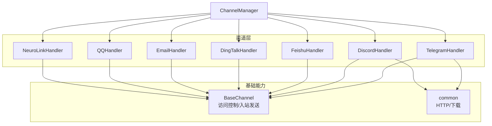
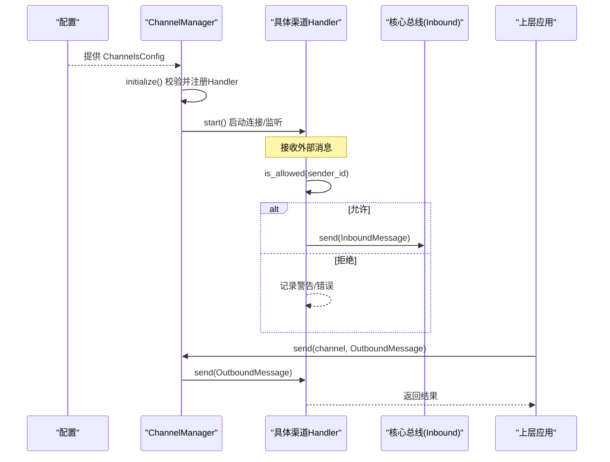
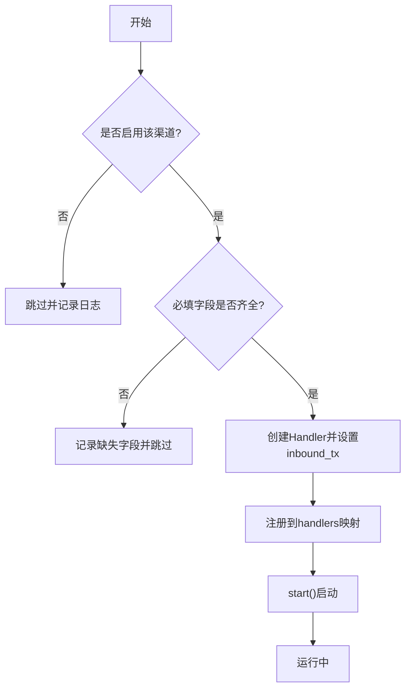
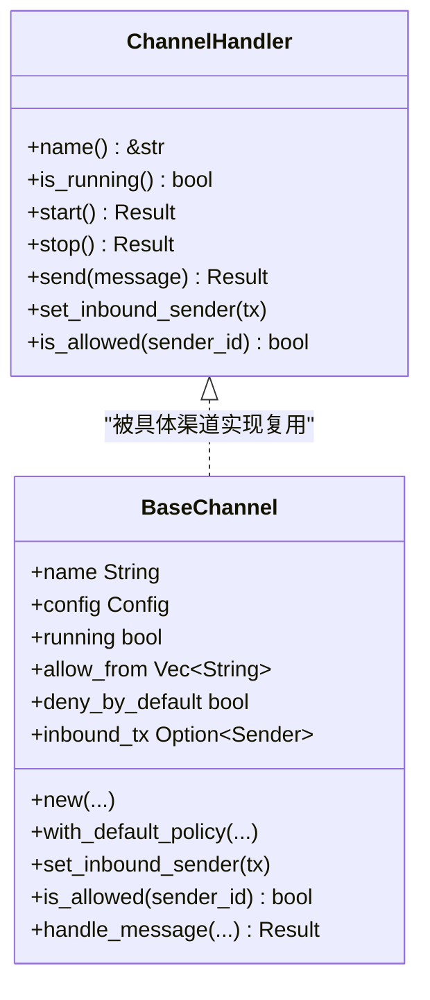
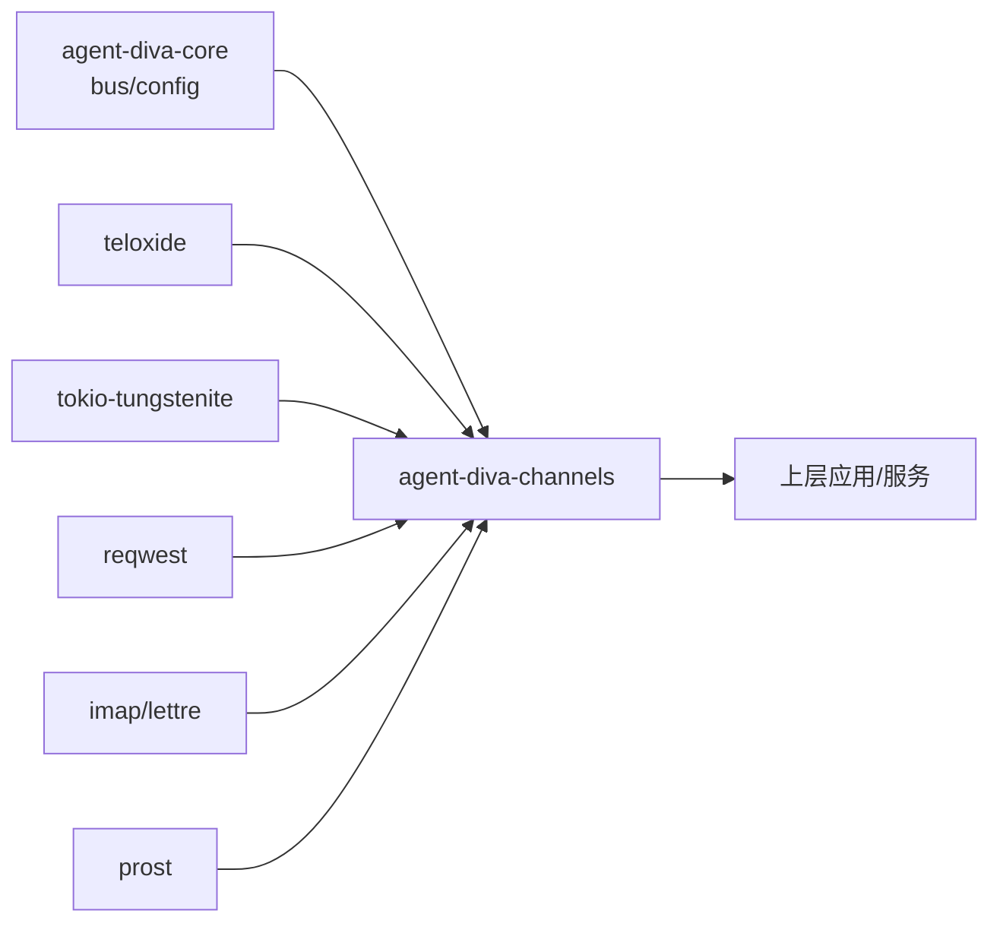

# 渠道管理器

<cite>
**本文引用的文件**
- [manager.rs](file://agent-diva-channels/src/manager.rs)
- [base.rs](file://agent-diva-channels/src/base.rs)
- [lib.rs](file://agent-diva-channels/src/lib.rs)
- [Cargo.toml](file://agent-diva-channels/Cargo.toml)
- [telegram.rs](file://agent-diva-channels/src/telegram.rs)
- [discord.rs](file://agent-diva-channels/src/discord.rs)
- [common/mod.rs](file://agent-diva-channels/src/common/mod.rs)
- [bus/mod.rs](file://agent-diva-core/src/bus/mod.rs)
- [schema.rs](file://agent-diva-core/src/config/schema.rs)
</cite>

## 目录
1. [简介](#简介)
2. [项目结构](#项目结构)
3. [核心组件](#核心组件)
4. [架构总览](#架构总览)
5. [详细组件分析](#详细组件分析)
6. [依赖关系分析](#依赖关系分析)
7. [性能考量](#性能考量)
8. [故障排查指南](#故障排查指南)
9. [结论](#结论)
10. [附录](#附录)

## 简介
本文件面向 agent-diva 的“渠道管理器”子系统，系统性说明 ChannelManager 的职责与工作流程，覆盖渠道注册、生命周期管理、消息路由机制；并阐述多渠道并发处理、资源分配、故障转移策略；同时给出渠道状态监控、健康检查、自动恢复机制，以及配置管理、动态启停、性能监控等高级功能的使用说明。读者无需深入源码即可理解整体设计与使用方式。

## 项目结构
渠道管理器位于 agent-diva-channels 包中，采用“统一接口 + 多实现 + 集中管理”的分层设计：
- base：定义统一的 ChannelHandler 接口与通用 BaseChannel 基类，提供入站消息发送、访问控制（allow_from）、默认拒绝策略等能力。
- manager：ChannelManager 负责按配置初始化、启动、停止、更新各渠道处理器，并提供消息发送与查询能力。
- 具体渠道实现：如 Telegram、Discord、飞书、钉钉、邮箱、QQ、Neuro-link 等，各自实现 ChannelHandler 接口。
- common：提供 HTTP 客户端构建、媒体下载等通用工具。
- lib：对外暴露模块与类型，便于上层集成。
- Cargo.toml：通过 feature 开关控制可选渠道编译与注入。

图表来源
- [manager.rs:42-755](file://agent-diva-channels/src/manager.rs#L42-L755)
- [base.rs:9-233](file://agent-diva-channels/src/base.rs#L9-L233)
- [common/mod.rs:5-51](file://agent-diva-channels/src/common/mod.rs#L5-L51)

章节来源
- [lib.rs:1-53](file://agent-diva-channels/src/lib.rs#L1-L53)
- [Cargo.toml:11-20](file://agent-diva-channels/Cargo.toml#L11-L20)

## 核心组件
- ChannelHandler 接口：定义 name、is_running、start、stop、send、set_inbound_sender、is_allowed 等统一方法，所有渠道必须实现。
- BaseChannel：提供通用的 allow_from 白名单匹配（支持通配符与复合 ID）、默认拒绝策略、入站消息封装与发送。
- ChannelManager：集中管理所有渠道的生命周期与路由，负责根据配置初始化、启动、停止、更新单个渠道，并提供 send、list_channels、is_channel_running 等能力。
- 渠道实现：以 Telegram、Discord 为代表，分别对接平台协议（Bot API/Gateway、WebSocket 等），将外部事件转换为 InboundMessage 并通过通道发送给核心。

章节来源
- [base.rs:9-233](file://agent-diva-channels/src/base.rs#L9-L233)
- [manager.rs:42-755](file://agent-diva-channels/src/manager.rs#L42-L755)
- [telegram.rs:36-127](file://agent-diva-channels/src/telegram.rs#L36-L127)
- [discord.rs:113-135](file://agent-diva-channels/src/discord.rs#L113-L135)

## 架构总览
渠道管理器作为“适配器层”，屏蔽不同平台的差异，向上提供统一的消息收发与生命周期管理能力。其关键流程如下：
- 初始化：读取全局配置，校验每个渠道的 enabled 与必填字段，构造对应 Handler 并注册到内部映射表。
- 启动：遍历已注册的 Handler，调用 start 建立连接或监听。
- 入站路由：各 Handler 收到消息后，经 BaseChannel 进行权限校验，封装为 InboundMessage 并通过 mpsc 发送到核心总线。
- 出站路由：上层通过 ChannelManager.send 指定 channel 名称发送 OutboundMessage，由对应 Handler 完成实际投递。
- 动态更新：update_channel 支持运行时替换某个渠道的配置，先停止旧实例再创建并启动新实例。

图表来源
- [manager.rs:378-642](file://agent-diva-channels/src/manager.rs#L378-L642)
- [manager.rs:689-697](file://agent-diva-channels/src/manager.rs#L689-L697)
- [base.rs:186-229](file://agent-diva-channels/src/base.rs#L186-L229)
- [bus/mod.rs:1-14](file://agent-diva-core/src/bus/mod.rs#L1-L14)

## 详细组件分析

### ChannelManager 职责与工作流
- 配置校验与可配置渠道清单：channel_validation 针对每种渠道检查 enabled 与必填字段，configured_channel_names 仅返回“就绪”的渠道名。
- 初始化与注册：initialize 按配置逐项创建 Handler，设置 inbound_tx，插入 handlers 映射表。
- 启动与停止：start_all 并行启动所有 Handler；stop_all 逐个停止并清空映射。
- 动态更新：update_channel 先停止并移除旧实例，再基于新配置构建并启动新实例。
- 消息路由：send 根据 channel 名称查找 Handler 并转发 OutboundMessage。
- 状态查询：is_channel_running、list_channels 用于监控与运维。

图表来源
- [manager.rs:59-163](file://agent-diva-channels/src/manager.rs#L59-L163)
- [manager.rs:378-642](file://agent-diva-channels/src/manager.rs#L378-L642)
- [manager.rs:645-680](file://agent-diva-channels/src/manager.rs#L645-L680)

章节来源
- [manager.rs:59-163](file://agent-diva-channels/src/manager.rs#L59-L163)
- [manager.rs:378-642](file://agent-diva-channels/src/manager.rs#L378-L642)
- [manager.rs:645-755](file://agent-diva-channels/src/manager.rs#L645-L755)

### 渠道处理器基类与访问控制
- 访问控制策略：BaseChannel.is_allowed 支持空列表时的“默认允许/默认拒绝”策略，以及 allow_from 列表的通配符匹配（含 Matrix ID 特殊处理）和复合 ID（如 “id|username”）。
- 入站消息封装：handle_message 在通过权限校验后，组装 InboundMessage（包含 sender_id、chat_id、content、media、metadata），并通过 inbound_tx 发送至核心。
- 安全校验：validate_session_key、validate_neurolink_host 对敏感参数进行格式与安全限制。

图表来源
- [base.rs:9-233](file://agent-diva-channels/src/base.rs#L9-L233)

章节来源
- [base.rs:9-233](file://agent-diva-channels/src/base.rs#L9-L233)

### Telegram 渠道实现要点
- 命令与交互：支持 /start、/reset、/help、/stop 等命令，/stop 通过本地 API 通知系统停止生成。
- 消息处理：Markdown 转 HTML 适配 Telegram 渲染；维护 typing indicator 任务；维护 chat_id 映射。
- 接入方式：基于 teloxide 框架，使用 Bot Token 建立长连接与消息分发。

章节来源
- [telegram.rs:18-127](file://agent-diva-channels/src/telegram.rs#L18-L127)
- [telegram.rs:151-200](file://agent-diva-channels/src/telegram.rs#L151-L200)

### Discord 渠道实现要点
- 接入方式：通过 Gateway WebSocket 实时收消息，REST API 发消息；维护心跳、会话续连、序列号等。
- 群组策略：支持 mention_only、group_reply_allowed_sender_ids 等精细控制；过滤机器人消息与自身提及。
- 附件与大小限制：内置最大附件大小与消息长度限制，保障稳定性。

章节来源
- [discord.rs:1-135](file://agent-diva-channels/src/discord.rs#L1-L135)
- [discord.rs:190-200](file://agent-diva-channels/src/discord.rs#L190-L200)

### 通用工具与媒体处理
- HTTP 客户端：create_http_client 提供带超时的标准客户端。
- 媒体下载：download_file 将 URL 内容下载到用户目录下的 media 文件夹，路径安全化并持久化。

章节来源
- [common/mod.rs:5-51](file://agent-diva-channels/src/common/mod.rs#L5-L51)

## 依赖关系分析
- 模块耦合：
  - manager 依赖 base 提供的接口与通用能力，依赖各具体渠道实现。
  - 具体渠道实现依赖 core 的 bus 与 config schema，以及第三方 SDK（teloxide、reqwest、tokio-tungstenite 等）。
  - common 提供跨渠道复用的网络与文件系统能力。
- 外部依赖：
  - 通过 Cargo features 控制可选渠道编译（如 slack、whatsapp、matrix、irc、mattermost、nextcloud-talk）。
  - 邮件通道依赖 imap/lettre/mail-parser；飞书通道依赖 prost/prost-derive；Telegram 依赖 teloxide；Discord 依赖 tokio-tungstenite。

图表来源
- [Cargo.toml:22-76](file://agent-diva-channels/Cargo.toml#L22-L76)
- [bus/mod.rs:1-14](file://agent-diva-core/src/bus/mod.rs#L1-L14)
- [schema.rs:607-806](file://agent-diva-core/src/config/schema.rs#L607-L806)

章节来源
- [Cargo.toml:11-20](file://agent-diva-channels/Cargo.toml#L11-L20)
- [Cargo.toml:22-76](file://agent-diva-channels/Cargo.toml#L22-L76)

## 性能考量
- 并发模型：ChannelManager 使用 RwLock 保护 handlers 映射，读多写少场景下具备良好并发性能；各 Handler 内部通常基于异步任务与事件循环，避免阻塞。
- 资源隔离：每个渠道独立连接与会话，失败互不影响；start_all 收集失败但不中断其他渠道启动。
- 内存与带宽：Discord/Telegram 等通道注意消息体与附件大小限制；download_file 落盘避免大对象常驻内存。
- 建议优化：
  - 合理设置超时与重试策略（HTTP/WebSocket）。
  - 对高频消息通道增加限流与去重。
  - 对大型附件进行分块与压缩。

[本节为通用指导，不直接分析具体文件]

## 故障排查指南
- 渠道未启动：
  - 检查配置中的 enabled 与必填字段是否齐全；若缺失，initialize 会记录跳过原因。
  - 使用 list_channels 与 is_channel_running 确认当前活跃渠道。
- 消息被拒绝：
  - 检查 BaseChannel 的 allow_from 与 deny_by_default 策略；必要时添加 sender_id 或使用通配符匹配。
- 发送失败：
  - send 返回的错误类型包括 NotConfigured、NotRunning、ApiError、SendError 等，定位具体渠道与错误信息。
- 动态更新失败：
  - update_channel 会先 stop 旧实例再启动新实例；若失败，查看日志中“Failed to stop/start”提示。
- 常见错误定位：
  - 通道未配置：ChannelError::NotConfigured
  - 通道未运行：ChannelError::NotRunning
  - 认证失败：ChannelError::AuthError
  - 连接失败：ChannelError::ConnectionFailed/ConnectionError
  - 发送失败：ChannelError::SendError/SendFailed

章节来源
- [base.rs:34-71](file://agent-diva-channels/src/base.rs#L34-L71)
- [manager.rs:198-211](file://agent-diva-channels/src/manager.rs#L198-L211)
- [manager.rs:645-680](file://agent-diva-channels/src/manager.rs#L645-L680)
- [manager.rs:689-735](file://agent-diva-channels/src/manager.rs#L689-L735)

## 结论
ChannelManager 通过统一接口与集中式生命周期管理，实现了多渠道的统一接入、路由与运维能力。配合 BaseChannel 的访问控制与入站消息封装，以及各渠道的具体实现，系统具备良好的扩展性与可维护性。通过配置驱动、动态更新与健康检查，可在生产环境中稳定运行并快速响应变更。

[本节为总结性内容，不直接分析具体文件]

## 附录

### 渠道配置管理
- 配置入口：ChannelsConfig 聚合各渠道配置项，包含 enabled、token/密钥、allow_from、网关地址等。
- 必填字段校验：channel_validation 针对每种渠道检查必填字段，确保可用后再注册。
- 示例字段：
  - Telegram：enabled、token、allow_from、proxy
  - Discord：enabled、token、gateway_url、intents、guild_id、mention_only、listen_to_bots、group_reply_allowed_sender_ids
  - Feishu：enabled、app_id、app_secret、encrypt_key、verification_token、allow_from、port
  - DingTalk：enabled、client_id、client_secret、robot_code、dm_policy、group_policy、allow_from
  - Email：enabled、consent_granted、IMAP/SMTP 相关字段
  - QQ：enabled、app_id、secret
  - Neuro-link：enabled（预留重型通道）

章节来源
- [schema.rs:607-806](file://agent-diva-core/src/config/schema.rs#L607-L806)

### 动态启停与热更新
- 启动：start_all 并行启动所有已注册渠道，部分失败不影响其他渠道。
- 停止：stop_all 逐个停止并清理资源。
- 热更新：update_channel 支持运行时替换某渠道配置，内部执行“停止旧实例 -> 构建新实例 -> 启动新实例”的流程。

章节来源
- [manager.rs:645-680](file://agent-diva-channels/src/manager.rs#L645-L680)
- [manager.rs:700-735](file://agent-diva-channels/src/manager.rs#L700-L735)

### 多渠道并发与资源分配
- 并发模型：RwLock 保护 handlers 映射；各 Handler 内部使用异步任务与事件循环。
- 资源隔离：每个渠道独立连接与会话，失败互不影响。
- 建议：在高并发场景下关注各渠道的速率限制与配额，必要时在上层加入队列与背压。

[本节为通用指导，不直接分析具体文件]

### 故障转移与自动恢复
- 单点失败隔离：start_all 收集失败但继续启动其他渠道。
- 心跳与续连：Discord 等通道维护心跳与会话，断线后可尝试重连。
- 建议：在更高层引入健康检查与自动重启策略，结合日志与指标进行告警。

[本节为通用指导，不直接分析具体文件]

### 状态监控与健康检查
- 状态查询：is_channel_running 检查单个渠道运行状态；list_channels 列出所有已注册渠道。
- 健康检查：可通过定期调用 is_channel_running 并结合日志/指标进行健康评估。
- 建议：将状态上报至监控系统，设置阈值与告警规则。

章节来源
- [manager.rs:737-755](file://agent-diva-channels/src/manager.rs#L737-L755)

### 性能监控与调优
- 指标建议：消息吞吐、延迟、错误率、连接数、内存占用。
- 调优方向：调整超时与重试、限制附件大小、启用压缩、合理批处理。
- 工具：结合 tracing 日志与外部监控系统采集指标。

[本节为通用指导，不直接分析具体文件]