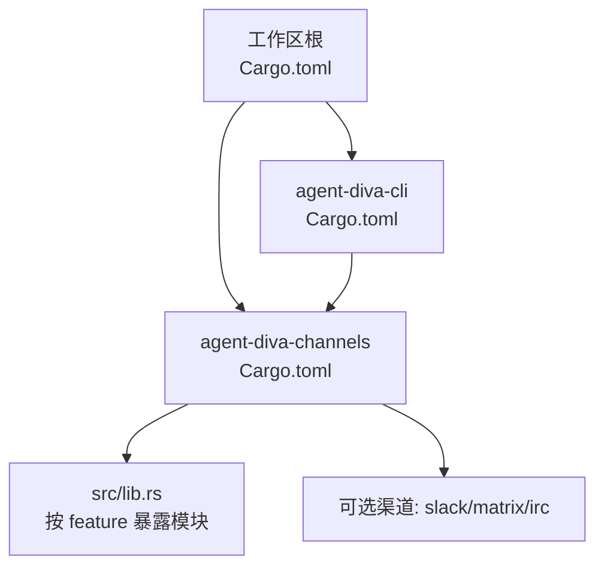
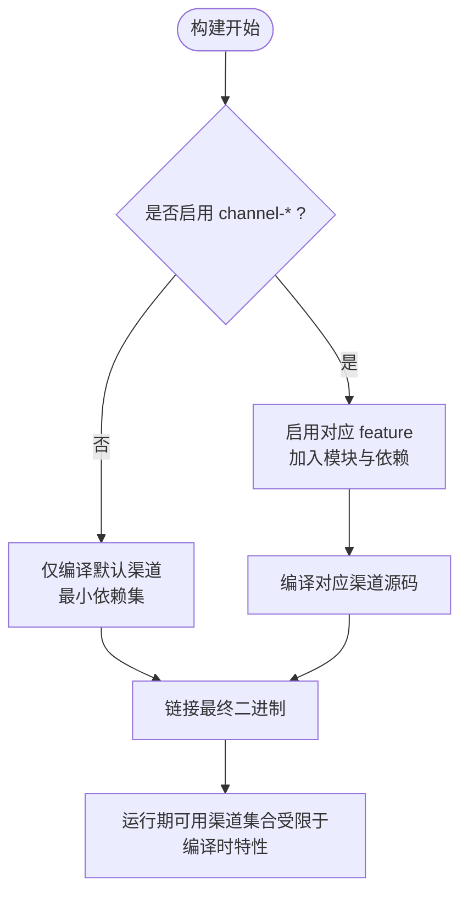
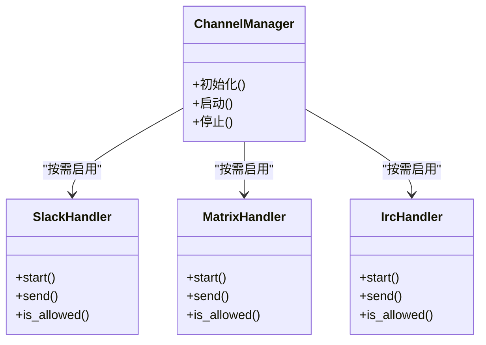
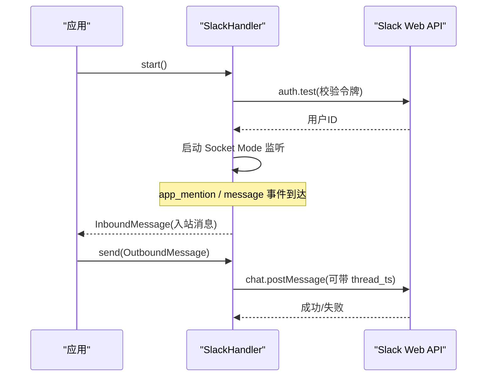
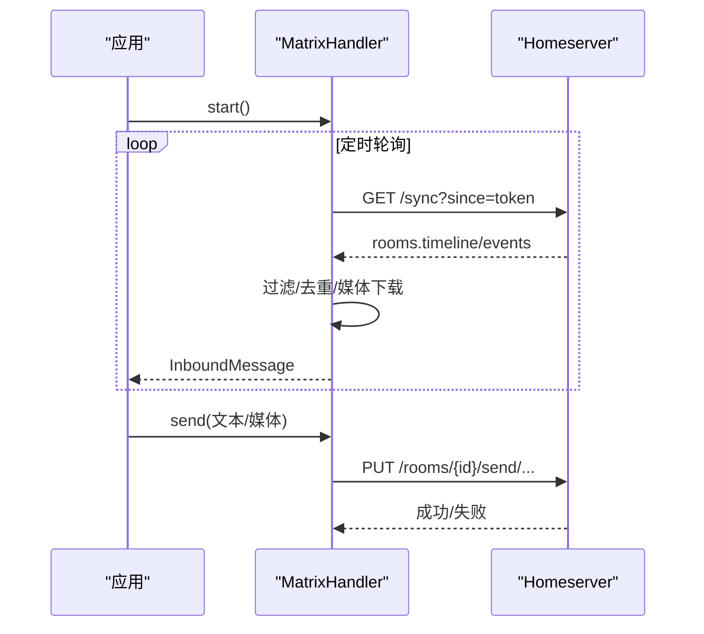
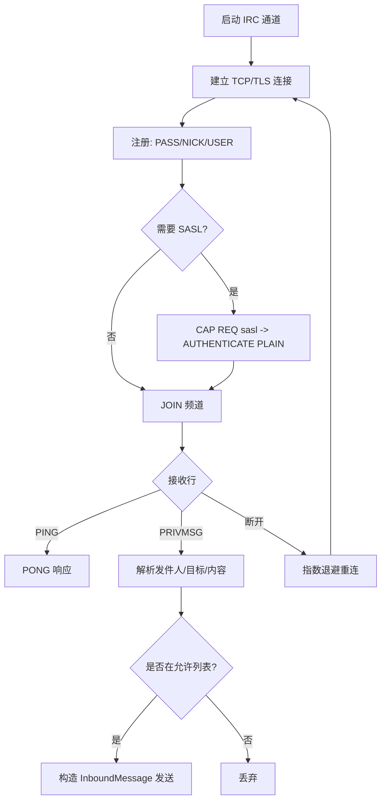
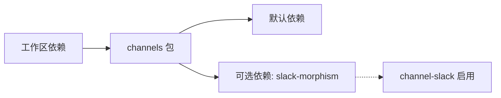

# 特性门控

<cite>
**本文引用的文件**
- [agent-diva-channels/Cargo.toml](file://agent-diva-channels/Cargo.toml)
- [agent-diva-channels/src/lib.rs](file://agent-diva-channels/src/lib.rs)
- [agent-diva-channels/agents.md](file://agent-diva-channels/agents.md)
- [Cargo.toml（工作区）](file://Cargo.toml)
- [agent-diva-cli/Cargo.toml](file://agent-diva-cli/Cargo.toml)
- [scripts/feature-gate-check.py](file://scripts/feature-gate-check.py)
- [scripts/feature-gate-check.ps1](file://scripts/feature-gate-check.ps1)
- [agent-diva-channels/src/slack.rs](file://agent-diva-channels/src/slack.rs)
- [agent-diva-channels/src/matrix.rs](file://agent-diva-channels/src/matrix.rs)
- [agent-diva-channels/src/irc.rs](file://agent-diva-channels/src/irc.rs)
</cite>

## 目录
1. [简介](#简介)
2. [项目结构](#项目结构)
3. [核心组件](#核心组件)
4. [架构总览](#架构总览)
5. [详细组件分析](#详细组件分析)
6. [依赖分析](#依赖分析)
7. [性能考虑](#性能考虑)
8. [故障排查指南](#故障排查指南)
9. [结论](#结论)
10. [附录：自定义渠道添加与特性门控配置指南](#附录自定义渠道添加与特性门控配置指南)

## 简介
本文件聚焦 agent-diva 的“特性门控”机制，重点说明 Cargo feature 在渠道模块中的使用方式，包括 channel-slack、channel-matrix、channel-irc 等可选特性的启用与配置；解释默认编译渠道与可选渠道的区别；并给出构建配置、依赖管理与编译优化策略。最后提供“新增自定义渠道”时的特性门控配置步骤与最佳实践。

## 项目结构
- 渠道能力集中在 agent-diva-channels 包中，通过 Cargo features 控制各渠道源码是否参与编译。
- 工作区根 Cargo.toml 统一声明 workspace 成员与共享依赖版本，便于跨 crate 复用。
- CLI 与服务入口通过依赖 channels 包，但默认不引入可选渠道，除非显式开启对应 feature。

图表来源
- [Cargo.toml（工作区）:1-20](file://Cargo.toml#L1-L20)
- [agent-diva-cli/Cargo.toml:15-24](file://agent-diva-cli/Cargo.toml#L15-L24)
- [agent-diva-channels/Cargo.toml:11-20](file://agent-diva-channels/Cargo.toml#L11-L20)
- [agent-diva-channels/src/lib.rs:15-30](file://agent-diva-channels/src/lib.rs#L15-L30)

章节来源
- [Cargo.toml（工作区）:1-20](file://Cargo.toml#L1-L20)
- [agent-diva-cli/Cargo.toml:15-24](file://agent-diva-cli/Cargo.toml#L15-L24)
- [agent-diva-channels/Cargo.toml:11-20](file://agent-diva-channels/Cargo.toml#L11-L20)

## 核心组件
- 渠道抽象与运行时管理：ChannelHandler trait、BaseChannel、ChannelManager（由 channels 包提供）。
- 渠道实现：每个平台一个 Handler，如 SlackHandler、MatrixHandler、IrcHandler。
- 特性门控：通过 Cargo features 控制模块与依赖是否参与编译，从而控制最终二进制体积与启动开销。

章节来源
- [agent-diva-channels/agents.md:33-65](file://agent-diva-channels/agents.md#L33-L65)
- [agent-diva-channels/src/lib.rs:9-52](file://agent-diva-channels/src/lib.rs#L9-L52)

## 架构总览
下图展示了“特性门控”如何影响编译产物与运行期能力：

图表来源
- [agent-diva-channels/Cargo.toml:11-20](file://agent-diva-channels/Cargo.toml#L11-L20)
- [agent-diva-channels/src/lib.rs:15-30](file://agent-diva-channels/src/lib.rs#L15-L30)

## 详细组件分析

### 渠道特性与模块门控
- 在 agent-diva-channels/Cargo.toml 中定义 features：channel-slack、channel-whatsapp、channel-matrix、channel-irc、channel-mattermost、channel-nextcloud-talk，默认均为空（不启用）。
- 在 src/lib.rs 中使用 #[cfg(feature = "...")] 条件编译模块与 re-export，确保未启用的渠道不会进入最终二进制。

图表来源
- [agent-diva-channels/Cargo.toml:11-20](file://agent-diva-channels/Cargo.toml#L11-L20)
- [agent-diva-channels/src/lib.rs:15-30](file://agent-diva-channels/src/lib.rs#L15-L30)

章节来源
- [agent-diva-channels/Cargo.toml:11-20](file://agent-diva-channels/Cargo.toml#L11-L20)
- [agent-diva-channels/src/lib.rs:15-30](file://agent-diva-channels/src/lib.rs#L15-L30)

### Slack 渠道（channel-slack）
- 依赖门控：feature 启用后引入 slack-morphism 依赖。
- 行为要点：Socket Mode 连接、app_mention 事件处理、消息发送（支持线程回复）、Markdown→mrkdwn 转换、群组/DM 白名单策略。
- 错误处理：认证失败、连接失败、发送失败均有明确错误类型。

图表来源
- [agent-diva-channels/src/slack.rs:419-617](file://agent-diva-channels/src/slack.rs#L419-L617)

章节来源
- [agent-diva-channels/src/slack.rs:419-617](file://agent-diva-channels/src/slack.rs#L419-L617)

### Matrix 渠道（channel-matrix）
- 依赖门控：feature 启用后编译 matrix 模块。
- 行为要点：轮询 sync、去重处理、媒体下载与上传、文本/媒体发送、E2EE 开关提示、大小限制保护。
- 错误处理：同步失败、上传失败、发送失败均返回错误。

图表来源
- [agent-diva-channels/src/matrix.rs:116-242](file://agent-diva-channels/src/matrix.rs#L116-L242)
- [agent-diva-channels/src/matrix.rs:300-432](file://agent-diva-channels/src/matrix.rs#L300-L432)

章节来源
- [agent-diva-channels/src/matrix.rs:116-242](file://agent-diva-channels/src/matrix.rs#L116-L242)
- [agent-diva-channels/src/matrix.rs:300-432](file://agent-diva-channels/src/matrix.rs#L300-L432)

### IRC 渠道（channel-irc）
- 依赖门控：feature 启用后编译 irc 模块。
- 行为要点：TCP/TLS 连接、SASL 认证、注册流程、JOIN 频道、PRIVMSG 收发、断线指数退避重连、消息分片发送。
- 错误处理：连接/读取超时、TLS 握手失败、认证失败等。

图表来源
- [agent-diva-channels/src/irc.rs:187-280](file://agent-diva-channels/src/irc.rs#L187-L280)
- [agent-diva-channels/src/irc.rs:284-476](file://agent-diva-channels/src/irc.rs#L284-L476)

章节来源
- [agent-diva-channels/src/irc.rs:187-280](file://agent-diva-channels/src/irc.rs#L187-L280)
- [agent-diva-channels/src/irc.rs:284-476](file://agent-diva-channels/src/irc.rs#L284-L476)

## 依赖分析
- 工作区依赖：workspace.dependencies 集中管理 tokio、reqwest、tracing 等通用依赖版本，保证一致性。
- channels 包依赖：
  - 默认依赖：core、providers、异步运行时、序列化、HTTP/WebSocket、日志、TLS、邮件、飞书等。
  - 可选依赖：slack-morphism（仅在 channel-slack 启用时引入）。
- 构建产物差异：
  - 默认构建：不包含 slack/matrix/irc 等可选渠道及其重型依赖，二进制更小、编译更快。
  - 启用特定 feature：仅引入所需渠道依赖，避免无关代码膨胀。

图表来源
- [Cargo.toml（工作区）:27-110](file://Cargo.toml#L27-L110)
- [agent-diva-channels/Cargo.toml:22-44](file://agent-diva-channels/Cargo.toml#L22-L44)

章节来源
- [Cargo.toml（工作区）:27-110](file://Cargo.toml#L27-L110)
- [agent-diva-channels/Cargo.toml:22-44](file://agent-diva-channels/Cargo.toml#L22-L44)

## 性能考虑
- 编译期裁剪：通过 feature 关闭未使用的渠道，减少依赖树与编译时间。
- 运行期资源：未编译的渠道不会占用内存或启动任务，降低运行时开销。
- 发布优化：工作区 release profile 已启用 LTO、strip、单 codegen unit，进一步减小体积并提升执行效率。

章节来源
- [Cargo.toml（工作区）:101-110](file://Cargo.toml#L101-L110)
- [agent-diva-channels/agents.md:53-65](file://agent-diva-channels/agents.md#L53-L65)

## 故障排查指南
- 构建失败：确认是否启用了正确的 feature；检查 cargo check/build 命令是否包含 --features。
- 运行时缺失功能：若渠道未编译，则无法在运行期发现与启动；需重新以对应 feature 构建。
- 测试隔离：某些测试需要特定 feature（例如 whatsapp 集成测试），请按需启用。
- 自动化校验：可使用 scripts/feature-gate-check.py（及 .ps1 包装）进行多组合特性门控校验。

章节来源
- [agent-diva-channels/Cargo.toml:81-84](file://agent-diva-channels/Cargo.toml#L81-L84)
- [scripts/feature-gate-check.py:22-123](file://scripts/feature-gate-check.py#L22-L123)
- [scripts/feature-gate-check.ps1:1-2](file://scripts/feature-gate-check.ps1#L1-L2)

## 结论
通过 Cargo feature 对渠道进行细粒度门控，既能保持默认构建的最小化与高性能，又能按需启用 Slack、Matrix、IRC 等渠道，满足多样化部署需求。配合工作区依赖管理与发布优化，可在开发、测试与生产环境中获得一致的体验与可控的二进制体积。

## 附录：自定义渠道添加与特性门控配置指南
- 新增渠道源文件：在 agent-diva-channels/src/ 下创建 <channel>.rs，实现 ChannelHandler。
- 声明 feature：在 agent-diva-channels/Cargo.toml 的 [features] 中添加 channel-<name>，并在 dependencies 中标注 optional 依赖（如有）。
- 条件编译模块：在 src/lib.rs 中使用 #[cfg(feature = "channel-<name>")] 包裹模块声明与 re-export。
- 注册到管理器：在 ChannelManager 的验证与构建逻辑中增加对应分支，遵循 agents.md 约定。
- 测试隔离：如需专属测试，参考 [[test]] required-features 模式，将测试限定在启用该 feature 时才编译。
- 构建示例：
  - 仅启用单个渠道：cargo build -p agent-diva-channels --features channel-<name>
  - 同时启用多个渠道：cargo build -p agent-diva-channels --features channel-slack,channel-matrix,channel-irc
- 默认渠道与可选渠道区别：
  - 默认渠道：无需任何 feature 即可编译与运行（当前 channels 包默认无渠道 feature 为 true）。
  - 可选渠道：必须显式启用对应 feature 才会参与编译与运行。

章节来源
- [agent-diva-channels/agents.md:33-65](file://agent-diva-channels/agents.md#L33-L65)
- [agent-diva-channels/Cargo.toml:11-20](file://agent-diva-channels/Cargo.toml#L11-L20)
- [agent-diva-channels/src/lib.rs:15-30](file://agent-diva-channels/src/lib.rs#L15-L30)