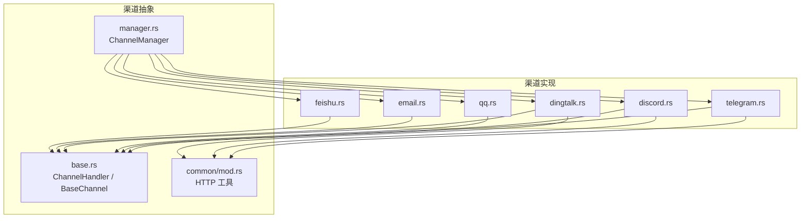
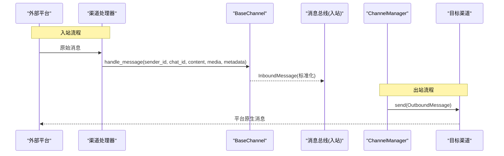
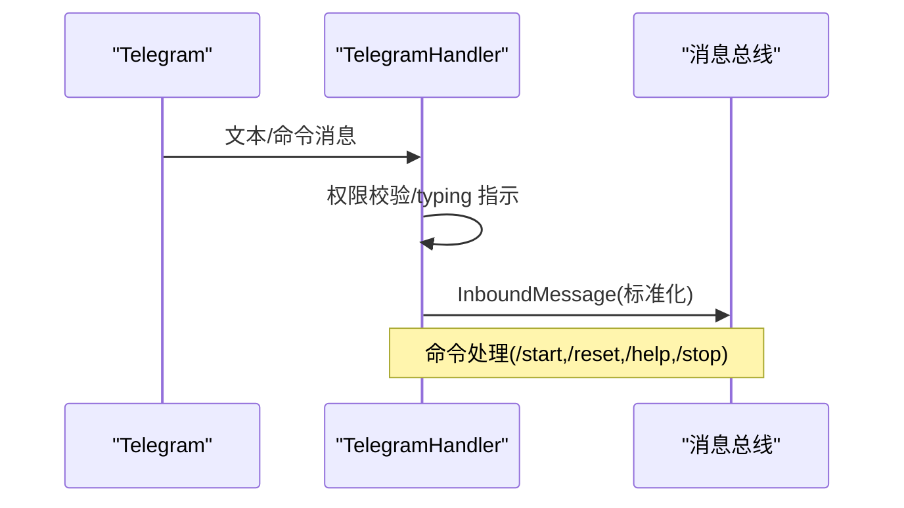
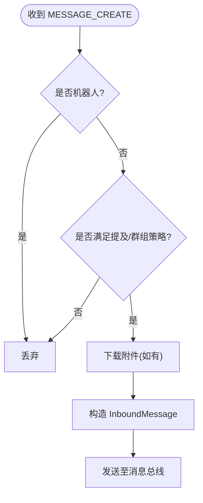
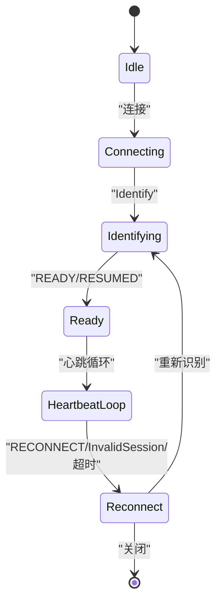
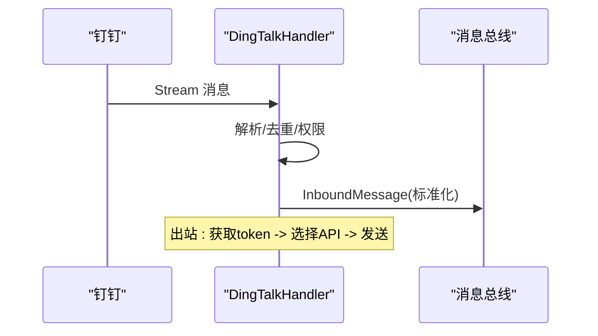
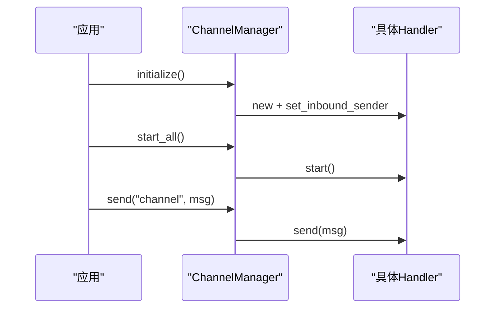
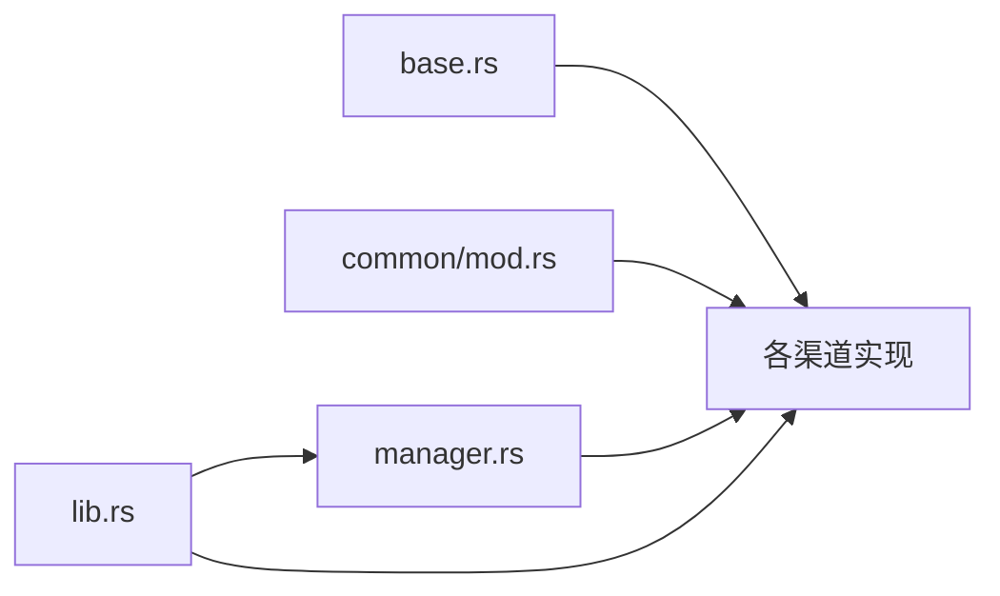

# 聊天渠道适配器

<cite>
**本文引用的文件**
- [agent-diva-channels/src/lib.rs](file://agent-diva-channels/src/lib.rs)
- [agent-diva-channels/src/base.rs](file://agent-diva-channels/src/base.rs)
- [agent-diva-channels/src/manager.rs](file://agent-diva-channels/src/manager.rs)
- [agent-diva-channels/src/common/mod.rs](file://agent-diva-channels/src/common/mod.rs)
- [agent-diva-channels/src/telegram.rs](file://agent-diva-channels/src/telegram.rs)
- [agent-diva-channels/src/discord.rs](file://agent-diva-channels/src/discord.rs)
- [agent-diva-channels/src/qq.rs](file://agent-diva-channels/src/qq.rs)
- [agent-diva-channels/src/dingtalk.rs](file://agent-diva-channels/src/dingtalk.rs)
- [agent-diva-channels/src/email.rs](file://agent-diva-channels/src/email.rs)
- [agent-diva-channels/src/feishu.rs](file://agent-diva-channels/src/feishu.rs)
</cite>

## 目录
1. [简介](#简介)
2. [项目结构](#项目结构)
3. [核心组件](#核心组件)
4. [架构总览](#架构总览)
5. [详细组件分析](#详细组件分析)
6. [依赖关系分析](#依赖关系分析)
7. [性能与可靠性](#性能与可靠性)
8. [故障排查指南](#故障排查指南)
9. [结论](#结论)
10. [附录：新平台接入指南](#附录：新平台接入指南)

## 简介
本仓库的 agent-diva-channels 模块提供统一的聊天渠道适配层，屏蔽不同平台（Telegram、Discord、QQ、钉钉、飞书、邮件等）的差异，将各平台消息统一为内部 InboundMessage/OutboundMessage，并通过 ChannelManager 进行生命周期管理、路由与状态协调。该设计使上层业务无需关心具体平台实现细节，即可在多平台间无缝收发消息。

## 项目结构
- 抽象与基础设施
  - base.rs：ChannelHandler trait、BaseChannel 公共能力（权限白名单、入站消息转发、错误类型）。
  - common/mod.rs：HTTP 客户端构建、媒体下载等通用工具。
  - manager.rs：ChannelManager 负责按配置初始化、启动/停止各渠道、发送消息、动态更新配置。
  - lib.rs：对外导出各渠道 Handler 与基础类型，并声明可选 feature 编译的退役通道。
- 渠道实现
  - telegram.rs、discord.rs、qq.rs、dingtalk.rs、email.rs、feishu.rs 等分别实现各自平台的连接、鉴权、消息收发与格式转换。
  - 部分渠道（Slack、Matrix、IRC、Mattermost、Nextcloud Talk、WhatsApp）默认不编译，需启用对应 feature 恢复。

图表来源
- [agent-diva-channels/src/manager.rs:1-800](file://agent-diva-channels/src/manager.rs#L1-L800)
- [agent-diva-channels/src/base.rs:1-422](file://agent-diva-channels/src/base.rs#L1-L422)
- [agent-diva-channels/src/common/mod.rs:1-52](file://agent-diva-channels/src/common/mod.rs#L1-L52)

章节来源
- [agent-diva-channels/src/lib.rs:1-53](file://agent-diva-channels/src/lib.rs#L1-L53)
- [agent-diva-channels/src/manager.rs:1-800](file://agent-diva-channels/src/manager.rs#L1-L800)

## 核心组件
- ChannelHandler 抽象
  - 定义 name、is_running、start、stop、send、set_inbound_sender、is_allowed 等统一接口，所有渠道均需实现。
- BaseChannel 公共能力
  - 提供 allow_from 白名单策略（支持通配符与复合 ID）、deny_by_default 默认拒绝策略、handle_message 统一封装入站消息并转发到 inbound channel。
- ChannelManager 管理器
  - 根据配置校验并实例化各渠道；集中 start_all/stop_all；按名称路由 OutboundMessage；支持运行时 update_channel 热更新。
- 通用工具
  - create_http_client、download_file 等，用于 HTTP 请求与媒体下载。

章节来源
- [agent-diva-channels/src/base.rs:1-422](file://agent-diva-channels/src/base.rs#L1-L422)
- [agent-diva-channels/src/manager.rs:1-800](file://agent-diva-channels/src/manager.rs#L1-L800)
- [agent-diva-channels/src/common/mod.rs:1-52](file://agent-diva-channels/src/common/mod.rs#L1-L52)

## 架构总览
下图展示从外部平台到内部消息总线的数据流，以及 Manager 如何调度各渠道。

图表来源
- [agent-diva-channels/src/base.rs:186-229](file://agent-diva-channels/src/base.rs#L186-L229)
- [agent-diva-channels/src/manager.rs:688-697](file://agent-diva-channels/src/manager.rs#L688-L697)

## 详细组件分析

### Telegram 渠道
- 连接与事件
  - 使用 teloxide Dispatcher 接收消息与命令；维护 typing indicator 任务；建立 chat_id 映射以便回复。
- 权限控制
  - 支持 allow_from 白名单与复合 ID（如 user_id|username）。
- 消息格式转换
  - 将 Markdown 转换为 Telegram HTML（代码块、链接、粗体、斜体、删除线等），失败时回退为纯文本。
- 出站发送
  - 通过 Bot.send_message 发送，自动停止 typing 指示器。

图表来源
- [agent-diva-channels/src/telegram.rs:405-758](file://agent-diva-channels/src/telegram.rs#L405-L758)

章节来源
- [agent-diva-channels/src/telegram.rs:1-800](file://agent-diva-channels/src/telegram.rs#L1-L800)

### Discord 渠道
- 连接与会话
  - 通过 Gateway WebSocket 长连接；维护 sequence、session_id；心跳与重连；支持 Reconnect/InvalidSession 处理。
- 权限与过滤
  - 支持 mention_only、群组触发白名单 group_reply_allowed_sender_ids；忽略机器人消息。
- 附件与分片
  - 下载附件至本地媒体目录；超长消息按 2000 字符限制分片发送；支持 reply_to。
- 速率限制
  - 对 429 Too Many Requests 读取 retry-after 并等待重试。

图表来源
- [agent-diva-channels/src/discord.rs:335-442](file://agent-diva-channels/src/discord.rs#L335-L442)
- [agent-diva-channels/src/discord.rs:698-748](file://agent-diva-channels/src/discord.rs#L698-L748)

章节来源
- [agent-diva-channels/src/discord.rs:1-800](file://agent-diva-channels/src/discord.rs#L1-L800)

### QQ 渠道
- 连接与会话
  - WebSocket Gateway；支持 Identify/Resume；心跳 ACK 超时检测；InvalidSession 指数退避与冷却期。
- 去重与权限
  - 基于消息 ID 的去重队列；allow_from 白名单。
- 认证与网关
  - 自动获取 access_token；可环境变量覆盖 API/Gateway URL。

图表来源
- [agent-diva-channels/src/qq.rs:429-750](file://agent-diva-channels/src/qq.rs#L429-L750)

章节来源
- [agent-diva-channels/src/qq.rs:1-800](file://agent-diva-channels/src/qq.rs#L1-L800)

### 钉钉渠道
- 连接模式
  - Stream Mode：通过 HTTP 注册连接获取 endpoint/ticket，再建立 WebSocket；无需公网 IP。
- 鉴权与发送
  - 获取 accessToken 并缓存；支持私聊/群聊发送；图片直链或上传后发送；其他媒体上传后发送。
- 去重与权限
  - 消息 ID 去重；dm_policy/group_policy 控制允许范围；allow_from 白名单。

图表来源
- [agent-diva-channels/src/dingtalk.rs:274-323](file://agent-diva-channels/src/dingtalk.rs#L274-L323)
- [agent-diva-channels/src/dingtalk.rs:389-516](file://agent-diva-channels/src/dingtalk.rs#L389-L516)
- [agent-diva-channels/src/dingtalk.rs:605-777](file://agent-diva-channels/src/dingtalk.rs#L605-L777)

章节来源
- [agent-diva-channels/src/dingtalk.rs:1-800](file://agent-diva-channels/src/dingtalk.rs#L1-L800)

### 飞书渠道
- 连接与帧编码
  - 使用 pbbp2.proto 自定义帧（CONTROL/DATA）；服务端返回 PingInterval；支持事件去重 TTL。
- 鉴权与发送
  - 获取 tenant_access_token；HTTP 发送消息。
- 权限与去重
  - allow_from 白名单；event_id/message_id 去重。

章节来源
- [agent-diva-channels/src/feishu.rs:1-200](file://agent-diva-channels/src/feishu.rs#L1-L200)

### 邮件渠道
- 收信与发信
  - IMAP 轮询（阻塞操作在后台任务执行）；SMTP 回复；HTML 转纯文本；主题前缀处理。
- 去重与权限
  - 基于 UID 去重；allow_from 白名单。

章节来源
- [agent-diva-channels/src/email.rs:1-200](file://agent-diva-channels/src/email.rs#L1-L200)

### 渠道管理器（ChannelManager）
- 初始化与启动
  - 依据配置逐项校验并创建 Handler；注入 inbound_tx；调用 start。
- 运行期管理
  - stop_all 安全停止；update_channel 热更新（先停旧再启新）；list_channels/is_channel_running 查询。
- 消息路由
  - send(channel, message) 按名称路由到具体 Handler。

图表来源
- [agent-diva-channels/src/manager.rs:377-642](file://agent-diva-channels/src/manager.rs#L377-L642)
- [agent-diva-channels/src/manager.rs:688-735](file://agent-diva-channels/src/manager.rs#L688-L735)

章节来源
- [agent-diva-channels/src/manager.rs:1-800](file://agent-diva-channels/src/manager.rs#L1-L800)

## 依赖关系分析
- 模块内依赖
  - 各 Handler 依赖 base.rs 的 ChannelHandler/BaseChannel；Manager 聚合所有 Handler；common 提供 HTTP 工具。
- 外部依赖
  - teloxide（Telegram）、tokio_tungstenite（WebSocket）、reqwest（HTTP）、mail_parser/native_tls（邮件）等。
- 特性开关
  - Slack、Matrix、IRC、Mattermost、Nextcloud Talk、WhatsApp 通过 feature 控制编译，默认退役。

图表来源
- [agent-diva-channels/src/lib.rs:1-53](file://agent-diva-channels/src/lib.rs#L1-L53)
- [agent-diva-channels/src/manager.rs:1-800](file://agent-diva-channels/src/manager.rs#L1-L800)

章节来源
- [agent-diva-channels/src/lib.rs:1-53](file://agent-diva-channels/src/lib.rs#L1-L53)

## 性能与可靠性
- 连接与心跳
  - Discord/QQ/钉钉/飞书均实现心跳与重连；Discord 支持 Reconnect/InvalidSession；QQ 具备指数退避与冷却期。
- 速率限制
  - Discord 针对 429 读取 retry-after 并重试；其他渠道可通过上层限流器配合。
- 资源清理
  - 停止 typing indicator、中止 dispatcher/handle、关闭 WebSocket 与任务句柄。
- 去重与幂等
  - QQ/钉钉/飞书/邮件均实现消息去重，避免重复处理。
- 媒体处理
  - 统一下载至本地媒体目录，避免重复网络开销；大小限制与错误提示。

[本节为通用指导，不直接分析具体文件]

## 故障排查指南
- 常见错误类型
  - NotConfigured/InvalidConfig：检查渠道配置字段是否齐全且有效。
  - ConnectionFailed/ConnectionError：检查网络、代理、证书、Gateway URL。
  - AuthError：检查 token/app_secret/client_id 等凭据。
  - SendError/SendFailed：检查平台 API 返回码与限流。
  - AccessDenied：检查 allow_from 白名单策略。
- 定位步骤
  - 查看日志中 skipped channel 的原因（缺失字段或未启用）。
  - 确认 inbound_tx 已正确注入，否则无法将消息推送到总线。
  - 对于 WebSocket 渠道，关注心跳 ACK 丢失、InvalidSession、Reconnect 次数。
  - 对于邮件渠道，确认 IMAP/SMTP 端口、TLS、邮箱名/密码。

章节来源
- [agent-diva-channels/src/base.rs:34-71](file://agent-diva-channels/src/base.rs#L34-L71)
- [agent-diva-channels/src/manager.rs:198-211](file://agent-diva-channels/src/manager.rs#L198-L211)

## 结论
agent-diva-channels 通过 ChannelHandler 抽象与 BaseChannel 公共能力，结合 ChannelManager 的统一编排，实现了多平台聊天渠道的解耦接入与统一消息流转。各渠道在连接稳定性、速率限制、去重与权限控制等方面均有完善实现，便于扩展新平台并保持系统一致性。

[本节为总结性内容，不直接分析具体文件]

## 附录：新平台接入指南
- 实现 ChannelHandler
  - 实现 name、is_running、start、stop、send、set_inbound_sender、is_allowed。
  - 复用 BaseChannel 的 is_allowed 与 handle_message 以简化权限与入站消息封装。
- 认证与连接
  - 在 start 中完成鉴权与连接建立；实现心跳/保活与断线重连；记录 session/seq 以支持恢复。
- 消息格式映射
  - 入站：将平台原始消息转为 InboundMessage（sender_id、chat_id、content、media、metadata）。
  - 出站：将 OutboundMessage 转换为平台原生格式（必要时做 Markdown/富文本转换）。
- 配置与注册
  - 在 manager.rs 的 build_updated_handler 中添加新渠道分支；在 initialize 中按配置创建并注入 inbound_tx。
  - 在 lib.rs 暴露新的 Handler 类型。
- 测试与发布
  - 编写单元测试覆盖权限、格式转换、异常路径。
  - 如需保留为可选编译项，参考现有 feature 开关方式。

章节来源
- [agent-diva-channels/src/base.rs:9-32](file://agent-diva-channels/src/base.rs#L9-L32)
- [agent-diva-channels/src/manager.rs:222-359](file://agent-diva-channels/src/manager.rs#L222-L359)
- [agent-diva-channels/src/lib.rs:9-52](file://agent-diva-channels/src/lib.rs#L9-L52)