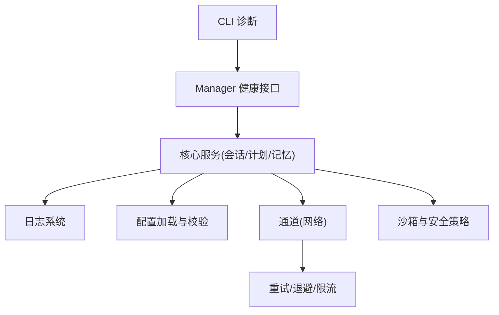
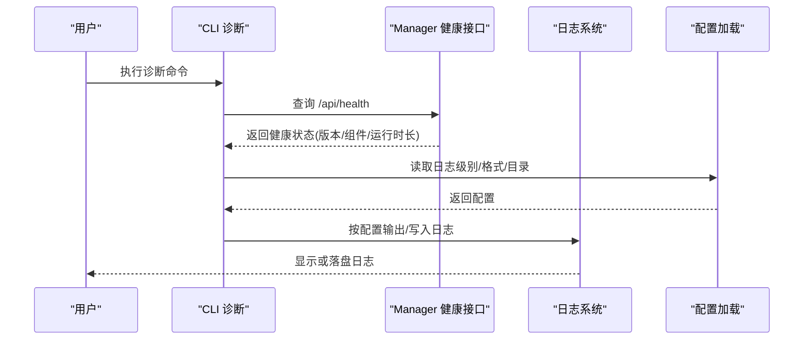
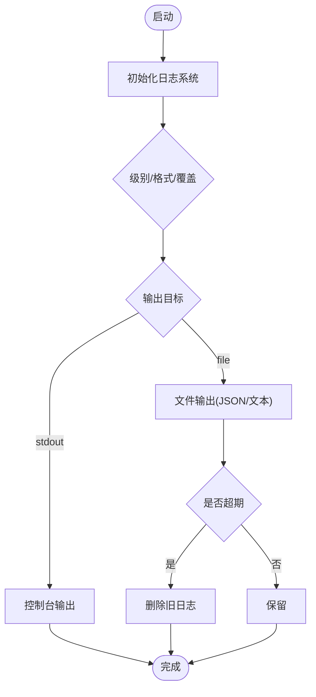
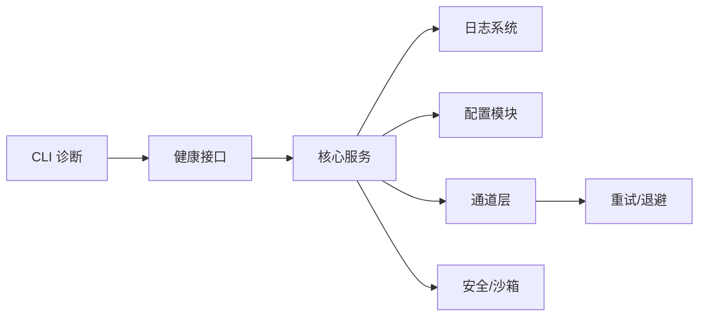

# 故障排除

<cite>
**本文引用的文件**
- [agent-diva-core/src/logging.rs](file://agent-diva-core/src/logging.rs)
- [agent-diva-core/src/config/schema.rs](file://agent-diva-core/src/config/schema.rs)
- [agent-diva-core/src/error.rs](file://agent-diva-core/src/error.rs)
- [agent-diva-core/src/error_category.rs](file://agent-diva-core/src/error_category.rs)
- [agent-diva-manager/src/handlers/health.rs](file://agent-diva-manager/src/handlers/health.rs)
- [agent-diva-cli/src/main.rs](file://agent-diva-cli/src/main.rs)
- [agent-diva-channels/src/base.rs](file://agent-diva-channels/src/base.rs)
- [agent-diva-providers/src/retry.rs](file://agent-diva-providers/src/retry.rs)
- [agent-diva-sandbox/src/guardian.rs](file://agent-diva-sandbox/src/guardian.rs)
- [agent-diva-gui/src/components/settings/audit/RawLogTab.vue](file://agent-diva-gui/src/components/settings/audit/RawLogTab.vue)
- [scripts/archive/root-debug-artifacts/diagnose_files.ps1](file://scripts/archive/root-debug-artifacts/diagnose_files.ps1)
</cite>

## 目录
1. [简介](#简介)
2. [项目结构](#项目结构)
3. [核心组件](#核心组件)
4. [架构总览](#架构总览)
5. [详细组件分析](#详细组件分析)
6. [依赖关系分析](#依赖关系分析)
7. [性能注意事项](#性能注意事项)
8. [故障排除指南](#故障排除指南)
9. [结论](#结论)
10. [附录：错误代码对照表与解决建议](#附录错误代码对照表与解决建议)

## 简介
本指南面向运维、开发与终端用户，聚焦 Agent-Diva 的故障定位与恢复。内容覆盖日志采集与分析、关键日志位置、调试工具与诊断命令、性能问题识别与优化策略、网络连接/权限配置/内存使用等常见问题的排查步骤，并提供错误代码对照表与社区支持渠道指引。

## 项目结构
Agent-Diva 由多个 crate 组成，其中与故障排除密切相关的模块包括：
- 日志系统：统一初始化、输出格式、保留策略
- 配置与校验：全局配置项（含日志、通道、沙箱等）
- 健康检查：服务健康状态接口
- CLI 诊断：运行态信息与健康自检
- 通道与重试：网络连接、重连退避、限流
- 安全与沙箱：权限控制、熔断保护
- GUI 日志查看：原始日志解析与展示

**图表来源**
- [agent-diva-cli/src/main.rs:1586-1630](file://agent-diva-cli/src/main.rs#L1586-L1630)
- [agent-diva-manager/src/handlers/health.rs:197-232](file://agent-diva-manager/src/handlers/health.rs#L197-L232)
- [agent-diva-core/src/logging.rs:10-106](file://agent-diva-core/src/logging.rs#L10-L106)
- [agent-diva-core/src/config/schema.rs:511-557](file://agent-diva-core/src/config/schema.rs#L511-L557)
- [agent-diva-providers/src/retry.rs:247-306](file://agent-diva-providers/src/retry.rs#L247-L306)
- [agent-diva-sandbox/src/guardian.rs:497-540](file://agent-diva-sandbox/src/guardian.rs#L497-L540)

**章节来源**
- [agent-diva-core/src/logging.rs:10-106](file://agent-diva-core/src/logging.rs#L10-L106)
- [agent-diva-core/src/config/schema.rs:511-557](file://agent-diva-core/src/config/schema.rs#L511-L557)
- [agent-diva-manager/src/handlers/health.rs:197-232](file://agent-diva-manager/src/handlers/health.rs#L197-L232)
- [agent-diva-cli/src/main.rs:1586-1630](file://agent-diva-cli/src/main.rs#L1586-L1630)

## 核心组件
- 日志系统：支持级别、格式、模块覆盖、文件保留清理；默认输出到 logs 目录，可切换 JSON/文本。
- 配置模式：集中定义日志、通道、沙箱、报告等配置项，提供默认值与校验。
- 健康检查：返回版本、运行时长、组件就绪状态，便于外部监控。
- CLI 诊断：打印日志级别/格式、Provider/Channel 就绪情况、Cron/MCP 状态等。
- 通道与重试：支持断线重连、指数退避、无效会话冷却、限流。
- 安全与沙箱：路径/扩展名/注入检测、只读模式、熔断器记录拒绝次数。

**章节来源**
- [agent-diva-core/src/logging.rs:10-106](file://agent-diva-core/src/logging.rs#L10-L106)
- [agent-diva-core/src/config/schema.rs:511-557](file://agent-diva-core/src/config/schema.rs#L511-L557)
- [agent-diva-manager/src/handlers/health.rs:197-232](file://agent-diva-manager/src/handlers/health.rs#L197-L232)
- [agent-diva-cli/src/main.rs:1586-1630](file://agent-diva-cli/src/main.rs#L1586-L1630)
- [agent-diva-providers/src/retry.rs:247-306](file://agent-diva-providers/src/retry.rs#L247-L306)
- [agent-diva-sandbox/src/guardian.rs:497-540](file://agent-diva-sandbox/src/guardian.rs#L497-L540)

## 架构总览
下图展示了从 CLI 诊断到后端健康检查、日志系统与配置加载的整体交互流程。

**图表来源**
- [agent-diva-cli/src/main.rs:1586-1630](file://agent-diva-cli/src/main.rs#L1586-L1630)
- [agent-diva-manager/src/handlers/health.rs:197-232](file://agent-diva-manager/src/handlers/health.rs#L197-L232)
- [agent-diva-core/src/logging.rs:10-106](file://agent-diva-core/src/logging.rs#L10-L106)
- [agent-diva-core/src/config/schema.rs:511-557](file://agent-diva-core/src/config/schema.rs#L511-L557)

## 详细组件分析

### 日志系统
- 日志级别与格式：可通过环境变量覆盖默认级别与格式；支持模块级覆盖指令。
- 输出目标：同时输出到标准输出与文件；JSON/文本可选。
- 日志保留：自动清理超过保留天数的旧日志。
- GUI 日志解析：前端解析固定格式的日志行，提取时间戳、级别、线程、模块、消息与调用链。

**图表来源**
- [agent-diva-core/src/logging.rs:10-106](file://agent-diva-core/src/logging.rs#L10-L106)
- [agent-diva-core/src/logging.rs:108-163](file://agent-diva-core/src/logging.rs#L108-L163)
- [agent-diva-gui/src/components/settings/audit/RawLogTab.vue:76-105](file://agent-diva-gui/src/components/settings/audit/RawLogTab.vue#L76-L105)

**章节来源**
- [agent-diva-core/src/logging.rs:10-106](file://agent-diva-core/src/logging.rs#L10-L106)
- [agent-diva-core/src/logging.rs:108-163](file://agent-diva-core/src/logging.rs#L108-L163)
- [agent-diva-gui/src/components/settings/audit/RawLogTab.vue:76-105](file://agent-diva-gui/src/components/settings/audit/RawLogTab.vue#L76-L105)

### 配置与校验
- 日志配置：level、format、dir、overrides、retention_days。
- 通道配置：各通道启用标志、凭据、白名单、网关地址等。
- 沙箱配置：执行模式、网络访问、审批策略、超时、受保护路径等。
- 报告配置：LLM 策展开关、模型/语言/超时等。

**章节来源**
- [agent-diva-core/src/config/schema.rs:511-557](file://agent-diva-core/src/config/schema.rs#L511-L557)
- [agent-diva-core/src/config/schema.rs:605-800](file://agent-diva-core/src/config/schema.rs#L605-L800)
- [agent-diva-core/src/config/schema.rs:378-463](file://agent-diva-core/src/config/schema.rs#L378-L463)

### 健康检查
- 健康接口返回版本、运行时长、组件就绪状态（如审计、定时任务、内存等）。
- 可用于容器编排探针、负载均衡健康探测。

**章节来源**
- [agent-diva-manager/src/handlers/health.rs:197-232](file://agent-diva-manager/src/handlers/health.rs#L197-L232)

### CLI 诊断
- 打印日志级别/格式、Provider/Channel 就绪情况、Cron/MCP 数量、健康状态等。
- 适合快速确认运行环境与配置有效性。

**章节来源**
- [agent-diva-cli/src/main.rs:1586-1630](file://agent-diva-cli/src/main.rs#L1586-L1630)

### 通道与重试
- QQ 通道：无效会话冷却、重连退避、环境变量覆盖延迟。
- Provider 重试：带监听器的重试机制，记录每次尝试的模型、次数、延迟。
- 基础通道：允许列表校验、主机合法性校验。

**章节来源**
- [agent-diva-channels/src/base.rs:390-421](file://agent-diva-channels/src/base.rs#L390-L421)
- [agent-diva-providers/src/retry.rs:247-306](file://agent-diva-providers/src/retry.rs#L247-L306)

### 安全与沙箱
- 熔断器：记录窗口内拒绝次数，达到阈值触发熔断并告警；批准则重置。
- 安全策略：只读模式、路径校验、禁止逃逸工作区等。

**章节来源**
- [agent-diva-sandbox/src/guardian.rs:497-540](file://agent-diva-sandbox/src/guardian.rs#L497-L540)

## 依赖关系分析
- CLI 依赖 Manager 健康接口获取运行时状态。
- 日志系统依赖配置模块决定级别、格式、目录与保留策略。
- 通道与 Provider 通过重试与退避提升稳定性。
- 安全与沙箱对操作进行约束，影响工具执行与文件系统访问。

**图表来源**
- [agent-diva-cli/src/main.rs:1586-1630](file://agent-diva-cli/src/main.rs#L1586-L1630)
- [agent-diva-manager/src/handlers/health.rs:197-232](file://agent-diva-manager/src/handlers/health.rs#L197-L232)
- [agent-diva-core/src/logging.rs:10-106](file://agent-diva-core/src/logging.rs#L10-L106)
- [agent-diva-core/src/config/schema.rs:511-557](file://agent-diva-core/src/config/schema.rs#L511-L557)
- [agent-diva-providers/src/retry.rs:247-306](file://agent-diva-providers/src/retry.rs#L247-L306)
- [agent-diva-sandbox/src/guardian.rs:497-540](file://agent-diva-sandbox/src/guardian.rs#L497-L540)

**章节来源**
- [agent-diva-cli/src/main.rs:1586-1630](file://agent-diva-cli/src/main.rs#L1586-L1630)
- [agent-diva-manager/src/handlers/health.rs:197-232](file://agent-diva-manager/src/handlers/health.rs#L197-L232)
- [agent-diva-core/src/logging.rs:10-106](file://agent-diva-core/src/logging.rs#L10-L106)
- [agent-diva-core/src/config/schema.rs:511-557](file://agent-diva-core/src/config/schema.rs#L511-L557)
- [agent-diva-providers/src/retry.rs:247-306](file://agent-diva-providers/src/retry.rs#L247-L306)
- [agent-diva-sandbox/src/guardian.rs:497-540](file://agent-diva-sandbox/src/guardian.rs#L497-L540)

## 性能注意事项
- 日志开销：高频率日志可能影响吞吐，建议生产环境使用 info/warn 级别，按需开启 debug/trace。
- 日志保留：合理设置 retention_days，避免磁盘占满导致 I/O 异常。
- 重试风暴：Provider 重试需配合退避与熔断，防止雪崩。
- 通道重连：QQ 等通道具备无效会话冷却与重连退避，注意观察重连频率。
- 内存与容量：记忆存储有记录数与内容大小上限，超限将报错；关注 GC 与清理策略。

[本节为通用指导，不直接分析具体文件]

## 故障排除指南

### 日志分析方法与关键日志位置
- 日志级别与格式：
  - 通过环境变量或配置调整级别与格式，便于快速定位问题。
  - 推荐生产环境使用 JSON 格式，便于结构化分析与检索。
- 日志目录与保留：
  - 默认日志目录为 logs，可按 retention_days 自动清理。
- GUI 日志查看：
  - 前端可解析固定格式的日志行，提取时间戳、级别、线程、模块、消息与调用链，便于在界面中筛选与定位。

**章节来源**
- [agent-diva-core/src/logging.rs:10-106](file://agent-diva-core/src/logging.rs#L10-L106)
- [agent-diva-core/src/logging.rs:108-163](file://agent-diva-core/src/logging.rs#L108-L163)
- [agent-diva-gui/src/components/settings/audit/RawLogTab.vue:76-105](file://agent-diva-gui/src/components/settings/audit/RawLogTab.vue#L76-L105)

### 调试工具与诊断命令
- CLI 诊断：
  - 查看日志级别/格式、Provider/Channel 就绪情况、Cron/MCP 数量、健康状态等。
- 健康接口：
  - 通过 /api/health 获取版本、运行时长、组件就绪状态，用于外部监控与自动化巡检。
- Windows 诊断脚本：
  - 检查进程、端口占用、API 连通性、示例文件读写等，辅助本地环境问题定位。

**章节来源**
- [agent-diva-cli/src/main.rs:1586-1630](file://agent-diva-cli/src/main.rs#L1586-L1630)
- [agent-diva-manager/src/handlers/health.rs:197-232](file://agent-diva-manager/src/handlers/health.rs#L197-L232)
- [scripts/archive/root-debug-artifacts/diagnose_files.ps1:64-102](file://scripts/archive/root-debug-artifacts/diagnose_files.ps1#L64-L102)

### 网络连接问题排查
- 通道可用性：
  - 检查通道 enabled 标志、凭据是否配置、allow_from 白名单是否包含发送者。
  - 主机合法性校验失败会直接报错，确保仅允许本地或可信地址。
- 重连与退避：
  - 通道断开后按退避策略重连；无效会话进入冷却期，避免频繁请求。
- Provider 重试：
  - 重试过程可监听每次尝试的模型、次数与延迟，便于分析网络抖动或服务端过载。

**章节来源**
- [agent-diva-channels/src/base.rs:390-421](file://agent-diva-channels/src/base.rs#L390-L421)
- [agent-diva-providers/src/retry.rs:247-306](file://agent-diva-providers/src/retry.rs#L247-L306)

### 权限配置问题排查
- 沙箱模式：
  - 只读模式禁止写操作；路径不在白名单或被黑名单阻止将被拒绝。
- 安全策略：
  - 路径校验、禁止逃逸工作区、禁止危险扩展名、注入检测等。
- 熔断器：
  - 连续拒绝达到阈值触发熔断，需检查上游依赖或配置是否正确。

**章节来源**
- [agent-diva-sandbox/src/guardian.rs:497-540](file://agent-diva-sandbox/src/guardian.rs#L497-L540)

### 内存使用问题排查
- 记忆存储容量：
  - 记录数与内容大小超过上限将报错；需关注清理策略与 GC。
- 上下文预算：
  - 上下文组装时若 Recall 内容过大，会被裁剪以维持预算；关注提示词长度与缓存命中率。
- 性能基线：
  - 大规模记录下的搜索与全文检索性能需关注 p95 延迟与内存峰值。

**章节来源**
- [agent-diva-laputa/src/typed_store.rs:992-1023](file://agent-diva-laputa/src/typed_store.rs#L992-L1023)

### 常见问题与解决步骤
- 无法连接 API：
  - 使用诊断脚本检查进程、端口占用与连通性；查看健康接口返回状态。
- 通道未就绪：
  - 检查通道 enabled、凭据、allow_from；查看 CLI 诊断输出的通道状态。
- 频繁重连：
  - 观察重连退避与无效会话冷却；检查网络质量与服务端限流。
- 权限被拒绝：
  - 检查沙箱模式、路径白名单、受保护路径与安全策略；必要时调整策略或放宽限制。
- 日志过多或过少：
  - 调整日志级别与模块覆盖；确认日志目录与保留策略。

[本节为通用指导，结合上述章节来源实施]

## 结论
通过统一的日志系统、健康检查、CLI 诊断、通道重试与安全沙箱，Agent-Diva 提供了完善的故障定位与恢复能力。建议在生产环境中：
- 使用结构化日志与合理的保留策略
- 定期巡检健康接口与 CLI 诊断输出
- 监控通道重连频率与 Provider 重试次数
- 严格配置权限与沙箱策略，避免越权与安全风险

[本节为总结，不直接分析具体文件]

## 附录：错误代码对照表与解决建议

- 配置错误（Config）
  - 现象：启动失败或功能不可用
  - 排查：检查配置文件键值、必填字段、类型与范围
  - 参考：[错误类型定义:1-73](file://agent-diva-core/src/error.rs#L1-L73)

- I/O 错误（Io）
  - 现象：文件读写失败、超时
  - 排查：检查磁盘空间、权限、网络超时配置
  - 分类：超时归为 Timeout，其他多为可重试
  - 参考：[错误分类:34-51](file://agent-diva-core/src/error_category.rs#L34-L51)

- 序列化错误（Serialization）
  - 现象：JSON 解析失败
  - 排查：检查数据格式与版本兼容性
  - 参考：[错误类型定义:1-73](file://agent-diva-core/src/error.rs#L1-L73)

- 会话错误（Session）
  - 现象：会话忙或冲突
  - 排查：检查并发与会话生命周期
  - 分类：可重试
  - 参考：[错误分类:34-51](file://agent-diva-core/src/error_category.rs#L34-L51)

- 通道错误（Channel）
  - 现象：消息收发失败
  - 排查：检查通道配置、凭据、白名单与网络
  - 分类：可重试
  - 参考：[错误分类:34-51](file://agent-diva-core/src/error_category.rs#L34-L51)

- Provider 错误（Provider）
  - 现象：LLM 调用失败
  - 排查：检查模型、密钥、限流与重试
  - 分类：可重试
  - 参考：[错误分类:34-51](file://agent-diva-core/src/error_category.rs#L34-L51)

- 工具执行错误（Tool）
  - 现象：工具调用失败
  - 排查：检查工具参数、权限与副作用
  - 分类：未知（需进一步分析）
  - 参考：[错误分类:34-51](file://agent-diva-core/src/error_category.rs#L34-L51)

- 验证错误（Validation）
  - 现象：输入不符合规则
  - 排查：检查业务规则与约束
  - 分类：致命
  - 参考：[错误分类:34-51](file://agent-diva-core/src/error_category.rs#L34-L51)

- 未找到（NotFound）
  - 现象：资源不存在
  - 排查：检查 ID、路径与生命周期
  - 分类：致命
  - 参考：[错误分类:34-51](file://agent-diva-core/src/error_category.rs#L34-L51)

- 未授权（Unauthorized）
  - 现象：鉴权失败
  - 排查：检查令牌、角色与权限策略
  - 分类：认证错误
  - 参考：[错误分类:34-51](file://agent-diva-core/src/error_category.rs#L34-L51)

- 内部错误（Internal）
  - 现象：系统内部异常
  - 排查：收集日志与堆栈，定位代码缺陷
  - 分类：未知（需进一步分析）
  - 参考：[错误分类:34-51](file://agent-diva-core/src/error_category.rs#L34-L51)

- 安全相关错误（SecurityError）
  - 注入检测、PII 泄露、只读模式、路径不允许、路径逃逸工作区、禁止组件、符号链接不允许、路径格式无效、文件过大、禁止扩展名等
  - 分类：多为致命
  - 参考：[错误分类:55-73](file://agent-diva-core/src/error_category.rs#L55-L73)

**章节来源**
- [agent-diva-core/src/error.rs:1-73](file://agent-diva-core/src/error.rs#L1-L73)
- [agent-diva-core/src/error_category.rs:34-73](file://agent-diva-core/src/error_category.rs#L34-L73)